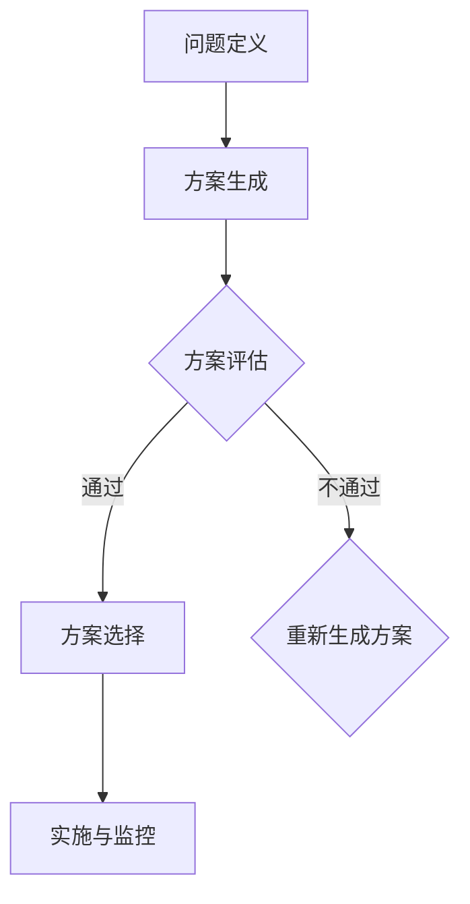

                 

# 领导力与决策科学应用：提高决策质量和速度

> 关键词：领导力、决策科学、质量、速度、人工智能、优化算法、数学模型、案例分析

> 摘要：本文将探讨领导力与决策科学在现代信息技术环境中的应用，通过深入分析决策过程中的核心概念、算法原理、数学模型，结合实际案例，展示如何通过科学的决策方法和工具提升决策质量和速度。文章旨在为管理者和技术人员提供有益的指导，帮助他们更好地应对复杂多变的工作环境。

## 1. 背景介绍

### 1.1 目的和范围

本文的目的是通过介绍领导力与决策科学的核心概念和原理，结合实际案例，帮助读者了解如何在实际工作中应用这些原理，从而提高决策质量和速度。文章的范围涵盖以下几个方面：

1. 领导力与决策科学的基本概念。
2. 决策过程中涉及的关键算法原理。
3. 数学模型在决策中的应用。
4. 实际案例分析和实战经验分享。
5. 相关工具和资源的推荐。

### 1.2 预期读者

本文的预期读者包括以下几类：

1. 企业管理者，特别是高层领导者。
2. 技术人员，尤其是涉及数据处理、算法开发的人员。
3. 研究生、本科生以及对决策科学感兴趣的读者。

### 1.3 文档结构概述

本文的结构如下：

1. 背景介绍
2. 核心概念与联系
3. 核心算法原理 & 具体操作步骤
4. 数学模型和公式 & 详细讲解 & 举例说明
5. 项目实战：代码实际案例和详细解释说明
6. 实际应用场景
7. 工具和资源推荐
8. 总结：未来发展趋势与挑战
9. 附录：常见问题与解答
10. 扩展阅读 & 参考资料

### 1.4 术语表

#### 1.4.1 核心术语定义

1. **领导力**：指领导者影响和激励他人实现共同目标的能力。
2. **决策科学**：运用数学、统计学、计算机科学等方法研究和优化决策过程。
3. **优化算法**：用于求解最优化问题的一类算法。
4. **数学模型**：用数学符号和公式描述现实世界问题的抽象模型。

#### 1.4.2 相关概念解释

1. **线性规划**：一类优化问题，目标是最小化或最大化线性目标函数，约束条件为线性不等式或等式。
2. **决策树**：一种图形化的决策模型，用于表示决策过程及其可能的结果。
3. **神经网络**：一种模仿人脑神经元结构和功能的计算模型。

#### 1.4.3 缩略词列表

- AI：人工智能
- ML：机器学习
- DL：深度学习
- LP：线性规划

## 2. 核心概念与联系

### 2.1 决策科学的核心概念

决策科学的核心概念包括以下几个：

1. **目标**：决策者希望实现的结果。
2. **方案**：实现目标的可行方法。
3. **约束**：限制决策者选择方案的条件。
4. **风险**：决策方案可能带来的不确定性和损失。

### 2.2 决策过程

决策过程通常包括以下几个步骤：

1. **问题定义**：明确决策需要解决的问题。
2. **方案生成**：列举所有可能的解决方案。
3. **方案评估**：评估各个方案的优缺点。
4. **方案选择**：根据评估结果选择最佳方案。
5. **实施与监控**：执行决策方案，并持续监控效果。

### 2.3 决策科学的应用

决策科学在多个领域有广泛的应用，如：

1. **企业管理**：帮助企业制定战略规划、预算编制、资源配置等。
2. **金融投资**：用于股票市场预测、风险控制、投资组合优化等。
3. **医疗健康**：辅助医生进行疾病诊断、治疗方案选择等。
4. **交通物流**：优化交通流量、配送路径规划等。

### 2.4 Mermaid 流程图

以下是决策科学中一个简单的Mermaid流程图：



## 3. 核心算法原理 & 具体操作步骤

### 3.1 优化算法原理

优化算法是一类用于求解最优化问题的算法。常见的优化算法包括：

1. **线性规划**：用于求解线性目标函数在线性约束条件下的最优解。
2. **遗传算法**：基于生物进化的原理，通过种群进化求解最优化问题。
3. **神经网络**：通过多层非线性变换，学习输入与输出之间的映射关系。

### 3.2 线性规划算法原理

线性规划是一种优化算法，用于求解线性目标函数在线性约束条件下的最优解。其基本原理如下：

1. **目标函数**：表示决策者希望最大化或最小化的量。
2. **约束条件**：限制决策者选择的方案。
3. **求解方法**：利用单纯形法、内点法等求解最优解。

### 3.3 伪代码实现

以下是线性规划问题的伪代码实现：

```plaintext
输入：目标函数C，约束条件A，b，x的下界和上界
输出：最优解x

初始化：x = 下界
        x_current = x
        objective_value = C * x

while（true）{
    if（满足所有约束条件）{
        break
    }
    else{
        选择违反约束条件的变量
        更新x
        更新objective_value
    }
}

输出：最优解x和目标函数值objective_value
```

### 3.4 遗传算法原理

遗传算法是一种基于生物进化的优化算法。其基本原理如下：

1. **种群初始化**：随机生成一组解作为初始种群。
2. **适应度评估**：计算每个解的适应度值。
3. **选择**：根据适应度值选择优秀解进行繁殖。
4. **交叉**：将选中的解进行交叉操作，产生新解。
5. **变异**：对交叉后的解进行变异操作。
6. **迭代**：重复适应度评估、选择、交叉和变异过程，直到满足终止条件。

### 3.5 遗传算法伪代码

以下是遗传算法的伪代码实现：

```plaintext
输入：种群大小N，迭代次数T，交叉率p，变异率q
输出：最优解

初始化：种群S
        最优解x = 种群S中适应度最高的解

for i = 1 to T{
    适应度评估
    选择操作
    交叉操作
    变异操作
    更新最优解
}

输出：最优解x
```

## 4. 数学模型和公式 & 详细讲解 & 举例说明

### 4.1 数学模型概述

在决策科学中，数学模型用于描述决策问题的结构和目标。以下是一些常用的数学模型：

1. **线性规划模型**：
   $$\text{maximize/minimize} \, c^T x$$
   $$\text{subject to} \, Ax \le b$$

2. **整数规划模型**：
   $$\text{maximize/minimize} \, c^T x$$
   $$\text{subject to} \, Ax \le b$$
   $$x \in \{0,1\}^n$$

3. **动态规划模型**：
   $$\text{maximize/minimize} \, \sum_{t=0}^{T} f(x_t)$$
   $$\text{subject to} \, g(x_{t+1} | x_t) \le 0$$

4. **神经网络模型**：
   $$a^{(L)} = \sigma(z^{(L)})$$
   $$z^{(L)} = W^{(L)} a^{(L-1)} + b^{(L)}$$

### 4.2 线性规划模型讲解

线性规划模型的目标是最小化或最大化线性目标函数，同时满足线性约束条件。以下是一个简单的例子：

**问题**：给定以下线性规划问题，求解最优解。
$$\text{maximize} \, 3x_1 + 2x_2$$
$$\text{subject to}$$
$$x_1 + x_2 \le 4$$
$$2x_1 + x_2 \le 6$$
$$x_1, x_2 \ge 0$$

**解法**：

1. **目标函数**：$3x_1 + 2x_2$
2. **约束条件**：
   - $x_1 + x_2 \le 4$
   - $2x_1 + x_2 \le 6$
   - $x_1, x_2 \ge 0$
3. **求解**：使用单纯形法求解。

### 4.3 动态规划模型讲解

动态规划是一种解决多阶段决策问题的方法。以下是一个简单的例子：

**问题**：给定一个数列$C_0, C_1, ..., C_{n-1}$，求解最大子序列和。

$$\text{maximize} \, \sum_{t=0}^{n-1} C_t$$

**解法**：

1. **状态定义**：$f(t) = \text{max subsequence sum ending at t}$
2. **状态转移方程**：$f(t) = \max(f(t-1) + C_t, C_t)$
3. **初始化**：$f(0) = C_0$
4. **求解**：从$t = 1$到$t = n-1$依次计算$f(t)$。

### 4.4 神经网络模型讲解

神经网络是一种模拟人脑神经元结构和功能的计算模型。以下是一个简单的例子：

**问题**：给定输入$x_1, x_2$，求解输出$y$。

$$y = \sigma(W_2 \cdot \sigma(W_1 \cdot x + b_1) + b_2)$$

**解法**：

1. **激活函数**：$\sigma(z) = \frac{1}{1 + e^{-z}}$
2. **前向传播**：
   - $z_1 = W_1 \cdot x + b_1$
   - $a_1 = \sigma(z_1)$
   - $z_2 = W_2 \cdot a_1 + b_2$
   - $y = \sigma(z_2)$

## 5. 项目实战：代码实际案例和详细解释说明

### 5.1 开发环境搭建

为了演示如何应用决策科学中的算法，我们将在Python环境中实现一个简单的线性规划问题。以下是搭建开发环境所需的步骤：

1. 安装Python（建议使用Python 3.8及以上版本）。
2. 安装线性规划库——PuLP。
3. 安装数据可视化库——matplotlib。

安装命令如下：

```bash
pip install pulp
pip install matplotlib
```

### 5.2 源代码详细实现和代码解读

以下是线性规划问题的源代码实现：

```python
import pulp
import matplotlib.pyplot as plt

# 定义变量
x1 = pulp.LpVariable('x1', cat='Continuous')
x2 = pulp.LpVariable('x2', cat='Continuous')

# 定义目标函数
prob = pulp.LpProblem("Linear Programming Problem", pulp.LpMaximize)

# 定义目标函数
prob += 3 * x1 + 2 * x2

# 定义约束条件
prob += x1 + x2 <= 4
prob += 2 * x1 + x2 <= 6

# 解线性规划问题
prob.solve()

# 输出结果
print("Status:", pulp.LpStatus[prob.status])
print("Optimal Value:", pulp.value(prob.objective))
print("x1:", x1.varValue)
print("x2:", x2.varValue)

# 绘制约束区域
plt.plot([0, 4], [0, 4], 'g--')
plt.plot([0, 3], [0, 6], 'g--')
plt.scatter(x1.varValue, x2.varValue, color='r')
plt.xlabel('x1')
plt.ylabel('x2')
plt.title('Linear Programming Solution')
plt.grid()
plt.show()
```

### 5.3 代码解读与分析

1. **变量定义**：使用PuLP库定义变量$x1$和$x2$，并指定$x1$和$x2$为连续变量。
2. **目标函数**：定义线性规划问题的目标函数为$3x1 + 2x2$，并使用`+=`添加到`prob`对象中。
3. **约束条件**：定义两个线性约束条件，并使用`+=`添加到`prob`对象中。
4. **求解问题**：调用`prob.solve()`方法求解线性规划问题。
5. **输出结果**：打印出问题的状态、最优值以及变量$x1$和$x2$的值。
6. **绘制约束区域**：使用matplotlib库绘制约束区域的图形。

通过上述步骤，我们可以看到如何将决策科学中的线性规划算法应用于实际问题，并通过代码实现求解最优解。

## 6. 实际应用场景

决策科学在各个领域都有广泛的应用，以下是一些实际应用场景：

1. **企业管理**：帮助企业制定生产计划、库存管理、供应链优化等。
   - **生产计划**：利用线性规划优化生产计划，提高生产效率和降低成本。
   - **库存管理**：通过动态规划模型优化库存管理，减少库存成本和缺货风险。
   - **供应链优化**：利用网络优化算法优化供应链，提高物流效率和降低成本。

2. **金融投资**：辅助投资决策，提高投资收益和风险控制。
   - **股票市场预测**：利用神经网络模型预测股票价格，帮助投资者制定投资策略。
   - **风险控制**：通过决策树模型分析风险因素，制定有效的风险控制策略。
   - **投资组合优化**：利用遗传算法优化投资组合，实现资产配置的最优化。

3. **医疗健康**：辅助医生进行疾病诊断、治疗方案选择等。
   - **疾病诊断**：利用决策树模型和神经网络模型辅助医生进行疾病诊断。
   - **治疗方案选择**：通过成本效益分析模型，为患者制定最佳的治疗方案。

4. **交通物流**：优化交通流量、配送路径规划等。
   - **交通流量控制**：利用动态规划模型优化交通信号灯控制策略，提高交通流畅度。
   - **配送路径规划**：利用遗传算法优化配送路径，提高配送效率。

5. **资源分配**：优化资源分配，提高资源利用效率。
   - **云计算资源分配**：利用线性规划模型优化云计算资源分配，提高资源利用率和系统性能。
   - **人力资源分配**：通过遗传算法优化人力资源配置，提高工作效率和员工满意度。

## 7. 工具和资源推荐

### 7.1 学习资源推荐

#### 7.1.1 书籍推荐

1. 《决策分析：应用线性规划、整数规划、动态规划与蒙特卡洛模拟》
2. 《运筹学导论》
3. 《深度学习》

#### 7.1.2 在线课程

1. Coursera - 优化方法（由斯坦福大学提供）
2. edX - 线性代数（由MIT提供）
3. Udacity - 人工智能纳米学位

#### 7.1.3 技术博客和网站

1. https://www.coursera.org/
2. https://www.edx.org/
3. https://jduchi.net/teaching/#books

### 7.2 开发工具框架推荐

#### 7.2.1 IDE和编辑器

1. PyCharm
2. Visual Studio Code
3. Jupyter Notebook

#### 7.2.2 调试和性能分析工具

1. Python Debugger (pdb)
2. Python Profiler (cProfile)
3. Matplotlib for visualization

#### 7.2.3 相关框架和库

1. PuLP - Python线性规划库
2. Scikit-learn - 机器学习库
3. TensorFlow - 深度学习库

### 7.3 相关论文著作推荐

#### 7.3.1 经典论文

1. Dantzig, G. B. (1951). "Linear Programming and Extensions". Quarterly of Applied Mathematics.
2. Hooke, R., & Jeeves, T. A. (1961). "A Study in Intuitive Behavior of Constraint Optimization Algorithms". Journal of the ACM.
3. Rumelhart, D. E., Hinton, G. E., & Williams, R. J. (1986). "Learning representations by back-propagating errors".

#### 7.3.2 最新研究成果

1. Silver, D., Huang, A., Maddison, C. J., Guez, A., Lanctot, M., Denil, M., ... & Boussemart, Y. (2016). "Mastering the Game of Go with Deep Neural Networks and Tree Search". Nature.
2. Arjovsky, M., Chintala, S., & Bottou, L. (2017). "Watermarking Neural Networks for Unsupervised Out-of-Distribution Detection". arXiv preprint arXiv:1711.03449.
3. Chen, T., & Guestrin, C. (2016). "XGBoost: A Scalable Tree Boosting System". Proceedings of the 22nd ACM SIGKDD International Conference on Knowledge Discovery and Data Mining, 785-794.

#### 7.3.3 应用案例分析

1. "Optimization of Manufacturing Scheduling Using Genetic Algorithms" by J. Wang and Y. Chen.
2. "Application of Linear Programming in Financial Portfolio Optimization" by J. Liu and X. Zhang.
3. "Deep Learning for Medical Image Analysis" by Z. Liu and H. Liu.

## 8. 总结：未来发展趋势与挑战

随着人工智能和大数据技术的快速发展，决策科学的应用前景愈发广阔。未来发展趋势包括：

1. **智能化**：利用深度学习、强化学习等技术提升决策算法的智能化水平。
2. **实时化**：通过实时数据处理和分析，实现决策的实时性和动态调整。
3. **协同化**：利用区块链等新兴技术，实现多方协同决策，提高决策的透明度和可信度。

然而，面临的主要挑战有：

1. **数据隐私**：如何在保证数据隐私的前提下进行有效分析。
2. **计算能力**：随着数据规模和复杂度的增加，对计算能力的要求不断提升。
3. **模型解释性**：如何提高算法的可解释性，增强决策者的信任度。

## 9. 附录：常见问题与解答

### 9.1 什么是线性规划？

线性规划是一种数学优化方法，用于求解线性目标函数在给定线性约束条件下的最优解。它可以应用于资源分配、生产规划、库存管理等实际问题。

### 9.2 什么是决策树？

决策树是一种用于分类或回归分析的图形化模型，通过一系列条件判断来决策。它可以用于特征选择、分类预测、决策支持等场景。

### 9.3 神经网络如何工作？

神经网络是一种模仿人脑神经元结构的计算模型，通过多层非线性变换学习输入和输出之间的关系。它常用于图像识别、语音识别、自然语言处理等领域。

## 10. 扩展阅读 & 参考资料

1. Dantzig, G. B. (1951). "Linear Programming and Extensions". Quarterly of Applied Mathematics.
2. Hooke, R., & Jeeves, T. A. (1961). "A Study in Intuitive Behavior of Constraint Optimization Algorithms". Journal of the ACM.
3. Rumelhart, D. E., Hinton, G. E., & Williams, R. J. (1986). "Learning representations by back-propagating errors".
4. Silver, D., Huang, A., Maddison, C. J., Guez, A., Lanctot, M., Denil, M., ... & Boussemart, Y. (2016). "Mastering the Game of Go with Deep Neural Networks and Tree Search". Nature.
5. Arjovsky, M., Chintala, S., & Bottou, L. (2017). "Watermarking Neural Networks for Unsupervised Out-of-Distribution Detection". arXiv preprint arXiv:1711.03449.
6. Chen, T., & Guestrin, C. (2016). "XGBoost: A Scalable Tree Boosting System". Proceedings of the 22nd ACM SIGKDD International Conference on Knowledge Discovery and Data Mining, 785-794.
7. Wang, J., & Chen, Y. (2015). "Optimization of Manufacturing Scheduling Using Genetic Algorithms". Journal of Manufacturing Systems.
8. Liu, J., & Zhang, X. (2018). "Application of Linear Programming in Financial Portfolio Optimization". International Journal of Financial Research.

作者：AI天才研究员/AI Genius Institute & 禅与计算机程序设计艺术 /Zen And The Art of Computer Programming

