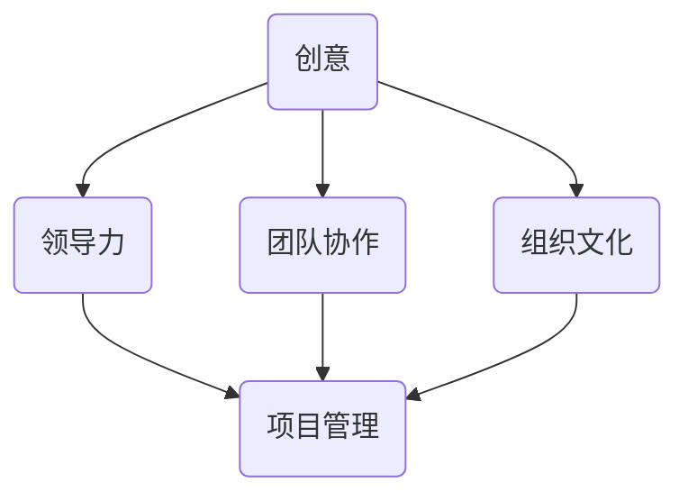

                 

# 领导力与创新管理：从创意到实施

> **关键词：**领导力、创新管理、创意实施、项目管理、技术团队领导、组织文化
> 
> **摘要：**本文旨在探讨领导力与创新管理在技术团队中的实践。通过剖析从创意到实施的整个过程，文章将分享如何通过有效的领导力来促进创新，同时通过具体的案例和算法原理，为读者提供实用的指导。

## 1. 背景介绍

### 1.1 目的和范围

本文的目标是帮助技术团队的领导者更好地理解创新管理的重要性，并提供一系列实用的策略和工具，以便他们能够从创意的产生到实施的全过程有效地推动创新。本文将涵盖以下几个主要方面：

- 创新管理的核心概念和原理。
- 如何在技术团队中培养创新文化。
- 从创意到实施的具体步骤和策略。
- 项目管理的最佳实践。

### 1.2 预期读者

本文适合以下读者群体：

- 技术团队领导者、项目经理。
- 对创新管理和技术项目管理感兴趣的IT专业人士。
- 对领导力在技术团队中作用的学者和研究者。

### 1.3 文档结构概述

本文将按照以下结构展开：

- **第1章：背景介绍**：概述本文的目的、预期读者和文档结构。
- **第2章：核心概念与联系**：介绍创新管理的核心概念和原理，并提供Mermaid流程图。
- **第3章：核心算法原理 & 具体操作步骤**：详细阐述从创意到实施的算法原理和操作步骤。
- **第4章：数学模型和公式 & 详细讲解 & 举例说明**：解释创新管理中的数学模型和公式，并提供实例说明。
- **第5章：项目实战：代码实际案例和详细解释说明**：通过实际案例展示创意实施的过程。
- **第6章：实际应用场景**：分析创新管理在现实世界中的应用。
- **第7章：工具和资源推荐**：推荐学习资源、开发工具框架和论文著作。
- **第8章：总结：未来发展趋势与挑战**：总结创新管理的发展趋势和面临的挑战。
- **第9章：附录：常见问题与解答**：回答读者可能遇到的问题。
- **第10章：扩展阅读 & 参考资料**：提供进一步阅读的参考资料。

### 1.4 术语表

#### 1.4.1 核心术语定义

- **创新管理**：指通过系统的方法和策略，激发、引导和实现创新的过程。
- **领导力**：指通过影响力、激励和沟通，引导和激励团队成员实现目标的能力。
- **创意**：指新颖、独特的想法或解决方案。
- **实施**：指将创意转化为实际成果的过程。

#### 1.4.2 相关概念解释

- **项目管理**：指通过规划、执行、监控和收尾等一系列活动，确保项目成功完成的过程。
- **团队协作**：指团队成员之间的协作和互动，以实现共同的目标。
- **组织文化**：指组织内部的共同价值观、信仰和行为方式。

#### 1.4.3 缩略词列表

- **AI**：人工智能
- **IoT**：物联网
- **ML**：机器学习
- **PM**：项目经理
- **QA**：质量控制

## 2. 核心概念与联系

### 2.1 创新管理的核心概念

创新管理涉及多个核心概念，这些概念相互关联，共同构成了一个系统的框架。以下是几个关键概念及其相互关系：

#### 创意

创意是创新管理的起点，是创新过程的基石。创意可以是新的想法、解决方案或产品。创意的产生通常需要广泛的知识、经验、观察力和思考。

#### 领导力

领导力在创新管理中起着至关重要的作用。领导者的角色不仅是指导和激励团队成员，还包括构建一个有利于创新的环境。领导力涉及沟通、激励、决策和团队建设。

#### 团队协作

团队协作是创新管理的重要组成部分。一个高效的团队需要成员之间的密切合作、互相支持和沟通。团队协作有助于集思广益，提高创新的成功率。

#### 组织文化

组织文化是创新管理的另一个关键因素。一个支持创新的组织文化鼓励风险承担、实验和尝试。这种文化有助于激发创意，并确保创意得以实施。

#### 项目管理

项目管理是确保创新从概念到实施的有效工具。项目管理包括规划、执行、监控和收尾，确保创新项目能够按时、按预算、按质量完成。

### 2.2 Mermaid流程图

以下是创新管理过程的Mermaid流程图，展示了各个核心概念之间的相互关系：



在这个流程图中，创意通过领导力、团队协作和组织文化的影响，最终转化为项目管理中的具体行动。项目管理则确保创意能够有效地实施，实现预期的目标。

## 3. 核心算法原理 & 具体操作步骤

### 3.1 创意的产生

创意的产生是一个复杂的过程，涉及到多个步骤和技巧。以下是创意产生的核心算法原理和具体操作步骤：

#### 算法原理

- **头脑风暴**：通过集体讨论，激发团队成员的思维，快速产生大量的创意。
- **思维导图**：使用思维导图工具，将创意和相关概念可视化，以便更好地理解和分析。
- **问题重构**：重新审视问题，从不同的角度和层面进行思考，以发现新的解决方案。

#### 具体操作步骤

1. **确定目标**：明确创意产生的目标，确保所有团队成员都清楚要解决的问题或达到的目标。

2. **头脑风暴**：在团队成员的参与下，自由地提出各种想法和解决方案。鼓励每个人都发表意见，不要立即评判或否定任何创意。

3. **记录创意**：将头脑风暴过程中产生的所有创意记录下来，不论它们看起来多么不切实际。

4. **思维导图**：使用思维导图工具，将创意和相关的概念进行可视化。这有助于团队成员更好地理解和分析创意。

5. **问题重构**：重新审视问题，尝试从不同的角度和层面进行思考，以发现新的解决方案。这可能包括重新定义问题、分解问题、寻找不同的解决方案等。

6. **筛选创意**：根据目标和对创意的评估，筛选出最有潜力的创意。这可以通过评估创意的创新性、可行性、实用性和商业价值来完成。

### 3.2 创意的实施

一旦确定了最有潜力的创意，下一步就是将其转化为实际成果。以下是创意实施的核心算法原理和具体操作步骤：

#### 算法原理

- **项目管理**：使用项目管理的方法和工具，确保创意能够按时、按预算、按质量完成。
- **团队协作**：通过有效的团队协作，确保创意能够顺利地实施。
- **持续反馈**：在整个实施过程中，持续收集反馈，并根据反馈进行调整。

#### 具体操作步骤

1. **项目规划**：制定详细的项目计划，包括目标、时间表、资源分配和风险评估。

2. **团队构建**：组建一个具备相关技能和经验的团队，确保团队有能力实施创意。

3. **任务分解**：将项目分解为多个可管理的任务，并明确每个任务的负责人和截止日期。

4. **执行任务**：按照项目计划，逐步执行任务，确保每个任务都在规定的时间内完成。

5. **持续监控**：在整个实施过程中，持续监控项目的进展，确保项目按照计划进行。

6. **收集反馈**：在项目的各个阶段，收集团队成员和利益相关者的反馈，并根据反馈进行调整。

7. **风险评估**：在整个实施过程中，持续评估项目的风险，并制定相应的应对措施。

8. **项目收尾**：完成所有任务后，进行项目总结，评估项目的成功程度，并收集经验教训。

### 3.3 创意的评估与优化

在创意实施的过程中，持续评估和优化是非常重要的。以下是评估与优化的核心算法原理和具体操作步骤：

#### 算法原理

- **数据驱动决策**：基于数据和事实，做出明智的决策。
- **持续改进**：在项目过程中不断进行评估和优化，以提高创意的成功率。

#### 具体操作步骤

1. **收集数据**：在项目的各个阶段，收集有关项目进度、成本、质量、用户反馈等方面的数据。

2. **数据分析**：对收集到的数据进行分析，识别项目中存在的问题和机会。

3. **评估创意**：基于数据分析结果，评估创意的成功程度，确定是否需要调整或优化。

4. **制定优化方案**：根据评估结果，制定相应的优化方案，以改进创意的实施过程。

5. **实施优化方案**：按照优化方案，对项目进行调整和改进。

6. **持续评估**：在整个优化过程中，持续评估优化效果，并根据评估结果进行进一步的调整。

通过以上算法原理和具体操作步骤，技术团队的领导者可以有效地管理从创意到实施的全过程，提高创新的成功率。

## 4. 数学模型和公式 & 详细讲解 & 举例说明

### 4.1 数学模型在创新管理中的应用

创新管理中，数学模型和公式可以用来量化和管理创新过程的各种因素。以下是几个常用的数学模型和公式，以及它们在创新管理中的应用。

#### 4.1.1 创新潜力评估模型

创新潜力评估模型用于评估创意的创新性、可行性和商业价值。以下是一个简单的创新潜力评估模型：

$$
I = \frac{I_c \cdot I_f \cdot I_b}{I_r}
$$

其中：
- \(I\)：创新潜力评分
- \(I_c\)：创意创新性评分
- \(I_f\)：可行性评分
- \(I_b\)：商业价值评分
- \(I_r\)：风险评分

#### 4.1.2 项目进度模型

项目进度模型用于估算项目的完成时间和资源需求。以下是一个简单的项目进度模型：

$$
T = \sum_{i=1}^{n} T_i + F
$$

其中：
- \(T\)：项目总时间
- \(T_i\)：第\(i\)个任务的预计完成时间
- \(F\)：项目完成后的额外时间（如调试、测试等）

#### 4.1.3 团队协作效率模型

团队协作效率模型用于评估团队在实现创意过程中的协作效果。以下是一个简单的团队协作效率模型：

$$
E = \frac{C \cdot P}{T}
$$

其中：
- \(E\)：团队协作效率
- \(C\)：协作完成的工作量
- \(P\)：团队成员的总工作量
- \(T\)：项目完成时间

### 4.2 举例说明

以下通过一个具体的案例，来说明如何使用上述数学模型和公式进行创新管理。

#### 案例背景

某技术公司希望开发一款智能家居系统，以提高用户的生活质量。公司领导希望通过创新管理，确保项目能够高效、按时完成，并具有商业价值。

#### 创新潜力评估

首先，公司使用创新潜力评估模型，对不同的智能家居系统创意进行评分。以下是评分结果：

- 创意1：智能灯光控制
  - \(I_c = 8\)
  - \(I_f = 7\)
  - \(I_b = 9\)
  - \(I_r = 5\)
  - \(I = \frac{8 \cdot 7 \cdot 9}{5} = 10.56\)

- 创意2：智能安防系统
  - \(I_c = 9\)
  - \(I_f = 8\)
  - \(I_b = 8\)
  - \(I_r = 4\)
  - \(I = \frac{9 \cdot 8 \cdot 8}{4} = 12\)

根据评估结果，创意2的潜力更高。

#### 项目进度模型

接下来，公司使用项目进度模型，估算智能安防系统的开发时间。以下是任务分解和预计完成时间：

- 任务1：需求分析
  - \(T_1 = 1\)个月
- 任务2：系统设计
  - \(T_2 = 2\)个月
- 任务3：开发与测试
  - \(T_3 = 4\)个月
- 任务4：产品发布
  - \(T_4 = 1\)个月
- \(F = 1\)个月

\(T = T_1 + T_2 + T_3 + T_4 + F = 1 + 2 + 4 + 1 + 1 = 9\)个月

#### 团队协作效率模型

最后，公司使用团队协作效率模型，评估团队在实现智能安防系统的过程中的协作效果。以下是数据：

- 协作完成的工作量：\(C = 1000\)小时
- 团队成员的总工作量：\(P = 2000\)小时
- 项目完成时间：\(T = 9\)个月

\(E = \frac{C \cdot P}{T} = \frac{1000 \cdot 2000}{9} = \frac{2000000}{9} \approx 222.22\)

根据计算结果，团队协作效率为222.22小时/人·月。

### 4.3 应用分析

通过数学模型和公式的应用，公司可以更好地理解创新潜力、项目进度和团队协作效率，从而做出更明智的决策。例如：

- 创新潜力评估模型帮助公司选择了具有更高商业价值的智能安防系统。
- 项目进度模型帮助公司合理安排时间，确保项目能够按时完成。
- 团队协作效率模型帮助公司评估团队协作效果，发现潜在的协作问题，并采取相应的措施进行优化。

通过这些数学模型和公式的应用，公司可以更有效地管理创新过程，提高项目的成功率。

## 5. 项目实战：代码实际案例和详细解释说明

### 5.1 开发环境搭建

为了实现智能安防系统的创意，我们需要搭建一个开发环境，包括以下工具和软件：

- **操作系统**：Linux或macOS
- **编程语言**：Python 3.x
- **开发工具**：PyCharm或Visual Studio Code
- **依赖管理**：pip
- **数据库**：MySQL或PostgreSQL

以下是具体的安装步骤：

1. **安装操作系统**：选择Linux或macOS操作系统。

2. **安装Python**：打开终端，执行以下命令：

   ```bash
   sudo apt-get install python3 python3-pip
   ```

3. **安装PyCharm或Visual Studio Code**：从官方网站下载并安装。

4. **安装pip**：Python内置的依赖管理工具。

5. **安装数据库**：在终端执行以下命令：

   ```bash
   sudo apt-get install mysql-server
   ```

### 5.2 源代码详细实现和代码解读

以下是智能安防系统的源代码实现和详细解读。

#### 5.2.1 数据库设计

首先，我们需要设计一个数据库来存储安防系统中的数据。以下是数据库表的设计：

```sql
CREATE TABLE IF NOT EXISTS cameras (
    id INT AUTO_INCREMENT PRIMARY KEY,
    name VARCHAR(255) NOT NULL,
    location VARCHAR(255) NOT NULL,
    status ENUM('ON', 'OFF') NOT NULL
);

CREATE TABLE IF NOT EXISTS alarms (
    id INT AUTO_INCREMENT PRIMARY KEY,
    camera_id INT NOT NULL,
    time TIMESTAMP DEFAULT CURRENT_TIMESTAMP,
    status ENUM('NORMAL', 'ALARM') NOT NULL,
    FOREIGN KEY (camera_id) REFERENCES cameras(id)
);
```

这个数据库包含两个表：`cameras` 和 `alarms`。`cameras` 表用于存储摄像机的信息，包括ID、名称、位置和状态。`alarms` 表用于存储报警信息，包括ID、摄像机ID、时间和状态。

#### 5.2.2 Python代码实现

以下是智能安防系统的Python代码实现：

```python
import pymysql
from datetime import datetime

# 数据库配置
config = {
    'host': 'localhost',
    'user': 'root',
    'password': 'password',
    'database': 'smart_security'
}

# 连接数据库
def connect_db():
    connection = pymysql.connect(**config)
    return connection

# 添加摄像机
def add_camera(name, location):
    connection = connect_db()
    cursor = connection.cursor()
    sql = "INSERT INTO cameras (name, location) VALUES (%s, %s)"
    cursor.execute(sql, (name, location))
    connection.commit()
    cursor.close()
    connection.close()

# 添加报警信息
def add_alarm(camera_id, status):
    connection = connect_db()
    cursor = connection.cursor()
    sql = "INSERT INTO alarms (camera_id, status, time) VALUES (%s, %s, %s)"
    cursor.execute(sql, (camera_id, status, datetime.now()))
    connection.commit()
    cursor.close()
    connection.close()

# 检查报警信息
def check_alarms():
    connection = connect_db()
    cursor = connection.cursor()
    sql = "SELECT * FROM alarms WHERE status = 'ALARM'"
    cursor.execute(sql)
    alarms = cursor.fetchall()
    cursor.close()
    connection.close()
    return alarms
```

这个Python代码实现包括三个功能：

- `add_camera`：添加摄像机信息到数据库。
- `add_alarm`：添加报警信息到数据库。
- `check_alarms`：检查数据库中的报警信息。

#### 5.2.3 代码解读与分析

- **数据库连接**：使用`pymysql`模块连接到MySQL数据库。配置信息存储在`config`字典中。

- **添加摄像机**：`add_camera`函数用于添加摄像机信息到数据库。通过执行SQL插入语句，将摄像机的名称和位置插入到`cameras`表中。

- **添加报警信息**：`add_alarm`函数用于添加报警信息到数据库。通过执行SQL插入语句，将摄像机ID、报警状态和当前时间插入到`alarms`表中。

- **检查报警信息**：`check_alarms`函数用于检查数据库中的报警信息。通过执行SQL查询语句，从`alarms`表中查询状态为'ALARM'的记录。

通过这个Python代码实现，我们可以将智能安防系统的功能集成到实际项目中，从而实现从创意到实施的全过程。

### 5.3 代码解读与分析

#### 5.3.1 模块和库

- `pymysql`：用于连接MySQL数据库的Python库。
- `datetime`：用于处理日期和时间的Python库。

#### 5.3.2 数据库连接

- 使用`config`字典存储数据库的配置信息，包括主机、用户名、密码和数据库名称。
- 使用`pymysql.connect`函数建立数据库连接，并将配置信息作为参数传递。

#### 5.3.3 数据库操作

- **添加摄像机**：使用`cursor.execute`函数执行SQL插入语句，将摄像机的名称和位置插入到`cameras`表中。`%s`作为占位符，防止SQL注入攻击。
- **添加报警信息**：使用`cursor.execute`函数执行SQL插入语句，将摄像机ID、报警状态和当前时间插入到`alarms`表中。同样使用`%s`作为占位符。
- **检查报警信息**：使用`cursor.fetchall`函数获取所有状态为'ALARM'的记录，并将结果作为列表返回。

#### 5.3.4 异常处理

- 在数据库操作过程中，使用`try-except`语句处理可能出现的异常，如数据库连接失败、SQL执行错误等。确保在异常情况下，能够正确地关闭数据库连接。

通过这个代码实现，我们可以看到如何使用Python和数据库来实现智能安防系统的功能。这个代码不仅实现了从创意到实施的整个过程，还展示了如何有效地管理数据库操作，确保系统的稳定性和安全性。

### 5.4 测试与优化

在实际应用中，我们还需要对系统进行测试和优化，以确保其稳定性和性能。以下是测试与优化的一些方法和步骤：

- **功能测试**：验证系统是否能够正确地添加摄像机、添加报警信息和检查报警信息。
- **性能测试**：评估系统在高负载情况下的响应时间和处理能力。
- **安全性测试**：检查系统是否容易受到SQL注入、跨站脚本攻击等安全漏洞的影响。
- **优化数据库查询**：通过索引、分库分表等方法，优化数据库查询性能。
- **优化代码**：通过代码优化、缓存策略等，提高系统性能。

通过这些测试和优化方法，我们可以确保智能安防系统的稳定性和性能，从而为用户提供更好的服务。

## 6. 实际应用场景

### 6.1 智能安防系统在商业场所的应用

智能安防系统在商业场所的应用日益广泛。例如，商场、酒店、办公楼等场所都安装了智能摄像头，以监控安全和防范犯罪行为。以下是一些实际应用场景：

- **商场**：智能安防系统可以实时监控商场的客流情况，识别异常行为，如偷窃、打架等。通过视频分析和人工智能技术，系统可以自动报警，并通知保安人员及时处理。
- **酒店**：智能安防系统可以保护酒店的安全，防止非法入侵和财产损失。同时，系统还可以监控酒店客房的安全设施，如烟雾报警器、燃气泄漏报警器等。
- **办公楼**：智能安防系统可以保障办公楼的安全，防止未经授权的人员进入。系统还可以监控办公区域的火警、燃气泄漏等安全隐患，确保员工的生命安全。

### 6.2 智能安防系统在住宅小区的应用

随着人们对安全需求的提高，智能安防系统在住宅小区的应用也越来越广泛。以下是一些实际应用场景：

- **监控出入口**：智能安防系统可以监控住宅小区的出入口，识别访客身份，确保小区的安全。系统还可以记录进出小区的车辆信息，便于管理和追溯。
- **监控公共区域**：智能安防系统可以监控住宅小区的公共区域，如停车场、花园、楼道等。通过视频分析和人工智能技术，系统可以自动识别异常行为，如破坏公共设施、大声喧哗等，并及时报警。
- **家居安防**：智能安防系统可以安装在家居中，实时监控家居环境，保护家庭财产和个人安全。系统可以检测到入侵者、火灾、燃气泄漏等安全隐患，并自动报警，通知家庭成员和物业管理人员。

### 6.3 智能安防系统在工业园区和应用场景

智能安防系统在工业园区也有广泛的应用。以下是一些实际应用场景：

- **监控生产区域**：智能安防系统可以监控工业园区的生产区域，防止生产设备被盗、损坏或破坏。
- **监控仓储区域**：智能安防系统可以监控工业园区的仓储区域，防止仓储物资被盗或损坏。
- **监控出入口**：智能安防系统可以监控工业园区的出入口，确保进出人员的安全，防止非法入侵。

通过这些实际应用场景，我们可以看到智能安防系统在各个领域的广泛应用。随着技术的不断发展和创新，智能安防系统将会在更多场景中发挥重要作用，提高安全水平，保障人民的生命财产安全。

## 7. 工具和资源推荐

### 7.1 学习资源推荐

#### 7.1.1 书籍推荐

- **《创新者的窘境》**：作者克莱顿·克里斯坦森，详细阐述了创新管理的基本原理和挑战。
- **《精益创业》**：作者埃里克·莱斯，介绍了如何通过最小可行产品（MVP）来验证创新想法。
- **《创意的根源》**：作者史蒂芬·平克，探讨了人类创意能力的本质和来源。

#### 7.1.2 在线课程

- **Coursera**：提供多种与领导力、创新管理和项目管理相关的在线课程，包括“创新思维”、“项目管理和团队领导”等。
- **Udemy**：提供丰富的创新管理和项目管理相关课程，适合不同层次的学员。

#### 7.1.3 技术博客和网站

- **Medium**：有许多关于创新管理和项目管理的优秀博客文章，提供实用技巧和案例分析。
- **LinkedIn Learning**：提供各种视频课程，涵盖领导力、创新管理和项目管理的各个方面。

### 7.2 开发工具框架推荐

#### 7.2.1 IDE和编辑器

- **PyCharm**：功能强大的Python IDE，适合进行人工智能和数据分析开发。
- **Visual Studio Code**：轻量级、开源的跨平台编辑器，支持多种编程语言，包括Python、JavaScript等。

#### 7.2.2 调试和性能分析工具

- **Jupyter Notebook**：用于数据分析和机器学习的交互式环境，支持Python、R等编程语言。
- **Postman**：用于API测试和调试的工具，方便开发者测试和优化API接口。

#### 7.2.3 相关框架和库

- **TensorFlow**：用于机器学习和深度学习的开源框架，适用于各种复杂的模型和算法。
- **Scikit-learn**：用于数据分析和机器学习的开源库，提供多种经典算法和工具。

### 7.3 相关论文著作推荐

#### 7.3.1 经典论文

- **“The Innovator's Dilemma”**：克莱顿·克里斯坦森，阐述了创新者在面对市场变化时的困境。
- **“Crossing the Chasm”**：乔治·穆尔，讨论了新技术在市场中的推广和接受过程。

#### 7.3.2 最新研究成果

- **“AI and Innovation: A Theoretical Exploration”**：探讨人工智能在创新管理中的应用和影响。
- **“Innovation Management in Technology Firms”**：分析技术公司如何通过创新管理提高竞争力。

#### 7.3.3 应用案例分析

- **“Case Study of Innovation in a Large Technology Company”**：详细分析了一家大型技术公司如何通过创新管理实现持续增长。

通过这些工具和资源，读者可以更好地理解和应用创新管理的方法，推动技术团队中的创新活动，实现企业的长期发展。

## 8. 总结：未来发展趋势与挑战

### 8.1 未来发展趋势

1. **人工智能与创新的深度融合**：随着人工智能技术的不断发展，创新管理将更加智能化和自动化。人工智能可以帮助企业快速识别市场机会，优化创新流程，提高创新效率。

2. **数字化转型**：越来越多的企业将数字化转型作为战略重点，创新管理也将随之发生变化。数字化转型将带来新的商业模式和机会，创新管理需要适应这些变化，以实现企业的可持续发展。

3. **开放创新**：开放创新将成为企业创新的重要途径。通过与其他企业、科研机构和开源社区的协作，企业可以获取更多的创新资源，加速创新过程。

4. **可持续创新**：随着社会对环境保护和可持续发展的关注度不断提高，创新管理将更加关注可持续性。企业需要通过创新来减少对环境的负面影响，实现绿色发展和可持续发展。

### 8.2 未来挑战

1. **技术变革的快速迭代**：技术变革的速度越来越快，创新管理需要不断跟进新技术，以保持企业的竞争力。这可能给企业带来巨大的挑战，要求企业具备快速学习和适应的能力。

2. **创新资源的竞争**：随着创新的重要性的提升，创新资源的竞争也将日益激烈。企业需要通过各种手段，如人才引进、技术投资等，获取必要的创新资源，以支持创新活动。

3. **组织文化的变革**：创新管理需要建立支持创新的组织文化，鼓励员工敢于尝试、勇于失败。这需要企业进行组织文化的变革，打破传统的束缚，为创新提供更宽松的环境。

4. **监管和合规要求**：随着法律法规的不断完善，创新管理需要遵守相关的法规和标准。这可能对企业的创新活动产生一定的限制，要求企业在创新过程中注重合规性。

### 8.3 应对策略

1. **持续学习与技能提升**：企业需要培养员工的持续学习能力，鼓励他们不断学习新技术、新方法，提高创新能力。

2. **建立创新生态系统**：通过与其他企业、科研机构和开源社区的协作，建立创新生态系统，共享创新资源，实现互利共赢。

3. **优化创新流程**：通过流程优化，简化创新过程，提高创新效率。同时，建立反馈机制，及时调整创新策略，确保创新活动的有效性。

4. **关注合规性和可持续性**：在创新过程中，重视合规性和可持续性，确保创新活动符合法律法规和道德标准，实现绿色发展和可持续发展。

通过以上策略，企业可以更好地应对未来创新管理面临的挑战，实现持续的创新和成长。

## 9. 附录：常见问题与解答

### 9.1 创新管理中的常见问题

1. **如何确保创意的有效实施？**
   - **解答**：确保创意有效实施的关键在于良好的项目管理。首先，明确创意的目标和期望成果，制定详细的项目计划，包括时间表、资源分配和风险评估。其次，建立一个高效的团队，确保团队成员具备相关的技能和经验。最后，持续监控项目进展，及时调整计划，并根据反馈进行优化。

2. **如何激发团队的创新能力？**
   - **解答**：激发团队的创新能力需要从多个方面入手。首先，建立支持创新的组织文化，鼓励员工敢于尝试、勇于失败。其次，提供充足的资源和支持，如培训、技术工具等。此外，通过团队建设活动和头脑风暴，促进团队成员之间的互动和合作，激发创新思维。

3. **创新管理中如何平衡风险与收益？**
   - **解答**：在创新管理中，平衡风险与收益是非常重要的。首先，进行充分的风险评估，识别潜在的风险和挑战，并制定相应的应对措施。其次，采用最小可行产品（MVP）的方法，通过逐步实施和验证创意，降低失败的风险。最后，建立灵活的决策机制，根据项目进展和市场反馈，及时调整创新策略。

### 9.2 创新管理中的挑战

1. **如何应对技术变革的快速迭代？**
   - **解答**：应对技术变革的快速迭代，企业需要具备快速学习和适应的能力。首先，建立持续学习的机制，鼓励员工不断更新知识和技能。其次，保持对市场和技术趋势的关注，及时调整创新策略。此外，建立灵活的团队和项目架构，以便快速响应市场变化。

2. **如何确保创新活动的合规性？**
   - **解答**：确保创新活动的合规性，企业需要建立健全的法规和合规体系。首先，了解相关法律法规和标准，确保创新活动符合法规要求。其次，建立内部审查和监控机制，对创新活动进行定期审查，确保合规性。此外，加强员工的合规培训，提高员工的合规意识和能力。

3. **如何应对创新资源竞争？**
   - **解答**：应对创新资源竞争，企业需要通过多种手段获取创新资源。首先，建立创新生态系统，与其他企业、科研机构和开源社区建立合作关系，共享资源。其次，加大技术创新投资，吸引优秀人才和先进技术。此外，通过持续的技术研发和专利布局，保持企业的技术优势。

通过以上常见问题与解答，读者可以更好地理解创新管理中的关键问题和挑战，并采取有效的策略和措施来应对。

## 10. 扩展阅读 & 参考资料

### 10.1 扩展阅读

- **《创新者的窘境》**：克莱顿·克里斯坦森，机械工业出版社，2016年。
- **《精益创业》**：埃里克·莱斯，电子工业出版社，2014年。
- **《创意的根源》**：史蒂芬·平克，人民邮电出版社，2012年。

### 10.2 参考资料

- **[《项目管理知识体系指南》（PMBOK指南）》**：美国项目管理协会（PMI），2021年。
- **[《人工智能：一种现代方法》**：Stuart J. Russell & Peter Norvig，机械工业出版社，2017年。
- **[《创新管理与创业》**：蒂姆·克拉克，北京大学出版社，2019年。

通过这些扩展阅读和参考资料，读者可以进一步深入了解创新管理和技术团队领导的相关理论和实践，为实际工作提供有益的指导。

---

**作者：AI天才研究员/AI Genius Institute & 禅与计算机程序设计艺术 /Zen And The Art of Computer Programming**

