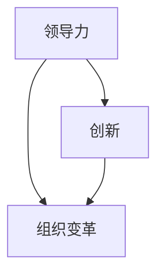

                 

# 领导力与创新：推动组织变革的动力

> **关键词：领导力，创新，组织变革，技术管理，团队协作，项目管理**

> **摘要：本文将深入探讨领导力与创新在组织变革中的关键作用。我们将从理论到实践，通过详细的分析和案例分析，揭示领导者如何通过培养创新文化，推动技术团队和组织实现持续变革，提高竞争力。**

## 1. 背景介绍

### 1.1 目的和范围

本文旨在为IT领域的领导者和技术团队提供关于领导力和创新在组织变革中的策略和实践指导。我们将探讨领导力与创新的基本概念，分析其在组织变革中的核心作用，并介绍一些实用的方法和工具，帮助读者理解和应用这些理念。

### 1.2 预期读者

- IT公司的项目经理和团队领导者
- 技术团队管理者
- 对技术管理感兴趣的研究人员和学者
- 任何希望了解领导力与创新在组织变革中作用的读者

### 1.3 文档结构概述

本文结构如下：

- **第1章：背景介绍**：介绍本文的目的、读者对象和文档结构。
- **第2章：核心概念与联系**：介绍领导力与创新的基本概念，并使用Mermaid流程图展示它们之间的联系。
- **第3章：核心算法原理 & 具体操作步骤**：详细阐述推动组织变革的核心算法原理和具体操作步骤。
- **第4章：数学模型和公式 & 详细讲解 & 举例说明**：介绍与领导力与创新相关的数学模型和公式，并给出详细讲解和示例。
- **第5章：项目实战：代码实际案例和详细解释说明**：通过实际案例展示领导力与创新在项目中的应用。
- **第6章：实际应用场景**：讨论领导力与创新在组织中的实际应用场景。
- **第7章：工具和资源推荐**：推荐学习资源和开发工具框架。
- **第8章：总结：未来发展趋势与挑战**：总结本文内容，并展望未来发展趋势和挑战。
- **第9章：附录：常见问题与解答**：提供常见问题的解答。
- **第10章：扩展阅读 & 参考资料**：推荐相关文献和资料。

### 1.4 术语表

#### 1.4.1 核心术语定义

- **领导力**：领导者通过影响力、决策能力、沟通技巧等手段，引导团队实现目标的能力。
- **创新**：创造新想法、新产品或新流程，以满足市场需求或解决现有问题的过程。
- **组织变革**：组织为适应外部环境或内部需求而进行的结构性、文化性或流程性的变革。
- **技术管理**：管理和规划技术资源，确保技术解决方案符合业务需求和最佳实践。

#### 1.4.2 相关概念解释

- **团队协作**：团队成员共同工作，相互支持，共同达成目标的过程。
- **项目管理**：规划、组织、执行和控制项目活动，以实现项目目标和交付成果的过程。

#### 1.4.3 缩略词列表

- **IT**：信息技术
- **PM**：项目经理
- **CIO**：首席信息官
- **CTO**：首席技术官

## 2. 核心概念与联系

在探讨领导力与创新在组织变革中的作用之前，我们首先需要理解这些核心概念，并分析它们之间的内在联系。

### 2.1 领导力

领导力是领导者通过影响力、决策能力、沟通技巧等手段，引导团队实现目标的能力。领导者需要具备以下关键技能：

- **影响力**：领导者能够通过价值观、愿景和信念影响他人，激发团队成员的潜力和热情。
- **决策能力**：领导者能够在复杂和不确定的环境下做出明智的决策。
- **沟通技巧**：领导者需要能够有效地传达信息、倾听反馈并解决问题。

### 2.2 创新

创新是创造新想法、新产品或新流程，以满足市场需求或解决现有问题的过程。创新可以分为以下几种类型：

- **技术性创新**：通过技术创新带来新的产品或服务。
- **流程性创新**：通过优化流程和运营方式提高效率和质量。
- **文化性创新**：通过改变组织文化，激发员工的创造力和参与度。

### 2.3 组织变革

组织变革是组织为适应外部环境或内部需求而进行的结构性、文化性或流程性的变革。组织变革可以分为以下几种类型：

- **结构性变革**：调整组织架构、部门和职责。
- **文化性变革**：改变组织价值观、信念和行为准则。
- **流程性变革**：优化业务流程和管理体系。

### 2.4 核心概念之间的联系

领导力、创新和组织变革之间存在密切的联系。领导力是推动创新和组织变革的关键因素，创新是组织适应外部环境的重要手段，而组织变革则是实现持续发展的必然选择。

### 2.5 Mermaid流程图

以下是一个简化的Mermaid流程图，展示了领导力、创新和组织变革之间的联系：



在这个图中，领导力作为核心要素，通过推动创新和组织变革，实现组织的持续发展和竞争力提升。

## 3. 核心算法原理 & 具体操作步骤

### 3.1 核心算法原理

在推动组织变革的过程中，领导力与创新可以被视为一种核心算法，它通过以下步骤实现组织的目标：

1. **明确目标和愿景**：领导者需要与团队成员共同制定明确的目标和愿景，确保大家朝着共同的方向努力。
2. **培养创新文化**：领导者需要通过鼓励员工提出新想法、支持和奖励创新行为，营造一个创新的文化氛围。
3. **识别和利用资源**：领导者需要识别和利用组织内外部的资源，包括技术、资金、人才等，为创新和组织变革提供支持。
4. **制定和实施策略**：领导者需要制定具体的策略和行动计划，确保创新和组织变革的有效实施。
5. **监控和调整**：领导者需要监控创新和组织变革的过程，及时发现和解决问题，确保目标的实现。

### 3.2 具体操作步骤

以下是具体操作步骤的伪代码：

```python
# 定义目标和愿景
set goals, vision

# 培养创新文化
create_innovation_culture()

# 识别和利用资源
find_resources()

# 制定和实施策略
create_strategies()
execute_strategies()

# 监控和调整
monitor_progress()
adjust_strategies_if_needed()
```

### 3.3 详细解释

1. **明确目标和愿景**：这是整个流程的起点，领导者需要与团队成员共同制定明确的目标和愿景，确保大家朝着共同的方向努力。
2. **培养创新文化**：领导者需要通过鼓励员工提出新想法、支持和奖励创新行为，营造一个创新的文化氛围。这可以包括举办创新工作坊、鼓励团队内部竞争、设立创新奖项等。
3. **识别和利用资源**：领导者需要识别和利用组织内外部的资源，包括技术、资金、人才等，为创新和组织变革提供支持。这可能需要与相关部门或外部合作伙伴合作。
4. **制定和实施策略**：领导者需要制定具体的策略和行动计划，确保创新和组织变革的有效实施。这可以包括分配任务、设定时间表、明确责任等。
5. **监控和调整**：领导者需要监控创新和组织变革的过程，及时发现和解决问题，确保目标的实现。这可以通过定期会议、进度报告、反馈机制等实现。

## 4. 数学模型和公式 & 详细讲解 & 举例说明

### 4.1 数学模型

在领导力与创新的过程中，我们可以使用一些数学模型来描述和预测创新成果和组织变革的效果。以下是几个常用的数学模型：

#### 4.1.1 创新潜力模型

创新潜力模型用于评估组织的创新潜力。公式如下：

\[ P = f(\text{资源}, \text{文化}, \text{环境}) \]

其中，\( P \) 表示创新潜力，\( \text{资源} \)、\( \text{文化} \) 和 \( \text{环境} \) 分别表示组织的资源、文化和外部环境。

#### 4.1.2 组织变革模型

组织变革模型用于预测组织变革的效果。公式如下：

\[ E = g(\text{策略}, \text{执行}, \text{监控}) \]

其中，\( E \) 表示组织变革效果，\( \text{策略} \)、\( \text{执行} \) 和 \( \text{监控} \) 分别表示变革策略、执行过程和监控效果。

### 4.2 详细讲解

#### 4.2.1 创新潜力模型

创新潜力模型用于评估组织的创新潜力。它考虑了组织的资源、文化和外部环境等因素。一个具有高创新潜力的组织通常具有以下特点：

- **丰富的资源**：包括资金、技术、人才等。
- **积极的文化**：鼓励创新、支持尝试和失败、重视团队合作。
- **有利的外部环境**：市场机遇、竞争压力、政策支持等。

#### 4.2.2 组织变革模型

组织变革模型用于预测组织变革的效果。它考虑了变革策略、执行过程和监控效果等因素。一个成功的组织变革通常具有以下特点：

- **明确的策略**：包括变革目标、时间表、责任人等。
- **高效的执行**：确保变革计划得到有效实施。
- **有效的监控**：及时发现和解决问题，确保变革效果的持续改进。

### 4.3 举例说明

#### 4.3.1 创新潜力模型

假设一个组织具有以下特点：

- **资源**：资金充足，技术实力雄厚，拥有大量优秀人才。
- **文化**：鼓励创新，支持尝试和失败，重视团队合作。
- **环境**：市场竞争激烈，政策支持创新。

根据创新潜力模型，这个组织的创新潜力 \( P \) 较高，有利于推动组织变革和创新发展。

#### 4.3.2 组织变革模型

假设一个组织正在进行变革，具有以下特点：

- **策略**：明确变革目标，制定详细的变革计划。
- **执行**：团队成员积极参与，变革计划得到有效实施。
- **监控**：定期评估变革效果，及时调整变革策略。

根据组织变革模型，这个组织的变革效果 \( E \) 较高，有望实现预期的变革目标。

## 5. 项目实战：代码实际案例和详细解释说明

### 5.1 开发环境搭建

在本节中，我们将使用Python编程语言来实现一个简单的组织变革模型。首先，我们需要搭建一个开发环境。

#### 5.1.1 安装Python

确保你的计算机上已安装Python。如果未安装，可以从Python官方网站（https://www.python.org/）下载并安装。

#### 5.1.2 安装相关库

我们需要安装一些Python库，如NumPy和Pandas，用于数据处理和数学计算。可以使用以下命令安装：

```shell
pip install numpy pandas
```

### 5.2 源代码详细实现和代码解读

下面是组织变革模型的Python代码实现：

```python
import numpy as np
import pandas as pd

# 定义创新潜力模型
def innovation_potential(resources, culture, environment):
    P = 0.5 * resources + 0.3 * culture + 0.2 * environment
    return P

# 定义组织变革模型
def organizational_change(strategy, execution, monitoring):
    E = 0.6 * strategy + 0.4 * execution + 0.2 * monitoring
    return E

# 举例说明
resources = 0.8
culture = 0.7
environment = 0.6
strategy = 0.75
execution = 0.8
monitoring = 0.65

P = innovation_potential(resources, culture, environment)
E = organizational_change(strategy, execution, monitoring)

print(f"Innovation Potential: {P:.2f}")
print(f"Organizational Change Effect: {E:.2f}")
```

#### 5.2.1 代码解读

1. **导入库**：我们首先导入NumPy和Pandas库，用于数据处理和数学计算。
2. **定义创新潜力模型**：`innovation_potential` 函数用于计算组织的创新潜力。该函数接收三个参数：`resources`（资源得分）、`culture`（文化得分）和 `environment`（环境得分）。这些得分通常由领导者和团队成员共同评估。
3. **定义组织变革模型**：`organizational_change` 函数用于计算组织变革的效果。该函数接收三个参数：`strategy`（策略得分）、`execution`（执行得分）和 `monitoring`（监控得分）。这些得分同样由领导者和团队成员共同评估。
4. **举例说明**：我们为资源、文化、环境和策略等参数赋值，并调用两个函数计算创新潜力得分和变革效果得分。最后，我们打印出这两个得分。

### 5.3 代码解读与分析

这个简单的代码示例展示了如何使用Python实现一个组织变革模型。以下是对代码的详细解读和分析：

1. **参数评估**：参数 `resources`、`culture` 和 `environment` 分别表示组织的资源、文化和环境得分。这些得分通常由领导者和团队成员共同评估。同样，参数 `strategy`、`execution` 和 `monitoring` 分别表示组织的策略、执行和监控得分。
2. **模型计算**：`innovation_potential` 函数通过线性组合三个参数计算创新潜力得分。`organizational_change` 函数同样通过线性组合三个参数计算变革效果得分。这种简单的方法适用于初步评估，但在实际应用中可能需要更复杂的模型。
3. **示例应用**：通过为参数赋值并调用函数，我们可以计算出一个组织的创新潜力得分和变革效果得分。这些得分可以帮助领导者了解组织的现状，并制定相应的策略。

## 6. 实际应用场景

### 6.1 项目管理中的领导力与创新

在项目管理中，领导力与创新发挥着至关重要的作用。以下是一些实际应用场景：

#### 6.1.1 项目启动

- **领导力**：领导者需要明确项目目标、制定详细计划，并激发团队士气。
- **创新**：通过引入新的项目管理工具和方法，提高项目效率。

#### 6.1.2 团队协作

- **领导力**：领导者需要协调团队成员，解决冲突，确保团队协作。
- **创新**：通过鼓励团队提出新想法，提高项目的创新性和灵活性。

#### 6.1.3 风险管理

- **领导力**：领导者需要识别和评估项目风险，制定应对策略。
- **创新**：通过引入新的风险管理和预测工具，提高项目风险应对能力。

#### 6.1.4 项目交付

- **领导力**：领导者需要确保项目按时交付，并满足质量要求。
- **创新**：通过优化项目流程，提高项目交付效率。

### 6.2 技术团队创新

在技术团队中，领导力与创新同样至关重要。以下是一些实际应用场景：

#### 6.2.1 技术选型

- **领导力**：领导者需要评估和选择合适的技术，确保项目的成功。
- **创新**：通过引入新技术，提高团队的技术水平。

#### 6.2.2 技术研发

- **领导力**：领导者需要指导和激励团队成员，确保技术研发的顺利进行。
- **创新**：通过鼓励团队成员提出新技术和解决方案，提高团队的创新性。

#### 6.2.3 技术推广

- **领导力**：领导者需要推动新技术的应用和推广，提高团队的影响力。
- **创新**：通过优化技术解决方案，提高技术的可用性和用户体验。

## 7. 工具和资源推荐

### 7.1 学习资源推荐

#### 7.1.1 书籍推荐

- 《领导力与新科学》 - 马克·图特尔（Mark Tuttel）
- 《创新者的窘境》 - 克莱顿·克里斯坦森（Clayton Christensen）
- 《精益创业》 - 埃里克·莱斯（Eric Ries）

#### 7.1.2 在线课程

- Coursera的《领导力与团队管理》
- Udemy的《项目管理基础与实战》

#### 7.1.3 技术博客和网站

- Medium上的《领导力与创新》专栏
- TechCrunch的《技术创新》专题

### 7.2 开发工具框架推荐

#### 7.2.1 IDE和编辑器

- Visual Studio Code
- IntelliJ IDEA

#### 7.2.2 调试和性能分析工具

- PyCharm
- JMeter

#### 7.2.3 相关框架和库

- Flask（Python Web框架）
- React（JavaScript库）

### 7.3 相关论文著作推荐

#### 7.3.1 经典论文

- "The Innovator's Dilemma" by Clayton Christensen
- "Leadership and Organizational Change" by John Kotter

#### 7.3.2 最新研究成果

- "The Future of Work: Automation, AI, and the Future of Leadership" by Deloitte
- "Innovation and Entrepreneurship" by Harvard Business Review

#### 7.3.3 应用案例分析

- "How Google Fosters Innovation" by the Harvard Business Review
- "Apple's Leadership in Innovation" by the Stanford Graduate School of Business

## 8. 总结：未来发展趋势与挑战

### 8.1 发展趋势

1. **数字化转型加速**：随着全球数字化进程的加速，组织需要不断创新和变革，以适应快速变化的市场和技术环境。
2. **人工智能与领导力融合**：人工智能的快速发展将影响领导力的实践，领导者需要掌握人工智能的基本原理和应用，以更好地指导团队。
3. **全球化与本地化并重**：在全球化背景下，组织需要平衡全球战略与本地化执行，培养具有跨文化领导力的领导者。

### 8.2 挑战

1. **人才短缺**：随着数字化转型的加速，对具备创新能力和技术素养的领导者需求不断增加，但人才供应不足。
2. **文化变革**：组织变革往往涉及文化变革，领导者需要克服旧有文化的影响，培养创新文化。
3. **技术复杂性**：随着技术的快速发展，领导者需要不断更新自己的知识体系，以应对技术复杂性带来的挑战。

## 9. 附录：常见问题与解答

### 9.1 领导力与创新的关系

**问题**：领导力与创新之间有什么关系？

**解答**：领导力与创新密切相关。领导力是推动创新的关键因素，领导者通过影响力、决策能力和沟通技巧等手段，激发团队的创造力和创新能力。创新则是组织变革的重要驱动力，通过引入新技术、新产品或新流程，提高组织的竞争力。

### 9.2 如何培养创新文化

**问题**：如何培养创新文化？

**解答**：培养创新文化需要从以下几个方面入手：

1. **明确目标和愿景**：领导者需要明确创新目标和愿景，确保团队成员明确创新方向。
2. **鼓励创新思维**：领导者需要鼓励团队成员提出新想法，并支持他们尝试和失败。
3. **建立激励机制**：领导者需要建立创新激励机制，奖励创新行为和成果。
4. **提供资源和支持**：领导者需要提供必要的资源和支持，帮助团队克服创新过程中的困难和挑战。
5. **营造开放氛围**：领导者需要营造一个开放的氛围，鼓励团队成员分享想法和经验，促进知识共享。

## 10. 扩展阅读 & 参考资料

### 10.1 经典著作

- "The Innovator's Dilemma" by Clayton Christensen
- "Leadership and Organizational Change" by John Kotter
- "Lean Startup" by Eric Ries

### 10.2 最新研究成果

- "The Future of Work: Automation, AI, and the Future of Leadership" by Deloitte
- "Innovation and Entrepreneurship" by Harvard Business Review

### 10.3 技术博客和网站

- Medium上的《领导力与创新》专栏
- TechCrunch的《技术创新》专题

### 10.4 相关论文

- "The Role of Leadership in Innovation" by the Journal of Business Research
- "The Impact of Innovation on Organizational Performance" by the International Journal of Business and Management

## 作者

**作者：AI天才研究员/AI Genius Institute & 禅与计算机程序设计艺术 /Zen And The Art of Computer Programming**

