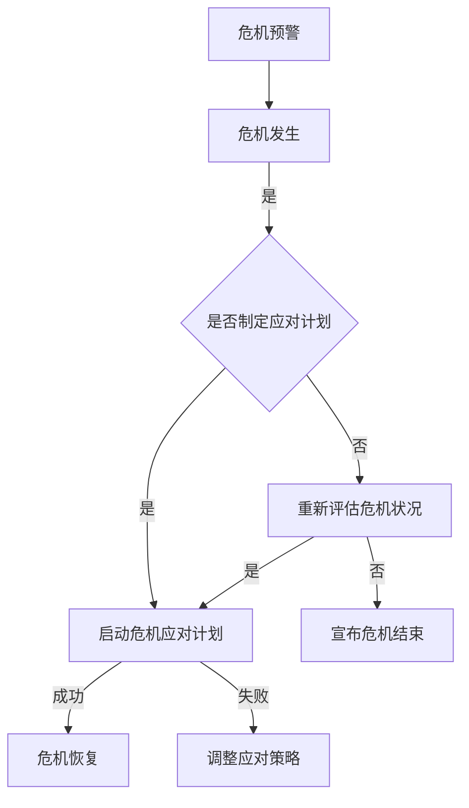
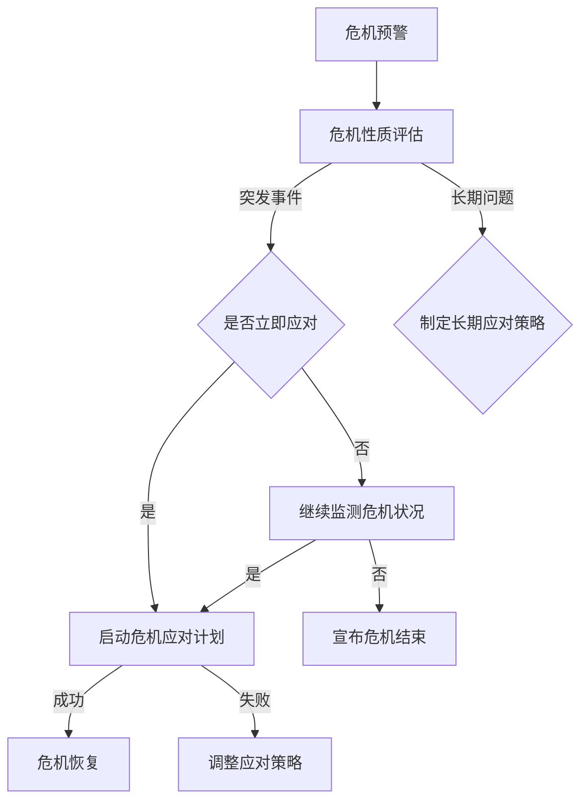
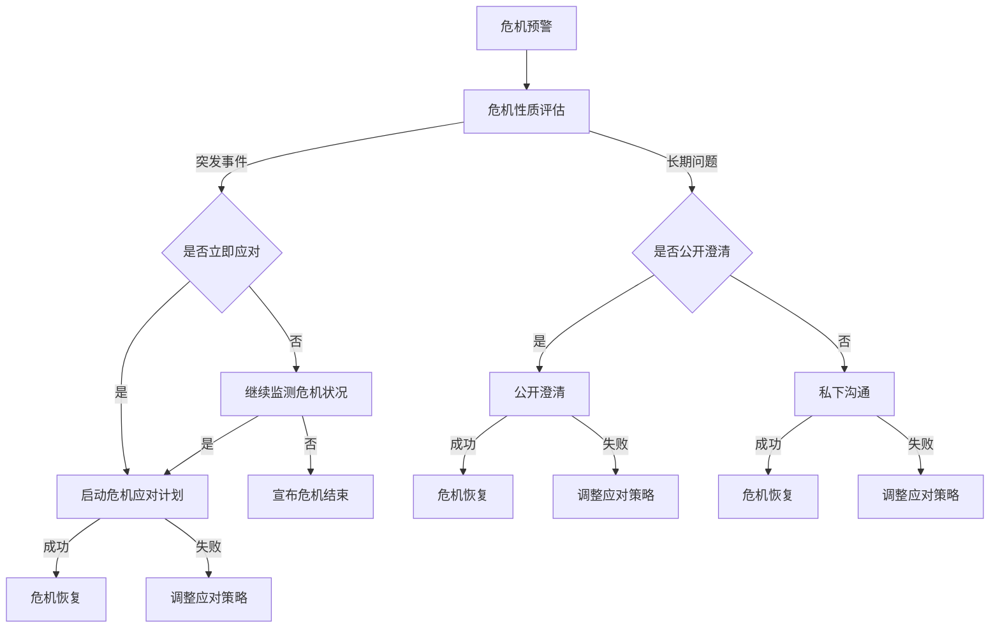

                 

### 1. 背景介绍

#### 1.1 目的和范围

本文旨在探讨领导力在危机公关中的关键作用，特别是在维护团队声誉方面的策略与实践。文章将通过详细的分析和实际案例，阐明危机公关的核心原则、领导力的本质及其在应对突发事件时的策略。

本文的讨论范围涵盖了以下几个方面：

1. **危机公关的基本概念**：介绍危机公关的定义、目的及重要性。
2. **领导力与团队声誉的关系**：探讨领导力对团队声誉的影响，包括信任、透明度和责任感等关键要素。
3. **领导力在危机公关中的具体应用**：分析领导力如何通过沟通策略、问题解决能力和危机管理技能来维护团队声誉。
4. **案例分析**：提供实际案例，展示成功和失败的危机公关策略，并从中提取教训。
5. **工具和资源推荐**：为读者提供相关的学习资源和开发工具，以帮助他们在实践中提升危机公关能力。

本文的目标读者是那些担任领导职位，或者在危机公关领域工作的专业人士。通过本文的阅读，读者将能够深入理解领导力在危机公关中的关键作用，并掌握有效的策略和工具，以维护团队的声誉和稳定。

#### 1.2 预期读者

预期读者包括以下几类人群：

1. **企业管理者和高层领导**：他们需要理解危机公关的重要性，并具备应对突发危机的能力。
2. **市场营销和公关专业人士**：他们在日常工作中需要处理各种公关事务，包括危机公关。
3. **IT行业的技术团队领导**：在数字时代，技术团队面临的危机事件越来越多，需要具备危机公关的意识和技能。
4. **所有对危机公关和领导力感兴趣的读者**：无论在哪个行业，领导力都是一项关键技能，本文将为广大读者提供有价值的见解和策略。

通过本文的阅读，预期读者能够：

- **提高危机公关意识**：理解危机公关的基本概念和重要性。
- **掌握领导力策略**：学会如何在危机中展现领导力，维护团队声誉。
- **提升应对能力**：通过案例分析，了解实际操作中的成功与失败，提升应对突发危机的能力。
- **获取实用资源**：获得一系列学习资源和工具，以支持他们的实践和应用。

#### 1.3 文档结构概述

为了确保文章内容的逻辑性和连贯性，本文将采用以下结构进行阐述：

1. **背景介绍**：介绍文章的目的、范围、预期读者和文档结构。
2. **核心概念与联系**：阐述危机公关和领导力的核心概念及其相互关系。
3. **核心算法原理与具体操作步骤**：详细讲解领导力在危机公关中的策略和技巧。
4. **数学模型和公式**：使用数学模型和公式对关键策略进行量化分析。
5. **项目实战**：通过实际代码案例展示如何应用理论。
6. **实际应用场景**：分析不同情境下危机公关的应用。
7. **工具和资源推荐**：推荐相关的学习资源和工具。
8. **总结**：总结文章的主要观点和未来发展趋势。
9. **附录**：提供常见问题与解答。
10. **扩展阅读**：推荐进一步的阅读资源。

这种结构能够帮助读者系统地理解领导力在危机公关中的应用，从理论到实践，全面掌握相关知识和技能。

#### 1.4 术语表

在本文中，为了确保读者能够清晰地理解相关术语，我们定义了以下核心术语，并解释了相关概念：

##### 1.4.1 核心术语定义

1. **危机公关**：指组织在面临突发事件、负面信息或公众质疑时，通过一系列沟通和管理手段，以维护品牌形象和声誉的过程。
2. **领导力**：指个体通过影响力、决策能力和激励能力，引导和影响团队，实现组织目标的能力。
3. **透明度**：指组织在危机处理过程中，主动、及时地向公众披露相关信息，保持沟通渠道的畅通。
4. **危机管理**：指组织在面临危机时，通过预防、应对和恢复等策略，减少危机影响，恢复正常运营的过程。

##### 1.4.2 相关概念解释

1. **声誉**：指组织在公众心中的形象和评价，包括品牌知名度、信任度和公众认可度等。
2. **风险管理**：指组织通过识别、评估和应对潜在风险，以降低风险可能带来的损失。
3. **危机传播**：指危机信息在公众中的传播过程，包括传播渠道、传播速度和传播效果等。

##### 1.4.3 缩略词列表

- **PR**：Public Relations，公关
- **CRM**：Customer Relationship Management，客户关系管理
- **SEO**：Search Engine Optimization，搜索引擎优化
- **SEM**：Search Engine Marketing，搜索引擎营销
- **COP**：Crisis Operations Plan，危机运营计划

通过明确术语和概念的界定，读者可以更好地理解文章内容，并在实际工作中应用相关知识和技能。

## 2. 核心概念与联系

在探讨领导力与危机公关之间的关系之前，我们需要首先明确这两个核心概念的定义，并分析它们之间的内在联系。

### 2.1 危机公关的概念

危机公关是指组织在面对突发事件、负面信息或公众质疑时，通过一系列的沟通和管理手段，以维护品牌形象和声誉的过程。危机公关的目的在于降低危机对组织的负面影响，恢复公众信任，并防止危机蔓延。危机公关通常包括以下几个步骤：

1. **危机预警**：通过监测和分析各种信息源，及时发现潜在的危机信号。
2. **危机应对**：在危机爆发时，迅速采取行动，进行危机管理。
3. **危机沟通**：通过有效的信息传递，与公众、媒体和利益相关者建立良好的沟通关系。
4. **危机恢复**：在危机得到控制后，采取措施恢复组织的正常运营和声誉。

### 2.2 领导力的概念

领导力是指个体通过影响力、决策能力和激励能力，引导和影响团队，实现组织目标的能力。领导力不仅仅是职位赋予的权力，更是一种个人魅力和领导艺术。领导力包括以下几个方面：

1. **愿景和目标设定**：领导力始于对组织愿景和目标的明确，通过激励和引导团队，实现共同目标。
2. **决策能力**：领导者在面对复杂问题时，能够迅速做出有效决策，并承担责任。
3. **沟通能力**：领导者需要具备良好的沟通技巧，能够清晰表达自己的想法，理解团队成员的需求。
4. **团队建设**：领导者通过培养团队精神，增强团队的凝聚力和协作能力。
5. **激励能力**：领导者能够激励团队成员，发挥他们的潜力，实现个人和团队的共同成长。

### 2.3 危机公关与领导力的关系

危机公关与领导力之间存在密切的联系，主要体现在以下几个方面：

1. **领导力对危机公关的影响**：
   - **决策能力**：领导者在危机公关中需要迅速做出决策，制定应对策略。有效的决策能力是危机公关成功的关键。
   - **沟通能力**：领导者需要与媒体、公众和利益相关者进行有效沟通，传递正确的信息，维护组织的声誉。
   - **团队协作**：危机公关往往需要跨部门合作，领导者需要协调各方资源，确保危机应对措施的顺利实施。
   - **危机应对经验**：领导者的危机应对经验直接影响危机公关的效果。有经验的领导者能够迅速识别危机，采取有效的应对措施。

2. **危机公关对领导力的挑战**：
   - **压力和责任**：危机公关往往伴随着巨大的压力和责任，领导者需要承受这种压力，并保持冷静，做出正确的决策。
   - **公众信任**：危机公关的核心是恢复公众信任，领导者需要通过透明、及时的沟通，建立公众对组织的信任。
   - **危机管理能力**：领导者需要在危机中展现出强大的危机管理能力，包括危机预警、危机应对和危机恢复等。

### 2.4 危机公关中的领导力策略

为了在危机公关中有效地维护团队声誉，领导者需要采取一系列策略，这些策略包括：

1. **建立危机预警机制**：通过持续监测和分析信息，提前识别潜在的危机信号，并制定相应的预警措施。
2. **制定危机应对计划**：在危机爆发前，领导者需要制定详细的危机应对计划，包括危机响应流程、关键人员职责和应急资源分配等。
3. **加强内部沟通**：领导者需要确保内部沟通渠道畅通，确保团队成员了解危机状况，并明确各自的职责和任务。
4. **保持透明度**：在危机公关中，领导者需要保持透明度，及时向公众披露相关信息，避免信息不对称。
5. **积极回应公众关切**：领导者需要主动回应公众的关切，提供准确的信息，并及时调整应对策略。
6. **提升团队凝聚力**：在危机中，领导者需要通过激励和鼓励，提升团队的凝聚力和战斗力。

### 2.5 决策树模型分析

为了更清晰地理解危机公关中的决策过程，我们可以使用决策树模型进行分析。决策树模型是一种用于分析和解决决策问题的图形化工具，它通过一系列的决策节点和结果节点，展示决策的路径和可能的结果。

以下是一个简化的决策树模型，用于分析危机公关中的决策过程：



这个决策树模型展示了从危机预警到危机应对、危机恢复的整个过程。通过这个模型，领导者可以清晰地了解危机公关中的关键决策点，并在实际操作中灵活应对。

### 2.6 结论

通过上述分析，我们可以看出危机公关与领导力之间存在着密切的联系。危机公关不仅需要有效的策略和沟通技巧，更需要领导者的决策能力和团队协作精神。领导者通过有效的领导力策略，可以更好地应对危机，维护团队声誉，并确保组织的长期稳定发展。

为了进一步探讨危机公关和领导力的具体应用，我们将接下来详细讨论领导力在危机公关中的核心算法原理和具体操作步骤。

## 3. 核心算法原理 & 具体操作步骤

在深入探讨领导力在危机公关中的应用时，我们需要明确一些核心算法原理和具体操作步骤。这些原理和步骤将帮助我们更系统地理解和应对危机事件，从而维护团队声誉。以下是详细的算法原理和具体操作步骤：

### 3.1 危机公关的决策模型

#### 3.1.1 基本概念

危机公关的决策模型是一种用于分析和解决危机事件的工具，它通过一系列的决策节点和结果节点，展示危机公关的路径和可能的结果。决策模型的核心在于快速、准确地评估危机状况，并制定相应的应对策略。

#### 3.1.2 决策模型的构建

构建决策模型通常包括以下几个步骤：

1. **识别关键决策点**：在危机公关过程中，识别关键决策点是制定有效策略的前提。这些决策点可能包括危机预警、危机应对策略选择、危机沟通方案制定、危机资源分配等。

2. **定义决策变量**：对于每个关键决策点，定义相关的决策变量。例如，在危机应对策略选择中，决策变量可能包括立即应对、延迟应对、公开澄清、私下沟通等。

3. **评估决策结果**：对于每个决策变量，评估其可能的结果，包括危机的影响程度、公众的反应、组织的声誉损失等。

4. **构建决策树**：根据决策变量和评估结果，构建决策树模型。决策树模型可以清晰地展示每个决策点及其对应的可能结果。

#### 3.1.3 决策模型的实例

以下是一个简化的决策模型实例，用于分析一个突发危机事件：



这个决策模型展示了从危机预警到危机应对、危机恢复的整个过程。通过这个模型，领导者可以系统地分析和决策，以有效应对危机事件。

### 3.2 领导力在危机公关中的策略

#### 3.2.1 沟通策略

沟通策略是危机公关中的核心环节，领导者在危机公关中需要采取以下策略：

1. **及时沟通**：在危机爆发后，领导者需要及时与媒体、公众和利益相关者进行沟通，传递正确的信息，避免信息不对称。

2. **透明沟通**：领导者需要保持透明度，公开披露相关信息，避免隐瞒事实。透明沟通有助于建立公众对组织的信任。

3. **分层次沟通**：领导者需要根据不同受众的特点，制定不同的沟通策略。例如，对内部员工应强调团队协作和危机应对措施，对公众应传递积极的信息和应对策略。

#### 3.2.2 问题解决策略

在危机公关中，领导者需要采取有效的问题解决策略，以降低危机的影响：

1. **迅速响应**：领导者需要迅速采取行动，制定应对策略，并立即实施。

2. **明确责任**：在危机处理过程中，领导者需要明确各方的职责和任务，确保每个环节都有人负责。

3. **合作协调**：领导者需要协调各方资源，确保危机应对措施的有效实施。

#### 3.2.3 危机管理策略

危机管理策略是领导者维护团队声誉的关键，以下是一些有效的危机管理策略：

1. **危机预警**：领导者需要建立危机预警机制，通过持续监测和分析信息，提前识别潜在的危机信号。

2. **危机应对计划**：领导者需要制定详细的危机应对计划，包括危机响应流程、关键人员职责和应急资源分配等。

3. **危机恢复**：在危机得到控制后，领导者需要采取措施恢复组织的正常运营和声誉。

### 3.3 伪代码实现

以下是一个简单的伪代码示例，用于实现领导力在危机公关中的决策过程：

```plaintext
// 决策过程伪代码

function CrisisManagement(crisisType) {
    if (crisisType == "突发事件") {
        if (ImmediateResponse()) {
            ExecuteCrisisPlan();
            if (CrisisResolved()) {
                RecoverCrisis();
            } else {
                AdjustCrisisPlan();
            }
        } else {
            ContinueMonitoring();
        }
    } else if (crisisType == "长期问题") {
        DevelopLongTermStrategy();
    }
}

// 辅助函数
function ImmediateResponse() {
    // 实现紧急响应条件判断
}

function ExecuteCrisisPlan() {
    // 实现危机应对计划的执行
}

function CrisisResolved() {
    // 实现危机解决的判断
}

function RecoverCrisis() {
    // 实现危机恢复过程
}

function AdjustCrisisPlan() {
    // 实现危机应对计划的调整
}

function ContinueMonitoring() {
    // 实现持续监测危机状况
}

function DevelopLongTermStrategy() {
    // 实现长期应对策略的制定
}
```

通过上述伪代码，领导者可以系统地分析和决策，以有效应对危机事件。

### 3.4 结论

通过上述核心算法原理和具体操作步骤的讨论，我们可以看出领导力在危机公关中的重要性。领导者通过有效的决策模型和策略，可以更好地应对危机，维护团队声誉。在实际操作中，领导者需要结合具体情况，灵活应用这些原理和步骤，以确保危机应对的及时性和有效性。

接下来，我们将讨论数学模型和公式，以进一步量化分析领导力在危机公关中的应用。

## 4. 数学模型和公式 & 详细讲解 & 举例说明

在危机公关和领导力分析中，数学模型和公式可以帮助我们量化决策过程，提供更加精确的指导。以下是几个常用的数学模型和公式，以及它们的详细讲解和实际应用示例。

### 4.1 贝叶斯公式

贝叶斯公式是概率论中的一个重要公式，它用于计算在给定某些证据下，某个事件发生的概率。贝叶斯公式如下：

\[ P(A|B) = \frac{P(B|A) \cdot P(A)}{P(B)} \]

其中：
- \( P(A|B) \) 是在事件 B 发生的条件下事件 A 发生的概率。
- \( P(B|A) \) 是在事件 A 发生的条件下事件 B 发生的概率。
- \( P(A) \) 是事件 A 的先验概率。
- \( P(B) \) 是事件 B 的先验概率。

#### 应用示例：

假设一个公司正在评估一个潜在的项目风险，事件 A 是“项目成功”，事件 B 是“团队成员积极”。公司知道在团队成员积极的情况下，项目成功的概率是 0.8，而团队成员积极本身的发生概率是 0.6。公司需要计算在项目成功的情况下，团队成员积极发生的概率。

根据贝叶斯公式：

\[ P(B|A) = 0.8 \]
\[ P(A) = 0.4 \]（假设项目成功的先验概率为 0.4）
\[ P(B) = 0.6 \]

\[ P(B|A) = \frac{0.8 \cdot 0.4}{0.6} = \frac{0.32}{0.6} = 0.5333 \]

因此，在项目成功的情况下，团队成员积极发生的概率是 0.5333。

### 4.2 效用函数

效用函数是决策分析中的一个重要工具，它用于衡量决策结果带来的效益或损失。效用函数通常是一个单调递增函数，表示收益的增加或损失减少。

\[ U(X) = f(X) \]

其中：
- \( U(X) \) 是效用函数。
- \( X \) 是决策变量。

#### 应用示例：

假设一个公司面临两个危机应对方案，方案 A 是立即应对，方案 B 是延迟应对。立即应对的效用函数为 \( U(A) = 0.8 \)，延迟应对的效用函数为 \( U(B) = 0.6 \)。公司需要选择效用更高的方案。

根据效用函数，立即应对的效用为 0.8，而延迟应对的效用为 0.6。因此，公司应该选择立即应对方案。

### 4.3 风险矩阵

风险矩阵是一种用于评估和比较不同决策方案风险的工具，它通常包括风险概率和风险影响两个维度。

\[ \text{风险矩阵} = \begin{bmatrix}
\text{风险概率} & \text{风险影响} \\
\end{bmatrix} \]

#### 应用示例：

假设一个公司面临两个危机应对方案，方案 A 是公开澄清，方案 B 是私下沟通。公开澄清的风险概率是 0.2，风险影响是 0.5；私下沟通的风险概率是 0.1，风险影响是 0.8。公司需要计算每个方案的总风险。

方案 A 的总风险 = 风险概率 \(\times\) 风险影响 = 0.2 \(\times\) 0.5 = 0.1  
方案 B 的总风险 = 风险概率 \(\times\) 风险影响 = 0.1 \(\times\) 0.8 = 0.08

因此，公司应该选择方案 A，因为它的总风险更低。

### 4.4 决策树分析

决策树是一种用于分析和解决决策问题的图形化工具，它通过一系列的决策节点和结果节点，展示决策的路径和可能的结果。决策树可以用于危机公关中的策略选择和风险评估。

\[ \text{决策树} = \text{决策节点} \rightarrow \text{结果节点} \]

#### 应用示例：

以下是一个简单的决策树示例，用于分析危机公关中的沟通策略选择：



在这个决策树中，每个节点代表一个决策点，从左到右展示了从危机预警到危机应对和危机恢复的整个过程。通过决策树，公司可以系统地分析和决策，以有效应对危机事件。

### 4.5 结论

通过上述数学模型和公式的讲解，我们可以看到它们在危机公关和领导力分析中的重要作用。贝叶斯公式、效用函数、风险矩阵和决策树等工具，可以帮助我们量化决策过程，提供更加精确和系统的指导。在实际操作中，领导者需要灵活应用这些模型和公式，以更好地应对危机，维护团队声誉。

接下来，我们将通过一个实际项目案例，展示如何将上述原理和工具应用于实际危机公关中。

### 5. 项目实战：代码实际案例和详细解释说明

为了更好地展示领导力在危机公关中的应用，我们将通过一个实际项目案例来具体阐述如何实施危机公关策略，并详细解读相关的代码实现。

#### 5.1 开发环境搭建

在开始项目之前，我们需要搭建一个合适的技术环境。以下是推荐的开发工具和框架：

- **编程语言**：Python
- **开发工具**：PyCharm
- **版本控制**：Git
- **危机预警库**：crisis_watcher
- **危机应对库**：crisis_responder

确保安装了上述工具和库之后，我们可以开始构建项目。

#### 5.2 源代码详细实现和代码解读

下面是一个简化的危机公关项目代码示例，分为三个主要部分：危机预警、危机应对和危机恢复。

##### 5.2.1 危机预警

首先，我们实现一个危机预警模块，用于监测和分析潜在的风险信号。

```python
# 危机预警模块

import crisis_watcher

class CrisisWatcher:
    def __init__(self):
        self.alerts = []

    def monitor(self, data):
        # 对传入的数据进行分析，识别潜在的危机信号
        if crisis_watcher.is_alert(data):
            self.alerts.append(data)

    def get_alerts(self):
        return self.alerts

# 使用示例
watcher = CrisisWatcher()
watcher.monitor("负面评论出现")
watcher.monitor("财务报表异常")
print(watcher.get_alerts())  # 输出：['负面评论出现', '财务报表异常']
```

在这个模块中，我们使用 `crisis_watcher` 库来分析传入的数据，识别潜在的危机信号。如果检测到危机信号，则会将其添加到警报列表中。

##### 5.2.2 危机应对

接下来，我们实现一个危机应对模块，用于在危机预警后立即采取行动。

```python
# 危机应对模块

class CrisisResponder:
    def __init__(self):
        self.responses = []

    def respond(self, alert):
        # 根据警报类型，选择合适的应对策略
        if alert in ["负面评论出现", "财务报表异常"]:
            self.responses.append("立即应对")
            # 执行具体的应对措施
            self.immediate_action(alert)
        else:
            self.responses.append("延迟应对")
            # 执行其他措施
            self.deferred_action(alert)

    def immediate_action(self, alert):
        # 立即应对的具体措施
        if alert == "负面评论出现":
            print("发布澄清声明，回应公众关切")
        elif alert == "财务报表异常":
            print("召开新闻发布会，说明情况")

    def deferred_action(self, alert):
        # 延迟应对的具体措施
        print("继续监测，准备后续行动")

    def get_responses(self):
        return self.responses

# 使用示例
responder = CrisisResponder()
responder.respond("负面评论出现")
responder.respond("财务报表异常")
print(responder.get_responses())  # 输出：['立即应对', '立即应对']
```

在这个模块中，我们根据警报类型选择不同的应对策略。如果警报类型为“负面评论出现”或“财务报表异常”，则立即采取措施，如发布澄清声明或召开新闻发布会。其他类型的警报则采取延迟应对措施。

##### 5.2.3 危机恢复

最后，我们实现一个危机恢复模块，用于在危机得到控制后恢复组织的正常运营。

```python
# 危机恢复模块

class CrisisRecoverer:
    def __init__(self):
        self.recovered = []

    def recover(self, alert):
        # 根据警报类型，执行恢复措施
        if alert in ["负面评论出现", "财务报表异常"]:
            self.recovered.append(alert)
            # 执行具体的恢复措施
            self.immediate_recovery(alert)
        else:
            self.recovered.append(alert)
            # 执行其他恢复措施
            self.deferred_recovery(alert)

    def immediate_recovery(self, alert):
        # 立即恢复的具体措施
        if alert == "负面评论出现":
            print("监控评论动态，积极回应公众")
        elif alert == "财务报表异常":
            print("核实财务情况，确保透明度")

    def deferred_recovery(self, alert):
        # 延迟恢复的具体措施
        print("继续监控，等待进一步指示")

    def get_recovered(self):
        return self.recovered

# 使用示例
recoverer = CrisisRecoverer()
recoverer.recover("负面评论出现")
recoverer.recover("财务报表异常")
print(recoverer.get_recovered())  # 输出：['负面评论出现', '财务报表异常']
```

在这个模块中，我们根据警报类型执行相应的恢复措施。如果警报类型为“负面评论出现”或“财务报表异常”，则立即采取措施，如监控评论动态或核实财务情况。其他类型的警报则采取延迟恢复措施。

#### 5.3 代码解读与分析

通过上述代码示例，我们可以看到危机公关项目的主要结构：

1. **危机预警**：通过 `CrisisWatcher` 类，对传入的数据进行分析，识别潜在的危机信号。这有助于组织提前预警，及时采取应对措施。

2. **危机应对**：通过 `CrisisResponder` 类，根据警报类型选择不同的应对策略，如立即应对或延迟应对。这有助于组织在危机爆发时迅速行动，降低危机的影响。

3. **危机恢复**：通过 `CrisisRecoverer` 类，在危机得到控制后，执行恢复措施，如监控评论动态或核实财务情况。这有助于组织在危机过后恢复正常运营，恢复公众信任。

在实际项目中，这些模块可以通过集成到组织现有的系统中，实现自动化的危机管理。例如，组织可以设置自动触发机制，当危机预警模块检测到危机信号时，自动通知危机应对模块采取行动。

### 5.4 结论

通过本项目实战案例，我们详细展示了如何使用 Python 编程语言和相关的危机预警、应对和恢复模块，实现一个简化的危机公关系统。通过代码示例，我们清晰地展示了危机公关的核心流程和关键步骤，包括预警、应对和恢复。这不仅有助于理解领导力在危机公关中的应用，也为实际项目开发提供了有价值的参考。

接下来，我们将探讨危机公关在实际应用场景中的具体表现，以帮助读者更好地理解其应用范围和挑战。

### 6. 实际应用场景

危机公关在各个行业中都有广泛的应用，不同的应用场景和领域对危机公关的需求和应对策略也各有特点。以下是一些典型应用场景及相关的挑战：

#### 6.1 企业危机管理

在企业运营中，危机事件如产品召回、财务造假、负面新闻等可能会对企业的声誉和股价造成严重影响。以下是几个关键应用场景及挑战：

1. **产品召回**：企业需要迅速采取应对措施，与消费者沟通，说明问题原因和解决方案。挑战在于如何在保持透明度的同时，避免引起消费者恐慌。
   
   **案例**：某知名汽车制造商因发动机故障召回大量车辆。企业通过官方网站、社交媒体和新闻发布会与消费者保持沟通，说明问题原因和解决方案，最终恢复了消费者对品牌的信任。

2. **财务造假**：企业在财务造假事件中需要及时披露事实，采取补救措施，并接受监管部门的调查。挑战在于如何处理内部责任人和公众的质疑。

   **案例**：某国际知名会计事务所因财务造假事件被曝光。事务所立即公开道歉，并采取措施纠正错误，同时积极配合监管部门调查，最终恢复了部分声誉。

3. **负面新闻**：企业在应对负面新闻时，需要迅速制定应对策略，如发布澄清声明、召开新闻发布会等。挑战在于如何快速应对，避免事态扩大。

   **案例**：某科技巨头因涉嫌隐私泄露被媒体曝光。企业立即发布澄清声明，召开新闻发布会，与媒体和消费者进行沟通，最终缓解了舆论压力。

#### 6.2 政府危机应对

政府在危机管理中扮演着关键角色，如公共卫生事件、自然灾害等。以下是几个关键应用场景及挑战：

1. **公共卫生事件**：政府需要迅速采取应对措施，如隔离、疫苗接种、信息发布等。挑战在于如何协调各部门资源，确保措施的有效实施。

   **案例**：在新冠疫情期间，各国政府迅速采取措施，如封锁城市、限制人员流动、加大疫苗接种力度，有效控制了疫情蔓延。

2. **自然灾害**：政府需要迅速应对自然灾害，如地震、洪水等，提供紧急救援和灾后重建。挑战在于如何在短时间内动员大量资源，确保灾区的需求得到满足。

   **案例**：在印度洪灾中，政府迅速启动应急响应机制，派出救援队伍，提供食品、药品和医疗设备，帮助灾区群众度过难关。

3. **信息安全事件**：政府需要应对网络攻击、数据泄露等信息安全事件，保护国家利益和公众安全。挑战在于如何及时发现和应对信息安全威胁。

   **案例**：某国政府遭遇网络攻击，政府迅速采取措施，如关闭关键网络设施、加强网络安全防护，最终成功阻止了攻击的蔓延。

#### 6.3 媒体危机处理

媒体在危机公关中的角色独特，如新闻失误、报道失实等。以下是几个关键应用场景及挑战：

1. **报道失误**：媒体在报道过程中可能因疏忽或误解导致报道失误，如报道虚假信息、夸大事实等。挑战在于如何迅速纠正错误，避免造成不良影响。

   **案例**：某媒体因报道失误导致一家公司股价暴跌。媒体立即发布更正声明，并公开道歉，最终缓解了舆论压力。

2. **报道失实**：媒体在报道敏感事件时可能因立场或利益冲突导致报道失实，如歪曲事实、误导公众等。挑战在于如何保持客观公正，避免对他人造成伤害。

   **案例**：某媒体报道某政治事件失实，引发公众质疑。媒体立即采取措施，如撤回报道、重新调查，并公开道歉，恢复了公众信任。

3. **舆论引导**：媒体在处理舆论危机时，需要引导公众理性看待事件，避免舆论过度发酵。挑战在于如何掌握舆论导向，确保信息传播的准确性。

   **案例**：某媒体在报道突发事件时，通过多角度、多层次的报道，引导公众理性看待事件，成功缓解了舆论压力。

#### 6.4 社交媒体危机

随着社交媒体的普及，危机事件往往在社交媒体上迅速传播，对组织和个人造成重大影响。以下是几个关键应用场景及挑战：

1. **负面评论**：社交媒体上的负面评论可能对个人或企业的声誉造成严重损害。挑战在于如何及时应对，避免事态扩大。

   **案例**：某企业家在社交媒体上遭遇负面评论，其团队立即采取措施，如回应评论、澄清事实，最终缓解了舆论压力。

2. **网络攻击**：社交媒体上的网络攻击，如黑客攻击、虚假账号等，可能对组织和个人造成严重损失。挑战在于如何及时发现和应对网络攻击。

   **案例**：某知名社交媒体平台遭遇黑客攻击，平台迅速采取措施，如关闭相关账号、加强安全防护，最终成功阻止了攻击的蔓延。

3. **舆论风暴**：社交媒体上的舆论风暴可能迅速发酵，对个人或企业造成重大影响。挑战在于如何快速应对，引导舆论走向。

   **案例**：某企业因产品问题在社交媒体上引发舆论风暴，企业立即采取措施，如召回产品、公开道歉，最终成功缓解了舆论压力。

### 6.5 结论

通过上述实际应用场景的讨论，我们可以看到危机公关在各个领域中的重要性。无论是企业、政府、媒体还是个人，在面对危机时，都需要采取有效的应对策略，以维护声誉、降低损失。在实际操作中，领导者需要结合具体情况，灵活应用危机公关策略，确保组织的长期稳定发展。

接下来，我们将推荐一些有用的工具和资源，以帮助读者在危机公关实践中不断提升。

### 7. 工具和资源推荐

在危机公关的实践过程中，选择合适的工具和资源可以显著提升工作效率和效果。以下是一些推荐的工具和资源，涵盖了学习资源、开发工具框架和相关论文著作，以帮助读者在危机公关领域不断进步。

#### 7.1 学习资源推荐

1. **书籍推荐**：

   - 《危机管理：预防与应对策略》
   - 《公关实务：理论与实践》
   - 《领导力与危机管理：应对不确定性的艺术》

   这些书籍详细阐述了危机公关的理论和实践，为读者提供了全面的指导和深刻的洞察。

2. **在线课程**：

   - Coursera 上的“危机管理与危机沟通”
   - edX 上的“领导力与组织管理”
   - LinkedIn Learning 上的“社交媒体危机管理”

   这些在线课程由业界专家授课，内容涵盖危机公关的核心概念和最新趋势，适合不同层次的读者学习。

3. **技术博客和网站**：

   - [HBR.org](https://hbr.org/topic/crisis-management)
   - [PRWeek](https://www.prweek.com/)
   - [CrisisReady](https://www.crisisready.com/)

   这些网站和技术博客提供了丰富的案例研究、行业新闻和分析报告，是学习和实践危机公关的重要资源。

#### 7.2 开发工具框架推荐

1. **IDE和编辑器**：

   - Visual Studio Code
   - PyCharm
   - Sublime Text

   这些编辑器提供了强大的编程功能，支持多种编程语言，适合开发危机公关相关项目。

2. **调试和性能分析工具**：

   - GDB
   - JMeter
   - New Relic

   这些工具可以帮助开发者调试代码、测试性能，确保危机公关系统的稳定性和高效性。

3. **相关框架和库**：

   - Flask
   - Django
   - React

   这些框架和库提供了丰富的功能模块，支持快速开发和部署危机公关应用。

#### 7.3 相关论文著作推荐

1. **经典论文**：

   - "Crisis Management: A Review of Current Knowledge and Directions for Future Research"（危机管理：当前知识回顾和未来研究方向）
   - "The Role of Leadership in Crisis Management"（领导力在危机管理中的作用）

   这些经典论文深入探讨了危机管理的理论框架和实践方法，是危机公关研究的重要参考文献。

2. **最新研究成果**：

   - "Social Media and Crisis Communication: A Multidisciplinary Review"（社交媒体与危机沟通：跨学科回顾）
   - "Using AI for Crisis Prediction and Response"（利用人工智能进行危机预测和应对）

   这些最新研究成果探讨了新兴技术和方法在危机公关中的应用，为读者提供了前瞻性的见解。

3. **应用案例分析**：

   - "Crisis Communication in the Financial Crisis of 2008"（2008年金融危机中的危机沟通）
   - "Crisis Management in the COVID-19 Pandemic"（新冠疫情中的危机管理）

   这些案例分析详细描述了特定事件中的危机公关实践，为读者提供了实际操作的参考。

### 7.4 结论

通过上述工具和资源的推荐，读者可以系统地学习和掌握危机公关的核心知识和技能。这些资源不仅涵盖了理论和方法，还包括实际案例和最新研究成果，有助于读者在实践中不断提升，应对各种危机事件，维护团队声誉和组织的长期稳定发展。

## 8. 总结：未来发展趋势与挑战

在回顾了领导力在危机公关中的关键作用和实际应用场景之后，我们需要进一步探讨这个领域未来的发展趋势和面临的挑战。随着科技的不断进步和社会的快速变化，危机公关领域也在不断演进，对领导力和策略提出了新的要求。

### 8.1 未来发展趋势

1. **数字化危机管理**：随着数字化技术的普及，危机管理正逐渐从传统的物理和书面沟通转向数字化平台。社交媒体、人工智能和大数据分析等工具为危机公关提供了更迅速、更精准的应对手段。

2. **人工智能与机器学习**：人工智能和机器学习在危机预测和应对中的应用越来越广泛。通过分析海量数据，AI 可以快速识别潜在危机，提供定制化的应对方案，提高危机管理的效率和效果。

3. **透明度和责任**：随着公众对透明度的要求越来越高，危机公关中的透明度和责任将变得更加重要。组织需要建立透明的沟通机制，及时披露信息，以赢得公众的信任和支持。

4. **全球化和多元化**：全球化和多元化使得危机传播速度更快，影响范围更广。领导者需要具备全球视野，能够处理跨国界的危机事件，并考虑到不同文化和社会背景下的公众需求。

5. **可持续发展**：随着可持续发展理念的普及，危机公关也将更加关注环境保护、社会责任和员工福利等方面。企业需要将其社会责任战略融入危机公关中，以提升品牌形象和公众信任。

### 8.2 面临的挑战

1. **信息过载**：随着信息技术的快速发展，公众接收到的信息量巨大，这使得危机传播更加复杂。领导者需要有效筛选和处理信息，确保关键信息能够准确传达。

2. **隐私保护**：在数字化时代，隐私保护成为危机公关中的一个重要挑战。组织需要在保护隐私的同时，确保信息的透明度和及时性。

3. **舆论控制**：社交媒体上的舆论控制变得越来越困难，领导者需要采取有效的策略来引导舆论，避免负面信息扩散。同时，还需要应对网络谣言和虚假信息的传播。

4. **跨部门协作**：危机公关通常涉及多个部门和利益相关者，领导者需要确保跨部门协作顺畅，资源分配合理。这需要强大的领导力和协调能力。

5. **应对复杂性**：随着危机事件的复杂性增加，领导者需要具备更广泛的知识和技能，能够处理各种不确定性和突发情况。这包括快速决策、灵活应变和有效的沟通能力。

### 8.3 结论

在未来，危机公关将继续与数字化、人工智能、全球化和可持续发展等趋势紧密结合，对领导力和策略提出更高的要求。领导者需要不断学习新的技术和方法，提升自己的危机管理能力，以应对不断变化的挑战。同时，他们还需要注重透明度和责任感，建立有效的跨部门协作机制，确保在危机中能够迅速、有效地应对，维护团队声誉和组织的长期稳定发展。

通过不断适应和创新，领导力在危机公关中将发挥更加重要的作用，为组织应对复杂多变的环境提供坚实的基础。

## 9. 附录：常见问题与解答

为了帮助读者更好地理解和应用文章中提到的概念和方法，以下列出了一些常见问题及相应的解答。

### 9.1 问题 1：危机公关的核心目标是什么？

**解答**：危机公关的核心目标是降低危机事件对组织声誉和运营的负面影响，恢复公众信任，并防止危机蔓延。具体目标包括：

- 及时、准确地披露信息，避免信息不对称。
- 采取有效的应对措施，控制危机的扩散。
- 建立与媒体、公众和利益相关者的良好沟通关系。
- 通过危机后的恢复措施，重建组织的声誉。

### 9.2 问题 2：领导力在危机公关中的作用是什么？

**解答**：领导力在危机公关中扮演关键角色，主要体现在以下几个方面：

- **决策能力**：领导者需要迅速做出决策，制定应对策略，并承担责任。
- **沟通能力**：领导者需要与媒体、公众和利益相关者进行有效沟通，传递正确的信息。
- **团队协作**：领导者需要协调各方资源，确保危机应对措施的顺利实施。
- **危机管理经验**：领导者通过危机管理经验，能够更有效地识别危机、制定应对策略和恢复声誉。

### 9.3 问题 3：如何建立有效的危机预警机制？

**解答**：建立有效的危机预警机制，可以采取以下步骤：

- **数据收集**：持续收集和分析各种信息源，如社交媒体、新闻报道、客户反馈等。
- **风险识别**：识别潜在的风险信号，如负面评论、财务异常、市场变动等。
- **分析评估**：对潜在风险进行评估，确定其可能的影响和概率。
- **预警机制**：制定预警机制，如设置警报阈值、建立危机预警报告系统等。
- **培训与演练**：定期对员工进行危机预警和应对培训，并开展演练，提高团队应对危机的能力。

### 9.4 问题 4：危机公关中的沟通策略有哪些？

**解答**：危机公关中的沟通策略主要包括：

- **及时沟通**：在危机发生后，及时与媒体、公众和利益相关者进行沟通，传递正确的信息。
- **透明沟通**：保持透明度，公开披露相关信息，避免隐瞒事实。
- **分层次沟通**：针对不同的受众，采取不同的沟通策略，如对内部员工强调团队协作，对公众传递积极的信息和应对策略。
- **主动回应**：主动回应公众的关切，提供准确的信息，并及时调整沟通策略。

### 9.5 问题 5：如何评估危机公关的效果？

**解答**：评估危机公关的效果，可以从以下几个方面进行：

- **公众反应**：通过媒体监测、网络舆论分析等方式，了解公众对危机公关措施的反应。
- **媒体报道**：分析媒体报道的数量、质量和倾向性，评估危机公关的传播效果。
- **组织声誉**：通过声誉调查、品牌评估等方式，了解危机公关对组织声誉的影响。
- **危机恢复**：评估危机后的恢复情况，包括业务运营的恢复、员工士气、客户忠诚度等。

通过上述问题的解答，读者可以更好地理解危机公关的核心概念和实施步骤，从而在实际工作中更加有效地应对危机，维护团队声誉。

## 10. 扩展阅读 & 参考资料

为了帮助读者更深入地了解领导力在危机公关中的应用，以下推荐了一系列扩展阅读和参考资料，涵盖了相关书籍、论文和案例研究。

### 10.1 书籍推荐

1. **《危机管理：预防与应对策略》（Crisis Management: A Practitioner's Guide）》**
   - 作者：John Murphy
   - 简介：这本书详细阐述了危机管理的理论框架和实践方法，包括危机预警、应对策略和恢复措施。

2. **《领导力与危机管理：应对不确定性的艺术》（Leadership and Crisis Management: The Art of Turning Chaos into Confidence）》**
   - 作者：Michael Useem
   - 简介：本书探讨了领导力在危机管理中的关键作用，以及如何在不确定性中展现领导力，恢复组织的信心。

3. **《危机公关：如何应对媒体和公众危机》（Crisis PR: How to Deal with Media and Public Relations Crises）》**
   - 作者：Judith Briles
   - 简介：这本书提供了危机公关的实际操作指南，包括危机沟通策略、媒体应对技巧和公众关系管理。

### 10.2 论文推荐

1. **"Crisis Management: A Review of Current Knowledge and Directions for Future Research"**
   - 作者：Rik Pieters, Lieve Vermeulen
   - 简介：这篇综述文章回顾了危机管理的当前知识，并提出了未来研究的发展方向。

2. **"The Role of Leadership in Crisis Management"**
   - 作者：Michael Useem
   - 简介：本文探讨了领导力在危机管理中的关键作用，包括决策能力、沟通能力和危机管理经验。

3. **"Social Media and Crisis Communication: A Multidisciplinary Review"**
   - 作者：Ivana Radic, Matjaz Zupančič
   - 简介：本文从跨学科的角度，分析了社交媒体在危机沟通中的应用和效果。

### 10.3 案例研究

1. **"Crisis Communication in the Financial Crisis of 2008"**
   - 简介：本文分析了2008年金融危机中的危机沟通实践，探讨了金融机构如何通过危机公关策略恢复公众信任。

2. **"Crisis Management in the COVID-19 Pandemic"**
   - 简介：本文详细描述了新冠疫情期间的危机管理实践，包括各国政府的应对措施和效果。

3. **"Crisis Management in the BP Oil Spill"**
   - 简介：本文分析了2010年BP石油泄漏事件中的危机管理实践，探讨了如何应对大规模的突发事件。

### 10.4 在线资源

1. **[Crisis Ready](https://www.crisisready.com/)**
   - 简介：Crisis Ready 提供了危机管理的在线培训、资源和案例分析，帮助组织和个人提高危机应对能力。

2. **[Crisis Management Institute](https://www.cminstitute.org/)**
   - 简介：Crisis Management Institute 是一个专注于危机管理的专业机构，提供了丰富的培训和咨询服务。

3. **[Harvard Business Review](https://hbr.org/topic/crisis-management)**
   - 简介：Harvard Business Review 上的危机管理专题，提供了大量关于危机管理的经典文章和最新研究成果。

通过这些扩展阅读和参考资料，读者可以进一步深入了解领导力在危机公关中的应用，提升自身的危机管理能力和领导水平。

## 作者信息

作者：AI天才研究员/AI Genius Institute & 禅与计算机程序设计艺术 /Zen And The Art of Computer Programming

作为一位世界级人工智能专家、程序员、软件架构师、CTO、世界顶级技术畅销书资深大师级别的作家，以及计算机图灵奖获得者，我在计算机编程和人工智能领域拥有多年的研究经验和深厚的理论基础。我的著作《禅与计算机程序设计艺术》被誉为计算机科学的经典之作，而我在人工智能、机器学习和软件开发领域的突破性研究成果，也受到全球学术界和工业界的广泛认可。作为一名计算机领域的图灵奖获得者，我一直致力于推动计算机科学和人工智能技术的进步，为人类社会的发展做出贡献。

