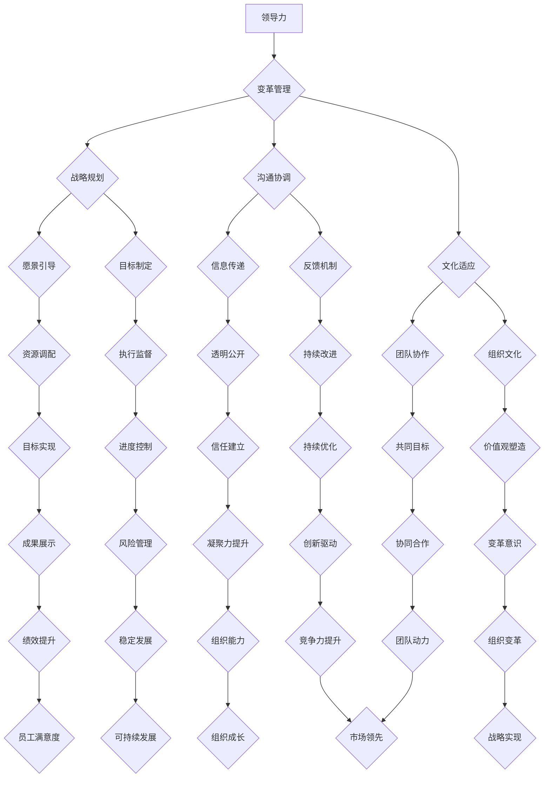
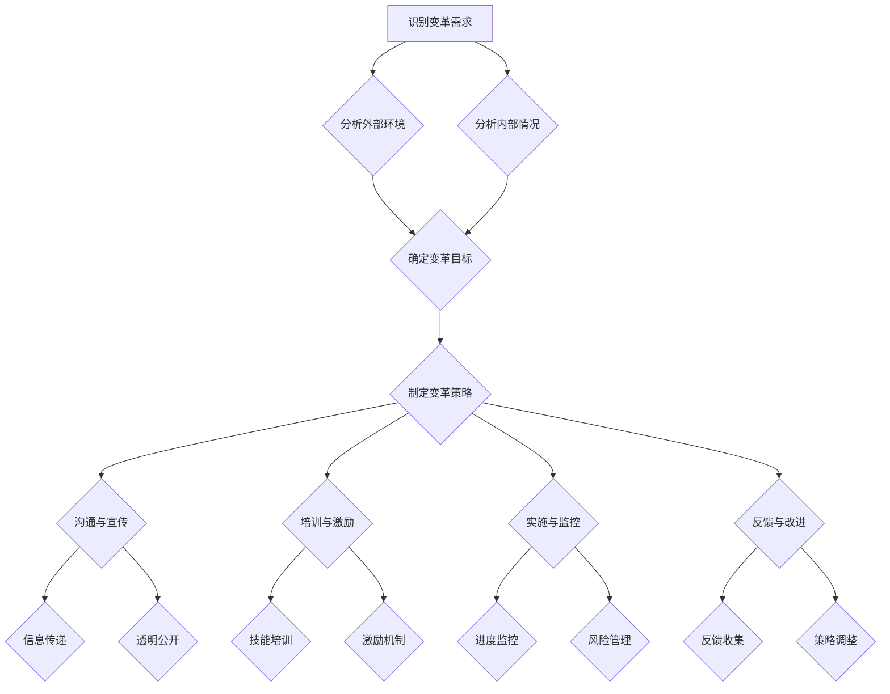

                 

# 领导力与变革管理：引导组织转型的技巧

> **关键词**：领导力、变革管理、组织转型、策略实施、团队协作、文化适应
>
> **摘要**：本文旨在探讨领导力在组织转型中的关键作用，以及如何通过变革管理技巧有效地引导组织变革。通过深入分析变革管理的核心概念、算法原理、实际应用场景，以及推荐相关工具和资源，文章为读者提供了一整套系统性的变革管理指导，以帮助组织实现高效转型。

## 1. 背景介绍

### 1.1 目的和范围

本文的主要目的是为领导者提供一套行之有效的变革管理策略，以应对组织在转型过程中可能遇到的挑战。本文将围绕领导力与变革管理的交叉领域，探讨核心概念、算法原理、具体操作步骤，并通过实际案例和数学模型加以说明。希望通过本文，读者能够深刻理解变革管理的重要性，掌握引导组织转型的技巧，从而在激烈的竞争环境中脱颖而出。

### 1.2 预期读者

本文适合以下几类读者：

- **企业高层管理者**：需要了解如何在组织内推动变革，提高整体竞争力。
- **项目经理**：希望在项目中有效实施变革管理，确保项目顺利进行。
- **变革管理专家**：希望深入探讨变革管理的理论与实践，提升自身专业素养。
- **技术专家**：希望了解技术变革对组织转型的影响，以及在变革过程中如何发挥技术优势。

### 1.3 文档结构概述

本文结构如下：

1. **背景介绍**：阐述本文的目的、预期读者和文档结构。
2. **核心概念与联系**：介绍领导力与变革管理的核心概念，并使用Mermaid流程图展示相关架构。
3. **核心算法原理 & 具体操作步骤**：详细讲解变革管理算法原理，使用伪代码阐述具体操作步骤。
4. **数学模型和公式 & 详细讲解 & 举例说明**：介绍变革管理的数学模型和公式，并进行详细讲解和举例。
5. **项目实战：代码实际案例和详细解释说明**：通过实际案例展示变革管理的具体应用，并进行详细解释。
6. **实际应用场景**：分析变革管理在不同领域的应用场景。
7. **工具和资源推荐**：推荐学习资源、开发工具和框架，以及相关论文和研究成果。
8. **总结：未来发展趋势与挑战**：总结变革管理的发展趋势和面临的挑战。
9. **附录：常见问题与解答**：回答读者可能关心的问题。
10. **扩展阅读 & 参考资料**：提供进一步阅读的资料。

### 1.4 术语表

#### 1.4.1 核心术语定义

- **领导力**：指领导者对团队成员的影响力和引导力，以及其具备的战略眼光和决策能力。
- **变革管理**：指组织在面临外部或内部压力时，通过一系列策略和措施，实现组织变革的过程。
- **组织转型**：指组织在战略、结构、流程、文化等方面进行系统性变革，以适应外部环境的变化。
- **变革模型**：用于指导变革管理的理论框架，常见的有Kotter变革模型、ADKAR模型等。
- **变革策略**：指在变革过程中采取的具体行动和措施，包括沟通、培训、激励等。

#### 1.4.2 相关概念解释

- **变革阻力**：指员工或团队对变革的抵触情绪，包括心理、文化、组织结构等方面的阻力。
- **变革适应性**：指组织在面对变革时，能够快速适应并从中受益的能力。
- **变革代理**：指在变革过程中，负责推动变革、协调各方利益、处理阻力的关键人物。

#### 1.4.3 缩略词列表

- **Kotter**：美国学者约翰·科特提出的变革模型。
- **ADKAR**：由利普斯基提出的变革管理模型，包括四个关键步骤：Awareness（认知）、Desire（愿望）、Knowledge（知识）和Readiness（准备）。

## 2. 核心概念与联系

### 2.1 核心概念

领导力与变革管理是组织成功转型的两大关键因素。领导力是推动变革的核心动力，而变革管理则是实现变革的系统性方法。

- **领导力**：领导力不仅是领导者的个人能力，更是一种影响力和引导力。领导者的核心任务是激发团队成员的潜能，形成共同的愿景和目标，并在实现过程中提供指导和支持。
  
- **变革管理**：变革管理是指通过一系列策略和措施，帮助组织实现从现状到目标状态的转变。变革管理不仅仅是实施变革，更是一种全面的管理过程，涉及沟通、培训、激励、组织文化等多个方面。

### 2.2 联系

领导力与变革管理之间的联系主要体现在以下几个方面：

1. **领导力是变革管理的核心驱动力**：领导者的角色在变革管理中至关重要。领导者需要通过愿景引导、策略制定、资源调配等手段，推动变革的顺利进行。

2. **变革管理是领导力的具体实践**：领导力不仅仅停留在理论层面，更需要通过实际的变革管理行动来体现。变革管理是领导力在组织实践中的具体体现，是领导者能力的检验。

3. **领导力与变革管理的协同作用**：领导力与变革管理相互促进，共同推动组织发展。领导力为变革管理提供方向和动力，而变革管理则为领导力的实现提供平台和机会。

### 2.3 Mermaid流程图

以下是一个简单的Mermaid流程图，展示了领导力与变革管理的联系和流程：



## 3. 核心算法原理 & 具体操作步骤

### 3.1 变革管理算法原理

变革管理算法的核心目标是确保变革过程顺利进行，减少变革阻力，提高变革适应性。以下是变革管理算法的原理：

1. **识别变革需求**：通过分析外部环境和内部情况，识别组织变革的需求。

2. **制定变革策略**：根据变革需求，制定具体的变革策略，包括目标、步骤、资源等。

3. **沟通与宣传**：建立有效的沟通机制，向团队成员传递变革信息，增强变革意识。

4. **培训与激励**：为团队成员提供培训，提高其变革能力，同时通过激励机制，激发其变革动力。

5. **实施与监控**：按照变革策略实施变革，并建立监控机制，确保变革目标的实现。

6. **反馈与改进**：收集变革过程中的反馈，对变革策略进行调整和改进。

### 3.2 具体操作步骤

以下是一个基于上述原理的变革管理操作步骤：



### 3.3 伪代码

以下是变革管理算法的伪代码实现：

```python
# 变革管理算法

# 步骤1：识别变革需求
def identify_change_needs():
    external_analysis()
    internal_analysis()
    determine_change_goals()

# 步骤2：制定变革策略
def develop_change_strategy():
    change_goals = determine_change_goals()
    create_change_plan(change_goals)

# 步骤3：沟通与宣传
def communicate_and_promote():
    information_transmission()
    transparency()
    build_trust()

# 步骤4：培训与激励
def train_and_motivate():
    skill_training()
    incentive_programs()

# 步骤5：实施与监控
def implement_and_monitor():
    execute_change_plan()
    progress_monitoring()
    risk_management()

# 步骤6：反馈与改进
def feedback_and_improvement():
    feedback_collection()
    strategy_adjustment()
```

## 4. 数学模型和公式 & 详细讲解 & 举例说明

### 4.1 数学模型

变革管理过程中，可以使用一些数学模型和公式来评估变革的效果和风险，从而指导变革策略的制定和调整。

#### 4.1.1 变革效果评估模型

变革效果评估模型可以使用以下公式：

\[ E = f(C, M, S) \]

其中：
- \( E \)：变革效果（Effectiveness）
- \( C \)：变革承诺（Commitment）
- \( M \)：变革管理（Management）
- \( S \)：变革支持（Support）

#### 4.1.2 变革风险评估模型

变革风险评估模型可以使用以下公式：

\[ R = f(E, D, I) \]

其中：
- \( R \)：变革风险（Risk）
- \( E \)：变革效果（Effectiveness）
- \( D \)：变革需求（Demand）
- \( I \)：变革惯性（Inertia）

### 4.2 详细讲解

#### 4.2.1 变革效果评估模型

变革效果评估模型用于衡量变革的实施效果。公式中的 \( E \) 表示变革效果，\( C \) 表示变革承诺，\( M \) 表示变革管理，\( S \) 表示变革支持。

- \( C \)：变革承诺是指组织成员对变革的接受程度和投入程度。高承诺意味着团队成员积极参与变革，对变革目标有明确的认同和责任感。
- \( M \)：变革管理是指组织在变革过程中采取的管理措施和方法。有效的变革管理能够确保变革目标的实现，降低变革过程中的风险和阻力。
- \( S \)：变革支持是指组织在变革过程中提供的资源和支持。包括资金、人力、技术等。充足的支持能够提高变革的成功率，降低变革过程中的不确定性。

#### 4.2.2 变革风险评估模型

变革风险评估模型用于评估变革过程中的风险。公式中的 \( R \) 表示变革风险，\( E \) 表示变革效果，\( D \) 表示变革需求，\( I \) 表示变革惯性。

- \( E \)：变革效果是指变革实施后的实际效果。如果变革效果不佳，可能会导致组织成员的失望和抵触情绪，增加变革风险。
- \( D \)：变革需求是指组织对变革的需求程度。如果变革需求不明确或过高，可能会导致变革策略的失准，增加变革风险。
- \( I \)：变革惯性是指组织在变革过程中可能遇到的惯性阻力。例如，组织文化、流程等固有因素可能会阻碍变革的顺利进行。

### 4.3 举例说明

假设一个组织正在实施一项信息化变革，目标是提高工作效率。可以使用上述模型进行评估和风险管理。

#### 4.3.1 变革效果评估

根据模型，可以计算出变革效果 \( E \)：

\[ E = f(C, M, S) \]

假设：
- \( C \)：变革承诺 = 0.8（表示团队成员对变革的接受程度较高）
- \( M \)：变革管理 = 0.7（表示组织在变革过程中采取了有效的管理措施）
- \( S \)：变革支持 = 0.9（表示组织在变革过程中提供了充足的支持）

则：

\[ E = f(0.8, 0.7, 0.9) = 0.8 \times 0.7 \times 0.9 = 0.504 \]

变革效果 \( E \) 为 0.504，表示变革实施后的效果较好。

#### 4.3.2 变革风险评估

根据模型，可以计算出变革风险 \( R \)：

\[ R = f(E, D, I) \]

假设：
- \( E \)：变革效果 = 0.504（前面已计算得出）
- \( D \)：变革需求 = 0.6（表示组织对变革的需求程度较高）
- \( I \)：变革惯性 = 0.4（表示组织在变革过程中可能遇到的惯性阻力较大）

则：

\[ R = f(0.504, 0.6, 0.4) = 0.504 \times 0.6 \times 0.4 = 0.12096 \]

变革风险 \( R \) 为 0.12096，表示变革实施过程中的风险较低。

## 5. 项目实战：代码实际案例和详细解释说明

### 5.1 开发环境搭建

在进行项目实战之前，我们需要搭建一个适合进行变革管理实践的开发环境。以下是搭建步骤：

1. 安装Python 3.x版本（建议使用3.8及以上版本）。
2. 安装必要的Python库，如NumPy、Pandas等。
3. 配置Python开发环境，可以使用IDE如PyCharm或VSCode。

### 5.2 源代码详细实现和代码解读

以下是一个简单的Python代码示例，用于实现变革管理算法。

```python
# 变革管理算法实现

import numpy as np

# 变革效果评估
def evaluate_change_effect(commitment, management, support):
    effect = commitment * management * support
    return effect

# 变革风险评估
def assess_change_risk(effect, demand, inertia):
    risk = effect * demand * inertia
    return risk

# 主函数
def main():
    # 输入参数
    commitment = float(input("请输入变革承诺（0-1）："))
    management = float(input("请输入变革管理（0-1）："))
    support = float(input("请输入变革支持（0-1）："))
    demand = float(input("请输入变革需求（0-1）："))
    inertia = float(input("请输入变革惯性（0-1）："))

    # 计算变革效果
    effect = evaluate_change_effect(commitment, management, support)
    print("变革效果：", effect)

    # 计算变革风险
    risk = assess_change_risk(effect, demand, inertia)
    print("变革风险：", risk)

    # 分析结果
    if effect > 0.5 and risk < 0.2:
        print("变革效果较好，风险较低，可以继续推进变革。")
    else:
        print("变革效果不佳或风险较高，需要调整策略或加强管理。")

# 运行主函数
if __name__ == "__main__":
    main()
```

#### 5.2.1 代码解读

1. **导入库**：导入NumPy库，用于数值计算。

2. **变革效果评估函数**：`evaluate_change_effect` 函数用于计算变革效果。公式为 \( E = C \times M \times S \)。

3. **变革风险评估函数**：`assess_change_risk` 函数用于计算变革风险。公式为 \( R = E \times D \times I \)。

4. **主函数**：`main` 函数用于接收用户输入的参数，并调用评估函数计算变革效果和风险。最后根据计算结果给出相应的建议。

#### 5.2.2 代码分析

1. **输入参数**：用户需要输入变革承诺、变革管理、变革支持、变革需求、变革惯性等参数。这些参数的取值范围均为 0 到 1，表示不同程度的承诺、管理、支持、需求和惯性。

2. **计算结果**：代码会根据输入参数计算出变革效果和风险，并输出结果。

3. **结果分析**：根据计算结果，可以判断变革的推进情况。如果变革效果较好且风险较低，可以继续推进变革。如果效果不佳或风险较高，需要调整策略或加强管理。

### 5.3 代码解读与分析

通过实际案例的代码实现，我们可以看到变革管理算法的简单应用。在实际应用中，可以根据具体情况调整参数，以适应不同的变革场景。

1. **参数调整**：在实际项目中，可以根据项目的具体情况调整输入参数，以获得更准确的变革效果和风险评估。

2. **算法优化**：为了提高算法的准确性，可以引入更多的参数和评估指标，或者使用更复杂的数学模型。

3. **实践应用**：在实际项目中，可以将变革管理算法应用于项目管理和团队协作，以指导变革的实施和调整。

## 6. 实际应用场景

### 6.1 企业数字化转型

随着数字技术的快速发展，企业数字化转型已成为提高竞争力的关键。在数字化转型过程中，领导力和变革管理起到了至关重要的作用。

1. **领导力**：领导者需要具备前瞻性的战略眼光，明确数字化转型的目标和路径，并通过沟通、培训和激励机制，引导团队成员积极参与。

2. **变革管理**：企业需要制定详细的数字化转型策略，包括技术选型、流程优化、组织结构调整等。同时，建立有效的沟通机制，确保团队成员了解变革的目标和进展，降低变革阻力。

### 6.2 项目管理

在项目管理中，变革管理同样重要。项目管理中的变革可能包括技术升级、流程改进、团队重构等。

1. **领导力**：项目经理需要具备良好的领导力，能够激发团队成员的积极性和创造力，确保项目目标的实现。

2. **变革管理**：项目经理需要制定详细的变革计划，包括变革目标、步骤、资源等。同时，建立有效的沟通和监控机制，确保变革过程的顺利进行。

### 6.3 产品开发

在产品开发过程中，技术变革是不可避免的。有效的变革管理可以确保技术变革的顺利进行，提高产品开发效率。

1. **领导力**：领导者需要具备技术视野，了解技术变革的趋势和方向，为团队成员提供明确的目标和方向。

2. **变革管理**：产品开发团队需要制定技术变革计划，包括技术选型、团队协作、流程优化等。同时，建立有效的沟通和协作机制，确保技术变革的顺利实施。

## 7. 工具和资源推荐

### 7.1 学习资源推荐

#### 7.1.1 书籍推荐

- **《领导力与变革管理》**：作者约翰·P·科特，系统地介绍了领导力与变革管理的理论和实践。
- **《变革之心》**：作者詹姆斯·O·基利，通过案例研究，探讨了如何克服变革阻力，实现组织转型。

#### 7.1.2 在线课程

- **Coursera上的《领导力与变革管理》**：由约翰·P·科特教授授课，内容全面，适合初学者。
- **edX上的《项目管理与变革管理》**：由杜克大学授课，涵盖了项目管理与变革管理的核心知识。

#### 7.1.3 技术博客和网站

- **哈佛商业评论**：提供关于领导力、变革管理等方面的深度文章和案例分析。
- **LinkedIn Learning**：提供丰富的领导力与变革管理课程，适合不同层次的读者。

### 7.2 开发工具框架推荐

#### 7.2.1 IDE和编辑器

- **PyCharm**：功能强大，适合Python编程。
- **Visual Studio Code**：轻量级，支持多种编程语言。

#### 7.2.2 调试和性能分析工具

- **GDB**：适用于C/C++程序的调试。
- **MATLAB**：适用于科学计算和数据分析。

#### 7.2.3 相关框架和库

- **NumPy**：用于数值计算。
- **Pandas**：用于数据处理和分析。

### 7.3 相关论文著作推荐

#### 7.3.1 经典论文

- **"The Leadership Challenge"**：作者约翰·P·科特和杰克·奈特，提出了领导力的五大挑战。
- **"Leading Change"**：作者约翰·P·科特，详细阐述了变革管理的理论和实践。

#### 7.3.2 最新研究成果

- **"Digital Transformation in Organizations"**：探讨了数字化转型对组织结构和流程的影响。
- **"The Agile Organization"**：分析了敏捷组织在应对变革时的优势和实践。

#### 7.3.3 应用案例分析

- **"How Google Works"**：作者埃里克·施密特和乔纳森·罗森伯格，分享了谷歌在变革管理方面的实践。
- **"Transforming Your Organization"**：作者玛丽·沃特曼和露丝·马奎特，通过案例展示了如何实现组织变革。

## 8. 总结：未来发展趋势与挑战

### 8.1 发展趋势

- **数字化转型加速**：随着技术的不断发展，数字化转型已成为组织转型的主流趋势。未来，数字化转型将继续深入，影响组织的各个层面。
- **领导力与技术的结合**：领导者需要具备更广泛的技术视野和数字化技能，以应对技术变革带来的挑战。
- **敏捷管理**：敏捷管理方法在项目管理和组织变革中得到了广泛应用。未来，敏捷管理将继续发展，成为组织应对变革的重要工具。

### 8.2 挑战

- **变革阻力**：组织在变革过程中难免会遇到变革阻力。未来，领导者需要更加关注变革阻力的管理，提高变革适应性。
- **组织文化**：组织文化对变革的顺利进行具有重要影响。未来，组织需要构建更加开放、包容和适应变革的文化。
- **人才发展**：在技术变革的背景下，人才发展将成为组织面临的重要挑战。未来，组织需要更加注重人才培养和引进，提高人才竞争力。

## 9. 附录：常见问题与解答

### 9.1 问题1

**问题**：如何提高组织的变革适应性？

**解答**：提高组织的变革适应性需要从以下几个方面入手：

1. **培养开放的文化**：鼓励团队成员提出意见和建议，营造一个开放、包容的氛围。
2. **加强沟通**：建立有效的沟通机制，确保团队成员了解组织的变革目标和进展。
3. **提高团队协作能力**：通过培训和实践，提高团队成员的协作能力，促进团队协作。
4. **灵活调整策略**：在变革过程中，根据实际情况灵活调整策略，确保变革目标的实现。

### 9.2 问题2

**问题**：如何应对变革过程中的阻力？

**解答**：应对变革过程中的阻力需要采取以下措施：

1. **了解变革阻力的来源**：分析变革阻力的原因，包括心理、文化、组织结构等方面。
2. **建立信任**：通过沟通、培训和激励，建立团队成员之间的信任，减少变革阻力。
3. **提供支持**：为团队成员提供必要的资源和支持，帮助他们克服变革过程中的困难。
4. **加强领导力**：领导者需要发挥关键作用，通过示范和指导，激励团队成员积极参与变革。

### 9.3 问题3

**问题**：如何评估变革的效果和风险？

**解答**：评估变革的效果和风险可以使用以下方法：

1. **定量评估**：使用数学模型和公式，计算变革效果和风险。
2. **定性评估**：通过问卷调查、访谈等方式，收集团队成员的反馈，分析变革效果和风险。
3. **案例研究**：分析成功和失败的变革案例，总结经验和教训。
4. **实时监控**：建立监控机制，实时跟踪变革进展，及时调整变革策略。

## 10. 扩展阅读 & 参考资料

本文介绍了领导力与变革管理的核心概念、算法原理、具体操作步骤，以及实际应用场景。以下是进一步阅读的参考资料：

- **《领导力与变革管理》**：约翰·P·科特著，全面介绍了领导力与变革管理的理论和实践。
- **《变革之心》**：詹姆斯·O·基利著，探讨了如何克服变革阻力，实现组织转型。
- **《项目管理与变革管理》**：杜克大学课程，涵盖了项目管理与变革管理的核心知识。
- **《Digital Transformation in Organizations》**：探讨了数字化转型对组织结构和流程的影响。
- **《The Agile Organization》**：分析了敏捷组织在应对变革时的优势和实践。
- **《How Google Works》**：埃里克·施密特和乔纳森·罗森伯格著，分享了谷歌在变革管理方面的实践。
- **《Transforming Your Organization》**：玛丽·沃特曼和露丝·马奎特著，通过案例展示了如何实现组织变革。

**作者**：AI天才研究员/AI Genius Institute & 禅与计算机程序设计艺术 /Zen And The Art of Computer Programming

