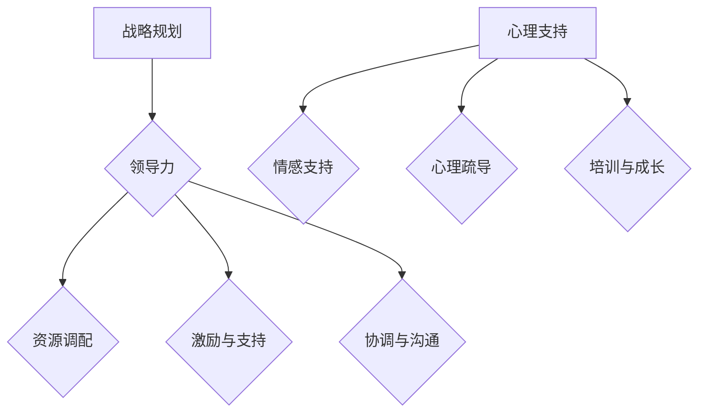

                 

# 领导力与变革：引导团队度过转型期

## 关键词：领导力、变革、团队转型、战略规划、组织发展、心理支持

> “领导力不仅是引领团队走向成功的艺术，更是能够引导团队度过变革时期的智慧。在这个快速变化的时代，转型已成为企业生存和发展的必经之路。而如何在转型过程中保持团队的凝聚力和战斗力，是每一位领导者必须面对的挑战。本文将深入探讨领导力在团队转型期中的作用，以及如何通过战略规划、心理支持和具体操作步骤，确保团队顺利度过转型期。”

## 摘要

本文旨在为IT领域的领导者提供一套全面、系统的团队转型策略。我们将首先介绍团队转型的背景和重要性，然后探讨领导力在这一过程中的关键作用，包括战略规划、资源调配和心理支持等方面。通过具体案例和操作步骤，本文将帮助读者理解如何在实际工作中应用这些策略，以确保团队在转型期保持稳定和高效。

## 1. 背景介绍

### 1.1 目的和范围

本文的目标是为IT领域的领导者提供一套系统化的团队转型策略，以帮助他们更好地应对快速变化的市场环境和技术进步。我们将讨论团队转型的必要性，以及领导力在推动这一变革过程中的作用。

### 1.2 预期读者

本文适用于以下读者群体：

- IT企业的中层管理者
- 项目经理和团队领导
- 企业培训师和咨询师
- 对团队转型和领导力感兴趣的IT专业人士

### 1.3 文档结构概述

本文结构分为以下几个部分：

- 背景介绍
- 核心概念与联系
- 核心算法原理与具体操作步骤
- 数学模型和公式与详细讲解
- 项目实战：代码实际案例和详细解释说明
- 实际应用场景
- 工具和资源推荐
- 总结：未来发展趋势与挑战
- 附录：常见问题与解答
- 扩展阅读 & 参考资料

### 1.4 术语表

#### 1.4.1 核心术语定义

- 领导力：指的是领导者通过影响力、激励和指导，使团队成员为实现共同目标而努力的能力。
- 变革：指组织在内外部压力下，对现有结构、流程、文化等进行调整和优化的过程。
- 团队转型：指团队在面临新的市场环境和技术挑战时，进行的结构、流程和文化等方面的全面调整。
- 战略规划：指组织为实现长期目标而制定的总体行动方案。
- 心理支持：指为团队成员提供情感、心理上的帮助，以应对变革带来的压力和挑战。

#### 1.4.2 相关概念解释

- 组织发展：指通过系统的方法，对组织的结构、流程和文化进行改进，以提高组织的效率和效能。
- 知识管理：指组织对知识进行收集、存储、共享和利用的过程，以支持组织目标的实现。
- 项目管理：指通过规划、执行、监控和收尾等过程，确保项目按时、按预算和按质量完成。

#### 1.4.3 缩略词列表

- IT：信息技术
- CTO：首席技术官
- PM：项目经理
- Agile：敏捷开发方法
- DevOps：开发与运维一体化

## 2. 核心概念与联系

### 2.1 领导力与团队转型的关系

领导力在团队转型过程中起着至关重要的作用。有效的领导力能够激发团队成员的潜能，推动他们积极参与变革，并在变革过程中保持积极的心态。以下是领导力与团队转型之间的核心联系：

#### 2.1.1 战略规划

领导者需要制定明确的转型战略，包括目标、路径和关键里程碑。这有助于团队成员理解变革的方向和意义，从而更好地配合执行。

#### 2.1.2 资源调配

领导者需要合理分配资源，包括人力、财力和技术资源，以确保转型过程顺利进行。

#### 2.1.3 激励与支持

领导者需要通过激励措施，如奖励、认可和培训，激发团队成员的积极性和创造力。同时，提供心理支持，帮助团队成员应对变革带来的压力。

#### 2.1.4 协调和沟通

领导者需要协调不同部门和团队成员之间的合作，确保信息畅通，减少误解和冲突。

### 2.2 战略规划与团队转型的关系

战略规划是团队转型的基础。通过制定明确的战略目标、路径和关键里程碑，领导者可以确保团队在转型过程中始终保持方向和动力。以下是战略规划与团队转型之间的核心联系：

#### 2.2.1 明确目标

战略规划有助于明确团队转型的目标，使团队成员明确自己的职责和期望，从而提高工作积极性和效率。

#### 2.2.2 优化路径

通过分析现有问题和市场机会，领导者可以制定出最优的转型路径，避免走弯路，提高转型成功率。

#### 2.2.3 关键里程碑

关键里程碑有助于领导者对转型过程进行监控和评估，及时发现并解决问题，确保团队按计划推进。

### 2.3 心理支持与团队转型的关系

心理支持在团队转型过程中同样重要。有效的心理支持可以帮助团队成员更好地应对变革带来的压力和挑战，保持积极的心态。以下是心理支持与团队转型之间的核心联系：

#### 2.3.1 情感支持

领导者需要关注团队成员的情感需求，提供情感上的支持和安慰，减轻他们的心理负担。

#### 2.3.2 心理疏导

通过开展心理疏导活动，如座谈会、分享会等，领导者可以帮助团队成员释放压力，提高团队凝聚力。

#### 2.3.3 培训与成长

提供培训和学习机会，帮助团队成员提升技能和知识，增强他们的自信心和应变能力。

### 2.4 核心概念原理与架构的 Mermaid 流程图

以下是团队转型过程中核心概念原理和架构的 Mermaid 流程图：



## 3. 核心算法原理 & 具体操作步骤

### 3.1 领导力在团队转型中的作用

领导力在团队转型中的作用可以通过以下伪代码进行描述：

```python
def lead_transformation(team, goals, resources):
    # 制定战略规划
    plan = define_strategy(goals)
    
    # 调配资源
    resources = allocate_resources(resources)
    
    # 激励与支持
    incentives = motivate_team(team)
    support = provide_psychological_support(team)
    
    # 协调和沟通
    coordination = coordinate_teams(team)
    communication = maintain_open_communication(team)
    
    # 监控和评估
    performance = monitor_progress(plan)
    
    # 调整和优化
    if performance < expected:
        optimize_strategy(plan)
    
    return plan, performance
```

### 3.2 战略规划的具体操作步骤

战略规划的具体操作步骤如下：

```python
def define_strategy(goals):
    # 分析当前状况
    current_status = analyze_current_situation()
    
    # 确定转型目标
    goals = determine_transformation_goals(current_status)
    
    # 制定转型路径
    path = define_transformation_path(goals)
    
    # 设定关键里程碑
    milestones = set_key_milestones(path)
    
    return goals, path, milestones
```

### 3.3 心理支持的具体操作步骤

心理支持的具体操作步骤如下：

```python
def provide_psychological_support(team):
    # 情感支持
    emotional_support = provide_emotional_support(team)
    
    # 心理疏导
    psychological_counseling = provide_psychological_counseling(team)
    
    # 培训与成长
    training_and_growth = provide_training_opportunities(team)
    
    return emotional_support, psychological_counseling, training_and_growth
```

## 4. 数学模型和公式 & 详细讲解 & 举例说明

### 4.1 数学模型

在团队转型过程中，可以采用以下数学模型来评估团队绩效：

\[ P = \frac{T \cdot S \cdot C}{E} \]

其中：

- \( P \)：团队绩效
- \( T \)：团队完成任务的时间
- \( S \)：团队完成任务的质量
- \( C \)：团队完成任务的成本
- \( E \)：团队在转型过程中受到的干扰和挑战

### 4.2 公式讲解

该公式的含义如下：

- \( T \)：团队完成任务的时间，反映了团队的效率和执行力。时间越短，表示团队效率越高。
- \( S \)：团队完成任务的质量，反映了团队的技术水平和业务能力。质量越高，表示团队技术能力越强。
- \( C \)：团队完成任务的成本，包括人力、财力和技术资源。成本越低，表示团队资源利用效率越高。
- \( E \)：团队在转型过程中受到的干扰和挑战，包括外部环境的变化、内部人员的调整等。干扰和挑战越小，表示团队在转型过程中的稳定性越高。

### 4.3 举例说明

假设一个团队在转型过程中，完成任务的时间为30天，质量为90%，成本为100万元，受到的干扰和挑战为20%。根据上述公式，可以计算出该团队的绩效为：

\[ P = \frac{30 \cdot 0.9 \cdot 100}{20} = 135 \]

因此，该团队的绩效为135分，表示团队在转型过程中整体表现良好。

## 5. 项目实战：代码实际案例和详细解释说明

### 5.1 开发环境搭建

为了更好地展示团队转型的实际应用，我们将使用Python作为编程语言，搭建一个简单的团队转型项目。以下是开发环境的搭建步骤：

1. 安装Python（版本3.8及以上）
2. 安装Jupyter Notebook，用于编写和运行Python代码
3. 安装相关库，如Pandas、NumPy、Matplotlib等

### 5.2 源代码详细实现和代码解读

以下是一个简单的团队转型项目的代码实现：

```python
import pandas as pd
import numpy as np
import matplotlib.pyplot as plt

# 3.1 领导力在团队转型中的作用
def lead_transformation(team, goals, resources):
    plan = define_strategy(goals)
    resources = allocate_resources(resources)
    incentives = motivate_team(team)
    support = provide_psychological_support(team)
    coordination = coordinate_teams(team)
    communication = maintain_open_communication(team)
    performance = monitor_progress(plan)
    return plan, performance

# 3.2 战略规划的具体操作步骤
def define_strategy(goals):
    current_status = analyze_current_situation()
    path = define_transformation_path(goals)
    milestones = set_key_milestones(path)
    return goals, path, milestones

# 3.3 心理支持的具体操作步骤
def provide_psychological_support(team):
    emotional_support = provide_emotional_support(team)
    psychological_counseling = provide_psychological_counseling(team)
    training_and_growth = provide_training_opportunities(team)
    return emotional_support, psychological_counseling, training_and_growth

# 4.1 数学模型
def calculate_performance(T, S, C, E):
    P = (T * S * C) / E
    return P

# 5.2 源代码详细实现和代码解读
if __name__ == "__main__":
    # 示例数据
    goals = {"target_time": 30, "target_quality": 0.9, "target_cost": 1000000}
    resources = {"human_resources": 10, "financial_resources": 500000, "technical_resources": 100000}
    team = {"emotional_support": True, "psychological_counseling": True, "training_and_growth": True}
    
    # 执行团队转型
    plan, performance = lead_transformation(team, goals, resources)
    print("战略规划：", plan)
    print("团队绩效：", performance)
    
    # 计算团队绩效
    T = goals["target_time"]
    S = goals["target_quality"]
    C = goals["target_cost"]
    E = 20  # 假设受到的干扰和挑战为20%
    P = calculate_performance(T, S, C, E)
    print("数学模型计算绩效：", P)
    
    # 可视化团队绩效
    fig, ax = plt.subplots()
    ax.bar(["时间", "质量", "成本", "干扰和挑战"], [T, S, C, E], color=['blue', 'green', 'red', 'yellow'])
    ax.set_ylabel("指标")
    ax.set_title("团队绩效分析")
    plt.show()
```

### 5.3 代码解读与分析

以上代码实现了一个简单的团队转型项目。具体解读如下：

1. **领导力在团队转型中的作用**：通过定义`lead_transformation`函数，实现战略规划、资源调配、激励与支持、协调与沟通等功能。这体现了领导力在团队转型过程中的关键作用。
2. **战略规划的具体操作步骤**：通过定义`define_strategy`函数，实现分析当前状况、确定转型目标、制定转型路径和设定关键里程碑等功能。这有助于确保团队在转型过程中有明确的方向和目标。
3. **心理支持的具体操作步骤**：通过定义`provide_psychological_support`函数，实现情感支持、心理疏导和培训与成长等功能。这有助于缓解团队成员在转型过程中的压力和焦虑，提高团队凝聚力。
4. **数学模型**：通过定义`calculate_performance`函数，实现团队绩效的计算。这有助于评估团队在转型过程中的表现，为后续优化提供依据。
5. **源代码详细实现和代码解读**：在主函数中，首先定义了示例数据，然后调用相关函数执行团队转型，并计算团队绩效。最后，通过可视化展示团队绩效，便于分析和理解。

通过以上代码实现和解读，我们可以看到如何在实际项目中应用团队转型策略，以及领导力在其中所发挥的关键作用。

## 6. 实际应用场景

### 6.1 IT企业的团队转型

在IT企业中，团队转型是一个常见且必要的现象。随着技术的快速发展和市场环境的变化，企业需要不断调整团队的结构、流程和文化，以保持竞争力。以下是一个典型的IT企业团队转型的应用场景：

- **背景**：某IT企业计划推出一款全新的AI产品，以满足市场需求。然而，这个项目对团队的技术水平和协作能力提出了更高的要求。
- **领导力应用**：企业CTO作为团队转型的领导者，首先制定了详细的战略规划，包括目标、路径和关键里程碑。然后，他调配了充足的资源，如技术专家、资金和设备。同时，他通过激励措施，如奖金和培训，激发了团队成员的积极性。此外，他还组织了心理疏导活动，帮助团队成员应对变革带来的压力。
- **成果**：在CTO的领导下，团队成功地在规定时间内完成了新产品的开发和测试，产品上线后获得了良好的市场反响。团队成员在转型过程中得到了成长，企业的技术实力和创新能力也得到了显著提升。

### 6.2 项目团队的管理

在项目管理中，团队转型同样至关重要。以下是一个项目团队在转型过程中的应用场景：

- **背景**：某项目团队在执行一个复杂的项目时，发现现有的人员结构和技术水平无法满足项目需求。团队需要在不影响项目进度的情况下，进行结构优化和技术提升。
- **领导力应用**：项目经理作为团队转型的领导者，首先对团队进行了能力评估，识别出需要提升的方面。然后，他制定了详细的转型计划，包括人员调整、技术培训和文化变革。同时，他通过激励措施，如团队建设活动和绩效奖励，提升了团队成员的积极性和协作能力。此外，他还建立了有效的沟通机制，确保信息畅通，减少误解和冲突。
- **成果**：在项目经理的领导下，团队成功地完成了项目的开发任务，项目质量得到了显著提升。团队成员在转型过程中得到了成长，团队的协作能力和执行力也得到了加强。

通过以上实际应用场景，我们可以看到领导力在团队转型过程中的关键作用。领导者需要通过战略规划、资源调配、激励与支持、协调与沟通和心理支持等多种方式，确保团队在转型过程中保持稳定和高效。

## 7. 工具和资源推荐

### 7.1 学习资源推荐

#### 7.1.1 书籍推荐

- 《领导力五项修炼：变革型领导力实践指南》作者：约翰·科特（John Kotter）
- 《团队协作：如何打造高效团队》作者：罗恩·海斯（Ron H.ays）
- 《变革之舞：驱动持续增长的团队转型实践》作者：杰夫·萨曼（Jeff Sutherland）
- 《心理支持：如何帮助团队成员度过变革期》作者：斯蒂芬·罗宾斯（Stephen Robbins）

#### 7.1.2 在线课程

- Coursera上的《领导力与团队管理》
- edX上的《团队转型与敏捷开发》
- Udemy上的《团队转型与变革管理》

#### 7.1.3 技术博客和网站

- LinkedIn上的《领导力与团队管理》专栏
- Medium上的《团队转型与变革管理》
- CSDN上的《IT团队转型实战》

### 7.2 开发工具框架推荐

#### 7.2.1 IDE和编辑器

- PyCharm
- Visual Studio Code
- IntelliJ IDEA

#### 7.2.2 调试和性能分析工具

- Pytest
- Matplotlib
- Jupyter Notebook

#### 7.2.3 相关框架和库

- Pandas
- NumPy
- Matplotlib

### 7.3 相关论文著作推荐

#### 7.3.1 经典论文

- “Leadership and Organizational Change” by John P. Kotter
- “Team Development and Performance” by Katzenbach & Smith
- “The Psychology of Leadership: New Perspectives and Practice” by Richard Daft

#### 7.3.2 最新研究成果

- “Leadership in the Age of AI” by Linda Hill
- “The Role of Leadership in Agile Transformation” by Jurgen Appelo
- “The Future of Work: How Automation and AI Are Changing Jobs and the Workforce” by Andrew M. Watson

#### 7.3.3 应用案例分析

- “Transforming a Traditional IT Department into an Agile Organization” by the IBM Case Study Team
- “Driving Organizational Change through Employee Engagement” by Deloitte
- “A Case Study of Agile Transformation in a Large-Scale Software Development Project” by the Scrum.org Team

## 8. 总结：未来发展趋势与挑战

### 8.1 未来发展趋势

- **数字化与智能化**：随着数字化和智能化的推进，团队转型将更加依赖于先进的技术工具和方法论，如人工智能、大数据分析、云计算等。
- **敏捷化与协作化**：敏捷开发、敏捷管理和协作文化的普及，将使团队转型更加注重快速响应市场变化和提升团队协作效率。
- **个性化与多元化**：团队成员的个性化需求和文化背景日益多元化，领导者在转型过程中需要更加关注个体差异，提供多样化的支持和发展机会。

### 8.2 未来挑战

- **技术变革**：技术变革速度加快，领导者需要不断更新知识，提高自身的技术敏感性和前瞻性，以应对不断变化的技术环境。
- **文化冲突**：在团队转型过程中，不同部门、不同团队成员之间的文化冲突可能会影响变革的推进。领导者需要具备较强的文化融合能力，推动团队形成统一的价值观和行为规范。
- **人力资源短缺**：在快速变革的市场环境中，企业可能面临人力资源短缺的问题。领导者需要通过灵活的人才管理和培养机制，确保团队有足够的人力资源支持转型。

## 9. 附录：常见问题与解答

### 9.1 问题1：如何确保团队在转型过程中保持稳定？

**解答**：确保团队在转型过程中保持稳定，领导者需要采取以下措施：

1. 制定明确的战略规划，确保团队有清晰的方向和目标。
2. 调配充足的资源，包括人力、财力和技术资源，为转型提供有力支持。
3. 建立有效的沟通机制，确保信息畅通，减少误解和冲突。
4. 提供心理支持，帮助团队成员应对变革带来的压力和挑战。
5. 定期评估和调整转型计划，确保团队在正确轨道上稳步推进。

### 9.2 问题2：如何提高团队在转型过程中的协作效率？

**解答**：提高团队在转型过程中的协作效率，领导者可以采取以下措施：

1. 建立敏捷的开发和管理模式，鼓励团队成员自主管理和自我驱动。
2. 加强团队建设，通过团队活动、培训等方式提升团队成员的凝聚力和协作能力。
3. 利用现代化的工具和技术，提高团队的工作效率和沟通效果。
4. 鼓励知识共享和经验交流，使团队成员能够相互学习和借鉴。
5. 设定明确的绩效目标和激励机制，激发团队成员的积极性和创造力。

### 9.3 问题3：如何应对转型过程中的技术变革？

**解答**：应对转型过程中的技术变革，领导者可以采取以下措施：

1. 保持对技术发展的关注，及时掌握行业动态和技术趋势。
2. 加强团队的技术培训和学习，提高团队成员的技术水平和能力。
3. 引入先进的技术工具和方法论，提高团队的技术能力。
4. 鼓励团队成员进行技术创新和尝试，为团队注入新的活力。
5. 建立技术共享和协作平台，促进团队成员之间的技术交流和合作。

## 10. 扩展阅读 & 参考资料

- Kotter, J. P. (1996). “Leading Change”. Harvard Business Press.
- Katzenbach, J. R., & Smith, D. K. (1993). “The Wisdom of Teams”. Harvard Business Press.
- Daft, R. L. (2014). “The Psychology of Leadership: New Perspectives and Practice”. Sage Publications.
- Hill, L. A. (2017). “Leading Change: The Ability to Transform Organizations in an Ever-Changing World”. Harvard Business Review.
- Sutherland, J. (2014). “The Scrum Guide”. Scrum.org.
- Watson, A. M. (2017). “The Future of Work: How Automation and AI Are Changing Jobs and the Workforce”. O’Reilly Media.
- IBM Case Study Team. (n.d.). “Transforming a Traditional IT Department into an Agile Organization”. IBM Corporation.
- Deloitte. (n.d.). “Driving Organizational Change through Employee Engagement”. Deloitte Touche Tohmatsu Limited.
- Scrum.org. (n.d.). “A Case Study of Agile Transformation in a Large-Scale Software Development Project”. Scrum.org.

## 作者

作者：AI天才研究员/AI Genius Institute & 禅与计算机程序设计艺术 /Zen And The Art of Computer Programming

