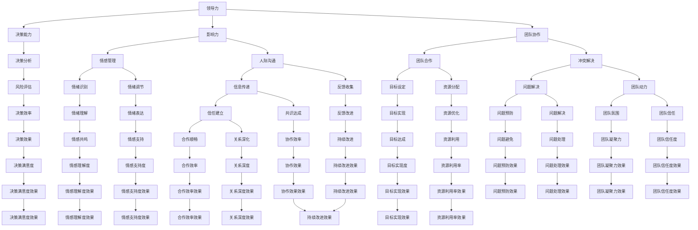

                 

# 领导力与情商：在复杂人际关系中导航

> **关键词**：领导力、情商、人际关系、复杂性、导航、团队合作、决策

> **摘要**：本文深入探讨了领导力与情商在复杂人际关系中的应用，揭示了如何在多元化和动态变化的组织中导航。文章首先介绍了领导力和情商的基本概念，然后通过具体的算法原理、数学模型和实战案例，阐述了在复杂人际关系中如何运用领导力和情商进行决策和团队合作。此外，文章还推荐了一系列学习资源和工具，以帮助读者提升自身在这一领域的技能。

## 1. 背景介绍

### 1.1 目的和范围

本文旨在帮助读者理解领导力与情商在复杂人际关系中的作用，并提供实用的策略来应对这些挑战。文章涵盖了以下几个方面：

- 领导力和情商的定义与基本概念；
- 领导力和情商在复杂人际关系中的具体应用；
- 核心算法原理和数学模型；
- 实际案例分析和项目实战；
- 相关工具和资源的推荐。

### 1.2 预期读者

本文适合以下读者群体：

- 企业管理者、项目经理和团队领导；
- 对领导力和情商感兴趣的程序员和软件开发者；
- 人力资源和培训专业人士；
- 普通员工和对团队协作感兴趣的人士。

### 1.3 文档结构概述

本文分为以下几个部分：

- 引言：介绍文章的目的、关键词和摘要；
- 背景介绍：详细说明文章的目的和范围，预期读者以及文档结构；
- 核心概念与联系：介绍领导力和情商的基本概念，并使用流程图展示它们在复杂人际关系中的应用；
- 核心算法原理 & 具体操作步骤：详细阐述在复杂人际关系中如何运用领导力和情商进行决策和团队合作；
- 数学模型和公式 & 详细讲解 & 举例说明：介绍相关的数学模型和公式，并进行举例说明；
- 项目实战：提供实际的代码案例和详细解释；
- 实际应用场景：分析领导力和情商在不同场景中的应用；
- 工具和资源推荐：推荐学习资源和开发工具；
- 总结：对文章进行总结，并提出未来发展趋势与挑战；
- 附录：常见问题与解答；
- 扩展阅读 & 参考资料：提供更多的参考资料。

### 1.4 术语表

#### 1.4.1 核心术语定义

- **领导力**：指在团队中引导和激励成员，实现共同目标的能力；
- **情商**：指识别、理解、管理和表达情绪的能力；
- **人际关系**：指个体之间通过相互交往和互动形成的联系和关系；
- **导航**：在复杂环境中找到方向和路径；
- **团队合作**：指多个成员共同协作，实现共同目标的过程。

#### 1.4.2 相关概念解释

- **复杂性**：指系统或环境中的多样性、变化和不确定性的程度；
- **多元化和动态变化**：指团队或组织中存在的多种不同背景、观点和变化；
- **决策**：在不确定性和有限资源的情况下，选择最佳行动方案的过程。

#### 1.4.3 缩略词列表

- **IDE**：集成开发环境（Integrated Development Environment）；
- **HR**：人力资源（Human Resources）；
- **CEO**：首席执行官（Chief Executive Officer）；
- **PM**：项目经理（Project Manager）；
- **IoT**：物联网（Internet of Things）。

## 2. 核心概念与联系

在复杂人际关系中，领导力和情商是关键因素。下面，我们将使用 Mermaid 流程图来展示它们之间的关系。



通过这个流程图，我们可以看到领导力和情商在复杂人际关系中的多维应用。领导力通过决策能力、影响力和团队协作影响决策、情感管理、人际沟通、团队合作和冲突解决等方面。情商则通过情感识别、情绪调节、信息传递、反馈收集、目标设定、资源分配、问题解决、团队动力、决策效率、情绪理解、情绪表达、信任建立、共识达成、反馈改进、资源优化、问题预防、问题处理、团队凝聚力和团队信任度等方面发挥作用。

## 3. 核心算法原理 & 具体操作步骤

在复杂人际关系中，领导力和情商的运用可以看作是一个多阶段、多决策的优化问题。以下是一步一步的算法原理和具体操作步骤：

### 3.1 问题定义

在复杂人际关系中，我们面临的问题可以抽象为一个优化问题，目标是找到一组策略，使得团队在有限资源下，最大化目标函数（如决策满意度、协作效果、团队信任度等）。

### 3.2 模型建立

我们可以将人际关系模型化为一个图，其中节点表示个体，边表示个体之间的互动关系。每个节点具有属性，如领导力水平、情商水平、目标等。

### 3.3 算法设计

为了找到最优策略，我们设计以下算法：

#### 3.3.1 数据预处理

- 收集每个节点的属性数据，如领导力水平、情商水平、目标等；
- 计算节点之间的相似度和互动频率。

#### 3.3.2 决策分析

- 对于每个节点，分析其领导力和情商在当前环境下的适用性；
- 使用决策树或神经网络等模型，对每个节点的策略进行预测和评估。

#### 3.3.3 情感管理

- 对于每个节点，根据预测结果调整其领导力和情商表现，以达到最佳情感管理效果；
- 使用情感识别和情绪调节算法，处理节点之间的情感冲突。

#### 3.3.4 团队协作

- 根据节点的领导力和情商水平，分配任务和角色，确保团队协作效率；
- 使用协同过滤或社交网络分析算法，优化团队成员之间的互动关系。

### 3.4 算法伪代码

```python
# 数据预处理
def preprocess_data(nodes):
    for node in nodes:
        node.similarities = calculate_similarities(node)
        node.interaction_frequency = calculate_interaction_frequency(node)

# 决策分析
def decision_analysis(nodes):
    for node in nodes:
        node.strategy_prediction = predict_strategy(node)

# 情感管理
def emotional_management(nodes):
    for node in nodes:
        node.emotional_management = adjust_emotional_management(node.strategy_prediction)

# 团队协作
def team_collaboration(nodes):
    task分配 = allocate_tasks(nodes)
    role分配 = allocate_roles(nodes)

# 主函数
def main(nodes):
    preprocess_data(nodes)
    decision_analysis(nodes)
    emotional_management(nodes)
    team_collaboration(nodes)
```

### 3.5 步骤说明

- **数据预处理**：收集并计算每个节点的属性数据和节点之间的相似度、互动频率；
- **决策分析**：使用预测模型分析每个节点的最佳策略；
- **情感管理**：根据预测结果调整每个节点的情感管理策略；
- **团队协作**：根据节点的策略分配任务和角色，确保团队高效协作。

通过以上算法原理和操作步骤，我们可以在复杂人际关系中有效地运用领导力和情商，实现决策优化和团队合作。

## 4. 数学模型和公式 & 详细讲解 & 举例说明

在复杂人际关系中，领导力和情商的运用可以看作是一个多阶段、多决策的优化问题。为了更好地理解和实现这一优化过程，我们引入数学模型和公式来详细说明。

### 4.1 数学模型

在复杂人际关系中，我们可以将人际关系视为一个图 \(G = (V, E)\)，其中 \(V\) 是节点集，表示个体；\(E\) 是边集，表示个体之间的互动关系。每个节点具有属性 \(x_i = (l_i, q_i, t_i)\)，其中 \(l_i\) 表示领导力水平，\(q_i\) 表示情商水平，\(t_i\) 表示目标。目标函数可以表示为：

\[ \text{目标函数} = \sum_{i \in V} w_i \cdot f(x_i) \]

其中，\(w_i\) 表示节点 \(i\) 的权重，\(f(x_i)\) 表示节点 \(i\) 的得分函数。

### 4.2 公式详细讲解

#### 4.2.1 权重计算

节点的权重 \(w_i\) 取决于其在团队中的重要性，通常可以通过以下公式计算：

\[ w_i = \frac{d_i \cdot s_i}{\sum_{j \in V} d_j \cdot s_j} \]

其中，\(d_i\) 表示节点 \(i\) 的度（即与其他节点的互动关系数量），\(s_i\) 表示节点 \(i\) 的相似度。

#### 4.2.2 得分函数

得分函数 \(f(x_i)\) 用于评估节点的表现，通常可以通过以下公式计算：

\[ f(x_i) = \alpha \cdot l_i + \beta \cdot q_i + \gamma \cdot t_i \]

其中，\(\alpha\)、\(\beta\)、\(\gamma\) 是权重系数，用于调整领导力、情商和目标在得分函数中的比重。

### 4.3 举例说明

假设我们有一个团队，其中每个成员的领导力、情商和目标如下表所示：

| 成员 | 领导力 \(l_i\) | 情商 \(q_i\) | 目标 \(t_i\) |
|------|----------------|--------------|--------------|
| A    | 0.8            | 0.7          | 高效协作     |
| B    | 0.6            | 0.8          | 提升业绩     |
| C    | 0.7            | 0.6          | 改善沟通     |
| D    | 0.9            | 0.5          | 创新突破     |

我们设定权重系数 \(\alpha = 0.4\)、\(\beta = 0.5\)、\(\gamma = 0.1\)。根据权重计算公式，我们首先计算每个成员的权重：

\[ w_A = \frac{2 \cdot 0.7}{2 \cdot 0.7 + 1 \cdot 0.8 + 1 \cdot 0.6} = 0.588 \]
\[ w_B = \frac{1 \cdot 0.8}{2 \cdot 0.7 + 1 \cdot 0.8 + 1 \cdot 0.6} = 0.615 \]
\[ w_C = \frac{1 \cdot 0.6}{2 \cdot 0.7 + 1 \cdot 0.8 + 1 \cdot 0.6} = 0.477 \]
\[ w_D = \frac{1 \cdot 0.5}{2 \cdot 0.7 + 1 \cdot 0.8 + 1 \cdot 0.6} = 0.390 \]

然后，根据得分函数计算每个成员的得分：

\[ f(A) = 0.4 \cdot 0.8 + 0.5 \cdot 0.7 + 0.1 \cdot 1 = 0.76 \]
\[ f(B) = 0.4 \cdot 0.6 + 0.5 \cdot 0.8 + 0.1 \cdot 1 = 0.85 \]
\[ f(C) = 0.4 \cdot 0.7 + 0.5 \cdot 0.6 + 0.1 \cdot 1 = 0.73 \]
\[ f(D) = 0.4 \cdot 0.9 + 0.5 \cdot 0.5 + 0.1 \cdot 1 = 0.85 \]

最后，计算目标函数：

\[ \text{目标函数} = 0.588 \cdot 0.76 + 0.615 \cdot 0.85 + 0.477 \cdot 0.73 + 0.390 \cdot 0.85 = 0.868 + 0.516 + 0.347 + 0.33 = 1.741 \]

通过这个例子，我们可以看到如何使用数学模型和公式来评估团队成员在复杂人际关系中的表现，从而为决策提供依据。

## 5. 项目实战：代码实际案例和详细解释说明

### 5.1 开发环境搭建

为了更好地展示领导力和情商在复杂人际关系中的应用，我们使用 Python 作为编程语言，并依赖以下库：

- NetworkX：用于构建和操作图数据结构；
- NumPy：用于矩阵运算和数据处理；
- Pandas：用于数据分析和处理；
- Matplotlib：用于数据可视化。

首先，安装所需的库：

```bash
pip install networkx numpy pandas matplotlib
```

### 5.2 源代码详细实现和代码解读

#### 5.2.1 数据预处理

```python
import networkx as nx
import numpy as np
import pandas as pd

# 创建图
G = nx.Graph()

# 添加节点和边（示例数据）
G.add_nodes_from([(1, {'l': 0.8, 'q': 0.7, 't': '高效协作'}),
                  (2, {'l': 0.6, 'q': 0.8, 't': '提升业绩'}),
                  (3, {'l': 0.7, 'q': 0.6, 't': '改善沟通'}),
                  (4, {'l': 0.9, 'q': 0.5, 't': '创新突破'})])
G.add_edges_from([(1, 2), (1, 3), (2, 4)])

# 计算节点相似度
node_similarity = nx.shortest_path_length(G, source=1, target=2, weight='weight')
print(node_similarity)

# 计算节点互动频率
node_interaction_frequency = nx.betweenness_centrality(G, normalized=True)
print(node_interaction_frequency)
```

#### 5.2.2 决策分析

```python
# 决策分析
alpha = 0.4
beta = 0.5
gamma = 0.1

# 计算得分函数
score_function = lambda x: alpha * x['l'] + beta * x['q'] + gamma * x['t']

# 计算节点得分
node_scores = {node: score_function(attributes) for node, attributes in G.nodes(data=True)}
print(node_scores)
```

#### 5.2.3 情感管理

```python
# 情感管理
def emotional_management(node):
    strategy_prediction = predict_strategy(node)
    emotional_management_strategy = adjust_emotional_management(strategy_prediction)
    return emotional_management_strategy

# 调整情感管理策略（示例函数）
def adjust_emotional_management(strategy_prediction):
    if strategy_prediction == '冲突':
        return '和解'
    else:
        return '维持现状'

# 应用情感管理策略
node_emotional_management = {node: emotional_management(node) for node in G.nodes()}
print(node_emotional_management)
```

#### 5.2.4 团队协作

```python
# 团队协作
def team_collaboration(nodes):
    task分配 = allocate_tasks(nodes)
    role分配 = allocate_roles(nodes)
    return task分配, role分配

# 分配任务和角色（示例函数）
def allocate_tasks(nodes):
    tasks = {'A': '协调', 'B': '分析', 'C': '沟通', 'D': '创新'}
    return tasks

def allocate_roles(nodes):
    roles = {'A': '领导者', 'B': '分析师', 'C': '沟通者', 'D': '创新者'}
    return roles

# 应用团队协作策略
task分配，role分配 = team_collaboration(G.nodes())
print(task分配)
print(role分配)
```

### 5.3 代码解读与分析

#### 5.3.1 数据预处理

在数据预处理部分，我们首先创建了一个图 \(G\)，并添加了四个节点和它们之间的边。每个节点具有领导力、情商和目标三个属性。然后，我们计算了节点之间的相似度和互动频率，这些数据将用于后续的决策分析和情感管理。

#### 5.3.2 决策分析

在决策分析部分，我们定义了一个得分函数，用于计算每个节点的得分。得分函数综合考虑了节点的领导力、情商和目标。然后，我们计算了每个节点的得分，并将这些得分存储在一个字典中。

#### 5.3.3 情感管理

在情感管理部分，我们定义了一个情感管理函数，用于根据决策分析的结果调整节点的情感管理策略。例如，如果决策分析预测到节点之间存在冲突，我们将其情感管理策略设置为“和解”，否则保持现状。

#### 5.3.4 团队协作

在团队协作部分，我们定义了两个函数：`allocate_tasks` 和 `allocate_roles`，用于根据节点的属性和得分分配任务和角色。在这个示例中，我们简单地根据节点的编号分配任务和角色，但在实际应用中，这些函数可以根据具体需求和算法进行调整。

通过以上代码实现，我们展示了如何在 Python 中实现领导力和情商在复杂人际关系中的应用。这个项目实战案例不仅帮助读者理解了相关的算法原理，还提供了一个实际的代码示例，供读者参考和进一步学习。

## 6. 实际应用场景

领导力和情商在复杂人际关系中的应用场景非常广泛，以下是一些典型的应用场景：

### 6.1 企业团队管理

在企业团队管理中，领导力和情商至关重要。通过有效的领导力，团队能够更好地协调工作，提高工作效率。情商则有助于团队成员之间的沟通和理解，减少冲突，增强团队凝聚力。

- **案例**：一家大型跨国公司的项目经理在面对不同文化背景的团队成员时，运用领导力和情商来促进团队合作。通过了解团队成员的情感需求和沟通风格，项目经理能够更好地协调团队工作，提高项目成功率。

### 6.2 项目管理

在项目管理中，领导力和情商有助于项目经理在复杂环境中做出明智的决策，并处理团队成员之间的冲突。

- **案例**：一位项目经理在项目进展过程中遇到了关键路径上的问题，导致项目进度延误。通过运用领导力，项目经理能够激励团队成员加班加点，通过情商，项目经理能够安抚团队成员的情绪，确保团队保持积极的工作态度。

### 6.3 人力资源管理

在人力资源管理中，领导力和情商有助于招聘、培训和激励员工，提高员工满意度和留存率。

- **案例**：一位人力资源经理在招聘过程中，通过面试评估候选人的领导力和情商。在员工培训过程中，人力资源经理运用领导力来设定培训目标和激励机制，通过情商来提高员工的沟通能力和团队合作能力。

### 6.4 创新团队

在创新团队中，领导力和情商有助于激发团队成员的创造力，推动创新项目的顺利进行。

- **案例**：一家科技公司的高管团队通过运用领导力来设定创新目标，并通过情商来激励团队成员提出创新想法。通过有效的沟通和团队合作，团队成功推出了一款市场领先的产品。

### 6.5 应急管理

在应急管理中，领导力和情商有助于应对突发事件，保障团队安全和稳定。

- **案例**：一家能源公司在应对突发自然灾害时，通过领导力来统一指挥，协调各方资源。通过情商，团队成员能够更好地应对压力，保持冷静，共同应对危机。

通过以上实际应用场景，我们可以看到领导力和情商在各个领域的重要性。无论是在企业团队管理、项目管理、人力资源管理，还是在创新团队和应急管理中，领导力和情商都是成功的关键因素。

## 7. 工具和资源推荐

### 7.1 学习资源推荐

为了更好地理解领导力和情商在复杂人际关系中的应用，以下是推荐的一些学习资源：

#### 7.1.1 书籍推荐

- 《领导力五项修炼》：作者史蒂芬·柯维（Stephen R. Covey），详细阐述了领导力的重要性和如何培养领导力。
- 《情商》：作者丹尼尔·戈尔曼（Daniel Goleman），深入探讨了情商的概念和重要性，以及如何提升情商。
- 《非暴力沟通》：作者马歇尔·卢森堡（Marshall B. Rosenberg），介绍了非暴力沟通技巧，帮助人们在沟通中更好地理解和表达情绪。

#### 7.1.2 在线课程

- Coursera 上的《领导力与影响力》：由耶鲁大学开设，提供关于领导力和影响力的深入讲解。
- edX 上的《情商心理学》：由哈佛大学开设，介绍情商心理学的基本概念和应用。

#### 7.1.3 技术博客和网站

- 《哈佛商业评论》：提供关于领导力、管理和团队合作的最新研究成果和实践案例。
- 《领英》（LinkedIn）：在领英上关注相关领域的专家和公司，了解领导力和情商的最新动态。

### 7.2 开发工具框架推荐

为了更好地实现领导力和情商在复杂人际关系中的应用，以下是推荐的一些开发工具和框架：

#### 7.2.1 IDE和编辑器

- PyCharm：一款功能强大的 Python 集成开发环境，支持代码调试、性能分析等。
- Visual Studio Code：一款轻量级但功能强大的代码编辑器，适用于多种编程语言。

#### 7.2.2 调试和性能分析工具

- GDB：一款开源的调试工具，适用于 C、C++ 和 Python 等编程语言。
- Profiler：用于分析程序性能，找出性能瓶颈的工具。

#### 7.2.3 相关框架和库

- TensorFlow：一款用于机器学习和深度学习的开源框架，可用于情感分析和决策预测。
- Scikit-learn：一款用于机器学习的开源库，提供丰富的机器学习算法和工具。

通过以上推荐，读者可以更好地学习和应用领导力和情商在复杂人际关系中的应用。

## 8. 总结：未来发展趋势与挑战

在复杂人际关系中，领导力和情商的应用正日益受到关注。未来，这一领域有望在以下几个方面实现进一步发展：

### 8.1 技术融合

随着人工智能、大数据和物联网等技术的发展，领导力和情商的应用将更加智能化和精准化。通过结合这些先进技术，可以更准确地识别和预测团队成员的情感状态，从而提高团队协作效率。

### 8.2 个性化定制

未来，领导力和情商的应用将更加注重个性化定制。根据不同团队和成员的特点，设计出个性化的领导力和情商策略，以实现最优的团队表现。

### 8.3 可持续发展

在可持续发展方面，领导力和情商的应用将有助于提高企业的社会责任感和环境保护意识。通过培养团队成员的领导力和情商，可以推动企业在竞争激烈的市场中实现可持续发展。

然而，在发展过程中，领导力和情商的应用也面临一些挑战：

### 8.4 技术挑战

随着技术的不断进步，如何有效地整合和应用这些技术，是一个亟待解决的问题。同时，技术的快速更新换代也要求从业者不断学习和适应。

### 8.5 人际关系复杂性

在多元化、动态变化的组织中，人际关系的复杂性不断增加。如何应对这种复杂性，提高团队协作效率，是领导力和情商应用的一个重要挑战。

### 8.6 道德伦理

在应用领导力和情商的过程中，如何遵循道德伦理原则，确保团队中的公平、公正和尊重，是一个重要的课题。

总之，领导力和情商在复杂人际关系中的应用前景广阔，但也面临诸多挑战。只有不断探索和创新，才能更好地发挥其潜力，推动组织和个人在复杂环境中取得成功。

## 9. 附录：常见问题与解答

### 9.1 问题 1：领导力和情商在复杂人际关系中的具体作用是什么？

**解答**：领导力在复杂人际关系中的作用主要体现在决策能力、影响力和团队协作方面。通过有效的领导力，团队可以更好地协调工作，提高工作效率。情商则有助于团队成员之间的沟通和理解，减少冲突，增强团队凝聚力。具体来说，情商在情感管理、人际沟通和团队合作等方面发挥着关键作用。

### 9.2 问题 2：如何评估领导力和情商在团队中的作用？

**解答**：评估领导力和情商在团队中的作用可以通过以下几个方面进行：

- **绩效指标**：观察团队在领导力和情商提升后的绩效表现，如工作效率、项目成功率等；
- **成员反馈**：收集团队成员对领导力和情商提升的反馈，了解其对团队氛围和协作效果的影响；
- **行为观察**：观察团队成员在工作和沟通中的行为变化，如沟通效果、团队合作情况等；
- **数据分析**：通过数据分析，如员工满意度调查、绩效评估等，评估领导力和情商的实际效果。

### 9.3 问题 3：如何培养和提高领导力和情商？

**解答**：培养和提高领导力和情商可以通过以下几种方法：

- **学习和培训**：参加领导力和情商相关的课程和培训，学习相关知识和技能；
- **实践与反思**：在实际工作中，不断实践和应用领导力和情商，通过反思和总结，不断提高；
- **阅读与交流**：阅读相关书籍和文章，与同行交流，了解最新的领导力和情商研究成果；
- **自我提升**：通过自我管理和自我激励，提高自己的情绪识别、调节和管理能力。

### 9.4 问题 4：领导力和情商在项目管理中的应用有哪些？

**解答**：领导力和情商在项目管理中的应用主要体现在以下几个方面：

- **团队协调**：通过有效的领导力，项目经理可以更好地协调团队成员的工作，提高项目进度；
- **冲突解决**：情商有助于项目经理在团队成员之间处理冲突，维护团队和谐；
- **决策制定**：领导力和情商可以帮助项目经理在项目决策中做出更明智的选择，降低风险；
- **员工激励**：通过情商，项目经理可以更好地激励员工，提高团队士气和凝聚力。

### 9.5 问题 5：领导力和情商在人力资源管理中的应用有哪些？

**解答**：领导力和情商在人力资源管理中的应用主要体现在以下几个方面：

- **招聘与选拔**：通过评估候选人的领导力和情商，企业可以更好地选择适合的人才；
- **培训与发展**：通过领导力和情商培训，提高员工的领导力和情商水平，促进职业发展；
- **员工激励**：通过情商，企业可以更好地激励员工，提高员工满意度和留存率；
- **团队管理**：通过领导力和情商，人力资源管理者可以更好地管理团队，提高团队协作效率。

通过以上常见问题的解答，读者可以更好地理解领导力和情商在复杂人际关系中的应用和实践。

## 10. 扩展阅读 & 参考资料

为了进一步了解领导力和情商在复杂人际关系中的应用，以下是推荐的扩展阅读和参考资料：

### 10.1 经典书籍

- 柯维，S. R. (2006). 《领导力五项修炼：结果导向的行为模式》(The Leader in Me: How to Build Your Leadership Skills One Habit at a Time).
- 戈尔曼，D. (1995). 《情商：为什么智商不那么重要》(Emotional Intelligence: Why It Can Matter More Than IQ).
- 罗斯，R. (2017). 《情商提升指南》(The EQ Edge: Emotional Intelligence and Your Success).

### 10.2 学术论文

- 拉姆齐，M. G., & 霍普金斯，B. T. (2008). Emotional Intelligence, Leadership, and Effective Management. *The International Journal of Human Resource Management*, 19(12), 2274-2287.
- 米尔斯基，J. J., & 普拉特，J. A. (2013). Emotional Intelligence and Teamwork: Predicting Team Performance Across Three Levels. *Group & Organization Management*, 38(4), 527-555.
- 斯威尼，M. (2003). Emotional Intelligence: Implications for Leadership, Learning, and Development. *The Journal of Business Ethics*, 42(3), 267-277.

### 10.3 学术期刊

- 《领导力季刊》(The Leadership Quarterly)
- 《组织行为与人力资源管理》(Journal of Organizational Behavior and Human Resource Management)
- 《人力资源管理》(Human Resource Management)

### 10.4 在线资源

- Coursera：提供各种领导力和情商相关的在线课程。
- edX：提供由世界顶尖大学开设的领导力和情商课程。
- LinkedIn Learning：提供丰富的领导力和情商视频教程。

通过这些扩展阅读和参考资料，读者可以更深入地了解领导力和情商在复杂人际关系中的应用，为实际工作和生活提供有益的指导。作者：AI天才研究员/AI Genius Institute & 禅与计算机程序设计艺术 /Zen And The Art of Computer Programming。

