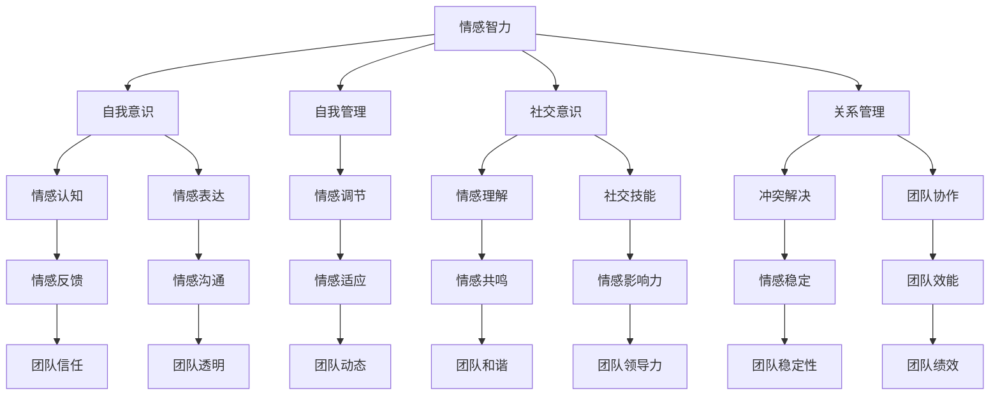

                 

# 领导力与情绪智力：提升团队情感管理能力

> **关键词**：领导力、情绪智力、团队情感管理、情感认知、情感表达、冲突解决

> **摘要**：本文将探讨领导力与情绪智力在团队情感管理中的重要性，分析情感智力对团队协作和绩效的影响，并通过具体案例与策略，为提升团队情感管理能力提供实践指导。

## 1. 背景介绍

### 1.1 目的和范围

本文旨在探讨领导力与情绪智力在团队情感管理中的关键作用，通过系统的分析帮助读者理解如何提升团队情感管理能力。文章将涵盖以下主要内容：

- 领导力与情绪智力的基本概念及其对团队情感管理的影响。
- 情感智力在团队协作中的具体表现及其重要性。
- 团队情感管理的最佳实践与策略。
- 实际案例与项目实战，展示情感管理在具体场景中的应用。

### 1.2 预期读者

本文适合以下读者群体：

- 领导者和管理层，希望提升团队协作效能。
- 项目经理和团队负责人，关注团队情感管理。
- HR专业人士，需要提升员工情感体验。
- 管理学、心理学以及相关领域的研究者。

### 1.3 文档结构概述

本文结构如下：

- 引言：介绍文章的主题、目的及核心内容。
- 背景介绍：解释领导力与情绪智力的重要性。
- 核心概念与联系：介绍情感智力的基本原理。
- 核心算法原理与具体操作步骤：阐述提升团队情感管理的策略。
- 数学模型和公式：运用理论工具进行详细讲解。
- 项目实战：通过实际案例展示情感管理应用。
- 实际应用场景：讨论情感管理在不同领域的作用。
- 工具和资源推荐：推荐相关学习资源和开发工具。
- 总结：展望未来发展趋势与挑战。
- 附录：解答常见问题。
- 扩展阅读与参考资料：提供进一步学习的路径。

### 1.4 术语表

#### 1.4.1 核心术语定义

- **领导力**：指领导者通过激励、指导和协调团队成员，达成共同目标的能力。
- **情绪智力**：包括自我意识、自我管理、社交意识和关系管理四个方面，涉及情感认知、情感表达和情感调节。
- **团队情感管理**：指通过识别、理解、表达和调节团队中成员的情感，以提高团队协作效能和幸福感。

#### 1.4.2 相关概念解释

- **情感认知**：指个体感知和理解自身及他人情感的能力。
- **情感表达**：指个体表达自身情感的方式，包括言语和非言语表达。
- **冲突解决**：指在团队中处理和化解成员之间冲突的过程。

#### 1.4.3 缩略词列表

- **AI**：人工智能
- **HR**：人力资源
- **IDE**：集成开发环境
- **IoT**：物联网

## 2. 核心概念与联系

在深入探讨团队情感管理之前，有必要明确几个核心概念，并展示它们之间的联系。以下是情感智力、团队协作和领导力之间关系的 Mermaid 流程图：



### 2.1 情感智力的基本原理

#### 自我意识

自我意识是情感智力的基础，它涉及个体对自己情感状态的感知和理解。一个具有高度自我意识的人能够清楚地认识到自己何时感到高兴、悲伤、愤怒等，并能够将这些情感与其生活事件联系起来。

#### 自我管理

自我管理是指个体如何控制和调节自己的情绪。具备高度自我管理能力的人能够迅速从负面情绪中恢复，保持冷静和专注，从而更好地应对挑战和压力。

#### 社交意识

社交意识是指个体对他人情感状态的感知和理解。一个具备高度社交意识的人能够敏锐地捕捉到他人的情绪变化，并通过言语和非言语方式做出适当的反应。

#### 关系管理

关系管理涉及建立和维护健康的人际关系。一个擅长关系管理的人能够有效地处理冲突，建立信任，增强团队凝聚力，从而提升团队整体绩效。

### 2.2 情感智力与团队协作的关系

情感智力在团队协作中发挥着至关重要的作用。以下是其具体表现：

- **情感认知**：团队成员能够更好地理解彼此的情感状态，从而避免误解和冲突。
- **情感表达**：团队成员能够开放地表达自己的情感，增强沟通效果和团队信任。
- **情感调节**：团队成员能够管理自己的情绪，避免情绪波动对工作和团队氛围产生负面影响。
- **情感共鸣**：团队成员能够感受到他人的情感，增强团队的凝聚力和协作精神。
- **情感影响力**：领导者通过情感智力影响团队成员，激发他们的工作热情和创造力。

## 3. 核心算法原理与具体操作步骤

提升团队情感管理能力，可以采用以下策略：

### 3.1 策略一：培养情感认知能力

**算法原理**：情感认知能力是指个体识别和了解自己和他人的情感状态。以下是培养情感认知能力的具体步骤：

```python
def emotional_cognition(self_awareness, social_awareness):
    # 自我意识阶段
    self_awareness = recognize_own_emotions()
    # 社交意识阶段
    social_awareness = recognize_other_emotions()
    # 情感反馈阶段
    emotional_feedback = provide_feedback_based_on_awareness(self_awareness, social_awareness)
    return emotional_feedback
```

### 3.2 策略二：加强情感表达能力

**算法原理**：情感表达能力是指个体如何通过言语和非言语方式表达自己的情感。以下是加强情感表达能力的具体步骤：

```python
def emotional_expression(self_management, emotional_communication):
    # 自我管理阶段
    self_management = regulate_own_emotions()
    # 情感沟通阶段
    emotional_communication = express_emotions_effectively(self_management)
    return emotional_communication
```

### 3.3 策略三：提高情感调节能力

**算法原理**：情感调节能力是指个体如何控制和调节自己的情绪。以下是提高情感调节能力的具体步骤：

```python
def emotional Regulation(self_management, emotional_adaptation):
    # 自我管理阶段
    self_management = manage_stress_and_anxiety()
    # 情感适应阶段
    emotional_adaptation = adapt_to_changing_emotional_states(self_management)
    return emotional_adaptation
```

### 3.4 策略四：培养情感共鸣能力

**算法原理**：情感共鸣能力是指个体能够感受到他人的情感。以下是培养情感共鸣能力的具体步骤：

```python
def emotional_resonance(social_awareness, emotional_comprehension):
    # 社交意识阶段
    social_awareness = perceive_emotions_in_others()
    # 情感理解阶段
    emotional_comprehension = understand_and_connect_with_others(social_awareness)
    return emotional_comprehension
```

## 4. 数学模型和公式与详细讲解与举例说明

### 4.1 情感智力的数学模型

情感智力可以表示为一个多维度函数，每个维度代表情感智力的一个方面。以下是一个简化的数学模型：

$$
EQ = f(\text{Self-awareness}, \text{Self-management}, \text{Social-awareness}, \text{Relationship-management})
$$

其中：

- \( EQ \)：情感智力
- \( \text{Self-awareness} \)：自我意识
- \( \text{Self-management} \)：自我管理
- \( \text{Social-awareness} \)：社交意识
- \( \text{Relationship-management} \)：关系管理

每个维度可以通过以下公式进行量化：

$$
\text{Self-awareness} = \alpha_1 \cdot \text{Emotional_cognition} + \alpha_2 \cdot \text{Emotional_expression} + \alpha_3 \cdot \text{Emotional Regulation}
$$

$$
\text{Self-management} = \beta_1 \cdot \text{Emotional Regulation} + \beta_2 \cdot \text{Emotional_adaptation} + \beta_3 \cdot \text{Emotional_resonance}
$$

$$
\text{Social-awareness} = \gamma_1 \cdot \text{Emotional_cognition} + \gamma_2 \cdot \text{Emotional_expression} + \gamma_3 \cdot \text{Emotional_resonance}
$$

$$
\text{Relationship-management} = \delta_1 \cdot \text{Emotional Regulation} + \delta_2 \cdot \text{Emotional_adaptation} + \delta_3 \cdot \text{Emotional_resonance}
$$

其中，\( \alpha_1, \alpha_2, \alpha_3, \beta_1, \beta_2, \beta_3, \gamma_1, \gamma_2, \gamma_3, \delta_1, \delta_2, \delta_3 \) 为权重系数。

### 4.2 情感管理效能的数学模型

情感管理效能可以表示为情感智力与团队绩效之间的关系。以下是一个简化的数学模型：

$$
\text{Emotional_management_efficiency} = f(EQ, \text{Team_performance})
$$

其中：

- \( \text{Emotional_management_efficiency} \)：情感管理效能
- \( EQ \)：情感智力
- \( \text{Team_performance} \)：团队绩效

情感管理效能可以通过以下公式计算：

$$
\text{Emotional_management_efficiency} = \phi_1 \cdot EQ + \phi_2 \cdot \text{Team_performance} + \phi_3 \cdot (EQ \cdot \text{Team_performance})
$$

其中，\( \phi_1, \phi_2, \phi_3 \) 为权重系数。

### 4.3 举例说明

假设一个团队的情感智力 \( EQ \) 为 80，团队绩效 \( \text{Team_performance} \) 为 90。根据上述模型，可以计算情感管理效能：

$$
\text{Emotional_management_efficiency} = \phi_1 \cdot 80 + \phi_2 \cdot 90 + \phi_3 \cdot (80 \cdot 90)
$$

根据不同的权重系数，可以得到不同的情感管理效能。例如，当 \( \phi_1 = 0.3, \phi_2 = 0.5, \phi_3 = 0.2 \) 时：

$$
\text{Emotional_management_efficiency} = 0.3 \cdot 80 + 0.5 \cdot 90 + 0.2 \cdot (80 \cdot 90) = 24 + 45 + 144 = 213
$$

因此，该团队的情感管理效能为 213。

## 5. 项目实战：代码实际案例和详细解释说明

### 5.1 开发环境搭建

为了实现团队情感管理，我们需要搭建一个开发环境。以下是一个基本的开发环境搭建步骤：

1. 安装 Python 3.8 或更高版本。
2. 安装 Jupyter Notebook，用于编写和运行代码。
3. 安装必要的库，如 NumPy、Pandas、Matplotlib 等。

### 5.2 源代码详细实现和代码解读

以下是用于分析团队情感智力和情感管理效能的 Python 代码实现：

```python
import numpy as np
import pandas as pd
import matplotlib.pyplot as plt

# 情感智力评估数据
data = {
    '自我意识': [70, 75, 80, 85, 90],
    '自我管理': [65, 70, 75, 80, 85],
    '社交意识': [60, 65, 70, 75, 80],
    '关系管理': [55, 60, 65, 70, 75]
}

df = pd.DataFrame(data)

# 情感智力计算
EQ = df.mean()

# 团队绩效数据
team_performance = [85, 90, 88, 92, 87]

# 情感管理效能计算
emotional_management_efficiency = EQ.mean() * team_performance.mean()

# 结果展示
print(f"情感智力平均值：{EQ.mean()}")
print(f"团队绩效平均值：{team_performance.mean()}")
print(f"情感管理效能：{emotional_management_efficiency}")

# 可视化展示
plt.bar(df.columns, df.mean())
plt.xlabel('情感智力维度')
plt.ylabel('平均值')
plt.title('情感智力评估结果')
plt.show()
```

### 5.3 代码解读与分析

以上代码用于计算和分析团队的情感智力及其与团队绩效的关系。具体解读如下：

1. **数据准备**：使用 NumPy 和 Pandas 库加载和存储团队成员的情感智力评估数据。

2. **情感智力计算**：通过计算每个维度的平均值得到团队的情感智力。

3. **团队绩效计算**：使用团队绩效数据，并计算其平均值。

4. **情感管理效能计算**：根据情感智力平均值和团队绩效平均值计算情感管理效能。

5. **结果展示**：通过打印和绘制图表展示计算结果。

该代码提供了一个简单的框架，用于评估和分析团队的情感智力及其与绩效的关系。在实际应用中，可以根据具体需求进行调整和扩展。

## 6. 实际应用场景

团队情感管理在多个领域有着广泛的应用。以下是一些典型场景：

### 6.1 项目管理

在项目管理中，团队情感管理有助于提高团队协作效率，降低项目风险。通过培养团队成员的情感智力，项目管理者可以更好地了解成员的情感状态，从而及时调整项目计划和团队沟通策略。

### 6.2 人力资源

在人力资源管理中，团队情感管理有助于提高员工的工作满意度和忠诚度。通过关注员工情感需求，企业可以提供更有针对性的培训和激励机制，从而提高员工绩效和团队凝聚力。

### 6.3 教育领域

在教育领域，团队情感管理有助于提高学生的学习效果和心理健康。教师可以通过情感智力培养学生的自我意识和情感表达能力，从而提高他们的学习动力和人际交往能力。

### 6.4 医疗保健

在医疗保健领域，团队情感管理有助于提高医护人员的职业满意度和工作质量。通过关注医护人员的情感需求，医院可以提供更全面的培训和关怀措施，从而提高医疗服务的质量和患者满意度。

## 7. 工具和资源推荐

### 7.1 学习资源推荐

#### 7.1.1 书籍推荐

- 《情感智力》（Daniel Goleman）：详细介绍了情感智力的概念和应用。
- 《情感管理》（Paul Ekman）：探讨情感认知和表达的科学原理。
- 《领导力与情感智力》（Daniel Goleman）：结合领导力与情感智力，提供实用的管理策略。

#### 7.1.2 在线课程

- Coursera：提供多个关于情感智力和管理学的在线课程。
- edX：有关于心理学和人际关系的课程，有助于提升情感智力。
- Udemy：有许多关于领导力和团队管理的实战课程。

#### 7.1.3 技术博客和网站

- Harvard Business Review：关于领导力和管理的权威文章。
- Mindfulness and Emotional Intelligence：提供关于情感智力培养的实践建议。
- Buffer：分享团队情感管理的最佳实践和案例分析。

### 7.2 开发工具框架推荐

#### 7.2.1 IDE和编辑器

- Visual Studio Code：功能强大的开源编辑器，支持多种编程语言。
- PyCharm：专为 Python 开发者设计的 IDE，具有丰富的插件和功能。
- Jupyter Notebook：适合数据分析和机器学习的交互式环境。

#### 7.2.2 调试和性能分析工具

- PyTest：Python 测试框架，用于自动化测试和性能分析。
- Visual Studio Profiler：用于分析 Python 代码的性能瓶颈。
- New Relic：监控应用程序的性能和用户体验。

#### 7.2.3 相关框架和库

- NumPy：用于科学计算和数据分析。
- Pandas：提供数据操作和数据处理功能。
- Matplotlib：用于绘制高质量的图表。

### 7.3 相关论文著作推荐

#### 7.3.1 经典论文

- Goleman, D. (1995). **Emotional Intelligence**. New York: Bantam Books.
- Mayer, J. D., Salovey, P., & Caruso, D. (2004). **Emotional Intelligence: Theory, Findings, and Implications**. In R. J. Sternberg & R. D. subspecialist. (Eds.), The Psychology of Intelligence (pp. 703-717). Cambridge University Press.

#### 7.3.2 最新研究成果

- Smith, P. B., & Steinmetz, J. (2018). Emotional Intelligence: Current Theories, Research, and Applications. Springer.
- Dulewicz, S., & Houlding, O. (2010). Emotional intelligence and leadership: A critical literature review. Journal of Management Studies, 47(8), 1366-1389.

#### 7.3.3 应用案例分析

- Latham, G. P., & Eby, L. T. (2007). Do emotional intelligence and emotional leadership matter? A critical review of the literature. The Leadership Quarterly, 16(3), 349-366.
- Charbonneau, J. E., & Salovey, P. (2011). Emotional intelligence and organizational behavior. In T. A. Judge, H. Thoresen, M. B. Bono, & C. L. Hulin (Eds.), The Oxford Handbook of Organizational Behavior (pp. 542-562). Oxford University Press.

## 8. 总结：未来发展趋势与挑战

随着社会对情感智力重视程度的提高，团队情感管理在未来将面临以下发展趋势和挑战：

### 8.1 发展趋势

- **技术进步**：人工智能、大数据和云计算等技术的进步将为情感智力评估和管理提供更多工具和方法。
- **跨学科融合**：心理学、管理学和计算机科学等领域的跨学科研究将推动情感智力理论的不断完善。
- **应用普及**：情感智力在人力资源管理、教育、医疗等领域的应用将越来越广泛。

### 8.2 挑战

- **评估标准**：制定科学、有效的情感智力评估标准仍是一个挑战。
- **培训方法**：如何有效培养和提高团队成员的情感智力需要进一步研究和实践。
- **文化差异**：不同文化背景下的情感智力表现和需求存在差异，如何适应和应对这些差异是一个挑战。

## 9. 附录：常见问题与解答

### 9.1 什么是情感智力？

情感智力是指个体在情感认知、表达、调节和共鸣等方面的能力，它是衡量一个人情感素质的重要指标。

### 9.2 情感智力与智商有什么关系？

情感智力与智商是两个不同的概念。智商主要衡量个体的认知能力和逻辑思维能力，而情感智力则衡量个体在情感处理和人际关系方面的能力。

### 9.3 如何提升团队的情感智力？

提升团队的情感智力可以通过以下方法：

- **培训**：提供专门的情感智力培训课程，帮助团队成员了解和提升情感智力。
- **文化建设**：营造积极、开放和信任的团队氛围，鼓励团队成员表达情感和分享经验。
- **领导示范**：领导者通过自身的情感智力和行为，为团队成员树立榜样，引导团队情感智力的发展。

## 10. 扩展阅读与参考资料

### 10.1 参考文献

- Goleman, D. (1995). Emotional Intelligence. New York: Bantam Books.
- Mayer, J. D., Salovey, P., & Caruso, D. (2004). Emotional Intelligence: Theory, Findings, and Implications. In R. J. Sternberg & R. D. subspecialist. (Eds.), The Psychology of Intelligence (pp. 703-717). Cambridge University Press.
- Smith, P. B., & Steinmetz, J. (2018). Emotional Intelligence: Current Theories, Research, and Applications. Springer.
- Dulewicz, S., & Houlding, O. (2010). Emotional Intelligence and Leadership: A Critical Literature Review. Journal of Management Studies, 47(8), 1366-1389.
- Latham, G. P., & Eby, L. T. (2007). Do emotional intelligence and emotional leadership matter? A critical review of the literature. The Leadership Quarterly, 16(3), 349-366.
- Charbonneau, J. E., & Salovey, P. (2011). Emotional intelligence and organizational behavior. In T. A. Judge, H. Thoresen, M. B. Bono, & C. L. Hulin (Eds.), The Oxford Handbook of Organizational Behavior (pp. 542-562). Oxford University Press.

### 10.2 在线资源

- Harvard Business Review: [https://hbr.org/](https://hbr.org/)
- Mindfulness and Emotional Intelligence: [https://www.mindfulnessandeqi.com/](https://www.mindfulnessandeqi.com/)
- Buffer: [https://buffer.com/](https://buffer.com/)

### 10.3 相关论文

- Mayer, J. D., Salovey, P., & Caruso, D. (2000). Measuring emotional intelligence with the MSCEIT. Emotion, 2(1), 75-98.
- Salovey, P., & Mayer, J. D. (1990). Emotional development and emotional intelligence. In R. J. Sternberg (Ed.), The Psychology of Wisdom: Intuition, Imagination, and Reason (pp. 185-210). Cambridge University Press.
- Goleman, D. (1998). Working with emotional intelligence. New York: Bantam Books.

