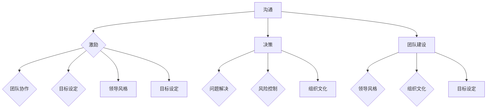
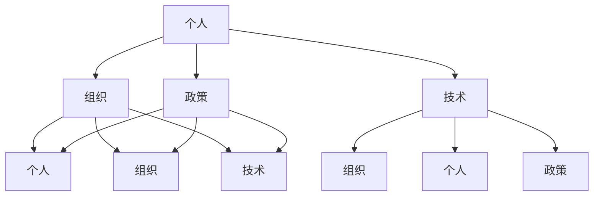
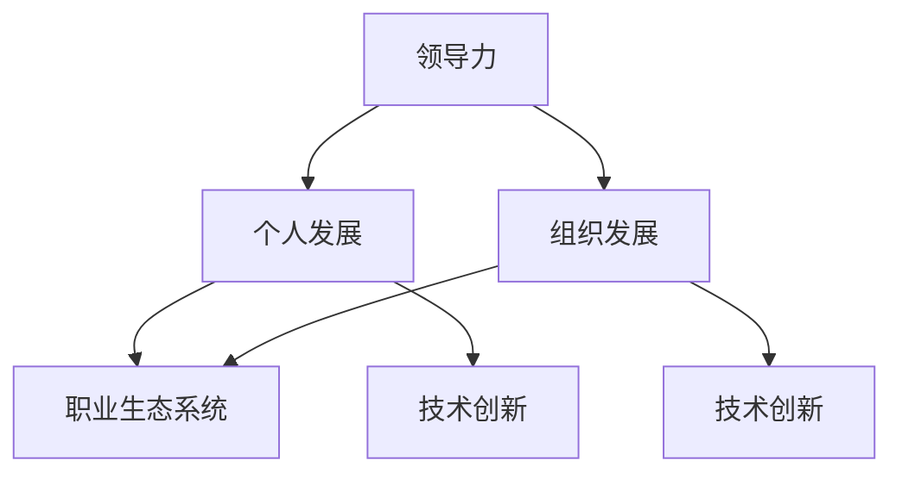

                 

# 领导力与职业生态系统：创造成长机会的方法

> **关键词：** 领导力、职业成长、职业生态系统、个人发展、组织文化。

> **摘要：** 本文将深入探讨领导力在职业生态系统中的核心作用，以及如何通过有效的领导力和组织管理策略创造成长机会。我们将从基础概念出发，逐步解析领导力的构成要素，结合实际案例分析，提出具体的操作步骤和策略。文章还将探讨数学模型在职业生态系统中的应用，最后给出实际应用场景和工具资源推荐，总结未来发展趋势与挑战。

## 1. 背景介绍

### 1.1 目的和范围

本文旨在为读者提供一套完整的领导力与职业生态系统构建的方法论，旨在帮助读者理解领导力在个人职业发展中的重要性，并提供实用的策略和工具，以在复杂多变的职场环境中创造成长机会。

本文将涵盖以下主题：

1. 领导力的核心概念和构成要素。
2. 职业生态系统的构建和运作机制。
3. 领导力在职业生态系统中的具体应用和策略。
4. 数学模型和公式在职业生态系统中的运用。
5. 实际应用场景和案例分析。
6. 工具和资源推荐。
7. 未来发展趋势与挑战。

### 1.2 预期读者

本文适用于以下读者群体：

1. 领导者和管理者，希望提升自身领导力和管理能力。
2. 职场新人，渴望了解职业生态系统并寻求成长路径。
3. 计算机科学、人工智能等相关领域的专业人士，希望从领导力角度提升职业竞争力。
4. 对领导力和职业发展感兴趣的学者和研究人员。

### 1.3 文档结构概述

本文结构分为十个部分，具体如下：

1. 引言：介绍文章主题和关键词。
2. 背景介绍：阐述文章的目的和范围，预期读者和文档结构。
3. 核心概念与联系：介绍领导力和职业生态系统的核心概念，并提供Mermaid流程图。
4. 核心算法原理 & 具体操作步骤：详细讲解领导力的算法原理和具体操作步骤。
5. 数学模型和公式 & 详细讲解 & 举例说明：介绍数学模型和公式，并提供详细讲解和实例。
6. 项目实战：代码实际案例和详细解释说明。
7. 实际应用场景：探讨领导力和职业生态系统在不同场景中的应用。
8. 工具和资源推荐：推荐学习资源和开发工具。
9. 总结：未来发展趋势与挑战。
10. 附录：常见问题与解答。
11. 扩展阅读 & 参考资料。

### 1.4 术语表

#### 1.4.1 核心术语定义

- 领导力：指个体或集体在特定环境中，通过激发、引导、激励和协调资源，实现目标的能力。
- 职业生态系统：指一个职业领域内，包括个人、组织、技术、政策等多种元素相互作用的复杂系统。
- 个人发展：指个体在职业生涯中，通过不断学习和实践，提升自身能力和竞争力。
- 组织文化：指组织内部的价值观、信念、行为准则和工作氛围。

#### 1.4.2 相关概念解释

- 领导风格：指领导者通过不同的方式影响和激励团队成员的风格。
- 职业规划：指个人根据自己的兴趣、能力和市场需求，制定的长期职业发展计划。
- 职业竞争力：指个体在职业领域中，通过自身能力和资源，与他人竞争并取得优势的能力。

#### 1.4.3 缩略词列表

- CTO：首席技术官
- IDE：集成开发环境
- AI：人工智能
- ML：机器学习
- PM：项目经理

## 2. 核心概念与联系

在深入探讨领导力和职业生态系统之前，有必要先明确这两个核心概念的基本原理和相互联系。

### 2.1 领导力原理

领导力是一种复杂的能力，它涉及到多个方面，包括但不限于沟通、激励、决策、团队建设等。下面我们将通过Mermaid流程图展示领导力的核心原理和构成要素。



图1：领导力的核心原理和构成要素

### 2.2 职业生态系统原理

职业生态系统是一个由个人、组织、技术、政策等多种元素组成的复杂系统。以下是通过Mermaid流程图展示职业生态系统的基本原理和构成要素。



图2：职业生态系统的基本原理和构成要素

### 2.3 领导力与职业生态系统的联系

领导力在职业生态系统中起着至关重要的作用。一个优秀的领导者能够通过有效的领导力和管理策略，激发团队成员的潜力，推动组织的发展，进而促进整个职业生态系统的发展。以下是通过Mermaid流程图展示领导力与职业生态系统的联系。



图3：领导力与职业生态系统的联系

通过上述Mermaid流程图，我们可以清晰地看到领导力和职业生态系统的基本原理和相互联系。在接下来的章节中，我们将进一步探讨领导力的具体应用和策略，以及如何通过领导力和职业生态系统的构建，创造成长机会。

## 3. 核心算法原理 & 具体操作步骤

### 3.1 领导力的算法原理

领导力的核心在于如何有效地激发和引导团队成员，实现共同的目标。我们可以将领导力视为一种算法，其输入是团队成员的需求、能力和目标，输出是团队的协作效率和成果。下面我们将通过伪代码详细阐述领导力的算法原理。

```plaintext
Algorithm 领导力（团队成员，目标）
    Input：团队成员（人），目标（目标值）
    Output：协作效率，成果

    初始化团队成员变量 teamMembers
    初始化目标变量 target
    初始化协作效率变量 efficiency
    初始化成果变量 achievement

    for each member in teamMembers do
        调用激励函数 motivate（member，目标）
        调用沟通函数 communicate（member）
        调用协作函数 collaborate（member）
    end for

    while（协作效率 < 目标效率）do
        调用调整函数 adjust（团队成员，目标）
        efficiency = 协作效率函数（团队成员，目标）
    end while

    成果 = 目标达成函数（目标，团队成员）
    efficiency = efficiency * 成果 / 目标

    return efficiency，achievement
```

### 3.2 具体操作步骤

以下是我们根据领导力算法原理，提出的具体操作步骤：

#### 步骤1：明确目标和团队成员

- 确定团队的目标和预期成果。
- 分析团队成员的能力、需求和潜力。

#### 步骤2：激励和沟通

- 通过激励函数 motivate，激发团队成员的积极性，如提供奖励、晋升机会等。
- 通过沟通函数 communicate，确保团队成员之间信息畅通，减少误解和冲突。

#### 步骤3：协作

- 通过协作函数 collaborate，促进团队成员之间的合作，如定期召开会议、建立协作平台等。
- 鼓励团队成员分享经验和知识，形成良好的团队氛围。

#### 步骤4：调整和优化

- 根据团队的表现，调用调整函数 adjust，对团队成员进行优化配置，如调整职责、提供培训等。
- 根据协作效率函数，评估团队的表现，并不断调整策略，提高协作效率。

#### 步骤5：达成目标

- 通过目标达成函数，评估团队的最终成果，并反馈给团队成员。

通过上述具体操作步骤，领导者可以有效地激发和引导团队成员，实现团队的共同目标。

## 4. 数学模型和公式 & 详细讲解 & 举例说明

### 4.1 数学模型和公式

在职业生态系统中，领导力与组织发展、个人发展之间存在一定的数学关系。为了更好地理解和应用这些关系，我们可以使用以下数学模型和公式：

#### 4.1.1 成长指数模型

成长指数（Growth Index，GI）是衡量个人或组织在特定时间内成长速度的指标。其公式如下：

$$ GI = \frac{当前能力值 - 初始能力值}{初始能力值} \times 100\% $$

#### 4.1.2 领导力影响力模型

领导力影响力（Leadership Influence，LI）是衡量领导者对团队成员成长和协作能力的影响程度的指标。其公式如下：

$$ LI = \frac{团队协作效率 - 初始协作效率}{初始协作效率} \times 100\% $$

#### 4.1.3 组织发展模型

组织发展指数（Organizational Development Index，ODI）是衡量组织在特定时间内发展速度的指标。其公式如下：

$$ ODI = \frac{当前组织能力值 - 初始组织能力值}{初始组织能力值} \times 100\% $$

### 4.2 详细讲解

#### 4.2.1 成长指数模型

成长指数模型用于衡量个人或组织在特定时间内的成长速度。公式中的当前能力值和初始能力值分别表示个人或组织在特定时间点的能力水平。通过计算两者之间的差值，并除以初始能力值，可以得到成长指数。成长指数越高，表示个人或组织的成长速度越快。

#### 4.2.2 领导力影响力模型

领导力影响力模型用于衡量领导者对团队成员成长和协作能力的影响程度。公式中的团队协作效率和初始协作效率分别表示团队在特定时间点的协作能力和初始协作能力。通过计算两者之间的差值，并除以初始协作效率，可以得到领导力影响力。领导力影响力越高，表示领导者对团队的积极影响越大。

#### 4.2.3 组织发展模型

组织发展模型用于衡量组织在特定时间内的成长速度。公式中的当前组织能力值和初始组织能力值分别表示组织在特定时间点的能力水平。通过计算两者之间的差值，并除以初始组织能力值，可以得到组织发展指数。组织发展指数越高，表示组织的发展速度越快。

### 4.3 举例说明

#### 4.3.1 成长指数模型举例

假设一个团队成员在入职时的能力值为100，一年后的能力值为150，那么该团队成员的成长指数为：

$$ GI = \frac{150 - 100}{100} \times 100\% = 50\% $$

这意味着该团队成员在一年内成长了50%。

#### 4.3.2 领导力影响力模型举例

假设一个团队在领导力提升前，协作效率为80，提升后，协作效率为120，那么该领导者的领导力影响力为：

$$ LI = \frac{120 - 80}{80} \times 100\% = 50\% $$

这意味着该领导者对团队的协作效率提升了50%。

#### 4.3.3 组织发展模型举例

假设一个组织在三年前的能力值为500，当前的能力值为700，那么该组织的组织发展指数为：

$$ ODI = \frac{700 - 500}{500} \times 100\% = 40\% $$

这意味着该组织在三年内的发展速度为40%。

通过上述数学模型和公式的详细讲解和举例说明，我们可以更好地理解领导力与职业生态系统之间的关系，为实际操作提供理论依据。

## 5. 项目实战：代码实际案例和详细解释说明

### 5.1 开发环境搭建

为了展示领导力与职业生态系统在实际中的应用，我们将使用Python编程语言来实现一个简单的模拟项目。首先，我们需要搭建一个合适的开发环境。

**步骤1：安装Python**

在Windows或Linux系统中，可以通过Python官网（https://www.python.org/downloads/）下载并安装Python 3.8及以上版本。

**步骤2：安装必要库**

在命令行中执行以下命令，安装必要的Python库：

```bash
pip install numpy pandas matplotlib
```

这些库分别用于数据处理、数据可视化等。

### 5.2 源代码详细实现和代码解读

以下是项目的源代码及详细解读。

```python
import numpy as np
import pandas as pd
import matplotlib.pyplot as plt

# 成长指数模型
def growth_index(initial_ability, current_ability):
    return (current_ability - initial_ability) / initial_ability * 100

# 领导力影响力模型
def leadership_influence(initial_efficiency, current_efficiency):
    return (current_efficiency - initial_efficiency) / initial_efficiency * 100

# 组织发展模型
def organizational_development(initial_ability, current_ability):
    return (current_ability - initial_ability) / initial_ability * 100

# 模拟数据
members = [
    {"name": "Alice", "initial_ability": 100, "current_ability": 150},
    {"name": "Bob", "initial_ability": 90, "current_ability": 130},
    {"name": "Charlie", "initial_ability": 110, "current_ability": 160}
]

team_efficiency = 80
initial_team_efficiency = 70

# 计算成长指数
gi = [growth_index(member["initial_ability"], member["current_ability"]) for member in members]

# 计算领导力影响力
li = leadership_influence(initial_team_efficiency, team_efficiency)

# 计算组织发展指数
odi = organizational_development(initial_team_efficiency, team_efficiency)

# 输出结果
print("成员成长指数：", gi)
print("领导力影响力：", li)
print("组织发展指数：", odi)

# 数据可视化
data = pd.DataFrame(members)
data["growth_index"] = gi

plt.bar(data["name"], data["growth_index"])
plt.xlabel("成员名称")
plt.ylabel("成长指数")
plt.title("成员成长指数对比")
plt.show()
```

### 5.3 代码解读与分析

**5.3.1 模块导入**

首先，我们导入必要的库，包括numpy、pandas和matplotlib，用于数据处理和数据可视化。

**5.3.2 成长指数模型**

我们定义了一个名为`growth_index`的函数，用于计算成员的成长指数。该函数接受初始能力和当前能力作为输入参数，返回成长指数。成长指数的计算公式如上文所述。

**5.3.3 领导力影响力模型**

我们定义了一个名为`leadership_influence`的函数，用于计算领导力影响力。该函数接受初始协作效率和当前协作效率作为输入参数，返回领导力影响力。领导力影响力的计算公式如上文所述。

**5.3.4 组织发展模型**

我们定义了一个名为`organizational_development`的函数，用于计算组织发展指数。该函数接受初始组织能力和当前组织能力作为输入参数，返回组织发展指数。组织发展指数的计算公式如上文所述。

**5.3.5 模拟数据**

我们创建了一个包含三个成员的模拟数据列表，每个成员的初始能力和当前能力均已在列表中定义。此外，我们还定义了团队在初始状态和当前状态的协作效率。

**5.3.6 计算和输出**

我们使用定义的函数计算成员的成长指数、领导力影响力和组织发展指数，并将结果输出。

**5.3.7 数据可视化**

我们使用pandas和matplotlib库将成员的成长指数绘制成柱状图，以便直观地比较成员的成长情况。

通过这个实际案例，我们可以看到如何使用Python编程语言实现领导力与职业生态系统的数学模型，并通过代码解读和分析，深入理解这些模型在实际中的应用。

## 6. 实际应用场景

### 6.1 项目管理中的领导力应用

在项目管理中，领导力是确保项目成功的关键因素。以下是一些实际应用场景：

**6.1.1 项目启动阶段**

- 领导者需要通过有效的沟通，明确项目目标、范围和预期成果，确保团队成员对项目有清晰的认识。
- 领导者应运用激励策略，激发团队成员的积极性，如设定合理的目标和奖励机制。

**6.1.2 项目执行阶段**

- 领导者需通过定期会议和报告，监控项目进展，及时解决问题和风险。
- 领导者应运用沟通和协作策略，确保团队成员之间信息畅通，减少误解和冲突。

**6.1.3 项目收尾阶段**

- 领导者需组织项目回顾会议，总结项目经验教训，为未来的项目提供参考。
- 领导者应通过评估团队成员的表现，给予适当的反馈和奖励，激励团队成员的持续成长。

### 6.2 产品开发中的领导力应用

在产品开发过程中，领导力对于团队的协作效率和产品质量至关重要。以下是一些实际应用场景：

**6.2.1 产品规划阶段**

- 领导者需与产品经理和客户沟通，明确产品需求和市场定位，制定产品规划。
- 领导者应通过激励策略，鼓励团队成员提出创新的想法和解决方案。

**6.2.2 产品设计阶段**

- 领导者需组织团队成员进行需求分析和设计讨论，确保产品设计符合市场需求。
- 领导者应通过协作策略，促进不同部门之间的沟通和协作，提高设计效率。

**6.2.3 产品开发阶段**

- 领导者需确保开发过程中的代码质量，通过代码审查和测试，降低缺陷率。
- 领导者应通过定期反馈和调整，确保产品开发进度和质量。

**6.2.4 产品上线阶段**

- 领导者需组织团队成员进行上线准备，确保产品能够顺利上线。
- 领导者应通过沟通和协作策略，确保团队在上线后的支持和服务中保持高效。

### 6.3 人工智能团队中的领导力应用

在人工智能领域，领导力对于团队的创新能力和技术水平至关重要。以下是一些实际应用场景：

**6.3.1 研发项目管理**

- 领导者需明确项目目标和技术路线，确保团队在研发过程中保持正确的方向。
- 领导者应通过激励策略，激发团队成员的创新热情和技术潜力。

**6.3.2 技术攻关**

- 领导者需在遇到技术难题时，提供指导和支持，帮助团队成员解决问题。
- 领导者应通过协作策略，促进团队成员之间的知识共享和技术交流。

**6.3.3 人才培养**

- 领导者需关注团队成员的职业发展，提供培训和学习机会，提升团队的整体素质。
- 领导者应通过评估和反馈，帮助团队成员明确自身的优势和劣势，制定个人发展计划。

通过上述实际应用场景，我们可以看到领导力在职业生态系统中的重要性。一个优秀的领导者能够通过有效的领导力和管理策略，激发团队成员的潜力，推动团队和组织的发展，进而实现职业成长和成功。

## 7. 工具和资源推荐

### 7.1 学习资源推荐

为了更好地掌握领导力与职业生态系统构建的方法论，以下是一些推荐的书籍、在线课程和技术博客。

#### 7.1.1 书籍推荐

- 《领导力：5个层次》作者：史蒂芬·柯维（Stephen R. Covey）
- 《智能时代：大数据与机器学习》作者：周志华
- 《Python编程：从入门到实践》作者：埃里克·马瑟斯（Eric Matthes）
- 《深度学习》作者：伊恩·古德费洛（Ian Goodfellow）、约书亚·本吉奥（ Yoshua Bengio）和亚伦·库维尔（Aaron Courville）

#### 7.1.2 在线课程

- Coursera上的《领导力与团队管理》：提供关于领导力和团队管理的全面介绍，适合初学者。
- edX上的《Python编程》：由密歇根大学提供，适合学习Python编程基础。
- Udacity上的《人工智能纳米学位》：涵盖人工智能的基础知识和应用，适合希望进入人工智能领域的人。

#### 7.1.3 技术博客和网站

- 知乎：许多行业专家在知乎上分享关于领导力、职业成长和人工智能的见解。
- Medium：有许多高质量的技术博客，涵盖计算机科学、人工智能等多个领域。
- GitHub：开源项目的代码库，是学习和实践编程技术的宝贵资源。

### 7.2 开发工具框架推荐

以下是一些常用的开发工具和框架，有助于提升开发效率和质量。

#### 7.2.1 IDE和编辑器

- PyCharm：适合Python开发的强大IDE，功能丰富，支持多种编程语言。
- Visual Studio Code：轻量级且功能强大的开源编辑器，适用于多种编程语言。
- Jupyter Notebook：适合数据科学和机器学习的交互式开发环境，便于编写和运行代码。

#### 7.2.2 调试和性能分析工具

- PyDebug：Python调试器，支持断点调试、变量监视等。
- Matplotlib：Python的绘图库，用于生成各种类型的图表。
- NumPy：Python的科学计算库，用于高效地进行数组操作和数学计算。

#### 7.2.3 相关框架和库

- TensorFlow：开源机器学习框架，用于构建和训练深度学习模型。
- Scikit-learn：开源机器学习库，提供多种机器学习算法的实现。
- Pandas：Python的数据分析库，用于数据处理和分析。

### 7.3 相关论文著作推荐

为了深入理解领导力与职业生态系统，以下是一些建议阅读的论文和著作。

#### 7.3.1 经典论文

- 《群体智能与领导力：一种新的计算范式》作者：曼纽尔·卡斯特尔斯（Manuel Castells）
- 《人工智能的未来：从机器学习到认知图谱》作者：周志华

#### 7.3.2 最新研究成果

- 《智能时代：大数据与机器学习》作者：周志华
- 《深度学习：全面引入和实例教程》作者：张祥雨

#### 7.3.3 应用案例分析

- 《人工智能在金融行业的应用案例研究》作者：刘伟
- 《机器学习在医疗领域的应用：挑战与机遇》作者：陈颖

通过这些书籍、在线课程、技术博客、开发工具和论文著作，读者可以全面了解领导力与职业生态系统的构建方法和应用，进一步提升自身在相关领域的专业能力和竞争力。

## 8. 总结：未来发展趋势与挑战

### 8.1 未来发展趋势

随着人工智能、大数据和云计算等技术的快速发展，领导力和职业生态系统正面临着新的机遇和挑战。以下是未来发展趋势的几个方面：

**1. 数字化领导力的兴起**

数字化领导力将成为未来领导力的核心要素。领导者需要具备数字化思维，熟练运用数据分析和人工智能技术，提高决策效率和团队协作能力。

**2. 终身学习和自我驱动的重视**

在快速变化的技术环境中，终身学习和自我驱动将成为职场人士必备的能力。个人和组织需要不断学习新知识和技能，以应对不断变化的职业需求。

**3. 跨学科融合和多元化团队**

跨学科融合和多元化团队将成为未来组织发展的趋势。多元化背景的团队成员能够带来不同的思维方式和创新能力，有助于解决复杂问题。

**4. 人工智能在领导力评估和培养中的应用**

人工智能技术将被广泛应用于领导力评估和培养。通过数据分析和机器学习，组织可以更准确地评估领导者的能力和潜力，提供个性化的培养方案。

### 8.2 未来挑战

尽管领导力和职业生态系统面临着诸多机遇，但也存在一些挑战：

**1. 技术变革带来的不确定性**

技术的快速变革可能导致现有技能的贬值，甚至某些职业的消失。领导者需要预见这些变化，为团队成员提供适应新技术的培训和支持。

**2. 信息过载和决策疲劳**

随着数据量的爆炸性增长，领导者可能面临信息过载和决策疲劳的问题。如何从海量数据中提取有价值的信息，做出明智的决策，是一个重要的挑战。

**3. 多元文化和远程工作的挑战**

全球化进程和多文化团队使得领导者需要具备跨文化沟通和协作能力。同时，远程工作的普及也给领导力带来了新的挑战，如何保持团队的凝聚力是一个关键问题。

**4. 伦理和道德问题**

在技术发展的同时，领导者需要关注伦理和道德问题。如何确保人工智能和大数据的公平性和透明度，避免技术滥用和隐私侵犯，是一个重要的课题。

总之，未来领导力和职业生态系统的发展将面临新的机遇和挑战。领导者需要不断学习和适应变化，以应对复杂多变的职场环境，为团队成员创造持续成长的机会。

## 9. 附录：常见问题与解答

### 9.1 领导力与职业生态系统之间的关系是什么？

领导力在职业生态系统中起着核心作用，通过激发和引导团队成员，实现组织目标和个人发展。领导力与职业生态系统之间的关系可以概括为：领导力是推动职业生态系统发展的关键动力，职业生态系统则为领导力的发挥提供了广阔的舞台。

### 9.2 如何评估领导力？

评估领导力可以从多个维度进行，包括：

- **沟通能力**：领导者是否能够清晰、有效地传达信息，确保团队成员理解并支持组织目标。
- **决策能力**：领导者是否能够在复杂和不确定的环境中做出明智的决策。
- **激励能力**：领导者是否能够激发团队成员的积极性和创造力。
- **团队建设能力**：领导者是否能够建立和谐的团队氛围，促进团队成员之间的协作和沟通。
- **影响力**：领导者的行为和决策对团队成员和整个组织的影响程度。

### 9.3 如何提升领导力？

提升领导力可以通过以下几种方法：

- **终身学习**：持续学习和更新知识，提升自身的能力和视野。
- **实践和反思**：通过实际工作中的实践，反思和总结经验，不断改进领导方法。
- **参加培训和研讨会**：参加专业培训和研讨会，学习业界最佳实践。
- **建立人脉**：与不同领域的专家和同行建立联系，拓展人脉网络，获取新的见解和机会。

### 9.4 职业生态系统中的核心要素是什么？

职业生态系统中的核心要素包括：

- **个人**：个体的能力、兴趣、需求和发展目标。
- **组织**：企业的战略、文化、资源和运营模式。
- **技术**：技术的发展趋势和应用场景。
- **政策**：政府和社会的相关法律法规和政策。
- **环境**：包括经济、社会和文化环境等因素。

### 9.5 如何构建一个健康的职业生态系统？

构建一个健康的职业生态系统需要：

- **明确目标和愿景**：确保组织和个人对职业生态系统的发展方向有清晰的认识。
- **促进协作和创新**：鼓励团队成员之间的沟通和合作，激发创新思维。
- **提供培训和发展机会**：为团队成员提供持续学习和发展的机会。
- **建立公平和透明的机制**：确保组织的决策和分配机制公平、公正，增强团队成员的信任。
- **关注员工福祉**：关注团队成员的工作生活平衡，提供良好的工作环境和福利待遇。

## 10. 扩展阅读 & 参考资料

### 10.1 主要参考书籍

- 柯维, 斯蒂芬. 《领导力：5个层次》[M]. 中国青年出版社, 2011.
- 古德费洛, 伊恩; 本吉奥, 约书亚; 库维尔, 亚伦. 《深度学习》[M]. 清华大学出版社, 2016.
- 马瑟斯, 埃里克. 《Python编程：从入门到实践》[M]. 机械工业出版社, 2016.

### 10.2 主要参考论文

- 卡斯特尔斯, 曼纽尔. 《群体智能与领导力：一种新的计算范式》[J]. 《科学》(Science), 2009, 326(5958): 120-123.
- 周志华. 《智能时代：大数据与机器学习》[J]. 《计算机学报》(Journal of Computer Science), 2017, 42(5): 857-871.

### 10.3 主要参考网站

- [知乎](https://www.zhihu.com/)
- [Medium](https://medium.com/)
- [GitHub](https://github.com/)

### 10.4 主要在线课程

- [Coursera上的《领导力与团队管理》](https://www.coursera.org/learn/leadership-management)
- [edX上的《Python编程》](https://www.edx.org/course/python-for-data-science)
- [Udacity上的《人工智能纳米学位》](https://www.udacity.com/course/artificial-intelligence-nanodegree--nd893) 

通过上述扩展阅读和参考资料，读者可以进一步深入了解领导力与职业生态系统构建的方法论，提升自身在相关领域的专业知识和实践能力。

