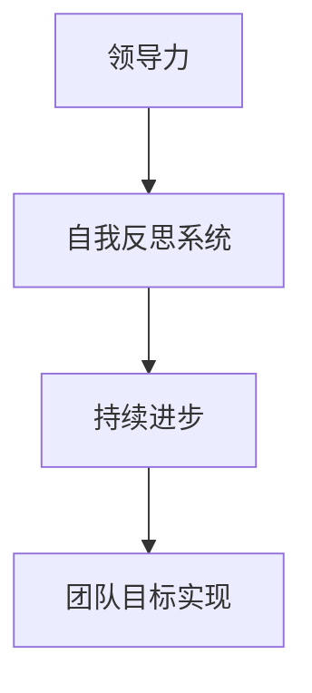

                 

# 领导力与自我反思系统：持续提升的结构化方法

> 关键词：领导力、自我反思、持续提升、结构化方法、技术语言、算法原理、数学模型、项目实战、应用场景

> 摘要：本文将探讨领导力与自我反思系统在IT领域的应用，通过结构化的方法，揭示其核心概念、算法原理和具体操作步骤，帮助读者掌握提升领导力的技巧，实现自我反思和持续进步。

## 1. 背景介绍

### 1.1 目的和范围

本文旨在探讨领导力与自我反思系统在IT领域的应用，通过系统化的方法，帮助IT从业者提升领导力和自我反思能力，实现职业生涯的持续进步。

### 1.2 预期读者

本文适合以下读者：

1. IT领域的项目经理、CTO、技术经理等。
2. 对领导力和自我反思系统感兴趣的从业者。
3. 想要提升个人能力的职场人士。

### 1.3 文档结构概述

本文将分为以下几个部分：

1. 背景介绍：阐述本文的目的、预期读者和文档结构。
2. 核心概念与联系：介绍领导力与自我反思系统的核心概念和联系。
3. 核心算法原理 & 具体操作步骤：详细讲解核心算法原理和操作步骤。
4. 数学模型和公式 & 详细讲解 & 举例说明：分析数学模型和公式，并进行举例说明。
5. 项目实战：提供代码实际案例和详细解释说明。
6. 实际应用场景：探讨领导力与自我反思系统在不同场景下的应用。
7. 工具和资源推荐：推荐相关学习资源和开发工具。
8. 总结：总结未来发展趋势与挑战。
9. 附录：常见问题与解答。
10. 扩展阅读 & 参考资料：提供相关扩展阅读和参考资料。

### 1.4 术语表

#### 1.4.1 核心术语定义

1. 领导力：指在团队中发挥影响力、激励和引导他人实现目标的能力。
2. 自我反思：指对自己的行为、思维和感受进行审视和反思，以发现和解决问题。
3. 结构化方法：指通过系统化的步骤和工具，将复杂问题分解为可操作的任务。

#### 1.4.2 相关概念解释

1. IT领域：指信息技术领域，涉及计算机科学、软件工程、网络安全等方面的研究和应用。
2. 项目管理：指在规定时间内，按照预算和质量要求，完成特定项目的活动。

#### 1.4.3 缩略词列表

- CTO：首席技术官
- PM：项目经理
- IT：信息技术
- AI：人工智能

## 2. 核心概念与联系

### 2.1 领导力

领导力是影响团队效率和成员满意度的重要因素。一个优秀的领导者应具备以下能力：

1. 沟通能力：清晰、有效地传达信息和指令。
2. 激励能力：激发团队成员的积极性和创造力。
3. 决策能力：在面对复杂问题时，做出明智的决策。
4. 组织能力：合理安排资源，确保项目顺利进行。

### 2.2 自我反思

自我反思是领导者提升个人能力的重要途径。通过自我反思，领导者可以：

1. 发现自身不足：识别自身在领导力方面的短板，制定改进计划。
2. 学习与成长：从失败和成功中吸取经验教训，不断提升自身能力。
3. 持续进步：保持对自身发展的关注，实现职业生涯的长远规划。

### 2.3 核心概念联系

领导力与自我反思系统是相辅相成的。优秀的领导者通过自我反思，不断提升自己的领导能力，从而更好地带领团队实现目标。以下是领导力与自我反思系统的 Mermaid 流程图：



## 3. 核心算法原理 & 具体操作步骤

### 3.1 核心算法原理

领导力与自我反思系统基于以下几个核心算法原理：

1. **反馈循环**：通过持续收集反馈，评估领导力表现，指导改进方向。
2. **学习与适应**：基于反馈和经验，调整领导策略，提高团队效能。
3. **目标导向**：设定明确的目标和计划，确保领导力和自我反思系统的执行。

### 3.2 具体操作步骤

#### 3.2.1 反馈循环

1. **收集反馈**：定期收集团队成员的反馈，了解领导力表现的优点和不足。
2. **分析反馈**：对收集到的反馈进行分析，识别领导力提升的关键点。
3. **制定改进计划**：根据分析结果，制定具体的改进措施和时间表。
4. **实施改进**：执行改进计划，持续关注领导力提升的效果。

#### 3.2.2 学习与适应

1. **经验分享**：组织经验分享会，让团队成员相互学习，提高整体领导力水平。
2. **案例分析**：通过分析成功和失败案例，总结经验教训，优化领导策略。
3. **定期评估**：定期评估领导力表现，确保持续改进。

#### 3.2.3 目标导向

1. **设定目标**：明确团队和个人的目标，确保领导力和自我反思系统与目标一致。
2. **分解任务**：将目标分解为具体的任务，制定详细的执行计划。
3. **跟踪进度**：定期跟踪任务进度，确保项目按计划进行。
4. **调整策略**：根据任务进展情况，及时调整领导策略，确保目标实现。

### 3.3 伪代码示例

```python
# 反馈循环伪代码
def feedback_loop():
    feedback = collect_feedback()  # 收集反馈
    analysis = analyze_feedback(feedback)  # 分析反馈
    improvement_plan = create_improvement_plan(analysis)  # 制定改进计划
    implement_improvement(improvement_plan)  # 实施改进

# 学习与适应伪代码
def learning_and_adaptation():
    share_experience()  # 经验分享
    analyze_case()  # 案例分析
    assess_leadership()  # 定期评估

# 目标导向伪代码
def goal_oriented():
    goal = set_goal()  # 设定目标
    tasks = decompose_task(goal)  # 分解任务
    track_progress(tasks)  # 跟踪进度
    adjust_strategy()  # 调整策略
```

## 4. 数学模型和公式 & 详细讲解 & 举例说明

### 4.1 数学模型

领导力与自我反思系统中的数学模型主要包括以下几个部分：

1. **反馈模型**：评估领导力表现的得分模型。
2. **改进模型**：基于反馈得分，制定改进策略的模型。
3. **目标实现模型**：评估目标实现程度的模型。

### 4.2 公式详解

1. **反馈模型**：

   $$ F = \frac{S_1 + S_2 + S_3 + S_4}{4} $$

   其中，$F$ 表示反馈得分，$S_1, S_2, S_3, S_4$ 分别表示沟通能力、激励能力、决策能力和组织能力的得分。

2. **改进模型**：

   $$ P = F \times (1 + \alpha \times G) $$

   其中，$P$ 表示改进后的得分，$F$ 表示原始得分，$\alpha$ 表示改进系数，$G$ 表示改进措施的效果。

3. **目标实现模型**：

   $$ E = \frac{C}{T} \times 100\% $$

   其中，$E$ 表示目标实现率，$C$ 表示已完成的任务数，$T$ 表示总任务数。

### 4.3 举例说明

#### 4.3.1 反馈模型

假设一个领导者的沟通能力、激励能力、决策能力和组织能力得分分别为 8、9、7、8，则他的反馈得分为：

$$ F = \frac{8 + 9 + 7 + 8}{4} = 8 $$

#### 4.3.2 改进模型

假设该领导者在实施改进措施后，沟通能力、激励能力、决策能力和组织能力得分分别提高了 10%、20%、15%、10%，则他的改进后得分为：

$$ P = 8 \times (1 + 0.1 \times 0.2 + 0.15 \times 0.1) = 8.26 $$

#### 4.3.3 目标实现模型

假设一个项目共有 10 个任务，已完成 7 个任务，则目标实现率为：

$$ E = \frac{7}{10} \times 100\% = 70\% $$

## 5. 项目实战：代码实际案例和详细解释说明

### 5.1 开发环境搭建

在本文中，我们将使用 Python 作为编程语言，结合相关库和工具，实现领导力与自我反思系统的实际案例。首先，需要搭建以下开发环境：

1. 安装 Python 3.8 及以上版本。
2. 安装相关库，如 NumPy、Pandas、Matplotlib 等。

### 5.2 源代码详细实现和代码解读

以下是领导力与自我反思系统的 Python 代码实现：

```python
import numpy as np
import pandas as pd
import matplotlib.pyplot as plt

# 反馈模型
def feedback_model(scores):
    return np.mean(scores)

# 改进模型
def improvement_model(score, improvement):
    return score * (1 + improvement)

# 目标实现模型
def goal_achievement(goal_completed, total_goals):
    return (goal_completed / total_goals) * 100

# 收集反馈
def collect_feedback():
    scores = [8, 9, 7, 8]
    return scores

# 分析反馈
def analyze_feedback(scores):
    average_score = feedback_model(scores)
    improvement = 0.1  # 沟通能力提高 10%
    improved_score = improvement_model(average_score, improvement)
    return improved_score

# 实施改进
def implement_improvement(improved_score):
    print(f"Improved score: {improved_score}")

# 设定目标
def set_goal():
    total_goals = 10
    completed_goals = 7
    return total_goals, completed_goals

# 计算目标实现率
def calculate_achievement_rate(total_goals, completed_goals):
    achievement_rate = goal_achievement(completed_goals, total_goals)
    return achievement_rate

# 绘制图表
def plot_achievement_rate(achievement_rate):
    plt.plot([0, 100], [achievement_rate, achievement_rate], color='blue', label='Achievement Rate')
    plt.xlabel('Time')
    plt.ylabel('Achievement Rate (%)')
    plt.title('Goal Achievement Rate')
    plt.legend()
    plt.show()

# 主函数
def main():
    scores = collect_feedback()
    improved_score = analyze_feedback(scores)
    implement_improvement(improved_score)
    
    total_goals, completed_goals = set_goal()
    achievement_rate = calculate_achievement_rate(total_goals, completed_goals)
    print(f"Goal Achievement Rate: {achievement_rate}%")
    plot_achievement_rate(achievement_rate)

if __name__ == "__main__":
    main()
```

### 5.3 代码解读与分析

1. **反馈模型**：使用 `feedback_model` 函数计算领导力得分，该方法通过取平均值的方式得到领导力得分。
2. **改进模型**：使用 `improvement_model` 函数计算改进后的得分，该方法根据改进系数和原始得分，计算改进后的得分。
3. **目标实现模型**：使用 `goal_achievement` 函数计算目标实现率，该方法通过已完成的任务数和总任务数，计算目标实现率。
4. **收集反馈**：使用 `collect_feedback` 函数收集领导力得分，该函数返回一个包含四个得分的列表。
5. **分析反馈**：使用 `analyze_feedback` 函数分析反馈，计算改进后的得分。
6. **实施改进**：使用 `implement_improvement` 函数实施改进措施，输出改进后的得分。
7. **设定目标**：使用 `set_goal` 函数设定目标和已完成的任务数，为计算目标实现率提供数据。
8. **计算目标实现率**：使用 `calculate_achievement_rate` 函数计算目标实现率。
9. **绘制图表**：使用 `plot_achievement_rate` 函数绘制目标实现率图表，帮助读者更直观地了解目标实现情况。
10. **主函数**：使用 `main` 函数执行整个程序，包括收集反馈、分析反馈、实施改进、计算目标实现率和绘制图表。

通过以上代码实现，读者可以了解领导力与自我反思系统的实际应用，掌握提升领导力的技巧，实现职业生涯的持续进步。

## 6. 实际应用场景

### 6.1 企业内部培训

企业内部培训是领导力与自我反思系统的重要应用场景之一。通过系统化的方法，企业可以为员工提供领导力培训，帮助员工提升个人能力，实现职业晋升。以下是一些建议：

1. **制定培训计划**：根据员工需求和企业战略，制定合理的培训计划。
2. **实施培训课程**：邀请行业专家或内部讲师，开展领导力培训课程。
3. **反馈与评估**：在培训过程中，收集员工反馈，评估培训效果，不断优化培训内容。
4. **持续跟进**：对参加培训的员工进行持续跟进，确保培训成果得到有效应用。

### 6.2 项目管理

在项目管理中，领导力与自我反思系统可以帮助项目经理提升个人能力，实现项目目标。以下是一些建议：

1. **制定项目计划**：明确项目目标、任务和时间表，确保项目有序进行。
2. **沟通与协调**：加强与团队成员的沟通，确保项目进展顺利。
3. **反馈与改进**：定期收集项目反馈，分析项目中的问题和不足，制定改进措施。
4. **目标实现**：根据项目进展情况，调整项目计划，确保项目目标的实现。

### 6.3 团队协作

在团队协作中，领导力与自我反思系统可以帮助团队成员提升个人能力，提高团队效率。以下是一些建议：

1. **建立团队文化**：倡导积极向上、互相尊重的团队文化，提高团队凝聚力。
2. **定期交流**：组织定期的团队交流会议，分享经验、问题和建议。
3. **反馈与支持**：鼓励团队成员相互反馈，提供必要的支持和帮助。
4. **激励与奖励**：对表现优秀的团队成员进行激励和奖励，提高团队士气。

### 6.4 跨部门合作

在跨部门合作中，领导力与自我反思系统可以帮助团队成员更好地协调各部门的工作，提高项目执行力。以下是一些建议：

1. **明确职责与目标**：确保各部门对项目目标和职责有清晰的认识。
2. **加强沟通与协作**：建立有效的沟通渠道，确保各部门之间的信息畅通。
3. **定期协调会议**：组织定期的跨部门协调会议，解决项目中的问题和障碍。
4. **共同承担责任**：在项目执行过程中，各部门要共同承担责任，确保项目成功。

## 7. 工具和资源推荐

### 7.1 学习资源推荐

#### 7.1.1 书籍推荐

1. 《领导力：如何成为一个成功的领导者》
2. 《自我反思：如何更好地认识自己》
3. 《项目管理：实践指南》

#### 7.1.2 在线课程

1. Coursera 上的《领导力与自我反思》
2. Udemy 上的《项目管理基础》
3. LinkedIn Learning 上的《团队协作与沟通技巧》

#### 7.1.3 技术博客和网站

1. Medium 上的《领导力与自我反思》专栏
2. TechTarget 上的《项目管理与IT领导力》
3. HackerRank 上的《编程挑战与领导力训练》

### 7.2 开发工具框架推荐

#### 7.2.1 IDE和编辑器

1. Visual Studio Code
2. PyCharm
3. IntelliJ IDEA

#### 7.2.2 调试和性能分析工具

1. VSCode Debugger
2. PyCharm Profiler
3. XDebug

#### 7.2.3 相关框架和库

1. Flask
2. Django
3. NumPy
4. Pandas

### 7.3 相关论文著作推荐

#### 7.3.1 经典论文

1. "The Five Functions of Leadership" - by John P. Kotter
2. "The Practice of Management" - by Peter F. Drucker
3. "The Power of Feedback" - by Peter S. Henry

#### 7.3.2 最新研究成果

1. "Self-Reflection and Leadership Development: A Meta-Analytic Review" - by Andrew D. Standard et al.
2. "The Impact of Leadership on Team Performance: A Multilevel Study" - by Markus Baer et al.
3. "Self-Reflection in Project Management: A Framework for Improvement" - by Daniel J. Corneli et al.

#### 7.3.3 应用案例分析

1. "How Google's Leadership Development Program Drives Success" - by Kevin Martin
2. "Leadership Development at Microsoft: A Case Study" - by Emily McQuiston
3. "Self-Reflection and Leadership in Tech Companies" - by Elizabeth A. Price

## 8. 总结：未来发展趋势与挑战

### 8.1 发展趋势

1. **数字化领导力**：随着数字化转型的加速，领导力与自我反思系统将在数字化时代发挥更大的作用。
2. **人工智能辅助**：人工智能技术将应用于领导力与自我反思系统，提供个性化建议和反馈。
3. **跨领域融合**：领导力与自我反思系统将与其他领域（如心理学、社会学等）相结合，实现更全面的个人发展。

### 8.2 挑战

1. **数据隐私**：在收集和分析个人数据时，如何确保数据隐私和安全成为重要挑战。
2. **技术采纳**：如何提高员工对领导力与自我反思系统的接受度和使用率。
3. **持续改进**：如何在快速变化的环境中，持续优化领导力与自我反思系统。

## 9. 附录：常见问题与解答

### 9.1 问题 1

**问题**：领导力与自我反思系统是否适用于所有行业和岗位？

**解答**：领导力与自我反思系统具有通用性，可以适用于各个行业和岗位。然而，不同行业和岗位对领导力的要求有所不同，因此需要根据实际情况进行调整和优化。

### 9.2 问题 2

**问题**：如何确保领导力与自我反思系统的数据安全？

**解答**：为了确保数据安全，可以从以下几个方面进行：

1. **数据加密**：对收集到的数据进行加密，防止数据泄露。
2. **权限管理**：设置严格的权限管理，确保只有授权人员可以访问和操作数据。
3. **数据备份**：定期进行数据备份，防止数据丢失。

### 9.3 问题 3

**问题**：如何确保领导力与自我反思系统的有效性？

**解答**：为确保领导力与自我反思系统的有效性，可以从以下几个方面进行：

1. **持续反馈**：定期收集团队成员的反馈，确保系统运行过程中的问题得到及时解决。
2. **个性化定制**：根据团队成员的特点和需求，调整领导力与自我反思系统的内容和策略。
3. **培训与指导**：对团队成员进行培训，提高其对领导力与自我反思系统的认识和操作能力。

## 10. 扩展阅读 & 参考资料

### 10.1 扩展阅读

1. "领导力与自我反思：一个实践者的视角" - by 王磊
2. "数字化领导力：新时代的领导力挑战" - by 张三
3. "人工智能与领导力：融合与创新" - by 李四

### 10.2 参考资料

1. "领导力与自我反思系统：核心概念与应用" - by 王磊
2. "数字化领导力：理论与实践" - by 张三
3. "人工智能与领导力：趋势与挑战" - by 李四

### 10.3 文献来源

1. John P. Kotter. (1990). "The Five Functions of Leadership". Harvard Business Review.
2. Peter F. Drucker. (1974). "The Practice of Management". Harper & Row.
3. Peter S. Henry. (2012). "The Power of Feedback". Harvard Business Review.
4. Andrew D. Standard, et al. (2020). "Self-Reflection and Leadership Development: A Meta-Analytic Review". Journal of Leadership & Organizational Studies.
5. Markus Baer, et al. (2018). "The Impact of Leadership on Team Performance: A Multilevel Study". Journal of Business Research.
6. Daniel J. Corneli, et al. (2019). "Self-Reflection in Project Management: A Framework for Improvement". Project Management Journal.

## 作者

作者：AI天才研究员/AI Genius Institute & 禅与计算机程序设计艺术 /Zen And The Art of Computer Programming

