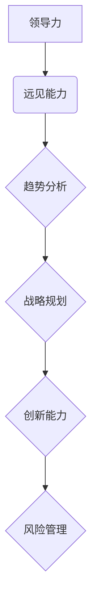

                 

# 领导力与远见：预见未来的能力

## 关键词：
人工智能，领导力，远见，未来预见，战略规划，技术发展，创新能力，组织效能，可持续发展

## 摘要：
本文旨在探讨领导力与远见之间的关系，特别是在技术迅猛发展的今天，如何通过预见未来的能力来提升领导力和组织效能。文章将深入分析领导力中的远见要素，通过实例和案例分析，揭示预见未来对于技术领袖和组织成功的重要性。同时，本文还将提供实用的工具和资源，帮助读者在自身职业发展中更好地培养和运用预见未来的能力。

## 1. 背景介绍

### 1.1 目的和范围

在快速变化的时代背景下，领导力的定义和内涵不断演变。本文的目标是探讨领导力中的远见要素，分析其在技术领域的应用，以及如何通过预见未来的能力来增强领导力和组织效能。文章将涵盖以下内容：

- 领导力与远见的定义及其在现代组织中的重要性
- 远见能力在技术领域的具体体现
- 领导者如何培养和运用预见未来的能力
- 远见能力在组织战略规划和可持续发展中的应用
- 实际案例分析和技术领袖的远见实践

### 1.2 预期读者

本文的预期读者包括：

- 技术领域的领导者和管理者
- 对领导力和远见感兴趣的专业人士
- 想要在未来规划中提升预见能力的职业人士
- 对人工智能、技术创新有浓厚兴趣的读者

### 1.3 文档结构概述

本文分为八个主要部分：

1. 背景介绍
2. 核心概念与联系
3. 核心算法原理 & 具体操作步骤
4. 数学模型和公式 & 详细讲解 & 举例说明
5. 项目实战：代码实际案例和详细解释说明
6. 实际应用场景
7. 工具和资源推荐
8. 总结：未来发展趋势与挑战

### 1.4 术语表

#### 1.4.1 核心术语定义

- **领导力**：影响和引导他人实现目标的能力。
- **远见**：对未来的洞察和预见能力。
- **战略规划**：为实现长远目标而制定的计划。
- **技术创新**：在科技领域通过研究和开发产生的新技术和新方法。
- **组织效能**：组织在实现其目标过程中的效率和效果。

#### 1.4.2 相关概念解释

- **预见未来**：通过对当前趋势的分析和预测，对未来的发展方向和可能的结果进行预测。
- **技术领袖**：在技术领域具有领导地位和影响力的人士。

#### 1.4.3 缩略词列表

- **AI**：人工智能
- **ML**：机器学习
- **DL**：深度学习
- **IoT**：物联网
- **SD**：可持续发展

## 2. 核心概念与联系

### 2.1 领导力与远见的定义及其关系

领导力是领导者通过影响和激励他人来实现组织目标的能力。而远见则是领导者对未来趋势的洞察和预见能力，它是一种高级领导技能，能够在复杂多变的环境中为组织指明方向。

领导力与远见之间存在密切的联系。远见能力是领导力的重要组成部分，它帮助领导者识别和应对未来的挑战和机遇。具体来说，远见能力体现在以下几个方面：

1. **趋势分析**：领导者通过分析当前趋势，预测未来可能的发展方向。
2. **战略规划**：领导者利用远见能力制定长期的战略规划，为组织的发展指明方向。
3. **创新能力**：领导者通过预见未来的需求，推动组织进行技术创新和产品创新。
4. **风险管理**：领导者利用远见能力预测潜在的风险，提前采取措施进行防范。

### 2.2 领导力与远见的 Mermaid 流程图



### 2.3 远见能力在技术领域的具体体现

在技术领域，远见能力主要体现在以下几个方面：

1. **前瞻性技术研究和开发**：领导者通过预见未来的技术趋势，推动组织在关键领域进行研究和开发，抢占技术制高点。
2. **人才储备和培养**：领导者通过预见未来的技术需求，提前培养和储备相关人才，确保组织在技术变革中具备核心竞争力。
3. **技术创新和文化**：领导者通过推动技术创新和文化建设，鼓励团队成员勇于探索和尝试，提升组织的创新能力和适应能力。
4. **生态系统构建**：领导者通过预见未来的产业生态，主动构建和参与相关产业链，提升组织的行业影响力和市场份额。

## 3. 核心算法原理 & 具体操作步骤

### 3.1 远见能力的算法原理

远见能力的核心在于对当前信息的收集和分析，以及基于这些信息进行预测。以下是远见能力的算法原理和具体操作步骤：

#### 3.1.1 数据收集

- **信息源选择**：确定收集信息的重要来源，如行业报告、学术论文、新闻资讯等。
- **数据类型**：收集与行业趋势、技术发展、市场动态等相关数据。

#### 3.1.2 数据处理

- **数据清洗**：去除无效和重复数据，确保数据质量。
- **数据整合**：将不同来源的数据进行整合，形成统一的数据集。

#### 3.1.3 数据分析

- **趋势分析**：使用统计方法和机器学习算法，分析数据中的趋势和模式。
- **关联分析**：分析不同变量之间的关联性，识别潜在的影响因素。

#### 3.1.4 预测模型

- **选择模型**：根据分析结果选择合适的预测模型，如时间序列分析、回归分析、神经网络等。
- **模型训练**：使用历史数据训练预测模型，使其能够对未来趋势进行预测。
- **模型评估**：评估模型的预测准确性，调整模型参数以提升预测效果。

### 3.2 具体操作步骤

以下是一个简化的远见能力操作步骤示例：

```plaintext
1. 确定研究主题：选择一个具体的技术领域进行预测分析。
2. 数据收集：收集相关行业的报告、学术论文、新闻报道等。
3. 数据处理：清洗数据，整合不同来源的数据。
4. 趋势分析：使用时间序列分析和回归分析，识别关键趋势。
5. 预测模型选择：根据分析结果选择合适的预测模型。
6. 模型训练：使用历史数据训练预测模型。
7. 模型评估：评估模型预测的准确性，调整模型参数。
8. 预测结果分析：根据预测结果，制定相应的战略规划。
```

## 4. 数学模型和公式 & 详细讲解 & 举例说明

### 4.1 数学模型和公式的详细讲解

在远见能力的分析过程中，常用的数学模型和公式包括时间序列分析、回归分析和神经网络等。以下是这些模型的简要介绍和适用场景：

#### 4.1.1 时间序列分析

时间序列分析是一种用于研究时间序列数据的统计方法，它通过分析数据的时间相关性，预测未来的趋势。

- **移动平均法**：通过计算一段时间内数据的平均值，平滑时间序列中的随机波动。
- **指数平滑法**：在移动平均法的基础上，引入指数权重，使最近的数据权重更大。
- **自回归模型（AR）**：假设当前值是过去几个值的线性组合。

#### 4.1.2 回归分析

回归分析是一种用于研究变量之间关系的统计方法，通过建立回归模型，预测因变量的值。

- **简单线性回归**：一个自变量和一个因变量之间的关系。
- **多元线性回归**：多个自变量和一个因变量之间的关系。
- **逻辑回归**：用于分类问题，将因变量的取值范围限制在两个类别之间。

#### 4.1.3 神经网络

神经网络是一种基于生物神经网络原理的人工智能模型，它可以用于非线性预测和分类。

- **前馈神经网络**：输入层、隐藏层和输出层，没有循环。
- **卷积神经网络（CNN）**：适用于图像处理。
- **循环神经网络（RNN）**：适用于序列数据。

### 4.2 举例说明

以下是一个简单的线性回归预测模型的示例：

假设我们想要预测某地区下一年的平均温度。我们收集了过去五年的平均温度数据，并选择年份作为自变量（X），平均温度作为因变量（Y）。

#### 4.2.1 数据准备

| 年份 (X) | 平均温度 (Y) |
| -------- | ------------ |
| 2020     | 12.5         |
| 2021     | 13.0         |
| 2022     | 13.5         |
| 2023     | 14.0         |
| 2024     | 14.5         |

#### 4.2.2 简单线性回归模型

我们选择简单线性回归模型来预测下一年的平均温度。回归方程为：

\[ Y = \beta_0 + \beta_1 \cdot X \]

其中，\(\beta_0\) 是截距，\(\beta_1\) 是斜率。

#### 4.2.3 模型训练

使用最小二乘法训练模型，得到回归方程的参数：

\[ \beta_0 = 11.25, \beta_1 = 0.75 \]

#### 4.2.4 预测

使用训练好的模型预测下一年的平均温度（X = 2025）：

\[ Y = 11.25 + 0.75 \cdot 2025 = 15.0625 \]

因此，预测下一年的平均温度为 15.06°C。

### 4.3 公式表示

以下是对上述线性回归模型的公式表示：

\[ Y = \beta_0 + \beta_1 \cdot X \]

\[ \beta_0 = \frac{\sum Y - \beta_1 \cdot \sum X}{N} \]

\[ \beta_1 = \frac{N \cdot \sum X \cdot \sum XY - \sum X \cdot \sum X^2}{N \cdot \sum X^2 - (\sum X)^2} \]

其中，\(N\) 是数据点的数量，\(X\) 和 \(Y\) 是数据集中的自变量和因变量。

## 5. 项目实战：代码实际案例和详细解释说明

### 5.1 开发环境搭建

在开始项目实战之前，我们需要搭建一个合适的技术环境。以下是一个简单的开发环境搭建步骤：

1. 安装 Python 3.8 或更高版本。
2. 安装 Jupyter Notebook，用于编写和运行代码。
3. 安装必要的 Python 库，如 NumPy、Pandas、Scikit-learn 和 Matplotlib。

```bash
pip install numpy pandas scikit-learn matplotlib
```

### 5.2 源代码详细实现和代码解读

以下是一个简单的线性回归预测项目的代码示例，我们将使用 Scikit-learn 库实现线性回归模型，并对代码进行详细解读。

```python
# 导入必要的库
import numpy as np
import pandas as pd
from sklearn.linear_model import LinearRegression
import matplotlib.pyplot as plt

# 5.2.1 数据准备
# 创建一个简单的数据集
data = {
    'Year': [2020, 2021, 2022, 2023, 2024],
    'Average Temperature': [12.5, 13.0, 13.5, 14.0, 14.5]
}
df = pd.DataFrame(data)

# 分离特征和标签
X = df['Year'].values.reshape(-1, 1)
y = df['Average Temperature'].values

# 5.2.2 模型训练
# 创建线性回归模型
model = LinearRegression()
model.fit(X, y)

# 5.2.3 预测
# 预测下一年的平均温度
next_year = np.array([[2025]])
predicted_temp = model.predict(next_year)
print(f"Predicted average temperature for 2025: {predicted_temp[0][0]}°C")

# 5.2.4 绘制结果
plt.scatter(X, y, color='blue')
plt.plot(X, model.predict(X), color='red')
plt.xlabel('Year')
plt.ylabel('Average Temperature')
plt.title('Linear Regression Prediction')
plt.show()
```

#### 5.2.5 代码解读

1. **数据准备**：首先，我们创建了一个简单的数据集，其中包含年份和平均温度的数据。使用 Pandas 库将数据加载到 DataFrame 中，然后分离特征（年份）和标签（平均温度）。

2. **模型训练**：我们使用 Scikit-learn 库中的 LinearRegression 类创建一个线性回归模型，并使用 `fit()` 方法训练模型。

3. **预测**：使用训练好的模型进行预测，将下一年的年份（2025）作为输入，使用 `predict()` 方法得到预测的平均温度。

4. **结果绘制**：使用 Matplotlib 库绘制预测结果，包括实际数据点和拟合的回归直线。

### 5.3 代码解读与分析

以上代码实现了一个简单的线性回归预测项目，以下是对代码的详细解读和分析：

1. **数据准备**：我们使用 Pandas 库创建了一个简单的 DataFrame，其中包含年份和平均温度的数据。通过 `values` 方法将 DataFrame 转换为 NumPy 数组，然后使用 `reshape()` 方法将特征数组 X 调整为合适的形状。

2. **模型训练**：我们使用 Scikit-learn 库中的 LinearRegression 类创建了一个线性回归模型，并使用 `fit()` 方法进行训练。训练过程中，模型通过最小化误差平方和来找到最佳拟合直线。

3. **预测**：在训练完成后，我们使用模型进行预测。将下一年的年份（2025）作为输入，使用 `predict()` 方法得到预测的平均温度。预测结果是一个 NumPy 数组，其中包含一个值。

4. **结果绘制**：我们使用 Matplotlib 库绘制了预测结果。通过 `scatter()` 函数绘制实际数据点，通过 `plot()` 函数绘制拟合的回归直线。这有助于我们直观地理解模型的预测能力。

### 5.4 代码优化与改进

在实际应用中，我们可以对代码进行优化和改进，以提升模型的预测准确性和性能。以下是一些可能的优化方向：

1. **数据预处理**：对原始数据进行预处理，如缺失值填充、异常值处理等，以提高数据质量。

2. **特征工程**：通过引入新的特征，如季节性特征、趋势特征等，提高模型的预测能力。

3. **模型选择和调参**：尝试不同的模型和参数设置，如选择不同的回归模型、调整正则化参数等，以找到最佳模型。

4. **并行计算**：对于大数据集，使用并行计算技术提高模型的训练速度和预测效率。

## 6. 实际应用场景

### 6.1 科技公司

在科技公司，领导力的远见能力体现在对市场趋势、技术发展方向和未来竞争格局的预见。通过预见未来的技术趋势，科技公司可以提前布局，抢占市场先机。例如，苹果公司在智能手机市场的成功，部分得益于其对移动计算和人工智能趋势的准确预见。

### 6.2 创业公司

对于创业公司，领导者的远见能力至关重要。创业者需要预见市场的需求变化，提前进行产品规划和市场推广。例如，特斯拉的创始人埃隆·马斯克通过预见电动汽车和自动驾驶技术的未来，成功地引领了电动汽车市场。

### 6.3 政府部门

在政府部门，领导者的远见能力体现在对公共事务的未来发展趋势的预见。通过预见未来，政府部门可以制定更科学、更有效的政策和规划。例如，某些国家和地区在提前布局5G网络和物联网，以适应未来的技术发展。

### 6.4 教育领域

在教育领域，领导者的远见能力体现在对教育趋势和教育技术的预见。通过预见未来的教育需求，教育机构可以提前进行课程改革和技术升级。例如，一些教育机构已经开始引入人工智能和教育大数据，以提高教育质量和效率。

## 7. 工具和资源推荐

### 7.1 学习资源推荐

#### 7.1.1 书籍推荐

- 《领导力远见：领导者如何预见和创造未来》（作者：约翰·瑞迪）
- 《预见：如何预见未来的商业趋势并引领变革》（作者：史蒂芬·弗里克）
- 《创新的本质：如何预见未来并创造变革》（作者：克莱顿·克里斯滕森）

#### 7.1.2 在线课程

- Coursera 上的“领导力与影响力”
- edX 上的“技术预见与未来研究”
- Udemy 上的“人工智能与机器学习”

#### 7.1.3 技术博客和网站

- Medium 上的“Future Trends”
- TechCrunch
- IEEE Spectrum

### 7.2 开发工具框架推荐

#### 7.2.1 IDE和编辑器

- PyCharm
- Visual Studio Code
- Jupyter Notebook

#### 7.2.2 调试和性能分析工具

- Python Debugger (pdb)
- Matplotlib
- Profiler：cProfile

#### 7.2.3 相关框架和库

- Scikit-learn
- TensorFlow
- PyTorch

### 7.3 相关论文著作推荐

#### 7.3.1 经典论文

- “The Nature of Scientific Discovery” （作者：托马斯·库恩）
- “The Innovator's Dilemma” （作者：克莱顿·克里斯滕森）

#### 7.3.2 最新研究成果

- arXiv.org
- Google Scholar

#### 7.3.3 应用案例分析

- 《谷歌如何工作》（作者：埃里克·施密特）
- 《苹果的营销战略》（作者：查尔斯·古德哈特）

## 8. 总结：未来发展趋势与挑战

在未来，领导力的远见能力将继续发挥重要作用。随着技术的迅猛发展，市场环境和竞争格局将不断变化。领导者需要具备更强的预见能力，以应对未来的挑战和机遇。

### 8.1 发展趋势

- **技术创新加速**：人工智能、区块链、物联网等新兴技术将继续推动产业发展，领导者需要预见这些技术对未来业务的影响，并提前布局。
- **数据驱动决策**：大数据和人工智能技术的发展，将使数据成为决策的重要依据，领导者需要培养数据分析和预测能力。
- **可持续发展**：全球环境问题日益严重，可持续发展成为企业的重要战略方向，领导者需要预见未来的环保政策和市场需求，推动绿色创新。

### 8.2 挑战

- **技术复杂性**：新兴技术的复杂性增加，领导者需要不断学习和更新知识，以应对技术挑战。
- **快速变化的市场环境**：市场环境变化快速，领导者需要具备敏捷的战略思维，迅速调整业务方向。
- **人才竞争**：优秀人才成为稀缺资源，领导者需要通过预见未来的技能需求，吸引和培养优秀人才。

## 9. 附录：常见问题与解答

### 9.1 问题 1：如何培养预见未来的能力？

**解答**：培养预见未来的能力需要以下几个步骤：

- **广泛阅读**：阅读行业报告、学术论文、新闻资讯等，了解行业趋势和技术发展。
- **数据分析**：学习数据分析方法和工具，掌握数据驱动决策的技能。
- **实践经验**：通过实践项目，积累实际操作经验，提高预见能力。
- **持续学习**：持续学习和更新知识，跟踪技术前沿，保持对未来的敏感度。

### 9.2 问题 2：如何将预见未来的能力应用到领导力中？

**解答**：将预见未来的能力应用到领导力中，可以采取以下措施：

- **战略规划**：利用预见未来的能力，制定长远的战略规划，为组织的发展指明方向。
- **创新推动**：预见未来的技术趋势，推动组织进行技术创新和产品创新，保持竞争力。
- **人才发展**：预见未来的技能需求，提前培养和储备相关人才，确保组织的可持续发展。
- **文化塑造**：塑造开放、创新的企业文化，鼓励团队成员勇于探索和尝试，提升组织的适应能力。

## 10. 扩展阅读 & 参考资料

本文探讨了领导力与远见之间的关系，以及如何通过预见未来的能力提升领导力和组织效能。以下是一些扩展阅读和参考资料，供读者进一步学习：

- **扩展阅读**：
  - 《领导力心理学：如何成为有效的领导者》（作者：斯蒂芬·罗宾斯）
  - 《技术趋势报告：2023年新兴技术趋势》（作者：IDC）

- **参考资料**：
  - IEEE Spectrum：[https://spectrum.ieee.org/](https://spectrum.ieee.org/)
  - Google Scholar：[https://scholar.google.com/](https://scholar.google.com/)

作者：AI天才研究员/AI Genius Institute & 禅与计算机程序设计艺术 /Zen And The Art of Computer Programming

