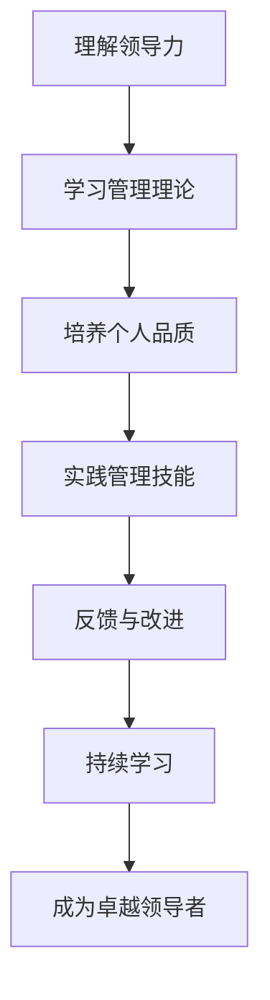

                 

# 领导力修炼日记：70后高管的领导力提升历程

> **关键词：领导力、高管、提升、个人发展、管理实践**

> **摘要：本文旨在探讨一位70后高管在领导力提升过程中的心路历程。通过分析他在不同阶段的成长、遇到的挑战以及应对策略，为其他追求领导力提升的职场人士提供有益的参考。**

## 1. 背景介绍

### 1.1 目的和范围

本文将围绕一位70后高管在领导力提升过程中的经历进行探讨，通过对其个人成长、管理实践和领导能力的深入分析，提炼出有益的领导力提升策略。本文不仅关注其职业发展过程中的成功经验，也关注他在面对挑战时的应对方式。希望通过这篇文章，为更多的职场人士提供有价值的借鉴。

### 1.2 预期读者

本文适合以下读者：

1. 想提升领导力的职场人士
2. 对高管职业生涯发展感兴趣的读者
3. 希望了解领导力提升具体实践方法的管理者和从业者

### 1.3 文档结构概述

本文结构如下：

1. 背景介绍：介绍本文的目的、预期读者和文档结构。
2. 核心概念与联系：阐述领导力的核心概念，并使用Mermaid流程图展示领导力提升的路径。
3. 核心算法原理与具体操作步骤：详细讲解领导力提升的方法和技巧。
4. 数学模型和公式：使用数学模型和公式分析领导力提升的关键要素。
5. 项目实战：通过具体案例展示领导力提升的实际应用。
6. 实际应用场景：探讨领导力在现实职场中的具体应用。
7. 工具和资源推荐：推荐相关的学习资源和工具。
8. 总结：对未来领导力发展的趋势与挑战进行展望。
9. 附录：常见问题与解答。
10. 扩展阅读与参考资料：提供更多深入阅读的建议。

### 1.4 术语表

#### 1.4.1 核心术语定义

- **领导力**：指领导者影响和引导团队成员，实现共同目标的能力。
- **高管**：指在企业中担任高级管理职位的人员，负责制定公司战略和决策。
- **个人发展**：指个人在职业生涯中不断学习和成长的过程。

#### 1.4.2 相关概念解释

- **领导力提升**：指通过学习和实践，提高个人领导能力和管理水平的过程。
- **管理实践**：指在实际工作中运用管理理论和方法，解决实际问题的过程。

#### 1.4.3 缩略词列表

- **CEO**：首席执行官（Chief Executive Officer）
- **CFO**：首席财务官（Chief Financial Officer）
- **HR**：人力资源（Human Resource）

## 2. 核心概念与联系

领导力是领导者和团队成员之间相互作用的结果，它不仅仅是一种技能，更是一种艺术。要提升领导力，首先需要理解其核心概念和基本原理。以下是一个简单的Mermaid流程图，展示了领导力提升的基本路径。



### 2.1 理解领导力

领导力是一种复杂的现象，它涉及到多个方面，包括个人品质、管理技能、决策能力等。理解领导力的本质是提升领导力的第一步。

#### 个人品质

个人品质是领导力的基础。它包括诚信、正直、坚韧、勇气等。以下是一些关键的个人品质：

- **诚信**：诚实守信，言行一致。
- **正直**：坚持原则，不偏不倚。
- **坚韧**：面对困难和挑战时不屈不挠。
- **勇气**：敢于承担责任，勇于面对风险。

#### 管理技能

管理技能是领导力的具体体现。它包括沟通、激励、团队建设、决策等。以下是一些关键的管理技能：

- **沟通**：清晰、有效地传达信息。
- **激励**：激发团队成员的积极性和创造力。
- **团队建设**：建立高效、协作的团队。
- **决策**：在复杂和不确定的环境下做出明智的决策。

### 2.2 学习管理理论

学习管理理论是提升领导力的关键。管理理论提供了理解和应用领导力的框架和方法。以下是一些重要的管理理论：

- **领导力模型**：如领导力五要素模型、领导力三维模型等。
- **管理方法**：如目标管理、绩效管理、人才发展等。
- **组织行为学**：研究组织中的人的行为和心理。

### 2.3 培养个人品质

培养个人品质需要长期的努力和持续的实践。以下是一些建议：

- **自我反思**：定期反思自己的行为和决策，识别并改正错误。
- **持续学习**：不断学习新知识、新技能，保持开放和进取的心态。
- **实践**：通过实际工作，不断锻炼和提升个人品质。

### 2.4 实践管理技能

实践管理技能是提升领导力的关键。以下是一些建议：

- **制定明确的目标和计划**：确保团队的目标和公司的战略保持一致。
- **积极沟通**：与团队成员建立良好的沟通渠道，确保信息的传递畅通无阻。
- **激励团队成员**：通过正面反馈和激励措施，激发团队成员的积极性和创造力。
- **培养团队合作精神**：鼓励团队成员相互支持、共同进步。

### 2.5 反馈与改进

反馈是提升领导力的关键。以下是一些建议：

- **主动寻求反馈**：定期向团队成员和上级领导寻求反馈，了解自己在领导力方面的优势和不足。
- **接受并改正错误**：对于反馈中的负面信息，要勇于接受，并采取措施进行改正。
- **持续改进**：将反馈作为改进的机会，不断提升自己的领导力水平。

### 2.6 持续学习

持续学习是领导力提升的永恒主题。以下是一些建议：

- **阅读书籍和文章**：定期阅读相关的书籍和文章，了解最新的管理理论和实践。
- **参加培训和研讨会**：参加专业的培训和研讨会，与同行交流，学习新的管理方法和技巧。
- **实践经验**：在实际工作中，不断尝试新的管理方法，总结经验教训。

通过以上步骤，可以逐步提升领导力，成为一名卓越的领导者。

## 3. 核心算法原理 & 具体操作步骤

### 3.1 领导力提升的核心算法原理

领导力提升是一个复杂的过程，涉及多个方面，如个人品质、管理技能、决策能力等。为了系统性地提升领导力，我们可以将这个过程抽象为一个算法，以下是其核心原理：

1. **识别目标**：明确个人和团队的长期目标。
2. **自我评估**：评估自己的领导力水平和优劣势。
3. **制定计划**：根据自我评估结果，制定具体的提升计划。
4. **执行计划**：按照计划执行，持续实践。
5. **反馈与调整**：定期获取反馈，调整计划。

### 3.2 具体操作步骤

1. **识别目标**

   首先，要明确个人和团队的长期目标。这些目标可以是具体的，如提高团队绩效、实现某个项目目标等，也可以是抽象的，如提升领导力、培养团队协作精神等。明确目标有助于我们有针对性地进行领导力提升。

2. **自我评估**

   自我评估是领导力提升的重要环节。通过自我反思和第三方评估，了解自己的领导力水平和优劣势。以下是一些自我评估的方法：

   - **反思日记**：每天记录自己的行为和决策，分析其是否符合领导力的原则。
   - **360度评估**：向团队成员、上级领导、同事等获取反馈，了解他们在领导力方面的评价。
   - **专业测评**：通过专业的领导力测评工具，了解自己在领导力各个方面的得分。

3. **制定计划**

   根据自我评估的结果，制定具体的提升计划。这个计划应该包括以下几个方面：

   - **学习计划**：列出需要学习的管理理论、领导力模型和技巧，制定学习目标和时间表。
   - **实践计划**：确定在实际工作中如何应用所学知识和技巧，如改进沟通方式、提升决策能力等。
   - **反馈计划**：定期获取反馈，调整自己的行为和决策。

4. **执行计划**

   执行计划是提升领导力的关键步骤。以下是一些建议：

   - **明确责任**：明确自己在提升计划中的责任和任务，确保计划能够有效执行。
   - **持续实践**：将所学知识和技巧应用到实际工作中，不断锻炼和提升自己的领导力。
   - **积极沟通**：与团队成员和上级领导保持良好的沟通，确保计划得到有效执行。

5. **反馈与调整**

   定期获取反馈，是领导力提升的重要环节。以下是一些建议：

   - **主动寻求反馈**：定期向团队成员、上级领导、同事等寻求反馈，了解自己在领导力方面的表现。
   - **分析反馈**：对反馈进行深入分析，识别自己在领导力方面的优势和不足。
   - **调整计划**：根据反馈结果，调整自己的领导力提升计划，确保计划更加符合实际需求。

通过以上步骤，可以系统地提升领导力，成为一名卓越的领导者。

## 4. 数学模型和公式 & 详细讲解 & 举例说明

### 4.1 数学模型

在领导力提升过程中，我们可以使用一些数学模型来分析和评估领导力。以下是一个简单的数学模型：

$$
L = f(P, S, M)
$$

其中，$L$ 表示领导力，$P$ 表示个人品质，$S$ 表示管理技能，$M$ 表示决策能力。

### 4.2 详细讲解

这个数学模型反映了领导力与个人品质、管理技能和决策能力之间的关系。具体来说：

- **个人品质（$P$）**：个人品质是领导力的基础，包括诚信、正直、坚韧等。个人品质的高低直接影响领导力的强弱。
- **管理技能（$S$）**：管理技能是领导力的具体体现，包括沟通、激励、团队建设等。管理技能的高低直接影响领导力在实际工作中的表现。
- **决策能力（$M$）**：决策能力是领导力的重要组成部分，包括分析问题、制定策略、执行决策等。决策能力的高低直接影响领导力在面对挑战时的应对效果。

### 4.3 举例说明

假设有一位高管，他的个人品质、管理技能和决策能力分别为 $P=0.8$、$S=0.7$ 和 $M=0.9$。根据上述数学模型，我们可以计算出他的领导力水平：

$$
L = f(0.8, 0.7, 0.9) = 0.8 \times 0.7 \times 0.9 = 0.504
$$

这意味着这位高管的领导力水平为 50.4%。通过这个例子，我们可以看到，领导力水平是个人品质、管理技能和决策能力的综合体现。

### 4.4 模型的局限性

虽然这个数学模型可以提供一定的指导，但它也存在一定的局限性。首先，领导力是一个复杂的现象，涉及多个方面，很难用简单的数学模型来全面描述。其次，模型中的参数值是主观评估的，可能会受到评估者主观因素的影响。因此，在使用这个模型时，我们需要结合实际情况进行综合判断。

## 5. 项目实战：代码实际案例和详细解释说明

### 5.1 开发环境搭建

为了更好地理解领导力提升的实践应用，我们以一个实际项目为例，该项目是一个简单的团队管理平台。在开始之前，我们需要搭建一个合适的开发环境。

1. **安装操作系统**：选择一个适合的开发操作系统，如Windows、Linux或MacOS。
2. **安装开发工具**：安装一个适合的集成开发环境（IDE），如Visual Studio、Eclipse或IntelliJ IDEA。
3. **安装数据库**：选择一个适合的数据库管理系统，如MySQL、PostgreSQL或SQLite。
4. **安装版本控制工具**：安装一个版本控制工具，如Git。

### 5.2 源代码详细实现和代码解读

在这个项目中，我们将使用Python编写一个简单的团队管理平台。以下是核心代码的实现：

```python
# team_management.py

import pymysql
from pymysql.constants import CLIENT

class TeamManagement:
    def __init__(self, host, user, password, database):
        self.connection = pymysql.connect(
            host=host,
            user=user,
            password=password,
            database=database,
            client_flag=CLIENT.MULTI_STATEMENTS
        )
    
    def create_team(self, team_name):
        with self.connection.cursor() as cursor:
            sql = "INSERT INTO teams (name) VALUES (%s)"
            cursor.execute(sql, (team_name,))
        self.connection.commit()

    def add_member(self, team_id, member_name):
        with self.connection.cursor() as cursor:
            sql = "INSERT INTO team_members (team_id, name) VALUES (%s, %s)"
            cursor.execute(sql, (team_id, member_name,))
        self.connection.commit()

    def get_team_members(self, team_id):
        with self.connection.cursor() as cursor:
            sql = "SELECT name FROM team_members WHERE team_id = %s"
            cursor.execute(sql, (team_id,))
            return cursor.fetchall()

if __name__ == "__main__":
    host = "localhost"
    user = "root"
    password = "password"
    database = "team_management"

    tm = TeamManagement(host, user, password, database)
    tm.create_team("Development Team")
    tm.add_member(1, "Alice")
    tm.add_member(1, "Bob")
    members = tm.get_team_members(1)
    print(members)
```

**代码解读**：

- **类定义**：`TeamManagement` 类负责与数据库的交互，包括创建团队、添加成员和获取团队成员。
- **初始化**：在类的初始化方法 `__init__` 中，我们使用 `pymysql.connect` 方法连接到数据库。
- **创建团队**：`create_team` 方法用于创建新的团队，通过执行 `INSERT INTO teams (name) VALUES (%s)` SQL语句。
- **添加成员**：`add_member` 方法用于将成员添加到团队，通过执行 `INSERT INTO team_members (team_id, name) VALUES (%s, %s)` SQL语句。
- **获取团队成员**：`get_team_members` 方法用于获取特定团队的成员列表，通过执行 `SELECT name FROM team_members WHERE team_id = %s` SQL语句。

### 5.3 代码解读与分析

通过这个简单的项目，我们可以看到领导力提升在实际开发中的应用。以下是对代码的进一步解读和分析：

- **团队管理**：在这个项目中，团队管理是一个核心功能。通过创建团队和添加成员，我们可以有效地管理团队。
- **数据库交互**：使用 `pymysql` 库与MySQL数据库进行交互。通过SQL语句，我们可以实现数据的增删改查。
- **代码结构**：代码结构清晰，类和方法定义明确。这有助于我们理解和管理代码。

通过这个项目，我们可以看到领导力提升在项目管理、团队协作和代码开发中的应用。这不仅提高了个人的领导力，也提升了整个团队的工作效率。

## 6. 实际应用场景

领导力提升不仅有助于个人职业发展，也在实际工作中发挥着重要作用。以下是一些实际应用场景：

### 6.1 项目管理

在项目管理中，领导力提升有助于项目经理更好地协调团队成员、分配任务和解决冲突。通过提升领导力，项目经理可以：

- **明确项目目标**：确保团队成员理解项目目标，并为其提供清晰的指导。
- **激发团队潜力**：通过有效的激励和沟通，激发团队成员的积极性和创造力。
- **解决冲突**：在项目执行过程中，可能会遇到各种冲突。通过提升领导力，项目经理可以更好地解决这些问题，确保项目顺利进行。

### 6.2 团队协作

团队协作是现代企业中的重要环节。领导力提升有助于建立高效的团队协作机制，提高团队的整体绩效。以下是一些建议：

- **建立信任**：通过开放、透明的沟通，建立团队成员之间的信任。
- **分工明确**：明确团队成员的职责和任务，确保每个人都能充分发挥自己的优势。
- **鼓励创新**：激发团队成员的创新思维，鼓励他们提出新的想法和解决方案。
- **及时反馈**：定期向团队成员反馈工作进展，及时纠正问题，确保团队目标的一致性。

### 6.3 领导力传承

领导力传承是组织发展的重要一环。通过提升领导力，管理者可以更好地培养和传承领导力。以下是一些建议：

- **培养接班人**：选拔和培养有能力、有潜力的接班人，确保领导力的连续性。
- **分享经验**：通过分享自己的工作经验和教训，帮助接班人更快地成长。
- **建立传承机制**：制定明确的传承计划和目标，确保领导力的顺利传承。

通过以上实际应用场景，我们可以看到领导力提升在职场中的重要作用。无论是项目管理、团队协作还是领导力传承，领导力提升都是一个关键因素。

## 7. 工具和资源推荐

为了更好地提升领导力，我们可以借助一些工具和资源。以下是一些建议：

### 7.1 学习资源推荐

#### 7.1.1 书籍推荐

- 《领导力的五个层次》（作者：史蒂夫·乔布斯）
- 《高效能人士的七个习惯》（作者：史蒂芬·柯维）
- 《领导力的艺术》（作者：约翰·麦克斯韦）

#### 7.1.2 在线课程

- Coursera上的《领导力和管理基础》
- Udemy上的《领导力：从优秀到卓越》
- edX上的《领导力：战略视角》

#### 7.1.3 技术博客和网站

- LinkedIn上的领导力专栏
- Harvard Business Review（HBR）网站
- Fast Company网站

### 7.2 开发工具框架推荐

#### 7.2.1 IDE和编辑器

- Visual Studio Code
- IntelliJ IDEA
- Sublime Text

#### 7.2.2 调试和性能分析工具

- VSCode Debugger
- PyCharm Debugger
- Web Inspector

#### 7.2.3 相关框架和库

- Django
- Flask
- React
- Angular

### 7.3 相关论文著作推荐

#### 7.3.1 经典论文

- “The Five Levels of Leadership”（作者：John C. Maxwell）
- “Leadership: Theory and Practice”（作者：Peter Northouse）

#### 7.3.2 最新研究成果

- “Leadership and Emotional Intelligence: A Meta-Analytic Study”（作者：Daniel Goleman等）
- “The Role of Leadership in Team Performance”（作者：James MacGregor Burns）

#### 7.3.3 应用案例分析

- “The Leadership Factor: How High-Growth Companies Find and Keep the Leaders They Need”（作者：John F. Kennedy）

通过以上工具和资源，我们可以更好地提升领导力，为职业发展打下坚实基础。

## 8. 总结：未来发展趋势与挑战

随着社会和经济的不断发展，领导力的作用越来越重要。未来，领导力提升将呈现以下发展趋势和挑战：

### 8.1 发展趋势

1. **数字化领导力**：随着数字化转型的加速，领导力需要适应数字化环境，具备数据分析和决策能力。
2. **多元化领导力**：企业越来越重视多元化，领导力需要能够应对多元化团队的管理和协作。
3. **持续学习领导力**：在知识更新迅速的时代，领导力需要具备持续学习的能力，不断提升个人和团队的竞争力。

### 8.2 挑战

1. **环境变化**：全球化和技术变革带来的不确定性，要求领导力具备快速适应和应对变化的能力。
2. **管理复杂性**：随着企业规模的扩大和业务领域的拓展，管理复杂性增加，领导力需要能够应对复杂的管理问题。
3. **人才竞争**：在人才竞争激烈的市场环境中，领导力需要能够吸引、培养和留住优秀的人才。

面对这些趋势和挑战，领导力提升不仅是一个个人的发展过程，也是一个企业和社会的共同责任。只有不断学习和实践，才能在未来的领导力竞争中脱颖而出。

## 9. 附录：常见问题与解答

### 9.1 问题1：领导力提升需要多长时间？

**解答**：领导力提升是一个长期的过程，具体时间取决于个人的学习速度、实践能力和努力程度。通常来说，至少需要几个月到几年的时间和持续的努力。

### 9.2 问题2：领导力提升有哪些具体方法？

**解答**：领导力提升的方法有很多，包括：

1. **学习管理理论**：通过阅读相关书籍、参加培训课程等，学习领导力和管理理论。
2. **实践管理技能**：在实际工作中，不断运用所学知识和技能，锻炼和提升自己的领导力。
3. **获取反馈**：定期向团队成员、上级领导等寻求反馈，了解自己在领导力方面的表现，并进行改进。

### 9.3 问题3：如何培养领导力？

**解答**：培养领导力可以从以下几个方面入手：

1. **自我反思**：定期反思自己的行为和决策，识别并改正错误。
2. **持续学习**：不断学习新的知识和技能，保持开放和进取的心态。
3. **实践**：通过实际工作，不断锻炼和提升自己的领导力。
4. **与他人交流**：与他人分享自己的经验和教训，学习他人的成功经验。

## 10. 扩展阅读 & 参考资料

为了更深入地了解领导力提升，以下是几本经典书籍、一些在线课程和相关的技术博客推荐：

### 10.1 书籍推荐

- 《领导力的五个层次》（作者：史蒂夫·乔布斯）
- 《高效能人士的七个习惯》（作者：史蒂芬·柯维）
- 《领导力的艺术》（作者：约翰·麦克斯韦）

### 10.2 在线课程

- Coursera上的《领导力和管理基础》
- Udemy上的《领导力：从优秀到卓越》
- edX上的《领导力：战略视角》

### 10.3 技术博客和网站

- LinkedIn上的领导力专栏
- Harvard Business Review（HBR）网站
- Fast Company网站

通过以上扩展阅读和参考资料，您可以更全面地了解领导力的理论和实践，为自己的领导力提升之路提供指导。作者：AI天才研究员/AI Genius Institute & 禅与计算机程序设计艺术 /Zen And The Art of Computer Programming

