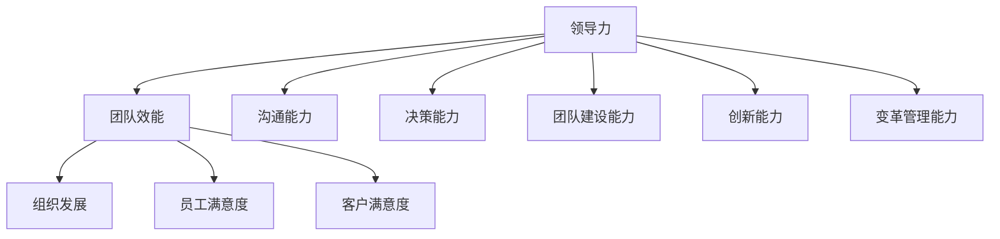
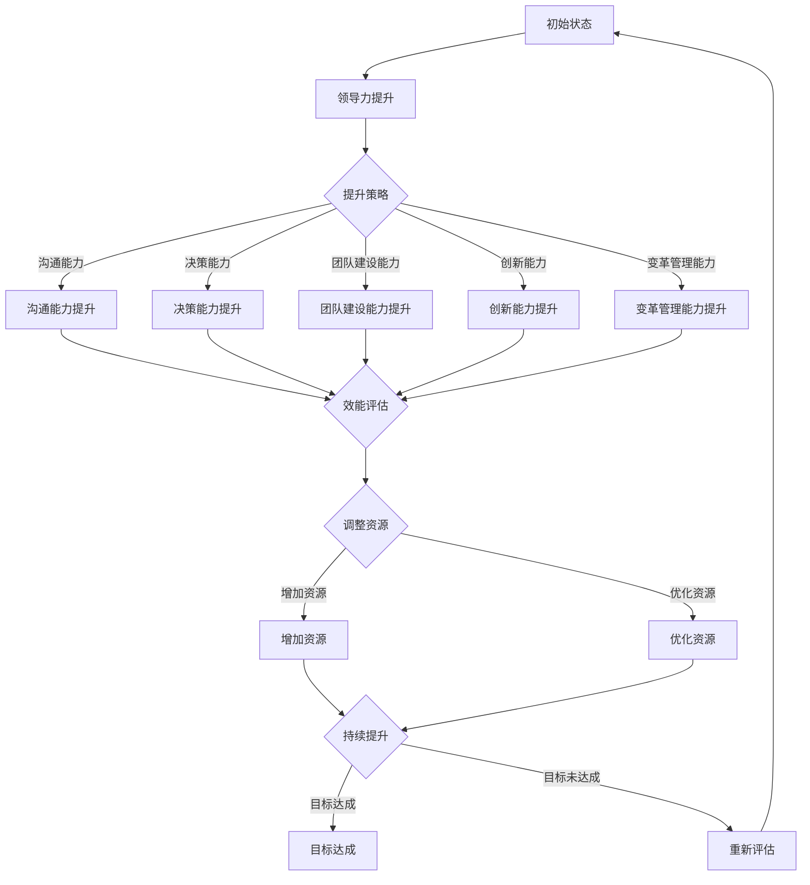

                 

# 领导力修炼笔记：70后高管的领导力提升之路

> 关键词：领导力、70后高管、领导力提升、团队管理、战略决策、技术驱动、变革管理、个人成长、组织文化、领导风格、职业发展

> 摘要：本文深入探讨了70后高管在领导力提升过程中的挑战和策略。通过分析领导力的核心要素，结合实际案例，提供了系统化的提升路径，旨在帮助70后高管更好地适应变化，推动组织持续发展。

## 1. 背景介绍

### 1.1 目的和范围

本文旨在为70后高管提供一个系统化的领导力提升指南，帮助他们更好地应对当前复杂多变的市场环境。文章将围绕领导力的核心概念，结合实际案例，探讨提升领导力的策略和方法，包括团队管理、战略决策、变革管理和个人成长等方面。

### 1.2 预期读者

本文适合70后高管以及希望提升领导力的企业管理者阅读。读者需具备一定的管理经验，并对领导力有初步的理解。

### 1.3 文档结构概述

本文分为十个部分，结构如下：

1. 背景介绍
   - 目的和范围
   - 预期读者
   - 文档结构概述
   - 术语表
2. 核心概念与联系
   - 领导力的定义
   - 领导力模型
   - 领导力与管理的区别
3. 核心算法原理 & 具体操作步骤
   - 领导力提升的算法原理
   - 团队建设的关键步骤
   - 战略决策的算法框架
4. 数学模型和公式 & 详细讲解 & 举例说明
   - 领导力测评模型
   - 团队效能的量化分析
   - 变革管理的数学模型
5. 项目实战：代码实际案例和详细解释说明
   - 团队管理的实践案例
   - 战略决策的实际操作
   - 变革管理的具体实施
6. 实际应用场景
   - 传统行业中的领导力应用
   - 科技行业中的领导力挑战
   - 国际化背景下的领导力策略
7. 工具和资源推荐
   - 学习资源推荐
   - 开发工具框架推荐
   - 相关论文著作推荐
8. 总结：未来发展趋势与挑战
   - 领导力的未来发展趋势
   - 面临的挑战和机遇
9. 附录：常见问题与解答
   - 领导力提升常见问题
   - 应对挑战的策略
10. 扩展阅读 & 参考资料
    - 领导力相关书籍推荐
    - 领导力在线课程推荐
    - 领导力技术博客和网站推荐

### 1.4 术语表

#### 1.4.1 核心术语定义

- 领导力：影响和激励他人实现共同目标的能力。
- 管理力：组织、协调、控制资源以实现目标的能力。
- 团队建设：通过共同目标和有效沟通建立高效团队的过程。
- 战略决策：组织在长期发展过程中作出的关键选择和规划。
- 变革管理：引导组织适应外部环境变化的过程。

#### 1.4.2 相关概念解释

- 领导力模型：用于分析和评价领导力特征的框架。
- 效能提升：提高团队或组织工作效果的措施。
- 个人成长：通过学习和发展提升个人能力和素质。
- 组织文化：组织中共享的价值观、信念和行为规范。

#### 1.4.3 缩略词列表

- CTO：首席技术官
- CEO：首席执行官
- HR：人力资源
- IT：信息技术
- PM：项目经理
- BP：商业计划

## 2. 核心概念与联系

在探讨领导力提升之前，有必要明确领导力的核心概念及其相互关系。以下是对领导力、领导力模型和管理力之间的关系的详细探讨。

### 2.1 领导力的定义

领导力是指领导者通过影响、激励和引导他人，实现共同目标的能力。它不仅涉及个人魅力，还包括战略思维、决策能力、沟通技巧和团队建设等多个方面。

### 2.2 领导力模型

领导力模型是分析领导力特征和行为的工具。常见的领导力模型包括：菲德勒模型、路径-目标理论、变革型领导理论和交易型领导理论等。这些模型为我们理解领导力提供了不同的视角，有助于我们制定针对性的提升策略。

#### 2.2.1 菲德勒模型

菲德勒模型认为，领导风格并非一成不变，而是根据不同情境进行调整。领导者需具备以下能力：

- **情境分析能力**：评估当前情境的稳定性，确定是否需要调整领导风格。
- **灵活应对能力**：根据情境变化，灵活调整领导风格，以实现最佳效果。

#### 2.2.2 路径-目标理论

路径-目标理论强调领导者应明确团队成员的目标，并提供支持和指导，以帮助其实现目标。领导者需具备以下能力：

- **目标设定能力**：明确团队成员的目标，确保目标具有挑战性且可实现。
- **激励和激励能力**：通过奖励和认可，激励团队成员为实现目标而努力。

#### 2.2.3 变革型领导理论

变革型领导理论认为，领导者应具备以下能力：

- **创新思维**：勇于挑战现状，提出新的思路和方法。
- **激励与影响**：激发团队成员的潜力，引导他们为实现共同目标而努力。

### 2.3 领导力与管理的区别

领导力和管理力是两个密切相关但又有所区别的概念。领导力侧重于影响和激励他人，实现共同目标；而管理力则侧重于组织、协调和控制资源，确保目标实现。

#### 2.3.1 领导力与管理力的联系

- **领导力**：为管理力提供方向和动力。
- **管理力**：为领导力提供实现目标的保障。

#### 2.3.2 领导力与管理力的区别

- **领导力**：关注人的因素，强调个人魅力和影响力。
- **管理力**：关注组织和流程，强调效率和效果。

### 2.4 领导力的核心要素

领导力的核心要素包括：沟通能力、决策能力、团队建设能力、创新能力和变革管理能力。以下是对这些要素的简要说明：

#### 2.4.1 沟通能力

沟通能力是领导力的核心要素之一。领导者需具备以下能力：

- **有效沟通**：清晰、准确地表达自己的想法和意见。
- **倾听能力**：倾听他人的意见和建议，理解他人的需求和期望。

#### 2.4.2 决策能力

决策能力是领导者的一项重要能力。领导者需具备以下能力：

- **分析能力**：对问题进行全面分析，找到最佳解决方案。
- **决策速度**：在确保分析充分的前提下，迅速做出决策。

#### 2.4.3 团队建设能力

团队建设能力是领导者的一项关键能力。领导者需具备以下能力：

- **团队组建**：根据团队目标和成员特点，组建合适的团队。
- **团队激励**：激发团队成员的潜力，提高团队整体效能。

#### 2.4.4 创新能力

创新能力是领导者的一项重要能力。领导者需具备以下能力：

- **创新思维**：勇于挑战现状，提出新的思路和方法。
- **创新实践**：将创新思维转化为实际行动，推动组织变革。

#### 2.4.5 变革管理能力

变革管理能力是领导者的一项关键能力。领导者需具备以下能力：

- **变革意识**：认识到变革的必要性和紧迫性。
- **变革推动**：通过有效的变革管理策略，推动组织变革。

### 2.5 领导力与团队效能的关系

领导力与团队效能密切相关。有效的领导力能够提高团队效能，促进组织发展。以下是一个简单的领导力与团队效能关系的 Mermaid 流程图：



通过以上分析，我们可以看出领导力在提升团队效能和组织发展方面发挥着重要作用。在接下来的部分，我们将进一步探讨如何具体提升领导力。

## 3. 核心算法原理 & 具体操作步骤

### 3.1 领导力提升的算法原理

领导力提升的过程可以看作是一个复杂系统中的优化问题。以下是领导力提升算法的基本原理：

#### 3.1.1 问题定义

领导力提升的目标是：在给定的资源约束下，最大化团队效能和组织发展。具体目标函数可以表示为：

\[ f(L, R) = max(EFF, GD) \]

其中，\( L \) 表示领导力，\( R \) 表示资源，\( EFF \) 表示团队效能，\( GD \) 表示组织发展。

#### 3.1.2 状态空间

领导力提升的状态空间包括：

- 领导力水平（L）
- 团队资源（R）
- 团队效能（EFF）
- 组织发展（GD）

状态空间可以用以下 Mermaid 流程图表示：



#### 3.1.3 算法流程

领导力提升的算法流程可以分为以下几个步骤：

1. **初始化状态**：确定初始领导力水平（L）、团队资源（R）和目标（EFF，GD）。
2. **策略选择**：根据当前状态，选择合适的提升策略（如沟通能力提升、决策能力提升等）。
3. **策略执行**：执行所选策略，提升相应能力。
4. **效能评估**：评估团队效能（EFF）和组织发展（GD），判断目标是否达成。
5. **资源调整**：根据效能评估结果，调整团队资源（R）。
6. **目标达成判断**：判断目标是否达成。若达成，则结束；否则，返回步骤2。

### 3.2 团队建设的关键步骤

团队建设是领导力提升的重要方面。以下是基于领导力提升算法原理的团队建设关键步骤：

#### 3.2.1 初始状态分析

- **领导力水平（L）**：评估领导者的领导力水平，确定当前状态。
- **团队资源（R）**：评估团队资源，包括人力、物力、财力等。
- **团队效能（EFF）**：评估团队当前的工作效能。
- **组织发展（GD）**：评估团队在组织发展中的作用。

#### 3.2.2 策略选择

根据初始状态分析结果，选择以下策略：

- **沟通能力提升**：加强团队内部沟通，提高信息传递效率。
- **决策能力提升**：优化决策流程，提高决策质量。
- **团队建设能力提升**：通过培训、活动等提高团队凝聚力。
- **创新能力提升**：鼓励创新思维，提高团队创新能力。
- **变革管理能力提升**：加强变革管理能力，应对组织变化。

#### 3.2.3 策略执行

根据所选策略，执行以下步骤：

- **沟通能力提升**：定期组织团队会议，确保信息畅通。
- **决策能力提升**：建立决策委员会，提高决策效率。
- **团队建设能力提升**：组织团队活动，增强团队凝聚力。
- **创新能力提升**：鼓励团队成员提出创新想法，进行头脑风暴。
- **变革管理能力提升**：制定变革计划，明确变革目标和步骤。

#### 3.2.4 效能评估

评估团队效能（EFF）和组织发展（GD），判断提升策略是否有效。

- **团队效能（EFF）**：通过关键绩效指标（KPI）评估团队效能。
- **组织发展（GD）**：评估团队在组织发展中的贡献和作用。

#### 3.2.5 资源调整

根据效能评估结果，调整团队资源（R）。

- **增加资源**：根据团队需求和提升效果，适当增加资源投入。
- **优化资源**：优化资源配置，提高资源利用效率。

#### 3.2.6 目标达成判断

判断目标是否达成。若达成，则结束；否则，返回步骤2，继续提升策略选择和执行。

通过以上步骤，领导者可以系统地提升团队建设能力，从而提高团队效能和组织发展。在接下来的部分，我们将进一步探讨如何提升战略决策能力。

## 4. 数学模型和公式 & 详细讲解 & 举例说明

### 4.1 领导力测评模型

领导力的测评是提升领导力的重要环节。一个有效的领导力测评模型可以帮助领导者了解自己的优势和劣势，从而有针对性地进行提升。以下是一个简单的领导力测评模型，包括三个核心维度：沟通能力、决策能力和团队建设能力。

#### 4.1.1 模型构建

领导力测评模型可以表示为以下数学公式：

\[ L = f(C, D, B) \]

其中，\( L \) 表示领导力得分，\( C \)、\( D \) 和 \( B \) 分别表示沟通能力、决策能力和团队建设能力的得分。

#### 4.1.2 维度分析

- **沟通能力（C）**：衡量领导者有效沟通的能力，包括表达清晰、倾听和理解他人等方面。得分范围0-100分。
- **决策能力（D）**：衡量领导者决策能力和决策质量，包括分析问题、制定策略和执行决策等方面。得分范围0-100分。
- **团队建设能力（B）**：衡量领导者团队建设的能力，包括团队组建、激励和团队凝聚力等方面。得分范围0-100分。

#### 4.1.3 测评方法

- **问卷调查**：通过设计领导力测评问卷，收集领导者及其团队成员的反馈。
- **行为观察**：通过观察领导者在实际工作中的表现，评估其领导力水平。
- **绩效评估**：通过评估领导者在组织中的绩效，判断其领导力水平。

#### 4.1.4 举例说明

假设某领导者在沟通能力、决策能力和团队建设能力方面的得分分别为80分、75分和85分，那么其领导力得分为：

\[ L = f(80, 75, 85) = \frac{80 \times 80 + 75 \times 75 + 85 \times 85}{80 + 75 + 85} = 81.7 \]

通过上述计算，我们可以看出该领导者的领导力得分为81.7分，处于较高水平。

### 4.2 团队效能的量化分析

团队效能的量化分析是评估团队工作效果的重要手段。以下是一个简单的团队效能量化模型，包括三个核心指标：工作效率、团队合作和工作满意度。

#### 4.2.1 模型构建

团队效能可以表示为以下数学公式：

\[ EFF = f(W, T, S) \]

其中，\( EFF \) 表示团队效能得分，\( W \)、\( T \) 和 \( S \) 分别表示工作效率、团队合作和工作满意度的得分。

#### 4.2.2 指标分析

- **工作效率（W）**：衡量团队在完成工作任务时的效率，得分范围0-100分。
- **团队合作（T）**：衡量团队成员之间的协作和配合程度，得分范围0-100分。
- **工作满意度（S）**：衡量团队成员对工作的满意程度，得分范围0-100分。

#### 4.2.3 评估方法

- **问卷调查**：通过设计团队效能评估问卷，收集团队成员的反馈。
- **数据统计**：通过分析团队的工作数据，如完成任务的时长、错误率等，评估工作效率。
- **观察记录**：通过观察团队的工作表现，评估团队合作和工作满意度。

#### 4.2.4 举例说明

假设某团队的效率得分为90分、团队合作得分为85分、工作满意度得分为80分，那么其团队效能为：

\[ EFF = f(90, 85, 80) = \frac{90 \times 90 + 85 \times 85 + 80 \times 80}{90 + 85 + 80} = 87.9 \]

通过上述计算，我们可以看出该团队的团队效能为87.9分，处于较高水平。

### 4.3 变革管理的数学模型

变革管理是领导力提升的重要方面。以下是一个简单的变革管理数学模型，包括三个核心指标：变革接受度、变革适应性和变革效果。

#### 4.3.1 模型构建

变革管理可以表示为以下数学公式：

\[ CM = f(A, C, E) \]

其中，\( CM \) 表示变革管理得分，\( A \)、\( C \) 和 \( E \) 分别表示变革接受度、变革适应性和变革效果的得分。

#### 4.3.2 指标分析

- **变革接受度（A）**：衡量团队成员对变革的接受程度，得分范围0-100分。
- **变革适应性（C）**：衡量团队在变革过程中的适应能力，得分范围0-100分。
- **变革效果（E）**：衡量变革对团队工作效果的影响，得分范围0-100分。

#### 4.3.3 评估方法

- **问卷调查**：通过设计变革管理评估问卷，收集团队成员的反馈。
- **数据统计**：通过分析变革实施前后的工作数据，评估变革效果。
- **观察记录**：通过观察团队成员在变革过程中的表现，评估变革适应性和变革接受度。

#### 4.3.4 举例说明

假设某团队在变革管理中的接受度得分为80分、适应性得分为75分、效果得分为85分，那么其变革管理得分为：

\[ CM = f(80, 75, 85) = \frac{80 \times 80 + 75 \times 75 + 85 \times 85}{80 + 75 + 85} = 82.2 \]

通过上述计算，我们可以看出该团队的变革管理得分为82.2分，处于较高水平。

通过以上数学模型和公式的讲解，我们可以更准确地评估领导力、团队效能和变革管理，为提升领导力提供科学依据。

### 4.4 领导力提升的具体操作步骤

领导力提升是一个持续的过程，需要从多个维度进行综合提升。以下是基于前面所介绍的数学模型和公式，具体的领导力提升操作步骤：

#### 4.4.1 自我评估

首先，领导者需要通过自我评估，了解自己的优势和劣势。可以使用领导力测评模型，对沟通能力、决策能力和团队建设能力进行评估。以下是一个简单的自我评估流程：

1. **初始评估**：使用领导力测评问卷，评估自己的领导力得分。
2. **维度分析**：分析得分，找出优势维度和劣势维度。
3. **目标设定**：根据评估结果，设定提升目标。

#### 4.4.2 制定提升计划

在了解自己的优势和劣势后，领导者需要制定具体的提升计划。以下是一个简单的提升计划制定流程：

1. **明确目标**：根据自我评估结果，设定明确的提升目标。
2. **制定策略**：选择合适的提升策略，如沟通能力提升、决策能力提升等。
3. **制定计划**：将提升策略分解为具体的行动步骤，制定详细的时间表。

#### 4.4.3 实施提升计划

在制定提升计划后，领导者需要按照计划执行，以下是一个简单的提升计划实施流程：

1. **执行策略**：按照提升计划，执行具体的提升策略。
2. **监控进度**：定期监控提升计划的执行进度，确保按计划进行。
3. **调整策略**：根据监控结果，调整提升策略，确保提升效果。

#### 4.4.4 效能评估

在提升计划实施过程中，需要定期对领导力提升效果进行评估。以下是一个简单的效能评估流程：

1. **效能评估**：使用领导力测评模型，评估提升后的领导力得分。
2. **维度分析**：分析得分变化，找出提升效果明显的维度和提升效果不明显的维度。
3. **总结经验**：根据评估结果，总结提升经验，为下一次提升提供参考。

通过以上具体操作步骤，领导者可以系统地提升自己的领导力，从而更好地应对复杂多变的市场环境。

## 5. 项目实战：代码实际案例和详细解释说明

为了更好地理解领导力提升的实践方法，我们将通过一个具体的代码实现案例，展示如何运用技术手段提升领导力。以下是一个基于Python的简单领导力测评工具的案例，用于评估领导者的沟通能力、决策能力和团队建设能力。

### 5.1 开发环境搭建

在开始项目实战之前，我们需要搭建一个简单的开发环境。以下是所需的工具和库：

- **Python环境**：Python 3.x版本
- **IDE**：PyCharm、Visual Studio Code等
- **库**：NumPy、Pandas、Matplotlib

您可以通过以下命令安装所需的库：

```bash
pip install numpy pandas matplotlib
```

### 5.2 源代码详细实现和代码解读

#### 5.2.1 代码结构

```python
import numpy as np
import pandas as pd
import matplotlib.pyplot as plt

# 领导力测评模型
class LeadershipAssessment:
    def __init__(self, communication, decision_making, team_building):
        self.communication = communication
        self.decision_making = decision_making
        self.team_building = team_building

    def calculate_score(self):
        return (self.communication + self.decision_making + self.team_building) / 3

    def display_result(self):
        score = self.calculate_score()
        print(f"领导力得分：{score:.2f}")
        self.plot_score()

    def plot_score(self):
        scores = [self.communication, self.decision_making, self.team_building]
        labels = ['沟通能力', '决策能力', '团队建设能力']
        colors = ['g', 'b', 'r']

        plt.figure(figsize=(8, 6))
        plt.pie(scores, labels=labels, autopct='%.1f%%', colors=colors)
        plt.title('领导力测评结果')
        plt.show()

# 主函数
def main():
    # 用户输入
    communication = float(input("请输入沟通能力得分（0-100）："))
    decision_making = float(input("请输入决策能力得分（0-100）："))
    team_building = float(input("请输入团队建设能力得分（0-100）："))

    # 创建测评对象
    assessment = LeadershipAssessment(communication, decision_making, team_building)

    # 测评结果展示
    assessment.display_result()

# 运行主函数
if __name__ == "__main__":
    main()
```

#### 5.2.2 代码解读与分析

- **类定义**：`LeadershipAssessment` 类用于封装领导力测评的功能。它包含三个属性：`communication`（沟通能力得分）、`decision_making`（决策能力得分）和 `team_building`（团队建设能力得分）。

- **方法 `calculate_score`**：计算领导力总分。公式为 `(communication + decision_making + team_building) / 3`。

- **方法 `display_result`**：展示测评结果。包括打印总分和调用 `plot_score` 方法生成饼图。

- **方法 `plot_score`**：生成饼图，显示各个维度的得分占比。

- **主函数 `main`**：获取用户输入，创建测评对象并调用 `display_result` 方法展示结果。

### 5.3 代码解读与分析

以下是代码的关键部分及其解读：

```python
# 用户输入
communication = float(input("请输入沟通能力得分（0-100）："))
decision_making = float(input("请输入决策能力得分（0-100）："))
team_building = float(input("请输入团队建设能力得分（0-100）："))

# 创建测评对象
assessment = LeadershipAssessment(communication, decision_making, team_building)

# 测评结果展示
assessment.display_result()
```

这段代码首先获取用户输入的沟通能力、决策能力和团队建设能力得分。然后，创建一个 `LeadershipAssessment` 类实例，并将用户输入的得分传递给该实例。最后，调用 `display_result` 方法，计算总分并展示饼图。

通过这个案例，我们可以看到如何使用代码实现一个简单的领导力测评工具。这个工具可以帮助领导者了解自己的领导力水平，为提升领导力提供数据支持。

## 6. 实际应用场景

领导力在各个行业和领域都有广泛的应用。以下我们将探讨领导力在不同行业中的应用场景，以及如何应对特定的领导力挑战。

### 6.1 传统行业中的领导力应用

在传统行业中，如制造业、金融业和零售业，领导力的重要性尤为突出。传统行业的领导力应用主要集中在以下几个方面：

- **团队管理**：传统行业通常需要大量的人力资源管理。领导者需要有效地组建团队，明确团队成员的角色和责任，确保团队成员之间的协作和沟通。
- **流程优化**：领导者需要不断优化业务流程，提高工作效率，降低成本。这需要领导者具备创新思维和变革管理能力。
- **风险管理**：传统行业面临的市场环境相对稳定，但领导者仍需关注潜在的风险，如市场波动、法规变化等。领导者需要具备良好的决策能力和风险管理能力。

### 6.2 科技行业中的领导力挑战

科技行业是一个快速变化和高度创新的领域，领导者需要具备以下能力来应对挑战：

- **技术创新**：科技行业的领导者需要不断推动技术创新，保持企业的竞争力。这需要领导者具备创新思维和领导变革的能力。
- **人才管理**：科技行业人才竞争激烈，领导者需要吸引和留住优秀人才。这需要领导者具备优秀的人才管理和沟通能力。
- **敏捷管理**：科技行业变化迅速，领导者需要具备敏捷管理的技能，能够迅速响应市场变化，调整业务策略。

### 6.3 国际化背景下的领导力策略

国际化背景下，领导者需要具备以下领导力策略：

- **跨文化管理**：领导者需要了解不同文化的差异，尊重并融入不同文化，促进团队协作。
- **全球化视野**：领导者需要具备全球化视野，关注全球市场动态，制定适应全球市场的战略。
- **国际化团队建设**：领导者需要建立多元化的国际化团队，培养团队成员的跨文化沟通能力和协作能力。

### 6.4 领导力在多元化团队中的应用

多元化团队中，领导者需要关注以下几个方面：

- **公平对待**：领导者需要公平对待团队成员，尊重每个人的观点和贡献，避免偏见和歧视。
- **沟通与协作**：领导者需要建立有效的沟通机制，促进团队成员之间的协作，提高团队整体效能。
- **团队建设**：领导者需要通过团队建设活动，增强团队的凝聚力，提高团队的协作能力。

通过以上分析，我们可以看出领导力在各个行业和领域都有广泛的应用，领导者需要根据不同的行业特点和挑战，灵活运用领导力策略，推动组织的发展。

## 7. 工具和资源推荐

### 7.1 学习资源推荐

#### 7.1.1 书籍推荐

1. 《领导力的五项修炼》：作者斯蒂芬·R·罗宾斯，详细介绍了领导力提升的五个关键要素。
2. 《领导力：实战手册》：作者约翰·P·科特，通过丰富的案例，展示了领导力在实际工作中的应用。
3. 《变革之舞：领导者如何激发团队活力，推动组织变革》：作者约翰·凯，深入探讨了变革管理的重要性。

#### 7.1.2 在线课程

1. Coursera上的《领导力与决策》：由耶鲁大学提供，涵盖领导力、决策和团队合作等多个方面。
2. EdX上的《领导力与影响力》：由哈佛大学提供，介绍领导力、影响力和管理技能。
3. Udemy上的《领导力：从入门到精通》：适合初学者，系统讲解了领导力的基础知识和实战技巧。

#### 7.1.3 技术博客和网站

1. Harvard Business Review（HBR）：提供最新的领导力研究和案例分析。
2. LinkedIn Learning：涵盖领导力、管理、沟通等多个领域，提供丰富的在线课程和资源。
3. The Leadership Institute：提供领导力培训、资源和在线课程，涵盖不同行业和领域的领导力实践。

### 7.2 开发工具框架推荐

#### 7.2.1 IDE和编辑器

1. PyCharm：一款功能强大的Python IDE，适合开发大型项目和进行代码调试。
2. Visual Studio Code：一款轻量级、可扩展的代码编辑器，适用于多种编程语言。
3. IntelliJ IDEA：一款强大的Java IDE，适用于企业级开发。

#### 7.2.2 调试和性能分析工具

1. Jupyter Notebook：适用于数据分析和机器学习，提供交互式编程环境。
2. Postman：适用于API测试和调试，支持多种编程语言和协议。
3. Wireshark：一款网络协议分析工具，用于网络故障排除和性能分析。

#### 7.2.3 相关框架和库

1. TensorFlow：一款开源深度学习框架，适用于各种机器学习和深度学习任务。
2. Flask：一款轻量级的Web框架，适用于构建Web应用程序和API。
3. NumPy：一款用于科学计算和数据分析的库，适用于矩阵运算和数据可视化。

### 7.3 相关论文著作推荐

#### 7.3.1 经典论文

1. "The Five Functions of Exective Leadership"，作者：John P. Kotter，探讨领导力的五个关键功能。
2. "Leadership: The Inner Game of Outwitting the Competition"，作者：Ken Blanchard，从心理层面探讨领导力。
3. "The Change Masters"，作者：Warren Bennis and Burt Nanus，分析成功领导者的变革管理能力。

#### 7.3.2 最新研究成果

1. "The Power of Vulnerability"，作者：Brené Brown，探讨领导力和脆弱性之间的关系。
2. "Digital Leadership: Changing Paradigms for Changing Times"，作者：Eric Sheninger，探讨数字时代下的领导力。
3. "Fierce Conversations：Achieving Success in Work and Life"，作者：Patricia Pourchot，探讨高效沟通在领导力提升中的作用。

#### 7.3.3 应用案例分析

1. "Leadership in the Time of Chaos"，作者：Daniel Goleman，通过案例研究探讨领导力在应对复杂局势中的作用。
2. "The Leader's Guide to Radical Management"，作者：Stephen Denning，分析领导者在推动组织变革中的角色。
3. "The Five Dysfunctions of a Team"，作者：Patrick Lencioni，通过案例研究探讨团队中存在的五大问题及其解决方法。

通过以上工具和资源的推荐，读者可以系统地提升自己的领导力，应对复杂多变的市场环境。

## 8. 总结：未来发展趋势与挑战

在未来，领导力的提升将继续面临诸多挑战和机遇。随着技术的飞速发展、全球化进程的加快以及市场环境的不断变化，领导者需要具备更加多元化的技能和思维方式，以适应不断变化的环境。

### 8.1 未来发展趋势

1. **数字化领导力**：数字化技术的普及使得领导者需要具备数字素养，能够利用数字化工具提升工作效率和决策质量。
2. **全球化领导力**：全球化背景下，领导者需要具备跨文化沟通和管理能力，以应对国际市场的挑战。
3. **创新领导力**：创新成为企业发展的关键，领导者需要具备创新思维和推动组织变革的能力。
4. **可持续发展领导力**：可持续发展成为全球共识，领导者需要关注企业的社会责任和环境影响，推动可持续发展。

### 8.2 面临的挑战和机遇

1. **技术变革**：技术变革的速度加快，领导者需要不断学习新知识，提升自己的技术水平。
2. **人才竞争**：人才成为企业最重要的资产，领导者需要具备吸引和留住优秀人才的能力。
3. **市场不确定性**：市场环境的不确定性增加，领导者需要具备快速响应市场变化的能力。
4. **伦理和合规**：随着法规的不断完善，领导者需要关注企业的合规性和伦理问题，确保企业健康发展。

### 8.3 应对策略

1. **持续学习**：领导者需要树立终身学习的理念，不断提升自己的知识和技能。
2. **创新思维**：领导者需要培养创新思维，鼓励团队成员提出新想法，推动组织创新。
3. **团队协作**：领导者需要建立高效的团队，发挥团队的整体效能，共同应对挑战。
4. **领导力发展**：领导者需要关注自身领导力的发展，通过培训和指导，提升自己的领导能力。

通过以上分析和策略，领导者可以更好地应对未来的挑战，把握机遇，推动组织持续发展。

## 9. 附录：常见问题与解答

### 9.1 领导力提升常见问题

#### Q1. 领导力提升需要多长时间？

A1. 领导力提升是一个持续的过程，没有固定的时间表。通常，领导者需要通过持续的学习、实践和反思，逐步提升自己的领导力。

#### Q2. 如何评估领导力提升效果？

A2. 可以通过以下方法评估领导力提升效果：
- **绩效评估**：评估领导者在工作中的表现和成绩。
- **团队成员反馈**：收集团队成员对领导者表现的反馈。
- **领导力测评工具**：使用专业的领导力测评工具，对领导力进行量化评估。

### 9.2 应对挑战的策略

#### Q1. 如何应对技术变革带来的挑战？

A1. 应对技术变革的策略包括：
- **持续学习**：保持对新技术的好奇心和求知欲，不断学习新技术。
- **团队协作**：与技术专家合作，共同应对技术变革。

#### Q2. 如何应对人才竞争？

A2. 应对人才竞争的策略包括：
- **建立人才吸引机制**：提供有竞争力的薪酬和福利，吸引优秀人才。
- **人才发展**：提供培训和发展机会，留住人才。

#### Q3. 如何应对市场不确定性？

A2. 应对市场不确定性的策略包括：
- **风险管理**：建立风险管理体系，降低不确定性带来的影响。
- **灵活应变**：保持组织灵活性，快速响应市场变化。

#### Q4. 如何应对伦理和合规问题？

A2. 应对伦理和合规问题的策略包括：
- **建立伦理和合规培训**：加强对员工的伦理和合规培训。
- **建立合规机制**：制定明确的合规政策和流程，确保企业合规运营。

通过以上常见问题与解答，读者可以更好地了解领导力提升的常见问题和应对策略。

## 10. 扩展阅读 & 参考资料

### 10.1 领导力相关书籍推荐

1. 罗伯特·S·卡普兰：《领导力：成功领导者的秘密武器》
2. 詹姆斯·M·凯恩：《领导力：如何成为一个有效的领导者》
3. 帕特里克·莱西昂：《领导力：从优秀到卓越》

### 10.2 领导力在线课程推荐

1. Coursera：《领导力与团队管理》
2. LinkedIn Learning：《领导力：从入门到精通》
3. EdX：《领导力：变革与创新》

### 10.3 领导力技术博客和网站推荐

1. Harvard Business Review（HBR）：提供最新的领导力研究和案例分析。
2. LinkedIn：关注领导力相关话题，获取行业洞察和最佳实践。
3. The Leadership Institute：提供领导力培训、资源和在线课程。

通过以上扩展阅读和参考资料，读者可以深入了解领导力的各个方面，持续提升自己的领导力水平。

