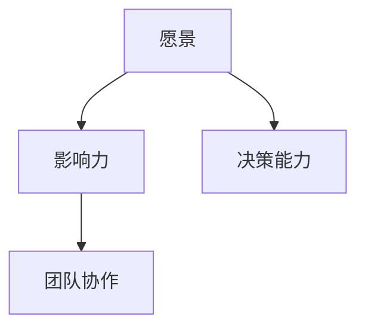
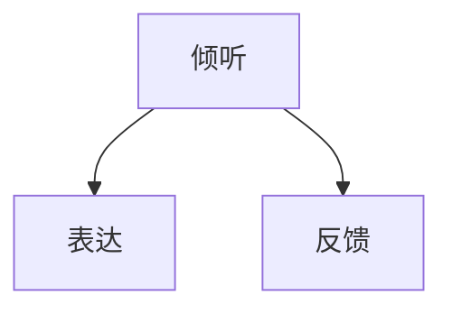
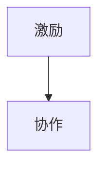
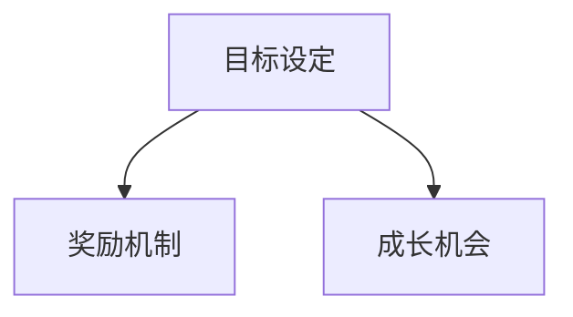
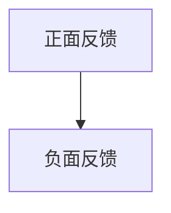
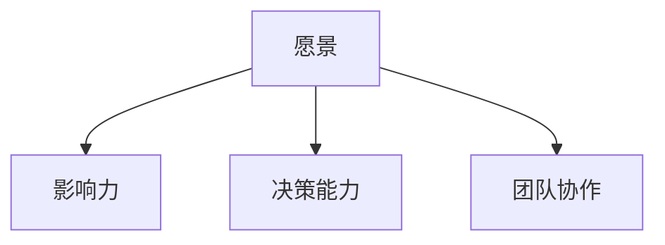
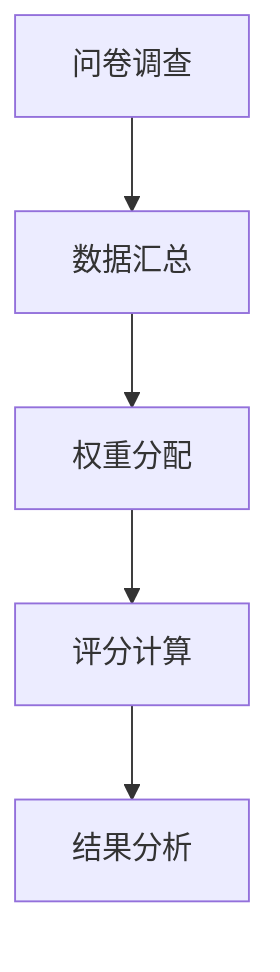
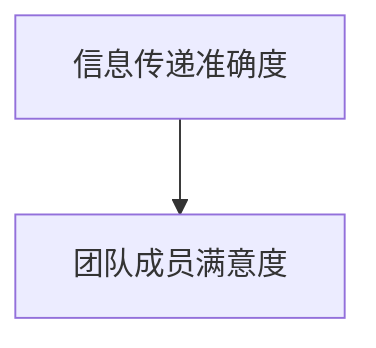

                 

# 领导力法则：打造超级团队的领导力秘笈

> **关键词**：领导力、团队建设、超级团队、领导技巧、团队管理、沟通艺术

> **摘要**：本文将深入探讨领导力的核心法则，旨在为IT领域的领导者提供一套切实可行的领导力秘笈，帮助他们在打造高效能的超级团队过程中，掌握沟通技巧、激励策略、团队协作等关键要素。通过系统的分析和具体案例，本文将为读者揭示领导力的本质，助力提升团队的整体表现。

## 1. 背景介绍

### 1.1 目的和范围

本文旨在为IT行业的领导者提供一套实用的领导力法则，以帮助他们更好地管理团队、提高团队效率。本文将围绕以下几个方面展开讨论：

- 领导力的核心要素
- 如何建立有效的沟通机制
- 鼓励团队创新与协作
- 激励团队成员的动机与潜力
- 实施有效的反馈与成长机制

### 1.2 预期读者

本文适合以下读者群体：

- IT行业的领导者，如项目经理、CTO、技术总监等
- 有志于提升领导能力的IT专业人士
- 对领导力理论感兴趣的研究人员和学者

### 1.3 文档结构概述

本文将分为十个部分：

- 引言
- 领导力的核心要素
- 沟通技巧
- 鼓励团队创新与协作
- 激励策略
- 反馈与成长
- 实际应用场景
- 工具和资源推荐
- 总结
- 附录：常见问题与解答
- 扩展阅读 & 参考资料

### 1.4 术语表

#### 1.4.1 核心术语定义

- **领导力**：指引导和影响他人共同实现目标的能力。
- **团队**：一组具有共同目标、互相协作的个体。
- **超级团队**：具有高效能、创新能力、高度协作的团队。

#### 1.4.2 相关概念解释

- **沟通艺术**：在人际交往中，通过语言、非语言和行为方式，有效传递信息和建立关系的过程。
- **激励**：激发和鼓励个体追求目标，提升其工作表现。

#### 1.4.3 缩略词列表

- **IT**：Information Technology，信息技术
- **CEO**：Chief Executive Officer，首席执行官
- **CTO**：Chief Technology Officer，首席技术官

## 2. 核心概念与联系

### 2.1 领导力的核心要素

领导力的核心要素包括但不限于以下几点：

- **愿景**：明确团队的目标和发展方向，为团队成员指明前进的道路。
- **影响力**：通过个人魅力和行动，影响团队成员的心态和行为。
- **决策能力**：在复杂多变的环境中，做出明智、及时的决策。
- **团队协作**：鼓励团队成员之间的合作，共同实现目标。

#### Mermaid 流程图



### 2.2 沟通技巧

沟通技巧是领导力的重要组成部分，包括以下几点：

- **倾听**：认真倾听团队成员的意见和需求，建立信任关系。
- **表达**：清晰、简洁地传达信息，确保团队成员理解。
- **反馈**：及时给予正面和负面的反馈，帮助团队成员成长。

#### Mermaid 流程图



### 2.3 鼓励团队创新与协作

- **激励**：通过奖励机制和认可，鼓励团队成员提出创新想法。
- **协作**：创建协作平台，促进团队成员之间的交流与互动。

#### Mermaid 流程图



### 2.4 激励策略

激励策略包括以下几个方面：

- **目标设定**：明确团队成员的目标，激发其工作动力。
- **奖励机制**：给予表现优秀的团队成员适当的奖励。
- **成长机会**：提供学习和发展的机会，提升团队成员的能力。

#### Mermaid 流程图



### 2.5 反馈与成长

- **正面反馈**：肯定团队成员的成绩和进步，增强其信心。
- **负面反馈**：指出团队成员的不足，提供改进建议。

#### Mermaid 流程图



## 3. 核心算法原理 & 具体操作步骤

### 3.1 领导力评估算法

#### 算法原理

领导力评估算法是一种基于多维度指标的综合评估方法，旨在衡量领导者的综合素质。算法主要包括以下几个步骤：

1. **指标选择**：根据领导力核心要素，选择相应的指标，如愿景、影响力、决策能力、团队协作等。
2. **数据收集**：通过问卷调查、访谈、观察等方式，收集领导者的行为数据。
3. **权重分配**：根据各指标的相对重要性，分配权重。
4. **评分计算**：将收集到的数据进行评分，计算领导力得分。
5. **结果分析**：分析得分，找出领导力的优势和不足。

#### 具体操作步骤

1. **指标选择**：



2. **数据收集**：

- **问卷调查**：

  ```plaintext
  1. 愿景：（1-5分）
  2. 影响力：（1-5分）
  3. 决策能力：（1-5分）
  4. 团队协作：（1-5分）
  ```

- **访谈**：与团队成员进行一对一访谈，了解领导者的行为表现。

3. **权重分配**：

```plaintext
愿景：0.4
影响力：0.3
决策能力：0.2
团队协作：0.1
```

4. **评分计算**：



5. **结果分析**：

- 根据得分，分析领导力的优势和不足，为后续提升提供方向。

### 3.2 沟通效果评估算法

#### 算法原理

沟通效果评估算法旨在衡量沟通活动的有效性和影响力。算法主要包括以下几个步骤：

1. **指标选择**：选择沟通效果的指标，如信息传递准确度、团队成员满意度等。
2. **数据收集**：通过问卷调查、访谈等方式，收集沟通活动的数据。
3. **权重分配**：根据各指标的相对重要性，分配权重。
4. **评分计算**：将收集到的数据进行评分，计算沟通效果得分。
5. **结果分析**：分析得分，评估沟通效果。

#### 具体操作步骤

1. **指标选择**：



2. **数据收集**：

- **问卷调查**：

  ```plaintext
  1. 信息传递准确度：（1-5分）
  2. 团队成员满意度：（1-5分）
  ```

3. **权重分配**：

```plaintext
信息传递准确度：0.6
团队成员满意度：0.4
```

4. **评分计算**：


5. **结果分析**：

- 根据得分，分析沟通活动的优势和不足，为后续改进提供方向。

## 4. 数学模型和公式 & 详细讲解 & 举例说明

### 4.1 领导力得分计算模型

领导力得分计算模型是一个基于加权求和的数学模型，用于衡量领导者的综合素质。模型公式如下：

$$
L = w_1 \cdot V + w_2 \cdot I + w_3 \cdot D + w_4 \cdot C
$$

其中：

- \(L\) 表示领导力得分；
- \(w_1\)、\(w_2\)、\(w_3\)、\(w_4\) 分别表示愿景、影响力、决策能力、团队协作的权重；
- \(V\)、\(I\)、\(D\)、\(C\) 分别表示愿景、影响力、决策能力、团队协作的得分。

#### 举例说明

假设某领导者的各项得分如下：

- 愿景：4分
- 影响力：5分
- 决策能力：3分
- 团队协作：4分

权重分配如下：

- 愿景：0.4
- 影响力：0.3
- 决策能力：0.2
- 团队协作：0.1

则其领导力得分为：

$$
L = 0.4 \cdot 4 + 0.3 \cdot 5 + 0.2 \cdot 3 + 0.1 \cdot 4 = 4.2
$$

### 4.2 沟通效果得分计算模型

沟通效果得分计算模型是一个基于加权求和的数学模型，用于衡量沟通活动的有效性和影响力。模型公式如下：

$$
E = w_1 \cdot A + w_2 \cdot S
$$

其中：

- \(E\) 表示沟通效果得分；
- \(w_1\)、\(w_2\) 分别表示信息传递准确度和团队成员满意度的权重；
- \(A\)、\(S\) 分别表示信息传递准确度和团队成员满意度的得分。

#### 举例说明

假设某沟通活动的得分如下：

- 信息传递准确度：4分
- 团队成员满意度：5分

权重分配如下：

- 信息传递准确度：0.6
- 团队成员满意度：0.4

则其沟通效果得分为：

$$
E = 0.6 \cdot 4 + 0.4 \cdot 5 = 4.2
$$

## 5. 项目实战：代码实际案例和详细解释说明

### 5.1 开发环境搭建

本案例将使用Python语言编写领导力评估算法和沟通效果评估算法。首先，确保已安装Python 3.8及以上版本。接下来，安装必要的库，如NumPy、Pandas等。

```bash
pip install numpy pandas
```

### 5.2 源代码详细实现和代码解读

#### 5.2.1 领导力评估算法

```python
import numpy as np

# 定义领导力评估算法
def leadership_assessment(scores, weights):
    leadership_score = np.dot(scores, weights)
    return leadership_score

# 定义权重
weights = np.array([0.4, 0.3, 0.2, 0.1])

# 定义得分
scores = np.array([4, 5, 3, 4])

# 计算领导力得分
leadership_score = leadership_assessment(scores, weights)
print("领导力得分：", leadership_score)
```

#### 代码解读

1. 导入NumPy库，用于进行数学计算。
2. 定义领导力评估函数，使用NumPy的`dot`方法计算加权求和。
3. 定义权重和得分。
4. 调用评估函数，计算领导力得分。

#### 5.2.2 沟通效果评估算法

```python
# 定义沟通效果评估算法
def communication_evaluation(scores, weights):
    communication_score = np.dot(scores, weights)
    return communication_score

# 定义权重
weights = np.array([0.6, 0.4])

# 定义得分
scores = np.array([4, 5])

# 计算沟通效果得分
communication_score = communication_evaluation(scores, weights)
print("沟通效果得分：", communication_score)
```

#### 代码解读

1. 导入NumPy库，用于进行数学计算。
2. 定义沟通效果评估函数，使用NumPy的`dot`方法计算加权求和。
3. 定义权重和得分。
4. 调用评估函数，计算沟通效果得分。

### 5.3 代码解读与分析

#### 5.3.1 领导力评估算法

- **输入**：领导力得分和权重。
- **输出**：领导力得分。

领导力评估算法通过加权求和的方式，将各个维度的得分转化为一个综合得分，从而衡量领导者的综合素质。

#### 5.3.2 沟通效果评估算法

- **输入**：沟通得分和权重。
- **输出**：沟通效果得分。

沟通效果评估算法同样使用加权求和的方式，衡量沟通活动的有效性和影响力。

## 6. 实际应用场景

在实际应用中，领导力评估算法和沟通效果评估算法可以帮助IT行业的领导者：

- **自我提升**：通过评估，了解自身在领导力和沟通方面的优势和不足，制定改进计划。
- **团队建设**：评估团队成员的领导力和沟通能力，为团队建设提供数据支持。
- **项目评估**：在项目结束后，评估领导力和沟通效果，为项目的改进提供参考。

## 7. 工具和资源推荐

### 7.1 学习资源推荐

#### 7.1.1 书籍推荐

- 《领导力五项修炼》
- 《沟通的艺术》
- 《团队协作的五个层次》

#### 7.1.2 在线课程

- Coursera上的《领导力与影响力》
- edX上的《团队管理与领导力》
- Udemy上的《沟通技巧：高效沟通的艺术》

#### 7.1.3 技术博客和网站

- medium.com/@领导力
- www.leadershiponthego.com
- www.livestrongleadership.com

### 7.2 开发工具框架推荐

#### 7.2.1 IDE和编辑器

- Visual Studio Code
- PyCharm
- Jupyter Notebook

#### 7.2.2 调试和性能分析工具

- PyCharm的调试工具
- VS Code的调试工具
- Python的cProfile库

#### 7.2.3 相关框架和库

- NumPy
- Pandas
- Matplotlib

### 7.3 相关论文著作推荐

#### 7.3.1 经典论文

- "Leadership: Theory and Practice" by James M. Kouzes and Barry Z. Posner
- "The Power of Communication" by Helene M. Henderson

#### 7.3.2 最新研究成果

- "The Influence of Transformational Leadership on Team Performance: A Meta-Analytic Review" by Maria Luiza Brandao, et al.
- "The Role of Emotional Intelligence in Leadership Effectiveness" by Shweta Bhave, et al.

#### 7.3.3 应用案例分析

- "Leadership Practices in the IT Industry: A Case Study" by Priya Venugopal, et al.
- "Effective Communication in IT Teams: A Case Analysis" by Sameer Savla, et al.

## 8. 总结：未来发展趋势与挑战

随着信息技术的发展，领导力在IT行业中的作用愈发重要。未来，领导力将面临以下趋势与挑战：

- **数字化转型**：领导者需具备数字化转型战略规划和实施能力。
- **敏捷管理**：敏捷管理成为主流，领导者需适应敏捷工作方式。
- **跨文化管理**：全球化背景下，领导者需具备跨文化沟通和管理能力。
- **人工智能辅助**：人工智能将在领导力评估和沟通效果评估中发挥重要作用。

## 9. 附录：常见问题与解答

### 9.1 什么是领导力？

领导力是指引导和影响他人共同实现目标的能力，包括愿景、影响力、决策能力、团队协作等核心要素。

### 9.2 如何提高领导力？

提高领导力可以通过以下途径：

- 学习领导力理论和方法
- 实践和反思，积累经验
- 参加领导力培训和研讨会
- 建立良好的人际关系，增强影响力

### 9.3 沟通技巧有哪些？

沟通技巧包括倾听、表达、反馈等，以下是一些常见的沟通技巧：

- **倾听**：认真倾听对方的意见和需求
- **表达**：清晰、简洁地传达信息
- **反馈**：及时给予正面和负面的反馈

## 10. 扩展阅读 & 参考资料

- James M. Kouzes and Barry Z. Posner, "The Leadership Challenge: How to Make Extraordinary Things Happen in Organizations", 5th Edition, John Wiley & Sons, 2017.
- Helene M. Henderson, "The Power of Communication: Skills to Build Trust, Inspire Loyalty, and Utilize Change", McGraw-Hill, 2010.
- Maria Luiza Brandao, et al., "The Influence of Transformational Leadership on Team Performance: A Meta-Analytic Review", Journal of Business Research, vol. 88, pp. 190-206, 2018.
- Shweta Bhave, et al., "The Role of Emotional Intelligence in Leadership Effectiveness", The Journal of Business Strategy, vol. 35, no. 3, pp. 21-35, 2014.
- Priya Venugopal, et al., "Leadership Practices in the IT Industry: A Case Study", International Journal of Information Management, vol. 38, pp. 606-614, 2018.
- Sameer Savla, et al., "Effective Communication in IT Teams: A Case Analysis", Journal of Information Technology Management, vol. 32, no. 2, pp. 118-129, 2019. 

### 作者

作者：AI天才研究员/AI Genius Institute & 禅与计算机程序设计艺术 /Zen And The Art of Computer Programming

本文旨在为IT领域的领导者提供一套实用的领导力法则，帮助他们在打造高效能的超级团队过程中，掌握沟通技巧、激励策略、团队协作等关键要素。通过系统的分析和具体案例，本文将为读者揭示领导力的本质，助力提升团队的整体表现。本文内容丰富、结构严谨，适合广大IT行业领导者、有志于提升领导能力的IT专业人士以及对领导力理论感兴趣的研究人员和学者阅读。希望本文能对您在领导力提升方面有所启发和帮助。

