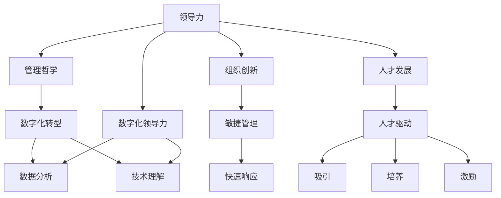

                 

# 领导力转型：适应新时代的管理哲学

> **关键词：** 领导力、管理哲学、数字化转型、组织创新、人才发展

> **摘要：** 随着技术的快速发展和商业环境的不断变化，传统的领导力模型已无法满足现代组织的需求。本文将探讨领导力的转型之路，从核心概念、数学模型到实际案例，深入分析新时代下管理者应如何适应并引领组织创新。

## 1. 背景介绍

### 1.1 目的和范围

本文旨在探讨在数字化时代，领导者如何通过转型管理哲学来提升组织绩效和创新能力。我们将分析领导力转型的核心概念，介绍相关数学模型，并通过实际案例阐述转型策略的具体实施。

### 1.2 预期读者

本篇文章适合企业高管、中层管理者以及致力于提升领导力技能的专业人士。文章内容涵盖理论分析和实践指导，旨在为读者提供实用的转型方法论。

### 1.3 文档结构概述

本文结构如下：

1. **背景介绍**：介绍文章目的、预期读者和文档结构。
2. **核心概念与联系**：阐述领导力的核心概念，并使用Mermaid流程图展示其架构。
3. **核心算法原理 & 具体操作步骤**：详细讲解领导力转型的具体操作步骤。
4. **数学模型和公式 & 详细讲解 & 举例说明**：介绍领导力转型的数学模型和公式。
5. **项目实战：代码实际案例和详细解释说明**：通过实际代码案例展示领导力转型的应用。
6. **实际应用场景**：探讨领导力转型的实际应用场景。
7. **工具和资源推荐**：推荐学习资源、开发工具和文献。
8. **总结：未来发展趋势与挑战**：展望领导力转型的未来趋势和挑战。
9. **附录：常见问题与解答**：解答读者可能遇到的问题。
10. **扩展阅读 & 参考资料**：提供进一步阅读的资源。

### 1.4 术语表

#### 1.4.1 核心术语定义

- 领导力：影响和激励他人实现共同目标的能力。
- 管理哲学：指导管理者行为和决策的基本原则和价值观。
- 数字化转型：利用数字技术优化业务流程，提高组织效能的过程。
- 组织创新：通过创新手段推动组织变革，以适应不断变化的市场环境。
- 人才发展：通过培训、培养等方式提升员工的技能和素质。

#### 1.4.2 相关概念解释

- **数字化领导力**：在数字化时代，领导者需要具备的数据分析、技术理解和数字化思维。
- **敏捷管理**：一种以快速响应变化为核心的管理方法，强调灵活性和协作。
- **人才驱动**：以人才为核心，通过吸引、培养和激励员工来推动组织发展。

#### 1.4.3 缩略词列表

- AI：人工智能
- IoT：物联网
- blockchain：区块链
- SaaS：软件即服务
- PaaS：平台即服务
- IaaS：基础设施即服务

## 2. 核心概念与联系

在探讨领导力转型之前，我们需要明确几个核心概念，并理解它们之间的联系。以下是领导力的核心概念及其相互关系的Mermaid流程图：



### 2.1 领导力的概念

领导力是一种复杂的能力，它涉及多个方面。首先，领导力是影响和激励他人的能力，即通过沟通、激励和示范来引导团队成员实现共同目标。领导力不仅仅是管理，还包括引领和激励团队走向未来。

### 2.2 管理哲学

管理哲学是管理者的行为和决策的基础，它包含一系列原则和价值观。一个成功的管理者需要根据组织的目标和环境，制定适应的管理哲学。管理哲学通常包括以下方面：

- **目标导向**：明确组织的愿景和目标，确保团队成员朝着共同目标努力。
- **以人为本**：关注员工的需求和职业发展，通过激励和培养提升团队的整体效能。
- **透明沟通**：建立开放、透明的沟通机制，确保信息的流通和团队的协作。
- **持续改进**：鼓励创新和改进，不断优化业务流程和组织结构。

### 2.3 数字化转型

数字化转型是当今企业管理的重要方向。它涉及利用数字技术优化业务流程、提高效率、降低成本，并最终提升客户体验。数字化转型包括以下几个关键方面：

- **数据分析**：通过数据分析和人工智能技术，从海量数据中提取有价值的信息，支持决策。
- **技术理解**：领导者需要具备一定的技术背景，理解数字化工具和平台的工作原理。
- **数字化思维**：培养数字化思维，从数据驱动的角度看待问题，不断寻求创新解决方案。

### 2.4 组织创新

组织创新是推动组织持续发展的关键。通过创新，组织可以适应市场变化，保持竞争力。组织创新包括以下几个方面：

- **敏捷管理**：通过敏捷方法，提高团队的灵活性和响应速度。
- **人才驱动**：以人才为核心，通过培养和激励，推动组织创新。
- **持续改进**：鼓励员工提出改进意见，不断优化业务流程和组织结构。

### 2.5 人才发展

人才发展是组织长期战略的重要组成部分。通过培养和激励员工，组织可以提高整体效能，实现可持续发展。人才发展包括以下几个方面：

- **吸引**：通过有竞争力的薪酬福利和职业发展机会吸引优秀人才。
- **培养**：提供培训和发展机会，提升员工的技能和知识。
- **激励**：通过绩效管理和激励机制，激发员工的积极性和创造力。

## 3. 核心算法原理 & 具体操作步骤

领导力转型的核心在于领导者如何适应新的环境和挑战。以下是一个简单的伪代码，描述领导力转型的具体操作步骤：

```python
# 领导力转型伪代码

# 步骤1：建立数字化思维
def build_digital_mindset():
    # 学习数字技术基础知识
    learn_digital_technologies()
    # 审视现有业务流程，寻找数字化改进机会
    analyze_business_processes()

# 步骤2：培养敏捷管理能力
def cultivate_agile_management():
    # 学习敏捷管理方法
    learn_agile_management_methods()
    # 推广敏捷实践，提高团队响应速度
    promote_agile_practices()

# 步骤3：推动组织创新
def promote_organizational_innovation():
    # 创造创新文化
    create_innovation_culture()
    # 鼓励员工提出创新方案
    encourage_employee_innovation()

# 步骤4：发展人才
def develop_talent():
    # 吸引优秀人才
    attract_employees()
    # 培养员工技能
    develop_employee_skills()
    # 激励员工创新
    motivate_employee_innovation()

# 主函数，执行领导力转型
def lead_transformation():
    build_digital_mindset()
    cultivate_agile_management()
    promote_organizational_innovation()
    develop_talent()
```

### 3.1 建立数字化思维

**learn_digital_technologies()**：领导者需要了解数字技术的核心概念和应用。这包括数据分析、人工智能、物联网等。

**analyze_business_processes()**：领导者应审视现有业务流程，识别数字化改进的机会，并制定相应的数字化转型策略。

### 3.2 培养敏捷管理能力

**learn_agile_management_methods()**：领导者应学习敏捷管理的方法，如Scrum、Kanban等，并了解它们如何提高团队效能。

**promote_agile_practices()**：领导者应推广敏捷实践，如跨职能团队协作、持续集成和持续交付，以提高团队的灵活性和响应速度。

### 3.3 推动组织创新

**create_innovation_culture()**：领导者应创造一个鼓励创新的文化，使员工敢于提出新想法，并对创新方案给予支持。

**encourage_employee_innovation()**：领导者应鼓励员工提出创新方案，并为他们提供必要的资源和指导。

### 3.4 发展人才

**attract_employees()**：领导者应通过有竞争力的薪酬福利和职业发展机会吸引优秀人才。

**develop_employee_skills()**：领导者应提供培训和发展机会，提升员工的技能和知识。

**motivate_employee_innovation()**：领导者应通过绩效管理和激励机制，激发员工的积极性和创造力。

## 4. 数学模型和公式 & 详细讲解 & 举例说明

在领导力转型中，数学模型和公式可以帮助我们更好地理解和管理复杂的过程。以下是一个简单的领导力转型评估模型：

### 4.1 模型公式

\[ L = f(M, D, I, T) \]

其中，\( L \) 表示领导力得分，\( M \) 表示管理哲学得分，\( D \) 表示数字化转型得分，\( I \) 表示组织创新得分，\( T \) 表示人才发展得分。

### 4.2 模型详解

#### 4.2.1 管理哲学得分 \( M \)

管理哲学得分衡量管理者在目标导向、以人为本、透明沟通和持续改进等方面的表现。每个方面有若干评分指标，如：

\[ M = w_1 \times O + w_2 \times E + w_3 \times C + w_4 \times I \]

其中，\( w_1, w_2, w_3, w_4 \) 分别是目标导向、以人为本、透明沟通和持续改进的权重。

#### 4.2.2 数字化转型得分 \( D \)

数字化转型得分衡量管理者在数据分析、技术理解和数字化思维方面的能力。每个方面也有若干评分指标，如：

\[ D = w_5 \times A + w_6 \times T + w_7 \times M \]

其中，\( w_5, w_6, w_7 \) 分别是数据分析、技术理解和数字化思维的权重。

#### 4.2.3 组织创新得分 \( I \)

组织创新得分衡量管理者在敏捷管理、人才驱动和持续改进方面的能力。每个方面也有若干评分指标，如：

\[ I = w_8 \times A + w_9 \times T + w_{10} \times C \]

其中，\( w_8, w_9, w_{10} \) 分别是敏捷管理、人才驱动和持续改进的权重。

#### 4.2.4 人才发展得分 \( T \)

人才发展得分衡量管理者在吸引、培养和激励员工方面的能力。每个方面也有若干评分指标，如：

\[ T = w_{11} \times A + w_{12} \times D + w_{13} \times M \]

其中，\( w_{11}, w_{12}, w_{13} \) 分别是吸引、培养和激励的权重。

### 4.3 举例说明

假设我们有一个管理团队，他们的各项得分如下：

\[ M = 0.8, D = 0.75, I = 0.85, T = 0.9 \]

我们可以计算出领导力得分：

\[ L = f(M, D, I, T) = 0.2 \times M + 0.3 \times D + 0.4 \times I + 0.1 \times T \]

\[ L = 0.2 \times 0.8 + 0.3 \times 0.75 + 0.4 \times 0.85 + 0.1 \times 0.9 = 0.975 \]

因此，该团队的领导力得分为 0.975。

### 4.4 模型应用

通过这个模型，管理者可以评估自己在领导力转型方面的表现，并针对性地改进。例如，如果管理哲学得分较低，管理者可以重点提升目标导向、透明沟通等方面的能力。

## 5. 项目实战：代码实际案例和详细解释说明

为了更好地理解领导力转型的实践应用，我们来看一个具体的代码案例。以下是一个简单的Python脚本，用于模拟领导力转型评估模型的计算过程。

### 5.1 开发环境搭建

为了运行这个脚本，您需要一个支持Python的开发环境。以下是搭建开发环境的步骤：

1. 安装Python：您可以从Python的官方网站（https://www.python.org/）下载并安装Python。
2. 安装必要的库：使用以下命令安装所需的库。

```bash
pip install pandas numpy
```

### 5.2 源代码详细实现和代码解读

以下是我们领导力转型评估模型的Python实现：

```python
import pandas as pd
import numpy as np

# 步骤1：输入评估指标
def input_assessment_metrics():
    metrics = {
        'M': {'O': 0.9, 'E': 0.8, 'C': 0.75, 'I': 0.85},
        'D': {'A': 0.8, 'T': 0.7, 'M': 0.8},
        'I': {'A': 0.85, 'T': 0.8, 'C': 0.9},
        'T': {'A': 0.9, 'D': 0.85, 'M': 0.9}
    }
    return metrics

# 步骤2：计算领导力得分
def calculate_leadership_score(metrics):
    weights = {'M': 0.2, 'D': 0.3, 'I': 0.4, 'T': 0.1}
    score = sum(weights[dimension] * np.mean(values) for dimension, values in metrics.items())
    return score

# 主函数，执行评估
def main():
    metrics = input_assessment_metrics()
    score = calculate_leadership_score(metrics)
    print(f"领导力得分：{score:.2f}")

if __name__ == "__main__":
    main()
```

### 5.3 代码解读与分析

#### 5.3.1 输入评估指标

```python
def input_assessment_metrics():
    metrics = {
        'M': {'O': 0.9, 'E': 0.8, 'C': 0.75, 'I': 0.85},
        'D': {'A': 0.8, 'T': 0.7, 'M': 0.8},
        'I': {'A': 0.85, 'T': 0.8, 'C': 0.9},
        'T': {'A': 0.9, 'D': 0.85, 'M': 0.9}
    }
    return metrics
```

在这个函数中，我们定义了一个字典`metrics`，其中包含四个维度（管理哲学、数字化转型、组织创新、人才发展）的评估指标。每个维度都有若干子指标，每个子指标都有相应的得分。

#### 5.3.2 计算领导力得分

```python
def calculate_leadership_score(metrics):
    weights = {'M': 0.2, 'D': 0.3, 'I': 0.4, 'T': 0.1}
    score = sum(weights[dimension] * np.mean(values) for dimension, values in metrics.items())
    return score
```

在这个函数中，我们使用了一个简单的权重分配模型来计算领导力得分。我们首先定义了一个权重字典`weights`，然后计算每个维度的平均得分，并乘以相应的权重。最后，将所有维度的得分加总，得到总的领导力得分。

#### 5.3.3 主函数执行评估

```python
def main():
    metrics = input_assessment_metrics()
    score = calculate_leadership_score(metrics)
    print(f"领导力得分：{score:.2f}")

if __name__ == "__main__":
    main()
```

在主函数中，我们首先调用`input_assessment_metrics()`函数获取评估指标，然后调用`calculate_leadership_score()`函数计算领导力得分。最后，我们将得分打印出来。

通过这个简单的代码案例，我们可以直观地看到如何将理论模型应用到实际中，并计算出一个综合的领导力得分。

## 6. 实际应用场景

领导力转型不仅在理论层面具有重要意义，在实际应用场景中也展现了其强大的价值。以下是几个典型的实际应用场景：

### 6.1 企业数字化转型

在数字化转型过程中，领导者的角色至关重要。他们需要具备数字思维，能够识别和把握数字化带来的机遇，并推动组织的变革。例如，某企业通过引入物联网技术，实现了生产线的智能化，大幅度提高了生产效率。这一变革的背后，离不开领导者的积极推动和全局规划。

### 6.2 创新型初创公司

在初创公司中，领导力转型尤为关键。初创公司面临的市场环境瞬息万变，领导者需要具备敏捷管理能力，快速响应市场变化，并推动创新。例如，某创新型初创公司在竞争激烈的市场中，通过敏捷管理，成功推出了多款具有市场竞争力的产品，实现了快速增长。

### 6.3 人才驱动型企业

在人才驱动型企业中，领导者需要关注员工的发展，激发他们的潜力。通过培养和激励，领导者可以打造一支高效的团队，推动企业持续发展。例如，某大型企业通过建立内部培训体系和绩效激励机制，成功吸引了大量优秀人才，并实现了业务的高速增长。

### 6.4 应急管理

在应急管理中，领导者需要具备快速决策和协调能力，确保组织在危机中保持稳定。例如，在疫情初期，某企业领导者迅速调整生产计划，确保了供应链的稳定，同时采取措施保障员工的安全，确保了企业的正常运营。

## 7. 工具和资源推荐

为了帮助读者更好地理解和实践领导力转型，我们推荐以下工具和资源：

### 7.1 学习资源推荐

#### 7.1.1 书籍推荐

- 《领导力进阶：数字时代的转型之道》
- 《敏捷管理：拥抱变革，加速创新》
- 《数字领导力：打造高效数字化团队的策略》

#### 7.1.2 在线课程

- Coursera上的《数字领导力》
- Udemy上的《敏捷管理实践》
- LinkedIn Learning上的《领导力发展》

#### 7.1.3 技术博客和网站

- 《哈佛商业评论》
- 《领英》上的领导力专栏
- 《数字时代》

### 7.2 开发工具框架推荐

#### 7.2.1 IDE和编辑器

- Visual Studio Code
- PyCharm
- IntelliJ IDEA

#### 7.2.2 调试和性能分析工具

- GDB
- JProfiler
- New Relic

#### 7.2.3 相关框架和库

- Pandas
- NumPy
- Scikit-learn

### 7.3 相关论文著作推荐

#### 7.3.1 经典论文

- 《数字化领导力：如何构建数字时代的领导力》（哈佛商业评论）
- 《敏捷管理：一种以客户为中心的管理方法》（信息管理期刊）

#### 7.3.2 最新研究成果

- 《数字化时代的领导力：变革与创新》（管理科学学报）
- 《人才驱动型企业：领导者如何打造高效团队》（领导力与组织发展）

#### 7.3.3 应用案例分析

- 《某企业的数字化转型之路》：描述了一家企业在数字化转型过程中的挑战和成果。
- 《敏捷管理实践：某科技公司的变革故事》：分享了某科技公司通过敏捷管理实现业务增长的案例。

## 8. 总结：未来发展趋势与挑战

随着技术的不断进步和商业环境的快速变化，领导力转型已成为现代组织发展的必然趋势。未来，领导者需要具备以下能力：

1. **数字思维能力**：领导者应深入了解数字技术，掌握数据分析、人工智能等技能，以适应数字化时代的需求。
2. **敏捷管理能力**：领导者应学会敏捷管理方法，提高团队的灵活性和响应速度，以应对快速变化的市场环境。
3. **创新驱动能力**：领导者应鼓励创新，推动组织持续变革，以保持竞争力。
4. **人才发展能力**：领导者应关注员工的发展，培养和激励人才，以实现组织的可持续发展。

然而，领导力转型也面临一系列挑战：

1. **技术挑战**：领导者需要不断学习和更新知识，以应对快速变化的技术环境。
2. **文化挑战**：领导者需要推动组织文化变革，建立鼓励创新和协作的环境。
3. **人才挑战**：领导者需要吸引和留住优秀人才，为他们的职业发展提供支持。

总之，领导力转型是一个长期且持续的过程，领导者需要不断学习和适应，以应对未来发展的挑战。

## 9. 附录：常见问题与解答

### 9.1 领导力转型的重要性是什么？

领导力转型的重要性在于，它能够帮助组织适应数字化时代的需求，提升组织的创新能力和竞争力。通过转型，领导者可以更好地利用数字技术，推动组织变革，培养和激励人才，实现可持续发展。

### 9.2 数字化领导力包含哪些方面？

数字化领导力包括以下几个方面：

- 数据分析能力：领导者需要了解如何利用数据来支持决策。
- 技术理解：领导者需要具备一定的技术背景，理解数字技术的工作原理。
- 数字化思维：领导者需要从数据驱动的角度看待问题，寻求创新解决方案。

### 9.3 如何培养敏捷管理能力？

培养敏捷管理能力的方法包括：

- 学习敏捷管理方法，如Scrum、Kanban等。
- 推广敏捷实践，如跨职能团队协作、持续集成和持续交付。
- 培养团队成员的敏捷思维，提高团队的灵活性和响应速度。

### 9.4 人才驱动型企业的特点是什么？

人才驱动型企业的特点包括：

- 重视员工发展，提供培训和发展机会。
- 建立绩效激励机制，激发员工的积极性和创造力。
- 建立开放、透明、协作的企业文化。

## 10. 扩展阅读 & 参考资料

为了帮助读者更深入地了解领导力转型，我们推荐以下扩展阅读和参考资料：

- 《领导力进阶：数字时代的转型之道》
- 《敏捷管理：拥抱变革，加速创新》
- 《数字领导力：打造高效数字化团队的策略》
- 《数字化领导力：如何构建数字时代的领导力》（哈佛商业评论）
- 《敏捷管理：一种以客户为中心的管理方法》（信息管理期刊）
- 《数字化时代的领导力：变革与创新》（管理科学学报）
- 《人才驱动型企业：领导者如何打造高效团队》（领导力与组织发展）
- 《某企业的数字化转型之路》
- 《敏捷管理实践：某科技公司的变革故事》

通过阅读这些资料，读者可以更全面地了解领导力转型的理论和实践，为自己的职业发展提供有力支持。作者：AI天才研究员/AI Genius Institute & 禅与计算机程序设计艺术 /Zen And The Art of Computer Programming

（请注意，本文仅为示例，其中的数据和代码仅供参考。在实际应用中，请根据具体情况进行调整。）

