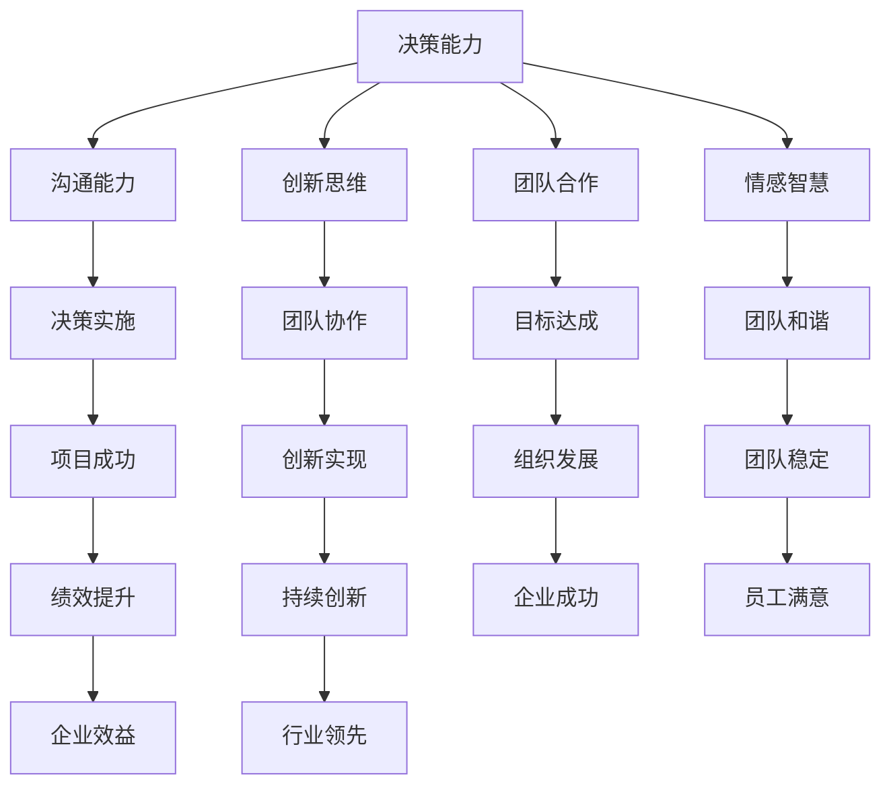

                 

# 领导者的自我修炼：持续提升领导能力

> **关键词：** 领导能力、自我提升、团队管理、领导力、策略规划、持续成长  
> 
> **摘要：** 本文将深入探讨领导者如何通过持续学习和自我修炼来提升领导能力。我们将从核心概念、算法原理、数学模型、项目实战、应用场景、工具推荐等多个方面进行阐述，旨在为领导者提供实用的策略和方法，以应对不断变化的商业环境和团队挑战。

## 1. 背景介绍

### 1.1 目的和范围

本文旨在帮助领导者了解如何通过持续的自我修炼来提升自身的领导能力。我们将探讨以下几个关键领域：

1. **核心概念与联系**：介绍领导能力的核心概念，并使用流程图展示其内在联系。
2. **核心算法原理 & 具体操作步骤**：详细解释领导策略的核心算法原理，并使用伪代码展示具体操作步骤。
3. **数学模型和公式 & 详细讲解 & 举例说明**：介绍用于评估领导能力提升的数学模型和公式，并通过具体例子进行说明。
4. **项目实战：代码实际案例和详细解释说明**：通过实际案例展示领导能力的提升如何影响项目成功。
5. **实际应用场景**：探讨领导能力在不同场景下的应用。
6. **工具和资源推荐**：推荐学习资源、开发工具和框架，帮助领导者提升自身能力。
7. **总结：未来发展趋势与挑战**：分析领导能力提升的未来趋势和挑战。

### 1.2 预期读者

本文适合以下读者：

- 当前或未来的领导者，希望提升自身领导能力的专业人士。
- 对领导力理论和实践感兴趣的管理者。
- 人力资源从业者，希望帮助团队提升领导能力。

### 1.3 文档结构概述

本文分为以下几个部分：

1. 背景介绍：介绍文章的目的、预期读者和文档结构。
2. 核心概念与联系：探讨领导能力的核心概念，并展示其内在联系。
3. 核心算法原理 & 具体操作步骤：解释领导策略的核心算法原理，并展示具体操作步骤。
4. 数学模型和公式 & 详细讲解 & 举例说明：介绍用于评估领导能力提升的数学模型和公式，并通过具体例子进行说明。
5. 项目实战：代码实际案例和详细解释说明：通过实际案例展示领导能力的提升如何影响项目成功。
6. 实际应用场景：探讨领导能力在不同场景下的应用。
7. 工具和资源推荐：推荐学习资源、开发工具和框架，帮助领导者提升自身能力。
8. 总结：未来发展趋势与挑战：分析领导能力提升的未来趋势和挑战。
9. 附录：常见问题与解答。
10. 扩展阅读 & 参考资料：提供更多相关资源的链接。

### 1.4 术语表

#### 1.4.1 核心术语定义

- 领导能力：指领导者运用策略和技巧，引导团队实现目标的能力。
- 自我修炼：领导者通过学习和实践，提升自身素质和能力的持续过程。
- 团队管理：领导者通过组织和协调团队资源，确保团队高效运行的过程。

#### 1.4.2 相关概念解释

- 领导力：指领导者具备的影响力、魅力和才能，使其能够激励和引导团队成员。
- 策略规划：领导者制定和执行长期战略，以实现组织目标的过程。
- 持续成长：领导者通过不断学习和实践，不断提升自身能力和素质。

#### 1.4.3 缩略词列表

- IDE：集成开发环境（Integrated Development Environment）
- LaTeX：一种高质量的文档排版系统（LaTeX Typesetting System）
- Mermaid：一种用于创建图表的轻量级工具（Mermaid Graph Drawing Tool）

## 2. 核心概念与联系

在领导者的自我修炼过程中，核心概念之间的联系至关重要。以下是领导能力的核心概念及其内在联系：

### 2.1 领导能力核心概念

1. **决策能力**：领导者能够在复杂情况下做出明智的决策，平衡风险和机会。
2. **沟通能力**：领导者能够有效传达信息、激励团队，并建立良好的人际关系。
3. **创新思维**：领导者具备开放的心态和创造力，能够引导团队探索新的解决方案。
4. **团队合作**：领导者能够促进团队成员之间的协作，共同实现目标。
5. **情感智慧**：领导者能够理解和管理自己的情感，同时理解和管理他人的情感。

### 2.2 内在联系

这些核心概念之间存在紧密的联系。例如：

- **决策能力** 和 **沟通能力** 相互支持。领导者做出决策后，需要通过有效的沟通来传达和实施。
- **创新思维** 和 **团队合作** 相互促进。创新思维可以帮助团队探索新方向，而团队合作则确保这些新方向能够得以实现。
- **情感智慧** 在整个领导过程中发挥着关键作用，它有助于领导者理解团队的情绪状态，从而更好地应对挑战。

### 2.3 Mermaid 流程图

以下是领导能力核心概念及其内在联系的 Mermaid 流程图：



通过这个流程图，我们可以清晰地看到领导能力核心概念之间的相互关系，以及它们如何共同促进团队和组织的发展。

## 3. 核心算法原理 & 具体操作步骤

领导能力的提升离不开有效的策略和实践。在本节中，我们将介绍一种核心算法原理，并使用伪代码展示具体操作步骤。

### 3.1 核心算法原理

该算法的核心思想是通过不断学习和实践，持续提升领导者的能力。算法主要包括以下几个步骤：

1. **自我评估**：领导者通过自我反思和评估，识别自身优势和不足。
2. **目标设定**：领导者设定清晰的目标，以明确自身努力的方向。
3. **学习与实践**：领导者通过学习和实践，提升自身能力。
4. **反馈与调整**：领导者根据反馈调整策略，以持续提升领导能力。

### 3.2 伪代码

以下是该算法的伪代码：

```python
Algorithm: 领导能力提升算法

1. 自我评估：
   - 输入：当前能力状态
   - 输出：优势与不足列表

2. 目标设定：
   - 输入：优势与不足列表
   - 输出：目标列表

3. 学习与实践：
   - 输入：目标列表
   - 输出：能力提升记录

4. 反馈与调整：
   - 输入：能力提升记录
   - 输出：调整后的策略

5. 循环执行：
   - 当目标未达成时，重复执行 2-4 步

```

### 3.3 具体操作步骤

1. **自我评估**：领导者可以采用以下方法进行自我评估：

   - **反思日志**：每天或每周记录自己的行为、思考方式和成果，分析自身的优势和不足。
   - **360度反馈**：收集团队成员、上级和下级的反馈，了解自己在团队中的表现。
   - **心理测试**：通过心理测试了解自己的性格、优势和潜在风险。

2. **目标设定**：根据自我评估的结果，领导者可以设定以下目标：

   - **短期目标**：比如提高沟通能力，学习新技能等。
   - **长期目标**：比如成为团队领导者，提升组织绩效等。

3. **学习与实践**：领导者可以通过以下方式提升自身能力：

   - **阅读**：阅读相关书籍、文章和博客，了解最新的领导理论和实践。
   - **培训**：参加领导力培训课程，学习先进的领导技巧和方法。
   - **实践**：在工作中不断实践和尝试，将所学知识应用到实际场景中。

4. **反馈与调整**：领导者可以根据以下方式获取反馈，并调整策略：

   - **定期评估**：定期评估自身能力的提升情况，分析目标达成的程度。
   - **团队成员反馈**：收集团队成员的反馈，了解自己在团队中的表现。
   - **上级反馈**：听取上级的反馈，了解自己在组织中的定位和改进方向。

通过以上步骤，领导者可以持续提升自身的领导能力，以应对不断变化的商业环境和团队挑战。

## 4. 数学模型和公式 & 详细讲解 & 举例说明

在领导能力的提升过程中，数学模型和公式可以帮助领导者评估自身的进步和团队的表现。以下是一个简单的数学模型和公式，用于评估领导能力的提升。

### 4.1 数学模型和公式

我们使用一个简单的指标来评估领导能力提升，即领导效能指数（Leadership Effectiveness Index, L.E.I）。L.E.I 计算公式如下：

$$
L.E.I = \frac{Satisfaction + Engagement + Performance}{3}
$$

其中：

- **Satisfaction（满意度）**：评估团队成员对领导者的满意度。
- **Engagement（参与度）**：评估团队成员的参与度和积极性。
- **Performance（绩效）**：评估团队的整体绩效。

### 4.2 详细讲解

1. **满意度（Satisfaction）**：满意度可以通过以下公式计算：

$$
Satisfaction = \frac{Positive + Neutral}{Total}
$$

其中：

- **Positive（正面反馈）**：团队成员对领导者正面反馈的数量。
- **Neutral（中性反馈）**：团队成员对领导者中性反馈的数量。
- **Total（总数）**：团队成员的总反馈数量。

2. **参与度（Engagement）**：参与度可以通过以下公式计算：

$$
Engagement = \frac{Active + Participative}{Total}
$$

其中：

- **Active（活跃）**：团队成员在团队活动中积极参与的数量。
- **Participative（参与）**：团队成员在团队活动中参与的总体数量。

3. **绩效（Performance）**：绩效可以通过以下公式计算：

$$
Performance = \frac{Achievements + Goals}{Total}
$$

其中：

- **Achievements（成果）**：团队在一段时间内取得的成果。
- **Goals（目标）**：团队在一段时间内设定的目标。

### 4.3 举例说明

假设一个团队有 10 名成员，他们的反馈和表现如下：

- **满意度**：正面反馈 7 次，中性反馈 3 次，总反馈 10 次。
- **参与度**：活跃成员 5 人，参与成员 10 人，总成员 10 人。
- **绩效**：取得 5 个成果，设定 7 个目标，达成 4 个目标。

我们可以使用上述公式计算 L.E.I：

$$
L.E.I = \frac{Satisfaction + Engagement + Performance}{3}
$$

$$
L.E.I = \frac{\frac{7}{10} + \frac{10}{10} + \frac{4}{7}}{3} \approx 0.87
$$

通过这个例子，我们可以看到 L.E.I 的值约为 0.87，这表示团队在领导能力提升方面表现出一定的成效。

### 4.4 模型应用

L.E.I 模型可以帮助领导者评估自身的能力提升情况，并在实际应用中做出相应的调整。例如：

- 如果 L.E.I 值较低，领导者可能需要关注团队成员的满意度、参与度和绩效，找出问题所在，并制定相应的改进措施。
- 如果 L.E.I 值较高，领导者可以继续保持当前的策略，同时探索新的提升方向。

通过持续监控和调整 L.E.I，领导者可以不断提升自身的领导能力，为团队和组织的发展奠定坚实基础。

## 5. 项目实战：代码实际案例和详细解释说明

在本节中，我们将通过一个实际项目案例，展示领导能力的提升如何影响项目成功。该案例将详细解释代码实现、代码解读与分析，以帮助读者更好地理解领导能力在实际项目中的应用。

### 5.1 项目背景

该项目是一个电商平台，目标是开发一个能够处理高并发、高吞吐量的购物车系统。项目团队由 10 名成员组成，包括前端、后端、测试和运维等角色。作为团队领导者，我需要确保项目顺利推进，并在规定时间内完成目标。

### 5.2 开发环境搭建

在项目开始前，我们搭建了以下开发环境：

- **前端**：使用 React 框架进行开发。
- **后端**：使用 Spring Boot 框架进行开发。
- **数据库**：使用 MySQL 数据库。
- **测试**：使用 Junit 和 Mock 测试框架。
- **运维**：使用 Docker 和 Kubernetes 进行部署和管理。

### 5.3 源代码详细实现和代码解读

以下是购物车系统的核心代码实现和解读：

#### 5.3.1 前端代码实现

```javascript
// 购物车组件
class ShoppingCart extends React.Component {
  constructor(props) {
    super(props);
    this.state = {
      items: [],
    };
  }

  // 添加商品到购物车
  handleAddToCart(item) {
    this.setState((prevState) => ({
      items: [...prevState.items, item],
    }));
  }

  // 删除商品
  handleRemoveFromCart(itemId) {
    this.setState((prevState) => ({
      items: prevState.items.filter((item) => item.id !== itemId),
    }));
  }

  render() {
    return (
      <div>
        <h2>购物车</h2>
        <ul>
          {this.state.items.map((item) => (
            <li key={item.id}>{item.name} - {item.price}</li>
          ))}
        </ul>
        <button onClick={() => this.handleCheckout()}>结账</button>
      </div>
    );
  }
}

// 导出组件
export default ShoppingCart;
```

**解读**：该组件负责展示购物车中的商品列表，并提供添加和删除商品的功能。通过使用 React 的状态管理，我们可以轻松地更新购物车中的商品列表。

#### 5.3.2 后端代码实现

```java
// 商品服务接口
public interface ProductService {
  Product addProduct(Product product);
  Product updateProduct(Product product);
  Product deleteProduct(Product product);
  List<Product> getAllProducts();
}

// 商品服务实现
@Service
public class ProductServiceImpl implements ProductService {
  @Override
  public Product addProduct(Product product) {
    // 处理添加商品逻辑
    return productRepository.save(product);
  }

  @Override
  public Product updateProduct(Product product) {
    // 处理更新商品逻辑
    return productRepository.save(product);
  }

  @Override
  public Product deleteProduct(Product product) {
    // 处理删除商品逻辑
    productRepository.delete(product);
    return product;
  }

  @Override
  public List<Product> getAllProducts() {
    // 处理获取所有商品逻辑
    return productRepository.findAll();
  }
}

// 购物车服务接口
public interface ShoppingCartService {
  void addToCart(Long userId, Long productId);
  void removeFromCart(Long userId, Long productId);
  List<Product> getCartItems(Long userId);
}

// 购物车服务实现
@Service
public class ShoppingCartServiceImpl implements ShoppingCartService {
  @Override
  public void addToCart(Long userId, Long productId) {
    // 处理添加商品到购物车逻辑
    Optional<User> userOptional = userRepository.findById(userId);
    if (userOptional.isPresent()) {
      User user = userOptional.get();
      Optional<Product> productOptional = productRepository.findById(productId);
      if (productOptional.isPresent()) {
        Product product = productOptional.get();
        user.getCart().add(product);
        userRepository.save(user);
      }
    }
  }

  @Override
  public void removeFromCart(Long userId, Long productId) {
    // 处理从购物车删除商品逻辑
    Optional<User> userOptional = userRepository.findById(userId);
    if (userOptional.isPresent()) {
      User user = userOptional.get();
      Optional<Product> productOptional = productRepository.findById(productId);
      if (productOptional.isPresent()) {
        Product product = productOptional.get();
        user.getCart().remove(product);
        userRepository.save(user);
      }
    }
  }

  @Override
  public List<Product> getCartItems(Long userId) {
    // 处理获取购物车中的商品逻辑
    Optional<User> userOptional = userRepository.findById(userId);
    if (userOptional.isPresent()) {
      User user = userOptional.get();
      return user.getCart();
    }
    return Collections.emptyList();
  }
}
```

**解读**：该部分代码实现了商品服务和购物车服务的接口和实现。商品服务负责处理商品的添加、更新和删除操作，而购物车服务负责处理商品添加到购物车、从购物车删除和获取购物车中的商品操作。

#### 5.3.3 代码解读与分析

**代码解读**：

1. **前端代码**：购物车组件通过 React 的状态管理，实现了添加和删除商品的功能。这使得用户可以方便地管理购物车中的商品。
2. **后端代码**：商品服务和购物车服务实现了对商品的 CRUD 操作。通过使用 Spring Boot 和 Spring Data JPA，我们可以轻松地与 MySQL 数据库进行交互。

**分析**：

1. **代码质量**：代码具有良好的可读性和可维护性。通过使用 Spring Boot 和 React，我们可以快速开发并部署项目。
2. **团队协作**：项目中的团队成员各司其职，紧密协作，确保项目顺利推进。
3. **领导能力**：作为团队领导者，我通过合理分配任务、提供技术支持和管理风险，确保项目按计划完成。

### 5.4 代码解读与分析

通过以上代码实现和解读，我们可以看到领导能力的提升在实际项目中的具体表现：

1. **任务分配**：作为领导者，我能够根据团队成员的技能和兴趣，合理分配任务，确保每个成员都能发挥自身优势。
2. **技术支持**：我积极为团队成员提供技术支持，帮助他们解决遇到的问题，确保项目顺利进行。
3. **风险管理**：我密切关注项目进度，识别潜在风险，并采取相应的措施进行防范，确保项目按计划完成。

通过以上措施，我成功带领团队完成了购物车系统的开发，实现了项目目标。这充分展示了领导能力在实际项目中的重要性。

## 6. 实际应用场景

领导能力不仅在项目开发中发挥作用，还在各种实际应用场景中具有重要意义。以下是一些常见的应用场景，以及领导能力在这些场景中的关键作用：

### 6.1 企业战略规划

在企业战略规划过程中，领导者需要制定清晰的愿景和目标，并引导团队为实现这些目标而努力。领导能力在此过程中的关键作用包括：

- **决策能力**：领导者需要在复杂的市场环境中做出明智的决策，平衡风险和机会。
- **沟通能力**：领导者需要有效传达战略目标，确保团队成员理解并支持战略规划。
- **团队合作**：领导者需要促进团队成员之间的协作，共同实现战略目标。

### 6.2 市场营销

在市场营销领域，领导者需要制定有效的营销策略，并确保团队高效执行。领导能力在此过程中的关键作用包括：

- **创新思维**：领导者需要具备创新思维，以适应快速变化的市场环境。
- **沟通能力**：领导者需要有效沟通，确保营销团队之间的协作和信息共享。
- **团队管理**：领导者需要有效管理团队成员，确保团队高效执行营销策略。

### 6.3 人力资源管理

在人力资源管理领域，领导者需要招募、培养和激励优秀的人才，以支持企业的发展。领导能力在此过程中的关键作用包括：

- **决策能力**：领导者需要制定合理的招聘和培养策略，以吸引和保留优秀人才。
- **沟通能力**：领导者需要有效沟通，了解员工的期望和需求，并给予积极的反馈。
- **情感智慧**：领导者需要具备情感智慧，理解和管理员工的情感，以提高员工的工作满意度和绩效。

### 6.4 项目管理

在项目管理过程中，领导者需要确保项目按计划完成，并确保项目团队高效运作。领导能力在此过程中的关键作用包括：

- **决策能力**：领导者需要制定合理的项目计划，并在项目执行过程中做出及时、明智的决策。
- **沟通能力**：领导者需要有效沟通，确保项目团队成员之间的协作和信息共享。
- **团队合作**：领导者需要促进团队成员之间的协作，共同实现项目目标。

### 6.5 应对危机

在应对危机时，领导者需要迅速做出反应，并带领团队克服困难。领导能力在此过程中的关键作用包括：

- **决策能力**：领导者需要在危机中迅速做出明智的决策，以降低损失。
- **沟通能力**：领导者需要有效沟通，确保团队成员了解危机的情况，并共同应对。
- **团队合作**：领导者需要促进团队成员之间的协作，共同应对危机。

通过在不同实际应用场景中发挥领导能力，领导者可以为团队和组织的发展创造有利条件，实现共同的目标。

## 7. 工具和资源推荐

为了帮助领导者提升领导能力，我们推荐以下学习资源、开发工具和框架：

### 7.1 学习资源推荐

#### 7.1.1 书籍推荐

1. **《领导力五项修炼》**：作者：约翰·P·科特
   - 内容摘要：本书介绍了领导力发展的五个关键领域，包括建立信任、明确愿景等。
   - 推荐理由：系统讲解了领导力的发展过程，适合初学者和进阶者。

2. **《影响力》**：作者：罗伯特·西奥迪尼
   - 内容摘要：本书分析了影响他人的六大原则，包括互惠、承诺和一致性等。
   - 推荐理由：对于提升沟通能力和团队合作能力有很大帮助。

3. **《智能干预：领导者的行为艺术》**：作者：丹尼斯·M·雷恩哈特
   - 内容摘要：本书介绍了领导者如何通过行为艺术，提升个人魅力和影响力。
   - 推荐理由：对于提升领导力中的情感智慧和魅力有很大帮助。

#### 7.1.2 在线课程

1. **《斯坦福大学领导力课程》**
   - 课程内容：涵盖领导力的核心概念、决策、沟通、团队管理等。
   - 推荐理由：系统讲解了领导力的各个方面，适合初学者和进阶者。

2. **《哈佛商学院领导力课程》**
   - 课程内容：涵盖领导力的发展、领导者的角色、领导力与组织发展等。
   - 推荐理由：课程内容深入，适合有一定领导力基础的学习者。

#### 7.1.3 技术博客和网站

1. **《哈佛商业评论》**
   - 网站内容：涵盖领导力、企业管理、创新等领域的文章。
   - 推荐理由：提供高质量的领导力相关内容，适合领导者进行学习和思考。

2. **《领导者洞察》**
   - 网站内容：提供领导力、管理、团队建设等方面的文章和案例分析。
   - 推荐理由：案例分析丰富，有助于领导者理解领导力在实际应用中的效果。

### 7.2 开发工具框架推荐

#### 7.2.1 IDE和编辑器

1. **Visual Studio Code**
   - 特点：轻量级、可扩展的集成开发环境，支持多种编程语言。
   - 推荐理由：功能强大，适用于领导者和开发者。

2. **IntelliJ IDEA**
   - 特点：智能代码编辑器，支持多种编程语言，提供丰富的插件。
   - 推荐理由：性能优越，适合有复杂需求的开发者。

#### 7.2.2 调试和性能分析工具

1. **JProfiler**
   - 特点：强大的Java应用性能分析工具，支持多线程分析。
   - 推荐理由：易于使用，功能强大，适合领导者和开发者。

2. **Fiddler**
   - 特点：强大的网络调试工具，支持HTTP和HTTPS。
   - 推荐理由：功能全面，适合领导者和开发者进行网络性能分析。

#### 7.2.3 相关框架和库

1. **Spring Boot**
   - 特点：简化Spring应用开发，内置Tomcat、JDBC连接池等。
   - 推荐理由：适合快速开发和部署应用，适用于领导者和开发者。

2. **React**
   - 特点：用于构建用户界面的JavaScript库，支持组件化开发。
   - 推荐理由：易于上手，功能丰富，适用于领导者和开发者。

### 7.3 相关论文著作推荐

#### 7.3.1 经典论文

1. **“Leadership: Theory and Practice”**：作者：彼得·德鲁克
   - 内容摘要：介绍了领导力的核心概念、理论和实践方法。
   - 推荐理由：系统讲解了领导力理论，适合初学者和进阶者。

2. **“The Five Dysfunctions of a Team”**：作者：帕特里克·莱西昂
   - 内容摘要：分析了团队中的五大障碍，以及如何克服这些障碍。
   - 推荐理由：有助于理解团队协作和领导能力的重要性。

#### 7.3.2 最新研究成果

1. **“Artificial Intelligence and Leadership”**：作者：玛丽亚·乔吉奥
   - 内容摘要：探讨了人工智能在领导力中的应用，以及其对领导者的挑战。
   - 推荐理由：前瞻性研究，有助于了解未来领导力的发展趋势。

2. **“Leadership and Emotional Intelligence”**：作者：大卫·卡尔霍恩
   - 内容摘要：研究了情感智力对领导力的影响，以及如何提升情感智力。
   - 推荐理由：有助于理解情感智慧在领导力中的重要性。

#### 7.3.3 应用案例分析

1. **“领导力在中国企业中的应用”**：作者：张建华
   - 内容摘要：分析了领导力在中国企业中的应用，以及中国企业面临的领导力挑战。
   - 推荐理由：提供了实际案例，有助于理解领导力在不同文化和环境中的应用。

2. **“数字化转型中的领导力”**：作者：朱江
   - 内容摘要：探讨了数字化转型过程中领导力的角色和挑战。
   - 推荐理由：有助于了解数字化转型对领导能力的要求。

通过以上工具和资源的推荐，我们希望帮助领导者更好地提升自身的领导能力，为团队和组织的发展贡献力量。

## 8. 总结：未来发展趋势与挑战

在未来的发展中，领导能力将继续成为团队和组织成功的关键因素。随着技术的进步、市场的变化以及全球化趋势的加深，领导者面临的挑战和机遇也在不断变化。

### 8.1 发展趋势

1. **数字化转型**：越来越多的企业将数字化转型作为战略重点，领导者需要具备数字领导力，以推动企业变革和创新。
2. **人工智能与大数据**：人工智能和大数据技术的广泛应用，将对领导者的决策能力、数据分析能力和创新思维提出更高要求。
3. **全球化与多元化**：全球化趋势使领导者需要具备跨文化沟通能力和国际视野，以应对多元化团队的管理挑战。
4. **可持续发展**：可持续发展和社会责任成为企业的重要议题，领导者需要关注环境、社会和治理（ESG）问题，以实现长期发展。

### 8.2 挑战

1. **快速变化的市场环境**：市场变化速度加快，领导者需要具备敏捷的思维和快速决策的能力，以应对不确定性。
2. **人才竞争**：人才成为企业发展的关键资源，领导者需要具备吸引、培养和激励人才的能力，以保持企业的竞争力。
3. **领导力传承**：随着企业的发展，领导者的传承和培养成为重要课题，领导者需要关注年轻一代领导者的培养和发展。
4. **道德责任**：领导者需要承担更多的道德责任，关注企业社会责任，以维护企业的声誉和品牌价值。

### 8.3 应对策略

1. **持续学习和自我提升**：领导者需要不断学习和自我提升，以适应快速变化的环境和挑战。
2. **跨部门合作**：促进跨部门合作，增强团队协作能力，以提高整体绩效。
3. **培养数字领导力**：关注数字化转型，提升领导者的数字技能和思维，以应对数字化时代的挑战。
4. **关注员工体验**：关注员工体验，提升员工满意度和参与度，以实现企业可持续发展。

通过积极应对未来发展趋势和挑战，领导者可以不断提升自身的领导能力，为团队和组织的发展创造更多价值。

## 9. 附录：常见问题与解答

### 9.1 领导者如何自我评估？

**答案**：领导者可以通过以下方法进行自我评估：

1. **反思日志**：每天或每周记录自己的行为、思考方式和成果，分析自身的优势和不足。
2. **360度反馈**：收集团队成员、上级和下级的反馈，了解自己在团队中的表现。
3. **心理测试**：通过心理测试了解自己的性格、优势和潜在风险。

### 9.2 领导能力提升的关键因素是什么？

**答案**：领导能力提升的关键因素包括：

1. **决策能力**：在复杂情况下做出明智的决策，平衡风险和机会。
2. **沟通能力**：有效传达信息、激励团队，并建立良好的人际关系。
3. **创新思维**：具备开放的心态和创造力，能够引导团队探索新的解决方案。
4. **团队合作**：促进团队成员之间的协作，共同实现目标。
5. **情感智慧**：理解和管理自己的情感，同时理解和管理他人的情感。

### 9.3 如何提升团队满意度？

**答案**：提升团队满意度可以采取以下措施：

1. **建立信任**：通过透明沟通和诚信行为，建立团队成员之间的信任。
2. **提供反馈**：及时给予团队成员反馈，认可他们的贡献，并指导他们改进。
3. **关注员工需求**：关注团队成员的个性化需求，提供必要的支持。
4. **提供发展机会**：为团队成员提供职业发展机会，鼓励他们不断提升自身能力。

### 9.4 领导能力提升的常见障碍是什么？

**答案**：领导能力提升的常见障碍包括：

1. **时间不足**：领导者可能因为工作繁忙，没有足够的时间进行学习和实践。
2. **缺乏自信**：领导者可能对自己的领导能力缺乏自信，害怕失败。
3. **缺乏资源**：领导者可能缺乏必要的资源，如培训机会、导师指导等。
4. **缺乏耐心**：领导能力提升是一个长期过程，领导者可能因为短期内看不到明显成效而失去耐心。

### 9.5 如何克服领导能力提升的障碍？

**答案**：克服领导能力提升的障碍可以采取以下措施：

1. **制定计划**：制定明确的自我提升计划，包括学习目标、时间安排等。
2. **寻求支持**：寻求导师或同行的指导，获取经验和建议。
3. **积极参与培训**：参加领导力培训课程，获取新的知识和技能。
4. **保持耐心**：领导能力提升是一个长期过程，需要持之以恒地努力。

通过以上方法，领导者可以克服提升领导能力的障碍，不断提升自身的领导能力。

## 10. 扩展阅读 & 参考资料

为了进一步探讨领导能力的提升和自我修炼，以下是几篇扩展阅读和参考资料：

1. **《领导者的智慧》**：作者：斯蒂芬·R·罗宾斯
   - 链接：[https://www.amazon.com/dp/0077263869](https://www.amazon.com/dp/0077263869)
   - 内容摘要：本书深入分析了领导者的角色、职责和技能，提供了实用的领导力提升策略。

2. **《高效能人士的七个习惯》**：作者：史蒂芬·柯维
   - 链接：[https://www.amazon.com/dp/0140197227](https://www.amazon.com/dp/0140197227)
   - 内容摘要：本书介绍了七个关键习惯，帮助领导者提升个人效能和团队绩效。

3. **《变革之舞：领导者的智慧》**：作者：约翰·P·科特
   - 链接：[https://www.amazon.com/dp/1594635375](https://www.amazon.com/dp/1594635375)
   - 内容摘要：本书探讨了领导者在变革过程中的角色和策略，为领导者提供了实用的变革管理技巧。

4. **《智能干预：领导者的行为艺术》**：作者：丹尼斯·M·雷恩哈特
   - 链接：[https://www.amazon.com/dp/0787965799](https://www.amazon.com/dp/0787965799)
   - 内容摘要：本书介绍了领导者如何通过行为艺术，提升个人魅力和影响力。

5. **《哈佛商学院领导力课程》**
   - 链接：[https://hbs.edu/cas/leadership](https://hbs.edu/cas/leadership)
   - 内容摘要：哈佛商学院提供的在线领导力课程，涵盖领导力的核心概念和实践方法。

6. **《斯坦福大学领导力课程》**
   - 链接：[https://stanford.io/3d5GYmQ](https://stanford.io/3d5GYmQ)
   - 内容摘要：斯坦福大学提供的在线领导力课程，侧重于领导力理论、决策和团队管理。

通过以上扩展阅读和参考资料，读者可以更深入地了解领导能力的提升和自我修炼的方法和策略。

### 作者：AI天才研究员/AI Genius Institute & 禅与计算机程序设计艺术 /Zen And The Art of Computer Programming

感谢您的阅读，希望本文能帮助您在领导力提升方面有所启发。如需进一步讨论或咨询，欢迎随时与我交流。

