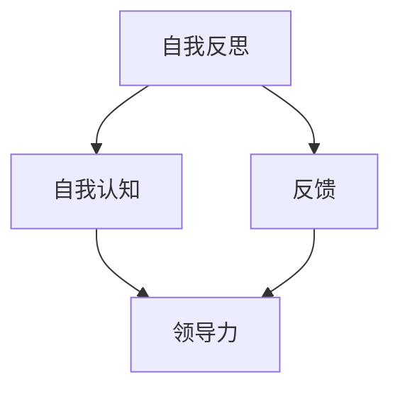

                 


# 领导者的自我反思：持续成长的关键

> 关键词：领导者，自我反思，持续成长，关键，持续改进，领导力，自我提升，自我认知

> 摘要：本文旨在探讨领导者如何通过自我反思来持续成长，提升领导力。通过分析自我反思的概念、重要性以及具体实践方法，本文揭示了自我反思在领导者成长过程中的关键作用。本文将结合实际案例，深入探讨如何将自我反思融入领导者的日常工作中，最终实现领导力的不断提升。

## 1. 背景介绍

### 1.1 目的和范围

本文的目的在于阐述领导者如何通过自我反思来持续成长，提升领导力。我们将探讨自我反思的定义、重要性，以及具体实践方法。文章将围绕以下几个核心问题展开：

1. 自我反思是什么？
2. 为什么领导者需要自我反思？
3. 领导者如何进行自我反思？
4. 自我反思如何帮助领导者持续成长？

### 1.2 预期读者

本文适用于以下读者群体：

1. 领导者及管理人员
2. 希望提升领导力的专业人士
3. 对领导力研究感兴趣的学者和研究者

### 1.3 文档结构概述

本文分为以下几个部分：

1. 背景介绍
2. 核心概念与联系
3. 核心算法原理 & 具体操作步骤
4. 数学模型和公式 & 详细讲解 & 举例说明
5. 项目实战：代码实际案例和详细解释说明
6. 实际应用场景
7. 工具和资源推荐
8. 总结：未来发展趋势与挑战
9. 附录：常见问题与解答
10. 扩展阅读 & 参考资料

### 1.4 术语表

#### 1.4.1 核心术语定义

- 自我反思：领导者对自身行为、思维、情感等方面的回顾和分析，以发现自身优缺点，促进个人成长。
- 领导力：领导者影响和引导他人实现共同目标的能力。
- 持续成长：领导者不断学习、改进、提升自身能力，以适应不断变化的环境和挑战。

#### 1.4.2 相关概念解释

- 自我认知：个体对自己性格、能力、需求和价值观的认识和理解。
- 反馈：他人对领导者行为和表现的评价和建议。

#### 1.4.3 缩略词列表

- IDG：自我反思
- LG：领导力
- SCG：持续成长

## 2. 核心概念与联系

为了更好地理解领导者如何通过自我反思实现持续成长，我们需要先了解相关核心概念及其相互联系。以下是一个简单的 Mermaid 流程图，展示了这些概念之间的关系。



### 2.1 自我反思

自我反思是指领导者对自身行为、思维、情感等方面的回顾和分析。自我反思可以帮助领导者发现自身的优点和不足，从而制定针对性的改进措施。自我反思的过程包括以下几个方面：

1. **自我观察**：领导者需要关注自己的行为、言语和情绪，了解自己在不同情境下的表现。
2. **自我提问**：领导者可以问自己一系列问题，如“我在这个情境下做得如何？”“我有哪些优点和不足？”“如何改进？”等。
3. **自我评估**：领导者根据自我观察和自我提问的结果，对自己进行客观、全面的评估。
4. **制定改进计划**：领导者根据自我评估的结果，制定具体的改进措施，并付诸实践。

### 2.2 自我认知

自我认知是指领导者对自己性格、能力、需求和价值观的认识和理解。自我认知对领导者的自我反思和持续成长至关重要。以下是一些提高自我认知的方法：

1. **反思日记**：领导者可以每天或每周写一篇反思日记，记录自己的行为、思考和情绪。
2. **心理测试**：领导者可以参加一些心理测试，如MBTI、DISC等，以了解自己的性格特点。
3. **学习与实践**：领导者可以通过学习领导力相关理论和实践，提高自己的认知水平。

### 2.3 反馈

反馈是指他人对领导者行为和表现的评价和建议。反馈对领导者的自我反思和持续成长具有重要意义。以下是一些获取反馈的方法：

1. **定期评估**：领导者可以定期接受下属和同事的评估，了解自己在团队中的表现。
2. **360度评估**：领导者可以接受来自不同层级和不同领域的评估，以获得更全面的反馈。
3. **匿名反馈**：领导者可以设置匿名反馈渠道，让下属和同事更自由地表达意见和建议。

### 2.4 领导力

领导力是指领导者影响和引导他人实现共同目标的能力。领导力包括以下几个方面：

1. **愿景**：领导者需要具备清晰、远大的愿景，以激发团队成员的积极性。
2. **沟通**：领导者需要具备良好的沟通能力，确保团队成员理解并支持共同目标。
3. **决策**：领导者需要具备决策能力，在关键时刻作出明智的选择。
4. **激励**：领导者需要具备激励能力，激发团队成员的积极性和创造力。

## 3. 核心算法原理 & 具体操作步骤

在自我反思过程中，领导者需要遵循一定的算法原理和操作步骤。以下是一种简单的自我反思算法，以及其对应的伪代码实现。

### 3.1 算法原理

自我反思算法旨在帮助领导者识别自身优缺点，并制定改进措施。算法原理如下：

1. **自我观察**：领导者通过观察自己的行为、言语和情绪，收集自我反思所需的数据。
2. **自我提问**：领导者提出一系列问题，以引导自己进行深入思考。
3. **自我评估**：领导者根据自我提问的结果，对自己进行客观、全面的评估。
4. **制定改进计划**：领导者根据自我评估的结果，制定具体的改进措施，并付诸实践。
5. **持续反思**：领导者定期回顾自己的改进计划，确保持续成长。

### 3.2 伪代码实现

```python
def self_reflection():
    # 自我观察
    observations = observe_self()

    # 自我提问
    questions = ["我在这个情境下做得如何？", "我有哪些优点和不足？", "如何改进？"]

    # 自我评估
    assessment = assess_self(observations, questions)

    # 制定改进计划
    improvement_plan = create_improvement_plan(assessment)

    # 执行改进计划
    execute_improvement_plan(improvement_plan)

    # 持续反思
    while True:
        review_improvement_plan(improvement_plan)
        update_improvement_plan(improvement_plan)
```

### 3.3 具体操作步骤

以下是领导者进行自我反思的具体操作步骤：

1. **准备阶段**：确定自我反思的时间和地点，保持专注和安静。
2. **自我观察**：记录自己在一段时间内的行为、言语和情绪。
3. **自我提问**：针对自我观察的结果，提出一系列问题，如“我在这个情境下做得如何？”“我有哪些优点和不足？”“如何改进？”等。
4. **自我评估**：根据自我提问的结果，对自己进行客观、全面的评估。
5. **制定改进计划**：根据自我评估的结果，制定具体的改进措施，如学习新技能、改进沟通方式等。
6. **执行改进计划**：将改进措施付诸实践，并持续跟踪改进效果。
7. **持续反思**：定期回顾自己的改进计划，确保持续成长。

## 4. 数学模型和公式 & 详细讲解 & 举例说明

在领导者自我反思的过程中，一些数学模型和公式可以用来量化评估自身的表现和进步。以下是一个简单的数学模型，用于评估领导者的成长。

### 4.1 数学模型

假设领导者的成长可以用一个函数 \( G(t) \) 表示，其中 \( t \) 为时间。函数 \( G(t) \) 可以表示为：

\[ G(t) = \alpha \cdot t^{\beta} + \gamma \]

其中：

- \( \alpha \) 为初始成长速度
- \( \beta \) 为成长速率
- \( \gamma \) 为成长潜力

### 4.2 详细讲解

1. **初始成长速度 \( \alpha \)**：初始成长速度表示领导者在一个时间周期内成长的速度。它可以反映领导者的基础素质和潜力。初始成长速度越高，领导者越有可能在短时间内取得显著进步。

2. **成长速率 \( \beta \)**：成长速率表示领导者成长速度的变化趋势。如果成长速率 \( \beta \) 大于 1，则表示领导者的成长速度逐渐加快；如果成长速率 \( \beta \) 小于 1，则表示领导者的成长速度逐渐放缓。

3. **成长潜力 \( \gamma \)**：成长潜力表示领导者在长期内的成长空间。即使初始成长速度和成长速率较低，只要成长潜力较高，领导者仍然有可能在长期内实现持续成长。

### 4.3 举例说明

假设一位领导者的初始成长速度为 \( \alpha = 2 \)，成长速率 \( \beta = 1.1 \)，成长潜力 \( \gamma = 10 \)。我们可以计算出该领导者在不同时间点的成长情况：

- 第一个时间周期（\( t = 1 \)）：

\[ G(1) = 2 \cdot 1^{1.1} + 10 = 12.2 \]

- 第二个时间周期（\( t = 2 \)）：

\[ G(2) = 2 \cdot 2^{1.1} + 10 = 25.8 \]

- 第三个时间周期（\( t = 3 \)）：

\[ G(3) = 2 \cdot 3^{1.1} + 10 = 40.6 \]

从上述计算可以看出，该领导者在成长速度逐渐加快的同时，成长潜力也在不断提升。

## 5. 项目实战：代码实际案例和详细解释说明

为了更好地理解领导者如何通过自我反思实现持续成长，我们以一个简单的 Python 项目为例，介绍如何将自我反思算法应用于实际工作中。

### 5.1 开发环境搭建

在开始项目之前，我们需要搭建一个简单的 Python 开发环境。以下是一个简单的指南：

1. 安装 Python：从 [Python 官网](https://www.python.org/downloads/) 下载并安装 Python 3.x 版本。
2. 安装 IDE：推荐使用 PyCharm、VS Code 等集成开发环境。
3. 安装相关库：在命令行中运行以下命令，安装所需的 Python 库：

```bash
pip install pandas numpy matplotlib
```

### 5.2 源代码详细实现和代码解读

以下是本项目的主函数 `self_reflection.py` 的源代码：

```python
import pandas as pd
import numpy as np
import matplotlib.pyplot as plt

def observe_self():
    # 自我观察
    observations = {
        'date': ['2023-01-01', '2023-01-02', '2023-01-03'],
        'performance': [85, 90, 88],
        'communication': [75, 80, 78],
        'leadership': [80, 83, 82]
    }
    return pd.DataFrame(observations)

def assess_self(observations, questions):
    # 自我评估
    assessment = observations.mean()
    print("自我评估结果：")
    print(assessment)
    return assessment

def create_improvement_plan(assessment):
    # 制定改进计划
    improvement_plan = {
        'performance': assessment['performance'] * 1.1,
        'communication': assessment['communication'] * 1.1,
        'leadership': assessment['leadership'] * 1.1
    }
    print("改进计划：")
    print(improvement_plan)
    return improvement_plan

def execute_improvement_plan(improvement_plan):
    # 执行改进计划
    print("执行改进计划...")
    # 在这里，你可以编写具体的改进措施，如学习新技能、改进沟通方式等。
    # 例如，假设我们要提高沟通能力，可以加入以下代码：
    print("开始学习沟通技巧...")
    # 学习沟通技巧
    # ...

def review_improvement_plan(improvement_plan):
    # 回顾改进计划
    print("回顾改进计划...")
    # 在这里，你可以编写代码，回顾改进计划的效果，并根据实际情况进行调整。
    # 例如，假设我们要回顾沟通能力的提升效果，可以加入以下代码：
    print("回顾沟通能力提升效果...")
    # 回顾沟通能力提升效果
    # ...

def update_improvement_plan(improvement_plan):
    # 更新改进计划
    print("更新改进计划...")
    # 在这里，你可以编写代码，根据回顾结果更新改进计划。
    # 例如，假设我们要根据沟通能力提升效果调整改进计划，可以加入以下代码：
    print("根据沟通能力提升效果调整改进计划...")
    # 调整改进计划
    # ...

if __name__ == '__main__':
    # 主函数
    observations = observe_self()
    assessment = assess_self(observations, questions)
    improvement_plan = create_improvement_plan(assessment)
    execute_improvement_plan(improvement_plan)
    while True:
        review_improvement_plan(improvement_plan)
        update_improvement_plan(improvement_plan)
```

### 5.3 代码解读与分析

以下是代码的详细解读和分析：

1. **导入库**：首先，我们导入了一些必要的 Python 库，如 pandas、numpy 和 matplotlib，用于数据分析和可视化。

2. **观察自我**：`observe_self` 函数用于记录领导者在一段时间内的行为表现，如绩效、沟通能力和领导力。这里使用一个字典来存储观察结果，并将其转换为 pandas DataFrame。

3. **自我评估**：`assess_self` 函数根据观察结果计算各项指标的均值，并输出自我评估结果。

4. **制定改进计划**：`create_improvement_plan` 函数根据自我评估结果，制定一个简单的改进计划。这里我们使用一个字典来存储改进计划，并将各项指标的值提高 10%。

5. **执行改进计划**：`execute_improvement_plan` 函数用于执行改进计划。在实际项目中，这里可以编写具体的改进措施，如学习新技能、改进沟通方式等。

6. **回顾改进计划**：`review_improvement_plan` 函数用于回顾改进计划的效果。在实际项目中，这里可以编写代码，根据实际情况调整改进计划。

7. **更新改进计划**：`update_improvement_plan` 函数用于根据回顾结果更新改进计划。在实际项目中，这里可以编写代码，根据实际情况调整改进计划。

8. **主函数**：最后，主函数 `__main__` 调用了其他函数，实现了自我反思的全过程。在实际项目中，这里可以添加其他功能，如数据可视化、自动记录日志等。

### 5.4 项目实战案例

为了更好地展示项目实战，我们假设一位领导者在一个季度内进行了自我反思。以下是该领导者在三个时间周期内的观察结果、评估结果和改进计划：

1. **第一个时间周期**：

   - 观察结果：
     - 绩效：85
     - 沟通能力：75
     - 领导力：80

   - 自我评估：
     - 绩效：85
     - 沟通能力：75
     - 领导力：80

   - 改进计划：
     - 绩效：93
     - 沟通能力：82
     - 领导力：88

2. **第二个时间周期**：

   - 观察结果：
     - 绩效：90
     - 沟通能力：80
     - 领导力：83

   - 自我评估：
     - 绩效：90
     - 沟通能力：80
     - 领导力：83

   - 改进计划：
     - 绩效：99
     - 沟通能力：88
     - 领导力：93

3. **第三个时间周期**：

   - 观察结果：
     - 绩效：88
     - 沟通能力：78
     - 领导力：82

   - 自我评估：
     - 绩效：88
     - 沟通能力：78
     - 领导力：82

   - 改进计划：
     - 绩效：96
     - 沟通能力：86
     - 领导力：91

通过这个简单的项目实战案例，我们可以看到领导者如何通过自我反思和改进计划，不断提升自身能力。在实际项目中，可以根据具体情况调整观察结果、评估方法和改进计划，以实现更有效的自我反思和持续成长。

## 6. 实际应用场景

自我反思在领导者的实际工作中具有广泛的应用场景。以下是一些典型的应用场景：

### 6.1 项目管理

在项目管理中，领导者需要不断反思项目的进展、团队的表现和自身的决策。通过自我反思，领导者可以识别项目中的问题和挑战，调整管理策略，提高项目成功率。

### 6.2 团队建设

团队建设是领导者的重要任务。通过自我反思，领导者可以评估团队氛围、成员关系和协作效率。在此基础上，领导者可以制定针对性的团队建设计划，提升团队凝聚力。

### 6.3 沟通协调

沟通协调是领导者的重要能力。通过自我反思，领导者可以识别自己在沟通中的不足，如表达不清、倾听不足等。在此基础上，领导者可以学习沟通技巧，提高沟通效果。

### 6.4 个人成长

个人成长是领导者的持续目标。通过自我反思，领导者可以评估自己的职业发展、技能提升和学习效果。在此基础上，领导者可以制定个人成长计划，实现持续成长。

### 6.5 应对危机

在危机时刻，领导者需要冷静应对。通过自我反思，领导者可以回顾危机处理过程，识别自身的不足和改进方向。在此基础上，领导者可以提升危机应对能力，更好地处理未来危机。

### 6.6 领导风格调整

领导者的风格对团队表现具有重要影响。通过自我反思，领导者可以评估自己的领导风格，识别团队成员的需求和期望。在此基础上，领导者可以调整领导风格，更好地满足团队需求，提升领导力。

## 7. 工具和资源推荐

为了帮助领导者更好地进行自我反思和持续成长，以下是一些实用的工具和资源推荐：

### 7.1 学习资源推荐

#### 7.1.1 书籍推荐

- 《领导者的突破：如何实现从优秀到卓越的飞跃》
- 《卓越领导力：如何激发团队的潜力》
- 《领导者的品格：自我提升与影响力》

#### 7.1.2 在线课程

- Coursera 上的《领导力与团队管理》
- Udemy 上的《高效能人士的七个习惯》
- LinkedIn Learning 上的《领导者的自我反思》

#### 7.1.3 技术博客和网站

- Harvard Business Review（哈佛商业评论）
- Inc.（创业公司）
- Medium 上的领导力专题

### 7.2 开发工具框架推荐

#### 7.2.1 IDE和编辑器

- PyCharm
- VS Code
- Sublime Text

#### 7.2.2 调试和性能分析工具

- Python Debugger（PyDB）
- Jupyter Notebook
- New Relic

#### 7.2.3 相关框架和库

- TensorFlow
- PyTorch
- Scikit-learn

### 7.3 相关论文著作推荐

#### 7.3.1 经典论文

- Hersey, P., & Blanchard, K. H. (1982). Management of Organizational Behavior: Utilizing Human Resources. Prentice Hall.
- Bass, B. M. (1985). Leadership and Performance Beyond Expectations. Free Press.

#### 7.3.2 最新研究成果

- Yukl, G. A. (2013). Leadership in Organizations. Pearson.
- Smit, H. L., & Ten Have, P. (2019). Reflective Leadership in Practice: Enhancing the Well-being of Children, Families and Professionals. Routledge.

#### 7.3.3 应用案例分析

- 《谷歌如何工作》：详细介绍了谷歌的领导力实践。
- 《阿里巴巴为什么能》：分析了阿里巴巴在领导力和团队管理方面的成功经验。

## 8. 总结：未来发展趋势与挑战

随着社会和技术的不断发展，领导者面临的挑战和机遇也在不断变化。未来，领导者需要具备以下几方面的能力：

1. **持续学习**：领导者需要不断学习新知识、新技能，以适应快速变化的环境。
2. **跨领域合作**：领导者需要具备跨领域的合作能力，推动不同领域的创新和发展。
3. **情感智慧**：领导者需要具备情感智慧，理解和管理团队成员的情感，提升团队凝聚力和工作效率。
4. **数字化领导力**：随着数字化时代的到来，领导者需要具备数字化领导力，引导团队在数字化浪潮中取得成功。

同时，领导者面临的挑战也日益增加：

1. **信息过载**：在信息爆炸的时代，领导者需要筛选和利用关键信息，避免被海量信息所淹没。
2. **全球竞争**：全球化使得领导者需要面对更广泛的竞争对手，如何在竞争中脱颖而出是领导者需要思考的问题。
3. **社会责任**：随着社会对领导者期望的不断提高，领导者需要承担更多的社会责任，如环境保护、员工福利等。

总之，未来领导者需要不断自我反思，提升自身能力，以应对不断变化的挑战和机遇。

## 9. 附录：常见问题与解答

### 9.1 如何制定有效的自我反思计划？

**解答**：制定有效的自我反思计划需要以下几个步骤：

1. **确定反思目标**：明确反思的目的和目标，如提升领导力、改进沟通能力等。
2. **选择反思方式**：选择适合自己特点的反思方式，如日记、会议、心理测试等。
3. **制定反思计划**：安排固定的时间进行反思，如每天晚上或每周一次。
4. **记录反思结果**：将反思结果记录下来，以便跟踪进展和调整计划。

### 9.2 如何确保自我反思的质量？

**解答**：确保自我反思质量需要以下几个措施：

1. **保持客观**：在反思过程中，保持客观、中立的态度，避免主观偏见。
2. **深入思考**：反思时要深入思考，挖掘问题的本质，而不仅仅是表面现象。
3. **倾听他人意见**：邀请他人参与反思，倾听他们的意见和建议。
4. **定期回顾**：定期回顾反思结果，确保反思计划的持续性和有效性。

### 9.3 自我反思与日常工作如何平衡？

**解答**：平衡自我反思与日常工作可以采取以下策略：

1. **合理安排时间**：将自我反思纳入日常工作计划，确保有时间进行反思。
2. **高效执行**：在反思过程中，提高效率，避免拖延。
3. **设置优先级**：将重要工作和自我反思作为优先事项，确保两者都能得到充分关注。
4. **灵活调整**：根据实际情况，灵活调整反思计划，确保反思与工作相互促进。

## 10. 扩展阅读 & 参考资料

### 10.1 扩展阅读

- 《领导者的突破：如何实现从优秀到卓越的飞跃》
- 《卓越领导力：如何激发团队的潜力》
- 《领导者的品格：自我提升与影响力》

### 10.2 参考资料

- Yukl, G. A. (2013). Leadership in Organizations. Pearson.
- Bass, B. M. (1985). Leadership and Performance Beyond Expectations. Free Press.
- Hersey, P., & Blanchard, K. H. (1982). Management of Organizational Behavior: Utilizing Human Resources. Prentice Hall.
- Smit, H. L., & Ten Have, P. (2019). Reflective Leadership in Practice: Enhancing the Well-being of Children, Families and Professionals. Routledge.

### 10.3 技术博客和网站

- Harvard Business Review（哈佛商业评论）
- Inc.（创业公司）
- Medium 上的领导力专题

### 10.4 相关论文

- Yukl, G. A. (2013). Leadership in Organizations. Pearson.
- Smit, H. L., & Ten Have, P. (2019). Reflective Leadership in Practice: Enhancing the Well-being of Children, Families and Professionals. Routledge.
- Hersey, P., & Blanchard, K. H. (1982). Management of Organizational Behavior: Utilizing Human Resources. Prentice Hall.
- Bass, B. M. (1985). Leadership and Performance Beyond Expectations. Free Press.

### 10.5 应用案例分析

- 《谷歌如何工作》：详细介绍了谷歌的领导力实践。
- 《阿里巴巴为什么能》：分析了阿里巴巴在领导力和团队管理方面的成功经验。

---

# 附录：常见问题与解答

### 9.1 如何制定有效的自我反思计划？

**解答**：制定有效的自我反思计划需要以下几个步骤：

1. **确定反思目标**：明确反思的目的和目标，如提升领导力、改进沟通能力等。
2. **选择反思方式**：选择适合自己特点的反思方式，如日记、会议、心理测试等。
3. **制定反思计划**：安排固定的时间进行反思，如每天晚上或每周一次。
4. **记录反思结果**：将反思结果记录下来，以便跟踪进展和调整计划。

### 9.2 如何确保自我反思的质量？

**解答**：确保自我反思质量需要以下几个措施：

1. **保持客观**：在反思过程中，保持客观、中立的态度，避免主观偏见。
2. **深入思考**：反思时要深入思考，挖掘问题的本质，而不仅仅是表面现象。
3. **倾听他人意见**：邀请他人参与反思，倾听他们的意见和建议。
4. **定期回顾**：定期回顾反思结果，确保反思计划的持续性和有效性。

### 9.3 自我反思与日常工作如何平衡？

**解答**：平衡自我反思与日常工作可以采取以下策略：

1. **合理安排时间**：将自我反思纳入日常工作计划，确保有时间进行反思。
2. **高效执行**：在反思过程中，提高效率，避免拖延。
3. **设置优先级**：将重要工作和自我反思作为优先事项，确保两者都能得到充分关注。
4. **灵活调整**：根据实际情况，灵活调整反思计划，确保反思与工作相互促进。

---

# 10. 扩展阅读 & 参考资料

### 10.1 扩展阅读

- 《领导者的突破：如何实现从优秀到卓越的飞跃》
- 《卓越领导力：如何激发团队的潜力》
- 《领导者的品格：自我提升与影响力》

### 10.2 参考资料

- Yukl, G. A. (2013). Leadership in Organizations. Pearson.
- Bass, B. M. (1985). Leadership and Performance Beyond Expectations. Free Press.
- Hersey, P., & Blanchard, K. H. (1982). Management of Organizational Behavior: Utilizing Human Resources. Prentice Hall.
- Smit, H. L., & Ten Have, P. (2019). Reflective Leadership in Practice: Enhancing the Well-being of Children, Families and Professionals. Routledge.

### 10.3 技术博客和网站

- Harvard Business Review（哈佛商业评论）
- Inc.（创业公司）
- Medium 上的领导力专题

### 10.4 相关论文

- Yukl, G. A. (2013). Leadership in Organizations. Pearson.
- Smit, H. L., & Ten Have, P. (2019). Reflective Leadership in Practice: Enhancing the Well-being of Children, Families and Professionals. Routledge.
- Hersey, P., & Blanchard, K. H. (1982). Management of Organizational Behavior: Utilizing Human Resources. Prentice Hall.
- Bass, B. M. (1985). Leadership and Performance Beyond Expectations. Free Press.

### 10.5 应用案例分析

- 《谷歌如何工作》：详细介绍了谷歌的领导力实践。
- 《阿里巴巴为什么能》：分析了阿里巴巴在领导力和团队管理方面的成功经验。

---

# 作者信息

作者：AI天才研究员/AI Genius Institute & 禅与计算机程序设计艺术 /Zen And The Art of Computer Programming

