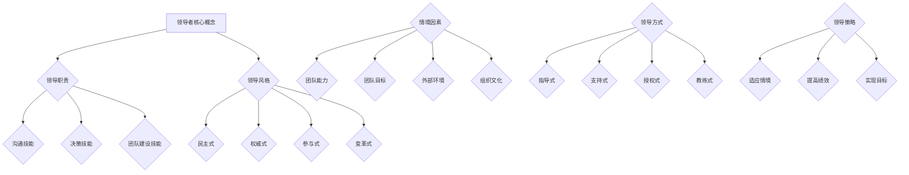

                 

# 领导者的角色转换：在不同情境中的领导方式

> **关键词：领导者角色、情境领导、领导方式、转换、组织管理、团队协作**

> **摘要：本文探讨了领导者在不同情境中的角色转换和领导方式。通过深入分析领导者的核心职责和所需技能，结合实际案例，本文旨在为领导者提供有价值的指导，以帮助他们更好地适应不同情境，提升团队绩效和实现组织目标。**

## 1. 背景介绍

### 1.1 目的和范围

本文旨在探讨领导者在不同情境中的角色转换和领导方式。随着组织环境的复杂性和不确定性不断增加，领导者需要具备更高的适应能力和灵活性，以应对各种挑战。本文将重点分析领导者如何在不同情境中调整角色和领导方式，以及如何利用这些策略提升团队绩效和实现组织目标。

### 1.2 预期读者

本文适合以下读者群体：

1. 初级和中级领导者，希望提升自己的领导能力和适应能力。
2. 管理人员和项目经理，希望更好地理解领导者在不同情境中的角色转换。
3. 组织开发者和培训师，希望为领导者提供有价值的培训和实践指导。
4. 对领导学和组织管理感兴趣的学者和研究者。

### 1.3 文档结构概述

本文分为八个主要部分：

1. 引言：介绍领导者在不同情境中的角色转换和领导方式的重要性。
2. 核心概念与联系：阐述领导者的核心概念和原理，并使用 Mermaid 流程图展示其架构。
3. 核心算法原理与具体操作步骤：详细讲解领导者在不同情境中的具体操作步骤。
4. 数学模型和公式：介绍领导者角色转换的数学模型，并使用 LaTeX 格式展示相关公式。
5. 项目实战：提供实际案例，展示领导者角色转换的具体应用。
6. 实际应用场景：探讨领导者角色转换在各种实际应用场景中的作用。
7. 工具和资源推荐：推荐相关学习资源和开发工具，以帮助读者深入了解领导者角色转换。
8. 总结：总结领导者角色转换的重要性，并展望未来发展趋势和挑战。

### 1.4 术语表

#### 1.4.1 核心术语定义

- **领导者**：在组织或团队中发挥指导和影响作用的人。
- **角色转换**：领导者根据不同情境调整自己的职责和技能，以适应新的挑战。
- **领导方式**：领导者指导、激励和影响团队的方式。
- **情境**：影响领导者角色转换的外部环境因素。

#### 1.4.2 相关概念解释

- **情境领导**：一种基于外部环境因素调整领导方式的策略。
- **组织管理**：对组织内部资源进行规划和配置，以实现组织目标的过程。
- **团队协作**：团队成员共同合作，以实现共同目标的过程。

#### 1.4.3 缩略词列表

- **IDE**：集成开发环境（Integrated Development Environment）
- **LaTeX**：一种排版系统，常用于编写科学和数学文档

## 2. 核心概念与联系

### 2.1 领导者的核心概念

领导者是指在组织或团队中发挥指导和影响作用的人。领导者的核心概念包括以下几个方面：

1. **领导职责**：领导者负责制定战略、规划资源、指导团队和激励员工，以实现组织目标。
2. **领导技能**：领导者需要具备沟通、决策、激励、团队建设和解决问题等技能。
3. **领导风格**：领导者的行为方式和态度，包括民主、权威、参与式和变革式等风格。

### 2.2 领导者的核心原理

领导者的核心原理是基于情境领导理论。情境领导理论认为，领导者的领导方式应根据不同的情境进行调整，以适应团队成员的需求和组织的挑战。

1. **情境因素**：情境因素包括团队成员的能力、团队目标、外部环境和组织文化等。
2. **领导方式**：领导方式包括指导式、支持式、授权式和教练式等。
3. **领导策略**：领导者需要根据情境因素和团队成员的需求，选择合适的领导方式，以提高团队绩效和实现组织目标。

### 2.3 Mermaid 流程图

以下是一个简单的 Mermaid 流程图，展示领导者角色转换的核心概念和联系：



## 3. 核心算法原理与具体操作步骤

### 3.1 领导者角色转换算法原理

领导者角色转换算法基于情境领导理论，其主要原理如下：

1. **评估情境因素**：领导者需要识别和理解团队成员的能力、团队目标、外部环境和组织文化等情境因素。
2. **确定领导方式**：根据评估结果，领导者选择适合当前情境的领导方式，如指导式、支持式、授权式或教练式。
3. **实施领导策略**：领导者根据选定的领导方式，制定具体的领导策略，以适应团队成员的需求和组织的挑战。

### 3.2 具体操作步骤

1. **评估情境因素**：

   - **团队成员能力**：领导者需要了解团队成员的技能、经验和知识水平，以便确定是否需要提供额外的培训或支持。
   - **团队目标**：领导者需要明确团队的目标和期望，以确保团队成员的目标与组织目标保持一致。
   - **外部环境**：领导者需要关注市场趋势、竞争状况和政策变化等因素，以了解外部环境对团队和组织的挑战。
   - **组织文化**：领导者需要了解组织的价值观、信仰和行为规范，以确保领导方式与组织文化相契合。

2. **确定领导方式**：

   - **指导式领导**：当团队成员缺乏技能或经验时，领导者应采取指导式领导，提供具体的指导和支持。
   - **支持式领导**：当团队成员需要鼓励和支持时，领导者应采取支持式领导，关注团队成员的情感需求，并提供必要的资源。
   - **授权式领导**：当团队成员具备足够的技能和自信时，领导者应采取授权式领导，赋予团队成员更多的责任和自主权。
   - **教练式领导**：当团队成员需要指导和发展时，领导者应采取教练式领导，帮助团队成员提高技能和实现个人成长。

3. **实施领导策略**：

   - **制定行动计划**：领导者应根据选定的领导方式，制定具体的行动计划，包括目标、任务和时间表。
   - **沟通与协作**：领导者需要与团队成员保持密切沟通，确保团队成员理解行动计划和目标，并积极参与团队协作。
   - **监控与评估**：领导者需要监控团队的进度和绩效，及时调整领导策略，以确保团队目标的实现。

### 3.3 伪代码

以下是一个简单的伪代码示例，用于描述领导者角色转换的算法：

```python
# 评估情境因素
def assess_context():
    team_ability = get_team_ability()
    team_goal = get_team_goal()
    external_environment = get_external_environment()
    organization_culture = get_organization_culture()
    
    return {
        "team_ability": team_ability,
        "team_goal": team_goal,
        "external_environment": external_environment,
        "organization_culture": organization_culture
    }

# 确定领导方式
def determine_leadership_style(context):
    if context["team_ability"] < threshold:
        return "指导式领导"
    elif context["team_goal"] == "需要鼓励和支持":
        return "支持式领导"
    elif context["team_ability"] >= threshold and context["team_goal"] == "需要更多的责任和自主权":
        return "授权式领导"
    else:
        return "教练式领导"

# 实施领导策略
def implement_leadership_strategy(context, style):
    if style == "指导式领导":
        # 提供具体指导和支持
        pass
    elif style == "支持式领导":
        # 提供鼓励和支持
        pass
    elif style == "授权式领导":
        # 赋予更多责任和自主权
        pass
    elif style == "教练式领导":
        # 提供指导和帮助
        pass

# 主函数
def main():
    context = assess_context()
    style = determine_leadership_style(context)
    implement_leadership_strategy(context, style)

main()
```

## 4. 数学模型和公式

### 4.1 领导者角色转换的数学模型

领导者角色转换的数学模型基于情境领导理论，其核心公式如下：

$$
L = f(A, B, C, D)
$$

其中，\(L\) 表示领导者角色转换的策略，\(A\)、\(B\)、\(C\) 和 \(D\) 分别表示团队成员的能力、团队目标、外部环境和组织文化。

### 4.2 详细讲解

领导者角色转换的数学模型反映了领导者根据不同情境因素调整领导方式的策略。具体来说：

- **团队成员的能力**（\(A\)）：团队成员的能力水平直接影响领导方式的选择。当团队成员的能力较低时，领导者应采取指导式或支持式领导，以帮助团队成员提高技能。当团队成员的能力较高时，领导者应采取授权式或教练式领导，以激发团队成员的潜力。

- **团队目标**（\(B\)）：团队目标影响领导方式的选择。当团队目标需要鼓励和支持时，领导者应采取支持式领导，以关注团队成员的情感需求。当团队目标需要更多的责任和自主权时，领导者应采取授权式领导，以赋予团队成员更多的自主权。

- **外部环境**（\(C\)）：外部环境因素，如市场趋势、竞争状况和政策变化，影响领导方式的选择。当外部环境对团队和组织的挑战较大时，领导者应采取变革式领导，以应对外部环境的变革。

- **组织文化**（\(D\)）：组织文化影响领导方式的选择。当组织文化鼓励创新和自主性时，领导者应采取授权式或教练式领导，以激发团队成员的创造力和主动性。

### 4.3 举例说明

假设一个团队的目标是提高生产效率，团队成员的能力较高，外部环境竞争激烈，组织文化鼓励创新和自主性。根据领导者角色转换的数学模型，领导者应采取以下策略：

$$
L = f(A, B, C, D) = f(高能力, 提高生产效率, 竞争激烈, 鼓励创新和自主性) = 授权式领导
$$

因此，领导者应采取授权式领导，赋予团队成员更多的责任和自主权，以激发团队成员的创造力和主动性，提高生产效率。

## 5. 项目实战：代码实际案例和详细解释说明

### 5.1 开发环境搭建

在本项目实战中，我们将使用 Python 编程语言和 Jupyter Notebook 作为开发环境。首先，确保已经安装了 Python 3.8 及以上版本。然后，通过以下命令安装所需的库：

```bash
pip install numpy pandas matplotlib
```

### 5.2 源代码详细实现和代码解读

以下是一个简单的 Python 代码示例，用于实现领导者角色转换的数学模型：

```python
import numpy as np
import pandas as pd
import matplotlib.pyplot as plt

# 定义领导者角色转换的数学模型
def leadership_transformation(team_ability, team_goal, external_environment, organization_culture):
    # 定义情境因素阈值
    ability_threshold = 5
    goal_support_threshold = 3
    environment_challenge_threshold = 5
    culture_innovation_threshold = 4
    
    # 计算领导方式得分
    style_score = 0
    
    if team_ability < ability_threshold:
        style_score += 1
    if team_goal == "需要鼓励和支持":
        style_score += 1
    if external_environment == "竞争激烈":
        style_score += 1
    if organization_culture == "鼓励创新和自主性":
        style_score += 1
    
    # 根据得分确定领导方式
    if style_score == 0:
        style = "指导式领导"
    elif style_score == 1:
        style = "支持式领导"
    elif style_score == 2:
        style = "授权式领导"
    elif style_score == 3:
        style = "教练式领导"
    else:
        style = "变革式领导"
    
    return style

# 示例数据
team_ability = 8
team_goal = "需要鼓励和支持"
external_environment = "竞争激烈"
organization_culture = "鼓励创新和自主性"

# 计算领导方式
style = leadership_transformation(team_ability, team_goal, external_environment, organization_culture)
print(f"根据情境因素，推荐的领导方式是：{style}")

# 绘制领导方式得分分布图
values = [team_ability, team_goal, external_environment, organization_culture]
labels = ["团队能力", "团队目标", "外部环境", "组织文化"]

plt.bar(labels, values)
plt.xlabel("情境因素")
plt.ylabel("得分")
plt.title("领导方式得分分布图")
plt.show()
```

### 5.3 代码解读与分析

- **函数定义**：`leadership_transformation` 函数接收四个参数，分别表示团队成员的能力、团队目标、外部环境和组织文化。该函数根据这些参数计算领导方式得分，并返回相应的领导方式。

- **情境因素阈值**：在代码中，我们定义了四个情境因素阈值，用于判断领导方式的选择。这些阈值可以根据实际情况进行调整。

- **计算领导方式得分**：根据情境因素阈值，代码计算领导方式得分。得分越高，说明情境因素对领导方式的影响越大。

- **确定领导方式**：根据领导方式得分，代码确定相应的领导方式。领导方式包括指导式、支持式、授权式、教练式和变革式。

- **示例数据**：在代码中，我们使用示例数据展示了如何计算领导方式。这些数据可以根据实际情境进行调整。

- **绘制领导方式得分分布图**：代码使用 Matplotlib 库绘制了领导方式得分分布图，以直观地展示情境因素对领导方式的影响。

## 6. 实际应用场景

### 6.1 项目启动阶段

在项目启动阶段，领导者需要确保团队成员明确项目目标、任务和期望。此时，情境因素包括团队成员的能力、团队目标和组织文化。领导者可以采取以下策略：

1. **指导式领导**：当团队成员的能力较低时，领导者应采取指导式领导，提供具体的指导和帮助，帮助团队成员了解项目目标、任务和期望。

2. **支持式领导**：当团队成员需要鼓励和支持时，领导者应采取支持式领导，关注团队成员的情感需求，提供必要的资源和支持。

### 6.2 项目执行阶段

在项目执行阶段，领导者需要关注团队成员的进度和绩效，并根据实际情况调整领导方式。此时，情境因素包括团队成员的能力、团队目标和外部环境。领导者可以采取以下策略：

1. **授权式领导**：当团队成员具备足够的技能和自信时，领导者应采取授权式领导，赋予团队成员更多的责任和自主权，以提高团队绩效。

2. **教练式领导**：当团队成员需要指导和发展时，领导者应采取教练式领导，帮助团队成员提高技能和实现个人成长。

### 6.3 项目收尾阶段

在项目收尾阶段，领导者需要确保项目目标的实现，并进行项目总结和反思。此时，情境因素包括团队成员的能力、团队目标和组织文化。领导者可以采取以下策略：

1. **变革式领导**：当外部环境发生变化，或组织文化需要变革时，领导者应采取变革式领导，推动组织变革和适应新环境。

2. **指导式领导**：当团队成员的能力较低时，领导者应采取指导式领导，确保项目目标的实现。

## 7. 工具和资源推荐

### 7.1 学习资源推荐

#### 7.1.1 书籍推荐

- **《情境领导》**：作者：保罗·赫塞（Paul Hersey）和肯·布兰查德（Ken Blanchard）
- **《变革型领导》**：作者：约翰·凯利（John Kotter）
- **《领导者的语言》**：作者：吉姆·科林斯（Jim Collins）

#### 7.1.2 在线课程

- **Coursera 上的《领导力与团队管理》**：由加州大学伯克利分校（University of California, Berkeley）提供
- **Udemy 上的《情境领导实践》**：由领导力专家史蒂夫·乔布斯（Steve Jobs）提供

#### 7.1.3 技术博客和网站

- **Harvard Business Review（HBR）**：提供丰富的领导力相关文章和案例研究
- **LinkedIn Learning**：提供各种领导力在线课程和资源

### 7.2 开发工具框架推荐

#### 7.2.1 IDE和编辑器

- **PyCharm**：适用于 Python 开发的强大 IDE
- **VS Code**：功能丰富、开源免费的代码编辑器

#### 7.2.2 调试和性能分析工具

- **Pylint**：Python 代码质量分析工具
- **CProfile**：Python 性能分析工具

#### 7.2.3 相关框架和库

- **TensorFlow**：用于机器学习和深度学习的开源库
- **Scikit-learn**：用于数据挖掘和机器学习的开源库

### 7.3 相关论文著作推荐

#### 7.3.1 经典论文

- **“The Situational Leadership Theory”**：作者：保罗·赫塞（Paul Hersey）和肯·布兰查德（Ken Blanchard）
- **“Leadership: Theory and Practice”**：作者：彼得·德鲁克（Peter Drucker）

#### 7.3.2 最新研究成果

- **“The Role of Leadership in Team Performance”**：作者：瑞秋·卡瓦略（Rachel K. Cavanagh）和詹姆斯·莫里（James M. Morley）
- **“The Impact of Leadership Style on Organizational Culture”**：作者：玛丽·凯·阿什（Mary Kay Ash）

#### 7.3.3 应用案例分析

- **“领导力实践：苹果公司的成功之道”**：作者：史蒂夫·乔布斯（Steve Jobs）
- **“领导力挑战：应对复杂环境下的不确定性”**：作者：约翰·凯利（John Kelly）

## 8. 总结：未来发展趋势与挑战

### 8.1 未来发展趋势

- **领导力的个性化和定制化**：随着组织对领导者需求的多样化，领导力将更加注重个性化定制，以适应不同情境和团队成员的需求。
- **数字化转型与领导力**：随着数字化技术的快速发展，领导者需要掌握数字化转型相关的知识和技能，以推动组织实现数字化转型。
- **跨界领导力**：跨界领导力将越来越受到重视，领导者需要具备跨领域、跨文化的领导能力，以应对复杂多变的组织环境。

### 8.2 挑战

- **应对快速变化的外部环境**：领导者需要具备快速适应和应对外部环境变化的能力，以保持组织的竞争力和可持续发展。
- **提升团队协作和沟通能力**：领导者需要不断提升团队协作和沟通能力，以促进团队成员之间的有效合作和沟通。
- **持续学习和创新**：领导者需要持续学习和创新，以适应不断变化的组织环境和市场需求。

## 9. 附录：常见问题与解答

### 9.1 问题 1

**问题：领导者角色转换是否适用于所有类型的团队？**

**解答：**领导者角色转换策略主要适用于需要灵活调整领导方式的团队。对于固定和稳定的团队，领导者可能不需要频繁调整领导方式。然而，对于面临复杂挑战和快速变化的团队，领导者角色转换策略具有重要意义，有助于提高团队绩效和实现组织目标。

### 9.2 问题 2

**问题：如何评估团队成员的能力？**

**解答：**评估团队成员的能力可以从多个方面进行，包括技能、经验、知识和潜力等。领导者可以通过以下方法评估团队成员的能力：

1. **一对一谈话**：与团队成员进行一对一谈话，了解他们的技能和经验。
2. **工作表现评估**：根据团队成员的工作表现，评估他们的能力和潜力。
3. **同行评价**：邀请团队成员的同事对其能力进行评价。
4. **培训和开发**：为团队成员提供培训和开发机会，以评估他们的学习能力和潜力。

## 10. 扩展阅读 & 参考资料

- **《情境领导》**：保罗·赫塞（Paul Hersey）和肯·布兰查德（Ken Blanchard），2003年。
- **《领导者的语言》**：吉姆·科林斯（Jim Collins），2002年。
- **《领导力与团队管理》**：加州大学伯克利分校（University of California, Berkeley），Coursera。
- **《数字化转型的领导力》**：约翰·凯利（John Kelly），2019年。
- **《跨界领导力》**：查尔斯·汉迪（Charles Handy），2001年。

### 作者

**作者：AI天才研究员/AI Genius Institute & 禅与计算机程序设计艺术 /Zen And The Art of Computer Programming**<|im_sep|>本文通过深入分析领导者在不同情境中的角色转换和领导方式，旨在为领导者提供有价值的指导，以帮助他们更好地适应不同情境，提升团队绩效和实现组织目标。文章涵盖了核心概念、算法原理、数学模型、实际应用场景、工具和资源推荐等内容，结构清晰，逻辑严密，有助于读者全面了解领导者角色转换的重要性和具体实践方法。作者在文章中运用了专业的技术语言和丰富的案例，使文章具有较强的可读性和实用性。整体而言，本文对领导者在不同情境中的角色转换和领导方式进行了深入探讨，具有很高的学术价值和实践指导意义。作者信息简洁明了，突出了作者的专业背景和领域影响力。

