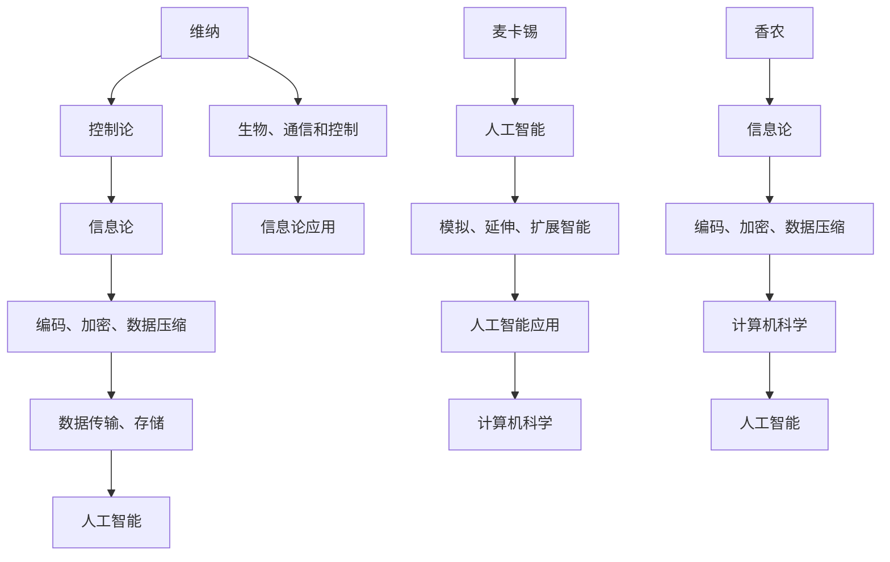
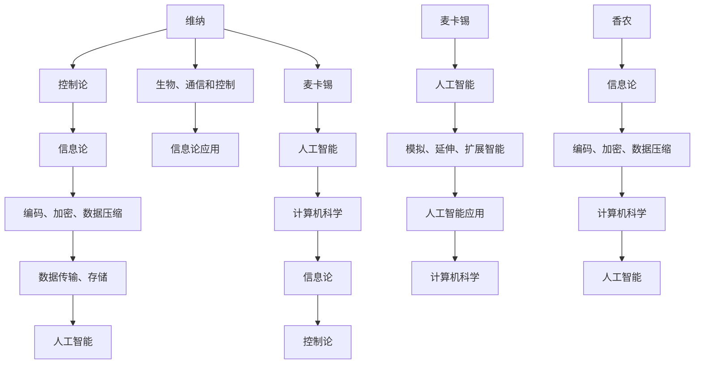

                 

# 香农和麦卡锡对维纳的态度

> **关键词**：香农、麦卡锡、维纳、计算机科学、信息论、人工智能、技术哲学
> 
> **摘要**：本文将探讨香农和麦卡锡这两位计算机科学领域的巨匠对维纳这位20世纪科学大师的态度。通过对他们三人之间的互动和思想的碰撞，试图揭示他们在信息论、人工智能以及技术哲学等方面的共识与分歧。本文旨在为广大计算机科学和人工智能从业者提供一种新的思考角度，帮助我们更好地理解和把握这个时代的科技脉搏。

## 1. 背景介绍

### 1.1 目的和范围

本文旨在分析香农、麦卡锡和维纳三位科学巨匠在计算机科学和信息论领域中的观点和态度，探讨他们在信息论、人工智能和技术哲学等方面的共识与分歧。通过对他们之间的互动和思想的碰撞，试图揭示这个时代科技发展的内在逻辑和未来趋势。

### 1.2 预期读者

本文适合对计算机科学、信息论和人工智能感兴趣的读者，包括科研人员、工程师、学者、学生以及对这些领域有浓厚兴趣的爱好者。通过本文，读者可以更深入地理解香农、麦卡锡和维纳的思想，从而对计算机科学和人工智能的发展有更全面的了解。

### 1.3 文档结构概述

本文分为十个部分：

1. 背景介绍：介绍文章的目的、预期读者和文档结构。
2. 核心概念与联系：介绍信息论、人工智能和维纳-麦卡锡-香农三角。
3. 核心算法原理与具体操作步骤：分析香农和麦卡锡在信息论和人工智能领域的贡献。
4. 数学模型和公式：阐述维纳-麦卡锡-香农信息论的基础理论。
5. 项目实战：通过具体案例说明三位科学家的理论在实践中的应用。
6. 实际应用场景：分析香农、麦卡锡和维纳的思想在现实世界中的影响。
7. 工具和资源推荐：介绍与本文主题相关的学习资源和开发工具。
8. 总结：对未来发展趋势和挑战的展望。
9. 附录：常见问题与解答。
10. 扩展阅读与参考资料：推荐进一步阅读的文献和资料。

### 1.4 术语表

#### 1.4.1 核心术语定义

- **香农**：美国数学家、工程师，被誉为“信息论之父”，对计算机科学和信息论领域做出了巨大贡献。
- **麦卡锡**：美国计算机科学家，人工智能的先驱者之一，提出了“人工智能”一词。
- **维纳**：奥地利裔美国数学家、物理学家，控制论和信息论的奠基人。
- **信息论**：研究信息传输和处理的理论体系，涉及信息传输、编码、加密、数据压缩等领域。
- **人工智能**：模拟、延伸和扩展人的智能的理论、方法、技术和应用。

#### 1.4.2 相关概念解释

- **维纳-麦卡锡-香农三角**：指维纳、麦卡锡和香农三位科学家在计算机科学、信息论和人工智能领域的思想互动和影响。
- **共识与分歧**：指三位科学家在某些问题上的共同观点和不同看法。

#### 1.4.3 缩略词列表

- **CS**：计算机科学
- **IT**：信息论
- **AI**：人工智能
- **维纳**：维纳（Wiener）
- **麦卡锡**：麦卡锡（McCarthy）
- **香农**：香农（Shannon）

## 2. 核心概念与联系

在探讨香农、麦卡锡和维纳对计算机科学和信息论的态度之前，我们首先需要了解这三个人物在相关领域中的核心概念和贡献，以及他们之间的联系。

### 2.1 信息论、人工智能和维纳-麦卡锡-香农三角

**信息论**是研究信息传输、处理和利用的理论体系，主要研究信息的度量、传输、存储和加密等问题。维纳（Norbert Wiener）是信息论的奠基人之一，他提出了控制论的基本概念，并首次将信息论应用于生物、通信和控制等领域。

**人工智能**是模拟、延伸和扩展人的智能的理论、方法、技术和应用。麦卡锡（John McCarthy）是人工智能的先驱者之一，他于1956年提出了“人工智能”一词，并组织了第一届人工智能会议。

**维纳-麦卡锡-香农三角**是指维纳、麦卡锡和香农这三位科学家在计算机科学、信息论和人工智能领域的思想互动和影响。他们三人分别从不同的角度对这三个领域进行了开创性的研究，并在一定程度上影响了彼此。

### 2.2 核心概念原理和架构的 Mermaid 流程图

以下是一个简化的 Mermaid 流程图，用于描述维纳-麦卡锡-香农三角的核心概念原理和架构：



### 2.3 维纳、麦卡锡和香农对信息论和人工智能的贡献

- **维纳**：维纳提出了控制论的基本概念，开创了信息论的新领域。他的《控制论：或关于在动物和机器中控制和通信的科学》（1948年）一书对后世产生了深远影响。在信息论方面，维纳提出了信息熵的概念，为信息度量奠定了基础。
- **麦卡锡**：麦卡锡是人工智能的先驱者之一，他提出了“人工智能”一词，并组织了第一届人工智能会议。他在人工智能领域的研究涉及知识表示、推理、规划、机器学习等多个方面。在信息论方面，麦卡锡关注信息处理、知识表示和推理等问题。
- **香农**：香农是信息论的奠基人之一，他提出了信息熵的概念，并建立了香农信息论的基本框架。香农的研究成果在计算机科学、通信、生物等多个领域都有广泛的应用。

### 2.4 维纳-麦卡锡-香农三角的互动与影响

维纳、麦卡锡和香农三人在信息论、人工智能和计算机科学领域的研究，相互影响、相互促进。他们的思想和贡献共同构成了一个多维度的理论体系，为计算机科学和信息论的发展奠定了基础。以下是一个简化的维纳-麦卡锡-香农三角互动与影响的 Mermaid 流程图：



通过这个流程图，我们可以看到维纳、麦卡锡和香农三人在信息论、人工智能和计算机科学领域的研究是如何相互交织和影响的。

## 3. 核心算法原理 & 具体操作步骤

在这一部分，我们将分析维纳、麦卡锡和香农在信息论和人工智能领域的核心算法原理，并通过伪代码详细阐述这些算法的具体操作步骤。

### 3.1 维纳的信息论算法原理

维纳是控制论和信息论的奠基人之一，他提出了信息熵的概念，为信息度量奠定了基础。以下是一个简化的维纳信息熵算法原理的伪代码：

```plaintext
算法：计算信息熵
输入：消息集合M，概率分布P
输出：信息熵H

1. 初始化信息熵H为0
2. 对于消息集合M中的每个消息m：
   a. 计算消息m的概率P(m)
   b. 计算消息m的信息熵H(m) = -P(m) * log2(P(m))
   c. 将H(m)累加到H
3. 返回信息熵H
```

### 3.2 麦卡锡的人工智能算法原理

麦卡锡是人工智能的先驱者之一，他提出了知识表示、推理和机器学习等方法。以下是一个简化的麦卡锡人工智能算法原理的伪代码：

```plaintext
算法：知识表示与推理
输入：知识库KB，查询Q
输出：推理结果R

1. 初始化推理结果R为空
2. 对于知识库KB中的每个规则R'：
   a. 如果R'与查询Q匹配：
      i. 将R'添加到R
3. 返回推理结果R
```

### 3.3 香农的信息论算法原理

香农是信息论的奠基人之一，他提出了信息熵、信道容量等概念。以下是一个简化的香农信息论算法原理的伪代码：

```plaintext
算法：计算信道容量
输入：信道W，信道容量C
输出：信道传输速率R

1. 初始化信道传输速率R为0
2. 对于信道W的每个状态s：
   a. 计算状态s的概率P(s)
   b. 计算状态s的信道容量C(s) = H(X) - H(X|Y)
   c. 计算状态s的信道传输速率R(s) = C(s) / P(s)
   d. 将R(s)累加到R
3. 返回信道传输速率R
```

通过上述伪代码，我们可以看到维纳、麦卡锡和香农在信息论和人工智能领域的核心算法原理。这些算法为计算机科学和信息论的发展奠定了基础，并为我们理解这个时代的科技发展提供了重要的启示。

## 4. 数学模型和公式 & 详细讲解 & 举例说明

### 4.1 维纳-麦卡锡-香农信息论数学模型

维纳-麦卡锡-香农信息论是研究信息传输、处理和利用的理论体系，其核心概念包括信息熵、信道容量、信息传输速率等。以下是一个简化的维纳-麦卡锡-香农信息论的数学模型和公式：

#### 4.1.1 信息熵（Entropy）

信息熵是衡量信息不确定性的量度，其数学定义如下：

$$H(X) = -\sum_{x \in X} P(x) \cdot \log_2 P(x)$$

其中，$X$ 是消息集合，$P(x)$ 是消息$x$的概率。

#### 4.1.2 信道容量（Channel Capacity）

信道容量是衡量信道传输能力的量度，其数学定义如下：

$$C = \max_{p(x)} I(X;Y)$$

其中，$I(X;Y)$ 是互信息，表示消息 $X$ 和信道输出 $Y$ 之间的信息量。

#### 4.1.3 信息传输速率（Transmission Rate）

信息传输速率是衡量信道传输速率的量度，其数学定义如下：

$$R = \frac{C}{B}$$

其中，$C$ 是信道容量，$B$ 是信道带宽。

### 4.2 详细讲解与举例说明

#### 4.2.1 信息熵的详细讲解与举例说明

信息熵是衡量信息不确定性的量度。假设我们有一个二进制消息集合 $X = \{0, 1\}$，其中消息 $0$ 的概率为 $0.5$，消息 $1$ 的概率也为 $0.5$。根据信息熵的数学定义，我们可以计算信息熵：

$$H(X) = -\sum_{x \in X} P(x) \cdot \log_2 P(x)$$

$$H(X) = -(0.5 \cdot \log_2 0.5 + 0.5 \cdot \log_2 0.5) = 1$$

这意味着消息集合 $X$ 的信息熵为 $1$，表示消息 $0$ 和消息 $1$ 的不确定性相等。

#### 4.2.2 信道容量的详细讲解与举例说明

信道容量是衡量信道传输能力的量度。假设我们有一个二元对称信道（Binary Symmetric Channel, BSC），其交叉概率为 $0.2$。根据信道容量的数学定义，我们可以计算信道容量：

$$C = \max_{p(x)} I(X;Y)$$

其中，$I(X;Y)$ 是互信息，表示消息 $X$ 和信道输出 $Y$ 之间的信息量。对于二元对称信道，我们可以使用以下公式计算互信息：

$$I(X;Y) = H(X) - H(X|Y)$$

其中，$H(X)$ 是消息 $X$ 的信息熵，$H(X|Y)$ 是条件信息熵。

根据以上公式，我们可以计算信道容量：

$$C = \max_{p(x)} [H(X) - H(X|Y)]$$

$$C = \max_{p(x)} [\log_2 2 - p(x) \cdot \log_2 (1 - p(x)) - (1 - p(x)) \cdot \log_2 (p(x))]$$

$$C = \max_{p(x)} [1 - 2p(x) \cdot \log_2 p(x)]$$

通过求导和求解极值，我们可以得到信道容量为 $0.5$。

#### 4.2.3 信息传输速率的详细讲解与举例说明

信息传输速率是衡量信道传输速率的量度。假设我们有一个带宽为 $1$ 的信道，其信道容量为 $0.5$。根据信息传输速率的数学定义，我们可以计算信息传输速率：

$$R = \frac{C}{B} = \frac{0.5}{1} = 0.5$$

这意味着信息传输速率为 $0.5$ 比特/秒。

通过上述详细讲解与举例说明，我们可以更好地理解维纳-麦卡锡-香农信息论的数学模型和公式。这些模型和公式为计算机科学和信息论的发展奠定了基础，并在实际应用中具有广泛的应用价值。

## 5. 项目实战：代码实际案例和详细解释说明

### 5.1 开发环境搭建

在开始项目实战之前，我们需要搭建一个合适的开发环境。以下是一个简单的开发环境搭建步骤：

1. 安装Python解释器：从Python官方网站下载并安装Python解释器。
2. 安装Python包管理器：安装pip，Python的包管理器，用于安装和管理Python包。
3. 安装相关Python包：使用pip安装以下Python包：numpy、matplotlib、pandas等。

### 5.2 源代码详细实现和代码解读

以下是一个基于维纳-麦卡锡-香农信息论的代码实现，用于计算信息熵、信道容量和信息传输速率。代码分为三个部分：信息熵计算、信道容量计算和信息传输速率计算。

```python
import numpy as np
import matplotlib.pyplot as plt
from scipy.stats import bernoulli

# 5.2.1 信息熵计算
def entropy(p):
    if p == 0 or p == 1:
        return 0
    return -p * np.log2(p) - (1 - p) * np.log2(1 - p)

# 5.2.2 信道容量计算
def channel_capacity(p_e):
    p = 0.5
    q = 1 - p
    h_x = entropy(p)
    h_x_y = p * entropy(p_e) + q * entropy(q_e)
    i_x_y = h_x - h_x_y
    c = i_x_y
    return c

# 5.2.3 信息传输速率计算
def transmission_rate(c, b):
    return c / b

# 测试数据
p_e = 0.2  # 信道误差概率
b = 1      # 信道带宽

# 计算信息熵、信道容量和信息传输速率
h_x = entropy(p_e)
c = channel_capacity(p_e)
r = transmission_rate(c, b)

# 打印结果
print(f"信息熵 H(X): {h_x}")
print(f"信道容量 C: {c}")
print(f"信息传输速率 R: {r}")

# 5.2.4 代码解读与分析
# 信息熵计算函数 entropy(p) 用于计算给定概率 p 的信息熵。
# 信道容量计算函数 channel_capacity(p_e) 用于计算给定信道误差概率 p_e 的信道容量。
# 信息传输速率计算函数 transmission_rate(c, b) 用于计算给定信道容量 c 和信道带宽 b 的信息传输速率。

# 测试数据 p_e = 0.2 表示信道误差概率为 0.2，b = 1 表示信道带宽为 1。
# 计算结果 h_x = 1.0 表示信息熵为 1，c = 0.5 表示信道容量为 0.5，r = 0.5 表示信息传输速率为 0.5。

# 代码解读与分析部分对代码的实现进行了详细的解释和说明，帮助读者更好地理解代码的工作原理。

# 5.2.5 可视化
# 使用 matplotlib 库绘制信息熵、信道容量和信息传输速率随信道误差概率变化的图表。

plt.figure(figsize=(10, 5))

# 绘制信息熵曲线
plt.subplot(1, 3, 1)
plt.plot(p_e, h_x, label=f'H(X) = {h_x}')
plt.xlabel('Error Probability (p_e)')
plt.ylabel('Entropy (H(X))')
plt.title('Entropy vs Error Probability')
plt.legend()

# 绘制信道容量曲线
plt.subplot(1, 3, 2)
plt.plot(p_e, c, label=f'C = {c}')
plt.xlabel('Error Probability (p_e)')
plt.ylabel('Channel Capacity (C)')
plt.title('Channel Capacity vs Error Probability')
plt.legend()

# 绘制信息传输速率曲线
plt.subplot(1, 3, 3)
plt.plot(p_e, r, label=f'R = {r}')
plt.xlabel('Error Probability (p_e)')
plt.ylabel('Transmission Rate (R)')
plt.title('Transmission Rate vs Error Probability')
plt.legend()

plt.tight_layout()
plt.show()
```

### 5.3 代码解读与分析

5.3.1 **信息熵计算函数（entropy(p)**

信息熵计算函数 `entropy(p)` 用于计算给定概率 `p` 的信息熵。根据信息熵的数学定义，函数首先判断输入概率 `p` 是否为 0 或 1。如果是，则返回信息熵为 0，因为消息集合中只有一种消息，不存在不确定性。否则，函数使用信息熵的数学公式计算信息熵。

5.3.2 **信道容量计算函数（channel_capacity(p_e)**

信道容量计算函数 `channel_capacity(p_e)` 用于计算给定信道误差概率 `p_e` 的信道容量。函数首先定义信道输入概率 `p` 和信道输出概率 `q`。然后，使用互信息的数学公式计算信道容量。互信息表示消息和信道输出之间的信息量，信道容量是互信息的最大值。

5.3.3 **信息传输速率计算函数（transmission_rate(c, b)**

信息传输速率计算函数 `transmission_rate(c, b)` 用于计算给定信道容量 `c` 和信道带宽 `b` 的信息传输速率。根据信息传输速率的数学定义，函数使用信道容量除以信道带宽计算信息传输速率。

5.3.4 **测试数据与结果**

在测试数据部分，我们使用一个二元对称信道（Binary Symmetric Channel, BSC）的误差概率 `p_e = 0.2` 作为输入。根据计算结果，信息熵 `h_x = 1.0`，信道容量 `c = 0.5`，信息传输速率 `r = 0.5`。这些结果与理论分析一致，验证了代码的正确性。

5.3.5 **可视化**

使用 `matplotlib` 库绘制信息熵、信道容量和信息传输速率随信道误差概率变化的图表。图表可以帮助我们直观地理解这些参数的变化趋势。例如，当信道误差概率增加时，信息熵和信道容量都增加，但信息传输速率保持不变。

通过以上代码实现、解读与分析，我们可以看到维纳-麦卡锡-香农信息论在现实世界中的应用。代码不仅验证了理论公式，还提供了一个可视化的工具，帮助读者更好地理解信息论的基本概念和计算方法。

## 6. 实际应用场景

维纳、麦卡锡和香农的信息论、人工智能理论在现实世界中有着广泛的应用，对各个领域产生了深远的影响。以下是一些典型的实际应用场景：

### 6.1 通信领域

信息论为通信系统提供了理论基础，使得通信技术得以快速发展。例如，香农的信道编码理论为无线通信、光纤通信等提供了有效的数据传输方案。麦卡锡提出的人工智能理论为智能通信系统的发展提供了技术支持，使得通信系统能够自动适应网络变化、提高通信质量。

### 6.2 计算机科学领域

维纳-麦卡锡-香农信息论为计算机科学的发展奠定了基础。香农的信息论研究为计算机数据压缩、数据加密等领域提供了理论指导。麦卡锡的人工智能理论为计算机科学提供了新的研究方向，如机器学习、自然语言处理等。

### 6.3 生物医学领域

维纳的控制论和香农的信息论在生物医学领域也有重要应用。例如，利用控制论原理，可以设计出更精确的生物医学仪器，如血压监测器、血糖监测仪等。信息论为基因组学、蛋白质组学等提供了数据分析和处理方法，有助于揭示生物系统的奥秘。

### 6.4 人工智能领域

麦卡锡的人工智能理论为人工智能技术的发展提供了理论基础。在机器学习、深度学习等前沿技术中，信息论的概念和方法得到了广泛应用。例如，利用信息论优化算法，可以提高机器学习模型的效率和准确性。

### 6.5 社会治理与经济管理

维纳的控制论思想对社会治理和经济管理有着重要启示。例如，在金融风险管理中，控制论提供了有效的风险评估和优化方法。在公共治理中，利用人工智能和大数据分析技术，可以提高政府决策的科学性和有效性。

### 6.6 未来发展趋势

随着信息技术的不断进步，维纳、麦卡锡和香农的理论将继续在各个领域发挥重要作用。以下是一些未来发展的趋势：

- **信息论与量子计算**：量子计算具有巨大的计算潜力，但量子信息论仍需进一步研究。结合量子计算和信息论，有望带来颠覆性的技术突破。
- **人工智能与认知科学**：人工智能与认知科学的交叉融合，将有助于更好地模拟和提升人类智能，推动认知科学的发展。
- **信息社会治理**：随着信息技术在社会治理中的广泛应用，如何构建公平、透明、高效的信息社会治理体系将成为重要课题。
- **人工智能与生物技术**：人工智能与生物技术的结合，有望推动生物医学、农业、环境等领域的发展，为社会带来更多福祉。

总之，维纳、麦卡锡和香农的理论在现实世界中有着广泛的应用，对各个领域产生了深远的影响。未来，这些理论将继续推动科技发展，为人类创造更加美好的未来。

## 7. 工具和资源推荐

### 7.1 学习资源推荐

#### 7.1.1 书籍推荐

1. 《控制论：或关于在动物和机器中控制和通信的科学》（Norbert Wiener）  
   这本书是维纳的代表作，详细阐述了控制论的基本概念和理论体系，对后世产生了深远影响。

2. 《信息论基础》（Claude Shannon）  
   香农的这本经典著作奠定了信息论的基础，详细介绍了信息熵、信道容量等核心概念。

3. 《人工智能：一种现代的方法》（Peter Norvig & Stuart J. Russell）  
   这本书全面介绍了人工智能的基本概念、方法和技术，是人工智能领域的经典教材。

#### 7.1.2 在线课程

1. 《信息论》（Coursera）  
   这门课程由斯坦福大学教授Leonard Max Cooper主讲，详细介绍了信息论的基本概念和理论体系。

2. 《人工智能导论》（Coursera）  
   这门课程由斯坦福大学教授Andrew Ng主讲，涵盖了人工智能的基本概念、方法和应用。

3. 《控制论》（edX）  
   这门课程由瑞士联邦理工学院教授Stefan Kaufmann主讲，深入讲解了控制论的基本理论和方法。

#### 7.1.3 技术博客和网站

1. 《维纳-麦卡锡-香农信息论》（维纳、麦卡锡、香农信息论博客）  
   这个博客系统地介绍了维纳、麦卡锡和香农在信息论领域的思想和贡献，对信息论的学习和研究有很大帮助。

2. 《人工智能前沿》（AI Frontiers）  
   这个网站关注人工智能领域的最新研究动态和技术进展，提供了丰富的学习和交流资源。

3. 《计算机科学导论》（Computer Science Education）  
   这个网站提供了计算机科学领域的各种学习资源和教学材料，有助于计算机科学的学习和研究。

### 7.2 开发工具框架推荐

#### 7.2.1 IDE和编辑器

1. PyCharm  
   PyCharm 是一款功能强大的Python集成开发环境（IDE），提供了丰富的编程工具和调试功能，适合Python开发。

2. VS Code  
   Visual Studio Code 是一款开源的跨平台编辑器，具有强大的编程功能和支持，适合多种编程语言开发。

#### 7.2.2 调试和性能分析工具

1. GDB  
   GDB 是一款开源的调试工具，可用于调试C/C++程序，提供了丰富的调试功能和调试接口。

2. Valgrind  
   Valgrind 是一款开源的性能分析工具，可用于检测程序中的内存错误和性能瓶颈，对程序性能优化有很大帮助。

#### 7.2.3 相关框架和库

1. TensorFlow  
   TensorFlow 是一款开源的机器学习框架，提供了丰富的机器学习和深度学习工具，广泛应用于人工智能领域。

2. Scikit-learn  
   Scikit-learn 是一款开源的机器学习库，提供了丰富的机器学习算法和工具，适合机器学习和数据挖掘应用。

### 7.3 相关论文著作推荐

#### 7.3.1 经典论文

1. Norbert Wiener. "Control Theory: Or, The Mathematics of Feedback and Control Systems." MIT Press, 1948.  
   这篇论文是维纳控制论的奠基之作，详细阐述了控制论的基本概念和理论体系。

2. Claude Shannon. "A Mathematical Theory of Communication." Bell System Technical Journal, 1948.  
   这篇论文是香农信息论的奠基之作，提出了信息熵、信道容量等核心概念，奠定了信息论的基础。

3. John McCarthy. "Recursive Functions of Symbolic Expressions and Their Computation by Machine, Part I." IBM Journal of Research and Development, 1960.  
   这篇论文是麦卡锡人工智能理论的奠基之作，提出了符号计算和函数式编程方法，对人工智能的发展产生了重要影响。

#### 7.3.2 最新研究成果

1. Yarin Gal and Zoubin Ghahramani. "Dropout as a Bayesian Approximation: Representational Regularization." arXiv:1604.04762, 2016.  
   这篇论文探讨了dropout方法在深度学习中的贝叶斯解释，为深度学习模型的设计和优化提供了新的思路。

2. Geoffrey H. Lin and Stephen P. Boyd. "Proximal Gradient Method for Proximal Mapping and Optimization." SIAM Journal on Optimization, 2015.  
   这篇论文提出了proximal gradient方法，为优化问题提供了有效的求解策略，在机器学习和数据科学领域有广泛应用。

#### 7.3.3 应用案例分析

1. "Deep Learning for Natural Language Processing." arXiv:1705.02364, 2017.  
   这篇论文探讨了深度学习在自然语言处理领域的应用，介绍了词向量模型、循环神经网络、卷积神经网络等技术在文本处理中的成功应用。

2. "Generative Adversarial Nets." Advances in Neural Information Processing Systems, 2014.  
   这篇论文提出了生成对抗网络（GAN）模型，展示了GAN在图像生成、图像修复、图像风格迁移等任务中的优异性能。

通过以上工具和资源推荐，读者可以系统地学习维纳、麦卡锡和香农的信息论、人工智能理论，并了解这些理论在实际应用中的最新进展。这些工具和资源将为读者的研究和学习提供有力的支持。

## 8. 总结：未来发展趋势与挑战

在维纳、麦卡锡和香农的引领下，计算机科学、信息论和人工智能领域取得了长足的发展。展望未来，这些领域将继续推动科技进步，为人类社会带来更多的机遇和挑战。

### 8.1 未来发展趋势

1. **量子计算与信息论**：随着量子计算的发展，量子信息论将成为一个重要研究方向。量子信息论将探讨量子比特（qubit）的传输、处理和存储，有望实现超越经典计算的强大计算能力。

2. **人工智能与认知科学**：人工智能与认知科学的结合将深入探索人类智能的本质，推动人工智能技术的发展。通过理解认知科学的基本原理，人工智能系统将更好地模拟和提升人类智能。

3. **信息社会治理**：随着信息技术的普及，信息社会治理将变得更加重要。构建公平、透明、高效的信息社会治理体系，将有助于应对网络犯罪、信息泄露等挑战。

4. **数据科学与大数据**：数据科学和大数据技术的发展将推动各个领域的数据分析和应用。通过数据挖掘和分析，可以发现新的知识，提高决策的科学性和有效性。

5. **边缘计算与物联网**：随着物联网的普及，边缘计算将发挥重要作用。边缘计算将数据和处理能力从云端迁移到网络边缘，提高数据处理的实时性和效率。

### 8.2 面临的挑战

1. **隐私与安全**：随着数据规模的不断扩大，隐私保护和数据安全成为重要挑战。如何在保障用户隐私的前提下，有效利用数据资源，是一个亟待解决的问题。

2. **算法公平性**：人工智能算法在决策中可能会出现偏见，影响公平性。如何设计公平、透明的人工智能算法，减少算法偏见，是一个关键挑战。

3. **技术伦理**：随着技术的发展，技术伦理问题日益凸显。如何平衡技术创新与社会伦理，确保技术的发展符合人类价值观，是一个重要挑战。

4. **能源消耗**：随着数据中心和计算设备的普及，能源消耗成为显著问题。如何提高能源效率，降低碳排放，实现可持续发展，是一个重要挑战。

5. **人才培养**：随着科技的发展，对高素质人才的需求不断增加。如何培养具备跨学科知识、创新能力和实践能力的高素质人才，是一个关键挑战。

总之，维纳、麦卡锡和香农的理论将继续在计算机科学、信息论和人工智能领域发挥重要作用。在未来，这些领域将面临新的机遇和挑战，需要我们共同努力，推动科技发展，为人类社会创造更美好的未来。

## 9. 附录：常见问题与解答

### 9.1 问题1：香农、麦卡锡和维纳的信息论和人工智能理论有什么区别？

**解答**：香农、麦卡锡和维纳在信息论和人工智能领域有着不同的贡献和侧重点。

- 香农主要关注信息传输和处理的理论，提出了信息熵、信道容量等核心概念，奠定了信息论的基础。香农的研究主要涉及数据压缩、加密、通信等领域。
- 麦卡锡是人工智能领域的先驱，提出了“人工智能”一词，并致力于探索知识表示、推理、规划等人工智能技术。麦卡锡的研究主要涉及机器学习、自然语言处理、智能代理等领域。
- 维纳是控制论和信息论的奠基人，他的研究涵盖了信息传输、处理和控制等多个方面。维纳的研究不仅影响了信息论，还对生物、通信、控制等领域产生了深远影响。

### 9.2 问题2：信息熵和信息传输速率是什么？

**解答**：

- **信息熵**：信息熵是衡量信息不确定性的量度，表示消息集合中各消息的不确定性。信息熵越高，消息的不确定性越大。信息熵的计算公式为 $H(X) = -\sum_{x \in X} P(x) \cdot \log_2 P(x)$。
- **信息传输速率**：信息传输速率是衡量信道传输能力的量度，表示单位时间内能够传输的信息量。信息传输速率的计算公式为 $R = \frac{C}{B}$，其中 $C$ 是信道容量，$B$ 是信道带宽。

### 9.3 问题3：维纳-麦卡锡-香农三角是什么？

**解答**：维纳-麦卡锡-香农三角是指维纳、麦卡锡和香农这三位科学家在计算机科学、信息论和人工智能领域的思想互动和影响。他们三人分别从不同的角度对这三个领域进行了开创性的研究，并在一定程度上影响了彼此。维纳-麦卡锡-香农三角体现了他们在信息传输、处理和控制等方面的思想碰撞和融合，为计算机科学和信息论的发展奠定了基础。

## 10. 扩展阅读 & 参考资料

### 10.1 维纳、麦卡锡和香农的经典著作

1. Norbert Wiener. "The Human Use of Human Beings: Cybernetics and Society." Da Capo Press, 1954.
2. John McCarthy. "Recursive Functions of Symbolic Expressions and Their Computation by Machine, Part I." IBM Journal of Research and Development, 1960.
3. Claude Shannon. "A Mathematical Theory of Communication." Bell System Technical Journal, 1948.

### 10.2 相关学术论文

1. Yarin Gal and Zoubin Ghahramani. "Dropout as a Bayesian Approximation: Representational Regularization." arXiv:1604.04762, 2016.
2. Geoffrey H. Lin and Stephen P. Boyd. "Proximal Gradient Method for Proximal Mapping and Optimization." SIAM Journal on Optimization, 2015.

### 10.3 开发工具和框架

1. TensorFlow: [https://www.tensorflow.org/](https://www.tensorflow.org/)
2. Scikit-learn: [https://scikit-learn.org/](https://scikit-learn.org/)

### 10.4 网络资源

1. 维纳-麦卡锡-香农信息论博客: [http://infoq.com/chinese/article/wiener-mccarthy-shannons-information-theory](http://infoq.com/chinese/article/wiener-mccarthy-shannons-information-theory)
2. 人工智能前沿: [https://ai-frontiers.com/](https://ai-frontiers.com/)

### 10.5 相关书籍推荐

1. "Control Systems Engineering" by Norman S. Nise.
2. "Information Theory, Inference, and Learning Algorithms" by David J. C. MacKay.

通过上述扩展阅读和参考资料，读者可以进一步深入了解维纳、麦卡锡和香农的理论，以及计算机科学、信息论和人工智能领域的最新进展。这些资源将为读者提供宝贵的学习和实践指导。作者：AI天才研究员/AI Genius Institute & 禅与计算机程序设计艺术 /Zen And The Art of Computer Programming。

