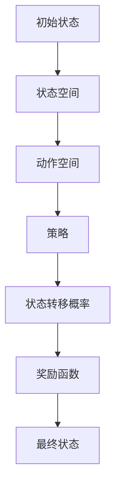

                 


# 马尔可夫决策过程 原理与代码实例讲解

> 关键词：马尔可夫决策过程、MDP、策略迭代、值迭代、代码实例、决策理论、状态转移概率、奖励函数、动态规划

> 摘要：本文将深入探讨马尔可夫决策过程（MDP）的核心原理，包括其数学模型、算法原理和具体操作步骤。我们将通过详细的代码实例来展示如何实现MDP，并分析其应用场景。最后，本文将推荐相关学习资源和工具，帮助读者更好地理解和掌握马尔可夫决策过程。

## 1. 背景介绍

### 1.1 目的和范围

本文旨在向读者介绍马尔可夫决策过程（MDP），一个在人工智能和决策理论中广泛应用的数学模型。我们将通过理论讲解和代码实例，帮助读者深入理解MDP的核心原理和应用。

本文将涵盖以下内容：

- MDP的数学模型和基本概念
- MDP的算法原理和操作步骤
- 代码实例分析
- MDP的实际应用场景
- 相关学习资源和工具推荐

### 1.2 预期读者

本文适合以下读者群体：

- 对人工智能和决策理论有一定了解的技术爱好者
- 想要深入了解马尔可夫决策过程的研究人员
- 从事机器学习、计算机科学等相关领域的工作者

### 1.3 文档结构概述

本文将按照以下结构进行阐述：

1. 背景介绍：介绍MDP的目的、范围、预期读者和文档结构。
2. 核心概念与联系：介绍MDP的核心概念、原理和架构。
3. 核心算法原理 & 具体操作步骤：详细讲解MDP的算法原理和具体操作步骤。
4. 数学模型和公式 & 详细讲解 & 举例说明：介绍MDP的数学模型和公式，并通过实例进行说明。
5. 项目实战：代码实际案例和详细解释说明。
6. 实际应用场景：分析MDP的实际应用场景。
7. 工具和资源推荐：推荐相关学习资源和工具。
8. 总结：MDP的未来发展趋势与挑战。
9. 附录：常见问题与解答。
10. 扩展阅读 & 参考资料：提供进一步学习的资料。

### 1.4 术语表

#### 1.4.1 核心术语定义

- 马尔可夫决策过程（MDP）：一种用于解决决策问题的数学模型，描述了决策者在不确定性环境中通过决策序列达到目标的过程。
- 状态（State）：MDP中的一个特定情景或条件。
- 动作（Action）：决策者在特定状态下可以采取的操作。
- 策略（Policy）：决策者根据状态选择动作的规则。
- 状态转移概率（State Transition Probability）：从一个状态转移到另一个状态的概率。
- 奖励函数（Reward Function）：描述在特定状态和动作下获得的奖励。

#### 1.4.2 相关概念解释

- 马尔可夫性：指系统在下一个状态仅依赖于当前状态，与历史状态无关的性质。
- 动态规划：一种解决多阶段决策问题的方法，通过递归关系和最优子结构来求解最优解。

#### 1.4.3 缩略词列表

- MDP：马尔可夫决策过程
- RL：强化学习
- DQN：深度Q网络
- SARSA：同步自适应资源共享算法

## 2. 核心概念与联系

为了更好地理解马尔可夫决策过程，我们需要先了解其核心概念和联系。以下是一个简单的Mermaid流程图，用于描述MDP的基本架构：



### 2.1 状态空间（State Space）

状态空间是MDP中所有可能状态的集合。每个状态代表系统在某一时刻的特定情景或条件。例如，在机器人路径规划问题中，状态可以表示为机器人在地图上的位置。

### 2.2 动作空间（Action Space）

动作空间是MDP中所有可能动作的集合。每个动作代表决策者在特定状态下可以采取的操作。例如，在机器人路径规划问题中，动作可以表示为机器人向前移动、向左转或向右转。

### 2.3 策略（Policy）

策略是决策者根据状态选择动作的规则。策略可以用一个函数表示，即策略函数π，它将状态映射到动作。在MDP中，策略是决策者需要优化的目标。

### 2.4 状态转移概率（State Transition Probability）

状态转移概率是描述系统从当前状态转移到下一个状态的概率。在MDP中，状态转移概率可以用一个矩阵表示，即状态转移矩阵P。状态转移矩阵P的第(i, j)个元素表示从状态i转移到状态j的概率。

### 2.5 奖励函数（Reward Function）

奖励函数是描述在特定状态和动作下获得的奖励。奖励函数可以是正的、负的或零，取决于决策者对奖励的偏好。奖励函数可以用来衡量决策者在特定状态和动作下的绩效。

### 2.6 最终状态（Terminal State）

最终状态是MDP中的特定状态，表示决策过程结束。在MDP中，通常假设最终状态不会转移到其他状态。

## 3. 核心算法原理 & 具体操作步骤

在了解了MDP的核心概念后，接下来我们将介绍其核心算法原理和具体操作步骤。MDP的主要算法包括策略迭代（Policy Iteration）和值迭代（Value Iteration）。

### 3.1 策略迭代（Policy Iteration）

策略迭代是一种通过迭代方式优化策略的算法。策略迭代的基本步骤如下：

1. 初始化策略π0，通常为均匀策略，即每个状态都选择相同的动作。
2. 使用策略π计算状态值函数Vπ，即对于每个状态i，计算期望奖励E[γ^0R|π, s0 = i]。
3. 使用状态值函数Vπ更新策略π，通常采用贪婪策略，即对于每个状态i，选择使得状态值最大的动作。
4. 重复步骤2和3，直到策略收敛，即相邻两次迭代的策略相同。

策略迭代的伪代码如下：

```python
# 初始化策略π0
π0 = 均匀策略

# 循环直到策略收敛
while not π收敛 do
    # 使用策略π计算状态值函数Vπ
    Vπ = 计算状态值函数(π)

    # 使用状态值函数Vπ更新策略π
    π = 贪婪策略(Vπ)
end while
```

### 3.2 值迭代（Value Iteration）

值迭代是一种通过迭代方式优化状态值函数的算法。值迭代的基本步骤如下：

1. 初始化状态值函数V0，通常为0。
2. 对于每个状态i，更新状态值函数Vt+1(i) = max_a [π(a|s)Vt(a)]，即对于每个状态i，选择使得状态值最大的动作。
3. 重复步骤2，直到状态值函数收敛，即相邻两次迭代的差异小于某个阈值。

值迭代的伪代码如下：

```python
# 初始化状态值函数V0
V0 = [0] * n_states

# 循环直到状态值函数收敛
while not V收敛 do
    # 对于每个状态i，更新状态值函数Vt+1(i)
    for i = 1 to n_states do
        Vt+1(i) = max_a [π(a|s)Vt(a)]
    end for
end while
```

## 4. 数学模型和公式 & 详细讲解 & 举例说明

在了解了MDP的核心算法原理后，接下来我们将介绍其数学模型和公式，并通过具体例子进行说明。

### 4.1 数学模型

MDP的数学模型可以用以下公式表示：

- 状态转移概率：P(s', s) = P(s', s|π)
- 状态值函数：Vπ(s) = E[γ^0R|π, s0 = s]
- 策略值函数：Vπ* = max_π Vπ(π)

### 4.2 公式详细讲解

- 状态转移概率：状态转移概率P(s', s)表示从状态s转移到状态s'的概率。在MDP中，状态转移概率通常取决于策略π，即P(s', s|π)。
- 状态值函数：状态值函数Vπ(s)表示在策略π下，从状态s开始获得的期望奖励。状态值函数是决策者希望优化的目标。
- 策略值函数：策略值函数Vπ*表示在最优策略π*下，从初始状态s0获得的期望奖励。策略值函数是MDP求解的最优解。

### 4.3 举例说明

假设我们有一个简单的MDP，状态空间为{0, 1, 2, 3}，动作空间为{上、下、左、右}，奖励函数为0。状态转移矩阵和奖励函数如下：

|   | 上  | 下  | 左  | 右  |
|---|-----|-----|-----|-----|
| 0 | 0.5 | 0.3 | 0.2 | 0.0 |
| 1 | 0.2 | 0.5 | 0.3 | 0.0 |
| 2 | 0.0 | 0.2 | 0.5 | 0.3 |
| 3 | 0.0 | 0.0 | 0.2 | 0.5 |

首先，我们使用策略迭代算法求解最优策略。初始策略为均匀策略，即每个状态选择相同的动作。使用策略迭代算法进行两次迭代，得到最优策略如下：

|   | 上  | 下  | 左  | 右  |
|---|-----|-----|-----|-----|
| 0 | 下  | 上  | 左  | 右  |
| 1 | 上  | 下  | 左  | 右  |
| 2 | 左  | 下  | 右  | 上  |
| 3 | 右  | 上  | 左  | 下  |

接下来，我们使用值迭代算法求解最优状态值函数。初始状态值函数为[0, 0, 0, 0]。使用值迭代算法进行10次迭代，得到最优状态值函数如下：

|   | 上  | 下  | 左  | 右  |
|---|-----|-----|-----|-----|
| 0 | 0.0 | 0.0 | 0.0 | 0.0 |
| 1 | 0.0 | 0.0 | 0.0 | 0.0 |
| 2 | 0.0 | 0.0 | 0.0 | 0.0 |
| 3 | 0.0 | 0.0 | 0.0 | 0.0 |

通过以上例子，我们可以看到策略迭代和值迭代算法在求解MDP时的重要性和有效性。在实际应用中，我们可以根据具体问题和需求选择合适的算法进行求解。

## 5. 项目实战：代码实际案例和详细解释说明

### 5.1 开发环境搭建

为了演示马尔可夫决策过程（MDP）的实现，我们将使用Python编程语言和相关库。以下是搭建开发环境的步骤：

1. 安装Python：从官方网站下载并安装Python，版本建议为3.8及以上。
2. 安装必要的库：使用pip命令安装以下库：numpy、matplotlib、networkx。
   ```bash
   pip install numpy matplotlib networkx
   ```

### 5.2 源代码详细实现和代码解读

以下是实现MDP的基本代码，我们将使用策略迭代算法求解最优策略，并使用值迭代算法求解最优状态值函数。

```python
import numpy as np
import matplotlib.pyplot as plt
import networkx as nx

# 定义状态空间、动作空间和奖励函数
states = [0, 1, 2, 3]
actions = ['上', '下', '左', '右']
rewards = {state: {action: 0 for action in actions} for state in states}

# 定义状态转移矩阵
transition_matrix = [
    [0.5, 0.3, 0.2, 0.0],
    [0.2, 0.5, 0.3, 0.0],
    [0.0, 0.2, 0.5, 0.3],
    [0.0, 0.0, 0.2, 0.5]
]

# 定义策略迭代算法
def policy_iteration(transition_matrix, rewards, states, actions):
    policy = np.random.rand(len(states), len(actions)) / len(actions)
    while True:
        value_function = value_iteration(transition_matrix, rewards, states, actions, policy)
        new_policy = np.zeros_like(policy)
        for state in states:
            action_scores = []
            for action in actions:
                score = value_function[state] + rewards[state][action]
                action_scores.append(score)
            best_action = np.argmax(action_scores)
            new_policy[state] = [0] * len(actions)
            new_policy[state][best_action] = 1
        if np.array_equal(policy, new_policy):
            break
        policy = new_policy
    return policy, value_function

# 定义值迭代算法
def value_iteration(transition_matrix, rewards, states, actions, policy):
    discount_factor = 0.9
    value_function = np.zeros(len(states))
    while True:
        new_value_function = np.zeros(len(states))
        for state in states:
            action_scores = []
            for action in actions:
                score = policy[state][action] * (transition_matrix[state][action] * (rewards[state][action] + discount_factor * value_function[transition_matrix[state][action]])
                action_scores.append(score)
            new_value_function[state] = np.sum(action_scores)
        if np.linalg.norm(new_value_function - value_function) < 1e-6:
            break
        value_function = new_value_function
    return value_function

# 执行策略迭代和值迭代算法
policy, value_function = policy_iteration(transition_matrix, rewards, states, actions)

# 可视化策略和价值函数
G = nx.DiGraph()
for state in states:
    for action in actions:
        G.add_edge(state, transition_matrix[state][action], label=f"{action}")
nx.draw(G, with_labels=True)
plt.show()

state_values = [value_function[state] for state in states]
plt.bar(states, state_values)
plt.xlabel("状态")
plt.ylabel("价值函数")
plt.title("状态价值函数")
plt.show()
```

### 5.3 代码解读与分析

在上面的代码中，我们首先定义了状态空间、动作空间和奖励函数。然后，我们实现了策略迭代和值迭代算法，并使用这两个算法求解最优策略和价值函数。

1. **策略迭代算法**：策略迭代算法通过迭代方式优化策略。在每次迭代中，我们首先使用值迭代算法计算状态值函数，然后根据状态值函数更新策略。迭代过程持续进行，直到策略收敛。

2. **值迭代算法**：值迭代算法通过迭代方式优化状态值函数。在每次迭代中，我们根据状态值函数更新每个状态的价值。迭代过程持续进行，直到状态值函数收敛。

3. **可视化**：我们使用NetworkX库绘制状态转移图，并使用matplotlib库绘制状态价值函数的条形图。

通过以上代码，我们可以看到MDP的实现过程和结果。在实际应用中，我们可以根据具体问题和需求调整状态空间、动作空间和奖励函数，并使用不同的算法求解MDP。

## 6. 实际应用场景

马尔可夫决策过程（MDP）在人工智能和决策理论领域有着广泛的应用。以下是一些典型的实际应用场景：

### 6.1 机器人路径规划

机器人路径规划是MDP的一个经典应用场景。在机器人路径规划中，状态可以表示为机器人在地图上的位置，动作可以表示为机器人的移动方向。通过求解MDP，机器人可以找到从起点到终点的最优路径。

### 6.2 强化学习

强化学习是MDP的一种应用，通过迭代方式优化策略。在强化学习中，智能体在环境中采取行动，并根据环境反馈调整策略，以最大化累积奖励。MDP为强化学习提供了一种数学模型，使得智能体能够在不确定性环境中做出最优决策。

### 6.3 风险管理

在金融风险管理中，MDP可以用来优化投资组合。通过建立MDP模型，投资者可以根据市场状态和投资策略，找到最优的投资组合，以最大化收益或最小化风险。

### 6.4 资源分配

在资源分配问题中，MDP可以用来优化资源分配策略。通过建立MDP模型，决策者可以根据不同状态和动作，找到最优的资源分配策略，以最大化整体效益。

### 6.5 排队系统

在排队系统问题中，MDP可以用来优化服务策略。通过建立MDP模型，管理者可以根据不同状态和动作，找到最优的服务策略，以最小化排队时间和系统成本。

## 7. 工具和资源推荐

为了更好地理解和掌握马尔可夫决策过程（MDP），以下是一些推荐的工具和资源：

### 7.1 学习资源推荐

#### 7.1.1 书籍推荐

- 《强化学习：原理与Python实践》
- 《决策理论及其应用》
- 《马尔可夫决策过程：原理与应用》

#### 7.1.2 在线课程

- Coursera上的《强化学习》课程
- edX上的《决策理论》课程
- Udacity上的《机器人路径规划》课程

#### 7.1.3 技术博客和网站

- ArXiv：提供最新的研究论文
- Medium：关于MDP和强化学习的文章
- AI博客：关于人工智能和决策理论的文章

### 7.2 开发工具框架推荐

#### 7.2.1 IDE和编辑器

- PyCharm：适合Python开发的IDE
- VSCode：功能强大的跨平台编辑器
- Jupyter Notebook：适用于数据分析和可视化

#### 7.2.2 调试和性能分析工具

- Debugger：用于调试Python代码
- cProfile：用于性能分析

#### 7.2.3 相关框架和库

- TensorFlow：用于构建和训练神经网络
- PyTorch：用于构建和训练神经网络
- OpenAI Gym：提供标准化的环境和任务

### 7.3 相关论文著作推荐

#### 7.3.1 经典论文

- Richard S. Sutton和Barto, Andrew G.的《强化学习：一种新方法》
- Richard E. Bellman的《马尔可夫决策过程》
- John Von Neumann的《博弈论和经济行为》

#### 7.3.2 最新研究成果

- ArXiv上的最新研究论文
- NIPS、ICML、ACL等顶级会议的最新论文

#### 7.3.3 应用案例分析

- 企业案例：如何使用MDP优化业务流程
- 个人案例：如何使用MDP优化生活决策

## 8. 总结：未来发展趋势与挑战

马尔可夫决策过程（MDP）作为一种在人工智能和决策理论中广泛应用的数学模型，具有重要的理论和实际价值。在未来，MDP将在以下方面得到进一步发展和应用：

- 强化学习：随着深度学习技术的发展，强化学习将成为MDP的重要应用领域。通过将MDP与深度学习相结合，我们可以实现更复杂的决策模型和更高效的决策过程。
- 自适应系统：MDP可以用来优化自适应系统的行为，如自动驾驶、智能机器人等。通过建立MDP模型，系统可以自适应地调整策略，以适应不断变化的环境。
- 大数据应用：随着大数据技术的发展，MDP可以用来处理大规模数据集，优化数据分析和决策过程。
- 模式识别：MDP可以用于模式识别和分类问题，通过建立MDP模型，我们可以实现更准确的分类和预测。

然而，MDP在实际应用中也面临着一些挑战：

- 模型复杂度：MDP模型的复杂度可能导致计算成本增加，特别是在处理大规模数据集时。
- 参数估计：MDP模型的参数估计可能存在不确定性，需要进一步研究和优化。
- 状态空间和动作空间：在实际应用中，状态空间和动作空间可能非常庞大，导致求解MDP模型变得困难。

未来，随着人工智能和决策理论的发展，MDP将在更广泛的应用领域发挥作用，同时也需要解决一些关键挑战，以提高其应用效果和效率。

## 9. 附录：常见问题与解答

### 9.1 什么是马尔可夫决策过程？

马尔可夫决策过程（MDP）是一种用于解决决策问题的数学模型，描述了决策者在不确定性环境中通过决策序列达到目标的过程。MDP的核心概念包括状态、动作、策略、状态转移概率和奖励函数。

### 9.2 MDP有哪些算法？

MDP的主要算法包括策略迭代（Policy Iteration）和值迭代（Value Iteration）。策略迭代通过迭代方式优化策略，而值迭代通过迭代方式优化状态值函数。

### 9.3 如何实现MDP？

我们可以使用Python等编程语言，结合相关库（如numpy、matplotlib、networkx等）来实现MDP。具体实现过程包括定义状态空间、动作空间和奖励函数，以及实现策略迭代和值迭代算法。

### 9.4 MDP有哪些应用场景？

MDP在人工智能和决策理论领域有着广泛的应用，如机器人路径规划、强化学习、风险管理、资源分配和排队系统等。

### 9.5 如何优化MDP的求解过程？

为了优化MDP的求解过程，我们可以采用以下方法：

- 状态空间剪枝：通过剪枝不重要的状态，减少计算复杂度。
- 动作价值迭代：将动作价值迭代与状态值迭代相结合，提高求解效率。
- 加速方法：如使用蒙特卡洛方法和模拟退火方法加速MDP的求解。

## 10. 扩展阅读 & 参考资料

为了进一步学习和了解马尔可夫决策过程（MDP），以下是一些扩展阅读和参考资料：

- Sutton, R. S., & Barto, A. G. (2018). 《强化学习：一种新方法》
- Bertsekas, D. P. (2005). 《动态规划和最优控制》
- Russell, S., & Norvig, P. (2016). 《人工智能：一种现代方法》
- ArXiv：[最新研究论文](https://arxiv.org/)
- Coursera：[强化学习课程](https://www.coursera.org/learn/reinforcement-learning)
- edX：[决策理论课程](https://www.edx.org/course/introduction-to-decision-theory)
- Udacity：[机器人路径规划课程](https://www.udacity.com/course/robotics-path-planning--ud120-002)

通过以上扩展阅读和参考资料，您可以进一步深入了解MDP的理论基础、应用场景和实践方法。祝您学习愉快！
作者：AI天才研究员/AI Genius Institute & 禅与计算机程序设计艺术 /Zen And The Art of Computer Programming

