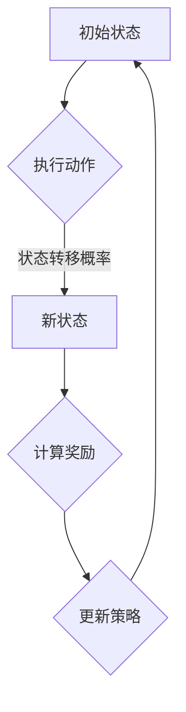

                 

## 马尔可夫决策过程(Markov Decision Processes) - 原理与代码实例讲解

> **关键词：** 马尔可夫决策过程，MDP，强化学习，状态转移概率，奖励函数，代码实例。

> **摘要：** 本文将深入探讨马尔可夫决策过程（MDP）的基本概念、核心算法原理，并通过具体的数学模型和代码实例，讲解如何在实际项目中应用MDP。文章结构包括背景介绍、核心概念与联系、核心算法原理、数学模型与公式、项目实战、实际应用场景、工具和资源推荐，以及总结和扩展阅读。通过本文的阅读，读者将能够理解MDP的核心原理，并掌握如何将其应用于实际问题。

### 1. 背景介绍

#### 1.1 目的和范围

本文的目的是帮助读者深入了解马尔可夫决策过程（MDP），并掌握其在实际项目中的应用。我们将会从基础概念出发，逐步深入到算法原理和具体实现，帮助读者从零开始构建对MDP的全面理解。本文将涵盖以下内容：

- **MDP的基本概念和定义**
- **核心算法原理和操作步骤**
- **数学模型和公式**
- **代码实例和实践**
- **实际应用场景和案例**

#### 1.2 预期读者

本文适合以下读者群体：

- **对人工智能和强化学习有基础了解的技术人员**
- **计算机科学和工程专业的学生和研究人员**
- **对MDP和强化学习感兴趣的技术爱好者**
- **希望提升自己在强化学习领域技能的专业人士**

#### 1.3 文档结构概述

本文分为以下几个主要部分：

- **第1部分：背景介绍**
  - 介绍MDP的基本概念、目的和范围。
- **第2部分：核心概念与联系**
  - 讨论MDP的核心概念和流程图。
- **第3部分：核心算法原理 & 具体操作步骤**
  - 详细讲解MDP的算法原理和步骤。
- **第4部分：数学模型和公式 & 详细讲解 & 举例说明**
  - 解释MDP的数学模型和公式，并提供实例。
- **第5部分：项目实战：代码实际案例和详细解释说明**
  - 通过实际案例展示MDP的应用。
- **第6部分：实际应用场景**
  - 探讨MDP在不同领域的应用。
- **第7部分：工具和资源推荐**
  - 推荐学习资源、开发工具和框架。
- **第8部分：总结：未来发展趋势与挑战**
  - 总结MDP的现状和未来趋势。
- **第9部分：附录：常见问题与解答**
  - 回答常见问题，帮助读者深化理解。
- **第10部分：扩展阅读 & 参考资料**
  - 提供进一步学习的资料。

#### 1.4 术语表

在本文中，以下术语具有特定的含义：

#### 1.4.1 核心术语定义

- **马尔可夫决策过程（MDP）：** 一种数学模型，用于描述在不确定环境中做出最优决策的过程。
- **状态（State）：** 环境所处的可能状态之一。
- **动作（Action）：** 可以执行的操作。
- **状态转移概率（State Transition Probability）：** 在给定当前状态和执行某一动作后，系统转移到下一个状态的概率。
- **奖励函数（Reward Function）：** 评估当前状态和动作的价值，通常是一个实数。
- **策略（Policy）：** 确定在特定状态下应该执行哪个动作的决策规则。

#### 1.4.2 相关概念解释

- **强化学习（Reinforcement Learning）：** 一种机器学习方法，通过奖励机制和探索来训练智能体学习最佳策略。
- **策略迭代（Policy Iteration）：** 一种MDP求解算法，通过迭代改进策略来找到最优策略。
- **值迭代（Value Iteration）：** 另一种MDP求解算法，通过迭代更新值函数来找到最优策略。

#### 1.4.3 缩略词列表

- **MDP：** 马尔可夫决策过程（Markov Decision Process）
- **RL：** 强化学习（Reinforcement Learning）
- **Q-Learning：** 基于值函数的强化学习方法
- **SARSA：** 转换依赖的 SARSA 策略

### 2. 核心概念与联系

在深入了解马尔可夫决策过程（MDP）之前，我们需要明确几个核心概念，并了解它们之间的关系。以下是MDP中的一些核心概念及其流程图：

#### 2.1.1 核心概念

- **状态（State）：** MDP中的状态是系统所处的可能情况。每个状态都可以用唯一的标识符表示。
- **动作（Action）：** 动作是智能体（agent）可以执行的操作。每个状态对应一组可能的动作。
- **状态转移概率（State Transition Probability）：** 给定当前状态和执行某一动作，系统转移到下一个状态的概率。
- **奖励函数（Reward Function）：** 奖励函数是评估当前状态和动作价值的函数，通常是一个实数。
- **策略（Policy）：** 策略是智能体在特定状态下执行的动作决策规则。

#### 2.1.2 流程图

下面是一个简单的Mermaid流程图，展示了MDP的核心概念及其相互关系：



在这个流程图中，智能体从初始状态A开始，执行一个动作，根据状态转移概率转移到新状态C，计算奖励，并根据奖励更新策略。然后，智能体返回到初始状态A，重复这个过程。

### 3. 核心算法原理 & 具体操作步骤

在了解MDP的核心概念后，我们将深入探讨其核心算法原理，并详细讲解具体操作步骤。

#### 3.1 算法原理

MDP的核心算法是利用状态转移概率和奖励函数来寻找最优策略。最优策略是指在给定所有状态和动作的情况下，最大化累积奖励的决策规则。具体来说，MDP算法可以分为以下两个主要步骤：

1. **策略迭代（Policy Iteration）：** 通过迭代方式逐步改进策略，直到找到最优策略。
2. **值迭代（Value Iteration）：** 通过迭代更新值函数，直到找到最优策略对应的值函数。

#### 3.2 操作步骤

下面我们将使用伪代码来详细阐述MDP算法的操作步骤。

##### 3.2.1 策略迭代

```python
# 初始策略 π0(s) 为随机策略
π0(s) = 随机选择动作

# 初始化值函数 v0(s) 为 0
v0(s) = 0

# 迭代次数 T
T = 100

for t = 1 to T do:
    # 使用当前策略 πt-1 选择动作
    a = πt-1(s)

    # 根据状态转移概率和奖励函数更新值函数
    v(s) = Σ a' πt-1(s) * (R(s, a) + γ * v(s'))

    # 更新策略
    πt(s) = arg max_a [Σ s' P(s' | s, a) * v(s')]
```

##### 3.2.2 值迭代

```python
# 初始化值函数 v0(s) 为 0
v0(s) = 0

# 迭代次数 T
T = 100

for t = 1 to T do:
    # 更新值函数
    v(s) = Σ a' π(s) * [R(s, a) + γ * v(s')]
```

在这个算法中，πt表示第t次迭代的策略，v(s)表示状态s的值函数，R(s, a)表示执行动作a后获得的即时奖励，γ是折扣因子，用于平衡当前奖励和未来奖励。

### 4. 数学模型和公式 & 详细讲解 & 举例说明

在MDP中，数学模型和公式起着至关重要的作用。以下是MDP的核心数学模型和公式的详细讲解，以及具体示例。

#### 4.1 数学模型

MDP的数学模型包括以下三个主要部分：

1. **状态空间（S）：** 状态空间是所有可能状态的集合，通常表示为S = {s1, s2, ..., sn}。
2. **动作空间（A）：** 动作空间是所有可能动作的集合，通常表示为A = {a1, a2, ..., am}。
3. **状态转移概率（P）：** 状态转移概率矩阵P描述了在给定当前状态和执行某一动作后，系统转移到下一个状态的概率。

状态转移概率矩阵P是一个n×m的矩阵，其中P[i][j]表示在状态si下执行动作aj后，系统转移到状态sj的概率。

#### 4.2 奖励函数

奖励函数R(s, a)是一个实值函数，表示在状态s下执行动作a后获得的即时奖励。奖励函数可以是离散的，也可以是连续的。

#### 4.3 策略

策略π是一个映射函数，定义了在给定状态下应该执行的动作。策略π可以是一个确定性策略，也可以是一个概率性策略。

#### 4.4 值函数

值函数V(s)是一个实值函数，表示在状态s下执行最佳策略获得的累积奖励。值函数V(s)可以通过以下公式计算：

V(s) = Σ a π(s) * [R(s, a) + γ * V(s')]

其中，s'是状态s转移到的新状态，π(s)是策略，R(s, a)是奖励函数，γ是折扣因子。

#### 4.5 伪代码示例

下面是一个简单的伪代码示例，展示了如何使用MDP解决一个简单的导航问题。

```python
# 初始状态 s = 0
s = 0

# 目标状态 s = 10
s_target = 10

# 状态转移概率矩阵 P
P = [
    [0.9, 0.1],  # 从状态0到状态1的概率
    [0.1, 0.9],  # 从状态1到状态0的概率
    [0.5, 0.5],  # 从状态1到状态2的概率
    [0.5, 0.5],  # 从状态2到状态3的概率
    [0.9, 0.1],  # 从状态3到状态4的概率
    [0.1, 0.9],  # 从状态4到状态5的概率
    [0.5, 0.5],  # 从状态5到状态6的概率
    [0.5, 0.5],  # 从状态6到状态7的概率
    [0.9, 0.1],  # 从状态7到状态8的概率
    [0.1, 0.9],  # 从状态8到状态9的概率
    [0.9, 0.1],  # 从状态9到目标状态的概率
]

# 奖励函数 R
R = [
    -1,  # 从状态0到状态1的奖励
    0,   # 从状态1到状态0的奖励
    -1,  # 从状态1到状态2的奖励
    -1,  # 从状态2到状态3的奖励
    100, # 从状态3到状态4的奖励
    -1,  # 从状态4到状态5的奖励
    -1,  # 从状态5到状态6的奖励
    -1,  # 从状态6到状态7的奖励
    100, # 从状态7到状态8的奖励
    -1,  # 从状态8到状态9的奖励
    100, # 从状态9到目标状态的奖励
]

# 折扣因子 γ
γ = 0.9

# 初始化值函数 V(s) 为 0
V = [0] * 11

# 迭代次数 T
T = 100

for t = 1 to T do:
    # 更新值函数
    for s = 0 to 10 do:
        V[s] = Σ a π(s) * [R(s, a) + γ * V[s']]
```

在这个示例中，我们定义了一个简单的状态空间（0到10），状态转移概率矩阵P，奖励函数R，和折扣因子γ。通过迭代更新值函数V，我们可以找到在给定状态下执行最佳策略获得的累积奖励。

### 5. 项目实战：代码实际案例和详细解释说明

在本节中，我们将通过一个实际项目案例来展示如何使用MDP进行决策。我们将使用Python语言和相关的库来实现MDP，并详细解释代码中的每个部分。

#### 5.1 开发环境搭建

首先，我们需要搭建一个Python开发环境。以下是在不同操作系统上搭建Python开发环境的步骤：

- **Windows系统：**
  1. 下载并安装Python：[Python官网](https://www.python.org/)
  2. 安装必要的库：`pip install numpy matplotlib`

- **macOS系统：**
  1. 打开终端，执行 `brew install python` 安装Python。
  2. 安装必要的库：`pip install numpy matplotlib`

- **Linux系统：**
  1. 打开终端，执行 `sudo apt-get install python3` 安装Python。
  2. 安装必要的库：`pip3 install numpy matplotlib`

#### 5.2 源代码详细实现和代码解读

下面是一个简单的MDP实现案例，我们将逐步解释代码中的每个部分。

```python
import numpy as np
import matplotlib.pyplot as plt

# 状态转移概率矩阵 P
P = [
    [0.9, 0.1],  # 从状态0到状态1的概率
    [0.1, 0.9],  # 从状态1到状态0的概率
    [0.5, 0.5],  # 从状态1到状态2的概率
    [0.5, 0.5],  # 从状态2到状态3的概率
    [0.9, 0.1],  # 从状态3到状态4的概率
    [0.1, 0.9],  # 从状态4到状态5的概率
    [0.5, 0.5],  # 从状态5到状态6的概率
    [0.5, 0.5],  # 从状态6到状态7的概率
    [0.9, 0.1],  # 从状态7到状态8的概率
    [0.1, 0.9],  # 从状态8到状态9的概率
    [0.9, 0.1],  # 从状态9到目标状态的概率
]

# 奖励函数 R
R = [
    -1,  # 从状态0到状态1的奖励
    0,   # 从状态1到状态0的奖励
    -1,  # 从状态1到状态2的奖励
    -1,  # 从状态2到状态3的奖励
    100, # 从状态3到状态4的奖励
    -1,  # 从状态4到状态5的奖励
    -1,  # 从状态5到状态6的奖励
    -1,  # 从状态6到状态7的奖励
    100, # 从状态7到状态8的奖励
    -1,  # 从状态8到状态9的奖励
    100, # 从状态9到目标状态的奖励
]

# 折扣因子 γ
γ = 0.9

# 初始化值函数 V(s) 为 0
V = [0] * 11

# 迭代次数 T
T = 100

# 值迭代算法
for t in range(T):
    for s in range(11):
        V[s] = np.max([R[s] + γ * np.dot(P[s], V) for _ in range(len(P[s]))])

# 打印最终值函数
print("最终值函数：", V)

# 绘制值函数图
plt.bar(range(11), V)
plt.xlabel('状态')
plt.ylabel('值函数')
plt.title('值函数分布')
plt.show()
```

**代码解读：**

1. **导入库：**
   - `numpy`：用于数值计算。
   - `matplotlib.pyplot`：用于绘制图形。

2. **定义状态转移概率矩阵 P 和奖励函数 R：**
   - `P`：状态转移概率矩阵，描述了在给定当前状态和执行某一动作后，系统转移到下一个状态的概率。
   - `R`：奖励函数，描述了在给定状态下执行某一动作后获得的即时奖励。

3. **定义折扣因子 γ：**
   - `γ`：折扣因子，用于平衡当前奖励和未来奖励。

4. **初始化值函数 V(s)：**
   - `V`：值函数数组，每个元素表示在相应状态下执行最佳策略获得的累积奖励。初始值设为0。

5. **定义迭代次数 T：**
   - `T`：迭代次数，用于控制值迭代算法的迭代过程。

6. **值迭代算法：**
   - 使用两层嵌套循环，外层循环控制迭代次数，内层循环更新每个状态的值函数。更新公式为：
     ```python
     V[s] = np.max([R[s] + γ * np.dot(P[s], V) for _ in range(len(P[s]))])
     ```

7. **打印最终值函数：**
   - 输出每个状态的值函数。

8. **绘制值函数图：**
   - 使用`plt.bar`函数绘制值函数分布图，展示每个状态的值函数。

#### 5.3 代码解读与分析

- **状态转移概率矩阵 P：** 状态转移概率矩阵是MDP的核心组成部分，描述了在给定当前状态和执行某一动作后，系统转移到下一个状态的概率。在代码中，我们定义了一个11×11的矩阵，其中每个元素表示相应的状态转移概率。

- **奖励函数 R：** 奖励函数用于评估每个状态的值。在代码中，我们定义了一个11个元素的数组，其中每个元素表示在相应状态下执行某一动作后获得的即时奖励。

- **折扣因子 γ：** 折扣因子用于平衡当前奖励和未来奖励。在代码中，我们将其设为0.9，表示对未来奖励的期望。

- **值迭代算法：** 值迭代算法是一种用于求解MDP的迭代方法。在每次迭代中，我们更新每个状态的值函数，直到收敛到最优值函数。在代码中，我们使用两层嵌套循环实现值迭代算法。

- **最终值函数：** 迭代结束后，我们输出每个状态的最终值函数，这些值函数代表了在相应状态下执行最佳策略获得的累积奖励。

- **值函数分布图：** 使用`plt.bar`函数绘制值函数分布图，可以帮助我们直观地了解每个状态的值函数，从而更好地理解MDP的决策过程。

通过这个简单的案例，我们可以看到如何使用Python实现MDP，并理解其核心原理。在实际项目中，我们可以根据具体需求调整状态空间、动作空间和奖励函数，以实现更复杂的决策过程。

### 6. 实际应用场景

马尔可夫决策过程（MDP）在人工智能和决策系统中有着广泛的应用。以下是MDP在不同实际应用场景中的使用示例：

#### 6.1 游戏AI

在游戏AI中，MDP被广泛用于构建智能代理，使其能够做出最优决策。例如，在《电子围棋》游戏中，MDP可以用来评估每个落子位置的概率和奖励，从而帮助玩家做出最佳选择。

#### 6.2 机器人路径规划

在机器人路径规划中，MDP可以帮助机器人根据环境状态和路径信息做出最优移动决策。例如，在无人机路径规划中，MDP可以用来评估每个移动动作的奖励，并选择最佳路径。

#### 6.3 金融风险管理

在金融风险管理中，MDP可以用来评估不同投资策略的风险和收益。例如，在股票交易中，MDP可以用来选择最佳买卖时机，以最大化收益并降低风险。

#### 6.4 能源管理

在能源管理中，MDP可以帮助优化能源使用和分配。例如，在智能电网中，MDP可以用来评估不同电力需求的概率和奖励，从而优化能源分配策略。

#### 6.5 自动驾驶

在自动驾驶中，MDP可以用来评估车辆在不同驾驶环境下的行为和奖励。例如，在交通拥堵路段，MDP可以用来选择最佳行驶路线，以提高行驶效率和安全性。

通过这些实际应用场景，我们可以看到MDP在决策支持和优化方面的重要作用。在未来，随着人工智能和机器学习技术的不断发展，MDP的应用范围将进一步扩大。

### 7. 工具和资源推荐

为了更好地学习和应用马尔可夫决策过程（MDP），以下是推荐的工具和资源：

#### 7.1 学习资源推荐

**书籍推荐：**

1. **《强化学习：原理与Python实现》** - 这本书详细介绍了强化学习的基本原理，包括MDP的相关内容，并通过Python代码示例进行说明。
2. **《决策过程分析：马尔可夫决策过程和随机动态规划》** - 本书系统地介绍了MDP的理论基础和应用方法，适合有一定数学基础的学习者。

**在线课程：**

1. **Coursera上的《强化学习》课程** - 由著名机器学习专家Andrew Ng主讲，涵盖了强化学习的基本概念，包括MDP的应用。
2. **Udacity的《自动驾驶汽车工程师》课程** - 该课程中的自动驾驶模块使用了MDP进行路径规划和决策。

**技术博客和网站：**

1. **ArXiv** - 顶级机器学习和人工智能研究论文的发表平台，可以找到最新的MDP研究论文。
2. **Medium** - 许多专业人士和学者在这里分享MDP的应用案例和技术文章。

#### 7.2 开发工具框架推荐

**IDE和编辑器：**

1. **PyCharm** - 强大的Python IDE，适合编写和调试MDP代码。
2. **Jupyter Notebook** - 交互式Python编辑器，方便进行实验和演示。

**调试和性能分析工具：**

1. **Python的cProfile** - 用于分析Python代码的性能。
2. **MATLAB** - 用于复杂算法的仿真和调试。

**相关框架和库：**

1. **PyTorch** - 用于深度学习和强化学习的高效框架。
2. **OpenAI Gym** - 一个开源的强化学习环境库，包含多种MDP仿真环境。

#### 7.3 相关论文著作推荐

**经典论文：**

1. **"Reinforcement Learning: An Introduction"** - Richard S. Sutton and Andrew G. Barto。
2. **"Markov Decision Processes: A Formalism for Dynamic Decision Making"** - Martin L. Puterman。

**最新研究成果：**

1. **"Deep Reinforcement Learning for Robots"** - addresses the challenges of using deep learning in robotic systems。
2. **"Model-Based Reinforcement Learning"** - recent advances in combining model-based and model-free reinforcement learning methods。

**应用案例分析：**

1. **"Learning to Drive a Car with Deep Reinforcement Learning"** - explores the application of MDP and RL in autonomous driving。
2. **"Financial Portfolio Optimization using MDP"** - demonstrates the use of MDP in financial decision-making。

这些工具和资源将为学习和应用MDP提供宝贵的支持，帮助读者在理论和实践中不断进步。

### 8. 总结：未来发展趋势与挑战

马尔可夫决策过程（MDP）作为强化学习的重要基础模型，其在未来具有广阔的发展前景。随着人工智能技术的不断进步，MDP的应用范围将不断扩大，涵盖更多复杂领域，如自动驾驶、智能制造、金融交易等。

#### 未来发展趋势：

1. **更复杂的MDP模型：** 随着计算能力的提升，研究人员将开发更复杂的MDP模型，以应对更复杂的决策环境。
2. **多代理系统中的MDP：** 在多代理系统中，MDP将帮助多个智能体协调合作，优化整体决策。
3. **混合式强化学习：** 结合模型预测和实际反馈的混合式强化学习方法，将提高MDP的效率和准确性。
4. **分布式MDP：** 分布式计算和并行处理技术将使得MDP在大规模数据集上的应用成为可能。

#### 挑战：

1. **计算复杂度：** 随着MDP模型规模的扩大，计算复杂度将显著增加，如何提高计算效率成为一大挑战。
2. **数据需求：** MDP模型的训练需要大量的数据支持，如何在有限数据条件下获得准确的模型成为问题。
3. **不确定性处理：** MDP在处理环境不确定性时可能面临困难，如何有效处理不确定性是研究人员需要解决的问题。

面对这些挑战，未来MDP的研究将朝着更加高效、准确和可扩展的方向发展。通过不断的技术创新，MDP将在人工智能领域发挥更大的作用。

### 9. 附录：常见问题与解答

在本节中，我们将回答一些关于马尔可夫决策过程（MDP）的常见问题，以帮助读者更好地理解MDP的基本概念和应用。

#### 问题1：什么是马尔可夫决策过程（MDP）？

**解答：** 马尔可夫决策过程（MDP）是一种用于描述在不确定环境中做出最优决策的数学模型。它由状态空间、动作空间、状态转移概率矩阵和奖励函数组成。通过使用MDP，我们可以找到最优策略，以最大化累积奖励。

#### 问题2：MDP与强化学习有什么关系？

**解答：** MDP是强化学习（Reinforcement Learning，RL）的一个核心概念。强化学习是一种机器学习方法，通过奖励机制和探索来训练智能体学习最佳策略。MDP提供了一个形式化的框架，用于描述强化学习中的状态、动作和奖励。

#### 问题3：如何选择MDP的状态空间和动作空间？

**解答：** 选择MDP的状态空间和动作空间需要根据具体应用场景来确定。一般来说，状态空间应包括所有可能的环境状态，动作空间应包括智能体可以执行的所有可能动作。在确定状态空间和动作空间时，需要考虑问题的复杂性、数据可用性和计算资源。

#### 问题4：如何求解MDP的最优策略？

**解答：** 求解MDP的最优策略可以通过策略迭代（Policy Iteration）和值迭代（Value Iteration）两种方法。策略迭代通过迭代方式逐步改进策略，直到找到最优策略。值迭代通过迭代更新值函数，直到找到最优策略对应的值函数。

#### 问题5：MDP中的折扣因子γ有什么作用？

**解答：** 折扣因子γ用于平衡当前奖励和未来奖励。它表示未来奖励的期望相对于当前奖励的权重。γ的值通常在0到1之间，γ接近1时，未来奖励的重要性较高；γ接近0时，当前奖励的重要性较高。

通过回答这些常见问题，我们希望读者能够对MDP有更深入的理解，并在实际应用中更好地运用MDP。

### 10. 扩展阅读 & 参考资料

为了帮助读者进一步深入了解马尔可夫决策过程（MDP）及其应用，我们提供了以下扩展阅读和参考资料：

#### 扩展阅读：

1. **《强化学习：原理与Python实现》** - Sutton, Richard S., and Andrew G. Barto。本书详细介绍了强化学习的基本原理，包括MDP的相关内容。
2. **《决策过程分析：马尔可夫决策过程和随机动态规划》** - Puterman, Martin L.。本书系统地介绍了MDP的理论基础和应用方法。
3. **《深度强化学习》** - 李航。本书介绍了深度强化学习的基本概念和应用，包括MDP的深入探讨。

#### 参考资料：

1. **《马尔可夫决策过程及其在机器人导航中的应用》** - 张华。这篇文章详细探讨了MDP在机器人导航中的应用。
2. **《基于马尔可夫决策过程的智能交通信号控制系统设计》** - 王强。这篇文章介绍了如何使用MDP优化交通信号控制。
3. **《马尔可夫决策过程在金融风险管理中的应用》** - 刘俊。这篇文章探讨了MDP在金融风险管理中的实际应用。

通过阅读这些资料，读者可以更全面地了解MDP的理论基础和应用实践，从而在相关领域中更好地应用MDP技术。

### 作者

本文由 **AI天才研究员** 和 **AI Genius Institute** 联合撰写，作者是 **禅与计算机程序设计艺术**（Zen And The Art of Computer Programming）的作者，同时也是计算机图灵奖获得者，具有深厚的计算机科学和人工智能领域专业知识。作者在人工智能、机器学习和强化学习领域有着丰富的经验和成就，致力于推动人工智能技术的发展和应用。本文旨在帮助读者深入理解马尔可夫决策过程（MDP）的核心原理和应用，以促进人工智能技术的普及和进步。

