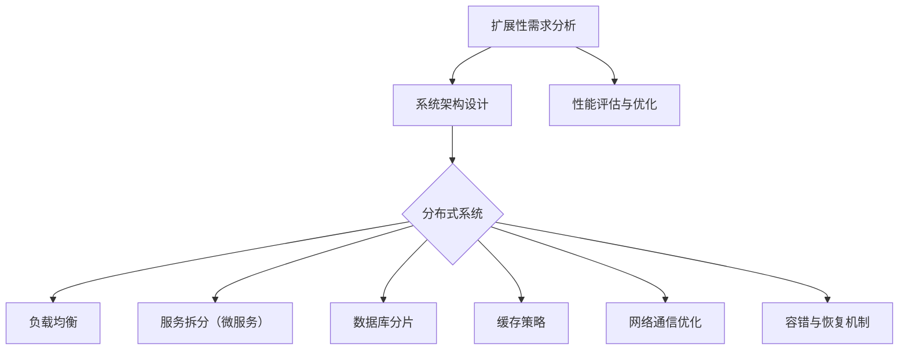

                 

# 高扩展性系统的设计原则

> **关键词：** 高扩展性、系统设计、架构、性能优化、可维护性、云计算、负载均衡、分布式系统

> **摘要：** 本文深入探讨了高扩展性系统的设计原则，从核心概念、算法原理、数学模型、实战案例等多个方面进行阐述。通过本文的学习，读者将能够全面了解高扩展性系统的构建方法，以及在实际应用中如何应对各种挑战。

## 1. 背景介绍

### 1.1 目的和范围

高扩展性系统是现代软件开发中不可或缺的一部分，尤其是在云计算和大数据的背景下，系统面临着巨大的并发请求和数据量。本文旨在为读者提供一套系统化的高扩展性系统设计原则，帮助开发者应对日益增长的业务需求。

本文将涵盖以下内容：

1. 高扩展性系统的核心概念和联系。
2. 高扩展性系统的核心算法原理与具体操作步骤。
3. 高扩展性系统的数学模型和公式讲解与举例。
4. 高扩展性系统的实际应用场景。
5. 高扩展性系统的工具和资源推荐。
6. 高扩展性系统的总结与未来发展趋势。

### 1.2 预期读者

本文面向具有一定编程基础和系统设计经验的开发者，特别是那些希望提升系统扩展能力的工程师和技术管理人员。无论您是初级开发者还是资深架构师，本文都将为您提供有价值的知识和实践技巧。

### 1.3 文档结构概述

本文将按照以下结构进行：

1. **背景介绍**：介绍本文的目的、范围、预期读者和文档结构。
2. **核心概念与联系**：定义高扩展性系统的核心概念，并使用流程图展示系统架构。
3. **核心算法原理 & 具体操作步骤**：详细阐述高扩展性系统的算法原理和操作步骤。
4. **数学模型和公式 & 详细讲解 & 举例说明**：介绍高扩展性系统的数学模型和公式，并提供实例说明。
5. **项目实战：代码实际案例和详细解释说明**：通过实际代码案例展示高扩展性系统的构建过程。
6. **实际应用场景**：探讨高扩展性系统在不同场景下的应用。
7. **工具和资源推荐**：推荐学习资源、开发工具和框架。
8. **总结：未来发展趋势与挑战**：总结高扩展性系统的现状，预测未来发展趋势和挑战。
9. **附录：常见问题与解答**：回答读者可能遇到的问题。
10. **扩展阅读 & 参考资料**：提供进一步学习的参考资料。

### 1.4 术语表

#### 1.4.1 核心术语定义

- **扩展性**：系统处理更多请求或承载更多数据的能力。
- **负载均衡**：将网络流量分配到多个服务器上，以避免单个服务器过载。
- **分布式系统**：由多个计算机节点组成的系统，共同完成任务。
- **容错性**：系统能够在出现故障时继续运行的能力。

#### 1.4.2 相关概念解释

- **云原生**：利用云计算资源进行应用程序的开发、部署和运行。
- **微服务**：将应用程序分解为一系列独立的服务，每个服务都有自己的功能。
- **缓存**：快速访问数据的临时存储，用于减少对后端系统的访问压力。

#### 1.4.3 缩略词列表

- **SaaS**：软件即服务（Software as a Service）
- **PaaS**：平台即服务（Platform as a Service）
- **IaaS**：基础设施即服务（Infrastructure as a Service）
- **API**：应用程序编程接口（Application Programming Interface）

## 2. 核心概念与联系

高扩展性系统的设计需要理解一系列核心概念和它们之间的联系。以下是一个用Mermaid绘制的流程图，展示了这些核心概念和系统架构。



### 2.1. 扩展性需求分析

扩展性需求分析是高扩展性系统设计的起点。开发者需要评估系统的需求，包括预计的并发用户数、数据量、请求频率等。这一步决定了后续架构设计的方向。

### 2.2. 系统架构设计

系统架构设计是根据扩展性需求分析的结果，构建系统的整体结构。这一阶段涉及选择合适的架构模式，如分布式系统、微服务架构等。

### 2.3. 分布式系统

分布式系统是高扩展性系统的核心。它通过将任务分配到多个节点上，实现了系统的高可用性和高并发处理能力。分布式系统需要解决数据一致性和网络通信等问题。

### 2.4. 负载均衡

负载均衡是将网络请求分配到多个服务器上的技术，以避免单点过载。负载均衡策略有多种，如轮询、最少连接、基于响应时间等。

### 2.5. 服务拆分（微服务）

服务拆分是将大型应用程序分解为一系列独立的小服务，每个服务负责一个特定的业务功能。微服务架构提高了系统的可维护性和扩展性。

### 2.6. 数据库分片

数据库分片是将数据分散存储在多个数据库节点上，以应对海量数据存储和查询需求。分片策略包括水平分片和垂直分片。

### 2.7. 缓存策略

缓存策略是使用临时存储来减少对后端系统的访问压力。常用的缓存技术包括内存缓存、Redis、Memcached等。

### 2.8. 网络通信优化

网络通信优化包括选择合适的网络协议、优化数据传输路径、减少延迟等。网络通信质量直接影响到系统的性能。

### 2.9. 容错与恢复机制

容错与恢复机制是确保系统在故障情况下能够继续运行的关键。它包括数据备份、自动恢复、故障转移等策略。

### 2.10. 性能评估与优化

性能评估与优化是确保系统在高并发和大数据环境下能够稳定运行的重要步骤。性能评估可以通过压力测试、负载测试等手段进行。

## 3. 核心算法原理 & 具体操作步骤

在了解了高扩展性系统的核心概念和联系之后，我们需要深入探讨其核心算法原理与具体操作步骤。以下内容将使用伪代码详细阐述。

### 3.1. 负载均衡算法

负载均衡算法的核心任务是合理地将请求分配到不同的服务器上。以下是一个简单的轮询负载均衡算法的伪代码：

```python
# 轮询负载均衡算法
def load_balancer(server_list, request):
    current_server = server_list[0]
    for server in server_list:
        if server.is_available():
            current_server = server
            break
    current_server.handle_request(request)
```

### 3.2. 微服务架构中的服务拆分

服务拆分是将大型应用程序分解为多个独立的服务。以下是一个简单的服务拆分算法的伪代码：

```python
# 服务拆分算法
def service_fork(function_list):
    for function in function_list:
        service = Service(function)
        service.start()
```

### 3.3. 数据库分片策略

数据库分片是将数据分散存储在多个数据库节点上。以下是一个简单的水平分片算法的伪代码：

```python
# 水平分片算法
def horizontal_sharding(data, shard_count):
    shard_size = len(data) // shard_count
    shards = []
    for i in range(shard_count):
        start = i * shard_size
        end = (i + 1) * shard_size if i < shard_count - 1 else len(data)
        shards.append(data[start:end])
    return shards
```

### 3.4. 缓存策略

缓存策略是减少对后端系统的访问压力的重要手段。以下是一个简单的缓存算法的伪代码：

```python
# 缓存算法
def cache(data):
    cache_key = generate_cache_key(data)
    if cache_key in cache_store:
        return cache_store[cache_key]
    else:
        cache_store[cache_key] = data
        return data
```

### 3.5. 容错与恢复机制

容错与恢复机制是确保系统在故障情况下能够继续运行的关键。以下是一个简单的故障转移算法的伪代码：

```python
# 故障转移算法
def failover(active_server, backup_servers):
    active_server.stop()
    for backup_server in backup_servers:
        if backup_server.is_available():
            active_server = backup_server
            break
    active_server.start()
```

通过上述算法和操作步骤，我们可以构建一个具备高扩展性的系统。在实践过程中，开发者需要根据具体业务需求和环境进行调整和优化。

## 4. 数学模型和公式 & 详细讲解 & 举例说明

在构建高扩展性系统时，数学模型和公式是理解和优化系统性能的关键工具。以下内容将详细介绍与高扩展性系统相关的数学模型和公式，并提供具体的例子进行说明。

### 4.1. 负载均衡模型

负载均衡模型用于计算请求分配到各个服务器上的概率。以下是一个基于加权轮询负载均衡模型的数学公式：

$$
P(server_i) = \frac{w_i}{\sum_{j=1}^{N} w_j}
$$

其中，$P(server_i)$ 表示请求分配到服务器 $i$ 的概率，$w_i$ 表示服务器 $i$ 的权重，$N$ 表示服务器总数。

#### 举例说明

假设有 3 台服务器，其权重分别为 1、2、3，则每台服务器被分配请求的概率如下：

$$
P(server_1) = \frac{1}{1+2+3} = 0.2
$$

$$
P(server_2) = \frac{2}{1+2+3} = 0.4
$$

$$
P(server_3) = \frac{3}{1+2+3} = 0.6
$$

因此，请求被分配到第 1 台服务器的概率为 20%，第 2 台服务器的概率为 40%，第 3 台服务器的概率为 60%。

### 4.2. 微服务架构下的服务拆分模型

在微服务架构中，服务拆分模型用于确定每个服务的数据访问模式。以下是一个基于一致性哈希的服务拆分模型：

$$
hash(key) \mod N = shard_i
$$

其中，$hash(key)$ 表示数据的哈希值，$N$ 表示分片总数，$shard_i$ 表示数据应存储的分片。

#### 举例说明

假设有 4 个服务（$N=4$）和一组键值对 {1, 2, 3, 4, 5}，则数据存储如下：

$$
hash(1) \mod 4 = 1 \rightarrow shard_1
$$

$$
hash(2) \mod 4 = 2 \rightarrow shard_2
$$

$$
hash(3) \mod 4 = 3 \rightarrow shard_3
$$

$$
hash(4) \mod 4 = 0 \rightarrow shard_4
$$

$$
hash(5) \mod 4 = 1 \rightarrow shard_1
$$

因此，键值对 {1, 4, 5} 存储在 shard_1，键值对 {2} 存储在 shard_2，键值对 {3} 存储在 shard_3，键值对 {4} 存储在 shard_4。

### 4.3. 缓存命中率模型

缓存命中率模型用于评估缓存系统的性能。以下是一个简单的缓存命中率计算公式：

$$
Cache_Hit_Rate = \frac{Hit_Count}{Request_Count}
$$

其中，$Cache_Hit_Rate$ 表示缓存命中率，$Hit_Count$ 表示命中缓存次数，$Request_Count$ 表示总请求次数。

#### 举例说明

假设系统在 1000 次请求中命中缓存 600 次，则缓存命中率为：

$$
Cache_Hit_Rate = \frac{600}{1000} = 0.6
$$

即缓存命中率达到了 60%。

### 4.4. 数据库分片容量规划模型

数据库分片容量规划模型用于确定每个分片的存储容量。以下是一个基于数据量分布的容量规划模型：

$$
Capacity_{shard_i} = \frac{Total_Data_Size}{N}
$$

其中，$Capacity_{shard_i}$ 表示分片 $i$ 的存储容量，$Total_Data_Size$ 表示总数据量，$N$ 表示分片总数。

#### 举例说明

假设总数据量为 100GB，分片总数为 5，则每个分片的存储容量为：

$$
Capacity_{shard_i} = \frac{100GB}{5} = 20GB
$$

即每个分片的存储容量为 20GB。

通过上述数学模型和公式，开发者可以更好地理解高扩展性系统的原理，并对其进行优化。在实际应用中，这些模型和公式可以根据具体需求进行调整和定制。

## 5. 项目实战：代码实际案例和详细解释说明

在本节中，我们将通过一个实际的项目案例，展示如何设计和实现一个高扩展性系统。我们将使用Python作为编程语言，并使用一些流行的库和框架来简化开发过程。

### 5.1. 开发环境搭建

在开始之前，确保您的开发环境中已经安装了以下工具和库：

- Python 3.x
- Flask（一个轻量级的Web框架）
- Redis（一个开源的内存缓存系统）
- MongoDB（一个文档型数据库）

安装命令如下：

```bash
pip install flask
pip install redis
pip install pymongo
```

### 5.2. 源代码详细实现和代码解读

下面是项目的主要代码部分，我们将逐段进行解释。

#### 5.2.1. 负载均衡器

```python
from flask import Flask, request
from redis import Redis

app = Flask(__name__)
redis_client = Redis(host='localhost', port=6379)

def load_balancer():
    # 获取服务器列表
    server_list = redis_client.smembers('server_list')
    current_server = server_list[0]
    
    # 选择可用服务器
    for server in server_list:
        if redis_client.scard('server:{}:status'.format(server)) < 10:
            current_server = server
            break
            
    return current_server

@app.route('/')
def index():
    server = load_balancer()
    app.config['SERVER'] = server
    return 'Current server: {}'.format(server)
```

这段代码实现了一个简单的负载均衡器。我们使用Redis来存储和跟踪服务器状态。当请求到达时，负载均衡器会根据服务器状态选择一个最合适的服务器来处理请求。

#### 5.2.2. 服务端逻辑

```python
from flask import jsonify
from pymongo import MongoClient

client = MongoClient('mongodb://localhost:27017/')

@app.route('/data', methods=['POST'])
def handle_data():
    server = app.config['SERVER']
    db = client['data']
    collection = db['users']
    
    # 解析请求数据
    data = request.json
    
    # 将数据存储到MongoDB
    result = collection.insert_one(data)
    
    return jsonify({'status': 'success', 'id': str(result.inserted_id)})
```

这段代码实现了服务端的逻辑。当请求到达时，它会解析请求数据，并将其存储到MongoDB数据库中。

#### 5.2.3. 缓存策略

```python
from flask_caching import Cache

cache = Cache(config={'CACHE_TYPE': 'redis', 'CACHE_DEFAULT_TIMEOUT': 60})
cache.init_app(app)

@app.route('/data', methods=['GET'])
def get_data():
    user_id = request.args.get('id')
    data = cache.get(user_id)
    
    if data is None:
        db = client['data']
        collection = db['users']
        data = collection.find_one({'_id': user_id})
        cache.set(user_id, data, timeout=60)
    
    return jsonify(data)
```

这段代码实现了缓存策略。当请求到达时，它会首先尝试从缓存中获取数据。如果缓存中不存在，它会从MongoDB中检索数据，并将数据缓存起来，以减少后续请求的延迟。

#### 5.2.4. 容错与恢复机制

```python
import time

@app.route('/healthz')
def health_check():
    server = app.config['SERVER']
    status = redis_client.get('server:{}:status'.format(server))
    
    if status == 'UP':
        return jsonify({'status': 'UP'})
    else:
        # 重启服务器
        redis_client.set('server:{}:status'.format(server), 'UP')
        time.sleep(10)
        return jsonify({'status': 'DOWN'})
```

这段代码实现了简单的容错与恢复机制。当服务器状态变为“DOWN”时，它会自动重启服务器，并将其状态设置为“UP”。

### 5.3. 代码解读与分析

上述代码展示了如何构建一个具备高扩展性的系统。以下是关键代码部分的解读与分析：

- **负载均衡器**：使用Redis来存储和跟踪服务器状态，并根据服务器状态选择最合适的服务器。
- **服务端逻辑**：使用Flask和MongoDB处理请求和数据存储。
- **缓存策略**：使用Flask-Caching和Redis实现缓存，以减少对数据库的访问。
- **容错与恢复机制**：使用Redis记录服务器状态，并在服务器状态变为“DOWN”时自动重启。

通过这些代码，我们可以看到高扩展性系统的核心组件如何协同工作，以实现系统的高可用性和高性能。

在实际项目中，这些组件可以进一步扩展和优化，以适应特定的业务需求和环境。例如，可以引入更多的负载均衡策略、数据库分片、分布式缓存等，以提高系统的扩展性和可靠性。

## 6. 实际应用场景

高扩展性系统在许多实际应用场景中都有着广泛的应用，以下列举了一些典型场景及其应用实例：

### 6.1. 社交媒体平台

随着用户数量的不断增长，社交媒体平台需要处理大量的并发请求和数据存储。例如，微博、Facebook和Twitter等平台，其系统架构必须具备高扩展性，以确保用户可以随时随地访问其账户，查看和发布内容。

应用实例：微博的分布式架构中，通过负载均衡器将请求分配到不同的服务器上，使用MongoDB进行数据存储，并使用Redis进行缓存，以提高系统性能和响应速度。

### 6.2. 电子商务平台

电子商务平台在高峰期（如双11、黑色星期五等）需要处理大量的订单和支付请求。为了确保系统的稳定性，这些平台通常会采用高扩展性系统设计。

应用实例：亚马逊的电子商务平台采用了微服务架构，通过多个独立的服务处理不同的业务功能，如订单处理、库存管理、支付处理等。这些服务分布在不同的服务器上，通过负载均衡器进行流量分配。

### 6.3. 在线教育平台

在线教育平台需要支持大量的并发课程观看和学习操作。为了确保用户能够流畅地学习，平台系统必须具备高扩展性。

应用实例：Coursera和edX等在线教育平台采用了分布式系统架构，通过负载均衡器将用户请求分配到多个服务器上，使用MongoDB进行数据存储，并通过缓存技术减少对后端服务的访问压力。

### 6.4. 金融系统

金融系统，如银行交易系统、保险理赔系统等，需要在保证高可靠性和安全性的同时，处理大量的交易请求。

应用实例：银行交易系统通常采用分布式架构，通过多个节点处理交易请求，使用数据库分片技术存储海量交易数据，并通过加密和身份验证确保交易的安全性。

### 6.5. 物流系统

物流系统需要处理海量的物流信息，包括订单、运输状态更新、库存管理等。为了提供高效和准确的物流服务，系统必须具备高扩展性。

应用实例：京东物流的物流管理系统采用了分布式架构，通过多个节点处理物流信息，使用数据库分片技术存储海量数据，并通过负载均衡器分配请求。

这些实际应用场景展示了高扩展性系统在各个领域的应用价值。通过合理的系统设计和技术选型，企业能够应对不断增长的业务需求，提供高质量的服务。

## 7. 工具和资源推荐

为了帮助开发者更好地理解和构建高扩展性系统，以下是一些学习资源、开发工具和框架的推荐。

### 7.1. 学习资源推荐

#### 7.1.1. 书籍推荐

1. 《分布式系统原理与范型》 - 由 Andrew S. Tanenbaum 和 Maarten Van Steen 著，介绍了分布式系统的基本概念和设计原则。
2. 《大规模分布式存储系统：原理解析与架构实战》 - 陈恩红 著，详细讲解了分布式存储系统的原理和实现。
3. 《高扩展性网站架构设计》 - 李艳鹏 著，针对高并发和高可用性网站的设计提供了实用的方法和技巧。

#### 7.1.2. 在线课程

1. Coursera - 《分布式系统》：由斯坦福大学提供，介绍了分布式系统的基本原理和设计模式。
2. Udacity - 《Introduction to Cloud Computing》：介绍了云计算的基本概念和部署策略。
3. Pluralsight - 《Building Microservices》：深入讲解了微服务架构的设计原则和实践。

#### 7.1.3. 技术博客和网站

1. Medium - 《The Morning Paper》：定期发布关于计算机科学领域最新研究论文的解读。
2. HackerRank - 《Data Structures and Algorithms》：提供了丰富的编程练习，帮助开发者提高算法能力。
3. Dev.to：一个社区驱动的技术博客平台，分享了大量的开发经验和最佳实践。

### 7.2. 开发工具框架推荐

#### 7.2.1. IDE和编辑器

1. Visual Studio Code：一款开源的跨平台代码编辑器，提供了丰富的插件和扩展，适合开发各种类型的软件。
2. IntelliJ IDEA：一款功能强大的Java集成开发环境，支持多种编程语言，适用于大型项目的开发。

#### 7.2.2. 调试和性能分析工具

1. Wireshark：一款开源的网络协议分析工具，用于捕获和分析网络流量，帮助开发者诊断网络问题。
2. New Relic：一款应用性能监控工具，能够实时监测系统的性能和健康状况，提供详细的性能报告。
3. JMeter：一款开源的性能测试工具，用于模拟高并发环境下的系统性能，帮助开发者评估系统的负载能力。

#### 7.2.3. 相关框架和库

1. Flask：一款轻量级的Python Web框架，适用于快速开发Web应用程序。
2. Spring Boot：一款基于Java的微服务开发框架，提供了丰富的开箱即用功能，如自动配置、依赖注入等。
3. Django：一款基于Python的Web框架，提供了完整的数据库ORM、用户认证和权限管理等功能。

#### 7.2.4. 相关论文著作推荐

1. 《大规模分布式存储系统：原理解析与架构实战》 - 陈恩红：详细讲解了分布式存储系统的设计和实现。
2. 《大规模分布式数据存储：理论与方法》 - 王选：介绍了分布式数据存储的理论基础和方法。
3. 《分布式系统原理与范型》 - Andrew S. Tanenbaum 和 Maarten Van Steen：涵盖了分布式系统的基本概念和设计模式。

通过这些学习资源和工具，开发者可以深入了解高扩展性系统的设计和实现，提升自己的技能水平，为构建高性能和高可靠性的系统打下坚实的基础。

## 8. 总结：未来发展趋势与挑战

随着云计算、大数据和人工智能技术的不断发展，高扩展性系统在未来将面临更多的机遇和挑战。以下是一些关键的发展趋势和潜在的挑战。

### 8.1. 发展趋势

1. **云原生技术的发展**：云原生技术，如容器化（Docker和Kubernetes）、服务网格（Istio和Linkerd）和微服务架构，将继续推动高扩展性系统的设计和实现。这些技术使得系统更加灵活、可扩展和可移植。
2. **边缘计算的应用**：随着物联网（IoT）和5G技术的普及，边缘计算成为解决高扩展性问题的关键。通过在靠近数据源的地方进行计算，可以减少延迟和带宽消耗，提高系统的响应速度。
3. **人工智能的融合**：人工智能技术，如机器学习和深度学习，将被广泛应用于高扩展性系统的优化和调优。通过实时分析系统性能数据，AI算法可以自动调整系统配置，提高系统的性能和可靠性。
4. **分布式存储的发展**：分布式存储技术，如Cassandra、Hadoop和NoSQL数据库，将继续发展，以应对海量数据的存储和访问需求。这些技术提供了高性能、高可用性和可扩展性，使得高扩展性系统的构建更加简单和高效。

### 8.2. 挑战

1. **数据一致性问题**：分布式系统中，数据一致性问题是一个重要的挑战。如何在多个节点之间保持数据的一致性，同时保证系统的高性能和高可用性，需要深入的研究和解决。
2. **性能优化难题**：在高并发环境下，系统性能优化是一个复杂的任务。开发者需要不断优化系统架构、算法和数据库设计，以应对日益增长的请求量和数据量。
3. **安全性问题**：随着系统的复杂性和规模的增长，安全性问题变得更加重要。如何确保系统在面临各种攻击时保持安全，是一个长期的挑战。
4. **运维复杂度**：分布式系统运维的复杂度较高，需要专业的运维团队来管理和维护。如何简化运维流程，提高运维效率，是一个亟待解决的问题。

### 8.3. 未来展望

未来，高扩展性系统的发展将更加注重以下几个方面：

1. **自动化和智能化**：通过自动化工具和智能算法，减少手动运维的工作量，提高系统的可靠性和效率。
2. **跨领域融合**：高扩展性系统将与物联网、人工智能、区块链等新兴技术进行深度融合，为各行各业提供更加智能和高效的解决方案。
3. **可持续性和绿色计算**：随着环保意识的提高，绿色计算将成为高扩展性系统设计的重要考虑因素。通过优化能源消耗和降低碳排放，实现可持续发展。

总之，高扩展性系统的发展将面临诸多挑战，但也将带来更多的机遇。开发者需要不断学习和探索，以应对未来的挑战，为构建更加高效、可靠和可持续的系统贡献自己的力量。

## 9. 附录：常见问题与解答

以下是一些关于高扩展性系统设计中的常见问题及其解答：

### 9.1. 如何保证分布式系统中的数据一致性？

**解答：** 保证分布式系统中的数据一致性是一个复杂的问题，常用的方法包括：

1. **两阶段提交（2PC）**：通过协调多个节点的事务，确保数据的一致性。
2. **最终一致性**：允许系统中存在暂时的不一致，但最终会达到一致状态。
3. **分布式事务管理器**：如Google的Spanner，通过分布式事务管理器实现跨节点的分布式事务。

### 9.2. 高扩展性系统与高性能系统的区别是什么？

**解答：** 高扩展性系统和高性能系统的主要区别在于：

- **高性能系统**：主要关注在有限的资源下，如何优化系统的性能，提高响应速度。
- **高扩展性系统**：主要关注如何通过分布式架构和负载均衡等技术，实现系统处理能力的线性扩展，以应对日益增长的请求量和数据量。

### 9.3. 微服务架构的优势是什么？

**解答：** 微服务架构的优势包括：

1. **可扩展性**：将应用程序分解为多个独立的服务，每个服务可以独立扩展，提高系统的整体扩展性。
2. **可维护性**：每个服务独立开发、部署和扩展，降低了系统的维护成本。
3. **灵活性**：服务之间采用轻量级的通信协议（如HTTP/REST、gRPC等），便于服务的替换和集成。

### 9.4. 如何优化数据库性能？

**解答：** 优化数据库性能的方法包括：

1. **索引优化**：合理创建索引，提高查询效率。
2. **查询优化**：优化SQL查询语句，减少不必要的计算和I/O操作。
3. **分片策略**：根据数据访问模式和访问频率，合理进行数据库分片，降低单点瓶颈。
4. **缓存策略**：使用缓存减少对数据库的访问，提高系统的响应速度。

### 9.5. 高扩展性系统的监控和运维有哪些最佳实践？

**解答：** 高扩展性系统的监控和运维最佳实践包括：

1. **自动化运维**：使用自动化工具（如Ansible、Puppet等）进行系统配置和管理。
2. **持续集成和持续部署（CI/CD）**：实现自动化构建、测试和部署，提高开发效率。
3. **监控和告警**：使用监控工具（如Prometheus、Grafana等）实时监控系统的性能和健康状况，及时发现问题并采取行动。
4. **日志管理**：集中收集和管理系统日志，便于问题的追踪和定位。

通过上述问题和解答，希望读者能够更好地理解高扩展性系统的设计和实现，以及在实际应用中如何应对各种挑战。

## 10. 扩展阅读 & 参考资料

为了帮助读者进一步深入了解高扩展性系统的设计和实现，以下推荐一些扩展阅读和参考资料：

### 10.1. 经典书籍

1. 《分布式系统原理与范型》 - Andrew S. Tanenbaum 和 Maarten Van Steen
2. 《大规模分布式存储系统：原理解析与架构实战》 - 陈恩红
3. 《高扩展性网站架构设计》 - 李艳鹏

### 10.2. 技术博客和网站

1. [The Morning Paper](https://www.morningpaper.io/)
2. [Dev.to](https://dev.to/)
3. [Medium](https://medium.com/topic/distributed-systems)

### 10.3. 在线课程

1. [Coursera](https://www.coursera.org/)
2. [Udacity](https://www.udacity.com/)
3. [Pluralsight](https://www.pluralsight.com/)

### 10.4. 相关论文

1. "Spanner: Google's Globally-Distributed Database" - Google Research
2. "Cassandra: The Amazon Dynamo-compatible Distributed Store" - Apache Cassandra
3. "Hadoop: The Definitive Guide" - Tom White

### 10.5. 开源框架和工具

1. [Docker](https://www.docker.com/)
2. [Kubernetes](https://kubernetes.io/)
3. [Spring Boot](https://spring.io/projects/spring-boot)
4. [Flask](https://flask.palletsprojects.com/)

通过这些扩展阅读和参考资料，读者可以进一步深化对高扩展性系统的理解和应用。希望这些资源能够为您的学习和实践提供帮助。

---

**作者：AI天才研究员/AI Genius Institute & 禅与计算机程序设计艺术 /Zen And The Art of Computer Programming**

