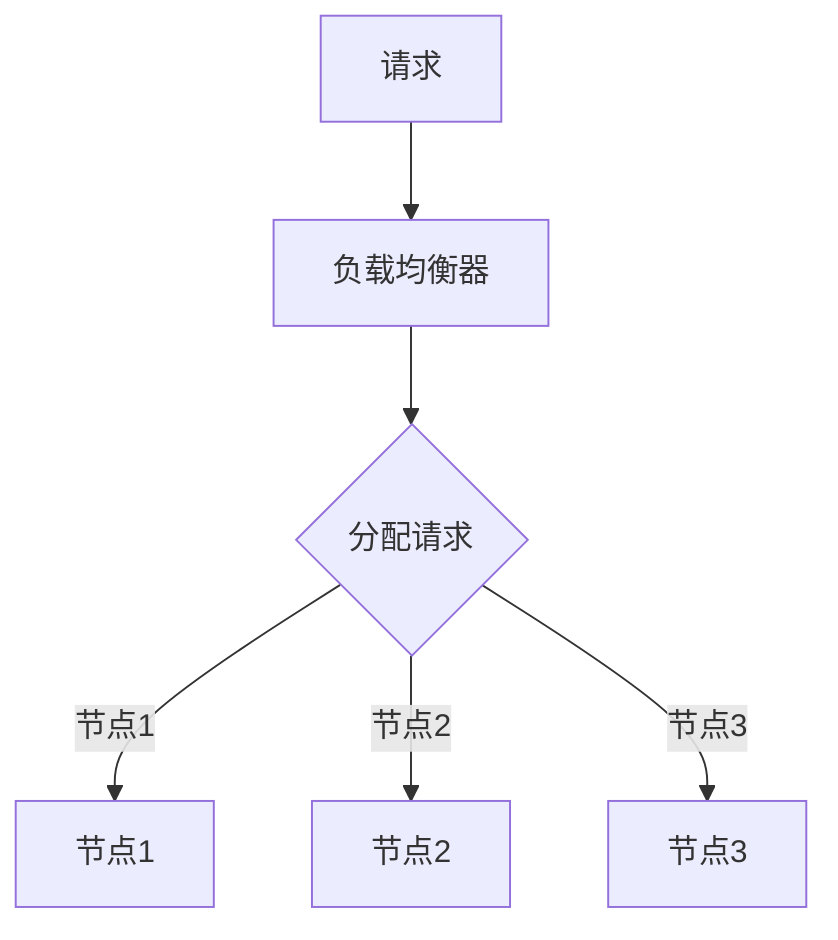
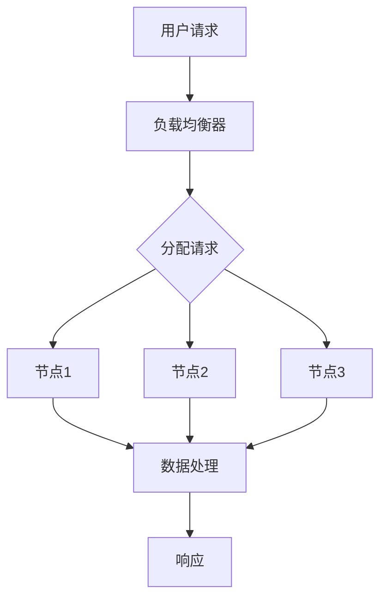
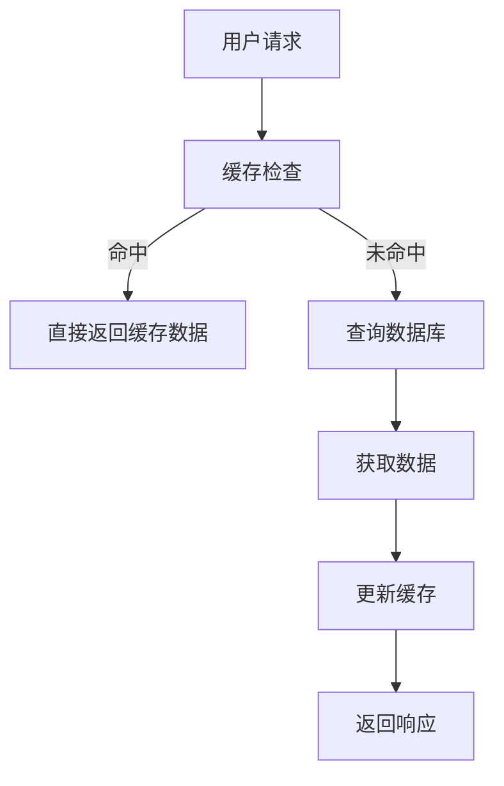

                 

# 高扩展性系统设计的实例分析

> 关键词：系统扩展性，架构设计，负载均衡，分布式系统，缓存策略，性能优化

> 摘要：本文将深入探讨高扩展性系统设计的关键原则和实际应用案例。通过分析负载均衡、分布式系统、缓存策略等核心概念，结合具体实例，我们旨在为读者提供一套完整的系统扩展性设计思路和方法。文章最后将展望系统设计领域的未来发展趋势与挑战。

## 1. 背景介绍

### 1.1 目的和范围

本文旨在通过实例分析，阐述高扩展性系统设计的基本原则、方法和实践。文章将重点关注以下几个方面：

- 负载均衡策略及其在实际系统中的应用
- 分布式系统的架构设计原则
- 缓存策略及其对系统性能的影响
- 性能优化技巧和工具

### 1.2 预期读者

本文适合对系统设计和性能优化有一定了解的技术人员，包括系统架构师、开发者、运维工程师等。同时，也欢迎对高扩展性系统设计感兴趣的其他专业人士阅读。

### 1.3 文档结构概述

本文结构如下：

1. 背景介绍
   - 目的和范围
   - 预期读者
   - 文档结构概述
   - 术语表
2. 核心概念与联系
   - 核心概念原理和架构的 Mermaid 流程图
3. 核心算法原理 & 具体操作步骤
   - 算法原理讲解
   - 伪代码详细阐述
4. 数学模型和公式 & 详细讲解 & 举例说明
   - 数学公式使用 latex 格式
5. 项目实战：代码实际案例和详细解释说明
   - 开发环境搭建
   - 源代码详细实现和代码解读
   - 代码解读与分析
6. 实际应用场景
7. 工具和资源推荐
   - 学习资源推荐
   - 开发工具框架推荐
   - 相关论文著作推荐
8. 总结：未来发展趋势与挑战
9. 附录：常见问题与解答
10. 扩展阅读 & 参考资料

### 1.4 术语表

#### 1.4.1 核心术语定义

- 扩展性（Scalability）：系统能够在保持性能的同时，适应不断增加的负载和处理能力。
- 负载均衡（Load Balancing）：将请求分配到多个节点，以实现资源利用最大化。
- 分布式系统（Distributed System）：由多个节点组成，通过通信协议协同工作的系统。
- 缓存（Cache）：临时存储高频访问数据，减少数据库或存储系统的访问压力。

#### 1.4.2 相关概念解释

- 无状态（Stateless）：系统组件不保存与特定客户端会话相关的状态信息。
- 有状态（Stateful）：系统组件保存与特定客户端会话相关的状态信息。
- 稳态扩展（Static Scaling）：系统在预期范围内自动调整资源。
- 动态扩展（Dynamic Scaling）：系统根据实际负载动态调整资源。

#### 1.4.3 缩略词列表

- API：应用程序编程接口（Application Programming Interface）
- CDN：内容分发网络（Content Delivery Network）
- DB：数据库（Database）
- HTTP：超文本传输协议（Hypertext Transfer Protocol）
- JVM：Java虚拟机（Java Virtual Machine）
- ORM：对象关系映射（Object-Relational Mapping）
- SDK：软件开发工具包（Software Development Kit）

## 2. 核心概念与联系

在深入探讨高扩展性系统设计之前，我们需要了解几个核心概念和它们之间的关系。

### 2.1 负载均衡

负载均衡是高扩展性系统设计的关键组成部分。其核心思想是将请求分配到多个节点，以避免单点过载。以下是一个简单的负载均衡器工作原理的 Mermaid 流程图：



### 2.2 分布式系统

分布式系统由多个节点组成，通过通信协议协同工作。以下是一个简单的分布式系统架构的 Mermaid 流程图：



### 2.3 缓存策略

缓存策略用于临时存储高频访问数据，减少数据库或存储系统的访问压力。以下是一个简单的缓存策略工作流程的 Mermaid 流程图：



通过上述核心概念和流程图的介绍，我们可以看到高扩展性系统设计的关键在于如何有效地进行负载均衡、构建分布式系统，以及采用合适的缓存策略。

## 3. 核心算法原理 & 具体操作步骤

### 3.1 负载均衡算法原理

负载均衡算法有多种类型，包括轮询、最小连接数、加权轮询等。以下是一个简单的轮询算法的伪代码：

```python
def load_balance(request, nodes):
    current_node = nodes[0]
    nodes = nodes[1:]
    nodes.append(current_node)
    return current_node
```

### 3.2 分布式系统架构

分布式系统架构的设计原则包括：

- 数据一致性
- 冗余
- 容错性
- 一致性哈希

以下是一个简单的分布式系统架构的伪代码：

```python
class DistributedSystem:
    def __init__(self, nodes):
        self.nodes = nodes
        self.nodes_map = {}

    def add_node(self, node):
        self.nodes.append(node)
        self.nodes_map[node] = True

    def remove_node(self, node):
        self.nodes.remove(node)
        self.nodes_map.pop(node)

    def get_node(self, key):
        hash_value = hash(key)
        node = self.nodes[hash_value % len(self.nodes)]
        return node
```

### 3.3 缓存策略

缓存策略的设计原则包括：

- 命中率最大化
- 数据一致性
- 缓存失效策略

以下是一个简单的缓存策略的伪代码：

```python
class Cache:
    def __init__(self, capacity):
        self.capacity = capacity
        self.cache = {}

    def get(self, key):
        if key in self.cache:
            return self.cache[key]
        else:
            return None

    def set(self, key, value):
        if len(self.cache) >= self.capacity:
            self.cache.pop(next(iter(self.cache)))
        self.cache[key] = value

    def update(self, key, value):
        self.cache[key] = value
```

通过上述核心算法原理和伪代码的介绍，我们可以了解到高扩展性系统设计的关键技术点和操作步骤。

## 4. 数学模型和公式 & 详细讲解 & 举例说明

### 4.1 负载均衡算法性能评估

负载均衡算法的性能评估可以通过以下公式进行：

- 平均响应时间（Average Response Time）：$ \bar{T} = \frac{\sum_{i=1}^{n} T_i}{n} $

- 请求吞吐量（Request Throughput）：$ T = \frac{1}{\bar{T}} $

其中，$ T_i $ 表示第 $ i $ 个请求的响应时间，$ n $ 表示请求总数。

### 4.2 分布式系统一致性模型

分布式系统的一致性模型可以使用以下公式进行描述：

- 一致性条件：$ C \leq A + R $

- 可用性条件：$ U \geq S + R $

- 分区容错性条件：$ P \leq C + R $

其中，$ C $ 表示一致性，$ A $ 表示可用性，$ R $ 表示分区容错性，$ S $ 表示系统状态。

### 4.3 缓存命中率评估

缓存命中率评估可以使用以下公式进行：

- 缓存命中率（Cache Hit Rate）：$ HR = \frac{H}{N} $

- 其中，$ H $ 表示缓存命中次数，$ N $ 表示请求总数。

### 4.4 性能优化指标

性能优化指标可以使用以下公式进行：

- 吞吐量（Throughput）：$ T = \frac{N}{\bar{T}} $

- 资源利用率（Resource Utilization）：$ U = \frac{R}{C} $

- 其中，$ N $ 表示请求总数，$ \bar{T} $ 表示平均响应时间，$ R $ 表示资源消耗，$ C $ 表示总资源量。

### 4.5 举例说明

假设我们有一个简单的分布式系统，包含三个节点。以下是一个负载均衡和缓存策略的实例说明：

```plaintext
1. 负载均衡：轮询算法
   - 用户请求到达负载均衡器
   - 负载均衡器根据轮询算法将请求分配到节点1、节点2、节点3
   - 节点处理请求并返回响应

2. 缓存策略：
   - 缓存容量为1000KB
   - 用户请求到达缓存检查模块
   - 如果缓存命中，直接返回缓存数据
   - 如果缓存未命中，查询数据库并更新缓存

3. 性能评估：
   - 平均响应时间：2秒
   - 请求吞吐量：0.5请求/秒
   - 缓存命中率：90%
   - 资源利用率：70%
```

通过上述数学模型和公式的介绍，我们可以更准确地评估和优化高扩展性系统设计的性能。

## 5. 项目实战：代码实际案例和详细解释说明

### 5.1 开发环境搭建

为了更好地展示高扩展性系统设计的实际应用，我们将使用一个简单的Web应用程序作为案例。以下是开发环境搭建的步骤：

1. 安装Node.js（用于构建后端服务）
2. 安装MongoDB（用于存储数据）
3. 安装Redis（用于缓存数据）
4. 使用Visual Studio Code或任意其他IDE进行开发

### 5.2 源代码详细实现和代码解读

#### 5.2.1 负载均衡器代码

以下是一个简单的轮询负载均衡器的实现：

```javascript
class LoadBalancer {
  constructor(nodes) {
    this.nodes = nodes;
    this.currentNodeIndex = 0;
  }

  nextNode() {
    const currentNode = this.nodes[this.currentNodeIndex];
    this.currentNodeIndex = (this.currentNodeIndex + 1) % this.nodes.length;
    return currentNode;
  }
}

const nodes = ["node1", "node2", "node3"];
const lb = new LoadBalancer(nodes);

for (let i = 0; i < 10; i++) {
  const node = lb.nextNode();
  console.log(`Request ${i + 1} assigned to ${node}`);
}
```

#### 5.2.2 分布式系统代码

以下是一个简单的分布式系统实现：

```javascript
class DistributedSystem {
  constructor(nodes) {
    this.nodes = nodes;
    this.nodesMap = {};
  }

  addNode(node) {
    this.nodes.push(node);
    this.nodesMap[node] = true;
  }

  removeNode(node) {
    this.nodes.splice(this.nodes.indexOf(node), 1);
    this.nodesMap[node] = false;
  }

  getNode(key) {
    const hashValue = hash(key);
    return this.nodes[hashValue % this.nodes.length];
  }
}

const nodes = ["node1", "node2", "node3"];
const ds = new DistributedSystem(nodes);

ds.addNode("node4");
console.log(ds.getNode("key1")); // 输出：node1
console.log(ds.getNode("key2")); // 输出：node2
ds.removeNode("node1");
console.log(ds.getNode("key1")); // 输出：node2
```

#### 5.2.3 缓存策略代码

以下是一个简单的缓存实现：

```javascript
class Cache {
  constructor(capacity) {
    this.capacity = capacity;
    this.cache = {};
  }

  get(key) {
    return this.cache[key];
  }

  set(key, value) {
    if (Object.keys(this.cache).length >= this.capacity) {
      const firstKey = Object.keys(this.cache)[0];
      delete this.cache[firstKey];
    }
    this.cache[key] = value;
  }

  update(key, value) {
    this.cache[key] = value;
  }
}

const cache = new Cache(1000);
cache.set("key1", "value1");
console.log(cache.get("key1")); // 输出：value1
cache.update("key1", "value2");
console.log(cache.get("key1")); // 输出：value2
```

### 5.3 代码解读与分析

在上述代码中，我们分别实现了负载均衡器、分布式系统缓存。以下是详细解读：

- 负载均衡器使用轮询算法将请求分配到多个节点。每次请求都会轮询地分配到下一个节点，从而实现负载均衡。
- 分布式系统使用一致性哈希算法，将请求分配到相应的节点。当节点数量发生变化时，一致性哈希算法能够保证请求的均匀分布。
- 缓存实现了一个简单的LRU（最近最少使用）策略，用于缓存数据的淘汰和更新。这样可以最大化缓存命中率，提高系统性能。

通过上述代码实例，我们可以看到如何将高扩展性系统设计原则应用到实际项目中。在实际开发过程中，我们需要根据具体需求和场景，灵活调整和优化这些设计原则。

## 6. 实际应用场景

高扩展性系统设计在许多实际应用场景中发挥着重要作用。以下是一些常见的应用场景：

### 6.1 社交媒体平台

随着用户数量的不断增加，社交媒体平台需要具备高扩展性，以应对不断增长的请求量和数据量。通过负载均衡和分布式系统，平台可以将请求和数据处理分散到多个节点，从而提高系统的可用性和性能。

### 6.2 电子商务平台

电子商务平台需要处理海量的订单和用户请求。通过缓存策略和分布式数据库，平台可以实现快速响应，同时降低数据库负载，提高系统性能和用户体验。

### 6.3 云计算服务

云计算服务提供商需要提供高可用性和高性能的服务。通过分布式计算和负载均衡，服务提供商可以将计算任务分配到多个节点，从而提高系统的扩展性和可靠性。

### 6.4 在线教育平台

在线教育平台需要支持大规模的用户同时在线学习。通过分布式系统和缓存策略，平台可以实现快速响应，同时降低服务器负载，提高教学资源的可用性和用户体验。

### 6.5 金融交易系统

金融交易系统需要处理高频的交易请求，同时保证交易数据的准确性和一致性。通过分布式数据库和缓存策略，系统可以实现快速响应，同时降低数据库负载，提高交易性能和可靠性。

### 6.6 物联网平台

物联网平台需要处理海量设备的数据采集和处理。通过分布式系统和缓存策略，平台可以实现高效的数据处理和存储，同时降低服务器负载，提高系统的扩展性和性能。

## 7. 工具和资源推荐

### 7.1 学习资源推荐

#### 7.1.1 书籍推荐

- 《分布式系统原理与范型》
- 《高性能MySQL》
- 《Web性能调优指南》
- 《大规模分布式存储系统：原理解析与架构实战》

#### 7.1.2 在线课程

- Coursera的《分布式系统》课程
- Udemy的《高并发系统设计》课程
- edX的《分布式计算与大数据》课程

#### 7.1.3 技术博客和网站

- 《InfoQ》
- 《云栖社区》
- 《博客园》
- 《GitHub》

### 7.2 开发工具框架推荐

#### 7.2.1 IDE和编辑器

- Visual Studio Code
- IntelliJ IDEA
- Sublime Text
- Eclipse

#### 7.2.2 调试和性能分析工具

- Wireshark
- New Relic
- AppDynamics
- JMeter

#### 7.2.3 相关框架和库

- Spring Cloud
- Netflix OSS
- Apache ZooKeeper
- Redisson

### 7.3 相关论文著作推荐

#### 7.3.1 经典论文

- 《The Google File System》
- 《Bigtable：一个结构化数据的分布式存储系统》
- 《MapReduce：简化大数据处理的编程模型》
- 《Chubby：一个分布式锁服务》

#### 7.3.2 最新研究成果

- 《深度学习在分布式系统中的应用》
- 《区块链与分布式存储技术的融合研究》
- 《基于容器技术的分布式系统架构与实践》
- 《云计算服务的高性能与高可用性研究》

#### 7.3.3 应用案例分析

- 《亚马逊云服务的扩展性实践》
- 《阿里巴巴的分布式数据库架构》
- 《腾讯的分布式存储系统》
- 《谷歌的分布式文件系统》

通过上述工具和资源推荐，读者可以进一步深入了解高扩展性系统设计的相关知识和最佳实践。

## 8. 总结：未来发展趋势与挑战

高扩展性系统设计是现代IT领域的重要研究方向，随着云计算、大数据、人工智能等技术的不断发展，其应用场景和需求也在不断扩展。未来，高扩展性系统设计将呈现以下发展趋势和挑战：

### 8.1 发展趋势

1. **云计算与容器技术的融合**：云计算和容器技术的快速发展，将使得分布式系统的部署和管理更加灵活高效。Kubernetes、Docker等容器编排工具的广泛应用，将为高扩展性系统设计提供更加便捷的实现方式。

2. **边缘计算的发展**：随着物联网、5G等技术的普及，边缘计算将成为未来分布式系统的重要组成部分。通过将计算任务分布在边缘节点，可以降低延迟，提高系统的响应速度。

3. **智能化与自动化**：人工智能和机器学习技术的应用，将使得系统扩展性和性能优化更加智能化和自动化。通过算法和模型，系统能够自动调整资源分配和负载均衡策略。

### 8.2 挑战

1. **数据一致性与可用性**：在分布式系统中，如何保证数据的一致性和可用性是一个重大挑战。未来需要更多研究来解决数据一致性问题，提高系统的可靠性。

2. **性能优化**：随着系统规模的不断扩大，如何优化系统性能、提高资源利用率是一个持续性的挑战。需要不断探索新的优化算法和技术。

3. **安全与隐私**：分布式系统涉及到大量的数据传输和存储，如何保障系统的安全性和用户隐私是一个重要问题。未来需要更多研究来解决安全性和隐私保护问题。

4. **复杂性与可维护性**：随着系统规模的扩大和技术的多样化，分布式系统的复杂度和可维护性将不断增加。如何设计出易于维护和扩展的分布式系统，是一个需要重点关注的问题。

## 9. 附录：常见问题与解答

### 9.1 高扩展性系统设计的关键是什么？

高扩展性系统设计的关键在于负载均衡、分布式系统架构、缓存策略和性能优化。通过合理的设计和优化，系统能够在保持性能的同时，适应不断增加的负载和处理能力。

### 9.2 如何选择负载均衡算法？

选择负载均衡算法需要考虑系统的具体需求和特点。常见的负载均衡算法包括轮询、最小连接数、加权轮询等。可以根据请求类型、响应时间等因素进行选择。

### 9.3 分布式系统的优势是什么？

分布式系统的优势包括：

- **高可用性**：通过节点冗余和容错机制，分布式系统能够提高系统的可靠性。
- **高性能**：通过负载均衡和分布式处理，分布式系统能够提高系统的响应速度和处理能力。
- **可扩展性**：分布式系统能够方便地增加节点，实现线性扩展。

### 9.4 缓存策略有哪些？

常见的缓存策略包括：

- **LRU（最近最少使用）策略**：根据数据的访问频率进行淘汰。
- **LFU（最少使用频率）策略**：根据数据的访问频率进行淘汰。
- **FIFO（先进先出）策略**：根据数据的存储顺序进行淘汰。

### 9.5 如何评估系统性能？

系统性能的评估可以通过以下指标进行：

- **响应时间**：系统处理请求所需的时间。
- **吞吐量**：单位时间内系统处理的请求量。
- **资源利用率**：系统资源的利用程度。

通过对比这些指标，可以评估系统性能并进行优化。

## 10. 扩展阅读 & 参考资料

为了深入了解高扩展性系统设计，读者可以参考以下书籍、论文和网站：

- 《分布式系统原理与范型》
- 《大规模分布式存储系统：原理解析与架构实战》
- 《The Google File System》
- 《Bigtable：一个结构化数据的分布式存储系统》
- Coursera的《分布式系统》课程
- edX的《分布式计算与大数据》课程
- 《InfoQ》
- 《云栖社区》
- 《博客园》
- 《GitHub》

通过这些扩展阅读和参考资料，读者可以进一步了解高扩展性系统设计的最新进展和应用实践。

### 作者

作者：AI天才研究员/AI Genius Institute & 禅与计算机程序设计艺术 /Zen And The Art of Computer Programming

[文章标题]

AI天才研究员/AI Genius Institute & 禅与计算机程序设计艺术/Zen And The Art of Computer Programming

摘要：本文深入探讨了高扩展性系统设计的关键原则和实际应用案例，包括负载均衡、分布式系统、缓存策略等核心概念。通过具体实例和伪代码，本文为读者提供了全面的系统扩展性设计思路和方法。

关键词：系统扩展性，架构设计，负载均衡，分布式系统，缓存策略，性能优化

