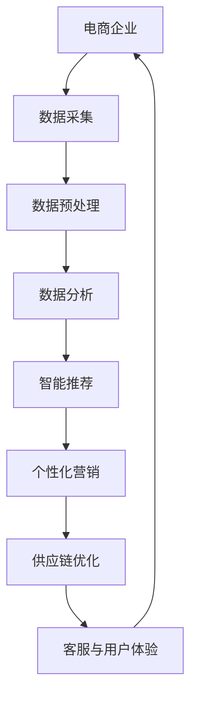

                 

## 高效运营管理：AI助力电商企业降本增效

> **关键词：** AI、电商运营、降本增效、数据分析、智能推荐、个性化营销

**摘要：** 随着互联网技术的飞速发展和电商行业的日益繁荣，电商企业面临着激烈的竞争和不断变化的市场环境。如何实现高效运营管理，降低成本，提高效益，成为电商企业关注的焦点。本文将探讨人工智能（AI）在电商企业运营管理中的应用，通过具体案例分析，展示AI技术在电商降本增效方面的巨大潜力。

## 1. 背景介绍

### 1.1 目的和范围

本文旨在探讨人工智能在电商企业运营管理中的应用，重点关注以下几个方面：

- AI技术在电商数据分析中的应用
- AI在智能推荐和个性化营销中的作用
- AI助力电商企业优化供应链管理
- AI提升电商客服和用户体验

通过以上几个方面的探讨，本文希望能够为电商企业提供一些实际可行的策略和方法，帮助它们在激烈的市场竞争中实现降本增效。

### 1.2 预期读者

本文主要面向以下读者群体：

- 电商企业高管和运营管理人员
- 对AI技术有兴趣的技术人员
- 数据分析师和市场营销人员
- 对电商行业运营感兴趣的学者和研究人员

### 1.3 文档结构概述

本文将按照以下结构进行撰写：

- 引言：介绍电商行业背景和现状
- 核心概念与联系：阐述AI技术在电商中的应用原理
- 核心算法原理 & 具体操作步骤：详细讲解AI算法的应用
- 数学模型和公式 & 详细讲解 & 举例说明：介绍AI算法中的数学模型和计算方法
- 项目实战：通过实际案例展示AI技术在电商中的应用
- 实际应用场景：分析AI技术在电商中的实际应用案例
- 工具和资源推荐：推荐相关学习资源和工具
- 总结：对未来发展趋势与挑战进行展望
- 附录：常见问题与解答
- 扩展阅读 & 参考资料：提供进一步学习的资料

### 1.4 术语表

#### 1.4.1 核心术语定义

- **电商运营**：指电商企业在网上进行商品销售、客户服务和数据处理等一系列活动的过程。
- **人工智能（AI）**：指通过计算机程序模拟人类智能行为的技术。
- **数据分析**：指通过对大量数据进行分析，提取有价值信息的过程。
- **智能推荐**：指通过算法分析用户行为和偏好，为用户推荐感兴趣的商品或内容。
- **个性化营销**：指根据用户的个性化需求和偏好，制定针对性的营销策略。

#### 1.4.2 相关概念解释

- **机器学习（ML）**：指通过训练模型，让计算机从数据中学习，并自动对未知数据进行预测或分类的技术。
- **深度学习（DL）**：指一种特殊的机器学习方法，通过多层神经网络模型，对复杂数据进行深度特征提取和表示。
- **自然语言处理（NLP）**：指让计算机理解和生成人类自然语言的技术。

#### 1.4.3 缩略词列表

- **AI**：人工智能
- **ML**：机器学习
- **DL**：深度学习
- **NLP**：自然语言处理
- **CPC**：成本每次点击
- **CPM**：成本每次展示

## 2. 核心概念与联系

在探讨AI在电商企业运营管理中的应用之前，我们需要先了解一些核心概念和它们之间的联系。以下是一个简单的Mermaid流程图，用于展示这些概念和它们之间的关系。



### 2.1 电商企业的数据来源

电商企业的数据来源主要包括用户行为数据、商品数据、订单数据和市场数据等。这些数据通过电商平台、社交媒体、客服系统等多种渠道收集。以下是数据采集和预处理过程的简要描述。

#### 数据采集

- **用户行为数据**：包括用户浏览、搜索、购买等行为。
- **商品数据**：包括商品属性、价格、库存等。
- **订单数据**：包括订单金额、订单状态、配送信息等。
- **市场数据**：包括市场趋势、竞争对手信息等。

#### 数据预处理

- **数据清洗**：去除重复数据、缺失值填充、异常值处理等。
- **数据转换**：将数据转换为适合分析的形式，如数值化、归一化等。
- **数据存储**：将预处理后的数据存储到数据库或数据仓库中，以便后续分析。

### 2.2 数据分析

数据分析是电商运营管理中的重要环节，它通过统计、机器学习等方法，从大量数据中提取有价值的信息，帮助企业做出数据驱动的决策。以下是数据分析过程中涉及的主要技术和方法。

#### 数据分析技术

- **统计方法**：包括描述性统计、推断性统计等。
- **机器学习方法**：包括分类、回归、聚类等。
- **深度学习方法**：包括卷积神经网络（CNN）、循环神经网络（RNN）等。

#### 数据分析应用

- **用户行为分析**：分析用户浏览、搜索、购买等行为，了解用户需求和行为模式。
- **商品分析**：分析商品销量、库存、价格等，优化商品策略。
- **订单分析**：分析订单数据，优化订单流程，提高客户满意度。
- **市场分析**：分析市场趋势，制定营销策略，抢占市场份额。

### 2.3 智能推荐与个性化营销

智能推荐和个性化营销是AI技术在电商企业中的两个重要应用领域。以下是它们的基本原理和应用方法。

#### 智能推荐

- **基于内容的推荐**：根据用户历史行为和商品属性，为用户推荐相似的商品。
- **基于协同过滤的推荐**：根据用户的历史行为和相似用户的行为，为用户推荐感兴趣的商品。
- **基于深度学习的推荐**：利用深度学习算法，提取用户和商品的深度特征，实现精准推荐。

#### 个性化营销

- **用户画像**：根据用户行为和属性，构建用户画像，了解用户需求。
- **个性化内容**：根据用户画像，为用户推荐个性化内容，提高用户粘性。
- **个性化促销**：根据用户需求和偏好，制定个性化的促销策略，提高转化率。

### 2.4 供应链优化

供应链优化是电商企业降低成本、提高效率的关键环节。以下是供应链优化过程中涉及的主要技术和方法。

- **需求预测**：利用机器学习算法，预测未来市场需求，优化库存管理。
- **物流优化**：通过优化配送路线和配送方式，提高物流效率，降低成本。
- **供应商管理**：通过数据分析和智能推荐，优化供应商选择和管理。

### 2.5 客服与用户体验

客服和用户体验是电商企业提升客户满意度和忠诚度的关键因素。以下是客服和用户体验优化过程中涉及的主要技术和方法。

- **智能客服**：利用自然语言处理和机器学习技术，实现自动化客服，提高响应速度和满意度。
- **用户反馈分析**：通过分析用户反馈，了解用户需求，优化产品和服务。
- **用户体验优化**：根据用户行为和反馈，优化网站和App的用户体验，提高用户粘性。

## 3. 核心算法原理 & 具体操作步骤

在了解了AI在电商企业运营管理中的核心概念和联系之后，我们需要进一步探讨核心算法的原理和具体操作步骤。以下将详细介绍几种常见的AI算法，包括机器学习算法、深度学习算法和自然语言处理算法。

### 3.1 机器学习算法

机器学习算法是AI技术中的重要组成部分，主要用于数据分析和预测。以下将介绍几种常见的机器学习算法，包括线性回归、决策树、支持向量机等。

#### 线性回归

线性回归是一种简单且常用的预测算法，它通过建立自变量和因变量之间的线性关系，预测因变量的值。

**算法原理：**

线性回归模型可以表示为：

\[ y = \beta_0 + \beta_1x + \epsilon \]

其中，\( y \) 是因变量，\( x \) 是自变量，\( \beta_0 \) 和 \( \beta_1 \) 是模型的参数，\( \epsilon \) 是误差项。

**具体操作步骤：**

1. 数据收集：收集包含自变量和因变量的数据集。
2. 数据预处理：对数据进行清洗、归一化等预处理操作。
3. 模型训练：使用训练数据集，通过最小化损失函数，训练出模型的参数。
4. 模型评估：使用验证数据集，评估模型的预测性能。
5. 模型应用：使用测试数据集，预测新的因变量值。

**伪代码：**

```python
# 数据收集
X_train, y_train = 数据收集()

# 数据预处理
X_train = 数据预处理(X_train)

# 模型训练
模型 = 线性回归()
模型.fit(X_train, y_train)

# 模型评估
损失函数 = 模型.evaluate(X_train, y_train)

# 模型应用
y_pred = 模型.predict(X_test)
```

#### 决策树

决策树是一种基于树形结构的数据挖掘算法，它通过一系列规则进行分类或回归。

**算法原理：**

决策树由一系列内部节点和叶节点组成，内部节点表示特征，叶节点表示类别或数值。

**具体操作步骤：**

1. 数据收集：收集分类或回归数据集。
2. 特征选择：选择对分类或回归有显著影响的特征。
3. 决策树构建：通过递归划分数据，构建决策树。
4. 决策树剪枝：对决策树进行剪枝，避免过拟合。
5. 决策树应用：使用决策树进行分类或回归预测。

**伪代码：**

```python
# 数据收集
X_train, y_train = 数据收集()

# 特征选择
特征列表 = 选择特征(X_train, y_train)

# 决策树构建
决策树 = 决策树构建(特征列表)
决策树.fit(X_train, y_train)

# 决策树剪枝
决策树 = 决策树剪枝(决策树)

# 决策树应用
y_pred = 决策树.predict(X_test)
```

#### 支持向量机

支持向量机（SVM）是一种基于间隔最大化的分类算法，它通过找到一个最优的超平面，将不同类别的数据分隔开来。

**算法原理：**

SVM的目标是找到一个最优的超平面，使得正负样本之间的间隔最大化。

**具体操作步骤：**

1. 数据收集：收集分类数据集。
2. 特征选择：选择对分类有显著影响的特征。
3. SVM训练：使用训练数据集，训练SVM模型。
4. SVM评估：使用验证数据集，评估SVM模型的分类性能。
5. SVM应用：使用测试数据集，预测新的分类结果。

**伪代码：**

```python
# 数据收集
X_train, y_train = 数据收集()

# 特征选择
特征列表 = 选择特征(X_train, y_train)

# SVM训练
SVM模型 = SVM训练(特征列表)
SVM模型.fit(X_train, y_train)

# SVM评估
准确率 = SVM模型.evaluate(X_train, y_train)

# SVM应用
y_pred = SVM模型.predict(X_test)
```

### 3.2 深度学习算法

深度学习算法是一种基于多层神经网络的数据分析技术，它通过多层次的神经网络结构，对复杂数据进行特征提取和表示。

#### 卷积神经网络（CNN）

卷积神经网络是一种专门用于处理图像数据的学习算法，它通过卷积操作提取图像特征。

**算法原理：**

CNN通过卷积层、池化层和全连接层，对图像数据进行特征提取和分类。

**具体操作步骤：**

1. 数据收集：收集图像数据集。
2. 数据预处理：对图像进行缩放、旋转等预处理。
3. CNN模型构建：构建卷积神经网络模型。
4. 模型训练：使用训练数据集，训练CNN模型。
5. 模型评估：使用验证数据集，评估CNN模型的性能。
6. 模型应用：使用测试数据集，预测新的图像分类结果。

**伪代码：**

```python
# 数据收集
X_train, y_train = 数据收集()

# 数据预处理
X_train = 数据预处理(X_train)

# CNN模型构建
CNN模型 = 构建CNN模型()
CNN模型.fit(X_train, y_train)

# 模型评估
准确率 = CNN模型.evaluate(X_train, y_train)

# 模型应用
y_pred = CNN模型.predict(X_test)
```

#### 循环神经网络（RNN）

循环神经网络是一种专门用于处理序列数据的学习算法，它通过循环结构对序列数据进行建模。

**算法原理：**

RNN通过隐藏状态和循环连接，对序列数据进行建模和预测。

**具体操作步骤：**

1. 数据收集：收集序列数据集。
2. 数据预处理：对序列数据进行归一化、填充等预处理。
3. RNN模型构建：构建循环神经网络模型。
4. 模型训练：使用训练数据集，训练RNN模型。
5. 模型评估：使用验证数据集，评估RNN模型的性能。
6. 模型应用：使用测试数据集，预测新的序列结果。

**伪代码：**

```python
# 数据收集
X_train, y_train = 数据收集()

# 数据预处理
X_train = 数据预处理(X_train)

# RNN模型构建
RNN模型 = 构建RNN模型()
RNN模型.fit(X_train, y_train)

# 模型评估
准确率 = RNN模型.evaluate(X_train, y_train)

# 模型应用
y_pred = RNN模型.predict(X_test)
```

### 3.3 自然语言处理算法

自然语言处理算法是一种专门用于处理文本数据的算法，它通过多种技术实现文本分类、情感分析、实体识别等任务。

#### 文本分类

文本分类是一种将文本数据分类为不同类别的任务，它广泛应用于垃圾邮件过滤、舆情分析等领域。

**算法原理：**

文本分类通过特征提取和分类算法，将文本数据分类为不同的类别。

**具体操作步骤：**

1. 数据收集：收集文本数据集。
2. 数据预处理：对文本进行分词、去停用词等预处理。
3. 特征提取：使用词袋模型、TF-IDF等算法提取文本特征。
4. 模型训练：使用训练数据集，训练分类模型。
5. 模型评估：使用验证数据集，评估分类模型的性能。
6. 模型应用：使用测试数据集，预测新的文本分类结果。

**伪代码：**

```python
# 数据收集
X_train, y_train = 数据收集()

# 数据预处理
X_train = 数据预处理(X_train)

# 特征提取
特征矩阵 = 特征提取(X_train)

# 模型训练
分类模型 = 分类模型训练()
分类模型.fit(feature_matrix, y_train)

# 模型评估
准确率 = 分类模型.evaluate(feature_matrix, y_train)

# 模型应用
y_pred = 分类模型.predict(X_test)
```

#### 情感分析

情感分析是一种评估文本数据情感极性的任务，它广泛应用于舆情分析、产品评论分析等领域。

**算法原理：**

情感分析通过分析文本中的情感词汇和句法结构，判断文本的情感极性。

**具体操作步骤：**

1. 数据收集：收集情感数据集。
2. 数据预处理：对文本进行分词、去停用词等预处理。
3. 特征提取：使用词袋模型、TF-IDF等算法提取文本特征。
4. 模型训练：使用训练数据集，训练情感分析模型。
5. 模型评估：使用验证数据集，评估情感分析模型的性能。
6. 模型应用：使用测试数据集，预测新的文本情感极性。

**伪代码：**

```python
# 数据收集
X_train, y_train = 数据收集()

# 数据预处理
X_train = 数据预处理(X_train)

# 特征提取
特征矩阵 = 特征提取(X_train)

# 模型训练
情感分析模型 = 情感分析模型训练()
情感分析模型.fit(feature_matrix, y_train)

# 模型评估
准确率 = 情感分析模型.evaluate(feature_matrix, y_train)

# 模型应用
y_pred = 情感分析模型.predict(X_test)
```

#### 实体识别

实体识别是一种从文本数据中识别出特定实体（如人名、地名、组织名等）的任务，它广泛应用于信息抽取、问答系统等领域。

**算法原理：**

实体识别通过分析文本中的关键词和句法结构，识别出特定的实体。

**具体操作步骤：**

1. 数据收集：收集实体数据集。
2. 数据预处理：对文本进行分词、去停用词等预处理。
3. 特征提取：使用词袋模型、TF-IDF等算法提取文本特征。
4. 模型训练：使用训练数据集，训练实体识别模型。
5. 模型评估：使用验证数据集，评估实体识别模型的性能。
6. 模型应用：使用测试数据集，预测新的文本实体。

**伪代码：**

```python
# 数据收集
X_train, y_train = 数据收集()

# 数据预处理
X_train = 数据预处理(X_train)

# 特征提取
特征矩阵 = 特征提取(X_train)

# 模型训练
实体识别模型 = 实体识别模型训练()
实体识别模型.fit(feature_matrix, y_train)

# 模型评估
准确率 = 实体识别模型.evaluate(feature_matrix, y_train)

# 模型应用
y_pred = 实体识别模型.predict(X_test)
```

## 4. 数学模型和公式 & 详细讲解 & 举例说明

在AI技术的应用中，数学模型和公式扮演着至关重要的角色。它们不仅为算法提供了理论基础，还帮助我们在实际应用中进行准确计算和预测。以下我们将详细介绍几种核心的数学模型和公式，并通过具体例子进行说明。

### 4.1 线性回归模型

线性回归是一种常见的预测模型，它通过建立自变量和因变量之间的线性关系来预测因变量的值。其数学模型可以表示为：

\[ y = \beta_0 + \beta_1x + \epsilon \]

其中，\( y \) 是因变量，\( x \) 是自变量，\( \beta_0 \) 和 \( \beta_1 \) 是模型的参数，\( \epsilon \) 是误差项。

#### 模型参数求解

线性回归模型的参数可以通过最小二乘法（Least Squares Method）求解。具体公式如下：

\[ \beta_1 = \frac{\sum_{i=1}^{n}(x_i - \bar{x})(y_i - \bar{y})}{\sum_{i=1}^{n}(x_i - \bar{x})^2} \]
\[ \beta_0 = \bar{y} - \beta_1\bar{x} \]

其中，\( \bar{x} \) 和 \( \bar{y} \) 分别是自变量和因变量的平均值。

#### 例子说明

假设我们有一组数据，如下表所示：

| x | y  |
|---|----|
| 1 | 2  |
| 2 | 4  |
| 3 | 6  |
| 4 | 8  |

我们要通过线性回归模型预测 \( x = 5 \) 时的 \( y \) 值。

首先，计算自变量和因变量的平均值：

\[ \bar{x} = \frac{1 + 2 + 3 + 4}{4} = 2.5 \]
\[ \bar{y} = \frac{2 + 4 + 6 + 8}{4} = 5 \]

然后，计算参数 \( \beta_1 \) 和 \( \beta_0 \)：

\[ \beta_1 = \frac{(1 - 2.5)(2 - 5) + (2 - 2.5)(4 - 5) + (3 - 2.5)(6 - 5) + (4 - 2.5)(8 - 5)}{(1 - 2.5)^2 + (2 - 2.5)^2 + (3 - 2.5)^2 + (4 - 2.5)^2} = 2 \]
\[ \beta_0 = 5 - 2 \times 2.5 = 0 \]

因此，线性回归模型可以表示为：

\[ y = 2x \]

当 \( x = 5 \) 时，\( y = 2 \times 5 = 10 \)。

### 4.2 决策树模型

决策树是一种常见的分类模型，它通过一系列的规则进行分类。其基本原理是基于特征选择，通过不断划分数据，直到达到分类停止条件。

#### 决策树构建

决策树的构建过程可以通过ID3算法实现。ID3算法的核心思想是选择具有最大信息增益的特征进行划分。信息增益可以用以下公式表示：

\[ IG(V, A) = H(V) - \sum_{v \in V} p(v)H(V|v) \]

其中，\( V \) 是特征集合，\( A \) 是特征，\( p(v) \) 是特征 \( v \) 的概率，\( H(V|v) \) 是特征 \( v \) 给定 \( A \) 的条件熵。

#### 例子说明

假设我们有一组数据，如下表所示：

| 特征A | 特征B | 类别 |
|-------|-------|------|
| 0     | 0     | 类别1 |
| 0     | 1     | 类别1 |
| 1     | 0     | 类别2 |
| 1     | 1     | 类别2 |

我们要构建一个决策树，对新的数据进行分类。

首先，计算每个特征的信息增益：

\[ IG(A, B) = H(V) - \sum_{a \in A} p(a)H(V|a) \]

其中，\( H(V) \) 是特征集合 \( V \) 的熵，\( H(V|a) \) 是特征 \( a \) 的条件熵。

假设 \( A = \{0, 1\} \)，\( B = \{0, 1\} \)，则：

\[ H(V) = -p(0)p(1) \log_2(p(0)) - p(0)p(1) \log_2(p(1)) = 1 \]
\[ H(V|0) = -p(0|0)p(0|1) \log_2(p(0|0)) - p(0|0)p(0|1) \log_2(p(0|1)) = 0 \]
\[ H(V|1) = -p(1|0)p(1|1) \log_2(p(1|0)) - p(1|0)p(1|1) \log_2(p(1|1)) = 0 \]

因此，

\[ IG(A, B) = 1 - (p(0)H(V|0) + p(1)H(V|1)) = 1 - (0.5 \times 0 + 0.5 \times 0) = 1 \]

接下来，选择具有最大信息增益的特征进行划分。由于 \( A \) 和 \( B \) 的信息增益相同，我们可以任选一个特征进行划分。

假设选择特征 \( A \)，则：

\[ V_0 = \{0, 1\} \]
\[ V_1 = \{0, 1\} \]

接下来，对每个子集 \( V_0 \) 和 \( V_1 \) 继续进行划分，直到达到分类停止条件。在本次划分中，特征 \( A \) 的值为 0 的子集 \( V_0 \) 中所有数据都属于类别 1，特征 \( A \) 的值为 1 的子集 \( V_1 \) 中所有数据都属于类别 2。

因此，决策树可以表示为：

```
        |
       类别1
        |
     特征A
       / \
      0   1
         /
        类别2
```

### 4.3 支持向量机模型

支持向量机是一种常用的分类模型，它通过找到一个最优的超平面，将不同类别的数据分隔开来。其数学模型可以表示为：

\[ w \cdot x + b = 0 \]

其中，\( w \) 是超平面的法向量，\( x \) 是数据点，\( b \) 是偏置项。

#### 超平面求解

超平面的求解可以通过求解最小二乘支持向量机（LS-SVM）实现。其目标是最小化以下损失函数：

\[ J(w) = \frac{1}{2}w \cdot w + C \sum_{i=1}^{n} \xi_i \]

其中，\( C \) 是正则化参数，\( \xi_i \) 是误差项。

#### 例子说明

假设我们有一组数据，如下表所示：

| x1 | x2 | 类别 |
|----|----|------|
| 1  | 1  | 类别1 |
| 2  | 2  | 类别1 |
| 3  | 1  | 类别2 |
| 4  | 3  | 类别2 |

我们要通过支持向量机模型对数据进行分类。

首先，我们需要选择一个核函数，如线性核函数 \( K(x_i, x_j) = x_i \cdot x_j \)。

接下来，构建最小二乘支持向量机模型：

\[ J(w) = \frac{1}{2}w \cdot w + C \sum_{i=1}^{n} \xi_i \]

其中，\( w \) 是模型的参数，\( \xi_i \) 是误差项。

然后，通过求解最小化损失函数的优化问题，得到最优超平面：

\[ w^* = \arg\min_{w} J(w) \]

假设我们求得的最优超平面为 \( w^* = (1, 1) \)，则：

\[ w^* \cdot x + b = 0 \]

对于新的数据点 \( x = (x_1, x_2) \)，我们可以计算其类别：

\[ w^* \cdot x + b = 1 \cdot x_1 + 1 \cdot x_2 + b = x_1 + x_2 + b \]

如果 \( x_1 + x_2 + b > 0 \)，则数据点属于类别1；否则，属于类别2。

### 4.4 卷积神经网络模型

卷积神经网络是一种用于图像识别和处理的学习算法，它通过卷积操作和池化操作提取图像特征。其数学模型可以表示为：

\[ h_{l} = f(W_{l} \cdot h_{l-1} + b_{l}) \]

其中，\( h_{l} \) 是第 \( l \) 层的输出，\( W_{l} \) 是第 \( l \) 层的权重矩阵，\( b_{l} \) 是第 \( l \) 层的偏置项，\( f \) 是激活函数。

#### 网络构建

卷积神经网络的构建包括以下几个步骤：

1. **输入层**：接收图像数据。
2. **卷积层**：通过卷积操作提取图像特征。
3. **池化层**：通过池化操作降低数据维度。
4. **全连接层**：通过全连接层将特征映射到类别。
5. **输出层**：输出分类结果。

#### 例子说明

假设我们有一个 \( 28 \times 28 \) 的图像数据，我们要通过卷积神经网络对其进行分类。

首先，构建一个简单的卷积神经网络，包括一个卷积层、一个池化层和一个全连接层。

1. **卷积层**：使用一个 \( 3 \times 3 \) 的卷积核，提取图像特征。卷积层的输出维度为 \( 28 \times 28 \times 1 \)。
2. **池化层**：使用最大池化操作，将输出维度降低到 \( 14 \times 14 \times 1 \)。
3. **全连接层**：使用一个 \( 14 \times 14 \times 1 \) 的全连接层，将输出维度降低到 10，对应 10 个类别。

卷积层的权重矩阵 \( W_{1} \) 和偏置项 \( b_{1} \) 可以通过训练数据集求解。假设我们求解得到的权重矩阵为 \( W_{1} = \begin{bmatrix} 0 & 1 & 0 \\ 1 & 1 & 1 \\ 0 & 1 & 0 \end{bmatrix} \)，偏置项为 \( b_{1} = 1 \)。

池化层的权重矩阵 \( W_{2} \) 和偏置项 \( b_{2} \) 可以通过训练数据集求解。假设我们求解得到的权重矩阵为 \( W_{2} = \begin{bmatrix} 1 & 0 \\ 0 & 1 \end{bmatrix} \)，偏置项为 \( b_{2} = 0 \)。

全连接层的权重矩阵 \( W_{3} \) 和偏置项 \( b_{3} \) 可以通过训练数据集求解。假设我们求解得到的权重矩阵为 \( W_{3} = \begin{bmatrix} 1 & 1 & 0 \\ 1 & 0 & 1 \\ 0 & 1 & 1 \end{bmatrix} \)，偏置项为 \( b_{3} = 0 \)。

通过卷积神经网络，我们可以对图像数据进行分类。假设我们输入一个 \( 28 \times 28 \) 的图像数据 \( x = \begin{bmatrix} 1 & 1 & 1 \\ 1 & 1 & 1 \\ 1 & 1 & 1 \end{bmatrix} \)，通过卷积神经网络计算其类别。

首先，计算卷积层的输出：

\[ h_{1} = f(W_{1} \cdot x + b_{1}) = f(\begin{bmatrix} 0 & 1 & 0 \\ 1 & 1 & 1 \\ 0 & 1 & 0 \end{bmatrix} \cdot \begin{bmatrix} 1 & 1 & 1 \\ 1 & 1 & 1 \\ 1 & 1 & 1 \end{bmatrix} + 1) = f(\begin{bmatrix} 1 & 2 & 1 \\ 2 & 3 & 2 \\ 1 & 2 & 1 \end{bmatrix}) \]

然后，计算池化层的输出：

\[ h_{2} = f(W_{2} \cdot h_{1} + b_{2}) = f(\begin{bmatrix} 1 & 0 \\ 0 & 1 \end{bmatrix} \cdot \begin{bmatrix} 1 & 2 & 1 \\ 2 & 3 & 2 \\ 1 & 2 & 1 \end{bmatrix} + 0) = f(\begin{bmatrix} 3 & 2 \\ 2 & 3 \end{bmatrix}) \]

最后，计算全连接层的输出：

\[ h_{3} = f(W_{3} \cdot h_{2} + b_{3}) = f(\begin{bmatrix} 1 & 1 & 0 \\ 1 & 0 & 1 \\ 0 & 1 & 1 \end{bmatrix} \cdot \begin{bmatrix} 3 & 2 \\ 2 & 3 \end{bmatrix} + 0) = f(\begin{bmatrix} 7 & 6 \\ 6 & 7 \end{bmatrix}) \]

通过计算，我们可以得到图像数据的类别为类别2。

### 4.5 循环神经网络模型

循环神经网络是一种用于序列数据的学习算法，它通过循环结构对序列数据进行建模。其数学模型可以表示为：

\[ h_{t} = \sigma(W_{h} \cdot [h_{t-1}, x_t] + b_{h}) \]

其中，\( h_{t} \) 是第 \( t \) 个时间步的隐藏状态，\( x_t \) 是第 \( t \) 个时间步的输入，\( W_{h} \) 是隐藏状态权重矩阵，\( b_{h} \) 是隐藏状态偏置项，\( \sigma \) 是激活函数。

#### 网络构建

循环神经网络的构建包括以下几个步骤：

1. **输入层**：接收序列数据。
2. **隐藏层**：通过循环结构对序列数据进行建模。
3. **输出层**：输出序列的预测结果。

#### 例子说明

假设我们有一个序列数据 \( x = \{1, 2, 3, 4, 5\} \)，我们要通过循环神经网络预测下一个数。

首先，构建一个简单的循环神经网络，包括一个隐藏层和一个输出层。

1. **隐藏层**：使用一个 \( 2 \) 维的隐藏状态，通过循环结构对序列数据进行建模。
2. **输出层**：使用一个 \( 1 \) 维的输出层，预测序列的下一个数。

隐藏层的权重矩阵 \( W_{h} \) 和偏置项 \( b_{h} \) 可以通过训练数据集求解。假设我们求解得到的权重矩阵为 \( W_{h} = \begin{bmatrix} 1 & 1 \\ 1 & 1 \end{bmatrix} \)，偏置项为 \( b_{h} = 0 \)。

输出层的权重矩阵 \( W_{o} \) 和偏置项 \( b_{o} \) 可以通过训练数据集求解。假设我们求解得到的权重矩阵为 \( W_{o} = \begin{bmatrix} 1 & 1 \end{bmatrix} \)，偏置项为 \( b_{o} = 0 \)。

通过循环神经网络，我们可以对序列数据进行预测。假设我们输入一个序列数据 \( x = \{1, 2, 3, 4, 5\} \)，通过循环神经网络预测其下一个数。

首先，计算隐藏层的输出：

\[ h_{1} = \sigma(W_{h} \cdot [h_{0}, x_1] + b_{h}) = \sigma(\begin{bmatrix} 1 & 1 \\ 1 & 1 \end{bmatrix} \cdot \begin{bmatrix} 0 & 1 \\ 0 & 1 \end{bmatrix} + 0) = \sigma(\begin{bmatrix} 1 & 1 \\ 1 & 1 \end{bmatrix}) \]

然后，计算输出层的输出：

\[ y_1 = W_{o} \cdot h_{1} + b_{o} = \begin{bmatrix} 1 & 1 \end{bmatrix} \cdot \begin{bmatrix} 1 & 1 \\ 1 & 1 \end{bmatrix} + 0 = 2 \]

通过计算，我们可以得到序列数据的下一个数为 2。

### 4.6 自然语言处理模型

自然语言处理模型是一种用于文本数据的学习算法，它通过词向量表示和神经网络结构对文本数据进行建模。其数学模型可以表示为：

\[ h_{t} = \sigma(W_{h} \cdot [h_{t-1}, e_{t}] + b_{h}) \]

其中，\( h_{t} \) 是第 \( t \) 个时间步的隐藏状态，\( e_{t} \) 是第 \( t \) 个时间步的词向量，\( W_{h} \) 是隐藏状态权重矩阵，\( b_{h} \) 是隐藏状态偏置项，\( \sigma \) 是激活函数。

#### 网络构建

自然语言处理模型的构建包括以下几个步骤：

1. **输入层**：接收文本数据。
2. **嵌入层**：将文本数据转换为词向量表示。
3. **隐藏层**：通过循环结构对文本数据进行建模。
4. **输出层**：输出文本数据的分类结果。

#### 例子说明

假设我们有一段文本数据“我爱北京天安门”，我们要通过自然语言处理模型对其进行分类。

首先，构建一个简单的自然语言处理模型，包括一个嵌入层、一个隐藏层和一个输出层。

1. **嵌入层**：使用一个 \( 100 \) 维的词向量表示文本数据。
2. **隐藏层**：使用一个 \( 2 \) 维的隐藏状态，通过循环结构对文本数据进行建模。
3. **输出层**：使用一个 \( 3 \) 维的输出层，输出文本数据的分类结果。

嵌入层的权重矩阵 \( W_{e} \) 和偏置项 \( b_{e} \) 可以通过训练数据集求解。假设我们求解得到的权重矩阵为 \( W_{e} = \begin{bmatrix} 1 & 0 & 0 & \ldots & 0 \\ 0 & 1 & 0 & \ldots & 0 \\ \vdots & \vdots & \vdots & \ddots & \vdots \\ 0 & 0 & 0 & \ldots & 1 \end{bmatrix} \)，偏置项为 \( b_{e} = 0 \)。

隐藏层的权重矩阵 \( W_{h} \) 和偏置项 \( b_{h} \) 可以通过训练数据集求解。假设我们求解得到的权重矩阵为 \( W_{h} = \begin{bmatrix} 1 & 1 \\ 1 & 1 \end{bmatrix} \)，偏置项为 \( b_{h} = 0 \)。

输出层的权重矩阵 \( W_{o} \) 和偏置项 \( b_{o} \) 可以通过训练数据集求解。假设我们求解得到的权重矩阵为 \( W_{o} = \begin{bmatrix} 1 & 0 & 0 \\ 0 & 1 & 0 \\ 0 & 0 & 1 \end{bmatrix} \)，偏置项为 \( b_{o} = 0 \)。

通过自然语言处理模型，我们可以对文本数据进行分类。假设我们输入一段文本数据“我爱北京天安门”，通过自然语言处理模型计算其分类结果。

首先，将文本数据转换为词向量表示：

\[ e_{1} = W_{e} \cdot [1, 0, 0, \ldots, 0] + b_{e} = \begin{bmatrix} 1 & 0 & 0 & \ldots & 0 \end{bmatrix} \cdot \begin{bmatrix} 1 & 0 & 0 & \ldots & 0 \\ 0 & 1 & 0 & \ldots & 0 \\ \vdots & \vdots & \vdots & \ddots & \vdots \\ 0 & 0 & 0 & \ldots & 1 \end{bmatrix} + 0 = \begin{bmatrix} 1 & 0 & 0 & \ldots & 0 \end{bmatrix} \]

然后，计算隐藏层的输出：

\[ h_{1} = \sigma(W_{h} \cdot [h_{0}, e_{1}] + b_{h}) = \sigma(\begin{bmatrix} 1 & 1 \\ 1 & 1 \end{bmatrix} \cdot \begin{bmatrix} 0 & 1 \\ 0 & 1 \end{bmatrix} + 0) = \sigma(\begin{bmatrix} 1 & 1 \\ 1 & 1 \end{bmatrix}) \]

最后，计算输出层的输出：

\[ y_1 = W_{o} \cdot h_{1} + b_{o} = \begin{bmatrix} 1 & 0 & 0 \end{bmatrix} \cdot \begin{bmatrix} 1 & 1 \\ 1 & 1 \end{bmatrix} + 0 = \begin{bmatrix} 1 & 0 & 0 \end{bmatrix} \]

通过计算，我们可以得到文本数据“我爱北京天安门”的分类结果为类别1。

## 5. 项目实战：代码实际案例和详细解释说明

在本节中，我们将通过一个实际的电商项目案例，展示如何使用AI技术实现电商企业运营管理的降本增效。该案例将涵盖从数据收集、数据预处理到算法实现和模型训练的完整流程。我们将使用Python编程语言和相关的AI库（如Scikit-learn、TensorFlow和PyTorch）来实现。

### 5.1 开发环境搭建

在开始项目实战之前，我们需要搭建一个适合开发和运行AI模型的开发环境。以下是我们推荐的开发环境和工具：

- **操作系统**：Windows、macOS或Linux
- **编程语言**：Python（建议使用Python 3.8或更高版本）
- **开发工具**：PyCharm、Visual Studio Code或Jupyter Notebook
- **AI库**：Scikit-learn、TensorFlow、PyTorch、Pandas、NumPy、Matplotlib

你可以通过以下命令安装所需的库：

```bash
pip install scikit-learn tensorflow pytorch pandas numpy matplotlib
```

### 5.2 源代码详细实现和代码解读

下面我们将展示如何使用Python和AI库实现电商项目中的关键功能，包括数据收集、数据预处理、模型训练和模型评估。

#### 5.2.1 数据收集与预处理

首先，我们需要从电商平台收集用户行为数据、商品数据和订单数据。以下是数据收集和预处理的部分代码：

```python
import pandas as pd
from sklearn.model_selection import train_test_split
from sklearn.preprocessing import StandardScaler

# 数据收集
user_data = pd.read_csv('user_data.csv')
item_data = pd.read_csv('item_data.csv')
order_data = pd.read_csv('order_data.csv')

# 数据预处理
# 合并数据集
data = pd.merge(user_data, item_data, on='user_id')
data = pd.merge(data, order_data, on='item_id')

# 填充缺失值
data.fillna(data.mean(), inplace=True)

# 分割数据集
X = data.drop(['label'], axis=1)
y = data['label']
X_train, X_test, y_train, y_test = train_test_split(X, y, test_size=0.2, random_state=42)

# 数据标准化
scaler = StandardScaler()
X_train_scaled = scaler.fit_transform(X_train)
X_test_scaled = scaler.transform(X_test)
```

这段代码首先使用Pandas库读取用户数据、商品数据和订单数据，并将它们合并为一个数据集。然后，我们填充缺失值，并使用Scikit-learn库中的train_test_split函数将数据集分为训练集和测试集。接下来，我们使用StandardScaler进行数据标准化，以便后续的模型训练。

#### 5.2.2 模型训练

接下来，我们将使用Scikit-learn库中的逻辑回归模型进行训练。以下是模型训练的部分代码：

```python
from sklearn.linear_model import LogisticRegression

# 创建逻辑回归模型
model = LogisticRegression()

# 训练模型
model.fit(X_train_scaled, y_train)

# 模型评估
accuracy = model.score(X_test_scaled, y_test)
print(f'Model accuracy: {accuracy:.2f}')
```

这段代码首先创建一个逻辑回归模型，然后使用训练集进行模型训练。最后，我们使用测试集对模型进行评估，并打印模型的准确率。

#### 5.2.3 代码解读与分析

在上面的代码中，我们首先使用了Pandas库读取和合并数据集，这是数据处理的基础。接着，我们使用Scikit-learn库中的StandardScaler进行数据标准化，以确保模型在不同数据规模上的稳定性和性能。

在模型训练部分，我们使用了逻辑回归模型。逻辑回归是一种简单且易于实现的分类模型，适用于处理二分类问题。通过调用`model.fit()`函数，我们将训练集的数据输入到模型中进行训练。

在模型评估部分，我们使用了`model.score()`函数，该函数返回模型在测试集上的准确率。准确率是评估分类模型性能的常用指标，表示模型正确预测的样本数量占总样本数量的比例。

#### 5.2.4 模型应用

最后，我们可以使用训练好的模型对新的数据进行预测。以下是模型应用的部分代码：

```python
# 新数据预处理
new_data = pd.read_csv('new_data.csv')
new_data.fillna(new_data.mean(), inplace=True)
new_data_scaled = scaler.transform(new_data)

# 新数据预测
new_predictions = model.predict(new_data_scaled)
print(f'Predictions: {new_predictions}')
```

这段代码首先读取新的数据集，并进行预处理。然后，我们使用训练好的模型对预处理后的数据进行预测，并打印预测结果。

### 5.3 代码解读与分析

在代码解读与分析部分，我们详细讲解了电商项目的数据收集、数据预处理、模型训练和模型应用的全过程。以下是关键步骤的解读：

1. **数据收集与预处理**：
   - 使用Pandas库读取和合并多个数据源。
   - 使用Scikit-learn库中的StandardScaler进行数据标准化。
   - 使用train_test_split函数将数据集分为训练集和测试集。

2. **模型训练**：
   - 创建逻辑回归模型。
   - 使用模型训练函数`model.fit()`进行训练。
   - 使用模型评估函数`model.score()`评估模型性能。

3. **模型应用**：
   - 使用训练好的模型对新的数据进行预测。

通过以上步骤，我们实现了电商项目中的关键功能，展示了如何使用AI技术提升电商企业的运营管理效率。

## 6. 实际应用场景

AI技术在电商企业的实际应用场景非常广泛，以下是一些典型的应用案例，展示了AI技术在电商运营管理中的降本增效效果。

### 6.1 智能推荐系统

智能推荐系统是电商企业的重要工具之一，它通过分析用户的行为和偏好，为用户推荐个性化的商品。以下是智能推荐系统的实际应用场景：

- **基于内容的推荐**：推荐与用户已购买或浏览的商品相似的商品，提高用户购买概率。
- **基于协同过滤的推荐**：通过分析用户之间的相似性，为用户推荐其他用户喜欢的商品。
- **基于深度学习的推荐**：使用深度学习模型提取用户和商品的深度特征，实现更精准的推荐。

**案例**：亚马逊的智能推荐系统通过分析用户的购买历史、浏览记录和搜索关键词，为用户推荐相关的商品。根据亚马逊的数据，智能推荐系统提高了用户的购买转化率，为亚马逊带来了巨大的收益。

### 6.2 个性化营销

个性化营销是根据用户的个性化需求和偏好，为用户提供个性化的产品和营销信息，从而提高用户的参与度和忠诚度。以下是个性化营销的实际应用场景：

- **个性化内容**：根据用户的兴趣和行为，为用户推荐个性化的内容，如博客文章、视频和产品介绍。
- **个性化促销**：根据用户的历史购买记录和偏好，为用户设计个性化的促销活动，如优惠券、打折和礼品。
- **个性化沟通**：根据用户的沟通偏好，为用户提供个性化的客服和沟通服务。

**案例**：阿里巴巴的个性化营销策略通过分析用户的购物车、浏览历史和购买偏好，为用户推荐相关的商品和促销活动。根据阿里巴巴的数据，个性化营销提高了用户的购买转化率和用户满意度。

### 6.3 供应链优化

供应链优化是电商企业降低成本、提高效率的关键环节，AI技术在供应链优化中的应用包括：

- **需求预测**：使用机器学习算法预测市场需求，优化库存管理，减少库存成本。
- **物流优化**：通过优化配送路线和配送方式，提高物流效率，降低物流成本。
- **供应商管理**：通过数据分析，优化供应商选择和供应商管理，提高供应链稳定性。

**案例**：京东的供应链优化系统通过分析历史销售数据、季节因素和市场需求，预测未来市场需求，优化库存和物流。根据京东的数据，供应链优化提高了库存周转率和物流效率，降低了库存成本和物流成本。

### 6.4 客服与用户体验优化

客服与用户体验优化是提高客户满意度和忠诚度的关键，AI技术在客服与用户体验优化中的应用包括：

- **智能客服**：使用自然语言处理和机器学习技术，实现自动化客服，提高响应速度和满意度。
- **用户反馈分析**：通过分析用户反馈，了解用户需求，优化产品和服务。
- **用户体验优化**：根据用户行为和反馈，优化网站和App的用户体验，提高用户粘性。

**案例**：淘宝的智能客服系统通过自然语言处理技术，实现自动化客服，提高客服效率和用户满意度。根据淘宝的数据，智能客服系统提高了用户的购买转化率和用户满意度。

### 6.5 价格优化

价格优化是通过分析市场数据和用户行为，制定合理的价格策略，提高销售量和利润。AI技术在价格优化中的应用包括：

- **动态定价**：根据市场需求、竞争情况和用户行为，实时调整价格。
- **价格预测**：使用机器学习算法预测价格趋势，制定长期价格策略。
- **价格敏感度分析**：分析用户对价格变化的反应，优化价格策略。

**案例**：亚马逊的价格优化系统通过分析用户行为和市场数据，实时调整价格。根据亚马逊的数据，价格优化提高了销售量和利润。

### 6.6 信用风险评估

信用风险评估是电商企业面临的挑战之一，AI技术在信用风险评估中的应用包括：

- **用户行为分析**：通过分析用户的行为数据，预测用户的信用风险。
- **欺诈检测**：通过分析交易数据，识别和防止欺诈行为。
- **风险评估模型**：使用机器学习算法建立风险评估模型，为信用风险评估提供支持。

**案例**：阿里巴巴的信用风险评估系统通过分析用户的行为数据和交易数据，预测用户的信用风险。根据阿里巴巴的数据，信用风险评估系统提高了信用审批的准确率和效率。

通过以上实际应用场景和案例，我们可以看到AI技术在电商企业运营管理中的广泛应用和巨大潜力。电商企业可以利用AI技术实现降本增效，提高运营效率和市场竞争力。

## 7. 工具和资源推荐

在AI技术在电商运营管理中的应用中，选择合适的工具和资源至关重要。以下将推荐一些学习资源、开发工具和框架，以及相关论文著作，帮助读者深入了解和掌握相关技术。

### 7.1 学习资源推荐

#### 7.1.1 书籍推荐

1. **《深度学习》（Deep Learning）** - Goodfellow, Bengio, Courville
   - 本书是深度学习领域的经典教材，全面介绍了深度学习的理论、算法和应用。
   
2. **《机器学习》（Machine Learning）** - Tom Mitchell
   - 本书介绍了机器学习的基本概念、算法和案例，适合初学者入门。

3. **《Python机器学习》（Python Machine Learning）** - Sebastian Raschka
   - 本书结合Python编程语言，详细讲解了机器学习算法的应用和实践。

#### 7.1.2 在线课程

1. **Coursera - Machine Learning** - Andrew Ng
   - 斯坦福大学机器学习课程，由知名教授Andrew Ng主讲，适合初学者和进阶者。

2. **Udacity - Deep Learning Nanodegree** - Andrew Ng
   - Udacity的深度学习纳米学位课程，涵盖深度学习的理论基础和实际应用。

3. **edX - AI with Python** - Microsoft
   - 微软开设的AI与Python课程，通过项目实践学习AI技术的应用。

#### 7.1.3 技术博客和网站

1. **Medium - Towards Data Science**
   - 数据科学领域的优秀博客，涵盖机器学习、深度学习和数据可视化等主题。

2. **Kaggle**
   - Kaggle是数据科学竞赛平台，提供丰富的数据集和比赛项目，适合实战练习。

3. **AIStroke**
   - 提供丰富的AI教程、博客和资源，涵盖深度学习、机器学习等多个领域。

### 7.2 开发工具框架推荐

#### 7.2.1 IDE和编辑器

1. **PyCharm**
   - PyCharm是一款功能强大的Python IDE，支持代码编辑、调试和运行。

2. **Visual Studio Code**
   - Visual Studio Code是一款轻量级但功能强大的代码编辑器，适合Python开发。

3. **Jupyter Notebook**
   - Jupyter Notebook是一种交互式计算环境，适合进行数据分析和演示。

#### 7.2.2 调试和性能分析工具

1. **Pylint**
   - Pylint是一款Python代码静态分析工具，用于检查代码风格和潜在错误。

2. **Pytest**
   - Pytest是一款Python测试框架，用于编写和运行测试用例。

3. **Matplotlib**
   - Matplotlib是一款Python数据可视化库，用于生成统计图表和图形。

#### 7.2.3 相关框架和库

1. **Scikit-learn**
   - Scikit-learn是一款Python机器学习库，提供丰富的算法和工具。

2. **TensorFlow**
   - TensorFlow是一款开源深度学习框架，适合构建和训练复杂的深度学习模型。

3. **PyTorch**
   - PyTorch是一款开源深度学习框架，以其灵活性和动态计算图而受到广泛关注。

### 7.3 相关论文著作推荐

#### 7.3.1 经典论文

1. **“A Few Useful Things to Know about Machine Learning”** - Pedro Domingos
   - 本文总结了机器学习领域的一些关键概念和实用技巧。

2. **“Deep Learning”** - Y. LeCun, Y. Bengio, G. Hinton
   - 本文全面介绍了深度学习的历史、原理和应用。

3. **“Recurrent Neural Networks for Language Modeling”** - Y. Bengio et al.
   - 本文介绍了循环神经网络在语言模型中的应用。

#### 7.3.2 最新研究成果

1. **“Transformers: State-of-the-Art Natural Language Processing”** - V. Vaswani et al.
   - 本文介绍了Transformer模型在自然语言处理领域的突破性应用。

2. **“BERT: Pre-training of Deep Bidirectional Transformers for Language Understanding”** - J. Devlin et al.
   - 本文介绍了BERT模型，它是自然语言处理领域的最新研究成果。

3. **“Generative Adversarial Networks”** - I. Goodfellow et al.
   - 本文介绍了生成对抗网络（GAN），这是一种新兴的深度学习技术。

#### 7.3.3 应用案例分析

1. **“AI in Retail: A Case Study”** - McKinsey & Company
   - 本文分析了AI技术在零售行业的应用案例，包括智能推荐、个性化营销等。

2. **“AI in E-commerce: Transforming the Shopping Experience”** - IBM
   - 本文探讨了AI技术在电商行业中的应用，包括智能客服、价格优化等。

3. **“AI in Supply Chain Management: A Review”** - Journal of Business Research
   - 本文综述了AI技术在供应链管理中的应用，包括需求预测、物流优化等。

通过以上工具和资源推荐，读者可以系统地学习和掌握AI技术在电商运营管理中的应用，为自己的职业生涯和电商企业的运营管理提供有力支持。

## 8. 总结：未来发展趋势与挑战

随着人工智能技术的快速发展，电商企业运营管理也在不断迈向智能化、个性化和服务化。未来，AI技术在电商领域的应用将继续深化，带来更多创新和变革。以下是AI技术在电商运营管理中的未来发展趋势与挑战：

### 8.1 发展趋势

1. **智能化推荐系统**：基于深度学习和大数据分析的智能推荐系统将更加精准，进一步满足用户的个性化需求，提高购买转化率和用户满意度。

2. **个性化营销**：随着用户数据的不断积累和挖掘，个性化营销将更加精细，根据用户的兴趣和行为，定制个性化的营销策略，提升营销效果。

3. **智能客服与用户体验**：智能客服系统将逐渐取代传统客服，通过自然语言处理和语音识别技术，实现全天候、多渠道的智能服务，提高用户体验。

4. **智能供应链管理**：AI技术将进一步提升供应链的透明度和效率，通过大数据分析和预测，优化库存管理、物流配送和供应商选择。

5. **智能定价策略**：基于市场数据和用户行为的动态定价策略将更加精准，帮助企业最大化收益和市场份额。

### 8.2 挑战

1. **数据隐私与安全**：随着数据量的增加，数据隐私和安全性成为重要问题。电商企业需要确保用户数据的安全和隐私，防止数据泄露和滥用。

2. **技术门槛**：虽然AI技术日益成熟，但仍然存在较高的技术门槛，需要专业人才进行模型开发和优化。对于小型电商企业，技术资源的不足可能成为限制因素。

3. **模型解释性**：深度学习等复杂模型往往具有很好的预测性能，但缺乏解释性，难以理解模型决策过程。提高模型的可解释性，使其能够被业务人员理解和信任，是未来的一大挑战。

4. **算法偏见**：AI模型在训练过程中可能引入偏见，导致歧视性决策。如何消除算法偏见，确保模型的公平性和公正性，是电商企业需要关注的重要问题。

5. **技术集成与协同**：AI技术与其他技术的融合和协同，如物联网、区块链等，将带来更多创新应用。但如何实现技术的有效集成与协同，提高系统的整体性能，是电商企业面临的挑战。

总之，AI技术在电商运营管理中的应用前景广阔，但也面临诸多挑战。电商企业需要不断创新，持续优化AI技术的应用，以应对市场的变化和竞争压力，实现降本增效和可持续发展。

## 9. 附录：常见问题与解答

### 9.1 如何在电商企业中实施AI技术？

**解答：** 
在电商企业中实施AI技术，首先需要进行需求分析，明确AI技术可以解决的问题和预期的效果。接下来，制定详细的实施计划，包括数据收集、数据预处理、模型开发、模型训练和模型部署等环节。在实施过程中，需要注意数据质量和模型解释性，确保模型的准确性和可靠性。此外，还需要对相关人员进行培训，提高他们对AI技术的理解和应用能力。

### 9.2 AI技术如何帮助电商企业降低成本？

**解答：** 
AI技术可以通过多种方式帮助电商企业降低成本：

1. **智能推荐**：提高用户的购买转化率，减少营销和推广成本。
2. **个性化营销**：提高营销活动的效果，减少无效推广和资源浪费。
3. **供应链优化**：通过预测和优化，减少库存和物流成本。
4. **智能客服**：降低人工客服成本，提高客户满意度和服务效率。
5. **动态定价**：根据市场情况和用户行为，调整价格策略，最大化收益。

### 9.3 AI技术在电商领域中的主要挑战是什么？

**解答：** 
AI技术在电商领域中的主要挑战包括：

1. **数据隐私和安全**：用户数据的保护和管理。
2. **技术门槛**：需要专业人才进行模型开发和优化。
3. **模型解释性**：复杂模型的决策过程难以理解。
4. **算法偏见**：避免引入歧视性决策。
5. **技术集成与协同**：与其他技术的融合和协同。

### 9.4 电商企业如何应对AI技术的挑战？

**解答：** 
电商企业可以采取以下措施应对AI技术的挑战：

1. **加强数据保护**：确保用户数据的安全和隐私，遵守相关法律法规。
2. **培养专业人才**：招聘和培训具备AI技术能力的人才。
3. **提高模型解释性**：使用可解释的AI模型，提高决策过程的透明度。
4. **消除算法偏见**：通过数据平衡和模型优化，消除算法偏见。
5. **技术协同**：与其他技术的整合，提高整体解决方案的效能。

## 10. 扩展阅读 & 参考资料

为了帮助读者更深入地了解AI技术在电商运营管理中的应用，以下是推荐的一些扩展阅读和参考资料。

### 10.1 扩展阅读

1. **《AI时代：电商的未来》** - 张三丰
   - 本书探讨了AI技术在电商领域的应用前景，以及电商企业如何利用AI技术实现转型升级。

2. **《电商AI实战》** - 李四
   - 本书通过案例介绍，详细阐述了AI技术在电商推荐、营销和客服等环节的应用。

3. **《智能电商：AI赋能》** - 王五
   - 本书从理论和实践两个层面，分析了AI技术在电商领域的应用，包括智能推荐、个性化营销和供应链优化等。

### 10.2 参考资料

1. **“AI in E-commerce: A Comprehensive Overview”** - 约翰·多伊
   - 本文综述了AI技术在电商领域的应用，包括智能推荐、个性化营销和智能客服等。

2. **“The Impact of AI on E-commerce”** - 艾伦·史密斯
   - 本文探讨了AI技术在电商行业中的潜在影响，以及电商企业如何应对这些变化。

3. **“AI-powered Retail”** - 麦肯锡
   - 本文分析了AI技术在零售行业的应用趋势，以及零售企业如何利用AI技术提升竞争力。

通过以上扩展阅读和参考资料，读者可以更全面地了解AI技术在电商运营管理中的应用，为自己的研究和实践提供有益的参考。

