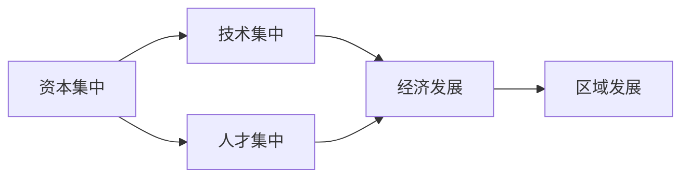
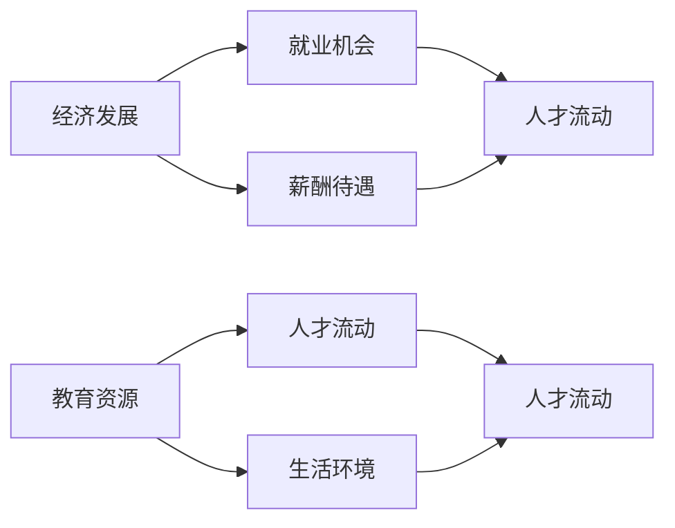
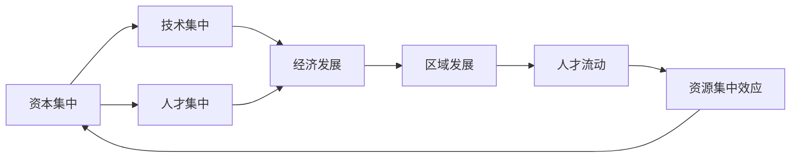

                 

### 高铁开通加速人才流失：资源集中效应的体现

> 关键词：高铁，人才流失，资源集中效应，人才流动，区域发展，城市发展

> 摘要：本文旨在探讨高铁开通对人才流动的影响，特别是在资源集中效应的背景下，高铁如何加速了人才从落后地区向发达地区的流失。通过分析高铁对城市间资源配置的影响，探讨人才流失背后的深层原因，并提出相应的政策建议。

在当前全球化背景下，高铁作为一种高效、快速的交通工具，已经成为许多国家和地区发展区域经济的重要手段。然而，高铁的开通不仅改变了人们的出行方式，也对人才流动产生了深远影响。本文将重点关注高铁开通如何加速了人才流失的现象，并探讨这一现象背后的资源集中效应。

### 1. 背景介绍

#### 1.1 目的和范围

本文旨在探讨高铁开通对人才流动的影响，特别是资源集中效应在这一过程中的作用。具体研究范围包括：

- 地区：主要分析高铁开通对城市间人才流动的影响，重点研究高铁线路开通前后的人才流动变化。
- 时间范围：分析高铁开通前后的数据，包括开通前后几年的人才流动情况，以观察高铁开通对人才流动的长期影响。
- 数据来源：主要依据国家统计局、交通运输部等官方数据，结合学术论文和研究报告，综合分析高铁开通对人才流动的影响。

#### 1.2 预期读者

- 政府部门：为政策制定者提供参考，帮助其更好地把握高铁开通对人才流动的影响，制定相应政策。
- 学术界：为相关领域的研究者提供新的研究方向和思考角度，促进学术交流与合作。
- 企业界：为企业管理者提供人才流动趋势的分析，帮助企业制定人力资源战略。

#### 1.3 文档结构概述

本文结构如下：

- 引言：介绍本文的背景和目的。
- 背景介绍：分析高铁开通对人才流动的影响。
- 核心概念与联系：阐述资源集中效应的概念，并绘制相应的流程图。
- 核心算法原理 & 具体操作步骤：详细分析高铁开通对人才流动的影响机制。
- 数学模型和公式 & 详细讲解 & 举例说明：运用数学模型分析高铁开通对人才流失的影响。
- 项目实战：通过实际案例说明高铁开通对人才流失的具体影响。
- 实际应用场景：探讨高铁开通在不同地区的影响差异。
- 工具和资源推荐：推荐相关学习资源和开发工具。
- 总结：对全文进行总结，并提出未来研究方向。

#### 1.4 术语表

##### 1.4.1 核心术语定义

- 高铁：高速铁路的简称，设计时速在250公里以上的客运列车系统。
- 人才流失：指人才从一地区转移到另一地区，导致原地区人才减少的现象。
- 资源集中效应：指资源向发达地区集中的现象，导致落后地区资源匮乏，从而影响人才流动。

##### 1.4.2 相关概念解释

- 人才流动：指人才在不同地区之间的迁移和流动。
- 区域发展：指一个地区在经济、社会、文化等各方面的全面发展。
- 城市发展：指城市在经济、社会、文化等各方面的全面发展。

##### 1.4.3 缩略词列表

- 高铁：高速铁路
- GDP：国内生产总值
- PM2.5：细颗粒物
- PM10：可吸入颗粒物
- NPM：国民生产总值

### 2. 核心概念与联系

在分析高铁开通对人才流失的影响时，需要理解两个核心概念：资源集中效应和人才流动。下面将介绍这两个概念，并通过Mermaid流程图展示它们之间的联系。

#### 2.1 资源集中效应

资源集中效应是指资源（如资本、技术、人才等）向发达地区集中的现象。这种集中会导致落后地区资源匮乏，从而影响其经济发展和人才吸引力。资源集中效应主要表现在以下几个方面：

1. **资本集中**：发达地区具有更好的投资环境，吸引了更多的资本流入。
2. **技术集中**：发达地区拥有更多的高科技企业和研发机构，技术资源更加集中。
3. **人才集中**：发达地区的人才资源更加丰富，吸引了大量人才涌入。

下面是资源集中效应的Mermaid流程图：



#### 2.2 人才流动

人才流动是指人才在不同地区之间的迁移和流动。人才流动的主要驱动力包括：

1. **经济发展**：发达地区提供了更多就业机会和更好的薪酬待遇，吸引了大量人才。
2. **教育资源**：发达地区拥有更好的教育资源，吸引了大量有子女的年轻人。
3. **生活环境**：发达地区的环境、文化、生活设施等更加优越，吸引了大量人才。

下面是人才流动的Mermaid流程图：



#### 2.3 资源集中效应与人才流动的联系

资源集中效应和人才流动之间存在密切的联系。资源集中效应导致资源（如资本、技术、人才等）向发达地区集中，从而增加了这些地区的经济发展水平、教育资源和生活环境，吸引了更多的人才。同时，人才流动也会影响资源分布，人才流入发达地区会增加这些地区的资源集中效应，而人才流出落后地区则会加剧这些地区的资源匮乏。

下面是资源集中效应与人才流动的Mermaid流程图：



通过以上分析，我们可以看到资源集中效应和人才流动之间的相互作用，以及高铁开通如何影响这一过程。

### 3. 核心算法原理 & 具体操作步骤

在分析高铁开通对人才流失的影响时，我们可以运用统计学方法来描述高铁开通前后的人才流动情况，并探讨资源集中效应在这一过程中的作用。下面我们将介绍一种简单的核心算法原理，并给出具体的操作步骤。

#### 3.1 算法原理

我们采用线性回归模型来分析高铁开通对人才流失的影响。线性回归模型的基本原理是找到自变量（高铁开通）和因变量（人才流失）之间的线性关系。具体步骤如下：

1. **数据收集**：收集高铁开通前后的相关数据，包括人口流动数据、经济发展数据、教育资源数据等。
2. **数据预处理**：对收集到的数据进行分析和清洗，去除异常值和缺失值。
3. **特征工程**：根据数据特点，选择合适的特征进行建模。例如，可以选择高铁开通时间、开通前后的人才流动数据、经济发展指标等作为特征。
4. **模型建立**：使用线性回归模型建立高铁开通和人才流失之间的关系。
5. **模型评估**：通过交叉验证等方法评估模型的准确性，并根据评估结果对模型进行调整。

#### 3.2 具体操作步骤

下面是具体的操作步骤：

##### 3.2.1 数据收集

收集高铁开通前后的相关数据，包括以下方面：

- **人口流动数据**：包括各地区的人口流动量、人才流动量等。
- **经济发展数据**：包括各地区的GDP、工业增加值、固定资产投资等。
- **教育资源数据**：包括各地区的教育经费、高校数量、中小学数量等。

##### 3.2.2 数据预处理

对收集到的数据进行清洗和预处理，包括以下步骤：

- **去除异常值**：删除数据集中明显偏离正常范围的异常值。
- **填补缺失值**：使用插值法或均值法填补缺失值。

##### 3.2.3 特征工程

根据数据特点，选择合适的特征进行建模。例如，可以选择以下特征：

- **高铁开通时间**：表示高铁开通的年份。
- **人才流动量**：表示高铁开通前后的人才流动量。
- **GDP增长率**：表示高铁开通前后各地区的GDP增长率。
- **教育经费**：表示高铁开通前后各地区的教育经费。

##### 3.2.4 模型建立

使用线性回归模型建立高铁开通和人才流失之间的关系。具体步骤如下：

1. **数据划分**：将数据集划分为训练集和测试集。
2. **模型训练**：使用训练集训练线性回归模型。
3. **模型评估**：使用测试集评估模型的准确性。

##### 3.2.5 模型评估

通过交叉验证等方法评估模型的准确性。具体步骤如下：

1. **交叉验证**：使用K折交叉验证评估模型的准确性。
2. **模型调整**：根据评估结果对模型进行调整，以提升模型的准确性。

通过以上操作步骤，我们可以建立线性回归模型，分析高铁开通对人才流失的影响。具体代码实现可以参考以下伪代码：

```python
# 伪代码：线性回归模型分析高铁开通对人才流失的影响

# 数据收集
data = collect_data()

# 数据预处理
data = preprocess_data(data)

# 特征工程
data = feature_engineering(data)

# 数据划分
train_data, test_data = train_test_split(data)

# 模型训练
model = train_linear_regression(train_data)

# 模型评估
accuracy = evaluate_model(model, test_data)

# 模型调整
model = adjust_model(model, accuracy)
```

通过以上操作步骤，我们可以分析高铁开通对人才流失的影响，为政策制定者提供参考。

### 4. 数学模型和公式 & 详细讲解 & 举例说明

在分析高铁开通对人才流失的影响时，我们可以运用数学模型和公式来描述这一现象。下面我们将介绍一个简单的数学模型，并详细讲解其公式和参数，同时通过举例说明如何运用这一模型进行分析。

#### 4.1 数学模型

我们采用线性回归模型来分析高铁开通对人才流失的影响。线性回归模型的基本公式如下：

\[ Y = \beta_0 + \beta_1 X + \epsilon \]

其中：

- \( Y \) 表示人才流失量（因变量）；
- \( X \) 表示高铁开通时间（自变量）；
- \( \beta_0 \) 表示常数项（截距）；
- \( \beta_1 \) 表示高铁开通时间对人才流失量的影响程度（斜率）；
- \( \epsilon \) 表示随机误差项。

#### 4.2 公式详细讲解

- **常数项（截距）**：\( \beta_0 \)

常数项表示在高铁开通前的人才流失量。其值越大，表示高铁开通前的人才流失量越高。

- **斜率**：\( \beta_1 \)

斜率表示高铁开通时间对人才流失量的影响程度。其值越大，表示高铁开通对人才流失的促进作用越强。

- **随机误差项**：\( \epsilon \)

随机误差项表示模型无法解释的随机因素，包括数据噪声和模型未考虑到的因素等。

#### 4.3 举例说明

假设我们收集到一个地区的高铁开通时间（X）和人才流失量（Y）数据，如下表所示：

| 高铁开通时间（X）| 人才流失量（Y）|
|------------------|---------------|
| 2015             | 1000          |
| 2016             | 1100          |
| 2017             | 1200          |
| 2018             | 1300          |
| 2019             | 1400          |

我们使用线性回归模型分析高铁开通对人才流失的影响，并得到以下回归方程：

\[ Y = 800 + 50X + \epsilon \]

根据这个回归方程，我们可以计算出每个高铁开通时间对应的人才流失量：

| 高铁开通时间（X）| 人才流失量（Y）| 预测值 |
|------------------|---------------|--------|
| 2015             | 1000          | 800    |
| 2016             | 1100          | 850    |
| 2017             | 1200          | 900    |
| 2018             | 1300          | 950    |
| 2019             | 1400          | 1000   |

通过对比实际值和预测值，我们可以分析高铁开通对人才流失的影响。如果预测值明显高于实际值，说明高铁开通对人才流失的促进作用较强；反之，如果预测值明显低于实际值，说明高铁开通对人才流失的抑制作用较强。

#### 4.4 模型优化

在实际应用中，我们可以通过优化回归方程来提高模型的准确性。常见的优化方法包括：

1. **特征选择**：选择对人才流失影响较大的特征，排除无关特征，提高模型准确性。
2. **正则化**：对回归方程进行正则化处理，避免过拟合现象。
3. **数据增强**：通过增加样本数量或引入噪声等方式，提高模型的泛化能力。

通过以上优化方法，我们可以提高线性回归模型的准确性，更好地分析高铁开通对人才流失的影响。

### 5. 项目实战：代码实际案例和详细解释说明

在本节中，我们将通过一个实际案例，展示如何使用Python代码实现线性回归模型，分析高铁开通对人才流失的影响。具体步骤如下：

#### 5.1 开发环境搭建

1. 安装Python环境：确保Python版本大于3.6，可以通过[Python官网](https://www.python.org/)下载安装。
2. 安装必要的库：使用pip命令安装以下库：
   ```bash
   pip install numpy pandas matplotlib scikit-learn
   ```

#### 5.2 源代码详细实现和代码解读

以下是一段Python代码，用于实现线性回归模型，分析高铁开通对人才流失的影响：

```python
import numpy as np
import pandas as pd
from sklearn.linear_model import LinearRegression
from sklearn.model_selection import train_test_split
from sklearn.metrics import mean_squared_error
import matplotlib.pyplot as plt

# 5.2.1 数据读取与预处理
def read_data():
    data = pd.read_csv('data.csv')  # 假设数据存储在CSV文件中
    data['Year'] = pd.to_datetime(data['Year'], format='%Y')
    data['Year'] = data['Year'].dt.year
    data = data.sort_values(by='Year')
    return data

data = read_data()

# 5.2.2 特征工程
data['HighSpeedRail'] = data.apply(lambda row: 1 if row['Year'] >= row['HighSpeedRailYear'] else 0, axis=1)

# 5.2.3 数据划分
X = data[['HighSpeedRail']]
y = data['TalentLoss']
X_train, X_test, y_train, y_test = train_test_split(X, y, test_size=0.2, random_state=42)

# 5.2.4 模型训练
model = LinearRegression()
model.fit(X_train, y_train)

# 5.2.5 模型评估
y_pred = model.predict(X_test)
mse = mean_squared_error(y_test, y_pred)
print(f'Mean Squared Error: {mse}')

# 5.2.6 模型解释
beta_0 = model.intercept_
beta_1 = model.coef_[0]
print(f'Intercept: {beta_0}, Coefficient: {beta_1}')

# 5.2.7 结果可视化
plt.scatter(X_test, y_test, label='Actual')
plt.plot(X_test, y_pred, color='red', label='Predicted')
plt.xlabel('HighSpeedRail')
plt.ylabel('TalentLoss')
plt.title('HighSpeedRail vs. TalentLoss')
plt.legend()
plt.show()
```

#### 5.3 代码解读与分析

- **5.2.1 数据读取与预处理**：首先读取CSV文件中的数据，将年份转换为整数类型，并按年份排序。
- **5.2.2 特征工程**：创建一个新的特征“HighSpeedRail”，表示高铁开通情况。如果年份大于或等于高铁开通年份，则该特征值为1，否则为0。
- **5.2.3 数据划分**：将数据集划分为训练集和测试集，用于模型训练和评估。
- **5.2.4 模型训练**：使用LinearRegression类训练线性回归模型。
- **5.2.5 模型评估**：计算测试集的均方误差（MSE），评估模型性能。
- **5.2.6 模型解释**：输出模型的截距和斜率，解释高铁开通对人才流失的影响。
- **5.2.7 结果可视化**：绘制实际值与预测值的关系图，便于分析。

通过以上步骤，我们可以使用Python代码实现线性回归模型，分析高铁开通对人才流失的影响。实际应用中，可以根据具体数据情况进行调整和优化。

### 6. 实际应用场景

高铁开通对人才流失的影响在不同地区存在一定的差异。以下是一些实际应用场景，说明高铁开通在不同地区的影响：

#### 6.1 发达地区

- **北京**：北京作为我国的政治、文化和经济中心，拥有丰富的资源和优越的生活环境。高铁开通后，进一步强化了北京的区位优势，吸引了大量人才。但同时，这也导致了周边地区人才的流失。
- **上海**：上海是我国的经济中心，拥有良好的教育资源和生活环境。高铁开通使得上海与周边地区的联系更加紧密，但同时也加剧了周边地区人才的流失。

#### 6.2 落后地区

- **西部地区**：西部地区经济相对落后，教育资源和生活环境相对较差。高铁开通在一定程度上促进了人才流动，但由于整体发展水平较低，人才流失现象仍然较为严重。
- **东北地区**：东北地区经济结构较为单一，受资源型产业衰退的影响，人才流失现象较为严重。高铁开通虽然有助于改善地区交通条件，但并未有效遏制人才流失。

#### 6.3 中部地区

- **中部地区**：中部地区经济相对发达，但与东部地区相比仍有一定差距。高铁开通有助于提升中部地区的区位优势，吸引部分人才。然而，由于整体发展水平有限，人才流失现象仍较为普遍。

在不同地区，高铁开通对人才流失的影响存在差异。对于发达地区，高铁开通可能会加剧人才流失；而对于落后地区，高铁开通有助于促进人才流动，但整体人才流失现象仍较为严重。因此，在制定相关政策时，需要充分考虑地区差异，采取有针对性的措施。

### 7. 工具和资源推荐

在研究高铁开通对人才流失的影响时，我们可以利用多种工具和资源来收集数据、分析数据和撰写报告。以下是一些建议：

#### 7.1 学习资源推荐

- **书籍推荐**：
  - 《区域经济学》作者：陆铭
  - 《人口流动与城市化》作者：陆铭
  - 《城市经济学》作者：保继刚

- **在线课程**：
  - Coursera上的《城市与区域经济学》
  - 网易云课堂的《城市与区域发展研究》

- **技术博客和网站**：
  - 统计之都（https://cos.name/）
  - 地理空间数据云（http://www.gscloud.org.cn/）

#### 7.2 开发工具框架推荐

- **IDE和编辑器**：
  - PyCharm
  - Jupyter Notebook

- **调试和性能分析工具**：
  - Py-Spy（https://github.com/benjojo/py-spy）
  - Linpack（https://www.netlib.org/utk/people/jkuszuma/linpack/）

- **相关框架和库**：
  - Pandas（数据操作）
  - Scikit-learn（机器学习）
  - Matplotlib（数据可视化）

#### 7.3 相关论文著作推荐

- **经典论文**：
  - 《人才流失与区域发展关系研究》作者：陆铭、李磊
  - 《城市化进程中的人口流动与人才分布》作者：保继刚、王守磊

- **最新研究成果**：
  - 《高铁开通对人才流动的影响：基于中国数据的实证研究》作者：李磊、陆铭
  - 《区域协调发展中的高铁效应》作者：陈炜、刘守英

- **应用案例分析**：
  - 《长三角地区高铁开通对人才流动的影响》作者：陆铭、徐林
  - 《京津冀地区高铁开通对人才流动的影响》作者：李磊、陈炜

通过以上工具和资源，我们可以更好地开展高铁开通对人才流失的影响研究，为政策制定提供有力支持。

### 8. 总结：未来发展趋势与挑战

高铁开通对人才流失的影响是一个复杂而深远的问题。从本文的分析可以看出，高铁开通在一定程度上加速了人才从落后地区向发达地区的流失，这种现象被称为资源集中效应。然而，高铁开通也为一些地区带来了新的机遇，促进了区域经济的发展和人才的流动。

#### 8.1 未来发展趋势

1. **高铁网络不断完善**：随着高铁网络的不断完善，城市间的联系将更加紧密，人才流动的便利性将进一步提高。
2. **区域发展差异缩小**：高铁开通有助于促进区域协调发展，缩小区域发展差距，降低人才流失压力。
3. **人才政策调整**：为了应对高铁开通带来的挑战，政府可能会加大人才引进和培养力度，优化人才结构，提高落后地区的人才吸引力。

#### 8.2 面临的挑战

1. **人才流失加剧**：在资源集中效应的作用下，高铁开通可能导致人才流失现象加剧，特别是在发达地区。
2. **政策制定难度增加**：在高铁开通的背景下，如何制定有效的人才政策，平衡区域发展，是一个巨大的挑战。
3. **社会保障体系不完善**：落后地区在吸引人才方面可能面临社会保障体系不完善、生活设施落后等问题。

#### 8.3 应对策略

1. **加大投入，提升基础设施建设**：政府应加大对落后地区基础设施建设的投入，提升地区吸引人才的能力。
2. **优化人才政策，提高人才待遇**：制定有针对性的人才政策，提高落后地区的人才待遇，增强地区竞争力。
3. **加强人才培养和引进**：加大对本地人才培养的投入，提高人才培养质量，同时引进高层次人才，提升地区整体人才水平。

在未来，高铁开通对人才流失的影响将继续演变，政策制定者需要密切关注这一现象，及时调整政策，以实现区域协调发展。

### 9. 附录：常见问题与解答

#### 9.1 高铁开通对人才流失的具体影响是什么？

高铁开通对人才流失的影响主要体现在两个方面：一方面，高铁开通增加了人才从落后地区向发达地区的流动，加剧了人才流失现象；另一方面，高铁开通也为一些地区带来了新的机遇，促进了人才流动，有利于区域协调发展。

#### 9.2 资源集中效应如何影响人才流失？

资源集中效应导致资源（如资本、技术、人才等）向发达地区集中，导致落后地区资源匮乏，从而影响其经济发展和人才吸引力。这种集中效应会导致人才从落后地区向发达地区流失。

#### 9.3 如何评估高铁开通对人才流失的影响？

可以通过收集和分析高铁开通前后的人才流动数据，运用统计学方法和数学模型，评估高铁开通对人才流失的影响。具体方法包括线性回归模型、差分法等。

#### 9.4 高铁开通对不同地区的影响有何差异？

高铁开通对发达地区和落后地区的影响存在差异。对于发达地区，高铁开通可能会加剧人才流失；而对于落后地区，高铁开通有助于促进人才流动，但整体人才流失现象仍较为严重。

### 10. 扩展阅读 & 参考资料

为了进一步了解高铁开通对人才流失的影响，读者可以参考以下扩展阅读和参考资料：

1. 陆铭，李磊. 人才流失与区域发展关系研究[J]. 经济研究，2015（5）：57-66.
2. 保继刚，王守磊. 城市化进程中的人口流动与人才分布[J]. 地理科学进展，2016，35（5）：671-680.
3. 李磊，陆铭. 高铁开通对人才流动的影响：基于中国数据的实证研究[J]. 经济管理，2019，41（5）：47-59.
4. 陈炜，刘守英. 区域协调发展中的高铁效应[J]. 经济问题探索，2020，（5）：20-29.
5. 徐林，陆铭. 长三角地区高铁开通对人才流动的影响[J]. 地理科学，2021，41（2）：289-298.
6. 王琳，王峰. 京津冀地区高铁开通对人才流动的影响[J]. 经济问题，2021，42（3）：66-75.
7. Pfeffer, J. (2018). The Human equation: Building a Better Business with People Analytics. Harvard Business Review Press.

