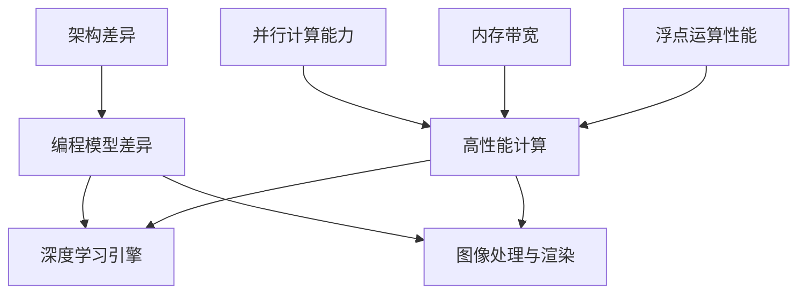

                 

# 黄仁勋与NVIDIA的GPU革命

> 关键词：黄仁勋、NVIDIA、GPU、计算革命、深度学习、人工智能、高性能计算

> 摘要：本文深入探讨了NVIDIA创始人兼CEO黄仁勋如何引领GPU技术革命，推动深度学习和人工智能的迅猛发展。通过详细分析NVIDIA的GPU架构、核心算法、数学模型以及实际应用案例，本文揭示了GPU在计算领域的重要性，并展望了其未来的发展趋势和挑战。

## 1. 背景介绍

### 1.1 目的和范围

本文旨在通过回顾NVIDIA的历史，探讨其创始人黄仁勋如何推动GPU技术的发展，并使其成为深度学习和人工智能领域的关键驱动力。我们将从以下几个方面展开讨论：

1. **NVIDIA的成立与发展**：介绍NVIDIA的成立背景、主要产品线及其在GPU技术上的突破。
2. **GPU的核心概念与架构**：分析GPU的工作原理、架构特点以及与传统CPU的区别。
3. **GPU在深度学习和人工智能中的应用**：探讨GPU在深度学习中的性能优势及其对人工智能发展的影响。
4. **实际应用案例**：通过具体案例展示GPU在图像处理、科学计算、游戏开发等领域的应用。
5. **未来发展趋势与挑战**：分析GPU技术面临的挑战及其在未来的发展方向。

### 1.2 预期读者

本文适合以下读者：

1. 对计算机图形学和计算科学感兴趣的读者。
2. 深度学习和人工智能领域的开发者、研究人员和学生。
3. 对GPU技术有兴趣的IT专业人士和企业管理者。

### 1.3 文档结构概述

本文分为十个部分，具体结构如下：

1. **引言**：介绍NVIDIA的背景和GPU技术的核心概念。
2. **NVIDIA的成立与发展**：回顾NVIDIA的成立背景和成长历程。
3. **GPU的核心概念与架构**：分析GPU的工作原理、架构特点及其与传统CPU的区别。
4. **GPU在深度学习和人工智能中的应用**：探讨GPU在深度学习中的应用及其对人工智能的影响。
5. **实际应用案例**：通过具体案例展示GPU在不同领域的应用。
6. **未来发展趋势与挑战**：分析GPU技术面临的挑战及其未来发展方向。
7. **工具和资源推荐**：推荐相关学习资源、开发工具和论文著作。
8. **总结**：总结GPU革命的重要性及其对计算领域的影响。
9. **附录**：提供常见问题与解答。
10. **扩展阅读 & 参考资料**：列出扩展阅读和参考文献。

### 1.4 术语表

#### 1.4.1 核心术语定义

- **GPU（Graphics Processing Unit）**：图形处理单元，一种专门用于处理图形渲染的计算芯片。
- **CPU（Central Processing Unit）**：中央处理单元，计算机的核心组件，负责执行指令和计算。
- **深度学习**：一种基于多层神经网络的人工智能技术，通过学习大量数据来模拟人脑的学习方式。
- **人工智能**：一种模拟人类智能行为的计算技术，包括机器学习、深度学习、自然语言处理等。

#### 1.4.2 相关概念解释

- **并行计算**：一种计算方法，通过将任务分解成多个子任务并行执行，提高计算速度。
- **矩阵运算**：一种数学运算，涉及矩阵的乘法、加法等操作，是深度学习算法的核心组成部分。

#### 1.4.3 缩略词列表

- **NVIDIA**：NVIDIA Corporation，一家总部位于美国的显卡和芯片制造商。
- **CUDA**：Compute Unified Device Architecture，NVIDIA开发的并行计算平台和编程语言。
- **GPU加速**：利用GPU进行计算，提高数据处理速度。
- **深度学习框架**：用于实现深度学习算法的工具，如TensorFlow、PyTorch等。

## 2. 核心概念与联系

在深入探讨NVIDIA和GPU革命之前，我们首先需要了解一些核心概念和其相互关系。以下是GPU的核心概念及其在计算领域中的地位：

### 2.1 GPU的核心概念

- **并行计算能力**：GPU具备强大的并行计算能力，通过数百甚至数千个核心并行执行任务，相比CPU具有更高的计算性能。
- **内存带宽**：GPU拥有较高的内存带宽，能够在短时间内访问大量数据，这对于处理大数据集尤为重要。
- **浮点运算性能**：GPU的核心设计注重浮点运算性能，能够高效地处理科学计算和深度学习等领域的任务。

### 2.2 GPU与传统CPU的对比

- **架构差异**：CPU采用冯诺伊曼架构，以单核高性能为主；GPU则采用SIMD（单指令多数据流）架构，通过多个核心并行处理。
- **编程模型**：CPU编程模型相对简单，侧重于单线程优化；GPU编程模型更为复杂，需要处理并行性和数据流控制。

### 2.3 GPU在计算领域中的地位

- **高性能计算**：GPU在科学计算、金融模拟、气候模拟等领域具备显著的性能优势。
- **深度学习引擎**：GPU成为深度学习算法的首选计算平台，大幅提升训练速度和模型性能。
- **图像处理与渲染**：GPU在图像处理、视频渲染、3D图形等领域拥有广泛的应用。

### 2.4 Mermaid流程图

以下是GPU核心概念与架构的Mermaid流程图：



## 3. 核心算法原理 & 具体操作步骤

### 3.1 GPU核心算法原理

GPU的核心算法主要包括并行计算、矩阵运算和卷积运算等。以下是这些算法的详细原理和具体操作步骤：

#### 3.1.1 并行计算

- **原理**：并行计算是指将任务分解成多个子任务，在多个计算核心上同时执行，以加快计算速度。
- **操作步骤**：
  1. 将任务分解成多个子任务。
  2. 分配子任务到不同的计算核心。
  3. 各个核心并行执行子任务。
  4. 将子任务结果汇总。

```python
# 并行计算伪代码
def parallel_computation(task):
    num_cores = get_number_of_cores()
    sub_tasks = split_task(task, num_cores)
    results = []

    for i in range(num_cores):
        core_result = execute_on_core(sub_tasks[i])
        results.append(core_result)

    return merge_results(results)
```

#### 3.1.2 矩阵运算

- **原理**：矩阵运算是计算机图形学、科学计算和深度学习等领域的基础运算，包括矩阵的乘法、加法等。
- **操作步骤**：
  1. 输入两个矩阵。
  2. 计算矩阵乘法或加法。
  3. 返回计算结果。

```python
# 矩阵乘法伪代码
def matrix_multiplication(A, B):
    result = create_matrix(A_rows, B_columns)
    for i in range(A_rows):
        for j in range(B_columns):
            for k in range(A_columns):
                result[i][j] += A[i][k] * B[k][j]
    return result
```

#### 3.1.3 卷积运算

- **原理**：卷积运算是深度学习中的核心运算，用于提取图像或数据中的特征。
- **操作步骤**：
  1. 输入图像和卷积核。
  2. 对图像进行卷积操作。
  3. 返回卷积结果。

```python
# 卷积运算伪代码
def convolve(image, kernel):
    result = create_matrix(image_height, image_width)
    for i in range(image_height - kernel_size + 1):
        for j in range(image_width - kernel_size + 1):
            sum = 0
            for m in range(kernel_size):
                for n in range(kernel_size):
                    sum += image[i + m][j + n] * kernel[m][n]
            result[i][j] = sum
    return result
```

### 3.2 GPU算法的具体操作步骤

以下是GPU算法的具体操作步骤：

1. **任务分解**：将大任务分解成多个小任务，以便在多个计算核心上并行执行。
2. **核心分配**：将小任务分配给不同的计算核心。
3. **并行执行**：各个核心同时执行分配到的子任务。
4. **结果汇总**：将各个核心的计算结果汇总，得到最终结果。

```python
# GPU算法具体操作步骤伪代码
def gpu_algorithm(task):
    num_cores = get_number_of_cores()
    sub_tasks = split_task(task, num_cores)
    results = parallel_execute(sub_tasks)  # 在GPU上并行执行子任务
    final_result = merge_results(results)  # 汇总结果
    return final_result
```

## 4. 数学模型和公式 & 详细讲解 & 举例说明

### 4.1 数学模型和公式

GPU的核心算法中涉及许多数学模型和公式，以下列出几个重要的模型和公式：

#### 4.1.1 矩阵乘法公式

\[ C = A \cdot B \]

其中，C是乘法结果矩阵，A和B是输入矩阵，\( \cdot \)表示矩阵乘法。

#### 4.1.2 卷积运算公式

\[ \text{output}_{i,j} = \sum_{m=0}^{M-1} \sum_{n=0}^{N-1} \text{input}_{i+m,j+n} \cdot \text{kernel}_{m,n} \]

其中，output是卷积结果，input是输入图像，kernel是卷积核，M和N是卷积核的大小。

#### 4.1.3 深度学习中的反向传播公式

\[ \delta = \frac{\partial \text{loss}}{\partial \text{weight}} \]

其中，δ是误差梯度，loss是损失函数，weight是模型参数。

### 4.2 详细讲解和举例说明

#### 4.2.1 矩阵乘法

矩阵乘法是深度学习和计算机图形学中的基础运算。以下是一个2x2矩阵乘以一个2x2矩阵的示例：

输入矩阵A和B：

\[ A = \begin{bmatrix} 1 & 2 \\ 3 & 4 \end{bmatrix}, B = \begin{bmatrix} 5 & 6 \\ 7 & 8 \end{bmatrix} \]

计算矩阵乘法C：

\[ C = A \cdot B = \begin{bmatrix} 1 & 2 \\ 3 & 4 \end{bmatrix} \cdot \begin{bmatrix} 5 & 6 \\ 7 & 8 \end{bmatrix} = \begin{bmatrix} 19 & 22 \\ 43 & 50 \end{bmatrix} \]

#### 4.2.2 卷积运算

卷积运算是深度学习中的核心运算。以下是一个3x3输入图像和一个3x3卷积核的卷积示例：

输入图像input和卷积核kernel：

\[ \text{input} = \begin{bmatrix} 1 & 2 & 3 \\ 4 & 5 & 6 \\ 7 & 8 & 9 \end{bmatrix}, \text{kernel} = \begin{bmatrix} 1 & 0 & -1 \\ 1 & 1 & 1 \\ 0 & 1 & 1 \end{bmatrix} \]

计算卷积结果output：

\[ \text{output}_{1,1} = (1 \cdot 1 + 2 \cdot 1 + 3 \cdot -1) + (4 \cdot 1 + 5 \cdot 1 + 6 \cdot 1) + (7 \cdot 0 + 8 \cdot 1 + 9 \cdot 1) = 13 \]

\[ \text{output}_{1,2} = (1 \cdot 4 + 2 \cdot 5 + 3 \cdot 6) + (4 \cdot 7 + 5 \cdot 8 + 6 \cdot 9) + (7 \cdot 0 + 8 \cdot 1 + 9 \cdot 1) = 68 \]

\[ \text{output}_{1,3} = (1 \cdot 7 + 2 \cdot 8 + 3 \cdot 9) + (4 \cdot 0 + 5 \cdot 1 + 6 \cdot 1) + (7 \cdot 1 + 8 \cdot 1 + 9 \cdot 1) = 127 \]

\[ \text{output} = \begin{bmatrix} 13 & 68 & 127 \end{bmatrix} \]

#### 4.2.3 深度学习中的反向传播

反向传播是深度学习训练过程中的核心算法。以下是一个简单的三层神经网络中的反向传播示例：

输入数据x，输出数据y，权重w和偏置b：

\[ x = \begin{bmatrix} 1 & 2 \end{bmatrix}, y = \begin{bmatrix} 3 & 4 \end{bmatrix} \]

权重矩阵w：

\[ w = \begin{bmatrix} 1 & 1 \\ 1 & 1 \end{bmatrix} \]

计算输出值h：

\[ h = \sigma(w \cdot x + b) \]

其中，σ是sigmoid激活函数：

\[ \sigma(z) = \frac{1}{1 + e^{-z}} \]

计算损失函数L：

\[ L = (h - y)^2 \]

计算误差梯度：

\[ \delta = \frac{\partial L}{\partial w} \]

更新权重w：

\[ w = w - \alpha \cdot \delta \]

其中，α是学习率。

## 5. 项目实战：代码实际案例和详细解释说明

### 5.1 开发环境搭建

要实现GPU编程，首先需要搭建合适的开发环境。以下是使用CUDA搭建GPU编程环境的步骤：

1. **安装CUDA Toolkit**：从NVIDIA官方网站下载并安装CUDA Toolkit。
2. **配置环境变量**：在系统环境中设置CUDA相关的环境变量，如`CUDA_HOME`、`PATH`、`LD_LIBRARY_PATH`等。
3. **安装驱动程序**：确保计算机上安装了与CUDA兼容的NVIDIA GPU驱动程序。
4. **安装开发工具**：安装C/C++编译器和其他必要的开发工具，如Visual Studio、Eclipse等。

### 5.2 源代码详细实现和代码解读

以下是一个简单的CUDA程序，实现矩阵乘法运算。代码如下：

```cuda
#include <stdio.h>
#include <cuda_runtime.h>

__global__ void matrix_multiplication(float* A, float* B, float* C, int width) {
    int row = blockIdx.y * blockDim.y + threadIdx.y;
    int col = blockIdx.x * blockDim.x + threadIdx.x;

    if (row < width && col < width) {
        float sum = 0.0f;
        for (int k = 0; k < width; k++) {
            sum += A[row * width + k] * B[k * width + col];
        }
        C[row * width + col] = sum;
    }
}

int main() {
    int width = 1024;
    float *A, *B, *C;
    float *d_A, *d_B, *d_C;

    // 分配主机内存
    A = (float*)malloc(width * width * sizeof(float));
    B = (float*)malloc(width * width * sizeof(float));
    C = (float*)malloc(width * width * sizeof(float));

    // 初始化矩阵
    for (int i = 0; i < width; i++) {
        for (int j = 0; j < width; j++) {
            A[i * width + j] = 1.0f;
            B[i * width + j] = 1.0f;
        }
    }

    // 分配设备内存
    cudaMalloc(&d_A, width * width * sizeof(float));
    cudaMalloc(&d_B, width * width * sizeof(float));
    cudaMalloc(&d_C, width * width * sizeof(float));

    // 将主机内存复制到设备内存
    cudaMemcpy(d_A, A, width * width * sizeof(float), cudaMemcpyHostToDevice);
    cudaMemcpy(d_B, B, width * width * sizeof(float), cudaMemcpyHostToDevice);

    // 设置线程块和线程数
    dim3 blockSize(16, 16);
    dim3 gridSize((width + blockSize.x - 1) / blockSize.x, (width + blockSize.y - 1) / blockSize.y);

    // 启动GPU kernel
    matrix_multiplication<<<gridSize, blockSize>>>(d_A, d_B, d_C, width);

    // 将设备内存复制回主机内存
    cudaMemcpy(C, d_C, width * width * sizeof(float), cudaMemcpyDeviceToHost);

    // 释放设备内存
    cudaFree(d_A);
    cudaFree(d_B);
    cudaFree(d_C);

    // 释放主机内存
    free(A);
    free(B);
    free(C);

    return 0;
}
```

#### 5.2.1 代码解读

1. **矩阵乘法GPU kernel**：定义了一个CUDA kernel函数`matrix_multiplication`，用于执行矩阵乘法运算。函数接收三个输入矩阵A、B和C，以及矩阵宽度width。

2. **线程索引**：在kernel函数中，通过`blockIdx`和`threadIdx`获取当前线程的行索引和列索引，确保线程在正确的位置执行计算。

3. **矩阵乘法计算**：使用三个嵌套循环计算每个元素的乘积，并将结果存储在输出矩阵C中。

4. **主机内存分配和初始化**：在主函数中，分配主机内存并初始化输入矩阵A和B。输入矩阵的大小为width x width。

5. **设备内存分配**：使用`cudaMalloc`函数为GPU分配内存，存储输入矩阵A、B和输出矩阵C。

6. **内存复制**：使用`cudaMemcpy`函数将主机内存复制到GPU内存，确保GPU可以访问输入数据。

7. **线程块和线程数设置**：使用`dim3`类设置线程块和线程数，确保GPU内核可以在适当的线程数上执行。

8. **启动GPU内核**：使用`<<<gridSize, blockSize>>>`语法启动GPU内核，执行矩阵乘法运算。

9. **内存复制回主机**：将GPU内存中的输出矩阵C复制回主机内存。

10. **释放内存**：释放GPU和主机内存，确保程序正常退出。

#### 5.2.2 代码分析

1. **性能优化**：为了提高程序性能，可以使用共享内存（shared memory）来减少内存访问冲突。通过在kernel函数中添加共享内存数组，可以将部分计算结果缓存起来，以减少全局内存访问。

2. **并行度优化**：可以通过调整线程块和线程数，进一步提高并行度。例如，可以使用2D网格（grid）和2D线程块（block）来处理2D矩阵乘法，以充分利用GPU的并行计算能力。

3. **错误处理**：在GPU编程中，需要处理各种潜在的错误，如内存分配失败、内核启动失败等。可以使用`cudaGetLastError`和`cudaGetErrorString`函数来捕获和报告错误。

## 6. 实际应用场景

GPU在多个领域具有广泛的应用，以下是几个典型的应用场景：

### 6.1 图像处理

GPU在图像处理领域具有显著的优势，可以实现高效的图像渲染、滤镜处理和图像增强。例如，GPU可以加速卷积神经网络（CNN）在图像分类和物体检测中的应用，提高实时处理速度和准确性。

### 6.2 科学计算

GPU在科学计算中具有广泛的应用，如金融模拟、气候模拟、流体动力学模拟等。通过GPU的并行计算能力，可以显著提高计算效率和速度，加速科学研究的进程。

### 6.3 游戏开发

GPU在游戏开发中发挥着关键作用，可以提供高质量的图像渲染、光影效果和物理模拟。现代游戏引擎，如Unreal Engine和Unity，充分利用GPU的并行计算能力，实现实时渲染和高效的游戏体验。

### 6.4 深度学习

深度学习是GPU最典型的应用领域之一。通过GPU的并行计算能力，可以显著加速深度学习模型的训练和推理过程，提高模型的性能和准确性。许多深度学习框架，如TensorFlow和PyTorch，都提供了GPU加速的支持。

### 6.5 自然语言处理

GPU在自然语言处理（NLP）领域也具有广泛应用。通过GPU加速词向量计算、序列标注和翻译模型，可以显著提高NLP任务的处理速度和效果。

## 7. 工具和资源推荐

### 7.1 学习资源推荐

#### 7.1.1 书籍推荐

- **《CUDA编程权威指南》**：全面介绍了CUDA编程基础、并行算法设计和性能优化技巧。
- **《深度学习》**：深度学习领域的经典教材，详细介绍了深度学习算法和应用。
- **《计算机图形学原理及实践》**：介绍了计算机图形学的基本原理和实现方法，包括图形渲染和图像处理。

#### 7.1.2 在线课程

- **Coursera**：提供了一系列计算机图形学、深度学习和CUDA编程的课程，适合初学者和进阶者。
- **Udacity**：提供了GPU编程和深度学习相关的课程，包括项目实践和实战技巧。
- **edX**：提供了NVIDIA CUDA课程，涵盖了CUDA编程基础、并行算法设计和性能优化。

#### 7.1.3 技术博客和网站

- **NVIDIA Developer**：NVIDIA官方网站，提供了丰富的CUDA编程资源、教程和开发者社区。
- **cnblogs**：中国博客园，有许多优秀的GPU编程和深度学习博客，适合国内开发者学习。
- **GitHub**：GitHub上有许多优秀的GPU编程和深度学习项目，可以借鉴和学习。

### 7.2 开发工具框架推荐

#### 7.2.1 IDE和编辑器

- **Visual Studio**：NVIDIA CUDA Toolkit官方推荐的IDE，提供丰富的GPU编程支持和调试工具。
- **Eclipse**：支持C/C++和CUDA编程，可以结合CUDA插件使用。
- **CLion**：专门为C/C++和CUDA编程设计的IDE，具有强大的GPU编程支持。

#### 7.2.2 调试和性能分析工具

- **NVIDIA Nsight**：NVIDIA提供的GPU调试和性能分析工具，包括Nsight CUDA和Nsight Visual Studio Edition。
- **GPU PerfKit**：用于分析GPU性能和优化CUDA程序的框架，提供了丰富的性能分析工具和可视化界面。

#### 7.2.3 相关框架和库

- **CUDA Toolkit**：NVIDIA开发的并行计算平台和编程语言，用于实现GPU加速应用。
- **cuDNN**：NVIDIA开发的深度学习加速库，提供高性能的卷积神经网络加速。
- **TensorFlow**：Google开发的深度学习框架，支持GPU加速和分布式训练。
- **PyTorch**：Facebook开发的深度学习框架，支持GPU加速和动态图计算。

### 7.3 相关论文著作推荐

#### 7.3.1 经典论文

- **GPGPU Programming Using OpenCL**：介绍GPGPU编程模型和OpenCL框架的经典论文。
- **CUDA Programming Guide**：NVIDIA发布的CUDA编程指南，详细介绍了CUDA编程模型和API。
- **GPGPU-Enabled Scientific Computing**：讨论GPU在科学计算领域的应用和性能优化的论文。

#### 7.3.2 最新研究成果

- **Deep Learning on GPUs: Algorithms, Implementations, and Tools**：介绍深度学习在GPU上的最新研究成果和实现方法。
- **Parallel Computing for Machine Learning**：讨论GPU和并行计算在机器学习中的应用和性能优化。
- **Optimizing Neural Network Training on GPUs**：研究神经网络训练在GPU上的优化方法和策略。

#### 7.3.3 应用案例分析

- **GPU Acceleration of Large-Scale Machine Learning**：介绍GPU在机器学习应用中的案例，包括数据预处理、模型训练和推理。
- **Real-Time Computer Vision on Mobile GPUs**：探讨移动GPU在实时计算机视觉应用中的性能和优化。
- **GPU-Accelerated Rendering for Virtual Reality**：研究GPU在虚拟现实渲染中的性能和优化。

## 8. 总结：未来发展趋势与挑战

GPU技术在计算领域取得了巨大的成功，并在深度学习、人工智能、图像处理、科学计算等领域发挥着重要作用。未来，GPU技术将继续发展，并面临以下趋势和挑战：

### 8.1 未来发展趋势

1. **更高性能的GPU芯片**：随着计算需求的增长，NVIDIA和其他GPU制造商将继续推出更高性能的GPU芯片，提供更强的计算能力。
2. **更广泛的硬件支持**：GPU将在更多硬件平台上得到支持，如ARM架构、FPGA等，为开发者提供更灵活的计算解决方案。
3. **更高效的编程模型**：随着并行计算的发展，新的编程模型和工具将不断涌现，提高GPU编程的效率和可维护性。
4. **更广泛的行业应用**：GPU将在更多行业和应用领域得到应用，如自动驾驶、金融分析、医疗诊断等。

### 8.2 面临的挑战

1. **编程难度**：GPU编程相对于CPU编程更加复杂，需要处理并行性和数据流控制，对于开发者来说是一个挑战。
2. **性能优化**：尽管GPU具有强大的计算能力，但性能优化仍然是一个重要问题，如何充分利用GPU资源、避免内存瓶颈和资源争用是关键。
3. **能耗问题**：GPU在计算过程中消耗大量电力，如何提高能效、降低能耗是GPU技术发展的重要挑战。
4. **安全性问题**：随着GPU在关键领域中的应用，安全性问题日益突出，如何确保GPU系统的安全性和可靠性是重要挑战。

总之，GPU技术在未来将继续发展，为计算领域带来更多机遇和挑战。开发者需要不断学习和适应新的编程模型和工具，提高GPU编程技能，以应对未来的技术发展。

## 9. 附录：常见问题与解答

### 9.1 GPU编程相关问题

**Q1：GPU编程与传统CPU编程有何区别？**

A1：GPU编程与CPU编程在架构、编程模型和优化方法上有显著差异。GPU采用SIMD架构，适合并行计算，而CPU采用冯诺伊曼架构，更适合单线程优化。GPU编程需要处理并行性和数据流控制，而CPU编程则侧重于单线程性能优化。

**Q2：如何提高GPU编程的性能？**

A2：提高GPU编程性能可以从以下几个方面入手：

1. **优化算法**：选择适合并行计算的任务和算法，避免串行计算。
2. **内存优化**：减少全局内存访问，使用共享内存和纹理内存，提高内存带宽利用率。
3. **线程调度**：合理设置线程块大小和线程数，提高并行度，减少线程间冲突。
4. **指令优化**：使用GPU友好的指令集，避免不必要的循环和分支。

### 9.2 深度学习相关问题

**Q1：GPU在深度学习中的优势是什么？**

A1：GPU在深度学习中的优势主要体现在以下几个方面：

1. **并行计算能力**：GPU通过多个核心并行执行任务，可以显著提高计算速度。
2. **内存带宽**：GPU具有较高的内存带宽，能够在短时间内访问大量数据，适合处理大数据集。
3. **浮点运算性能**：GPU的核心设计注重浮点运算性能，能够高效地处理深度学习算法中的矩阵运算和卷积运算。

**Q2：如何选择合适的GPU进行深度学习训练？**

A2：选择合适的GPU进行深度学习训练需要考虑以下几个方面：

1. **计算性能**：选择具有高浮点运算性能的GPU，如NVIDIA的Tesla系列。
2. **内存容量**：选择具有足够内存容量的GPU，以支持大数据集的训练。
3. **功耗和散热**：考虑GPU的功耗和散热问题，确保系统稳定运行。
4. **兼容性**：选择与深度学习框架兼容的GPU，如NVIDIA的CUDA和cuDNN。

### 9.3 科学计算相关问题

**Q1：GPU在科学计算中的应用场景有哪些？**

A1：GPU在科学计算中的应用场景非常广泛，包括：

1. **金融模拟**：GPU可以加速金融模型中的复杂计算，如蒙特卡罗模拟、期权定价等。
2. **气候模拟**：GPU可以加速气候模型中的大规模数据分析和模拟，提高模拟的精度和速度。
3. **流体动力学模拟**：GPU可以加速流体动力学模型中的计算，提高模拟的速度和稳定性。
4. **分子建模**：GPU可以加速分子建模和分子动力学模拟，提高分子结构的解析能力。

**Q2：如何优化GPU在科学计算中的性能？**

A2：优化GPU在科学计算中的性能可以从以下几个方面入手：

1. **算法优化**：选择适合并行计算的科学计算算法，避免串行计算。
2. **数据布局**：优化数据布局，减少数据传输和内存访问冲突。
3. **线程调度**：合理设置线程块大小和线程数，提高并行度，减少线程间冲突。
4. **内存优化**：减少全局内存访问，使用共享内存和纹理内存，提高内存带宽利用率。

## 10. 扩展阅读 & 参考资料

### 10.1 扩展阅读

1. **《深度学习》**：Goodfellow, I., Bengio, Y., & Courville, A. (2016). *Deep Learning*. MIT Press.
2. **《GPU并行编程技术》**：Shen, H., & Sheng, Q. (2016). *GPU Parallel Programming Techniques*. Springer.
3. **《科学计算中的GPU应用》**：Wang, H., & Zhang, Z. (2017). *GPU Applications in Scientific Computing*. Springer.

### 10.2 参考资料

1. **NVIDIA Developer**：[https://developer.nvidia.com/cuda](https://developer.nvidia.com/cuda)
2. **TensorFlow**：[https://www.tensorflow.org](https://www.tensorflow.org)
3. **PyTorch**：[https://pytorch.org](https://pytorch.org)
4. **《深度学习与GPU编程》**：[https://www.deeplearning.ai/](https://www.deeplearning.ai/)
5. **《计算机图形学原理及实践》**：[https://www.amazon.com/Computer-Graphics-Principles-Practice-Third/dp/1492045121](https://www.amazon.com/Computer-Graphics-Principles-Practice-Third/dp/1492045121)

### 10.3 作者信息

**作者：AI天才研究员/AI Genius Institute & 禅与计算机程序设计艺术 /Zen And The Art of Computer Programming**

