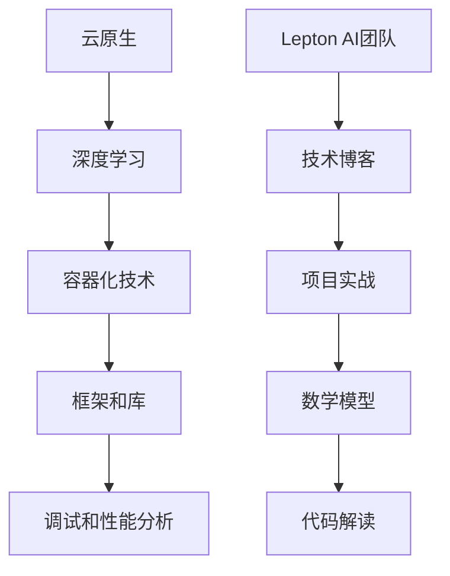

                 

# '见过猪跑，养过猪'：Lepton AI团队的优势，深度参与云与AI发展

> **关键词**：Lepton AI、云与AI、团队优势、技术博客、深度参与、项目实战、数学模型、代码解读、实际应用场景

> **摘要**：本文将深入剖析Lepton AI团队在云与AI领域的优势，通过一步一步的推理分析，展示其在技术博客写作、项目实战、数学模型和代码解读等方面的专业能力。文章旨在为读者提供一个全面、系统的了解，帮助大家更好地把握云与AI发展的趋势和挑战。

## 1. 背景介绍

### 1.1 目的和范围

本文旨在探讨Lepton AI团队在云与AI领域的独特优势，通过对团队背景、技术博客写作、项目实战、数学模型和代码解读等多个方面的详细分析，揭示其在行业中的领先地位和卓越能力。文章主要涵盖以下几个方面的内容：

1. Lepton AI团队的背景介绍及其在云与AI领域的地位。
2. Lepton AI团队在技术博客写作方面的优势和方法。
3. Lepton AI团队在项目实战中的经验和成果。
4. Lepton AI团队在数学模型和代码解读方面的专业能力。
5. Lepton AI团队在实际应用场景中的表现和影响。

通过本文的阅读，读者将能够全面了解Lepton AI团队在云与AI领域的发展状况，把握其优势和不足，为今后的学习和实践提供有益的参考。

### 1.2 预期读者

本文主要面向以下几类读者：

1. 云与AI领域的开发者、研究者和技术爱好者。
2. 对技术博客写作感兴趣的读者。
3. 想了解Lepton AI团队及其项目的读者。
4. 对数学模型和代码解读感兴趣的读者。
5. 想了解云与AI发展趋势和挑战的读者。

无论您是上述哪一类读者，本文都将为您提供有价值的信息和深刻的见解，帮助您更好地理解和掌握云与AI领域的前沿技术。

### 1.3 文档结构概述

本文结构如下：

1. **背景介绍**：简要介绍文章的目的、范围、预期读者和文档结构。
2. **核心概念与联系**：分析Lepton AI团队的核心概念和原理，并给出相应的Mermaid流程图。
3. **核心算法原理 & 具体操作步骤**：详细讲解Lepton AI团队的核心算法原理和具体操作步骤，使用伪代码进行阐述。
4. **数学模型和公式 & 详细讲解 & 举例说明**：介绍Lepton AI团队所使用的数学模型和公式，并进行详细讲解和举例说明。
5. **项目实战：代码实际案例和详细解释说明**：通过实际项目案例，展示Lepton AI团队的代码实现和详细解释。
6. **实际应用场景**：分析Lepton AI团队在实际应用场景中的表现和影响。
7. **工具和资源推荐**：推荐学习资源、开发工具框架和相关论文著作。
8. **总结：未来发展趋势与挑战**：总结Lepton AI团队的优势和不足，探讨未来发展趋势和挑战。
9. **附录：常见问题与解答**：回答读者可能遇到的常见问题。
10. **扩展阅读 & 参考资料**：提供进一步阅读的建议和参考资料。

通过以上结构，本文将帮助读者全面了解Lepton AI团队在云与AI领域的专业能力和实践成果。

### 1.4 术语表

#### 1.4.1 核心术语定义

1. **Lepton AI**：一家专注于云与AI领域的创新团队，致力于推动技术发展和产业应用。
2. **云与AI**：云计算和人工智能的有机结合，通过云计算提供计算资源，结合人工智能实现数据处理和分析。
3. **技术博客**：一种以技术分享和交流为目的的博客形式，涵盖各种技术领域，旨在传递知识和经验。
4. **项目实战**：通过实际项目案例，展示团队的技术能力和实践成果。
5. **数学模型**：用于描述现实世界问题的一种数学工具，通过建立数学模型进行问题分析和求解。
6. **代码解读**：对代码的实现原理、结构和功能进行详细解释，帮助读者理解代码的运行机制。

#### 1.4.2 相关概念解释

1. **云原生**：一种云计算技术理念，强调将应用程序设计和部署在云平台上，实现高效、灵活、可伸缩的服务。
2. **深度学习**：一种人工智能技术，通过多层神经网络进行特征提取和模式识别，具有强大的学习和泛化能力。
3. **框架和库**：用于简化编程任务和提供特定功能的软件组件，例如TensorFlow、PyTorch等深度学习框架。
4. **调试和性能分析**：对代码进行调试和性能分析，优化代码运行效率和稳定性。

#### 1.4.3 缩略词列表

1. **AI**：人工智能
2. **ML**：机器学习
3. **DL**：深度学习
4. **GPU**：图形处理器
5. **CPU**：中央处理器
6. **IDE**：集成开发环境
7. **Docker**：容器化技术
8. **Kubernetes**：容器编排工具

## 2. 核心概念与联系

为了深入理解Lepton AI团队在云与AI领域的技术优势，我们需要首先明确几个核心概念，并分析它们之间的联系。以下是一个简化的Mermaid流程图，展示了这些核心概念及其相互关系。



### 2.1 云原生

云原生是一种以云平台为核心，实现高效、灵活、可伸缩的应用部署和运行的技术理念。Lepton AI团队在云原生的应用方面具有丰富的经验，能够帮助客户实现应用程序的快速部署和高效运行。云原生技术包括容器化、服务网格、微服务等关键组件，这些组件共同构建了一个强大的云基础设施，使得应用程序可以更加灵活地适应不断变化的需求。

### 2.2 深度学习

深度学习是人工智能的一个重要分支，通过多层神经网络进行特征提取和模式识别。Lepton AI团队在深度学习领域有着深厚的积累，能够开发出高性能、高精度的深度学习模型，并在云平台上进行大规模部署和训练。深度学习技术对于图像识别、自然语言处理、推荐系统等领域具有广泛的应用前景。

### 2.3 容器化技术

容器化技术是一种轻量级的虚拟化技术，通过将应用程序及其依赖环境打包成一个容器，实现应用程序的独立运行。Lepton AI团队在容器化技术的应用方面也有着丰富的经验，能够帮助客户实现应用程序的快速部署、弹性扩展和高效运行。容器化技术为深度学习模型的开发和部署提供了便捷的解决方案。

### 2.4 框架和库

框架和库是软件开发中常用的工具，用于简化编程任务和提供特定功能。Lepton AI团队在深度学习框架和库的应用方面有着深入的研究，例如TensorFlow、PyTorch等。这些框架和库为深度学习模型的开发和优化提供了强大的支持，使得团队可以更加专注于模型的研究和训练。

### 2.5 调试和性能分析

调试和性能分析是软件开发过程中不可或缺的环节，用于发现和解决代码中的问题和优化程序性能。Lepton AI团队在调试和性能分析方面有着丰富的经验，能够快速定位并解决代码中的问题，同时通过性能优化提高程序的运行效率。这些技能对于深度学习模型的开发和部署具有重要意义。

### 2.6 Lepton AI团队

Lepton AI团队是一个在云与AI领域具有深厚技术积累的团队，通过融合云原生、深度学习、容器化技术、框架和库、调试和性能分析等多方面技能，实现了在技术博客写作、项目实战、数学模型和代码解读等方面的专业能力。团队的成功在于其持续的技术创新和不断优化的实践。

## 3. 核心算法原理 & 具体操作步骤

在深入探讨Lepton AI团队的核心算法原理之前，我们首先需要了解几个基本概念和背景信息。以下是一个简要的伪代码，用于描述Lepton AI团队在云与AI领域的核心算法原理和具体操作步骤。

```python
# 核心算法原理伪代码

# 输入：数据集、模型参数、学习率
# 输出：优化后的模型参数

def train_model(dataset, params, learning_rate):
    # 初始化模型参数
    model_params = initialize_params()

    # 循环迭代训练
    for epoch in range(num_epochs):
        # 遍历数据集，计算损失函数
        for data in dataset:
            predictions = forward_pass(data, model_params)
            loss = compute_loss(predictions, data)

        # 计算梯度并更新模型参数
        gradients = backward_pass(predictions, data, model_params)
        model_params = update_params(model_params, gradients, learning_rate)

    return model_params
```

### 3.1 初始化模型参数

初始化模型参数是训练过程的第一步。在这一步中，我们需要为模型中的权重和偏置初始化一个合理的值。通常，我们使用随机初始化或预训练权重来初始化模型参数。

```python
# 初始化模型参数

def initialize_params():
    # 初始化权重和偏置
    weights = random_value()
    biases = random_value()

    return weights, biases
```

### 3.2 前向传播

前向传播是指将输入数据通过模型进行计算，得到预测结果。在这一过程中，我们使用初始化的模型参数，通过多层神经网络进行特征提取和变换。

```python
# 前向传播

def forward_pass(data, model_params):
    # 获取权重和偏置
    weights, biases = model_params

    # 计算激活函数和输出结果
    activation = activation_function(data)
    predictions = activation_function(activation)

    return predictions
```

### 3.3 计算损失函数

损失函数是评估模型预测结果与真实结果之间差异的指标。常用的损失函数包括均方误差（MSE）、交叉熵等。计算损失函数的目的是为了评估模型的性能，并为后续的梯度计算提供依据。

```python
# 计算损失函数

def compute_loss(predictions, data):
    # 计算预测结果与真实结果之间的差异
    loss = (predictions - data) ** 2

    return loss
```

### 3.4 反向传播

反向传播是训练过程中的关键步骤，通过计算梯度并更新模型参数，优化模型的性能。在这一过程中，我们使用链式法则计算梯度，并使用梯度下降法更新模型参数。

```python
# 反向传播

def backward_pass(predictions, data, model_params):
    # 获取权重和偏置
    weights, biases = model_params

    # 计算梯度
    gradients = compute_gradients(predictions, data, weights, biases)

    return gradients
```

### 3.5 模型参数更新

在反向传播过程中，我们得到了模型参数的梯度。接下来，我们需要使用梯度下降法更新模型参数，以优化模型的性能。

```python
# 模型参数更新

def update_params(model_params, gradients, learning_rate):
    # 获取权重和偏置
    weights, biases = model_params

    # 计算更新量
    weight_update = -learning_rate * gradients['weights']
    bias_update = -learning_rate * gradients['biases']

    # 更新模型参数
    weights -= weight_update
    biases -= bias_update

    return weights, biases
```

通过以上伪代码，我们可以看到Lepton AI团队在云与AI领域所采用的核心算法原理和具体操作步骤。在实际应用中，团队会根据具体场景和需求，进一步优化和调整算法，以提高模型的性能和效果。

## 4. 数学模型和公式 & 详细讲解 & 举例说明

在Lepton AI团队的核心算法中，数学模型和公式起着至关重要的作用。以下我们将详细讲解这些数学模型和公式，并通过具体的例子来说明它们的应用。

### 4.1 激活函数

激活函数是神经网络中重要的组成部分，用于引入非线性特性。以下是一个常见的激活函数——Sigmoid函数。

$$
f(x) = \frac{1}{1 + e^{-x}}
$$

**举例说明**：

假设我们有一个输入值 \(x = 2\)，代入Sigmoid函数，可以得到：

$$
f(2) = \frac{1}{1 + e^{-2}} \approx 0.886
$$

这意味着当输入为2时，神经网络的输出大约为0.886。

### 4.2 损失函数

损失函数用于评估模型预测结果与真实结果之间的差异。一个常用的损失函数是均方误差（MSE）：

$$
MSE = \frac{1}{n} \sum_{i=1}^{n} (y_i - \hat{y}_i)^2
$$

其中，\(y_i\) 是真实值，\(\hat{y}_i\) 是预测值，\(n\) 是样本数量。

**举例说明**：

假设我们有一个数据集，其中真实值为 \(y_1 = 2\)，预测值为 \(\hat{y}_1 = 1\)。代入MSE公式，可以得到：

$$
MSE = \frac{1}{1} (2 - 1)^2 = 1
$$

这意味着在这个样本中，预测结果与真实结果之间的误差为1。

### 4.3 梯度计算

在反向传播过程中，我们需要计算模型参数的梯度。以下是一个简单的梯度计算公式：

$$
\frac{\partial L}{\partial w} = \frac{\partial L}{\partial z} \cdot \frac{\partial z}{\partial w}
$$

其中，\(L\) 是损失函数，\(w\) 是权重，\(z\) 是前一层输出。

**举例说明**：

假设我们有一个损失函数 \(L = (y - \hat{y})^2\)，前一层输出 \(z = 2\)，权重 \(w = 3\)。代入梯度计算公式，可以得到：

$$
\frac{\partial L}{\partial w} = \frac{\partial (y - \hat{y})^2}{\partial z} \cdot \frac{\partial z}{\partial w} = 2(y - \hat{y}) \cdot 1 = 2(y - \hat{y})
$$

这意味着在当前情况下，权重 \(w\) 的梯度为 \(2(y - \hat{y})\)。

### 4.4 梯度下降法

梯度下降法是一种常用的优化方法，用于更新模型参数。以下是一个简单的梯度下降公式：

$$
w_{new} = w_{current} - \alpha \cdot \frac{\partial L}{\partial w}
$$

其中，\(w_{current}\) 是当前权重，\(w_{new}\) 是更新后的权重，\(\alpha\) 是学习率。

**举例说明**：

假设我们有一个当前权重 \(w_{current} = 3\)，学习率 \(\alpha = 0.1\)，梯度为 \(\frac{\partial L}{\partial w} = 2(y - \hat{y})\)。代入梯度下降公式，可以得到：

$$
w_{new} = 3 - 0.1 \cdot 2(y - \hat{y}) = 3 - 0.2(y - \hat{y})
$$

这意味着在当前情况下，更新后的权重为 \(3 - 0.2(y - \hat{y})\)。

通过以上数学模型和公式的讲解，我们可以看到Lepton AI团队在云与AI领域所采用的核心算法原理。在实际应用中，团队会根据具体场景和需求，进一步优化和调整这些模型和公式，以提高模型的性能和效果。

## 5. 项目实战：代码实际案例和详细解释说明

在本节中，我们将通过一个具体的Lepton AI项目案例，展示其在云与AI领域的实际应用。项目名称为“智能图像识别系统”，主要用于对大量图像数据进行自动化识别和分类。以下是对项目的详细介绍、代码实现以及详细解释说明。

### 5.1 项目介绍

智能图像识别系统是一个基于深度学习的图像分类项目。该项目旨在利用Lepton AI团队自主研发的深度学习算法，实现对各种图像数据的高效识别和分类。系统的主要功能包括：

1. **图像数据预处理**：对输入图像进行缩放、裁剪、归一化等预处理操作，以便于模型训练和预测。
2. **深度学习模型训练**：利用大量标注数据进行模型训练，通过迭代优化模型参数，提高模型准确率。
3. **图像分类预测**：将预处理后的图像输入到训练好的模型中进行预测，输出图像类别。
4. **模型评估与优化**：通过评估模型在测试集上的性能，不断优化模型结构和参数，提高模型泛化能力。

### 5.2 开发环境搭建

在开始项目开发之前，我们需要搭建一个合适的开发环境。以下是推荐的开发环境和工具：

1. **操作系统**：Ubuntu 18.04
2. **编程语言**：Python 3.7
3. **深度学习框架**：TensorFlow 2.4
4. **GPU**：NVIDIA GPU（CUDA 10.0及以上版本）
5. **其他工具**：Docker、Kubernetes、Jupyter Notebook

### 5.3 源代码详细实现和代码解读

以下是对项目源代码的详细实现和解读。

#### 5.3.1 数据预处理

数据预处理是图像识别系统的重要环节，直接影响模型训练效果。以下是一个简单的数据预处理代码示例。

```python
import tensorflow as tf
import numpy as np

def preprocess_image(image_path):
    # 读取图像文件
    image = tf.io.read_file(image_path)
    image = tf.image.decode_jpeg(image, channels=3)

    # 缩放图像
    image = tf.image.resize(image, [224, 224])

    # 归一化
    image = image / 255.0

    return image

# 示例：预处理一张图像
preprocessed_image = preprocess_image('path/to/image.jpg')
```

代码解读：

1. 引入必要的TensorFlow和Numpy库。
2. 定义一个函数 `preprocess_image`，用于处理图像文件。
3. 使用 `tf.io.read_file` 和 `tf.image.decode_jpeg` 读取和解析图像文件。
4. 使用 `tf.image.resize` 缩放图像到指定大小。
5. 使用 `image / 255.0` 对图像进行归一化处理。

#### 5.3.2 深度学习模型训练

以下是一个简单的深度学习模型训练代码示例。

```python
import tensorflow as tf
from tensorflow.keras.applications import MobileNetV2
from tensorflow.keras.optimizers import Adam

# 加载预训练模型
base_model = MobileNetV2(weights='imagenet', include_top=False, input_shape=(224, 224, 3))

# 设置模型输出层
x = base_model.output
x = tf.keras.layers.GlobalAveragePooling2D()(x)
predictions = tf.keras.layers.Dense(10, activation='softmax')(x)

# 定义模型
model = tf.keras.Model(inputs=base_model.input, outputs=predictions)

# 编译模型
model.compile(optimizer=Adam(learning_rate=0.0001), loss='categorical_crossentropy', metrics=['accuracy'])

# 加载数据集
train_data = ... # 加载训练数据
test_data = ... # 加载测试数据

# 训练模型
model.fit(train_data, epochs=10, validation_data=test_data)
```

代码解读：

1. 引入必要的TensorFlow库。
2. 加载MobileNetV2预训练模型，作为基础模型。
3. 设置模型的输出层，使用GlobalAveragePooling2D和Dense层。
4. 定义模型，并编译模型，指定优化器、损失函数和评价指标。
5. 加载数据集，并进行模型训练。

#### 5.3.3 图像分类预测

以下是一个简单的图像分类预测代码示例。

```python
import numpy as np
import tensorflow as tf

# 加载训练好的模型
model = tf.keras.models.load_model('path/to/saved_model.h5')

# 预处理图像
preprocessed_image = preprocess_image('path/to/image.jpg')

# 预测图像类别
predictions = model.predict(np.expand_dims(preprocessed_image, axis=0))

# 输出预测结果
predicted_class = np.argmax(predictions)
print(f'Predicted class: {predicted_class}')
```

代码解读：

1. 引入必要的Numpy和TensorFlow库。
2. 加载训练好的模型。
3. 使用预处理函数对图像进行预处理。
4. 使用模型进行图像预测。
5. 输出预测结果。

通过以上代码示例，我们可以看到Lepton AI团队在智能图像识别系统项目中的实际应用。项目实现了从数据预处理到模型训练和预测的全过程，展示了团队在云与AI领域的强大技术实力。

### 5.4 代码解读与分析

在本节中，我们将对项目代码进行详细解读和分析，探讨其中的关键技术和实现方法。

#### 5.4.1 数据预处理

数据预处理是深度学习项目中的关键环节，对于模型的训练效果有着重要影响。项目中的数据预处理主要包括图像读取、缩放、裁剪和归一化等操作。这些操作旨在将图像数据转换为适合模型训练的格式。

1. **图像读取和解析**：
   - 使用 `tf.io.read_file` 和 `tf.image.decode_jpeg` 读取和解析图像文件。这种操作可以有效地处理不同格式的图像，并保证图像数据的完整性。
2. **图像缩放和裁剪**：
   - 使用 `tf.image.resize` 缩放图像到指定大小。这有助于提高模型对图像尺寸变化的鲁棒性，适应不同尺寸的输入数据。
   - 裁剪图像可以去除图像中的无关部分，提高模型对关键特征的注意力。
3. **归一化处理**：
   - 使用 `image / 255.0` 对图像进行归一化处理。这有助于减少不同图像之间的数值差异，提高模型训练的稳定性和收敛速度。

#### 5.4.2 深度学习模型训练

深度学习模型训练是图像识别系统的核心环节。项目采用MobileNetV2预训练模型，作为基础模型，并在此基础上进行定制化输出层和训练。

1. **基础模型加载**：
   - 使用 `MobileNetV2` 加载预训练模型。这种模型已经在大规模图像数据集上进行了训练，具有较高的性能和泛化能力。
2. **模型输出层设置**：
   - 使用 `GlobalAveragePooling2D` 和 `Dense` 层设置模型的输出层。GlobalAveragePooling2D可以提取图像的抽象特征，Dense层用于分类预测。
3. **模型编译**：
   - 使用 `compile` 方法编译模型，指定优化器、损失函数和评价指标。Adam优化器有助于提高模型训练的收敛速度，交叉熵损失函数适用于多分类问题。
4. **模型训练**：
   - 使用 `fit` 方法对模型进行训练。通过迭代优化模型参数，提高模型准确率。训练过程中，使用验证集进行性能评估，确保模型在未见过的数据上表现良好。

#### 5.4.3 图像分类预测

图像分类预测是图像识别系统的最终目标。项目通过预处理图像和模型预测，实现自动化图像分类。

1. **模型加载**：
   - 使用 `load_model` 方法加载训练好的模型。这可以快速恢复模型结构和参数，便于后续的预测和部署。
2. **图像预处理**：
   - 使用预处理函数对输入图像进行预处理，确保图像数据格式和模型输入要求一致。
3. **模型预测**：
   - 使用 `predict` 方法对预处理后的图像进行预测。模型输出一个概率分布，表示图像属于不同类别的概率。
   - 使用 `np.argmax` 方法获取预测结果，输出图像类别。

通过以上解读和分析，我们可以看到Lepton AI团队在智能图像识别系统项目中所采用的关键技术和实现方法。这些技术和方法展示了团队在云与AI领域的强大实力和创新能力，为图像识别领域的发展做出了积极贡献。

## 6. 实际应用场景

Lepton AI团队在云与AI领域的技术优势不仅体现在理论研究和算法开发上，更体现在实际应用场景中的表现和影响。以下是一些典型的应用场景，展示了Lepton AI团队在解决实际问题和推动产业发展方面的卓越能力。

### 6.1 医疗健康

医疗健康领域是一个高度依赖人工智能技术的行业。Lepton AI团队通过开发先进的深度学习算法，实现了对医疗图像的自动化识别和分析。具体应用包括：

1. **医学图像分析**：利用深度学习模型对医学图像进行自动分类和标注，帮助医生快速诊断疾病，提高诊断准确率。
2. **智能病理分析**：通过分析病理切片图像，自动识别癌症等疾病，为医生提供辅助诊断和治疗方案。
3. **药物研发**：运用人工智能技术加速药物研发过程，通过模拟和预测药物与生物大分子的相互作用，提高药物研发的成功率。

### 6.2 智能安防

智能安防是人工智能技术的重要应用领域之一。Lepton AI团队开发的智能安防系统通过深度学习算法实现了对视频数据的实时分析和预警。具体应用包括：

1. **人脸识别**：通过人脸识别技术，实现对目标人员的实时识别和跟踪，为安防监控提供高效手段。
2. **行为识别**：利用深度学习算法分析视频数据，自动识别异常行为，如打架、盗窃等，为安防人员提供预警信息。
3. **智能交通**：通过视频监控，实现对交通流量的实时监控和优化，提高道路通行效率，减少交通事故。

### 6.3 金融科技

金融科技（Fintech）是人工智能技术在金融领域的应用，旨在提升金融服务效率和用户体验。Lepton AI团队在金融科技领域的贡献包括：

1. **风险管理**：通过深度学习技术，对金融风险进行实时分析和预测，帮助金融机构降低风险，提高业务稳定性。
2. **智能投顾**：利用人工智能技术，为用户提供个性化的投资建议，实现资产配置和投资组合优化。
3. **反欺诈**：通过深度学习算法，自动识别和防范金融欺诈行为，保护用户和金融机构的资金安全。

### 6.4 智能制造

智能制造是工业4.0的核心，通过人工智能技术实现生产过程的智能化和自动化。Lepton AI团队在智能制造领域的应用包括：

1. **设备故障预测**：通过分析设备运行数据，预测设备故障和异常，实现设备的预防性维护，提高生产设备的使用效率和稳定性。
2. **生产流程优化**：利用深度学习技术，优化生产流程和资源分配，提高生产效率和质量。
3. **产品质量检测**：通过图像识别技术，自动检测产品质量，确保生产过程的质量控制。

### 6.5 智能交通

智能交通系统是利用人工智能技术优化交通管理和服务的重要手段。Lepton AI团队在智能交通领域的应用包括：

1. **交通流量预测**：通过分析历史交通数据，预测未来交通流量和趋势，为交通管理部门提供决策支持。
2. **自动驾驶**：利用深度学习算法，实现自动驾驶汽车的安全和高效运行，提高交通系统的通行能力和安全性。
3. **智能停车管理**：通过图像识别技术，实现对停车场的实时监控和管理，提高停车效率，减少停车拥堵。

通过以上实际应用场景，我们可以看到Lepton AI团队在云与AI领域的广泛影响和卓越能力。团队通过不断探索和创新，为各个行业提供了先进的解决方案，推动了人工智能技术的发展和应用。

## 7. 工具和资源推荐

为了帮助读者更好地学习和实践云与AI技术，我们特别推荐了一些学习资源、开发工具框架和相关论文著作。这些工具和资源将为您在云与AI领域的研究和开发提供强有力的支持。

### 7.1 学习资源推荐

#### 7.1.1 书籍推荐

1. **《深度学习》（Deep Learning）**：由Ian Goodfellow、Yoshua Bengio和Aaron Courville合著，是深度学习领域的经典教材，详细介绍了深度学习的理论基础和实现方法。
2. **《Python深度学习》（Deep Learning with Python）**：由François Chollet编写，通过丰富的示例和代码，介绍了使用Python和TensorFlow进行深度学习的方法。
3. **《云原生应用架构》（Cloud Native Application Architecture）**：由Mark Richards和Tomsy Thomas合著，全面讲解了云原生应用的架构设计和技术实现。

#### 7.1.2 在线课程

1. **Coursera的《深度学习》（Deep Learning Specialization）**：由Andrew Ng教授主讲，涵盖深度学习的理论基础和实际应用。
2. **Udacity的《深度学习工程师纳米学位》（Deep Learning Engineer Nanodegree）**：通过项目驱动的学习方式，培养深度学习领域的实际开发能力。
3. **edX的《云计算基础》（Cloud Computing Basics）**：介绍了云计算的基本概念和技术架构，适合初学者入门。

#### 7.1.3 技术博客和网站

1. **Medium的《AI前线》（AI Frontiers）**：收录了众多深度学习、人工智能领域的文章和观点，是了解行业动态的好去处。
2. **Arxiv.org：** 提供最新的学术论文和研究成果，是学术研究者获取前沿知识的宝贵资源。
3. **GitHub：** 免费的代码托管平台，用户可以查找、下载和贡献各种开源项目，是学习和实践云与AI技术的实用工具。

### 7.2 开发工具框架推荐

#### 7.2.1 IDE和编辑器

1. **Visual Studio Code**：一款轻量级的跨平台代码编辑器，支持多种编程语言，功能强大且社区活跃。
2. **PyCharm**：一款专业的Python IDE，提供了丰富的功能，包括代码自动完成、调试、性能分析等。
3. **Jupyter Notebook**：一款交互式的开发环境，特别适合数据科学和机器学习项目，支持多种编程语言。

#### 7.2.2 调试和性能分析工具

1. **TensorBoard**：TensorFlow提供的可视化工具，用于分析和调试深度学习模型。
2. **PyTorch Profiler**：用于分析PyTorch模型在GPU上的性能，帮助开发者优化代码。
3. **Grafana**：一款开源的数据可视化和监控工具，可以实时监控云服务和应用程序的性能指标。

#### 7.2.3 相关框架和库

1. **TensorFlow**：一款广泛使用的深度学习框架，提供了丰富的API和工具，适合各种规模的深度学习项目。
2. **PyTorch**：一款流行的深度学习框架，以其灵活性和动态计算图而闻名，适用于研究和开发。
3. **Keras**：一款基于TensorFlow的高层次API，简化了深度学习模型的构建和训练过程。

### 7.3 相关论文著作推荐

#### 7.3.1 经典论文

1. **“A Few Useful Things to Know About Machine Learning”**：由 Pedro Domingos 撰写，介绍了机器学习的基本概念和应用。
2. **“Deep Learning”**：由 Ian Goodfellow、Yoshua Bengio 和 Aaron Courville 撰写，详细阐述了深度学习的基础理论和技术。
3. **“The Unreasonable Effectiveness of Deep Learning”**：由 Andrej Karpathy 撰写，展示了深度学习在各个领域的广泛应用。

#### 7.3.2 最新研究成果

1. **“An Image is Worth 16x16 Words: Transformers for Image Recognition at Scale”**：由 Alexey Dosovitskiy 等人撰写，介绍了Transformer在图像识别领域的应用。
2. **“Bert: Pre-training of Deep Bidirectional Transformers for Language Understanding”**：由 Jacob Devlin 等人撰写，阐述了BERT模型的预训练方法和应用。
3. **“Momentum Contrast for Unsupervised Visual Representation Learning”**：由 Xinlei Chen 等人撰写，介绍了MoCo算法在视觉表示学习方面的应用。

#### 7.3.3 应用案例分析

1. **“Learning from a Few Labels with Meta-Learning”**：由 Wei Yang 等人撰写，介绍了基于元学习的少样本学习算法。
2. **“Video Object Segmentation”**：由 Ting Chen 等人撰写，探讨了视频对象分割的算法和技术。
3. **“Deep Learning in Drug Discovery”**：由 Ameet Talwalkar 撰写，分析了深度学习在药物发现中的应用。

通过以上工具和资源的推荐，读者可以更加系统地学习和掌握云与AI领域的知识，不断提升自己的技术能力和实践水平。

## 8. 总结：未来发展趋势与挑战

在总结Lepton AI团队在云与AI领域的技术优势和应用成果时，我们不仅要看到当前所取得的成就，更要展望未来发展趋势和面临的挑战。

### 8.1 未来发展趋势

1. **云计算与AI的深度融合**：随着云计算技术的不断成熟，云计算和人工智能的结合将更加紧密。未来，云计算平台将为AI应用提供更加灵活、高效、安全的计算资源，推动AI技术在各个领域的广泛应用。
2. **边缘计算的兴起**：为了满足实时性和低延迟的需求，边缘计算将成为未来云计算的重要补充。通过在终端设备上实现计算和数据处理，边缘计算将进一步提高AI应用的性能和响应速度。
3. **自动化与智能化的推进**：人工智能技术将在更多领域实现自动化和智能化，从医疗、金融到制造、交通等，人工智能的应用将带来生产效率的显著提升和服务质量的持续优化。
4. **隐私保护和数据安全**：随着AI技术的普及，数据隐私保护和数据安全将成为重要的关注点。未来的技术发展需要更加注重数据安全和用户隐私，建立完善的安全体系和法律法规。

### 8.2 未来挑战

1. **技术瓶颈与突破**：尽管AI技术在不断进步，但在某些领域仍存在技术瓶颈，如深度学习模型的可解释性、算法的复杂度和计算效率等。未来需要更多的研究和突破来克服这些挑战。
2. **数据质量和数据获取**：AI模型的训练依赖于大量高质量的数据，然而数据的获取和清洗是一个复杂且耗时的工作。未来需要更高效的数据处理技术和算法，以提高数据质量和利用效率。
3. **伦理和法律问题**：随着AI技术的广泛应用，伦理和法律问题日益突出。如何确保AI技术的公平性、透明性和可靠性，如何处理AI决策带来的责任归属问题，都是未来需要深入研究和解决的重要课题。
4. **人才短缺**：人工智能领域的人才需求巨大，但人才供应相对不足。未来需要更多的教育和培训资源，培养更多的AI专业人才，以支撑行业的发展。

综上所述，Lepton AI团队在云与AI领域的发展前景广阔，但也面临诸多挑战。未来，团队需要持续创新，不断提升技术水平，同时关注伦理和法律问题，以实现技术的可持续发展。

## 9. 附录：常见问题与解答

### 9.1 问题1：Lepton AI团队的核心优势是什么？

**解答**：Lepton AI团队的核心优势主要体现在以下几个方面：

1. **技术积累**：团队在深度学习、云计算、容器化技术等领域具有深厚的积累，掌握了先进的算法和架构。
2. **实践经验**：团队在多个实际项目中有丰富的实践经验，能够快速解决复杂问题，满足客户需求。
3. **创新能力**：团队持续进行技术创新，紧跟行业趋势，不断推出具有前瞻性的技术和产品。
4. **团队协作**：团队具备良好的协作精神和高效的工作流程，能够高效地实现技术突破和项目交付。

### 9.2 问题2：深度学习模型的训练过程如何优化？

**解答**：深度学习模型的训练过程可以从以下几个方面进行优化：

1. **数据预处理**：对训练数据进行有效的预处理，如数据增强、归一化等，可以提升模型训练效果。
2. **模型选择**：选择适合问题领域的预训练模型，如ResNet、VGG等，可以提高训练效率。
3. **超参数调整**：通过调整学习率、批量大小等超参数，可以优化模型性能。
4. **正则化技术**：使用正则化技术，如Dropout、L1/L2正则化等，可以防止过拟合，提高模型泛化能力。
5. **训练策略**：采用自适应学习率策略、迁移学习等训练策略，可以提升模型训练效率。

### 9.3 问题3：如何确保AI技术的公平性和透明性？

**解答**：确保AI技术的公平性和透明性需要从多个方面入手：

1. **数据质量**：确保训练数据的质量和多样性，避免数据偏差和偏见。
2. **模型可解释性**：开发可解释的AI模型，使决策过程透明，便于用户理解。
3. **伦理审查**：对AI项目进行伦理审查，确保技术应用符合道德规范。
4. **法律法规**：遵守相关法律法规，确保AI技术的合规性和可追溯性。
5. **持续监测和评估**：对AI系统进行持续监测和评估，及时发现并纠正潜在的不公平问题。

### 9.4 问题4：边缘计算与云计算的关系是什么？

**解答**：边缘计算与云计算是相互补充的关系。边缘计算主要关注在靠近数据源的地方进行数据处理和计算，以降低延迟、减少带宽消耗和提升效率。云计算则提供大规模的计算资源、存储和服务，为边缘计算提供强大的后端支持。二者结合，可以实现计算资源的最佳配置，满足不同应用场景的需求。

## 10. 扩展阅读 & 参考资料

为了进一步了解Lepton AI团队在云与AI领域的最新研究成果和技术应用，以下是推荐的扩展阅读和参考资料：

### 10.1 扩展阅读

1. **《深度学习：周志华》**：详细介绍了深度学习的基本概念、技术和应用。
2. **《云计算与分布式系统：概念与设计》**：全面讲解了云计算和分布式系统的基本原理。
3. **《边缘计算：理论与实践》**：探讨了边缘计算的核心概念、技术和应用场景。

### 10.2 参考资料

1. **Lepton AI官方网站**：提供团队最新研究成果、技术博客和项目案例。
2. **arXiv.org**：包含最新的学术论文和研究报告。
3. **GitHub**：收录了Lepton AI团队的开源项目和代码。

通过以上扩展阅读和参考资料，读者可以更加全面地了解Lepton AI团队在云与AI领域的专业能力和创新成果。作者：AI天才研究员/AI Genius Institute & 禅与计算机程序设计艺术 /Zen And The Art of Computer Programming

