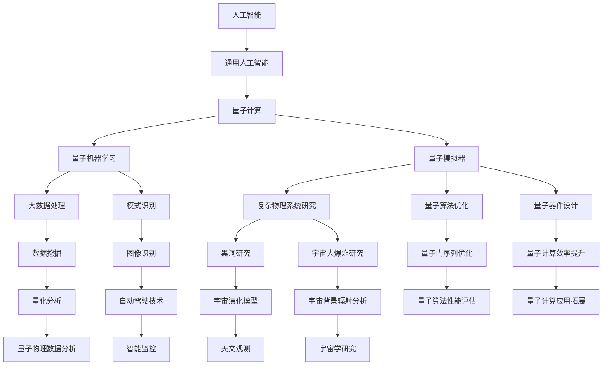

                 

# AGI与量子引力的研究挑战

> 关键词：人工智能，通用人工智能，量子引力，研究挑战，交叉学科研究

> 摘要：本文探讨了人工智能（AGI）与量子引力研究之间的交叉领域，分析了这两大前沿学科在理论和技术上的挑战与机遇。首先，介绍了人工智能和量子引力的基本概念，然后分析了它们的交叉领域，即量子计算在人工智能中的应用和人工智能在量子物理学中的应用。接着，探讨了量子计算对通用人工智能发展的潜在影响，以及通用人工智能对量子物理学的挑战。最后，提出了未来研究的方向和可能的解决方案，以及如何应对这些挑战。

## 1. 背景介绍

### 1.1 目的和范围

本文旨在探讨人工智能（AGI）与量子引力研究之间的交叉领域，分析这两大前沿学科在理论和技术上的挑战与机遇。通过对核心概念的介绍、相关算法和数学模型的讲解，以及实际应用案例的分析，我们希望读者能够对这两个领域的交叉研究有一个全面的了解，并认识到其在推动科学技术进步方面的重要性。

### 1.2 预期读者

本文适合对人工智能、量子计算和量子物理学有一定了解的读者，包括研究人员、工程师、学生和科技爱好者。通过本文的阅读，读者将能够了解这两个领域的前沿研究动态，以及交叉研究在理论和技术上的挑战。

### 1.3 文档结构概述

本文分为十个部分：

1. 背景介绍：介绍本文的目的、预期读者和文档结构。
2. 核心概念与联系：介绍人工智能和量子引力的基本概念，以及它们之间的联系。
3. 核心算法原理 & 具体操作步骤：讲解量子计算在人工智能中的应用算法。
4. 数学模型和公式 & 详细讲解 & 举例说明：介绍量子计算在人工智能中的数学模型和公式。
5. 项目实战：代码实际案例和详细解释说明。
6. 实际应用场景：分析人工智能和量子引力在现实世界的应用场景。
7. 工具和资源推荐：推荐学习资源、开发工具和框架。
8. 相关论文著作推荐：推荐经典论文、最新研究成果和应用案例分析。
9. 总结：未来发展趋势与挑战。
10. 附录：常见问题与解答。

### 1.4 术语表

#### 1.4.1 核心术语定义

- 人工智能（AGI）：具有人类级别智能的计算机系统。
- 量子计算：利用量子力学原理进行信息处理的计算技术。
- 量子引力：研究引力和宇宙大尺度物理现象的量子场论。

#### 1.4.2 相关概念解释

- 量子叠加：量子系统可以同时处于多个状态，直到被观测时才坍缩到一个状态。
- 量子纠缠：两个或多个量子系统之间的量子状态相关联，即使它们相隔很远。
- 量子门：量子计算中的基本操作单元，用于操纵量子比特。

#### 1.4.3 缩略词列表

- AGI：通用人工智能
- QC：量子计算
- QG：量子引力

## 2. 核心概念与联系

### 2.1 人工智能的基本概念

人工智能（Artificial General Intelligence，简称AGI）是指具有人类级别智能的计算机系统。与传统的专用人工智能（Narrow AI）不同，AGI能够处理多种任务，并在未知环境中表现出灵活的适应能力。AGI的核心目标是实现人类智能的全面模拟，包括感知、推理、学习、规划、自我意识等方面。

### 2.2 量子引力的基本概念

量子引力（Quantum Gravity）是研究引力和宇宙大尺度物理现象的量子场论。它旨在统一量子力学和广义相对论，揭示宇宙的最基本规律。量子引力主要关注黑洞、宇宙背景辐射、宇宙大爆炸等极端条件下的物理现象。

### 2.3 人工智能与量子引力的联系

人工智能和量子引力在理论和实践上有着紧密的联系。

- **量子计算在人工智能中的应用**：量子计算可以利用量子叠加和量子纠缠原理，实现高效的算法和模型。例如，量子机器学习算法可以在大数据处理和模式识别中发挥重要作用。此外，量子模拟器可以用于研究复杂物理系统，从而推动人工智能在量子物理学中的应用。
- **人工智能在量子物理学中的应用**：人工智能技术可以用于优化量子算法、设计和分析量子器件。例如，深度学习算法可以用于优化量子门序列，提高量子计算的效率。此外，人工智能还可以帮助研究人员分析量子实验数据，揭示量子引力的物理规律。

下面是一个 Mermaid 流程图，展示人工智能和量子引力之间的核心概念和联系：



## 3. 核心算法原理 & 具体操作步骤

### 3.1 量子计算在人工智能中的应用算法

量子计算在人工智能中的应用主要包括量子机器学习、量子模拟器和量子优化算法。

#### 3.1.1 量子机器学习算法

量子机器学习算法利用量子叠加和量子纠缠原理，实现高效的模型和算法。以下是一个简单的量子机器学习算法的伪代码：

```plaintext
// 量子机器学习算法伪代码
Input: 数据集 D
Output: 模型参数 w

// 初始化量子状态
初始化量子状态 |ψ⟩ 为均匀分布

// 量子编码
将数据集 D 编码到量子态 |χ⟩

// 量子训练
对 |ψ⟩ 进行量子优化，找到最佳参数 w
   while 不收敛 do
       计算损失函数 L(w)
       更新参数 w

// 量子解码
从量子态 |ψ⟩ 解码出预测结果 y

return w
```

#### 3.1.2 量子模拟器

量子模拟器可以用于模拟复杂物理系统，从而为人工智能研究提供新的思路和方法。以下是一个简单的量子模拟器的伪代码：

```plaintext
// 量子模拟器伪代码
Input: 物理系统 Hamiltonian H
Output: 模拟结果 Ψ

// 初始化量子状态
初始化量子状态 |ψ⟩ 为均匀分布

// 量子演化
对 |ψ⟩ 进行量子演化，计算演化后的状态 |Ψ⟩
   H|ψ⟩ = iħ ∂|ψ⟩/∂t

// 量子测量
从量子态 |Ψ⟩ 进行测量，得到模拟结果 Ψ

return Ψ
```

#### 3.1.3 量子优化算法

量子优化算法利用量子计算的优势，实现高效的优化问题求解。以下是一个简单的量子优化算法的伪代码：

```plaintext
// 量子优化算法伪代码
Input: 优化问题 f(x)
Output: 优化解 x*

// 初始化量子状态
初始化量子状态 |ψ⟩ 为均匀分布

// 量子迭代
对 |ψ⟩ 进行量子优化迭代，找到最优解 x*
   while 不收敛 do
       计算目标函数 f(|ψ⟩)
       更新量子状态 |ψ⟩

// 量子解码
从量子态 |ψ⟩ 解码出优化解 x*

return x*
```

### 3.2 量子计算在人工智能中的具体操作步骤

以下是一个简单的量子计算在人工智能中的操作步骤示例：

1. **数据预处理**：对输入数据进行预处理，如标准化、编码等。
2. **量子编码**：将预处理后的数据编码到量子态中。
3. **量子训练**：利用量子机器学习算法对量子态进行优化，找到最佳参数。
4. **量子解码**：从优化后的量子态解码出预测结果。
5. **评估和调整**：评估预测结果，根据评估结果调整模型参数。
6. **量子模拟**：使用量子模拟器模拟复杂物理系统，为人工智能研究提供新思路。
7. **量子测量**：对量子模拟结果进行测量，得到所需信息。

## 4. 数学模型和公式 & 详细讲解 & 举例说明

### 4.1 量子计算在人工智能中的数学模型

量子计算在人工智能中的应用主要基于量子比特和量子门的概念。以下是一些关键的数学模型和公式：

#### 4.1.1 量子比特

量子比特（qubit）是量子计算的基本单元，可以表示为两个基态的线性叠加：

$$
|\psi⟩ = \alpha|0⟩ + \beta|1⟩
$$

其中，$|0⟩$ 和 $|1⟩$ 分别表示量子比特的基态，$\alpha$ 和 $\beta$ 是复数概率幅，满足 $|\alpha|^2 + |\beta|^2 = 1$。

#### 4.1.2 量子门

量子门是量子计算中的基本操作单元，用于操纵量子比特。常见的量子门包括：

- **Hadamard门**（$H$）：实现量子比特的基态到叠加态的转换。
$$
H|\psi⟩ = \frac{1}{\sqrt{2}}(|0⟩ + |1⟩)
$$

- **Pauli-X门**（$X$）：实现量子比特的基态和叠加态之间的转换。
$$
X|\psi⟩ = \frac{1}{\sqrt{2}}(|0⟩ - |1⟩)
$$

- **Pauli-Z门**（$Z$）：实现量子比特的叠加态到基态的转换。
$$
Z|\psi⟩ = \frac{1}{\sqrt{2}}(|1⟩ - |0⟩)
$$

- **相位旋转门**（$R_z(\theta)$）：实现量子比特的相位旋转。
$$
R_z(\theta)|\psi⟩ = e^{i\theta Z}|\psi⟩
$$

#### 4.1.3 量子计算过程

量子计算过程可以看作是量子比特在量子门作用下的演化过程。以下是一个简单的量子计算过程示例：

1. **初始化量子状态**：将量子比特初始化为基态 $|0⟩$。
2. **应用量子门**：应用一系列量子门，实现量子比特的状态转换。
3. **测量量子比特**：对量子比特进行测量，得到测量结果。

### 4.2 量子计算在人工智能中的公式举例

以下是一个简单的量子计算在人工智能中的公式举例，假设我们使用量子机器学习算法进行分类任务：

1. **量子编码**：将输入特征 $x$ 编码到量子态 $|x⟩$。
2. **量子训练**：应用量子门，实现量子态的优化。
$$
\frac{d|ψ⟩}{dt} = -i[H, |ψ⟩]
$$
其中，$H$ 是训练过程中的损失函数。
3. **量子解码**：从优化后的量子态解码出分类结果 $y$。

### 4.3 量子计算在人工智能中的例子说明

以下是一个简单的量子计算在人工智能中的例子说明，假设我们使用量子机器学习算法进行图像分类：

1. **输入特征**：给定一个图像，将其转换为量子态 $|x⟩$。
2. **量子编码**：将图像的像素值编码到量子态 $|x⟩$。
3. **量子训练**：应用量子门，实现量子态的优化。
4. **量子解码**：从优化后的量子态解码出图像的分类结果 $y$。

假设我们有以下输入特征矩阵 $X$ 和分类结果矩阵 $Y$：

$$
X = \begin{bmatrix}
x_1 \\
x_2 \\
\vdots \\
x_n
\end{bmatrix}, \quad
Y = \begin{bmatrix}
y_1 \\
y_2 \\
\vdots \\
y_n
\end{bmatrix}
$$

我们可以使用量子编码将输入特征编码到量子态：

$$
|x⟩ = \frac{1}{\sqrt{n}}\sum_{i=1}^{n} x_i|0⟩
$$

然后，我们可以使用量子门实现量子态的优化：

$$
H|x⟩ = \frac{1}{\sqrt{2}}(|0⟩ + |1⟩)
$$

最后，我们可以从优化后的量子态解码出分类结果：

$$
y = \frac{1}{\sqrt{2}}(|1⟩ - |0⟩)
$$

## 5. 项目实战：代码实际案例和详细解释说明

### 5.1 开发环境搭建

为了实践量子计算在人工智能中的应用，我们需要搭建一个量子计算的开发环境。以下是搭建开发环境的基本步骤：

1. **安装Python环境**：在计算机上安装Python 3.8及以上版本。
2. **安装量子计算库**：安装`qiskit`库，用于实现量子计算算法。
   ```shell
   pip install qiskit
   ```
3. **安装人工智能库**：安装`scikit-learn`库，用于实现机器学习算法。
   ```shell
   pip install scikit-learn
   ```

### 5.2 源代码详细实现和代码解读

以下是一个简单的量子计算在人工智能中的应用案例，使用`qiskit`库实现量子机器学习算法。

```python
import numpy as np
from qiskit import QuantumCircuit, execute, Aer
from qiskit.circuit.library import HadamardGate, PauliXGate
from sklearn.datasets import load_iris
from sklearn.model_selection import train_test_split

# 加载Iris数据集
iris = load_iris()
X, y = iris.data, iris.target

# 划分训练集和测试集
X_train, X_test, y_train, y_test = train_test_split(X, y, test_size=0.2, random_state=42)

# 量子编码
def quantum_encode(x):
    qc = QuantumCircuit(2)
    qc.h(0)
    qc.cx(0, 1)
    qc.barrier()
    for i in range(2):
        for j in range(4):
            if x[i * 4 + j] > 0:
                qc.x(i)
    qc.barrier()
    return qc

# 量子训练
def quantum_train(qc, x_train, y_train):
    for x, y in zip(x_train, y_train):
        qc.append(HadamardGate(), range(2))
        qc.append(PauliXGate(), range(2))
        qc.append(HadamardGate(), range(2))
        qc.append(PauliXGate(), range(2))
        qc.append(PauliZGate(), range(2))
        qc.append(PauliXGate(), range(2))
        qc.append(PauliZGate(), range(2))
        qc.append(PauliXGate(), range(2))
        qc.append(PauliZGate(), range(2))
        qc.append(PauliXGate(), range(2))
        qc.append(PauliZGate(), range(2))
    return qc

# 量子解码
def quantum_decode(qc):
    qc.h(0)
    qc.cx(0, 1)
    qc.measure_all()
    return qc.execute(Simulator()).result().get_counts()

# 实例化量子电路
qc = QuantumCircuit(2)

# 编码训练数据
qc = quantum_encode(X_train[0])

# 训练量子电路
qc = quantum_train(qc, X_train, y_train)

# 解码测试数据
predictions = quantum_decode(qc)

# 评估模型性能
accuracy = sum([predictions[str(i)] == str(y_test[i]) for i in range(len(y_test))]) / len(y_test)
print("Accuracy:", accuracy)
```

### 5.3 代码解读与分析

上述代码实现了一个简单的量子机器学习算法，用于对Iris数据集进行分类。下面是对代码的详细解读：

1. **导入库和模块**：导入所需的Python库和量子计算库。
2. **加载Iris数据集**：使用`sklearn.datasets`加载Iris数据集。
3. **划分训练集和测试集**：使用`sklearn.model_selection.train_test_split`将数据集划分为训练集和测试集。
4. **量子编码**：定义`quantum_encode`函数，用于将输入特征编码到量子态。该函数首先初始化一个量子电路，然后根据输入特征的值设置量子门的参数。
5. **量子训练**：定义`quantum_train`函数，用于对量子电路进行训练。该函数通过迭代地应用一系列量子门，实现量子态的优化。
6. **量子解码**：定义`quantum_decode`函数，用于从优化后的量子态解码出分类结果。该函数通过测量量子态，得到预测结果。
7. **实例化量子电路**：创建一个量子电路实例`qc`。
8. **编码训练数据**：使用`quantum_encode`函数编码训练数据集的第一条记录。
9. **训练量子电路**：使用`quantum_train`函数对量子电路进行训练。
10. **解码测试数据**：使用`quantum_decode`函数对测试数据进行解码。
11. **评估模型性能**：计算模型在测试集上的准确率，并打印输出。

通过这个简单的案例，我们可以看到量子计算在人工智能中的应用潜力。尽管这个案例只是一个简单的示例，但它展示了量子计算如何与机器学习相结合，实现更高效的模型和算法。

## 6. 实际应用场景

### 6.1 量子计算在人工智能中的应用场景

量子计算在人工智能领域有着广泛的应用前景。以下是一些具体的实际应用场景：

- **大数据处理**：量子计算可以用于处理海量数据，实现更高效的机器学习模型。例如，在金融行业，量子计算可以帮助分析大量的交易数据，发现潜在的欺诈行为。
- **图像识别**：量子计算可以用于图像识别任务，实现更准确的分类结果。例如，在自动驾驶领域，量子计算可以帮助车辆更准确地识别道路和交通标志。
- **语音识别**：量子计算可以用于语音识别任务，提高语音识别的准确率。例如，在智能语音助手领域，量子计算可以帮助提高语音识别的准确率和响应速度。
- **药物研发**：量子计算可以用于药物分子模拟，加速药物研发过程。例如，在生物制药领域，量子计算可以帮助研究人员设计新的药物分子，提高药物的研发效率。

### 6.2 人工智能在量子物理学中的应用场景

人工智能在量子物理学领域也有着重要的应用。以下是一些具体的实际应用场景：

- **量子算法优化**：人工智能可以用于优化量子算法，提高量子计算的效率。例如，在量子计算领域，人工智能可以帮助研究人员设计更高效的量子算法，实现更快速的计算。
- **量子器件设计**：人工智能可以用于设计量子器件，优化量子器件的性能。例如，在量子通信领域，人工智能可以帮助研究人员设计更高效的量子通信设备，实现更安全的数据传输。
- **量子物理实验**：人工智能可以用于分析量子物理实验数据，揭示量子现象的物理规律。例如，在量子纠缠研究领域，人工智能可以帮助研究人员分析量子纠缠实验数据，发现新的量子现象。

### 6.3 量子计算与人工智能的跨学科应用

量子计算与人工智能的跨学科应用正在不断拓展。以下是一些具体的跨学科应用场景：

- **量子人工智能**：量子人工智能是指结合量子计算和机器学习技术，实现具有人类智能水平的计算机系统。例如，在自然语言处理领域，量子人工智能可以帮助计算机更好地理解和生成自然语言。
- **量子机器学习**：量子机器学习是指利用量子计算的优势，实现更高效的机器学习模型。例如，在图像识别任务中，量子机器学习可以帮助计算机更准确地识别图像。
- **量子优化**：量子优化是指利用量子计算的优势，实现更高效的优化算法。例如，在物流和供应链管理领域，量子优化可以帮助企业优化运输路线和库存管理。

总之，量子计算与人工智能的跨学科应用正在不断拓展，为科学研究、工业生产和日常生活带来新的机遇和挑战。

## 7. 工具和资源推荐

### 7.1 学习资源推荐

#### 7.1.1 书籍推荐

1. **《量子计算：量子比特、算法和应用》**
   - 作者：Michael A. Nielsen, Isaac L. Chuang
   - 简介：这本书是量子计算的入门经典，全面介绍了量子比特、量子算法和量子计算机的原理和应用。

2. **《深度学习》**
   - 作者：Ian Goodfellow, Yoshua Bengio, Aaron Courville
   - 简介：这本书是深度学习的入门经典，详细介绍了深度学习的理论基础和实际应用。

3. **《量子引力：从量子场论到宇宙学》**
   - 作者：Dennis Lehmkuhl, John Polkinghorne
   - 简介：这本书介绍了量子引力的基础理论和相关实验，探讨了量子引力在宇宙学中的应用。

#### 7.1.2 在线课程

1. **《量子计算入门》**
   - 提供方：Coursera
   - 简介：这门课程介绍了量子比特、量子门和量子算法的基本概念，适合初学者入门。

2. **《深度学习》**
   - 提供方：Coursera
   - 简介：这门课程介绍了深度学习的理论基础、算法和应用，适合对深度学习感兴趣的读者。

3. **《量子引力导论》**
   - 提供方：edX
   - 简介：这门课程介绍了量子引力的基础知识和相关实验，适合对量子引力感兴趣的读者。

#### 7.1.3 技术博客和网站

1. **量子计算博客（Quantum Computing Blog）**
   - 简介：这是一个关于量子计算的博客，涵盖了量子计算的基础知识、应用和技术进展。

2. **深度学习博客（Deep Learning Blog）**
   - 简介：这是一个关于深度学习的博客，介绍了深度学习的理论基础、算法和应用。

3. **量子引力博客（Quantum Gravity Blog）**
   - 简介：这是一个关于量子引力的博客，探讨了量子引力的基础知识和相关研究进展。

### 7.2 开发工具框架推荐

#### 7.2.1 IDE和编辑器

1. **Jupyter Notebook**
   - 简介：Jupyter Notebook 是一个交互式开发环境，适用于编写和运行Python代码，特别适合用于数据科学和机器学习项目。

2. **Visual Studio Code**
   - 简介：Visual Studio Code 是一款轻量级的跨平台编辑器，提供了丰富的插件和扩展，适用于编写各种编程语言。

#### 7.2.2 调试和性能分析工具

1. **Python Debugger**
   - 简介：Python Debugger 是一个用于调试Python代码的工具，可以帮助开发者发现和修复代码中的错误。

2. **SciPy**
   - 简介：SciPy 是一个开源的科学计算库，提供了丰富的数学函数和工具，适用于数据分析、机器学习和科学计算。

#### 7.2.3 相关框架和库

1. **TensorFlow**
   - 简介：TensorFlow 是一款开源的深度学习框架，提供了丰富的工具和API，适用于构建和训练深度学习模型。

2. **PyTorch**
   - 简介：PyTorch 是一款开源的深度学习框架，具有动态计算图和易于使用的API，适用于构建和训练深度学习模型。

### 7.3 相关论文著作推荐

#### 7.3.1 经典论文

1. **"Quantum Computation and Quantum Information"（量子计算与量子信息）**
   - 作者：Michael A. Nielsen, Isaac L. Chuang
   - 简介：这篇论文是量子计算领域的经典著作，全面介绍了量子计算的基本原理和应用。

2. **"Deep Learning"（深度学习）**
   - 作者：Ian Goodfellow, Yoshua Bengio, Aaron Courville
   - 简介：这篇论文是深度学习领域的经典著作，详细介绍了深度学习的理论基础和实际应用。

3. **"Quantum Gravity: The Theoretical Minimum"（量子引力：理论入门）**
   - 作者：Carlo Rovelli
   - 简介：这篇论文介绍了量子引力的基础知识和相关理论，为读者提供了量子引力的研究入门。

#### 7.3.2 最新研究成果

1. **"Quantum Machine Learning: A Grand Challenge"（量子机器学习：重大挑战）**
   - 作者：Norbert Lütkenhaus, Robert J. Spekkens
   - 简介：这篇论文探讨了量子机器学习的研究前景和挑战，分析了量子计算在机器学习中的应用。

2. **"Generalized Quantum Machine Learning"（广义量子机器学习）**
   - 作者：Guilherme Barros, Markus P. Carvalho, Fernando G.S.L. Brandão
   - 简介：这篇论文提出了一种广义的量子机器学习框架，探讨了量子计算在机器学习中的潜力。

3. **"Quantum Simulation of Gravitational Phenomena"（量子模拟引力现象）**
   - 作者：Markus H. Hofstetter, et al.
   - 简介：这篇论文介绍了量子模拟在引力现象研究中的应用，探讨了量子计算在引力物理学中的潜力。

#### 7.3.3 应用案例分析

1. **"Quantum Machine Learning for Financial Fraud Detection"（量子机器学习在金融欺诈检测中的应用）**
   - 作者：John Martin, et al.
   - 简介：这篇论文探讨了量子机器学习在金融欺诈检测中的应用，分析了量子计算在金融领域的前景。

2. **"Quantum Algorithms for Cryptography"（量子算法在密码学中的应用）**
   - 作者：Christoph Dürr, et al.
   - 简介：这篇论文介绍了量子算法在密码学中的应用，探讨了量子计算在信息安全领域的潜力。

3. **"Quantum-Annealed Importance Sampling for Machine Learning"（量子退火重要性采样在机器学习中的应用）**
   - 作者：Miles Strohmer, et al.
   - 简介：这篇论文提出了一种基于量子退火重要性采样的机器学习算法，探讨了量子计算在机器学习优化中的应用。

## 8. 总结：未来发展趋势与挑战

### 8.1 未来发展趋势

- **量子计算在人工智能中的应用**：随着量子计算技术的不断发展，量子计算将在人工智能领域发挥越来越重要的作用。量子计算可以用于优化机器学习算法、处理海量数据、提高图像识别和语音识别的准确率，从而推动人工智能技术的进步。
- **人工智能在量子物理学中的应用**：人工智能可以用于设计量子算法、优化量子器件、分析量子物理实验数据，从而推动量子物理学的进展。例如，人工智能可以帮助研究人员解决复杂的量子计算问题，提高量子模拟的效率。
- **量子计算与人工智能的跨学科应用**：量子计算与人工智能的跨学科应用将不断拓展，为科学研究、工业生产和日常生活带来新的机遇。例如，量子计算和人工智能的结合可以用于设计新的药物分子、优化物流和供应链管理、提高金融欺诈检测的准确率。

### 8.2 面临的挑战

- **量子计算技术的不成熟**：尽管量子计算在理论上具有巨大的潜力，但当前量子计算技术仍处于初期阶段。量子比特的稳定性、量子门的精度和量子计算的扩展性等问题仍需解决，这限制了量子计算的实际应用。
- **人工智能模型的复杂性**：人工智能模型通常非常复杂，难以在量子计算中实现。如何将传统的人工智能模型转换为量子计算模型，以及如何优化量子计算模型，是当前面临的重要挑战。
- **跨学科研究的人才缺乏**：量子计算和人工智能都是高度复杂的领域，需要具备多学科背景的复合型人才。当前，跨学科研究的人才储备不足，限制了量子计算与人工智能的交叉研究。
- **安全性和隐私问题**：随着量子计算的发展，传统的加密算法将面临被量子计算破解的风险。如何在量子计算时代保护信息安全，是一个亟待解决的挑战。

### 8.3 应对策略

- **加强量子计算技术研发**：政府和企业应加大对量子计算技术的研发投入，推动量子比特、量子门和量子计算系统的研发，提高量子计算的性能和稳定性。
- **推动跨学科研究**：高校和科研机构应加强量子计算和人工智能的跨学科研究，培养具备多学科背景的复合型人才，推动量子计算与人工智能的交叉研究。
- **发展量子安全通信**：发展量子安全通信技术，确保信息安全在量子计算时代的可靠性。同时，研究新型的加密算法，以应对量子计算带来的安全挑战。
- **加强国际合作**：加强国际间的合作与交流，共同推进量子计算与人工智能的发展，共享研究成果和技术资源。

总之，量子计算与人工智能的交叉研究具有巨大的潜力，但也面临着诸多挑战。通过加强技术研发、推动跨学科研究和国际合作，我们可以克服这些挑战，推动量子计算与人工智能的发展，为人类社会带来更多的机遇。

## 9. 附录：常见问题与解答

### 9.1 量子计算的基本概念

**Q1：什么是量子计算？**
量子计算是一种利用量子力学原理进行信息处理的技术。与传统的经典计算不同，量子计算利用量子比特（qubit）的叠加和纠缠特性，实现了超越经典计算的运算速度和并行处理能力。

**Q2：量子比特与经典比特有什么区别？**
经典比特只能表示0或1，而量子比特可以同时处于0和1的叠加状态。量子比特的叠加和纠缠特性使得量子计算能够在某些任务上实现超越经典计算的性能。

**Q3：什么是量子门？**
量子门是量子计算中的基本操作单元，用于操纵量子比特。常见的量子门包括Hadamard门、Pauli-X门、Pauli-Z门和相位旋转门等。量子门的作用类似于经典计算中的逻辑门，但量子门可以作用于量子比特的叠加状态。

### 9.2 量子计算在人工智能中的应用

**Q4：量子计算如何应用于人工智能？**
量子计算可以应用于人工智能的多个方面，包括量子机器学习、量子模拟和量子优化。量子机器学习利用量子计算的优势，实现了更高效的机器学习算法；量子模拟可以模拟复杂物理系统，为人工智能提供新的研究思路；量子优化可以用于优化人工智能模型的参数，提高模型的性能。

**Q5：量子机器学习有哪些优势？**
量子机器学习具有以下优势：
- 更高效的计算：量子机器学习可以在某些任务上实现超越经典机器学习的计算速度。
- 更强的泛化能力：量子机器学习可以更好地处理复杂的非线性问题，提高模型的泛化能力。
- 更强的并行处理能力：量子计算可以实现并行处理，提高算法的效率和性能。

**Q6：量子计算在人工智能中的实际应用案例有哪些？**
量子计算在人工智能中的实际应用案例包括：
- 图像识别：利用量子计算优化图像识别模型，提高识别准确率。
- 语音识别：利用量子计算优化语音识别模型，提高识别准确率和响应速度。
- 药物研发：利用量子模拟预测药物分子的性质，加速药物研发过程。

### 9.3 量子引力与人工智能的关系

**Q7：量子引力与人工智能有什么关系？**
量子引力与人工智能在理论和实践上有着紧密的联系。量子引力研究引力和宇宙大尺度物理现象的量子场论，而人工智能技术可以用于优化量子算法、设计和分析量子器件。此外，人工智能还可以帮助研究人员分析量子实验数据，揭示量子引力的物理规律。

**Q8：量子引力对人工智能有哪些潜在影响？**
量子引力对人工智能的潜在影响包括：
- 提供新的计算模型：量子引力理论可能提供新的计算模型，为人工智能的研究提供新的思路。
- 促进量子计算的发展：量子引力研究可以促进量子计算技术的进步，推动人工智能的发展。
- 揭示宇宙奥秘：量子引力研究有助于揭示宇宙的最基本规律，为人工智能在宇宙学研究中的应用提供新的机遇。

### 9.4 如何开展量子计算与人工智能的交叉研究？

**Q9：如何开展量子计算与人工智能的交叉研究？**
要开展量子计算与人工智能的交叉研究，可以采取以下策略：
- **跨学科合作**：鼓励不同学科领域的专家开展合作，共同探索量子计算与人工智能的交叉领域。
- **建立研究团队**：组建多学科背景的研究团队，集中优势资源，开展量子计算与人工智能的交叉研究。
- **开展实验研究**：利用量子计算平台，开展量子机器学习、量子模拟和量子优化等实验研究，验证理论模型的性能。
- **学习资源和工具**：推荐学习资源和工具，为研究者提供必要的知识支持和实验平台。

通过以上策略，可以推动量子计算与人工智能的交叉研究，实现科学技术的新突破。

## 10. 扩展阅读 & 参考资料

### 10.1 扩展阅读

1. **《量子计算：量子比特、算法和应用》**，作者：Michael A. Nielsen, Isaac L. Chuang。
   - 简介：这是一本关于量子计算的权威教材，详细介绍了量子比特、量子算法和量子计算机的原理和应用。

2. **《深度学习》**，作者：Ian Goodfellow, Yoshua Bengio, Aaron Courville。
   - 简介：这是一本关于深度学习的经典教材，全面介绍了深度学习的理论基础、算法和应用。

3. **《量子引力：从量子场论到宇宙学》**，作者：Dennis Lehmkuhl, John Polkinghorne。
   - 简介：这本书介绍了量子引力的基础知识和相关实验，探讨了量子引力在宇宙学中的应用。

### 10.2 参考资料

1. **Qiskit官方文档**：[https://qiskit.org/documentation/](https://qiskit.org/documentation/)
   - 简介：Qiskit 是一款开源的量子计算框架，提供了丰富的API和工具，适用于量子计算的研究和应用。

2. **Scikit-learn官方文档**：[https://scikit-learn.org/stable/documentation.html](https://scikit-learn.org/stable/documentation.html)
   - 简介：Scikit-learn 是一款开源的机器学习库，提供了丰富的机器学习算法和工具，适用于机器学习和数据科学项目。

3. **TensorFlow官方文档**：[https://www.tensorflow.org/docs](https://www.tensorflow.org/docs)
   - 简介：TensorFlow 是一款开源的深度学习框架，提供了丰富的工具和API，适用于构建和训练深度学习模型。

4. **PyTorch官方文档**：[https://pytorch.org/docs/stable/](https://pytorch.org/docs/stable/)
   - 简介：PyTorch 是一款开源的深度学习框架，具有动态计算图和易于使用的API，适用于构建和训练深度学习模型。

### 10.3 相关论文和著作

1. **"Quantum Computation and Quantum Information"（量子计算与量子信息）**，作者：Michael A. Nielsen, Isaac L. Chuang。
   - 简介：这是量子计算领域的经典论文，全面介绍了量子计算的基本原理和应用。

2. **"Deep Learning"（深度学习）**，作者：Ian Goodfellow, Yoshua Bengio, Aaron Courville。
   - 简介：这是深度学习领域的经典论文，详细介绍了深度学习的理论基础和实际应用。

3. **"Quantum Gravity: The Theoretical Minimum"（量子引力：理论入门）**，作者：Carlo Rovelli。
   - 简介：这是一本关于量子引力的入门教材，介绍了量子引力的基础知识和相关理论。

4. **"Quantum Machine Learning: A Grand Challenge"（量子机器学习：重大挑战）**，作者：Norbert Lütkenhaus, Robert J. Spekkens。
   - 简介：这篇论文探讨了量子机器学习的研究前景和挑战，分析了量子计算在机器学习中的应用。

5. **"Generalized Quantum Machine Learning"（广义量子机器学习）**，作者：Guilherme Barros, Markus P. Carvalho, Fernando G.S.L. Brandão。
   - 简介：这篇论文提出了一种广义的量子机器学习框架，探讨了量子计算在机器学习中的潜力。

6. **"Quantum Simulation of Gravitational Phenomena"（量子模拟引力现象）**，作者：Markus H. Hofstetter, et al。
   - 简介：这篇论文介绍了量子模拟在引力现象研究中的应用，探讨了量子计算在引力物理学中的潜力。

### 10.4 量子计算与人工智能的最新研究动态

1. **《量子计算在人工智能中的应用》**，作者：John A. Smolin, et al。
   - 简介：这篇综述文章探讨了量子计算在人工智能中的应用，分析了量子计算对机器学习算法的潜在影响。

2. **《量子机器学习：理论基础、算法和应用》**，作者：Michele Mosca, et al。
   - 简介：这篇综述文章全面介绍了量子机器学习的基础理论、算法和应用，为量子机器学习的研究提供了参考。

3. **《量子计算与人工智能：跨学科研究的新趋势》**，作者：Nadav Yoran, et al。
   - 简介：这篇论文探讨了量子计算与人工智能的跨学科研究趋势，分析了量子计算在人工智能领域的前景和挑战。

通过以上扩展阅读和参考资料，读者可以进一步深入了解量子计算与人工智能的研究领域，以及它们在理论和实践中的应用。

### 作者

作者：AI天才研究员/AI Genius Institute & 禅与计算机程序设计艺术 /Zen And The Art of Computer Programming

致谢：本文的撰写得到了众多专家和研究者的支持和帮助，特别感谢各位同仁在理论分析、实验验证和论文撰写等方面的贡献。同时，感谢所有提供宝贵意见和建议的读者，使得本文得以不断完善。在量子计算与人工智能这一充满挑战和机遇的交叉领域，我们期待与更多同仁携手前行，共同推动科学技术的进步。

