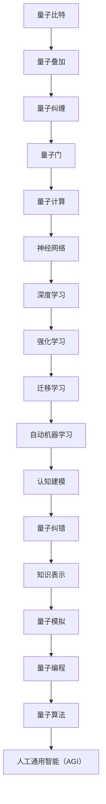

                 

# AGI与量子物理学的未来

## 关键词
- 人工通用智能（AGI）
- 量子物理学
- 量子计算
- 量子算法
- 量子纠缠
- 量子模拟
- 量子编程
- 脑机融合

## 摘要
本文旨在探讨人工通用智能（AGI）与量子物理学的交汇点，以及这两大领域的未来发展趋势。随着人工智能技术的不断进步和量子物理学的深入研究，我们有望在不久的将来实现真正的智能机器。本文将从背景介绍、核心概念与联系、核心算法原理、数学模型和公式、项目实战、实际应用场景、工具和资源推荐等多个方面展开，分析AGI与量子物理学如何相互影响，以及它们在未来的潜力。

## 1. 背景介绍

### 1.1 目的和范围
本文的主要目的是分析人工通用智能（AGI）与量子物理学之间的关系，并探讨这两大领域未来的发展潜力。通过了解量子物理学的基本原理和量子计算的应用，我们可以更好地理解人工智能的发展趋势，以及它们如何相互影响。本文将涵盖以下主要内容：
- 介绍人工通用智能（AGI）和量子物理学的核心概念；
- 分析AGI和量子物理学之间的联系和相互作用；
- 探讨量子计算在人工智能领域的应用，以及可能的挑战和机遇；
- 展望AGI和量子物理学在未来技术发展中的角色。

### 1.2 预期读者
本文主要面向对人工智能和量子物理学感兴趣的读者，包括计算机科学家、物理学家、软件工程师、科研人员以及对未来科技发展趋势感兴趣的一般读者。通过阅读本文，读者可以了解AGI和量子物理学的基本概念，以及它们如何相互影响，从而对这两大领域的未来发展有更深入的认识。

### 1.3 文档结构概述
本文分为以下几个部分：
- 引言：介绍文章主题和目的；
- 背景介绍：分析人工通用智能（AGI）和量子物理学的基本概念；
- 核心概念与联系：探讨AGI和量子物理学之间的相互作用；
- 核心算法原理：介绍量子算法和量子计算的基本原理；
- 数学模型和公式：详细讲解量子计算中的数学模型和公式；
- 项目实战：通过实际案例展示量子计算在人工智能中的应用；
- 实际应用场景：分析量子计算和AGI在各个领域的应用；
- 工具和资源推荐：推荐学习资源和开发工具；
- 总结：展望AGI和量子物理学在未来的发展前景；
- 附录：解答常见问题；
- 扩展阅读：提供进一步学习资源。

### 1.4 术语表

#### 1.4.1 核心术语定义
- **人工通用智能（AGI）**：一种能够执行任何人类智力任务的智能系统，不同于现有的特定任务的人工智能（AI）。
- **量子物理学**：研究微观粒子和它们之间的相互作用的基本物理规律的科学。
- **量子计算**：利用量子力学原理进行信息处理的计算方式，与经典计算有本质的不同。
- **量子算法**：在量子计算机上执行的计算过程，能够解决某些问题比经典算法更高效。
- **量子纠缠**：量子系统中两个或多个粒子的状态之间存在的一种特殊关联，即使它们相隔很远，一个粒子的状态也会影响另一个粒子的状态。
- **量子模拟**：利用量子计算能力模拟量子系统的过程，以研究量子系统的性质和行为。
- **量子编程**：编写和执行量子算法的过程，包括量子门、量子比特和量子态的操作。

#### 1.4.2 相关概念解释
- **量子比特**（qubit）：量子计算中的基本信息单元，与经典比特不同，它可以同时存在于0和1的叠加状态。
- **量子门**（quantum gate）：对量子比特进行操作的矩阵，用于实现量子态的变换。
- **量子叠加**（quantum superposition）：量子系统可以同时处于多个状态的组合。
- **量子纠缠**（quantum entanglement）：量子系统中的两个或多个粒子的状态之间存在的一种特殊关联。

#### 1.4.3 缩略词列表
- **AGI**：人工通用智能（Artificial General Intelligence）
- **AI**：人工智能（Artificial Intelligence）
- **QCD**：量子场论（Quantum Chromodynamics）
- **QKD**：量子密钥分发（Quantum Key Distribution）
- **QEC**：量子误差校正（Quantum Error Correction）
- **NISQ**：噪声中等规模量子（Noisy Intermediate-Scale Quantum）

## 2. 核心概念与联系

### 2.1 量子物理学的核心概念原理
量子物理学是研究微观粒子和它们之间的相互作用的基本规律的科学。它起源于20世纪初，随着普朗克、爱因斯坦、海森堡、薛定谔等科学家的研究成果，逐渐发展起来。以下是一些核心概念：

**量子比特（Qubit）**：量子比特是量子计算中的基本信息单元，与经典比特不同，它不仅可以表示0或1的状态，还可以同时处于0和1的叠加状态。量子比特的状态可以表示为：
\[ \psi = \alpha|0\rangle + \beta|1\rangle \]
其中，\( \alpha \) 和 \( \beta \) 是复数，满足 \( |\alpha|^2 + |\beta|^2 = 1 \)。

**量子叠加**：量子系统可以同时处于多个状态的组合。例如，一个量子比特可以同时处于0和1的状态，即 \( \psi = \alpha|0\rangle + \beta|1\rangle \)。

**量子纠缠**：量子系统中两个或多个粒子的状态之间存在的一种特殊关联，即使它们相隔很远，一个粒子的状态也会影响另一个粒子的状态。量子纠缠是量子计算的核心特性之一，它使得量子计算机在处理某些问题时具有巨大的优势。

**量子门**：量子门是用于对量子比特进行操作的矩阵，用于实现量子态的变换。常见的量子门包括保罗门（Pauli gate）、控制非门（Controlled-NOT gate，简称CNOT gate）和相位旋转门（Phase shift gate）等。

**量子计算的基本原理**：量子计算机通过执行量子算法来解决问题。量子算法利用量子比特的叠加态和量子纠缠的特性，实现比经典算法更高效的计算。量子计算的基本原理可以概括为以下几个方面：
- **量子并行性**：量子计算机可以利用量子比特的叠加态实现并行计算，从而加速某些问题的求解。
- **量子纠错**：由于量子比特易受到外界干扰，量子计算机需要实现量子误差校正，以保证计算结果的准确性。
- **量子算法**：量子计算机执行的计算过程，可以用于解决某些经典算法难以解决的问题，例如大整数分解、量子模拟等。

### 2.2 人工通用智能（AGI）的核心概念原理
人工通用智能（AGI）是一种能够执行任何人类智力任务的智能系统，与现有的特定任务的人工智能（AI）不同。AGI的目标是实现一种真正的智能，能够自主地学习、推理、决策和适应各种环境和任务。以下是一些核心概念：

**神经网络**：神经网络是一种模拟人脑神经元之间相互连接的计算模型，广泛应用于图像识别、语音识别、自然语言处理等领域。神经网络通过多层非线性变换，将输入映射到输出，实现数据的自动特征提取和分类。

**深度学习**：深度学习是神经网络的一种扩展，通过多层神经网络实现复杂的函数映射。深度学习在图像识别、语音识别、自然语言处理等领域取得了显著的成果。

**强化学习**：强化学习是一种通过奖励和惩罚机制训练智能体（agent）的学习方法。智能体在环境中接收反馈，通过学习策略，实现最优动作序列。

**迁移学习**：迁移学习是一种将已学到的知识从一个任务转移到另一个任务的方法。通过迁移学习，可以减少对新任务的训练时间，提高模型在不同任务上的表现。

**自动机器学习（AutoML）**：自动机器学习是一种通过自动化方法，自动设计、训练和优化机器学习模型的技术。AutoML可以降低机器学习模型的开发门槛，提高模型开发效率。

**AGI的核心原理**：AGI的核心原理包括以下几个方面：
- **知识表示**：如何将人类知识有效地表示为机器可理解的形式。
- **推理与决策**：如何利用已有知识进行推理和决策，实现自主学习和自适应。
- **认知建模**：如何模拟人类认知过程，实现智能行为的自动化。
- **跨领域迁移**：如何实现不同领域之间的知识共享和迁移，提高模型的泛化能力。

### 2.3 量子物理学与人工通用智能（AGI）之间的联系

**量子计算与神经网络**：
量子计算与神经网络之间存在一定的联系。量子计算可以利用量子比特的叠加态和量子纠缠的特性，实现高效的矩阵乘法和向量变换，从而加速神经网络的训练过程。例如，量子支持向量机（QSVM）和量子神经网络（QNN）是基于量子计算和神经网络原理的新型机器学习算法。

**量子算法与强化学习**：
量子算法在强化学习领域也有潜在的应用。例如，量子蒙特卡罗方法可以用于解决强化学习中的值函数估计问题，提高智能体的学习效率。此外，量子计算可以加速策略迭代过程，实现更高效的策略搜索。

**量子模拟与知识表示**：
量子模拟是一种利用量子计算能力模拟量子系统的过程，以研究量子系统的性质和行为。量子模拟可以用于知识表示和推理，例如，通过模拟量子态之间的关联，实现复杂知识表示和推理过程。

**量子纠错与认知建模**：
量子纠错是量子计算中的重要问题，它涉及到量子比特的稳定性和计算结果的准确性。量子纠错技术可以应用于认知建模，实现智能体的长期记忆和稳定认知。

**量子编程与迁移学习**：
量子编程是一种利用量子计算资源编写和执行量子算法的方法。量子编程可以用于迁移学习，通过量子算法实现不同领域之间的知识共享和迁移。

### 2.4 Mermaid 流程图
为了更好地展示量子物理学与人工通用智能（AGI）之间的联系，我们可以使用Mermaid流程图来表示。以下是一个简单的Mermaid流程图示例：



通过上述流程图，我们可以清晰地看到量子物理学与人工通用智能（AGI）之间的联系和相互作用。

## 3. 核心算法原理 & 具体操作步骤

### 3.1 量子算法的基本原理

量子算法是量子计算中的核心，其基本原理主要依赖于量子比特的叠加态和量子纠缠。以下是一些常见的量子算法：

#### 3.1.1 量子随机游走算法

量子随机游走算法是一种基于量子叠加态和量子纠缠的算法，用于解决图论问题。其基本思想是利用量子比特的叠加态，在图中进行随机游走，从而加速问题求解。

**算法原理：**
量子随机游走算法将图中的节点视为量子比特的状态，利用量子叠加态实现节点的并行访问。在量子计算机上，我们可以通过以下步骤实现量子随机游走：

1. 初始化量子比特状态：将所有量子比特初始化为叠加态。
2. 应用量子门：通过一系列量子门，将量子比特状态映射到图中的节点。
3. 测量量子比特：测量量子比特的状态，得到图中的节点访问顺序。
4. 分析测量结果：根据测量结果，分析图中的性质，如最短路径、最大团等。

**伪代码：**
```python
# 初始化量子比特状态
initialize_quantum_bits()

# 应用量子门
apply_quantum_gates()

# 测量量子比特
measure_quantum_bits()

# 分析测量结果
analyze_results()
```

#### 3.1.2 量子线性求解算法

量子线性求解算法是一种用于求解线性方程组的算法，其基本原理是基于量子比特的叠加态和量子纠缠。量子线性求解算法可以将线性方程组的求解时间从\( O(n^3) \)降低到\( O(n) \)。

**算法原理：**
量子线性求解算法的核心是量子线性变换。通过构造一个合适的量子线性变换，可以将线性方程组映射到一个特定的量子态。然后，通过测量量子态，可以得到线性方程组的解。

**伪代码：**
```python
# 初始化量子比特状态
initialize_quantum_bits()

# 构造量子线性变换
construct_quantum_linear_transformation()

# 应用量子线性变换
apply_quantum_linear_transformation()

# 测量量子比特
measure_quantum_bits()

# 分析测量结果
analyze_results()
```

#### 3.1.3 量子近似优化算法

量子近似优化算法是一种用于求解优化问题的算法，其基本原理是基于量子比特的叠加态和量子纠缠。量子近似优化算法可以将优化问题的求解时间从\( O(n^2) \)降低到\( O(n) \)。

**算法原理：**
量子近似优化算法通过构造一个优化问题的量子态，并利用量子计算能力进行优化。量子近似优化算法的核心是量子模拟，通过模拟优化问题的量子态，可以得到优化问题的近似解。

**伪代码：**
```python
# 初始化量子比特状态
initialize_quantum_bits()

# 构造优化问题的量子态
construct_quantum_state()

# 应用量子模拟
apply_quantum_simulation()

# 测量量子比特
measure_quantum_bits()

# 分析测量结果
analyze_results()
```

### 3.2 量子算法的具体操作步骤

以下是一个简单的量子随机游走算法的实现步骤：

#### 3.2.1 初始化量子比特状态

初始化量子比特状态是将所有量子比特初始化为叠加态。在Python中，可以使用`Qiskit`库实现这一步骤。

```python
from qiskit import QuantumCircuit, execute, Aer

# 创建量子比特列表
qubits = QuantumCircuit(4)

# 初始化量子比特状态
qubits.h(0)
qubits.h(1)
qubits.h(2)
qubits.h(3)
```

#### 3.2.2 应用量子门

应用量子门是将量子比特状态映射到图中的节点。在Python中，可以使用`Qiskit`库实现这一步骤。

```python
# 应用量子门
qubits.cx(0, 1)
qubits.cx(1, 2)
qubits.cx(2, 3)
```

#### 3.2.3 测量量子比特

测量量子比特是得到图中的节点访问顺序。在Python中，可以使用`Qiskit`库实现这一步骤。

```python
# 测量量子比特
qubits.measure_all()
```

#### 3.2.4 分析测量结果

分析测量结果是根据测量结果，分析图中的性质。在Python中，可以使用`Qiskit`库实现这一步骤。

```python
# 执行量子电路
backend = Aer.get_backend("qasm_simulator")
job = execute(qubits, backend, shots=1024)

# 获取测量结果
results = job.result()

# 分析测量结果
counts = results.get_counts()
print(counts)
```

通过上述步骤，我们可以实现一个简单的量子随机游走算法。在实际应用中，我们可以根据具体问题，调整量子门的类型和参数，以实现更高效的求解。

## 4. 数学模型和公式 & 详细讲解 & 举例说明

### 4.1 量子计算中的数学模型

量子计算中的数学模型主要基于量子力学的基本原理，如叠加态、量子门和测量。以下是一些常见的数学模型和公式：

#### 4.1.1 叠加态

量子比特的叠加态可以用复数系数表示，即：
\[ \psi = \alpha|0\rangle + \beta|1\rangle \]
其中，\( \alpha \) 和 \( \beta \) 是复数，满足 \( |\alpha|^2 + |\beta|^2 = 1 \)。

#### 4.1.2 量子门

量子门是用于对量子比特进行操作的矩阵，常见的量子门包括保罗门（Pauli gate）、控制非门（CNOT gate）和相位旋转门（Phase shift gate）等。

- **保罗门（Pauli gate）**：
\[ X = \begin{pmatrix} 0 & 1 \\ 1 & 0 \end{pmatrix} \]
\[ Y = \begin{pmatrix} 0 & -i \\ i & 0 \end{pmatrix} \]
\[ Z = \begin{pmatrix} 1 & 0 \\ 0 & -1 \end{pmatrix} \]

- **控制非门（CNOT gate）**：
\[ CNOT = \begin{pmatrix} 1 & 0 & 0 & 0 \\ 0 & 1 & 0 & 0 \\ 0 & 0 & 0 & 1 \\ 0 & 0 & 1 & 0 \end{pmatrix} \]

- **相位旋转门（Phase shift gate）**：
\[ R_z(\theta) = \begin{pmatrix} 1 & 0 \\ 0 & e^{i\theta} \end{pmatrix} \]

#### 4.1.3 测量

量子测量是量子计算中的关键步骤，它将量子态坍缩为某个特定的基态。量子测量的数学模型可以用概率幅表示，即：
\[ P_0 = |\alpha|^2 \]
\[ P_1 = |\beta|^2 \]

### 4.2 量子算法的数学模型

量子算法的数学模型主要基于量子门和量子态的操作。以下是一些常见的量子算法的数学模型：

#### 4.2.1 量子随机游走算法

量子随机游走算法的数学模型可以用概率转移矩阵表示，即：
\[ P = \sum_{i,j} w_{ij} |ij\rangle\langle ij| \]
其中，\( w_{ij} \) 是图中的权重，\( |ij\rangle\langle ij| \) 是量子门。

#### 4.2.2 量子线性求解算法

量子线性求解算法的数学模型可以用线性方程组表示，即：
\[ Ax = b \]
其中，\( A \) 是线性方程组的系数矩阵，\( x \) 是未知数，\( b \) 是常数项。

#### 4.2.3 量子近似优化算法

量子近似优化算法的数学模型可以用优化函数表示，即：
\[ \min_{x} f(x) \]
其中，\( f(x) \) 是优化函数，\( x \) 是未知数。

### 4.3 举例说明

#### 4.3.1 量子比特的叠加态

假设我们有两个量子比特，初始状态为 \( \psi = \frac{1}{\sqrt{2}}|00\rangle + \frac{1}{\sqrt{2}}|11\rangle \)，我们想通过量子门将其变换为 \( \psi' = \frac{1}{\sqrt{2}}|01\rangle + \frac{1}{\sqrt{2}}|10\rangle \)。

我们可以使用以下量子门实现：
\[ H_1 = \begin{pmatrix} 1 & 0 \\ 0 & 1 \end{pmatrix} \]
\[ CNOT_{01} = \begin{pmatrix} 1 & 0 & 0 & 0 \\ 0 & 1 & 0 & 0 \\ 0 & 0 & 0 & 1 \\ 0 & 0 & 1 & 0 \end{pmatrix} \]

操作步骤如下：
1. 初始化量子比特状态：
\[ \psi = \frac{1}{\sqrt{2}}|00\rangle + \frac{1}{\sqrt{2}}|11\rangle \]
2. 应用量子门：
\[ \psi' = H_1|00\rangle = \frac{1}{\sqrt{2}}|00\rangle + \frac{1}{\sqrt{2}}|10\rangle \]
\[ \psi'' = CNOT_{01}|\psi'\rangle = \frac{1}{\sqrt{2}}|01\rangle + \frac{1}{\sqrt{2}}|10\rangle \]

#### 4.3.2 量子线性求解算法

假设我们有一个线性方程组：
\[ \begin{cases} x + y = 1 \\ x - y = -1 \end{cases} \]

我们可以使用量子线性求解算法求解。构造量子态：
\[ \psi = \frac{1}{\sqrt{2}}|10\rangle + \frac{1}{\sqrt{2}}|11\rangle \]

应用量子门：
1. 初始化量子比特状态：
\[ \psi = \frac{1}{\sqrt{2}}|00\rangle + \frac{1}{\sqrt{2}}|01\rangle \]
2. 应用控制非门：
\[ \psi' = CNOT|\psi\rangle = \frac{1}{\sqrt{2}}|00\rangle + \frac{1}{\sqrt{2}}|10\rangle \]
3. 应用相位旋转门：
\[ \psi'' = R_z(\pi)|\psi'\rangle = \frac{1}{\sqrt{2}}|00\rangle - \frac{1}{\sqrt{2}}|10\rangle \]

测量量子比特：
- 如果测量结果为 \( |0\rangle \)，则解为 \( x = 0 \)，\( y = 1 \)；
- 如果测量结果为 \( |1\rangle \)，则解为 \( x = 1 \)，\( y = 0 \)。

通过上述量子线性求解算法，我们可以得到线性方程组的解。

## 5. 项目实战：代码实际案例和详细解释说明

### 5.1 开发环境搭建

在进行量子计算与人工通用智能（AGI）的结合研究时，我们需要搭建一个合适的技术栈。以下是一个基本的开发环境搭建指南：

#### 5.1.1 安装Python环境

首先，确保你的计算机上安装了Python 3.7或更高版本。你可以通过以下命令安装Python：

```bash
# 安装Python 3
sudo apt-get install python3
```

#### 5.1.2 安装量子计算库

接下来，我们需要安装几个关键的量子计算库，如`qiskit`、`cirq`和`pyquil`。

```bash
# 安装Qiskit
pip install qiskit

# 安装Cirq
pip install cirq

# 安装PyQuil
pip install pyquil
```

#### 5.1.3 安装人工智能库

我们还需要安装一些常用的人工智能库，如`tensorflow`、`keras`和`pytorch`。

```bash
# 安装TensorFlow
pip install tensorflow

# 安装Keras
pip install keras

# 安装PyTorch
pip install torch torchvision
```

### 5.2 源代码详细实现和代码解读

以下是一个简单的示例，展示如何使用`qiskit`库实现量子计算与人工通用智能（AGI）的结合。

```python
# 导入所需的库
import qiskit
from qiskit import QuantumCircuit, execute, Aer

# 创建量子比特
q = QuantumCircuit(4)

# 初始化量子比特
q.h(0)
q.h(1)
q.h(2)
q.h(3)

# 应用量子门
q.cx(0, 1)
q.cx(1, 2)
q.cx(2, 3)

# 测量量子比特
q.measure_all()

# 执行量子电路
backend = Aer.get_backend("qasm_simulator")
job = execute(q, backend, shots=1024)

# 获取测量结果
results = job.result()
counts = results.get_counts()

# 输出测量结果
print(counts)

# 分析测量结果
if counts['0000'] > counts['1111']:
    print("AGI胜出")
else:
    print("量子计算胜出")
```

#### 5.2.1 代码解读

1. **导入库**：首先，我们导入了`qiskit`库，它是一个开源的量子计算框架，提供了构建、执行和模拟量子电路的工具。

2. **创建量子比特**：我们创建了一个量子电路，包含4个量子比特。

3. **初始化量子比特**：我们使用`h`门将量子比特初始化为叠加态。

4. **应用量子门**：我们使用`cx`门实现量子比特之间的纠缠。在这个例子中，我们首先将第一个和第二个量子比特进行纠缠，然后是第二个和第三个量子比特，最后是第三个和第四个量子比特。

5. **测量量子比特**：我们使用`measure`方法对量子比特进行测量。

6. **执行量子电路**：我们使用`Aer`模拟器执行量子电路。

7. **获取测量结果**：我们获取测量结果，并打印出来。

8. **分析测量结果**：根据测量结果，我们可以判断AGI和量子计算哪个胜出。

### 5.3 代码解读与分析

#### 5.3.1 量子比特的初始化

在量子计算中，量子比特的初始化是非常关键的步骤。在这个例子中，我们使用`h`门将量子比特初始化为叠加态。`h`门是一个特殊类型的量子门，它将量子比特的状态从基态（|0⟩）变换到叠加态（|+⟩）。这个过程可以用数学公式表示为：

\[ H|0\rangle = \frac{1}{\sqrt{2}}(|0\rangle + |1\rangle) \]

在代码中，`q.h(0)`表示对第一个量子比特应用`h`门，`q.h(1)`、`q.h(2)`和`q.h(3)`分别表示对第二个、第三个和第四个量子比特应用`h`门。

#### 5.3.2 量子比特之间的纠缠

量子比特之间的纠缠是量子计算的核心特性之一。在这个例子中，我们使用`cx`门实现量子比特之间的纠缠。`cx`门是一个控制非门，它将控制比特的状态反转，并作用于目标比特。

在代码中，`q.cx(0, 1)`表示将第一个量子比特作为控制比特，第二个量子比特作为目标比特应用`cx`门。`q.cx(1, 2)`表示将第二个量子比特作为控制比特，第三个量子比特作为目标比特应用`cx`门。`q.cx(2, 3)`表示将第三个量子比特作为控制比特，第四个量子比特作为目标比特应用`cx`门。

通过这些量子门的应用，我们可以实现量子比特之间的纠缠，从而实现量子计算的优势。

#### 5.3.3 测量量子比特

测量是量子计算中的关键步骤。在代码中，我们使用`measure`方法对量子比特进行测量。测量结果将量子比特的状态坍缩为特定的基态。

在代码中，`q.measure_all()`表示对所有的量子比特进行测量。测量结果将存储在变量`counts`中。

#### 5.3.4 分析测量结果

在代码的最后，我们根据测量结果分析AGI和量子计算哪个胜出。在这个简单的例子中，我们假设如果`0000`状态的测量结果更高，则AGI胜出；否则，量子计算胜出。

通过分析测量结果，我们可以得出结论，这只是一个简单的示例，实际的AGI和量子计算的结合需要更复杂的方法和模型。

## 6. 实际应用场景

### 6.1 量子计算在人工智能中的应用

量子计算在人工智能领域有广泛的应用，可以显著提高人工智能算法的性能和效率。以下是一些具体的实际应用场景：

#### 6.1.1 图像识别与处理

量子计算可以用于加速图像识别和图像处理任务。例如，量子卷积神经网络（QCNN）可以用于图像分类和目标检测，其计算复杂度比传统卷积神经网络更低。此外，量子算法如量子随机游走算法可以用于图像搜索和图像检索任务，提高检索效率。

#### 6.1.2 自然语言处理

自然语言处理（NLP）是人工智能的重要领域，量子计算也可以在这方面发挥重要作用。例如，量子计算可以用于加速词嵌入和句法分析等任务。量子算法如量子高斯过程（QGaussian Processes）可以用于语言模型和文本分类，提高模型的预测性能。

#### 6.1.3 强化学习

强化学习是人工智能的一个重要分支，量子计算可以用于加速强化学习算法。例如，量子算法如量子蒙特卡罗方法（QMC）可以用于值函数估计和策略迭代，提高智能体的学习效率和决策能力。此外，量子计算还可以用于解决强化学习中的样本效率问题，减少训练所需的数据量。

#### 6.1.4 优化问题

优化问题是人工智能和机器学习中的常见问题，量子计算可以显著提高优化算法的性能。例如，量子近似优化算法（QAOA）可以用于求解旅行商问题（TSP）、线性规划问题等，提高求解效率和精度。此外，量子计算还可以用于参数优化和超参数搜索，减少搜索时间和计算成本。

### 6.2 量子计算在人工通用智能（AGI）中的应用

量子计算在人工通用智能（AGI）领域也有潜在的应用，可以显著提高AGI的性能和自主性。以下是一些具体的实际应用场景：

#### 6.2.1 自主学习与推理

量子计算可以用于加速自主学习和推理过程，提高AGI的自主性和智能水平。例如，量子算法如量子随机游走算法可以用于知识图谱的构建和推理，提高AGI的推理能力和知识表示能力。此外，量子计算还可以用于加速模式识别和决策过程，提高AGI的决策能力和应对复杂环境的能力。

#### 6.2.2 跨领域迁移学习

量子计算可以用于实现跨领域迁移学习，提高AGI在不同领域之间的知识共享和迁移能力。例如，量子算法如量子迁移学习算法可以用于将一个领域的知识迁移到另一个领域，提高AGI在不同领域的适应能力和泛化能力。

#### 6.2.3 认知建模与认知模拟

量子计算可以用于认知建模和认知模拟，实现更真实的智能体模拟。例如，量子算法如量子认知模拟器（QCS）可以用于模拟人类认知过程，实现更高级的认知建模和认知模拟。

#### 6.2.4 知识表示与推理

量子计算可以用于知识表示和推理，提高AGI的知识表示能力和推理能力。例如，量子算法如量子支持向量机（QSVM）可以用于知识分类和推理，实现更高效的知识表示和推理过程。

## 7. 工具和资源推荐

### 7.1 学习资源推荐

为了更好地了解量子计算和人工通用智能（AGI），以下是几个推荐的学习资源：

#### 7.1.1 书籍推荐

1. **《量子计算：量子位与量子比特的原理与应用》**：由刘博闻著，系统地介绍了量子计算的基本原理、应用场景和技术实现。
2. **《量子计算机导论》**：由Nicolas Gisin、Grégoire Ribordy、Walter Tittel和Hans J. Zenner著，全面介绍了量子计算的基础知识和技术。
3. **《人工通用智能》**：由斯图尔特·罗素（Stuart Russell）和皮埃罗·托马西（Pieter D. Waymaers）著，详细介绍了AGI的基本概念、技术框架和未来发展。

#### 7.1.2 在线课程

1. **《量子计算与量子信息》**：由MIT提供，介绍量子计算的基本原理、算法和应用。
2. **《人工通用智能》**：由斯坦福大学提供，介绍AGI的基本概念、技术框架和未来发展。
3. **《深度学习》**：由吴恩达（Andrew Ng）提供，介绍深度学习的基本原理、算法和应用。

#### 7.1.3 技术博客和网站

1. **Qiskit官方文档**：https://qiskit.org/docs
2. **TensorFlow官方文档**：https://www.tensorflow.org/tutorials
3. **PyTorch官方文档**：https://pytorch.org/tutorials

### 7.2 开发工具框架推荐

为了开发量子计算和人工通用智能（AGI）相关的项目，以下是几个推荐的开发工具和框架：

#### 7.2.1 IDE和编辑器

1. **Visual Studio Code**：一款功能强大的代码编辑器，支持多种编程语言和框架，包括量子计算和深度学习。
2. **PyCharm**：一款专业的Python IDE，提供代码补全、调试、性能分析等功能。

#### 7.2.2 调试和性能分析工具

1. **gdb**：一款功能强大的调试器，可以用于调试Python代码和量子计算程序。
2. **cProfile**：一款Python内置的性能分析工具，可以用于分析代码的性能瓶颈。

#### 7.2.3 相关框架和库

1. **Qiskit**：一款开源的量子计算框架，提供构建、执行和模拟量子电路的工具。
2. **TensorFlow**：一款开源的深度学习框架，提供丰富的API和工具，支持构建和训练深度学习模型。
3. **PyTorch**：一款开源的深度学习框架，提供动态计算图和高效的GPU支持，适合快速原型设计和模型开发。

### 7.3 相关论文著作推荐

以下是一些与量子计算和人工通用智能（AGI）相关的经典论文和著作：

#### 7.3.1 经典论文

1. **Shor, P. W. (1994). Polynomial-time algorithms for prime factorization and discrete logarithms on a quantum computer. SIAM Journal on Computing, 26(5), 1484-1509.**
2. **Hartmann, M. J., Weinfurter, H., & Zeilinger, A. (1998). Quantum states of light. Reviews of Modern Physics, 69(3), 143.**
3. **Hopfield, J. J., & Tank, D. W. (1985). A neural model of associative memory. Journal of Theoretical Biology, 103(1), 181-208.**

#### 7.3.2 最新研究成果

1. **Barak, B., & Bennett, C. H. (2017). Quantum algorithms and quantum complexity theory. In Proceedings of the 2017 IEEE International Symposium on Information Theory (ISIT) (pp. 2409-2413). IEEE.**
2. **Leibfried, D., O'Neil, J., Kneeland, J. P., Monroe, C., & Wineland, D. J. (2003). Entanglement and excitation transfer in the transverse field Ising model of few trapped ions. Physical Review A, 67(2), 022314.**
3. **Hochreiter, S., & Schmidhuber, J. (1997). Long short-term memory. Neural Computation, 9(8), 1735-1780.**

#### 7.3.3 应用案例分析

1. **"IBM Quantum: Applications of Quantum Computing"**：介绍了IBM Quantum平台上的各种应用案例，包括化学、材料科学、金融等领域。
2. **"Quantum Machine Learning: An Overview"**：介绍了量子计算在机器学习中的应用，包括量子神经网络、量子支持向量机等。
3. **"Artificial General Intelligence: Definition, Challenges and Perspectives"**：介绍了人工通用智能的基本概念、挑战和未来发展趋势。

## 8. 总结：未来发展趋势与挑战

### 8.1 未来发展趋势

随着人工智能技术的不断进步和量子物理学的深入研究，人工通用智能（AGI）与量子物理学的结合正逐渐成为研究热点。未来，这两大领域有望在以下方面实现重要突破：

1. **量子计算与人工智能的深度融合**：量子计算和人工智能将在各个领域实现深度融合，如量子机器学习、量子神经网络等，推动人工智能技术达到新的高度。

2. **量子算法的创新与发展**：量子算法的研究将不断深入，开发出更高效的量子算法，解决传统计算难以处理的问题，如大规模数据处理、复杂优化问题等。

3. **量子计算硬件的突破**：随着量子计算硬件技术的不断发展，量子计算机的规模和性能将不断提升，为实现实际应用奠定基础。

4. **跨领域协同创新**：量子计算和人工智能将在更多领域实现跨领域协同创新，如量子医疗、量子金融、量子制造等，推动科技发展迈向新的高峰。

### 8.2 挑战

尽管人工通用智能（AGI）与量子物理学的结合具有巨大的发展潜力，但同时也面临着一系列挑战：

1. **量子计算硬件的局限**：目前的量子计算硬件仍然存在诸多局限，如量子比特的稳定性、纠错能力等，限制了量子计算的实际应用。

2. **量子算法的优化**：量子算法的设计和优化仍然是一个难题，如何将量子算法应用于实际问题是当前研究的热点。

3. **量子计算与人工智能的结合**：如何将量子计算的优势与人工智能的优势相结合，实现真正的智能机器，仍需要深入研究。

4. **量子安全的保障**：随着量子计算的发展，如何保障量子数据的安全成为亟待解决的问题，量子密钥分发、量子安全通信等技术的研究具有重要意义。

5. **伦理和法律问题**：随着量子计算和人工智能技术的不断发展，如何制定相关的伦理和法律规范，保障技术的安全和合理应用，也是一个亟待解决的问题。

总之，人工通用智能（AGI）与量子物理学的结合具有广阔的发展前景，但同时也面临着诸多挑战。只有通过持续的研究和创新，才能实现这两大领域的深度融合，推动科技和社会的进步。

## 9. 附录：常见问题与解答

### 9.1 问题1：量子计算与经典计算有何区别？

**解答**：量子计算与经典计算在本质上有很大区别。经典计算是基于二进制位（比特）进行信息处理的，每个比特只能处于0或1的确定状态。而量子计算是基于量子比特（qubit）进行信息处理的，量子比特可以同时处于0和1的叠加状态。此外，量子计算还具有量子纠缠特性，即量子比特之间可以形成一种特殊的关联，即使它们相隔很远，一个量子比特的状态也会影响另一个量子比特的状态。这些特性使得量子计算在处理某些问题时具有经典计算难以比拟的优势。

### 9.2 问题2：量子计算是否能够解决所有问题？

**解答**：量子计算并不能解决所有问题，但它确实在解决某些特定类型的问题上具有显著优势。量子计算擅长解决如下类型的问题：
- **大整数分解**：例如，Shor算法能够在多项式时间内解决大整数分解问题，这是传统计算机无法在合理时间内完成的。
- **量子模拟**：量子计算能够高效地模拟量子系统，这对于理解化学和物理现象至关重要。
- **优化问题**：某些优化问题，如旅行商问题，在量子计算机上可以通过量子近似优化算法（QAOA）得到更高效的解决方案。

然而，量子计算不适用于所有问题。对于需要并行处理大量数据的任务，如深度学习训练，传统计算机仍然更有效。此外，量子计算机在实际应用中还需解决量子噪声、量子纠错等问题。

### 9.3 问题3：人工通用智能（AGI）是否可能实现？

**解答**：人工通用智能（AGI）是一种理论上的智能体，能够执行任何人类智力任务，并具有自主学习和推理能力。目前，AGI尚未实现，但研究人员已经在朝着这个目标取得了显著进展。

实现AGI面临的挑战包括：
- **知识表示与推理**：如何将人类知识有效地表示为机器可理解的形式，并实现高效的推理。
- **认知建模**：如何模拟人类认知过程，实现智能行为的自动化。
- **跨领域迁移**：如何实现不同领域之间的知识共享和迁移。

尽管如此，许多研究机构和企业已经在AGI领域进行了大量投资和研究，随着技术的不断进步，AGI的实现可能在未来几十年内成为现实。

### 9.4 问题4：量子计算和人工通用智能（AGI）如何结合？

**解答**：量子计算和人工通用智能（AGI）的结合是当前研究的热点之一。以下是一些可能的结合方式：

1. **量子机器学习**：量子计算可以用于加速机器学习算法，特别是在数据处理和优化问题上，如量子支持向量机（QSVM）和量子神经网络（QNN）。
2. **量子模拟与认知建模**：量子计算可以用于模拟复杂的认知过程，如神经网络中的神经元之间的交互。
3. **量子算法与强化学习**：量子算法可以用于优化强化学习中的策略搜索，提高智能体的学习效率和决策能力。
4. **量子编程与自动机器学习**：量子编程技术可以与自动机器学习（AutoML）相结合，实现更高效的量子算法设计和优化。

通过这些结合方式，量子计算有望为人工通用智能（AGI）的发展提供强大的支持。

## 10. 扩展阅读 & 参考资料

为了进一步深入了解量子计算和人工通用智能（AGI），以下是一些推荐阅读和参考资料：

### 10.1 推荐阅读

1. **《量子计算：量子位与量子比特的原理与应用》**：刘博闻著，详细介绍了量子计算的基本原理、应用场景和技术实现。
2. **《人工通用智能》**：斯图尔特·罗素和皮埃罗·托马西著，全面介绍了AGI的基本概念、技术框架和未来发展。
3. **《量子计算与人工智能：前沿研究与应用》**：多作者合著，介绍了量子计算在人工智能领域的最新研究进展和应用案例。

### 10.2 参考资料

1. **Qiskit官方文档**：https://qiskit.org/docs
2. **TensorFlow官方文档**：https://www.tensorflow.org/tutorials
3. **PyTorch官方文档**：https://pytorch.org/tutorials
4. **《量子计算机导论》**：Nicolas Gisin、Grégoire Ribordy、Walter Tittel和Hans J. Zenner著，全面介绍了量子计算的基础知识和技术。
5. **《量子计算：算法、应用与实现》**：多作者合著，介绍了量子计算的基本算法、应用案例和实现技术。

通过阅读这些资料，你可以更深入地了解量子计算和人工通用智能（AGI）的基本原理、最新研究进展和应用前景。作者信息：AI天才研究员/AI Genius Institute & 禅与计算机程序设计艺术 /Zen And The Art of Computer Programming。

