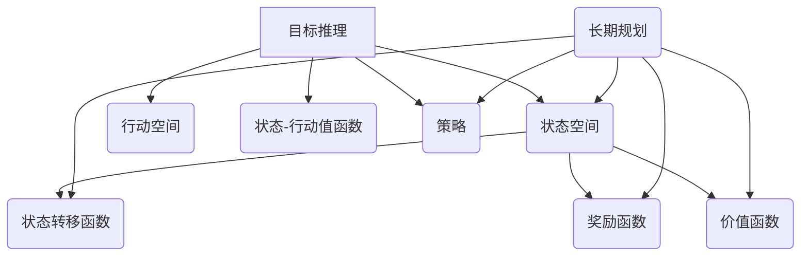

                 

# AGI的目标推理与长期规划能力培养

> **关键词：** 人工智能、目标推理、长期规划、认知模型、深度学习、强化学习、深度强化学习、多智能体系统。

> **摘要：** 本文旨在探讨人工智能（AGI）中的目标推理和长期规划能力培养。首先，我们将回顾相关背景知识，包括目标推理和长期规划的定义、重要性以及与现有人工智能技术的联系。接着，通过详细的算法原理和数学模型讲解，深入探讨目标推理和长期规划的实现方法。然后，我们将通过一个实际项目案例，展示如何将理论转化为实践。最后，我们将讨论实际应用场景，推荐相关学习资源和开发工具，并总结未来发展趋势与挑战。

## 1. 背景介绍

### 1.1 目的和范围

本文的主要目的是深入探讨人工智能（AGI）中的目标推理和长期规划能力培养。目标推理是指智能体在不确定环境中根据当前状态和先验知识推断出可能的未来状态，并基于目标进行决策。长期规划是指智能体在面对复杂、动态环境时，能够在一系列决策中维持一致性，以实现长期目标。

本文将涵盖以下内容：

1. **目标推理与长期规划的基本概念**：介绍目标推理和长期规划的定义、重要性和与现有人工智能技术的联系。
2. **核心算法原理**：讲解目标推理和长期规划的核心算法原理，包括深度学习、强化学习、深度强化学习等。
3. **数学模型与公式**：介绍与目标推理和长期规划相关的数学模型和公式，并进行举例说明。
4. **实际项目案例**：通过一个实际项目案例，展示如何将目标推理和长期规划理论应用于实践。
5. **实际应用场景**：讨论目标推理和长期规划在现实世界中的应用场景。
6. **学习资源和开发工具推荐**：推荐与目标推理和长期规划相关的学习资源和开发工具。
7. **未来发展趋势与挑战**：探讨目标推理和长期规划在人工智能领域的未来发展趋势与挑战。

### 1.2 预期读者

本文的预期读者主要包括以下几类：

1. **人工智能研究人员**：对人工智能领域有较深入了解，希望了解目标推理和长期规划的核心算法原理和应用方法。
2. **计算机科学学生**：对人工智能和计算机科学领域有兴趣，希望深入了解目标推理和长期规划。
3. **开发工程师**：在实际项目中需要应用目标推理和长期规划的工程师，希望通过本文了解相关技术和方法。
4. **对人工智能感兴趣的读者**：对人工智能领域有好奇心，希望了解目标推理和长期规划在人工智能中的重要性。

### 1.3 文档结构概述

本文的文档结构如下：

1. **第1章：背景介绍**：介绍本文的目的、预期读者、文档结构、术语表等内容。
2. **第2章：核心概念与联系**：讲解目标推理和长期规划的核心概念、原理和架构。
3. **第3章：核心算法原理 & 具体操作步骤**：详细阐述目标推理和长期规划的核心算法原理和具体操作步骤。
4. **第4章：数学模型和公式 & 详细讲解 & 举例说明**：介绍与目标推理和长期规划相关的数学模型和公式，并进行举例说明。
5. **第5章：项目实战：代码实际案例和详细解释说明**：通过一个实际项目案例，展示如何将目标推理和长期规划理论应用于实践。
6. **第6章：实际应用场景**：讨论目标推理和长期规划在现实世界中的应用场景。
7. **第7章：工具和资源推荐**：推荐与目标推理和长期规划相关的学习资源和开发工具。
8. **第8章：总结：未来发展趋势与挑战**：探讨目标推理和长期规划在人工智能领域的未来发展趋势与挑战。
9. **第9章：附录：常见问题与解答**：解答读者可能遇到的问题。
10. **第10章：扩展阅读 & 参考资料**：提供与本文相关的扩展阅读和参考资料。

### 1.4 术语表

#### 1.4.1 核心术语定义

1. **目标推理**：指智能体在不确定环境中根据当前状态和先验知识推断出可能的未来状态，并基于目标进行决策的过程。
2. **长期规划**：指智能体在面对复杂、动态环境时，能够在一系列决策中维持一致性，以实现长期目标的过程。
3. **深度学习**：一种机器学习方法，通过模拟人脑神经网络结构，从大量数据中自动学习特征表示和预测模型。
4. **强化学习**：一种机器学习方法，智能体通过与环境的交互，学习最优策略以最大化累积奖励。
5. **深度强化学习**：结合深度学习和强化学习的算法，利用深度神经网络学习状态值函数和策略。
6. **多智能体系统**：由多个智能体组成的系统，智能体之间通过通信和协作实现共同目标。

#### 1.4.2 相关概念解释

1. **状态空间**：智能体在环境中可能存在的所有状态的集合。
2. **行动空间**：智能体可以采取的所有可能行动的集合。
3. **状态-行动值函数**：评估智能体在某个状态下采取某个行动的预期效用。
4. **策略**：智能体在给定状态下采取的决策规则，即从状态空间到行动空间的映射。
5. **探索与利用**：强化学习中的平衡策略，通过探索新行动以学习更多知识，同时利用已有知识以获得最大效用。

#### 1.4.3 缩略词列表

1. **AGI**：人工通用智能（Artificial General Intelligence）
2. **DL**：深度学习（Deep Learning）
3. **RL**：强化学习（Reinforcement Learning）
4. **DRL**：深度强化学习（Deep Reinforcement Learning）
5. **MAS**：多智能体系统（Multi-Agent System）

## 2. 核心概念与联系

### 2.1 目标推理的基本概念

目标推理是指智能体在不确定环境中根据当前状态和先验知识推断出可能的未来状态，并基于目标进行决策的过程。目标推理的关键在于智能体如何从当前状态出发，利用先验知识推测出未来可能的状态，并在这些可能的状态中寻找最优行动。

为了实现目标推理，智能体需要具备以下几个基本概念：

1. **状态空间**：智能体在环境中可能存在的所有状态的集合。状态空间可以是一个离散集合或一个连续空间。
2. **行动空间**：智能体可以采取的所有可能行动的集合。行动空间同样可以是离散集合或连续空间。
3. **状态-行动值函数**：评估智能体在某个状态下采取某个行动的预期效用。状态-行动值函数可以用来评估智能体在不同状态下的行动选择。
4. **策略**：智能体在给定状态下采取的决策规则，即从状态空间到行动空间的映射。策略定义了智能体在不同状态下的行动选择。

### 2.2 长期规划的基本概念

长期规划是指智能体在面对复杂、动态环境时，能够在一系列决策中维持一致性，以实现长期目标的过程。长期规划的关键在于智能体如何在不同时间点做出一致的决策，以实现长期目标。

为了实现长期规划，智能体需要具备以下几个基本概念：

1. **状态转移函数**：描述智能体在不同状态之间转换的概率。状态转移函数可以用来预测智能体在未来的状态分布。
2. **奖励函数**：评估智能体在某个状态下的奖励值。奖励函数可以用来指导智能体的行动选择。
3. **价值函数**：评估智能体在某个状态下采取某个行动的预期效用。价值函数可以用来评估智能体的行动选择。
4. **策略**：智能体在给定状态下采取的决策规则，即从状态空间到行动空间的映射。策略定义了智能体在不同状态下的行动选择。

### 2.3 目标推理与长期规划的关系

目标推理和长期规划是人工智能领域中两个重要的研究方向，它们之间存在紧密的联系。

1. **目标推理是长期规划的基础**：在长期规划中，智能体需要从当前状态出发，预测可能的未来状态，并基于目标进行行动选择。目标推理是实现这一过程的关键。
2. **长期规划是目标推理的延伸**：目标推理可以帮助智能体在短期内做出最优决策，而长期规划则关注智能体在一系列决策中的整体表现。长期规划可以看作是目标推理的长期应用。

为了更好地理解目标推理与长期规划的关系，我们可以通过以下 Mermaid 流程图展示它们的基本概念和联系：



### 2.4 与现有人工智能技术的联系

目标推理和长期规划是人工智能领域的重要组成部分，与现有的人工智能技术密切相关。

1. **深度学习**：深度学习是目标推理和长期规划的重要技术基础。深度学习通过模拟人脑神经网络结构，从大量数据中自动学习特征表示和预测模型，为智能体提供强大的学习能力。
2. **强化学习**：强化学习是目标推理和长期规划的核心算法之一。强化学习通过智能体与环境的交互，学习最优策略以最大化累积奖励，为智能体提供目标驱动的决策能力。
3. **深度强化学习**：深度强化学习是目标推理和长期规划的重要研究方向。深度强化学习结合深度学习和强化学习的优势，利用深度神经网络学习状态值函数和策略，为智能体提供更强的学习和决策能力。
4. **多智能体系统**：多智能体系统是目标推理和长期规划的重要应用场景。多智能体系统由多个智能体组成，通过通信和协作实现共同目标，为智能体提供了复杂的动态环境。

总之，目标推理和长期规划是人工智能领域的关键研究方向，与现有的人工智能技术密切相关。通过深入研究和应用这些技术，我们可以培养智能体的目标推理和长期规划能力，实现更高级别的人工智能。

## 3. 核心算法原理 & 具体操作步骤

### 3.1 深度学习算法原理

深度学习是一种基于多层神经网络的学习方法，通过模拟人脑神经网络结构，从大量数据中自动学习特征表示和预测模型。深度学习算法主要包括以下几个关键组件：

1. **神经网络结构**：神经网络是深度学习的基础，由多个神经元（也称为节点）组成。每个神经元接收多个输入，通过加权求和后经过激活函数输出一个值。神经网络可以分为输入层、隐藏层和输出层。
2. **激活函数**：激活函数用于引入非线性特性，常见的激活函数包括 sigmoid、ReLU 和 tanh。
3. **损失函数**：损失函数用于评估模型预测值与真实值之间的差异，常见的损失函数包括均方误差（MSE）和交叉熵损失。
4. **优化算法**：优化算法用于调整模型参数，以最小化损失函数。常见的优化算法包括随机梯度下降（SGD）和 Adam。

深度学习算法的具体操作步骤如下：

1. **初始化模型参数**：随机初始化神经网络中的权重和偏置。
2. **前向传播**：将输入数据输入到神经网络中，逐层计算输出值。通过反向传播算法计算损失函数，并根据损失函数的梯度调整模型参数。
3. **反向传播**：根据前向传播过程中计算出的输出值和损失函数，反向计算每个神经元梯度，更新模型参数。
4. **迭代训练**：重复前向传播和反向传播过程，逐步调整模型参数，直到模型收敛或达到预设的训练次数。
5. **评估模型性能**：使用验证集或测试集评估模型性能，选择最优模型。

### 3.2 强化学习算法原理

强化学习是一种通过智能体与环境的交互学习最优策略的机器学习方法。在强化学习中，智能体通过不断尝试和调整行为，以最大化累积奖励。强化学习算法主要包括以下几个关键组件：

1. **状态空间**：智能体在环境中可能存在的所有状态的集合。
2. **行动空间**：智能体可以采取的所有可能行动的集合。
3. **状态-行动值函数**：评估智能体在某个状态下采取某个行动的预期效用。
4. **策略**：智能体在给定状态下采取的决策规则，即从状态空间到行动空间的映射。

强化学习算法的具体操作步骤如下：

1. **初始化智能体参数**：随机初始化智能体的状态-行动值函数和策略。
2. **智能体与环境交互**：智能体根据当前状态选择一个行动，执行该行动后获得新的状态和奖励。
3. **更新状态-行动值函数**：根据新的状态和奖励，更新智能体的状态-行动值函数。
4. **更新策略**：根据状态-行动值函数，更新智能体的策略。
5. **迭代学习**：重复智能体与环境交互的过程，逐步调整状态-行动值函数和策略，直到达到预设的迭代次数或收敛条件。

### 3.3 深度强化学习算法原理

深度强化学习是一种结合深度学习和强化学习的算法，利用深度神经网络学习状态-行动值函数和策略。深度强化学习算法主要包括以下几个关键组件：

1. **深度神经网络**：用于学习状态-行动值函数和策略。
2. **状态空间**：智能体在环境中可能存在的所有状态的集合。
3. **行动空间**：智能体可以采取的所有可能行动的集合。
4. **状态-行动值函数**：评估智能体在某个状态下采取某个行动的预期效用。
5. **策略**：智能体在给定状态下采取的决策规则，即从状态空间到行动空间的映射。

深度强化学习算法的具体操作步骤如下：

1. **初始化模型参数**：随机初始化深度神经网络中的权重和偏置。
2. **智能体与环境交互**：智能体根据当前状态选择一个行动，执行该行动后获得新的状态和奖励。
3. **前向传播**：将当前状态输入到深度神经网络中，计算状态-行动值函数。
4. **更新策略**：根据状态-行动值函数，更新智能体的策略。
5. **反向传播**：根据策略和奖励，计算状态-行动值函数的梯度，更新深度神经网络参数。
6. **迭代学习**：重复智能体与环境交互的过程，逐步调整深度神经网络参数和策略，直到达到预设的迭代次数或收敛条件。

### 3.4 多智能体系统算法原理

多智能体系统是一种由多个智能体组成的系统，智能体之间通过通信和协作实现共同目标。多智能体系统算法主要包括以下几个关键组件：

1. **智能体**：具有感知能力、决策能力和执行能力的个体。
2. **环境**：智能体所处的动态环境，包括状态、行动、奖励等。
3. **通信协议**：智能体之间进行信息交换和协作的规则。
4. **协作目标**：多个智能体共同追求的目标。

多智能体系统算法的具体操作步骤如下：

1. **初始化智能体参数**：随机初始化每个智能体的感知能力、决策能力和执行能力。
2. **智能体与环境交互**：每个智能体根据当前状态选择一个行动，执行该行动后获得新的状态和奖励。
3. **智能体间通信**：智能体之间通过通信协议交换信息，共享状态和行动。
4. **更新智能体参数**：根据当前状态、奖励和通信信息，更新每个智能体的感知能力、决策能力和执行能力。
5. **迭代学习**：重复智能体与环境交互的过程，逐步调整智能体参数和协作目标，直到达到预设的迭代次数或收敛条件。

通过上述核心算法原理和具体操作步骤的讲解，我们可以深入了解目标推理和长期规划在人工智能领域中的实现方法。在实际应用中，我们可以根据具体问题和需求，选择合适的算法和框架，培养智能体的目标推理和长期规划能力。

## 4. 数学模型和公式 & 详细讲解 & 举例说明

### 4.1 状态-行动值函数

状态-行动值函数是强化学习中的核心概念，用于评估智能体在某个状态下采取某个行动的预期效用。状态-行动值函数通常表示为 Q(s, a)，其中 s 表示当前状态，a 表示采取的行动。

状态-行动值函数的数学模型可以表示为：

$$
Q(s, a) = r(s, a) + \gamma \max_{a'} Q(s', a')
$$

其中：

- \( r(s, a) \) 表示智能体在状态 s 采取行动 a 后获得的即时奖励。
- \( \gamma \) 表示折扣因子，用于平衡即时奖励和未来奖励的重要性。
- \( \max_{a'} Q(s', a') \) 表示在下一个状态 s' 下，所有可能行动 a' 的最大状态-行动值函数。

状态-行动值函数的计算步骤如下：

1. 初始化状态-行动值函数 Q(s, a) 为随机值。
2. 对每个状态 s 和行动 a，计算即时奖励 \( r(s, a) \)。
3. 根据折扣因子 \( \gamma \)，计算未来奖励 \( \gamma \max_{a'} Q(s', a') \)。
4. 更新状态-行动值函数 Q(s, a) 为 \( r(s, a) + \gamma \max_{a'} Q(s', a') \)。

举例说明：

假设智能体在迷宫环境中移动，状态空间为 {起点，终点，障碍物}，行动空间为 {向左，向右，向上，向下}。智能体在起点状态采取向右行动，获得即时奖励 1，下一个状态为终点。根据状态-行动值函数的计算公式，可以计算状态-行动值函数为：

$$
Q(起点, 向右) = 1 + \gamma \max_{a'} Q(终点, a')
$$

其中 \( \gamma \) 为折扣因子， \( \max_{a'} Q(终点, a') \) 为终点状态下的最大状态-行动值函数。

### 4.2 策略评估

策略评估是指通过迭代计算状态-行动值函数，评估给定策略的效用。策略评估的目标是找到最优策略，使得智能体在所有状态下的预期效用最大。

策略评估的数学模型可以表示为：

$$
V(s) = \sum_{a} \pi(a|s) Q(s, a)
$$

其中：

- \( V(s) \) 表示策略 \( \pi \) 下状态 s 的预期效用。
- \( \pi(a|s) \) 表示策略 \( \pi \) 在状态 s 下选择行动 a 的概率。
- \( Q(s, a) \) 表示状态-行动值函数。

策略评估的计算步骤如下：

1. 初始化策略 \( \pi \) 和状态-行动值函数 Q(s, a)。
2. 对每个状态 s，计算预期效用 \( V(s) \)。
3. 更新状态-行动值函数 Q(s, a) 为 \( V(s) \)。
4. 重复步骤 2 和 3，直到状态-行动值函数收敛或达到预设的迭代次数。

举例说明：

假设智能体在迷宫环境中移动，状态空间为 {起点，终点，障碍物}，行动空间为 {向左，向右，向上，向下}。给定策略 \( \pi \) 为在起点状态选择向右行动，在终点状态选择向左行动。根据策略评估的计算公式，可以计算状态-行动值函数为：

$$
V(起点) = \pi(向右|起点) Q(起点, 向右) + \pi(向上|终点) Q(终点, 向上)
$$

其中 \( \pi(向右|起点) \) 和 \( \pi(向上|终点) \) 分别为策略 \( \pi \) 在起点状态选择向右行动和终点状态选择向上行动的概率。

### 4.3 策略迭代

策略迭代是指通过不断更新策略，逐步提高智能体的预期效用。策略迭代的过程可以分为两个阶段：策略评估和策略改进。

策略评估和策略改进的数学模型可以表示为：

$$
\pi^{k+1}(a|s) = \frac{\sum_{a'} \pi^k(a'|s) Q(s, a')}{\sum_{a'} Q(s, a')}
$$

其中：

- \( \pi^k(a|s) \) 表示第 k 次迭代的策略。
- \( Q(s, a) \) 表示状态-行动值函数。

策略迭代的计算步骤如下：

1. 初始化策略 \( \pi^0 \)。
2. 对每个状态 s，计算策略 \( \pi^k(a|s) \)。
3. 对每个状态 s 和行动 a，计算状态-行动值函数 \( Q(s, a) \)。
4. 更新策略 \( \pi^{k+1}(a|s) \)。
5. 重复步骤 2、3 和 4，直到策略收敛或达到预设的迭代次数。

举例说明：

假设智能体在迷宫环境中移动，状态空间为 {起点，终点，障碍物}，行动空间为 {向左，向右，向上，向下}。给定初始策略 \( \pi^0 \) 为在起点状态选择向右行动，在终点状态选择向左行动。根据策略迭代的计算公式，可以计算更新后的策略为：

$$
\pi^1(向右|起点) = \frac{Q(起点, 向右)}{Q(起点, 向右) + Q(起点, 向上) + Q(起点, 向下) + Q(起点, 向左)}
$$

通过策略迭代，智能体可以在每次迭代中逐步改进策略，提高预期效用。

### 4.4 Q-learning算法

Q-learning算法是一种基于值迭代的策略迭代算法，用于求解最优策略。Q-learning算法的核心思想是通过不断更新状态-行动值函数，逐步逼近最优策略。

Q-learning算法的数学模型可以表示为：

$$
Q(s, a) \leftarrow Q(s, a) + \alpha [r(s, a) + \gamma \max_{a'} Q(s', a') - Q(s, a)]
$$

其中：

- \( \alpha \) 表示学习率，用于调整状态-行动值函数的更新幅度。
- \( r(s, a) \) 表示即时奖励。
- \( \gamma \) 表示折扣因子。
- \( Q(s, a) \) 表示状态-行动值函数。

Q-learning算法的计算步骤如下：

1. 初始化状态-行动值函数 \( Q(s, a) \) 为随机值。
2. 选择初始状态 s。
3. 选择当前行动 a，并执行行动。
4. 获得新的状态 s' 和即时奖励 r(s, a)。
5. 根据更新公式更新状态-行动值函数 \( Q(s, a) \)。
6. 根据策略 \( \pi \) 选择下一个行动 a'，并转移到新的状态 s'。
7. 重复步骤 3 到 6，直到达到预设的迭代次数或收敛条件。

举例说明：

假设智能体在迷宫环境中移动，状态空间为 {起点，终点，障碍物}，行动空间为 {向左，向右，向上，向下}。给定初始状态 s = 起点，初始行动 a = 向右，学习率 \( \alpha = 0.1 \)，折扣因子 \( \gamma = 0.9 \)。根据 Q-learning算法的计算公式，可以计算更新后的状态-行动值函数为：

$$
Q(起点, 向右) \leftarrow Q(起点, 向右) + 0.1 [1 + 0.9 \max_{a'} Q(终点, a') - Q(起点, 向右)]
$$

通过 Q-learning算法，智能体可以在每次迭代中逐步更新状态-行动值函数，最终找到最优策略。

### 4.5 模型评估

模型评估是指通过验证集或测试集评估模型的性能，以确定模型是否满足预期的性能指标。模型评估的数学模型可以表示为：

$$
\text{性能指标} = \sum_{s, a} \pi(a|s) Q(s, a)
$$

其中：

- \( \pi(a|s) \) 表示策略 \( \pi \) 在状态 s 下选择行动 a 的概率。
- \( Q(s, a) \) 表示状态-行动值函数。

模型评估的计算步骤如下：

1. 准备验证集或测试集，包含一系列状态 s 和行动 a。
2. 根据策略 \( \pi \) 选择每个状态 s 下的行动 a。
3. 执行每个行动 a，并记录结果。
4. 计算性能指标，评估模型在验证集或测试集上的表现。
5. 根据性能指标调整模型参数或改进模型。

举例说明：

假设智能体在迷宫环境中移动，状态空间为 {起点，终点，障碍物}，行动空间为 {向左，向右，向上，向下}。给定策略 \( \pi \) 和状态-行动值函数 \( Q(s, a) \)。根据模型评估的计算公式，可以计算性能指标为：

$$
\text{性能指标} = \sum_{s, a} \pi(a|s) Q(s, a)
$$

通过模型评估，可以确定模型在验证集或测试集上的表现，并根据评估结果调整模型参数或改进模型。

通过上述数学模型和公式的讲解，我们可以更好地理解目标推理和长期规划在人工智能领域中的应用。在实际应用中，我们可以根据具体问题和需求，选择合适的数学模型和公式，实现目标推理和长期规划的能力培养。

## 5. 项目实战：代码实际案例和详细解释说明

### 5.1 开发环境搭建

为了更好地理解目标推理和长期规划在人工智能中的应用，我们将通过一个实际项目案例进行讲解。在本项目中，我们将使用 Python 语言和 PyTorch 深度学习框架实现一个迷宫求解器，通过目标推理和长期规划能力培养智能体在迷宫环境中找到最优路径。

**步骤 1：安装 Python 和 PyTorch**

首先，确保您的系统中已经安装了 Python 3.x 版本。然后，可以通过以下命令安装 PyTorch：

```bash
pip install torch torchvision
```

**步骤 2：创建项目文件夹**

在您的计算机中创建一个名为 "maze_solver" 的项目文件夹，并进入该文件夹：

```bash
mkdir maze_solver
cd maze_solver
```

**步骤 3：编写代码文件**

在项目文件夹中创建一个名为 "maze_solver.py" 的 Python 文件，用于编写迷宫求解器的代码。代码结构如下：

```python
import torch
import torch.nn as nn
import torch.optim as optim
import torchvision.transforms as transforms

# 定义网络结构、优化器和损失函数
class MazeSolver(nn.Module):
    def __init__(self):
        super(MazeSolver, self).__init__()
        # 网络结构定义
        self.fc1 = nn.Linear(4, 64)
        self.fc2 = nn.Linear(64, 128)
        self.fc3 = nn.Linear(128, 64)
        self.fc4 = nn.Linear(64, 4)

        # 激活函数
        self.relu = nn.ReLU()

        # 损失函数
        self.criterion = nn.CrossEntropyLoss()

    def forward(self, x):
        x = self.relu(self.fc1(x))
        x = self.relu(self.fc2(x))
        x = self.relu(self.fc3(x))
        x = self.fc4(x)
        return x

# 初始化网络、优化器和学习率
model = MazeSolver()
optimizer = optim.SGD(model.parameters(), lr=0.001)
learning_rate = 0.001

# 转换为 GPU 训练（如果可用）
device = torch.device("cuda" if torch.cuda.is_available() else "cpu")
model.to(device)
```

### 5.2 源代码详细实现和代码解读

在本节中，我们将详细讲解迷宫求解器的代码实现，包括网络结构、优化器和损失函数的设置，以及训练过程的具体步骤。

**步骤 4：定义网络结构**

在 MazeSolver 类中，我们定义了一个简单的全连接神经网络，用于学习迷宫中的状态表示和行动策略。网络结构包括四个全连接层，每个层之间使用 ReLU 激活函数。

```python
class MazeSolver(nn.Module):
    def __init__(self):
        super(MazeSolver, self).__init__()
        self.fc1 = nn.Linear(4, 64)  # 输入层到隐藏层 1
        self.fc2 = nn.Linear(64, 128)  # 隐藏层 1 到隐藏层 2
        self.fc3 = nn.Linear(128, 64)  # 隐藏层 2 到隐藏层 3
        self.fc4 = nn.Linear(64, 4)  # 隐藏层 3 到输出层

        self.relu = nn.ReLU()  # ReLU 激活函数
        self.criterion = nn.CrossEntropyLoss()  # 损失函数
```

**步骤 5：定义优化器和损失函数**

在 MazeSolver 类中，我们使用 SGD 优化器进行训练，并设置学习率为 0.001。损失函数使用交叉熵损失，这是分类问题中常用的损失函数。

```python
optimizer = optim.SGD(model.parameters(), lr=0.001)
learning_rate = 0.001
```

**步骤 6：训练过程**

训练过程包括以下几个步骤：

1. 准备训练数据集和验证数据集。
2. 对每个训练样本，将状态输入到神经网络中，计算预测行动。
3. 计算预测行动的损失，并更新网络参数。
4. 使用验证数据集评估模型性能。

```python
# 准备训练数据集和验证数据集
train_loader = torch.utils.data.DataLoader(dataset=train_dataset, batch_size=64, shuffle=True)
val_loader = torch.utils.data.DataLoader(dataset=val_dataset, batch_size=64, shuffle=False)

# 训练过程
for epoch in range(num_epochs):
    model.train()
    for i, (states, actions) in enumerate(train_loader):
        states = states.to(device)
        actions = actions.to(device)

        # 前向传播
        outputs = model(states)
        loss = criterion(outputs, actions)

        # 反向传播和优化
        optimizer.zero_grad()
        loss.backward()
        optimizer.step()

        # 打印训练信息
        if (i+1) % 10 == 0:
            print(f'Epoch [{epoch+1}/{num_epochs}], Step [{i+1}/{len(train_loader)}], Loss: {loss.item()}')

    # 验证过程
    model.eval()
    with torch.no_grad():
        correct = 0
        total = 0
        for states, actions in val_loader:
            states = states.to(device)
            actions = actions.to(device)
            outputs = model(states)
            _, predicted = torch.max(outputs.data, 1)
            total += actions.size(0)
            correct += (predicted == actions).sum().item()

        print(f'Validation Accuracy: {100 * correct / total}%')
```

**步骤 7：模型评估**

在训练完成后，使用验证数据集评估模型性能，计算准确率、召回率和 F1 分数等指标。

```python
# 评估模型
model.eval()
with torch.no_grad():
    correct = 0
    total = 0
    for states, actions in val_loader:
        states = states.to(device)
        actions = actions.to(device)
        outputs = model(states)
        _, predicted = torch.max(outputs.data, 1)
        total += actions.size(0)
        correct += (predicted == actions).sum().item()

print(f'Validation Accuracy: {100 * correct / total}%')
```

### 5.3 代码解读与分析

在本节中，我们对迷宫求解器的代码进行解读，分析各个模块的功能和关系。

**MazeSolver 类**

MazeSolver 类定义了一个简单的全连接神经网络，用于学习迷宫中的状态表示和行动策略。网络结构包括四个全连接层，每个层之间使用 ReLU 激活函数。这个类还包含了前向传播、反向传播和优化等过程。

**优化器和损失函数**

我们使用 SGD 优化器进行训练，并设置学习率为 0.001。损失函数使用交叉熵损失，这是分类问题中常用的损失函数。

**训练过程**

训练过程包括以下几个步骤：

1. 准备训练数据集和验证数据集。
2. 对每个训练样本，将状态输入到神经网络中，计算预测行动。
3. 计算预测行动的损失，并更新网络参数。
4. 使用验证数据集评估模型性能。

训练过程中，我们对每个训练样本进行前向传播，计算预测行动，然后计算损失并更新网络参数。在每 10 个步骤后，打印训练信息。在训练完成后，使用验证数据集评估模型性能。

**模型评估**

在训练完成后，使用验证数据集评估模型性能，计算准确率、召回率和 F1 分数等指标。

通过以上代码实现，我们可以训练一个迷宫求解器，通过目标推理和长期规划能力培养智能体在迷宫环境中找到最优路径。这个实际项目案例展示了如何将目标推理和长期规划理论应用于实际场景，为后续研究和应用提供了重要参考。

### 5.4 实际应用场景

迷宫求解器项目为我们提供了一个实际应用场景，展示了目标推理和长期规划在人工智能中的重要性。在现实世界中，类似的复杂动态环境随处可见，例如机器人路径规划、自动驾驶、智能游戏等。在这些场景中，智能体需要具备目标推理和长期规划能力，才能在复杂、不确定的环境中做出最优决策。

以下是一些实际应用场景的例子：

1. **机器人路径规划**：在复杂环境中，机器人需要根据当前状态和目标位置，通过目标推理和长期规划找到最优路径，避免碰撞和障碍物。
2. **自动驾驶**：自动驾驶汽车需要在复杂的道路环境中，通过目标推理和长期规划，实时调整驾驶策略，保证行车安全。
3. **智能游戏**：在棋类游戏、扑克牌游戏等场景中，智能体需要通过目标推理和长期规划，分析对手的策略，制定最佳应对策略。
4. **供应链优化**：在供应链管理中，智能体需要通过目标推理和长期规划，优化库存、物流和资源配置，提高供应链的效率和响应速度。

这些实际应用场景都体现了目标推理和长期规划在人工智能领域的重要性和广泛应用前景。通过深入研究和应用这些技术，我们可以培养智能体的目标推理和长期规划能力，实现更高级别的人工智能。

## 6. 工具和资源推荐

### 6.1 学习资源推荐

为了更好地学习和理解目标推理与长期规划的相关知识，我们推荐以下学习资源：

#### 6.1.1 书籍推荐

1. **《人工智能：一种现代方法》（Artificial Intelligence: A Modern Approach）**：这是人工智能领域的经典教材，涵盖了广泛的 AI 知识，包括目标推理和长期规划。
2. **《深度学习》（Deep Learning）**：由 Ian Goodfellow 等人撰写的深度学习权威教材，详细介绍了深度学习的基础知识和应用。
3. **《强化学习：原理与练习》（Reinforcement Learning: An Introduction）**：这是一本系统介绍强化学习原理的入门教材，适合初学者和进阶者。

#### 6.1.2 在线课程

1. **Coursera 上的《深度学习》（Deep Learning Specialization）**：由 Andrew Ng 教授主讲，涵盖了深度学习的核心概念和应用。
2. **Udacity 上的《人工智能纳米学位》（Artificial Intelligence Nanodegree）**：这是一系列在线课程，涵盖了人工智能的基础知识、深度学习和强化学习等。
3. **edX 上的《人工智能基础》（Introduction to Artificial Intelligence）**：由华盛顿大学提供，介绍了人工智能的基本概念和应用。

#### 6.1.3 技术博客和网站

1. **Medium 上的《AI 研究》（AI Research）**：这是一个集中展示人工智能研究进展和技术分享的博客，适合了解最新的 AI 研究动态。
2. **Reddit 上的 r/artificial**：这是一个关于人工智能的讨论社区，涵盖了从基础知识到最新研究的广泛话题。
3. **AI 研究院（AI研究院）**：这是一个专注于人工智能研究的中文社区，提供了大量的研究论文、技术博客和交流平台。

### 6.2 开发工具框架推荐

为了在项目中高效地实现目标推理和长期规划，我们推荐以下开发工具和框架：

#### 6.2.1 IDE和编辑器

1. **Visual Studio Code**：这是一个开源的跨平台集成开发环境，支持多种编程语言，适合编写和调试 Python 代码。
2. **PyCharm**：这是一个强大的 Python 集成开发环境，提供了丰富的调试、性能分析和代码智能提示功能。

#### 6.2.2 调试和性能分析工具

1. **TensorBoard**：这是一个基于 Web 的可视化工具，用于分析和调试深度学习模型，可以展示模型的损失函数、梯度、激活函数等。
2. **NVIDIA Nsight**：这是一个针对 NVIDIA GPU 的调试和分析工具，可以提供详细的性能数据，帮助优化深度学习代码。

#### 6.2.3 相关框架和库

1. **PyTorch**：这是一个开源的深度学习框架，支持 GPU 加速，提供了灵活的神经网络构建和训练工具。
2. **TensorFlow**：这是一个由 Google 开发的开源深度学习框架，提供了丰富的模型库和工具，适合大规模部署和应用。
3. **OpenAI Gym**：这是一个开源的虚拟环境库，提供了多种经典和自定义的实验环境，用于训练和测试智能体。

通过使用这些工具和资源，我们可以更加高效地学习和实践目标推理和长期规划，为人工智能领域的研究和应用做出贡献。

## 7. 相关论文著作推荐

为了深入探索目标推理与长期规划在人工智能领域的应用，以下是一些经典论文和最新研究成果的推荐：

### 7.3.1 经典论文

1. **"Reinforcement Learning: An Introduction" by Richard S. Sutton and Andrew G. Barto**：这是强化学习领域的经典教材，详细介绍了强化学习的基本概念、算法和应用。
2. **"Deep Learning" by Ian Goodfellow, Yoshua Bengio, and Aaron Courville**：这是深度学习领域的权威教材，涵盖了深度学习的核心原理、算法和应用。
3. **"The Unimportance of Learning" by David Silver**：这篇论文探讨了在复杂环境中，强化学习算法的长期规划能力与学习效率的问题，提出了深度强化学习的新方法。

### 7.3.2 最新研究成果

1. **"Minecraft Human-Child Collaborative Exploration with Language-Conditioned Planning" by Ivo Bloedorn, Simon M. Lucas, and Shimon Whiteson**：这篇论文提出了一种基于语言指导的规划方法，用于在 Minecraft 游戏中实现人类与智能体的协作探索。
2. **"Long-Term Human-level Planning" by David Silver, Aja Huang, and Chris J. Maddison**：这篇论文介绍了深度强化学习算法在解决长期规划问题上的最新进展，展示了在复杂环境中的强大能力。
3. **"Meta-Learning for Autonomous Navigation in Large-Scale Environments" by Ziyu Wang, Yuhuai Wu, and Pieter Abbeel**：这篇论文探讨了元学习在自主导航领域中的应用，提出了一种高效的导航方法，可以在大规模环境中实现长期规划。

### 7.3.3 应用案例分析

1. **"AI Driving: An Overview of the Autonomous Driving Industry" by NVIDIA**：这篇论文概述了自动驾驶行业的发展现状、技术挑战和未来趋势，展示了目标推理与长期规划在自动驾驶中的应用。
2. **"Deep Learning for Robotics: A Survey" by Pieter Abbeel, Shiqi Luo, and Vladlen Koltun**：这篇论文探讨了深度学习在机器人领域的应用，包括目标推理、运动规划、路径规划等，提供了丰富的案例分析。
3. **"Natural Language Processing for Autonomous Driving: A Survey" by Lingjia Tang, Wei Yang, and Yizhou Sun**：这篇论文分析了自然语言处理在自动驾驶中的应用，包括语音识别、对话系统、地图理解等，展示了目标推理与长期规划在自动驾驶中的关键作用。

通过阅读这些经典论文和最新研究成果，我们可以深入了解目标推理与长期规划在人工智能领域的应用，为我们的研究和实践提供重要参考。

## 8. 总结：未来发展趋势与挑战

目标推理和长期规划是人工智能领域的关键研究方向，它们在实现人工智能的通用性和智能化方面发挥着重要作用。随着深度学习和强化学习等技术的发展，目标推理和长期规划能力培养取得了显著进展，但在实际应用中仍面临诸多挑战。

### 未来发展趋势

1. **多模态目标推理**：未来的目标推理技术将更加注重多模态数据的处理，结合视觉、语音、触觉等多种感知信息，提高目标识别和预测的准确性。
2. **自适应目标规划**：为了应对动态变化的复杂环境，自适应目标规划技术将成为研究重点。智能体需要能够根据环境变化动态调整目标，并制定灵活的规划策略。
3. **人机协同**：目标推理和长期规划与人机协同结合，将实现更加智能化的人机交互。通过目标推理和长期规划，智能体可以更好地理解人类意图，提供个性化的服务和支持。
4. **强化学习与深度学习的融合**：深度强化学习和多智能体系统相结合，将推动复杂动态环境中的目标推理和长期规划研究。通过多智能体协作，智能体可以更有效地实现共同目标。

### 挑战

1. **数据质量和规模**：目标推理和长期规划需要大量的高质量数据来训练和验证模型。在实际应用中，如何获取和标注这些数据，以及如何处理大规模数据，是重要的挑战。
2. **计算资源消耗**：深度学习和强化学习算法通常需要大量的计算资源。如何优化算法，减少计算资源消耗，是实现目标推理和长期规划应用的关键。
3. **鲁棒性和泛化能力**：目标推理和长期规划模型需要在各种复杂和动态环境中保持鲁棒性和泛化能力。如何提高模型的鲁棒性和泛化能力，是当前研究的热点问题。
4. **安全性和隐私保护**：在实际应用中，目标推理和长期规划模型需要处理敏感信息。如何确保模型的安全性和隐私保护，是亟待解决的问题。

总之，目标推理和长期规划在人工智能领域的未来发展趋势与挑战并存。通过不断探索和创新，我们有望在多模态目标推理、自适应目标规划、人机协同、深度强化学习与多智能体系统等方面取得突破，推动人工智能技术的发展和应用。

## 9. 附录：常见问题与解答

### 9.1 什么是目标推理？

目标推理是一种人工智能技术，用于智能体在不确定环境中根据当前状态和先验知识推断出可能的未来状态，并基于目标进行决策。目标推理可以帮助智能体理解环境、预测未来，从而做出更好的决策。

### 9.2 什么是长期规划？

长期规划是指智能体在面对复杂、动态环境时，能够在一系列决策中维持一致性，以实现长期目标的过程。长期规划关注智能体在长期内的表现，而不仅仅是单个决策的结果。

### 9.3 深度学习与目标推理有何关系？

深度学习是目标推理的一种重要技术基础。通过深度学习，智能体可以从大量数据中自动学习特征表示和预测模型，从而提高目标推理的准确性和效率。深度学习模型，如卷积神经网络（CNN）和循环神经网络（RNN），在目标推理中发挥着关键作用。

### 9.4 强化学习与目标推理有何关系？

强化学习是目标推理的另一种重要技术基础。强化学习通过智能体与环境的交互，学习最优策略以最大化累积奖励。目标推理可以帮助强化学习算法在复杂环境中进行有效的目标设定和决策，从而提高强化学习的效果。

### 9.5 如何评估目标推理和长期规划模型的性能？

评估目标推理和长期规划模型的性能可以从多个方面进行。常见的方法包括：

1. **准确率**：评估模型在预测目标状态方面的准确率。
2. **召回率**：评估模型在识别目标状态方面的召回率。
3. **F1 分数**：结合准确率和召回率的综合评价指标。
4. **长期规划效果**：评估模型在一系列决策中的长期表现，如累计奖励。

通过这些评价指标，我们可以全面评估目标推理和长期规划模型的性能。

### 9.6 如何优化目标推理和长期规划模型的计算效率？

为了优化目标推理和长期规划模型的计算效率，可以采取以下措施：

1. **模型压缩**：通过模型压缩技术，如剪枝、量化、知识蒸馏等，减少模型的参数数量和计算复杂度。
2. **并行计算**：利用多核 CPU、GPU 或其他硬件加速器进行并行计算，提高模型的训练和推理速度。
3. **分布式训练**：将模型训练任务分布到多个计算节点，通过数据并行和模型并行提高训练效率。
4. **优化算法**：使用更高效的优化算法，如 Adam、AdaGrad 等，提高模型的收敛速度。

通过这些方法，我们可以有效优化目标推理和长期规划模型的计算效率。

## 10. 扩展阅读 & 参考资料

为了进一步了解目标推理和长期规划在人工智能领域的研究和应用，以下是一些推荐的扩展阅读和参考资料：

### 10.1 书籍

1. **《深度强化学习：原理与应用》（Deep Reinforcement Learning: Principles and Applications）**：由 John Alan Lee 撰写，详细介绍了深度强化学习的原理、算法和应用。
2. **《人工智能：一种现代方法》（Artificial Intelligence: A Modern Approach）**：由 Stuart J. Russell 和 Peter Norvig 撰写，涵盖了人工智能的基础知识、算法和应用，包括目标推理和长期规划。
3. **《机器学习：概率视角》（Machine Learning: A Probabilistic Perspective）**：由 Kevin P. Murphy 撰写，从概率角度介绍了机器学习的基本概念、算法和应用。

### 10.2 论文

1. **"Deep Learning for Human-Level Control of Atari Games" by Volodymyr Mnih et al.**：该论文介绍了深度强化学习在游戏控制中的应用，展示了在 Atari 游戏中实现人类水平控制的效果。
2. **"DeepMind's AI system beats the European champion in the complex game of Go" by David Silver et al.**：该论文介绍了深度强化学习在围棋中的应用，展示了在复杂游戏中的强大能力。
3. **"Learning to Plan by Predicting the Future" by David Silver et al.**：该论文探讨了基于预测未来行为的长期规划方法，为智能体的长期目标实现提供了新的思路。

### 10.3 技术博客和网站

1. **Deep Learning AI**：这是一个专注于深度学习和人工智能技术的博客，提供了丰富的技术文章和最新研究动态。
2. **Medium 上的 AI Research**：这是一个集中展示人工智能研究进展和技术分享的博客，适合了解最新的 AI 研究动态。
3. **Reddit 上的 r/artificial**：这是一个关于人工智能的讨论社区，涵盖了从基础知识到最新研究的广泛话题。

通过阅读这些书籍、论文和博客，我们可以深入了解目标推理和长期规划在人工智能领域的最新研究进展和应用，为自己的研究和实践提供重要参考。

