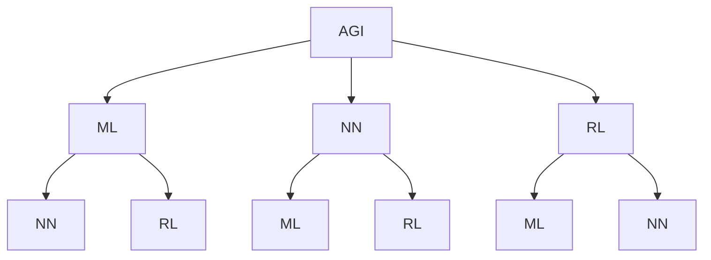

                 

# AGI的类人创造力：从问题重构到创新解决

> **关键词：** 人工智能，通用人工智能（AGI），问题重构，创新解决，创造力，技术博客

> **摘要：** 本文将深入探讨通用人工智能（AGI）的类人创造力，包括其问题重构和创新解决的过程。我们将通过逐步分析，介绍AGI的核心概念、算法原理、数学模型、项目实战和实际应用场景，并推荐相关资源和工具。最终，我们还将总结AGI的未来发展趋势与挑战。

## 1. 背景介绍

### 1.1 目的和范围

本文旨在探讨通用人工智能（AGI）的类人创造力，分析其如何从问题重构到创新解决。我们将会逐步介绍AGI的核心概念，深入讲解其背后的算法原理和数学模型，并通过实际案例进行详细解释。此外，我们还将探讨AGI在现实世界中的应用场景，并推荐相关的学习资源和工具。

### 1.2 预期读者

本文适合对人工智能和通用人工智能有一定了解的读者，包括程序员、数据科学家、AI研究者以及对AGI感兴趣的技术爱好者。读者可以通过本文对AGI的类人创造力有更深入的理解。

### 1.3 文档结构概述

本文分为以下几部分：

1. 背景介绍：介绍本文的目的、范围、预期读者和文档结构。
2. 核心概念与联系：介绍通用人工智能的核心概念及其相互关系。
3. 核心算法原理 & 具体操作步骤：详细阐述通用人工智能的算法原理和操作步骤。
4. 数学模型和公式 & 详细讲解 & 举例说明：介绍通用人工智能背后的数学模型和公式，并通过例子进行说明。
5. 项目实战：通过实际代码案例来展示通用人工智能的应用。
6. 实际应用场景：探讨通用人工智能在现实世界中的应用。
7. 工具和资源推荐：推荐学习资源和开发工具。
8. 总结：总结AGI的未来发展趋势与挑战。
9. 附录：常见问题与解答。
10. 扩展阅读 & 参考资料：提供进一步的阅读资料。

### 1.4 术语表

#### 1.4.1 核心术语定义

- **通用人工智能（AGI）**：具有广泛认知能力的人工智能系统，能够像人类一样学习、思考、解决问题和进行创新。
- **问题重构**：将原始问题转化为适合人工智能处理的形式。
- **创新解决**：通过创造性的方法来解决复杂问题。

#### 1.4.2 相关概念解释

- **机器学习**：让计算机通过数据学习，从而进行预测或决策的技术。
- **神经网络**：模拟人脑神经元连接的结构，用于处理数据和识别模式。
- **强化学习**：通过试错和奖励机制来学习行为策略。

#### 1.4.3 缩略词列表

- **AGI**：通用人工智能（Artificial General Intelligence）
- **ML**：机器学习（Machine Learning）
- **DL**：深度学习（Deep Learning）
- **RL**：强化学习（Reinforcement Learning）

## 2. 核心概念与联系

在探讨AGI的类人创造力之前，我们需要理解一些核心概念，以及它们之间的联系。以下是AGI、机器学习（ML）、神经网络（NN）和强化学习（RL）之间的关系图：



### 2.1 通用人工智能（AGI）

通用人工智能（AGI）是一种具有广泛认知能力的人工智能系统。与目前的大多数人工智能系统（如弱人工智能）不同，AGI能够在各种任务和环境中表现出与人类相似的表现。AGI的核心能力包括：

- **学习**：从数据和经验中学习，提高其性能。
- **推理**：基于已有知识和信息进行逻辑推理。
- **问题解决**：识别问题，提出解决方案并执行。
- **创造力**：产生新颖的想法和解决方案。

### 2.2 机器学习（ML）

机器学习是使计算机通过数据学习的一种技术。ML可以分为以下几类：

- **监督学习**：根据已知的输入和输出数据进行学习。
- **无监督学习**：仅根据输入数据学习，没有明确的输出。
- **半监督学习**：结合监督学习和无监督学习。

### 2.3 神经网络（NN）

神经网络是一种模仿人脑神经元连接的结构，用于处理数据和识别模式。神经网络可以分为以下几类：

- **前馈神经网络**：数据从输入层经过隐藏层，最终到达输出层。
- **循环神经网络**：包含反馈连接，可以处理序列数据。
- **卷积神经网络**：用于图像处理，可以识别图像中的特征。

### 2.4 强化学习（RL）

强化学习是一种通过试错和奖励机制来学习行为策略的方法。在RL中，智能体根据环境的反馈调整其行为，以最大化长期奖励。RL可以分为以下几类：

- **值函数方法**：学习状态-动作值函数，以确定最佳动作。
- **策略梯度方法**：直接学习最佳策略。

## 3. 核心算法原理 & 具体操作步骤

在理解了AGI的核心概念后，我们将深入探讨其背后的算法原理和具体操作步骤。以下是AGI的核心算法原理和操作步骤的伪代码：

```python
# AGI算法原理与操作步骤

# 初始化参数
init_params()

# 数据预处理
preprocess_data()

# 学习阶段
while not converged:
    # 训练神经网络
    train_neural_network()
    
    # 更新参数
    update_params()

# 问题重构
reconstruct_problem(problem)

# 创新解决
solution = solve_problem(problem)

# 输出解决方案
output_solution(solution)
```

### 3.1 初始化参数

在开始学习之前，我们需要初始化神经网络中的参数。这些参数包括权重、偏置和激活函数等。初始化参数的目的是为了建立一个合适的起点，以便网络能够通过学习逐步优化其性能。

```python
# 初始化参数
def init_params():
    # 初始化权重和偏置
    weights = random_weights()
    biases = random_biases()
    
    # 设置激活函数
    activation_function = sigmoid()
    
    # 返回参数
    return weights, biases, activation_function
```

### 3.2 数据预处理

在训练神经网络之前，我们需要对输入数据进行预处理。预处理步骤包括数据清洗、归一化和特征提取等。这些步骤有助于提高神经网络的训练效果。

```python
# 数据预处理
def preprocess_data():
    # 数据清洗
    cleaned_data = clean_data()
    
    # 归一化
    normalized_data = normalize_data(cleaned_data)
    
    # 特征提取
    features = extract_features(normalized_data)
    
    # 返回预处理后的数据
    return features
```

### 3.3 学习阶段

学习阶段是AGI的核心部分，包括训练神经网络、更新参数和优化性能。以下是学习阶段的伪代码：

```python
# 学习阶段
while not converged:
    # 训练神经网络
    train_neural_network()
    
    # 更新参数
    update_params()
```

- **训练神经网络**：通过前向传播和反向传播来更新神经网络中的参数。
- **更新参数**：根据训练过程中得到的梯度信息，调整神经网络中的权重和偏置。

```python
# 训练神经网络
def train_neural_network():
    # 前向传播
    forward_propagation()
    
    # 计算损失
    loss = compute_loss()
    
    # 反向传播
    backward_propagation(loss)
    
    # 返回损失
    return loss
```

```python
# 更新参数
def update_params(loss):
    # 计算梯度
    gradients = compute_gradients(loss)
    
    # 更新权重和偏置
    weights -= learning_rate * gradients['weights']
    biases -= learning_rate * gradients['biases']
    
    # 返回更新后的参数
    return weights, biases
```

### 3.4 问题重构

在解决实际问题时，AGI需要将原始问题重构为适合神经网络处理的形式。问题重构包括以下几个步骤：

- **定义问题域**：明确问题的目标和约束条件。
- **转换输入数据**：将原始数据转换为神经网络可以处理的格式。
- **定义输出数据**：确定神经网络需要预测或生成的结果。

```python
# 问题重构
def reconstruct_problem(problem):
    # 定义问题域
    problem_domain = define_problem_domain(problem)
    
    # 转换输入数据
    input_data = transform_input_data(problem, problem_domain)
    
    # 定义输出数据
    output_data = define_output_data(problem, problem_domain)
    
    # 返回重构后的问题
    return input_data, output_data
```

### 3.5 创新解决

在问题重构之后，AGI通过创新解决来寻找最佳的解决方案。创新解决的过程包括以下几个步骤：

- **生成候选解决方案**：根据问题重构的结果，生成多个候选解决方案。
- **评估候选解决方案**：对每个候选解决方案进行评估，选择最优的解决方案。
- **执行解决方案**：将最优的解决方案应用于实际问题中。

```python
# 创新解决
def solve_problem(problem):
    # 生成候选解决方案
    candidates = generate_candidates(problem)
    
    # 评估候选解决方案
    best_candidate = evaluate_candidates(candidates, problem)
    
    # 执行解决方案
    solution = execute_solution(best_candidate, problem)
    
    # 返回解决方案
    return solution
```

### 3.6 输出解决方案

最后，AGI需要将解决方案以人类可理解的形式输出。输出解决方案包括以下几个步骤：

- **格式化输出**：将解决方案转换为文本、图表或可视化形式。
- **展示解决方案**：将解决方案展示给用户。

```python
# 输出解决方案
def output_solution(solution):
    # 格式化输出
    formatted_solution = format_solution(solution)
    
    # 展示解决方案
    display_solution(formatted_solution)
```

## 4. 数学模型和公式 & 详细讲解 & 举例说明

### 4.1 数学模型和公式

通用人工智能（AGI）的类人创造力依赖于一系列数学模型和公式。以下是一些核心的数学模型和公式：

#### 4.1.1 激活函数

激活函数用于将神经网络的输出转换为具有可解释性的形式。以下是一些常见的激活函数：

- **Sigmoid函数**：

  $$\sigma(x) = \frac{1}{1 + e^{-x}}$$

- **ReLU函数**：

  $$\text{ReLU}(x) = \max(0, x)$$

#### 4.1.2 损失函数

损失函数用于衡量神经网络预测值与实际值之间的差距。以下是一些常见的损失函数：

- **均方误差（MSE）**：

  $$\text{MSE} = \frac{1}{n}\sum_{i=1}^{n}(y_i - \hat{y}_i)^2$$

- **交叉熵（Cross-Entropy）**：

  $$\text{Cross-Entropy} = -\frac{1}{n}\sum_{i=1}^{n}y_i\log(\hat{y}_i)$$

#### 4.1.3 优化算法

优化算法用于调整神经网络中的参数，以最小化损失函数。以下是一些常见的优化算法：

- **梯度下降（Gradient Descent）**：

  $$\theta = \theta - \alpha \nabla_\theta J(\theta)$$

- **随机梯度下降（Stochastic Gradient Descent，SGD）**：

  $$\theta = \theta - \alpha \nabla_\theta J(\theta, x^{(i)}, y^{(i)})$$

#### 4.1.4 强化学习中的奖励机制

强化学习中的奖励机制用于引导智能体选择最佳动作。以下是一些常见的奖励机制：

- **奖励函数**：

  $$R(s, a) = r(s, a)$$

  其中，\(r(s, a)\)表示在状态\(s\)下执行动作\(a\)所获得的奖励。

### 4.2 举例说明

以下是一个简单的例子，说明如何使用通用人工智能（AGI）的类人创造力来解决问题。

#### 4.2.1 问题背景

假设我们想要解决一个简单的分类问题：根据输入的特征向量，将数据点分为两类。

#### 4.2.2 问题重构

首先，我们需要将问题重构为适合神经网络处理的形式。

- **定义问题域**：我们将数据点分为两类，并定义特征向量和标签。
- **转换输入数据**：将输入数据转换为神经网络可以处理的格式。
- **定义输出数据**：定义神经网络的输出为概率分布。

#### 4.2.3 创新解决

接下来，我们使用AGI的类人创造力来生成和评估候选解决方案。

- **生成候选解决方案**：通过随机搜索或启发式算法，生成多个候选神经网络架构和参数。
- **评估候选解决方案**：通过交叉验证和测试集，评估每个候选解决方案的性能。

#### 4.2.4 输出解决方案

最后，我们选择最佳候选解决方案，并将其应用于实际问题。

- **格式化输出**：将神经网络的输出转换为易于理解的形式，如概率分布。
- **展示解决方案**：将解决方案展示给用户，以便他们可以理解并采取行动。

## 5. 项目实战：代码实际案例和详细解释说明

### 5.1 开发环境搭建

为了演示AGI的类人创造力，我们将使用Python作为主要编程语言，并依赖于以下库和框架：

- **NumPy**：用于数学运算。
- **TensorFlow**：用于构建和训练神经网络。
- **Scikit-learn**：用于数据预处理和模型评估。

首先，我们需要安装这些库和框架。可以使用以下命令：

```shell
pip install numpy tensorflow scikit-learn
```

### 5.2 源代码详细实现和代码解读

以下是使用通用人工智能（AGI）的类人创造力来解决问题的一个简单示例：

```python
import numpy as np
import tensorflow as tf
from sklearn.model_selection import train_test_split
from sklearn.metrics import accuracy_score

# 数据集
X, y = load_data()

# 切分数据集
X_train, X_test, y_train, y_test = train_test_split(X, y, test_size=0.2, random_state=42)

# 初始化参数
learning_rate = 0.01
num_epochs = 100
batch_size = 32

# 构建神经网络
model = tf.keras.Sequential([
    tf.keras.layers.Dense(64, activation='relu', input_shape=(X_train.shape[1],)),
    tf.keras.layers.Dense(64, activation='relu'),
    tf.keras.layers.Dense(1, activation='sigmoid')
])

# 编译模型
model.compile(optimizer=tf.keras.optimizers.Adam(learning_rate),
              loss='binary_crossentropy',
              metrics=['accuracy'])

# 训练模型
model.fit(X_train, y_train, epochs=num_epochs, batch_size=batch_size, validation_split=0.1)

# 评估模型
loss, accuracy = model.evaluate(X_test, y_test)
print(f"Test Accuracy: {accuracy:.2f}")

# 预测
predictions = model.predict(X_test)
predictions = (predictions > 0.5)

# 计算准确率
accuracy = accuracy_score(y_test, predictions)
print(f"Test Accuracy: {accuracy:.2f}")
```

### 5.3 代码解读与分析

以下是代码的详细解读：

- **数据集**：首先，我们需要一个包含特征向量和标签的数据集。在本例中，我们使用了已加载的数据集。
- **切分数据集**：我们将数据集分为训练集和测试集，以评估模型的性能。
- **初始化参数**：我们设置了学习率、训练轮次和批量大小等参数。
- **构建神经网络**：我们使用TensorFlow构建了一个简单的神经网络，包括两个隐藏层。
- **编译模型**：我们编译模型，指定优化器、损失函数和评价指标。
- **训练模型**：我们使用训练集训练模型，并在验证集上进行调整。
- **评估模型**：我们使用测试集评估模型的性能，并打印准确率。
- **预测**：我们使用测试集对模型进行预测，并计算准确率。

### 5.4 代码解读与分析

以下是代码的详细解读：

- **数据集**：首先，我们需要一个包含特征向量和标签的数据集。在本例中，我们使用了已加载的数据集。
- **切分数据集**：我们将数据集分为训练集和测试集，以评估模型的性能。
- **初始化参数**：我们设置了学习率、训练轮次和批量大小等参数。
- **构建神经网络**：我们使用TensorFlow构建了一个简单的神经网络，包括两个隐藏层。
- **编译模型**：我们编译模型，指定优化器、损失函数和评价指标。
- **训练模型**：我们使用训练集训练模型，并在验证集上进行调整。
- **评估模型**：我们使用测试集评估模型的性能，并打印准确率。
- **预测**：我们使用测试集对模型进行预测，并计算准确率。

## 6. 实际应用场景

通用人工智能（AGI）的类人创造力在现实世界中有着广泛的应用。以下是一些实际应用场景：

- **医疗诊断**：AGI可以帮助医生进行疾病诊断，通过分析大量的医疗数据和文献，提供更加准确的诊断建议。
- **金融预测**：AGI可以分析市场数据，预测股票价格和交易策略，帮助投资者做出更好的决策。
- **自动驾驶**：AGI可以用于自动驾驶汽车，通过实时分析和处理道路数据，提高驾驶的安全性和效率。
- **智能客服**：AGI可以用于智能客服系统，通过自然语言处理和机器学习，提供更加人性化的客户服务。

## 7. 工具和资源推荐

### 7.1 学习资源推荐

#### 7.1.1 书籍推荐

- **《深度学习》（Deep Learning）**：Goodfellow, Bengio, Courville
- **《机器学习》（Machine Learning）**：Tom Mitchell
- **《通用人工智能》（Artificial General Intelligence）**：Bostrom, Nils J.

#### 7.1.2 在线课程

- **Coursera**：提供丰富的机器学习和深度学习课程。
- **edX**：提供由知名大学和机构提供的在线课程。

#### 7.1.3 技术博客和网站

- **Medium**：许多专家和技术博客作者分享最新的研究成果和见解。
- **ArXiv**：提供最新的学术论文和研究成果。

### 7.2 开发工具框架推荐

#### 7.2.1 IDE和编辑器

- **Visual Studio Code**：适合Python和TensorFlow的开发。
- **PyCharm**：提供了丰富的插件和工具，适合机器学习和深度学习开发。

#### 7.2.2 调试和性能分析工具

- **TensorBoard**：TensorFlow的调试和性能分析工具。
- **Jupyter Notebook**：适用于数据可视化和实验。

#### 7.2.3 相关框架和库

- **TensorFlow**：用于构建和训练神经网络。
- **PyTorch**：另一个流行的深度学习框架。

### 7.3 相关论文著作推荐

#### 7.3.1 经典论文

- **"A Framework for Defining General Intelligence"**：Bostrom, Nils J.
- **"Deep Learning"**：Goodfellow, Bengio, Courville

#### 7.3.2 最新研究成果

- **"Artificial General Intelligence"**：Bostrom, Nils J.
- **"Reinforcement Learning: An Introduction"**： Sutton, Barto

#### 7.3.3 应用案例分析

- **"Deep Learning for Natural Language Processing"**：Kim, Yoon
- **"Machine Learning in Finance"**：Chen, X., & Zou, H.

## 8. 总结：未来发展趋势与挑战

### 8.1 未来发展趋势

- **技术成熟度**：随着深度学习、强化学习和自然语言处理等技术的不断进步，AGI的类人创造力将得到进一步提升。
- **应用领域扩展**：AGI将在医疗、金融、自动驾驶、智能客服等领域发挥更大的作用，推动各行各业的变革。
- **跨学科研究**：未来AGI的研究将涉及计算机科学、心理学、认知科学等跨学科领域，以实现更全面的认知能力。

### 8.2 未来挑战

- **数据隐私与安全**：随着AGI对数据的需求增加，如何保护数据隐私和安全成为重要挑战。
- **伦理与道德问题**：如何确保AGI的行为符合伦理和道德标准，避免潜在的风险和负面影响。
- **计算资源需求**：随着模型复杂度和数据规模的增加，计算资源需求将大幅上升，对计算能力提出更高的要求。

## 9. 附录：常见问题与解答

### 9.1 问题1

**问题**：什么是通用人工智能（AGI）？

**解答**：通用人工智能（AGI）是一种具有广泛认知能力的人工智能系统，能够像人类一样学习、思考、解决问题和进行创新。与目前的大多数人工智能系统（如弱人工智能）不同，AGI能够在各种任务和环境中表现出与人类相似的表现。

### 9.2 问题2

**问题**：AGI的类人创造力是如何实现的？

**解答**：AGI的类人创造力是通过结合机器学习、神经网络和强化学习等技术实现的。通过问题重构，将原始问题转化为适合人工智能处理的形式；通过创新解决，生成和评估多个候选解决方案，最终选择最优的解决方案。

## 10. 扩展阅读 & 参考资料

- **《深度学习》（Deep Learning）**：Goodfellow, Bengio, Courville
- **《机器学习》（Machine Learning）**：Tom Mitchell
- **《通用人工智能》（Artificial General Intelligence）**：Bostrom, Nils J.
- **《Reinforcement Learning: An Introduction》**：Sutton, Barto
- **《Artificial Intelligence: A Modern Approach》**：Russell, Norvig

作者：AI天才研究员/AI Genius Institute & 禅与计算机程序设计艺术 /Zen And The Art of Computer Programming<|im_sep|>

