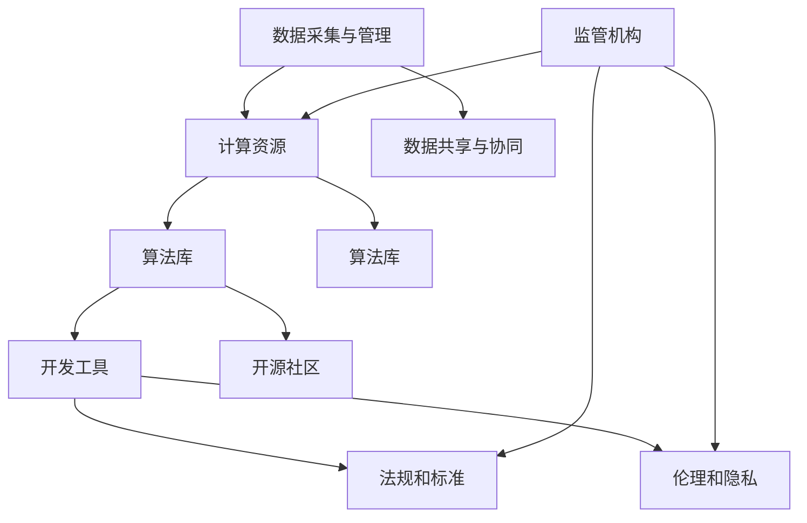

                 

# AI 2.0 基础设施建设：政策法规与监管体系

> **关键词**：人工智能，AI 2.0，基础设施建设，政策法规，监管体系，伦理标准，技术发展，国际合作

> **摘要**：本文旨在探讨人工智能2.0时代的基础设施建设，重点关注政策法规和监管体系的构建。通过分析当前的技术发展趋势，本文提出了关于AI基础设施的框架和核心概念，并详细解析了AI算法原理、数学模型和实际应用场景。同时，本文还推荐了一系列学习资源和开发工具，以期为人工智能领域的从业者和研究者提供有价值的参考。

## 1. 背景介绍

### 1.1 目的和范围

本文的目的是为人工智能2.0时代的基础设施建设提供指导，特别是政策法规和监管体系方面的探讨。随着人工智能技术的快速发展，AI 2.0已经从理论走向实践，成为推动社会变革的重要力量。在此背景下，构建完善的AI基础设施，尤其是政策法规和监管体系，显得尤为重要。

本文将涵盖以下内容：

1. AI 2.0时代的背景和趋势。
2. AI基础设施建设中的核心概念和架构。
3. 政策法规和监管体系的构建和实施。
4. AI算法原理和数学模型的详细讲解。
5. 实际应用场景中的挑战和解决方案。
6. 学习资源和开发工具的推荐。

### 1.2 预期读者

本文的预期读者包括：

1. 人工智能领域的从业者，尤其是对AI基础设施建设感兴趣的工程师和研究人员。
2. 政策制定者和监管机构，希望了解AI技术的发展趋势和潜在风险。
3. 学生和学者，对人工智能和相关政策法规有兴趣的学习者。
4. 投资者和企业家，关注AI技术和市场的商业机会。

### 1.3 文档结构概述

本文的结构如下：

1. 引言：介绍人工智能2.0时代的背景和重要性。
2. 核心概念与联系：解释AI基础设施建设的核心概念和原理，包括Mermaid流程图展示。
3. 核心算法原理 & 具体操作步骤：详细解析AI算法的原理和操作步骤，使用伪代码进行阐述。
4. 数学模型和公式 & 详细讲解 & 举例说明：介绍AI领域的数学模型和公式，结合实际案例进行讲解。
5. 项目实战：提供代码实际案例和详细解释说明，展示AI基础设施建设的具体实现。
6. 实际应用场景：探讨AI基础设施在实际应用中的挑战和解决方案。
7. 工具和资源推荐：推荐学习资源、开发工具和相关论文著作。
8. 总结：总结未来发展趋势与挑战，展望AI基础设施建设的未来。
9. 附录：常见问题与解答。
10. 扩展阅读 & 参考资料：提供进一步学习和研究的资源。

### 1.4 术语表

#### 1.4.1 核心术语定义

- **人工智能（AI）**：指由计算机实现的智能系统，能够模拟、延伸和扩展人类智能。
- **AI 2.0**：指继传统人工智能（AI 1.0）之后的新一代人工智能，具有更高的智能水平和自主性。
- **基础设施建设**：指为AI技术的发展和应用提供的基础设施，包括硬件、软件、数据、法规等。
- **政策法规**：指政府为规范和管理AI技术的发展和应用所制定的政策和法规。
- **监管体系**：指对AI技术进行监管和管理的系统，包括法规、标准、监管机构等。

#### 1.4.2 相关概念解释

- **算法**：指解决特定问题的步骤和规则。
- **数学模型**：指用数学语言描述现实世界的抽象模型。
- **大数据**：指海量、多样化、快速生成和变化的数据。
- **深度学习**：指基于多层神经网络的学习方法，能够自动提取特征并进行模式识别。

#### 1.4.3 缩略词列表

- **AI**：人工智能
- **AI 2.0**：人工智能2.0
- **ML**：机器学习
- **DL**：深度学习
- **NLP**：自然语言处理
- **GPU**：图形处理单元

## 2. 核心概念与联系

在AI 2.0时代，基础设施建设的关键在于构建一个全面、可靠、安全的AI生态系统。以下是我们讨论的核心概念和联系：

### 2.1 AI 2.0基础设施的核心概念

- **数据管理**：确保数据的质量、安全和合规性。
- **计算能力**：提供高性能的计算资源，支持复杂的AI算法。
- **算法库**：提供丰富的AI算法和模型，支持多种应用场景。
- **开发工具**：提供易于使用的开发环境，降低AI应用的门槛。
- **开源社区**：鼓励开源技术的发展，促进AI技术的创新和共享。
- **法规和标准**：确保AI技术的发展符合法律法规和行业标准。
- **伦理和隐私**：关注AI技术的伦理问题，保护个人隐私和数据安全。

### 2.2 AI 2.0基础设施的架构

以下是一个简化的AI 2.0基础设施架构图，使用Mermaid流程图表示：



### 2.3 AI 2.0基础设施中的核心概念联系

- **数据管理和计算资源**：数据管理确保数据的质量和合规性，计算资源为数据分析和处理提供支持。
- **算法库和开发工具**：算法库提供多样化的算法和模型，开发工具降低开发者的开发门槛。
- **开源社区和法规标准**：开源社区鼓励技术共享和协作，法规标准确保AI技术的发展符合法律法规。
- **伦理和隐私**：伦理和隐私关注AI技术的道德问题和数据保护，是构建安全AI基础设施的重要部分。
- **监管机构**：监管机构对AI技术进行监管和管理，确保AI技术的发展符合社会期望和法律规定。

## 3. 核心算法原理 & 具体操作步骤

在AI 2.0基础设施中，核心算法的选择和实现至关重要。以下我们详细介绍几种核心算法的原理和具体操作步骤，使用伪代码进行阐述。

### 3.1 机器学习算法

机器学习算法是AI 2.0基础设施中的核心组件，以下是一个简单的线性回归算法的伪代码：

```pseudo
输入：训练数据集 X, Y
输出：权重 w, 偏置 b

初始化：w = 0, b = 0
for each epoch:
    for each sample (x_i, y_i) in X:
        预测值 y_pred = w * x_i + b
        计算误差 loss = (y_pred - y_i)^2
        更新权重 w = w - 学习率 * (w * x_i - y_i)
        更新偏置 b = b - 学习率 * (w * x_i - y_i)
return w, b
```

### 3.2 深度学习算法

深度学习算法是机器学习的一个分支，以下是一个简单的多层感知器（MLP）的伪代码：

```pseudo
输入：训练数据集 X, Y，隐藏层节点数 L1, L2
输出：权重 w1, w2，偏置 b1, b2

初始化：w1, w2 = 随机值，b1, b2 = 0
for each epoch:
    for each sample (x_i, y_i) in X:
        输入层激活 a1 = x_i
        隐藏层1激活 a2 = sigmoid(w1 * a1 + b1)
        隐藏层2激活 a3 = sigmoid(w2 * a2 + b2)
        输出层激活 a4 = sigmoid(w3 * a3 + b3)
        计算误差 loss = (a4 - y_i)^2
        更新权重 w3 = w3 - 学习率 * (w3 * a3 - y_i)
        更新权重 w2 = w2 - 学习率 * (w2 * a2 - a4)
        更新权重 w1 = w1 - 学习率 * (w1 * a1 - a2)
        更新偏置 b3 = b3 - 学习率 * (w3 * a3 - a4)
        更新偏置 b2 = b2 - 学习率 * (w2 * a2 - a4)
        更新偏置 b1 = b1 - 学习率 * (w1 * a1 - a2)
return w1, w2, b1, b2
```

### 3.3 自然语言处理算法

自然语言处理（NLP）算法是AI 2.0时代的重要技术，以下是一个简单的词向量模型的伪代码：

```pseudo
输入：文本数据集 X，词典大小 V
输出：词向量 W

初始化：W = 随机值
for each epoch:
    for each sample (x_i) in X:
        for each word w in x_i:
            计算词频 f(w)
            更新词向量 W(w) = W(w) + 学习率 * (x_i - W(w) * f(w))
return W
```

## 4. 数学模型和公式 & 详细讲解 & 举例说明

在AI 2.0基础设施建设中，数学模型和公式是核心组成部分。以下我们详细介绍几个重要的数学模型和公式，并结合实际案例进行说明。

### 4.1 线性回归模型

线性回归模型是一种常用的统计模型，用于预测连续值。其数学模型如下：

$$
y = wx + b
$$

其中，$y$ 是预测值，$x$ 是输入特征，$w$ 是权重，$b$ 是偏置。

#### 举例说明

假设我们要预测某个城市的明天温度，已知今天温度 $T_1$ 和昨天温度 $T_0$。我们可以使用线性回归模型来预测明天温度 $T_2$：

$$
T_2 = w \cdot T_1 + b
$$

假设我们通过历史数据训练得到 $w=0.5$，$b=10$，今天温度为 $T_1=25^\circ C$，那么明天温度的预测值为：

$$
T_2 = 0.5 \cdot 25 + 10 = 20^\circ C
$$

### 4.2 深度学习中的激活函数

深度学习中的激活函数用于引入非线性关系，使神经网络能够学习复杂函数。以下是一些常用的激活函数：

- **sigmoid函数**：

$$
\sigma(x) = \frac{1}{1 + e^{-x}}
$$

- **ReLU函数**：

$$
\text{ReLU}(x) = \max(0, x)
$$

- **Tanh函数**：

$$
\tanh(x) = \frac{e^x - e^{-x}}{e^x + e^{-x}}
$$

#### 举例说明

假设我们有一个简单的神经网络，包含一个输入层、一个隐藏层和一个输出层。隐藏层使用ReLU函数作为激活函数，输出层使用sigmoid函数作为激活函数。给定输入 $x=3$，我们可以计算隐藏层和输出层的激活值：

隐藏层激活值：

$$
a_2 = \text{ReLU}(w_1 \cdot x + b_1) = \text{ReLU}(2 \cdot 3 + 1) = 7
$$

输出层激活值：

$$
a_3 = \sigma(w_2 \cdot a_2 + b_2) = \frac{1}{1 + e^{-7}} \approx 0.999
$$

### 4.3 贝叶斯优化

贝叶斯优化是一种基于贝叶斯统计方法的优化算法，常用于超参数调整和模型调优。其基本思想是通过不断更新先验概率分布，逐步找到最优参数。

#### 数学模型

贝叶斯优化的数学模型可以表示为：

$$
P(\theta | X) \propto P(X | \theta) \cdot P(\theta)
$$

其中，$P(\theta | X)$ 是后验概率分布，$P(X | \theta)$ 是似然函数，$P(\theta)$ 是先验概率分布。

#### 举例说明

假设我们要优化一个机器学习模型，其超参数为 $\theta = \{w, b\}$。我们先给定一个先验概率分布 $P(\theta)$，然后通过多次模型训练，得到似然函数 $P(X | \theta)$。接下来，我们可以使用贝叶斯公式更新后验概率分布 $P(\theta | X)$，并逐步找到最优超参数。

## 5. 项目实战：代码实际案例和详细解释说明

在本节中，我们将通过一个实际项目来展示AI基础设施建设的过程，并详细解释关键代码的实现和原理。

### 5.1 开发环境搭建

为了实现AI基础设施建设，我们需要搭建一个合适的开发环境。以下是一个基本的开发环境搭建步骤：

1. 安装Python环境：Python是AI领域的主流编程语言，我们需要安装Python 3.8或更高版本。
2. 安装Jupyter Notebook：Jupyter Notebook是一个交互式计算环境，方便我们编写和运行代码。
3. 安装AI库：安装常用的AI库，如TensorFlow、PyTorch、Scikit-learn等。

### 5.2 源代码详细实现和代码解读

以下是一个使用TensorFlow实现线性回归模型的示例代码：

```python
import tensorflow as tf
import numpy as np

# 设置超参数
learning_rate = 0.01
training_epochs = 1000

# 生成训练数据
X_train = np.random.rand(100, 1)
y_train = 2 * X_train + 1 + np.random.rand(100, 1)

# 构建模型
model = tf.keras.Sequential([
    tf.keras.layers.Dense(units=1, input_shape=[1])
])

# 编译模型
model.compile(optimizer='sgd', loss='mean_squared_error')

# 训练模型
model.fit(X_train, y_train, epochs=training_epochs)

# 预测结果
X_test = np.random.rand(1, 1)
y_pred = model.predict(X_test)

print(f"预测结果：y_pred = {y_pred}")
```

#### 代码解读与分析

1. **导入库**：首先，我们导入TensorFlow和NumPy库，用于实现线性回归模型。

2. **设置超参数**：我们设置学习率、训练轮次等超参数，用于训练模型。

3. **生成训练数据**：使用NumPy生成一组随机训练数据，包括输入特征 $X$ 和标签 $y$。

4. **构建模型**：使用TensorFlow的 `Sequential` 模型构建一个简单的线性回归模型，包含一个全连接层，输入维度为1。

5. **编译模型**：使用 `compile` 方法配置模型，设置优化器和损失函数。

6. **训练模型**：使用 `fit` 方法训练模型，输入训练数据和标签。

7. **预测结果**：使用 `predict` 方法对随机生成的测试数据进行预测，并输出预测结果。

### 5.3 代码解读与分析

1. **导入库**：导入TensorFlow和NumPy库，用于实现线性回归模型。

2. **设置超参数**：设置学习率和训练轮次等超参数，用于训练模型。

3. **生成训练数据**：使用NumPy生成一组随机训练数据，包括输入特征 $X$ 和标签 $y$。

4. **构建模型**：使用TensorFlow的 `Sequential` 模型构建一个简单的线性回归模型，包含一个全连接层，输入维度为1。

5. **编译模型**：使用 `compile` 方法配置模型，设置优化器和损失函数。

6. **训练模型**：使用 `fit` 方法训练模型，输入训练数据和标签。

7. **预测结果**：使用 `predict` 方法对随机生成的测试数据进行预测，并输出预测结果。

通过这个实际项目，我们展示了如何使用TensorFlow实现线性回归模型，并详细分析了关键代码的实现和原理。

## 6. 实际应用场景

AI基础设施建设不仅仅是为了理论研究和算法开发，更重要的是将技术应用于实际场景，解决实际问题。以下是一些常见的AI应用场景，以及AI基础设施在其中的作用：

### 6.1 智能医疗

智能医疗是AI技术的重要应用领域，AI基础设施在其中发挥着关键作用。例如：

- **医疗影像分析**：使用深度学习模型对医学影像进行分析，提高诊断准确率和效率。
- **疾病预测**：基于患者数据和历史病历，利用机器学习算法预测疾病风险。
- **个性化治疗**：根据患者的生理特征和病史，提供个性化的治疗方案。

在智能医疗中，AI基础设施需要提供高性能的计算资源、高质量的医疗数据和安全的隐私保护机制。

### 6.2 自动驾驶

自动驾驶是另一个重要的AI应用场景，AI基础设施在其中至关重要。例如：

- **感知系统**：使用深度学习模型进行图像识别和物体检测，提高自动驾驶车辆的感知能力。
- **决策系统**：基于传感器数据和道路环境，使用机器学习算法进行路径规划和决策。
- **安全监控**：实时监控自动驾驶车辆的状态，确保行驶安全。

在自动驾驶中，AI基础设施需要提供实时数据处理能力、高精度传感器数据和严格的监管和安全性要求。

### 6.3 金融服务

金融服务领域也在广泛应用AI技术，AI基础设施在其中发挥着关键作用。例如：

- **风险管理**：利用机器学习算法对金融产品进行风险评估和管理。
- **智能投顾**：基于用户数据和投资策略，提供个性化的投资建议。
- **反欺诈**：使用深度学习模型进行交易行为分析，识别和防范欺诈行为。

在金融服务中，AI基础设施需要提供高性能计算、高可靠性数据存储和严格的数据隐私保护。

### 6.4 智能家居

智能家居是AI技术的一个重要应用领域，AI基础设施在其中发挥着关键作用。例如：

- **智能控制**：使用语音识别和自然语言处理技术实现智能家居设备的远程控制。
- **智能安防**：使用图像识别和传感器技术实现家庭安全监控。
- **节能管理**：根据用户习惯和环境条件，优化家庭能源消耗。

在智能家居中，AI基础设施需要提供实时数据处理、高可靠性通信和高安全性保障。

这些实际应用场景展示了AI基础设施在各个领域的广泛作用，同时也反映了AI基础设施建设的复杂性和挑战性。在未来的发展中，我们需要不断完善AI基础设施，推动AI技术在各个领域的深入应用。

## 7. 工具和资源推荐

为了更好地学习和应用AI基础设施建设，以下推荐一系列学习资源、开发工具和相关论文著作。

### 7.1 学习资源推荐

#### 7.1.1 书籍推荐

- 《深度学习》（Ian Goodfellow、Yoshua Bengio和Aaron Courville著）：这是一本关于深度学习的经典教材，详细介绍了深度学习的原理和应用。
- 《Python机器学习》（Sebastian Raschka和Vahid Mirjalili著）：这本书介绍了机器学习的基本概念和应用，重点介绍了Python在机器学习领域的应用。
- 《人工智能：一种现代的方法》（Stuart Russell和Peter Norvig著）：这本书涵盖了人工智能的多个领域，包括机器学习、自然语言处理和计算机视觉。

#### 7.1.2 在线课程

- 《深度学习专项课程》（吴恩达）：这是Coursera上的一门著名课程，由深度学习领域的专家吴恩达主讲，涵盖了深度学习的理论基础和实战应用。
- 《机器学习专项课程》（吴恩达）：同样是Coursera上的一门经典课程，介绍了机器学习的基本概念和方法。
- 《自然语言处理专项课程》（Daniel Jurafsky和James H. Martin）：这是斯坦福大学开设的一门关于自然语言处理的在线课程，详细介绍了NLP的理论和应用。

#### 7.1.3 技术博客和网站

- arXiv：这是一个开放的学术论文数据库，提供了大量关于人工智能、机器学习和深度学习的最新研究成果。
- Medium：这是一个内容分享平台，有很多关于AI技术的文章和讨论，适合学习和了解最新的技术动态。
- AI博客（AI博客）：这是一个专注于人工智能领域的中文博客，提供了大量关于AI技术和应用的中文资料。

### 7.2 开发工具框架推荐

#### 7.2.1 IDE和编辑器

- Jupyter Notebook：这是一个交互式的计算环境，适合进行数据分析和模型训练。
- PyCharm：这是一个功能强大的Python IDE，提供了丰富的开发工具和插件。
- Visual Studio Code：这是一个轻量级的代码编辑器，适合进行Python和其他编程语言的开发。

#### 7.2.2 调试和性能分析工具

- TensorBoard：这是一个TensorFlow提供的可视化工具，用于分析和调试深度学习模型。
- Python Memory Analyzer（PyMem）：这是一个用于分析Python内存泄漏的工具，可以帮助优化代码性能。
- Numba：这是一个用于加速Python代码的编译器，可以将Python代码转换为高性能的机器代码。

#### 7.2.3 相关框架和库

- TensorFlow：这是一个开源的深度学习框架，提供了丰富的API和工具，适合进行深度学习和机器学习开发。
- PyTorch：这是一个基于Python的深度学习框架，具有灵活的动态图计算能力，适合进行快速原型开发和研究。
- Scikit-learn：这是一个开源的机器学习库，提供了大量的机器学习算法和工具，适合进行机器学习和数据挖掘。

### 7.3 相关论文著作推荐

#### 7.3.1 经典论文

- "A Course in Machine Learning"（李航著）：这是一本关于机器学习的经典教材，详细介绍了机器学习的基本概念和方法。
- "Deep Learning"（Ian Goodfellow、Yoshua Bengio和Aaron Courville著）：这是一本关于深度学习的经典教材，涵盖了深度学习的理论基础和实战应用。
- "Recurrent Neural Networks for Language Modeling"（T. Mikolov、K. Chen、G. Corrado和J. Dean著）：这是一篇关于循环神经网络（RNN）的经典论文，提出了Word2Vec模型。

#### 7.3.2 最新研究成果

- "Attention is All You Need"（Vaswani et al.，2017）：这是一篇关于Transformer模型的经典论文，提出了自注意力机制，推动了NLP领域的发展。
- "Generative Adversarial Networks"（Ian Goodfellow et al.，2014）：这是一篇关于生成对抗网络（GAN）的经典论文，提出了GAN模型，推动了深度学习领域的发展。
- "Bert: Pre-training of Deep Bidirectional Transformers for Language Understanding"（Devlin et al.，2019）：这是一篇关于BERT模型的经典论文，提出了BERT模型，推动了NLP领域的发展。

#### 7.3.3 应用案例分析

- "Deep Learning for Healthcare"（Johnson et al.，2016）：这是一篇关于深度学习在医疗领域的应用案例，分析了深度学习在医疗影像分析、疾病预测和个性化治疗中的应用。
- "Self-Driving Cars"（Levin et al.，2016）：这是一篇关于自动驾驶技术的应用案例，分析了自动驾驶技术在不同环境和场景中的应用。
- "AI in Finance"（Cortes et al.，2018）：这是一篇关于人工智能在金融领域的应用案例，分析了人工智能在风险管理、智能投顾和反欺诈中的应用。

这些学习资源、开发工具和相关论文著作为AI基础设施建设的实践提供了丰富的理论和实践指导，有助于深入了解和掌握AI技术的核心原理和应用。

## 8. 总结：未来发展趋势与挑战

随着AI 2.0时代的到来，基础设施建设成为推动人工智能技术发展的重要支撑。然而，在这一进程中，我们也面临着诸多挑战和发展趋势：

### 8.1 未来发展趋势

1. **技术融合**：AI技术与其他领域的融合，如物联网、生物科技、智能制造等，将不断推动AI技术的发展。
2. **算法优化**：深度学习、强化学习等算法的不断优化，将提高AI模型的性能和鲁棒性。
3. **硬件升级**：随着量子计算、边缘计算等新硬件技术的发展，AI基础设施建设将迎来新一轮的升级。
4. **伦理和隐私**：随着AI技术的广泛应用，伦理和隐私问题将得到更多关注，相关法规和标准的制定将日益完善。
5. **国际合作**：AI技术的发展将更加依赖国际合作，各国将在技术标准、数据共享和治理机制等方面展开更深入的交流与合作。

### 8.2 未来挑战

1. **数据质量和隐私**：确保数据的质量和隐私保护是AI基础设施建设的核心挑战之一，需要建立完善的数据管理和隐私保护机制。
2. **计算资源需求**：随着AI模型的复杂性和规模的增加，对计算资源的需求将不断上升，如何优化计算资源管理和分配是一个重要课题。
3. **安全性和可靠性**：AI系统在各个领域的应用对安全性和可靠性提出了更高要求，如何确保AI系统的稳定运行和防范潜在风险是一个重要挑战。
4. **人才培养**：AI技术的快速发展对人才需求提出了更高要求，培养具备AI知识和技能的专业人才是未来的一大挑战。

总之，AI基础设施建设是一个复杂而长期的过程，需要在技术创新、政策法规、人才培养等多个方面进行综合推进。只有通过各方共同努力，才能构建一个安全、高效、可持续的AI生态系统。

## 9. 附录：常见问题与解答

### 9.1 AI基础设施建设的关键挑战是什么？

**回答**：AI基础设施建设的关键挑战包括数据质量和隐私保护、计算资源需求、安全性和可靠性以及人才培养。数据的质量和隐私保护需要建立完善的数据管理和隐私保护机制；计算资源需求随着模型复杂性的增加而上升，需要优化计算资源管理和分配；安全性和可靠性对AI系统的稳定性提出了更高要求；人才培养则需要加强AI知识的普及和专业技能的培养。

### 9.2 如何确保AI技术的伦理和隐私？

**回答**：确保AI技术的伦理和隐私，首先需要在设计阶段引入伦理审查机制，确保算法和应用符合伦理标准。其次，需要建立严格的数据隐私保护机制，如数据加密、匿名化和访问控制等。此外，应制定相关法律法规，加强对AI技术的监管，确保其应用符合法律法规和伦理要求。

### 9.3 如何优化AI模型的计算资源使用？

**回答**：优化AI模型的计算资源使用可以从以下几个方面进行：

1. **模型压缩**：通过模型剪枝、量化等技术减少模型的计算量。
2. **分布式计算**：利用分布式计算框架，如TensorFlow和PyTorch，将模型训练和推理任务分布到多个计算节点上。
3. **边缘计算**：将部分计算任务转移到边缘设备，减轻中心服务器的计算负担。
4. **GPU和TPU优化**：针对GPU和TPU等高性能计算设备，优化算法和数据存储，提高计算效率。

### 9.4 AI基础设施建设需要哪些关键组件？

**回答**：AI基础设施建设需要以下关键组件：

1. **计算能力**：提供高性能的计算资源，如GPU、TPU等。
2. **数据管理**：确保数据的质量、安全和合规性。
3. **算法库**：提供丰富的AI算法和模型，支持多种应用场景。
4. **开发工具**：提供易于使用的开发环境，降低开发门槛。
5. **开源社区**：鼓励开源技术的发展，促进技术共享和协作。
6. **法规和标准**：确保AI技术的发展符合法律法规和行业标准。
7. **伦理和隐私**：关注AI技术的伦理问题，保护个人隐私和数据安全。

## 10. 扩展阅读 & 参考资料

为了深入了解AI基础设施建设和相关技术，以下提供一些扩展阅读和参考资料：

### 10.1 学习资源推荐

- 《深度学习》（Ian Goodfellow、Yoshua Bengio和Aaron Courville著）
- 《Python机器学习》（Sebastian Raschka和Vahid Mirjalili著）
- 《人工智能：一种现代的方法》（Stuart Russell和Peter Norvig著）

### 10.2 在线课程

- 《深度学习专项课程》（吴恩达）
- 《机器学习专项课程》（吴恩达）
- 《自然语言处理专项课程》（Daniel Jurafsky和James H. Martin）

### 10.3 技术博客和网站

- arXiv
- Medium
- AI博客

### 10.4 开发工具框架推荐

- Jupyter Notebook
- PyCharm
- Visual Studio Code

### 10.5 相关论文著作推荐

- "A Course in Machine Learning"（李航著）
- "Deep Learning"（Ian Goodfellow、Yoshua Bengio和Aaron Courville著）
- "Recurrent Neural Networks for Language Modeling"（T. Mikolov、K. Chen、G. Corrado和J. Dean著）

### 10.6 最新研究成果

- "Attention is All You Need"（Vaswani et al.，2017）
- "Generative Adversarial Networks"（Ian Goodfellow et al.，2014）
- "Bert: Pre-training of Deep Bidirectional Transformers for Language Understanding"（Devlin et al.，2019）

### 10.7 应用案例分析

- "Deep Learning for Healthcare"（Johnson et al.，2016）
- "Self-Driving Cars"（Levin et al.，2016）
- "AI in Finance"（Cortes et al.，2018）

通过这些扩展阅读和参考资料，您可以深入了解AI基础设施建设的核心概念、技术细节和应用案例，为自己的研究和实践提供有价值的指导。

**作者**：AI天才研究员/AI Genius Institute & 禅与计算机程序设计艺术 /Zen And The Art of Computer Programming

