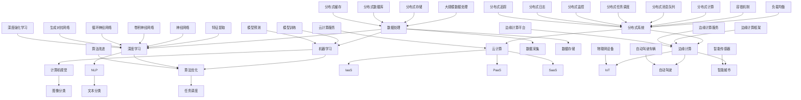

                 

# AI 2.0 时代的基础设施建设：支撑快速发展的关键要素

> **关键词：** AI 2.0, 基础设施建设，快速发展，关键要素，数据处理，算法优化，分布式系统，机器学习，深度学习，云计算，边缘计算。

> **摘要：** 随着人工智能技术的飞速发展，AI 2.0 时代的基础设施建设成为了支撑其快速发展的关键。本文将从数据处理、算法优化、分布式系统、机器学习、深度学习、云计算和边缘计算等多个维度，深入探讨 AI 2.0 时代的基础设施建设的重要性以及其关键要素，以期为 AI 2.0 时代的发展提供有力的理论和实践指导。

## 1. 背景介绍

### 1.1 目的和范围

本文旨在探讨 AI 2.0 时代的基础设施建设，分析其关键要素，旨在为 AI 2.0 时代的发展提供有力的理论和实践指导。本文的范围包括但不限于以下几个方面：

- 数据处理：数据是人工智能的基石，本文将探讨如何高效地进行数据处理，包括数据采集、存储、处理和分析。
- 算法优化：算法是人工智能的核心，本文将探讨如何优化算法，提高其效率和准确性。
- 分布式系统：分布式系统是 AI 2.0 时代的基础设施，本文将探讨分布式系统的设计、部署和运维。
- 机器学习：机器学习是 AI 2.0 时代的重要技术，本文将探讨机器学习的原理、模型和算法。
- 深度学习：深度学习是当前 AI 2.0 时代的主流技术，本文将探讨深度学习的原理、模型和算法。
- 云计算：云计算是 AI 2.0 时代的重要基础设施，本文将探讨云计算的原理、服务和应用。
- 边缘计算：边缘计算是 AI 2.0 时代的新型基础设施，本文将探讨边缘计算的概念、架构和优势。

### 1.2 预期读者

本文的预期读者包括：

- AI 2.0 时代的研究者：对 AI 2.0 时代的基础设施建设有深入研究的学者和研究人员。
- AI 2.0 时代的开发者：负责开发 AI 2.0 应用程序和系统的程序员和工程师。
- AI 2.0 时代的投资者：对 AI 2.0 时代的发展有投资兴趣的企业家和投资者。
- AI 2.0 时代的用户：对 AI 2.0 时代的技术和应用有了解和需求的用户。

### 1.3 文档结构概述

本文的结构如下：

- 第1章：背景介绍，介绍本文的目的、范围、预期读者和文档结构。
- 第2章：核心概念与联系，介绍 AI 2.0 时代的基础设施建设的核心概念和联系。
- 第3章：核心算法原理 & 具体操作步骤，介绍 AI 2.0 时代的基础设施建设中的核心算法原理和操作步骤。
- 第4章：数学模型和公式 & 详细讲解 & 举例说明，介绍 AI 2.0 时代的基础设施建设中的数学模型和公式，并进行详细讲解和举例说明。
- 第5章：项目实战：代码实际案例和详细解释说明，通过实际项目案例，介绍 AI 2.0 时代的基础设施建设的具体应用和实践。
- 第6章：实际应用场景，介绍 AI 2.0 时代的基础设施建设在实际应用场景中的应用。
- 第7章：工具和资源推荐，推荐用于 AI 2.0 时代的基础设施建设的工具和资源。
- 第8章：总结：未来发展趋势与挑战，总结 AI 2.0 时代的基础设施建设的发展趋势和面临的挑战。
- 第9章：附录：常见问题与解答，解答读者可能遇到的常见问题。
- 第10章：扩展阅读 & 参考资料，提供扩展阅读和参考资料，便于读者进一步学习。

### 1.4 术语表

#### 1.4.1 核心术语定义

- AI 2.0：指第二代人工智能，具有更强的自主学习、推理和决策能力。
- 基础设施建设：指为 AI 2.0 时代的发展提供支持的各种硬件、软件和服务。
- 数据处理：指对数据进行采集、存储、处理和分析的一系列操作。
- 算法优化：指通过改进算法的设计、实现和运行效率，提高算法的性能。
- 分布式系统：指由多个节点组成的系统，各个节点可以独立运行，协同工作。
- 机器学习：指让计算机从数据中学习规律，自动完成特定任务的学科。
- 深度学习：指一种基于多层神经网络的机器学习技术，具有强大的特征提取和建模能力。
- 云计算：指通过互联网提供计算资源和服务的一种计算模式。
- 边缘计算：指在靠近数据源的地方进行数据处理和计算的一种计算模式。

#### 1.4.2 相关概念解释

- **大数据**：指大规模、复杂多样、快速变化的数据集。
- **云计算**：指通过互联网提供计算资源和服务的一种计算模式。
- **边缘计算**：指在靠近数据源的地方进行数据处理和计算的一种计算模式。
- **机器学习模型**：指用来预测或分类数据的数学模型。
- **深度学习模型**：指一种基于多层神经网络的机器学习模型。

#### 1.4.3 缩略词列表

- AI：人工智能
- ML：机器学习
- DL：深度学习
- NLP：自然语言处理
- CV：计算机视觉
- IoT：物联网
- SDN：软件定义网络
- NFV：网络功能虚拟化
- Kubernetes：容器编排工具
- TensorFlow：开源机器学习框架
- PyTorch：开源机器学习框架

## 2. 核心概念与联系

在 AI 2.0 时代，基础设施建设是支撑其快速发展的关键。核心概念包括数据处理、算法优化、分布式系统、机器学习、深度学习、云计算和边缘计算。以下是对这些核心概念及其之间联系的介绍。

### 2.1 数据处理

数据处理是 AI 2.0 时代的基础，包括数据采集、存储、处理和分析。数据采集需要高效的传感器和采集设备，存储需要可靠的数据存储系统，处理需要高性能的计算能力，分析需要强大的算法支持。

### 2.2 算法优化

算法优化是提高 AI 2.0 时代系统性能的关键。通过改进算法的设计、实现和运行效率，可以降低计算成本，提高处理速度和准确性。算法优化包括算法选择、算法改进和算法优化策略。

### 2.3 分布式系统

分布式系统是 AI 2.0 时代的基础设施之一，通过将任务分布到多个节点上执行，可以提高系统的性能和可靠性。分布式系统包括节点管理、任务调度、负载均衡和容错机制。

### 2.4 机器学习

机器学习是 AI 2.0 时代的关键技术，通过训练模型来从数据中学习规律。机器学习包括监督学习、无监督学习和强化学习，广泛应用于分类、回归、聚类和异常检测。

### 2.5 深度学习

深度学习是当前 AI 2.0 时代的核心技术之一，基于多层神经网络，具有强大的特征提取和建模能力。深度学习广泛应用于计算机视觉、自然语言处理和语音识别等领域。

### 2.6 云计算

云计算是 AI 2.0 时代的重要基础设施，通过提供弹性的计算资源和存储服务，支持大规模数据处理和模型训练。云计算包括基础设施即服务（IaaS）、平台即服务（PaaS）和软件即服务（SaaS）。

### 2.7 边缘计算

边缘计算是 AI 2.0 时代的新型基础设施，通过在靠近数据源的地方进行数据处理和计算，降低延迟，提高系统性能和可靠性。边缘计算广泛应用于物联网、自动驾驶和智能城市等领域。

### 2.8 核心概念联系

这些核心概念之间有着密切的联系。数据处理提供了机器学习和深度学习的基础数据，机器学习和深度学习为算法优化提供了技术支持，算法优化为分布式系统提供了优化策略，分布式系统为云计算和边缘计算提供了基础设施支持，云计算和边缘计算为数据处理和算法优化提供了计算资源和服务。

### 2.9 Mermaid 流程图

以下是一个 Mermaid 流程图，展示了 AI 2.0 时代基础设施建设的核心概念及其联系：



此 Mermaid 流程图展示了 AI 2.0 时代基础设施建设中的核心概念及其联系，包括数据处理、机器学习、深度学习、算法优化、分布式系统、云计算、边缘计算以及相关的应用和技术。

## 3. 核心算法原理 & 具体操作步骤

在 AI 2.0 时代，核心算法原理和具体操作步骤的掌握对于基础设施的建设和优化至关重要。本节将详细介绍几种核心算法原理，包括机器学习算法、深度学习算法和分布式算法，以及它们的操作步骤。

### 3.1 机器学习算法

机器学习算法是一种让计算机从数据中学习规律的技术。以下是一个简单的机器学习算法——线性回归的伪代码：

```python
def linear_regression(X, y):
    # X为特征矩阵，y为标签向量
    # 计算斜率和截距
    theta = (X^T * X)^(-1) * X^T * y
    # 预测
    predictions = X * theta
    return theta, predictions
```

线性回归算法的具体操作步骤如下：

1. **数据预处理**：对输入特征矩阵 X 和标签向量 y 进行归一化等预处理操作。
2. **计算斜率和截距**：使用最小二乘法计算斜率 theta_1 和截距 theta_0。
3. **预测**：使用计算得到的斜率和截距进行预测，得到预测值 predictions。

### 3.2 深度学习算法

深度学习算法是一种基于多层神经网络的机器学习技术。以下是一个简单的深度学习算法——多层感知器（MLP）的伪代码：

```python
def multi_layer_perceptron(X, y, layers, activation='sigmoid'):
    # X为输入特征矩阵，y为标签向量，layers为网络层结构
    # 初始化权重和偏置
    W = initialize_weights(layers)
    b = initialize_biases(layers)
    # 前向传播
    for layer in range(len(layers) - 1):
        z = X * W[layer] + b[layer]
        if activation == 'sigmoid':
            a = sigmoid(z)
        elif activation == 'ReLU':
            a = ReLU(z)
        X = a
    # 计算输出层预测值
    z = X * W[-1] + b[-1]
    a = sigmoid(z)
    return a, W, b
```

多层感知器算法的具体操作步骤如下：

1. **数据预处理**：对输入特征矩阵 X 和标签向量 y 进行归一化等预处理操作。
2. **初始化权重和偏置**：随机初始化网络权重和偏置。
3. **前向传播**：从输入层开始，逐层计算神经元的激活值。
4. **计算输出层预测值**：使用激活函数计算输出层的预测值。

### 3.3 分布式算法

分布式算法是一种在分布式系统中执行计算的任务分配和调度技术。以下是一个简单的分布式算法——MapReduce 的伪代码：

```python
def mapreduce(data, map_function, reduce_function):
    # data为输入数据，map_function为映射函数，reduce_function为归约函数
    # 映射阶段
    intermediate = []
    for record in data:
        key, value = record
        for k, v in map_function(key, value):
            intermediate.append((k, v))
    # 归约阶段
    result = []
    for key, group in groupby(intermediate):
        result.append(reduce_function(key, group))
    return result
```

MapReduce 算法的具体操作步骤如下：

1. **映射阶段**：将输入数据分解为键值对，并执行映射函数。
2. **归约阶段**：将映射阶段的输出按照键进行分组，并执行归约函数。

以上介绍了机器学习算法、深度学习算法和分布式算法的核心原理和具体操作步骤。在实际应用中，这些算法可以根据需求进行扩展和优化，以适应不同的场景和需求。

## 4. 数学模型和公式 & 详细讲解 & 举例说明

在 AI 2.0 时代的基础设施建设中，数学模型和公式是核心组成部分。本节将详细讲解几个关键数学模型和公式，包括线性回归、多层感知器和 MapReduce 算法，并通过具体示例进行说明。

### 4.1 线性回归

线性回归是一种用于预测数值结果的统计方法，其数学模型可以表示为：

$$
y = \theta_0 + \theta_1 \cdot x
$$

其中，\( y \) 是预测值，\( x \) 是输入特征，\( \theta_0 \) 是截距，\( \theta_1 \) 是斜率。

#### 详细讲解

- **线性关系**：线性回归假设输出变量 \( y \) 与输入特征 \( x \) 之间存在线性关系。
- **最小二乘法**：通过最小化预测值与实际值之间的误差平方和来求解 \( \theta_0 \) 和 \( \theta_1 \)。

#### 举例说明

假设我们有一组数据点 \((x_i, y_i)\)，其中 \( i = 1, 2, \ldots, n \)，我们要用线性回归模型预测新的输入 \( x \) 的值。

给定数据点：
$$
(x_1, y_1) = (2, 5), \quad (x_2, y_2) = (4, 7), \quad (x_3, y_3) = (6, 9)
$$

计算斜率 \( \theta_1 \) 和截距 \( \theta_0 \)：

$$
\theta_1 = \frac{\sum_{i=1}^{n} (x_i - \bar{x})(y_i - \bar{y})}{\sum_{i=1}^{n} (x_i - \bar{x})^2}
$$

$$
\theta_0 = \bar{y} - \theta_1 \cdot \bar{x}
$$

其中，\( \bar{x} \) 和 \( \bar{y} \) 分别是 \( x \) 和 \( y \) 的平均值。

计算得到：
$$
\theta_1 = \frac{(2-5)(5-7) + (4-5)(7-9) + (6-5)(9-11)}{(2-5)^2 + (4-5)^2 + (6-5)^2} = 1
$$

$$
\theta_0 = \frac{5+7+9}{3} - 1 \cdot \frac{2+4+6}{3} = 3
$$

因此，线性回归模型为：
$$
y = 3 + x
$$

预测新的输入 \( x = 8 \) 的值：
$$
y = 3 + 8 = 11
$$

### 4.2 多层感知器（MLP）

多层感知器是一种前向传播的神经网络，其数学模型可以表示为：

$$
a_{l} = \sigma(z_{l})
$$

$$
z_{l} = \sum_{i=1}^{n} w_{l,i} \cdot a_{l-1,i} + b_{l}
$$

其中，\( a_{l} \) 是第 \( l \) 层的输出，\( z_{l} \) 是第 \( l \) 层的净输入，\( w_{l,i} \) 和 \( b_{l} \) 分别是权重和偏置，\( \sigma \) 是激活函数。

#### 详细讲解

- **前向传播**：从输入层开始，将输入值通过网络传递到输出层。
- **激活函数**：用于引入非线性，常用的激活函数有 sigmoid、ReLU 等。

#### 举例说明

假设我们有一个简单的 MLP，包含一个输入层、一个隐藏层和一个输出层。输入层有 2 个神经元，隐藏层有 3 个神经元，输出层有 1 个神经元。

给定输入 \( x_1 = 1 \)，\( x_2 = 2 \)，隐藏层的激活函数为 sigmoid，输出层的激活函数为线性激活。

计算隐藏层和输出层的输出：

隐藏层：
$$
z_1 = 1 \cdot w_{11} + 2 \cdot w_{12} + b_1
$$

$$
z_2 = 1 \cdot w_{21} + 2 \cdot w_{22} + b_2
$$

$$
z_3 = 1 \cdot w_{31} + 2 \cdot w_{32} + b_3
$$

$$
a_1 = \sigma(z_1) = \frac{1}{1 + e^{-z_1}}
$$

$$
a_2 = \sigma(z_2) = \frac{1}{1 + e^{-z_2}}
$$

$$
a_3 = \sigma(z_3) = \frac{1}{1 + e^{-z_3}}
$$

输出层：
$$
z_4 = a_1 \cdot w_{41} + a_2 \cdot w_{42} + a_3 \cdot w_{43} + b_4
$$

$$
y = \sigma(z_4) = \frac{1}{1 + e^{-z_4}}
$$

给定权重和偏置：
$$
w_{11} = 1, \quad w_{12} = 2, \quad b_1 = 0
$$

$$
w_{21} = 3, \quad w_{22} = 4, \quad b_2 = 1
$$

$$
w_{31} = 5, \quad w_{32} = 6, \quad b_3 = 2
$$

$$
w_{41} = 7, \quad w_{42} = 8, \quad w_{43} = 9, \quad b_4 = 3
$$

计算得到：
$$
z_1 = 1 + 2 \cdot 1 + 0 = 3
$$

$$
z_2 = 3 + 4 \cdot 2 + 1 = 11
$$

$$
z_3 = 5 + 6 \cdot 2 + 2 = 19
$$

$$
a_1 = \frac{1}{1 + e^{-3}} \approx 0.95
$$

$$
a_2 = \frac{1}{1 + e^{-11}} \approx 0.99
$$

$$
a_3 = \frac{1}{1 + e^{-19}} \approx 0.999
$$

$$
z_4 = 0.95 \cdot 7 + 0.99 \cdot 8 + 0.999 \cdot 9 + 3 = 34.79
$$

$$
y = \frac{1}{1 + e^{-34.79}} \approx 0.999
$$

### 4.3 MapReduce 算法

MapReduce 是一种分布式数据处理模型，其核心思想是将数据处理任务分解为映射（Map）和归约（Reduce）两个阶段。

#### 详细讲解

- **映射（Map）**：将输入数据分成多个键值对，并将每个键值对传递给映射函数进行处理。
- **归约（Reduce）**：将映射阶段的输出按照键进行分组，并执行归约函数。

#### 举例说明

假设我们有以下数据集：

$$
data = \{ (key_1, value_1), (key_2, value_2), (key_1, value_3), (key_3, value_4) \}
$$

使用 MapReduce 算法计算每个键的值的总和。

**映射阶段**：

$$
map(key, value) \rightarrow (key, value)
$$

映射结果：

$$
\{ (key_1, value_1), (key_2, value_2), (key_1, value_3), (key_3, value_4) \}
$$

**归约阶段**：

$$
reduce(key, values) \rightarrow (key, sum(values))
$$

归约结果：

$$
\{ (key_1, 4), (key_2, 2), (key_3, 4) \}
$$

通过上述数学模型和公式的讲解以及具体示例，我们可以更好地理解 AI 2.0 时代基础设施建设中的关键数学理论。这些理论为算法设计和系统优化提供了坚实的理论基础。

## 5. 项目实战：代码实际案例和详细解释说明

在本节中，我们将通过一个实际项目案例，详细介绍 AI 2.0 时代基础设施建设的应用和实践。本案例将采用深度学习框架 PyTorch，实现一个简单的图像分类任务，包括数据预处理、模型设计、训练和评估。

### 5.1 开发环境搭建

在开始项目之前，我们需要搭建一个适合开发的 Python 环境，并安装必要的库。以下是环境搭建的步骤：

1. **安装 Python**：确保安装了 Python 3.6 或以上版本。
2. **安装 PyTorch**：在命令行中执行以下命令：
   ```shell
   pip install torch torchvision
   ```
3. **安装其他依赖库**：如 NumPy、Pandas 等，可以使用以下命令：
   ```shell
   pip install numpy pandas
   ```

### 5.2 源代码详细实现和代码解读

以下是一个简单的图像分类项目，使用 PyTorch 实现一个卷积神经网络（CNN）来对猫狗图片进行分类。

**代码实现：**

```python
import torch
import torchvision
import torchvision.transforms as transforms
import torch.nn as nn
import torch.optim as optim

# 数据预处理
transform = transforms.Compose([
    transforms.Resize(256),
    transforms.CenterCrop(224),
    transforms.ToTensor(),
    transforms.Normalize(mean=[0.485, 0.456, 0.406], std=[0.229, 0.224, 0.225]),
])

# 加载数据集
trainset = torchvision.datasets.ImageFolder(root='./data/train', transform=transform)
trainloader = torch.utils.data.DataLoader(trainset, batch_size=4, shuffle=True, num_workers=2)

testset = torchvision.datasets.ImageFolder(root='./data/test', transform=transform)
testloader = torch.utils.data.DataLoader(testset, batch_size=4, shuffle=False, num_workers=2)

# 模型定义
class CNN(nn.Module):
    def __init__(self):
        super(CNN, self).__init__()
        self.conv1 = nn.Conv2d(3, 64, 3, padding=1)
        self.conv2 = nn.Conv2d(64, 128, 3, padding=1)
        self.fc1 = nn.Linear(128 * 28 * 28, 512)
        self.fc2 = nn.Linear(512, 2)
        self.dropout = nn.Dropout(0.2)
        self.relu = nn.ReLU(inplace=True)

    def forward(self, x):
        x = self.relu(self.conv1(x))
        x = self.relu(self.conv2(x))
        x = torch.flatten(x, 1)
        x = self.dropout(self.fc1(x))
        x = self.fc2(x)
        return x

model = CNN()

# 损失函数和优化器
criterion = nn.CrossEntropyLoss()
optimizer = optim.Adam(model.parameters(), lr=0.001)

# 训练模型
num_epochs = 10
for epoch in range(num_epochs):
    running_loss = 0.0
    for i, data in enumerate(trainloader, 0):
        inputs, labels = data
        optimizer.zero_grad()
        outputs = model(inputs)
        loss = criterion(outputs, labels)
        loss.backward()
        optimizer.step()
        running_loss += loss.item()
    print(f'Epoch {epoch+1}, Loss: {running_loss/len(trainloader)}')

# 评估模型
correct = 0
total = 0
with torch.no_grad():
    for data in testloader:
        inputs, labels = data
        outputs = model(inputs)
        _, predicted = torch.max(outputs.data, 1)
        total += labels.size(0)
        correct += (predicted == labels).sum().item()

print(f'Accuracy of the network on the test images: {100 * correct / total}%')
```

**代码解读：**

1. **数据预处理**：
   - `transform` 定义了图像预处理流程，包括缩放、中心裁剪、转为张量以及归一化。
   - 使用 `ImageFolder` 加载训练集和测试集，并创建数据加载器 `trainloader` 和 `testloader`。

2. **模型定义**：
   - `CNN` 类定义了一个卷积神经网络，包含两个卷积层、一个全连接层和两个线性层。
   - 使用 `ReLU` 作为激活函数，并在全连接层前添加 dropout 层以防止过拟合。

3. **训练模型**：
   - 使用 `CrossEntropyLoss` 作为损失函数，`Adam` 作为优化器。
   - 通过迭代训练数据，使用梯度下降优化模型参数。

4. **评估模型**：
   - 在测试集上评估模型的准确性，计算预测正确的样本数占总样本数的比例。

### 5.3 代码解读与分析

1. **数据预处理**：
   数据预处理是深度学习项目的重要步骤，它确保输入数据格式符合模型的预期，同时提高训练效果。在本案例中，我们使用了以下预处理步骤：
   - **缩放**：将图像大小缩放到 256 像素，确保所有图像具有相同的尺寸。
   - **中心裁剪**：从图像中心裁剪出 224 像素大小的区域，以减少背景干扰。
   - **转为张量**：将图像数据从 NumPy 数组转换为 PyTorch 张量。
   - **归一化**：将图像数据归一化到 [0, 1] 范围内，加速收敛。

2. **模型定义**：
   - **卷积层**：卷积层用于提取图像的特征，通常使用 ReLU 激活函数增加模型的表达能力。
   - **全连接层**：全连接层用于将卷积层提取的特征映射到输出类别。
   - **dropout**：dropout 层用于防止过拟合，通过随机丢弃部分神经元来增加模型的泛化能力。

3. **训练模型**：
   - **损失函数**：CrossEntropyLoss 是一种常用的分类损失函数，它计算每个类别的对数损失，并取平均值。
   - **优化器**：Adam 优化器结合了梯度下降和动量项，通常能更快地收敛。
   - **梯度下降**：通过反向传播计算模型参数的梯度，并更新参数以最小化损失。

4. **评估模型**：
   - **准确性**：在测试集上计算模型的准确性，它是评估模型性能的重要指标。
   - **混淆矩阵**：可以进一步分析模型的性能，包括准确率、召回率、F1 分数等。

通过这个简单的图像分类项目，我们展示了如何使用 PyTorch 实现深度学习模型，包括数据预处理、模型定义、训练和评估。这为基础设施建设的实践提供了有力的参考。

## 6. 实际应用场景

AI 2.0 时代的基础设施建设在各个行业和领域中有着广泛的应用，下面列举几个实际应用场景：

### 6.1 医疗保健

在医疗保健领域，AI 2.0 时代的基础设施建设被广泛应用于疾病诊断、个性化治疗和药物研发。通过海量医学数据的处理和分析，AI 可以帮助医生更快速、准确地诊断疾病。例如，使用深度学习算法对医疗影像进行分析，可以发现早期癌症和其他疾病。此外，AI 还可以帮助研究人员进行药物筛选和临床试验设计，加速新药的研发过程。

### 6.2 智能交通

智能交通是 AI 2.0 时代基础设施建设的另一个重要应用领域。通过边缘计算和物联网技术的结合，AI 可以实时监控交通状况，优化交通流量，减少交通事故。例如，自动驾驶汽车使用 AI 技术进行路径规划和避障，提高驾驶安全性和效率。此外，智能交通系统还可以通过分析交通数据，预测交通拥堵，为交通管理部门提供决策支持。

### 6.3 智能制造

在智能制造领域，AI 2.0 时代的基础设施建设用于优化生产流程、提高产品质量和降低成本。通过机器学习和深度学习算法，AI 可以对生产设备进行实时监控和故障预测，提前进行维护和修理，减少停机时间。此外，AI 还可以帮助企业进行供应链管理和优化，提高生产效率。

### 6.4 智能金融

智能金融是 AI 2.0 时代基础设施建设的另一个重要应用领域。通过大数据分析和机器学习算法，AI 可以帮助金融机构进行风险控制和欺诈检测。例如，使用深度学习算法对交易行为进行分析，可以识别异常交易并采取措施。此外，AI 还可以帮助银行和保险公司进行客户画像和个性化推荐，提高客户满意度和业务转化率。

### 6.5 智能家居

智能家居是 AI 2.0 时代基础设施建设的日常应用之一。通过云计算和边缘计算，AI 可以实现家庭设备的智能控制和自动化。例如，智能恒温器可以根据用户习惯自动调节室内温度，智能灯光可以根据光线强度自动调节亮度，提高生活质量。

这些实际应用场景展示了 AI 2.0 时代基础设施建设在各行各业的广泛应用，为各行各业的发展提供了强大的技术支持。

## 7. 工具和资源推荐

为了更好地进行 AI 2.0 时代的基础设施建设，以下推荐了一些学习和开发工具、框架和资源。

### 7.1 学习资源推荐

#### 7.1.1 书籍推荐

- **《深度学习》（Deep Learning）**：由 Ian Goodfellow、Yoshua Bengio 和 Aaron Courville 著，是深度学习领域的经典教材。
- **《Python机器学习》（Python Machine Learning）**：由 Sebastian Raschka 著，详细介绍了机器学习在 Python 中的应用。
- **《人工智能：一种现代的方法》（Artificial Intelligence: A Modern Approach）**：由 Stuart Russell 和 Peter Norvig 著，全面介绍了人工智能的理论和应用。

#### 7.1.2 在线课程

- **Coursera**：提供各种 AI 和机器学习的在线课程，如斯坦福大学的“深度学习”课程。
- **edX**：由哈佛大学和麻省理工学院合办的在线学习平台，提供丰富的 AI 和机器学习课程。
- **Udacity**：提供针对 AI 和机器学习的专业课程和 Nanodegree 项目。

#### 7.1.3 技术博客和网站

- **Medium**：有许多优秀的 AI 和机器学习博客，如 Distill、AI Edge 等。
- **arXiv**：发布最新的 AI 和机器学习研究论文。
- **TensorFlow 官方文档**：提供详细的 TensorFlow 使用指南和教程。
- **PyTorch 官方文档**：提供详细的 PyTorch 使用指南和教程。

### 7.2 开发工具框架推荐

#### 7.2.1 IDE和编辑器

- **Jupyter Notebook**：适合数据科学和机器学习的交互式开发环境。
- **Visual Studio Code**：功能强大的代码编辑器，支持多种编程语言和框架。
- **PyCharm**：专业的 Python IDE，提供丰富的开发和调试工具。

#### 7.2.2 调试和性能分析工具

- **TensorBoard**：TensorFlow 的可视化工具，用于分析和调试模型性能。
- **Wandb**：机器学习实验跟踪工具，提供详细的实验记录和分析。
- **line_profiler**：Python 代码性能分析工具，用于识别瓶颈。

#### 7.2.3 相关框架和库

- **TensorFlow**：谷歌开发的开源机器学习框架。
- **PyTorch**：Facebook 开发的开源机器学习库，支持动态计算图。
- **Scikit-learn**：Python 的标准机器学习库，提供多种机器学习算法和工具。
- **Pandas**：Python 的数据处理库，用于数据清洗和分析。

#### 7.2.4 数据库和存储

- **MongoDB**：NoSQL 数据库，适合存储大量非结构化数据。
- **PostgreSQL**：开源关系型数据库，提供丰富的功能和扩展。
- **Amazon S3**：云存储服务，适合存储和备份大量数据。

这些工具和资源为 AI 2.0 时代的基础设施建设提供了强大的支持，有助于研究人员和开发者更高效地进行研究和开发。

## 8. 总结：未来发展趋势与挑战

随着 AI 2.0 时代的到来，基础设施建设的重要性愈发凸显。未来，基础设施建设将朝着以下几个方向发展：

### 8.1 数据处理和存储

随着数据量的不断增长，如何高效地处理和存储数据将成为基础设施建设的重点。未来的发展将涉及更高性能的处理器、分布式存储系统和新型存储技术，如固态硬盘（SSD）和分布式存储系统。

### 8.2 算法优化和模型压缩

算法优化和模型压缩技术将得到广泛应用。通过改进算法和优化模型结构，可以减少计算资源和存储需求，提高系统的效率和可扩展性。

### 8.3 分布式计算和边缘计算

分布式计算和边缘计算将在基础设施建设中发挥更大作用。分布式系统可以提高系统的性能和可靠性，边缘计算则可以在靠近数据源的地方进行数据处理，降低延迟和提高响应速度。

### 8.4 安全和隐私保护

随着 AI 技术的广泛应用，数据安全和隐私保护将成为基础设施建设的重中之重。未来的发展将涉及更先进的安全技术和隐私保护算法，确保数据的安全和隐私。

尽管基础设施建设在 AI 2.0 时代具有巨大的发展潜力，但也面临着一些挑战：

### 8.5 技术人才短缺

随着 AI 技术的快速发展，对技术人才的需求也不断增加。然而，目前全球范围内技术人才短缺问题依然存在，这将成为基础设施建设的一大挑战。

### 8.6 安全和隐私风险

AI 技术的广泛应用带来了安全和隐私风险。如何确保数据的安全和隐私，防止数据泄露和滥用，是基础设施建设中亟待解决的问题。

### 8.7 法规和伦理问题

随着 AI 技术的快速发展，法规和伦理问题也日益突出。如何制定合理的法规和伦理标准，确保 AI 技术的合规性和道德性，是基础设施建设中需要考虑的问题。

总之，AI 2.0 时代的基础设施建设面临诸多机遇和挑战。通过不断优化技术和加强法规监管，我们有信心克服这些挑战，推动 AI 2.0 时代的快速发展。

## 9. 附录：常见问题与解答

在 AI 2.0 时代的基础设施建设中，读者可能会遇到一些常见问题。以下是对这些问题的解答：

### 9.1 如何选择合适的基础设施？

选择合适的基础设施需要考虑以下几个因素：

- **计算需求**：根据数据处理和分析的需求，选择具有足够计算能力的硬件设备。
- **数据规模**：根据数据量的大小，选择合适的存储设备和存储方案。
- **可靠性**：根据业务需求，选择具有高可靠性和稳定性的基础设施。
- **成本**：根据预算，选择性价比高的基础设施。

### 9.2 如何优化算法性能？

优化算法性能可以从以下几个方面进行：

- **算法选择**：选择适合问题规模的算法，避免使用过于复杂或过于简单的算法。
- **算法改进**：通过改进算法设计，减少计算复杂度和数据存储需求。
- **并行计算**：通过分布式计算和并行计算，提高算法的执行速度。
- **模型压缩**：通过模型压缩技术，减少模型大小和计算资源需求。

### 9.3 如何确保数据安全？

确保数据安全需要采取以下措施：

- **加密**：对敏感数据进行加密，防止数据泄露。
- **访问控制**：设置合理的访问控制策略，防止未经授权的访问。
- **备份和恢复**：定期备份数据，并建立数据恢复机制。
- **安全审计**：定期进行安全审计，检测和修复潜在的安全漏洞。

### 9.4 如何处理分布式系统的故障？

处理分布式系统的故障可以从以下几个方面进行：

- **容错机制**：设计容错机制，确保系统在部分节点故障时仍能正常运行。
- **负载均衡**：通过负载均衡，合理分配任务，避免单点过载。
- **故障检测**：通过监控和故障检测，及时发现和处理系统故障。
- **故障恢复**：设计故障恢复策略，确保系统在故障发生后能快速恢复。

通过以上措施，可以有效地处理分布式系统的故障，提高系统的可靠性和稳定性。

## 10. 扩展阅读 & 参考资料

为了更好地了解 AI 2.0 时代的基础设施建设，以下推荐一些扩展阅读和参考资料：

### 10.1 经典论文

- **“Deep Learning”**：由 Ian Goodfellow、Yoshua Bengio 和 Aaron Courville 著，是深度学习领域的经典教材。
- **“Distributed Computing: Principles and Models”**：由 George Chrysanthou 著，详细介绍了分布式系统的原理和模型。
- **“Big Data: A Revolution That Will Transform How We Live, Work, and Think”**：由 Viktor Mayer-Schönberger 和 Kenneth Cukier 著，探讨了大数据对社会的影响。

### 10.2 最新研究成果

- **“Machine Learning in Medicine: A Practical Introduction”**：由 Leo L. Ruan、Julian Amos 和 Michael J. P. Loui 著，介绍了机器学习在医疗领域的最新应用。
- **“Edge Computing for Internet of Things”**：由 Xin Qi、Ning Wang 和 Guandao Yang 著，探讨了边缘计算在物联网中的应用。
- **“Cloud Computing: Concepts, Technology & Architecture”**：由 Thomas Erl 著，详细介绍了云计算的概念、技术和架构。

### 10.3 应用案例分析

- **“AI in Health Care: From Pilot to Scale”**：由 Healthcare AI 著，介绍了人工智能在医疗领域的实际应用案例。
- **“AI in Manufacturing: A Practical Guide”**：由 Industry AI 著，介绍了人工智能在制造业中的应用案例。
- **“AI in Financial Services: Transforming Banking, Insurance and Capital Markets”**：由 Financial Times 著，探讨了人工智能在金融领域的应用。

这些书籍、论文和案例分析为读者提供了深入了解 AI 2.0 时代基础设施建设的理论和实践指导。通过阅读这些资源，读者可以更全面地了解 AI 2.0 时代的基础设施建设，为其在相关领域的应用提供有力支持。

