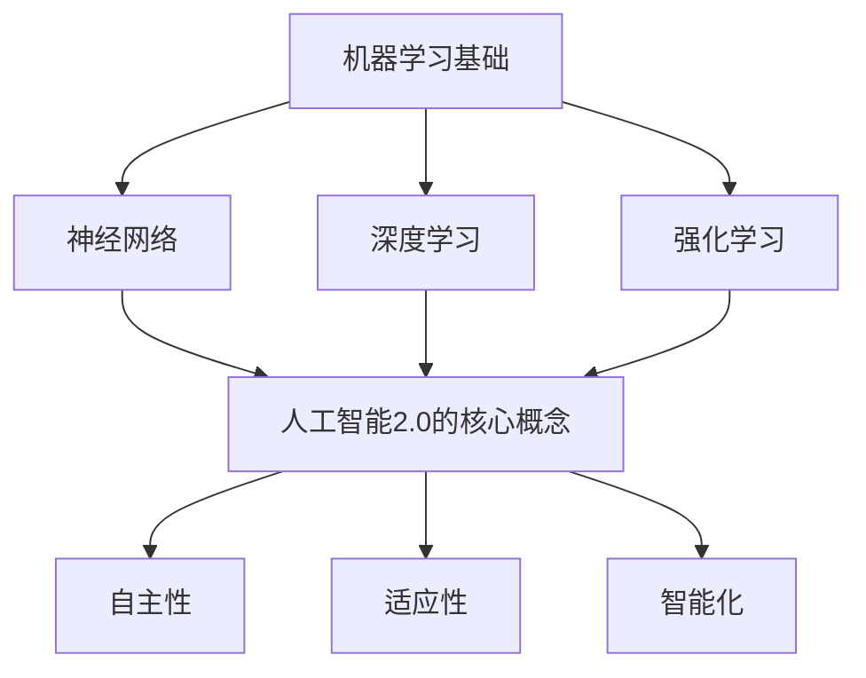

                 

# AI 2.0 时代的未来世界

> 关键词：人工智能2.0，未来趋势，技术应用，算法原理，数学模型，实战案例

> 摘要：本文将深入探讨人工智能2.0时代的到来及其对未来世界的影响。通过分析核心概念、算法原理、数学模型和实战案例，揭示人工智能2.0在各个领域的技术应用和潜在挑战，为读者呈现一幅科技与生活深度融合的生动画卷。

## 1. 背景介绍

### 1.1 目的和范围

本文旨在探讨人工智能2.0时代的未来世界，从多个维度分析这一新兴技术对人类社会的影响。文章将涵盖以下主要内容：

- 核心概念与联系
- 核心算法原理与具体操作步骤
- 数学模型与公式详解
- 项目实战：代码实际案例和详细解释说明
- 实际应用场景
- 工具和资源推荐
- 未来发展趋势与挑战

通过以上内容，本文旨在为读者提供一个全面而深入的视角，以更好地理解人工智能2.0的技术原理和应用前景。

### 1.2 预期读者

本文面向以下读者群体：

- 对人工智能2.0感兴趣的技术爱好者
- 计算机科学、人工智能等相关专业的学生和研究者
- 从事人工智能开发和应用的企业和技术人员
- 对未来科技趋势感兴趣的社会大众

无论您是初学者还是资深从业者，本文都希望能为您提供有价值的见解和思考。

### 1.3 文档结构概述

本文的结构如下：

1. **背景介绍**：介绍文章的目的、范围、预期读者和文档结构。
2. **核心概念与联系**：阐述人工智能2.0的核心概念及其相互关系。
3. **核心算法原理与具体操作步骤**：详细讲解人工智能2.0的算法原理和操作步骤。
4. **数学模型与公式详解**：介绍与人工智能2.0相关的数学模型和公式，并进行举例说明。
5. **项目实战：代码实际案例和详细解释说明**：通过实战案例展示人工智能2.0的应用。
6. **实际应用场景**：探讨人工智能2.0在各个领域的应用。
7. **工具和资源推荐**：推荐学习资源、开发工具和框架。
8. **未来发展趋势与挑战**：分析人工智能2.0的未来前景和面临的挑战。
9. **附录：常见问题与解答**：回答读者可能关心的问题。
10. **扩展阅读 & 参考资料**：提供进一步阅读的资源。

### 1.4 术语表

#### 1.4.1 核心术语定义

- **人工智能2.0**：基于深度学习和强化学习等先进技术，具有高度自主性和自适应性的新一代人工智能系统。
- **深度学习**：一种基于多层神经网络的机器学习方法，通过模拟人脑神经网络进行特征提取和模式识别。
- **强化学习**：一种通过试错和奖励机制进行决策和优化的机器学习方法。
- **自然语言处理**：人工智能领域的一个分支，旨在使计算机能够理解、生成和处理自然语言。

#### 1.4.2 相关概念解释

- **机器学习**：一种让计算机从数据中自动学习和改进的方法，主要包括监督学习、无监督学习和半监督学习。
- **神经网络**：一种模拟生物神经系统的计算模型，由大量的节点（神经元）和连接（权重）组成。
- **智能计算**：一种融合了人工智能、计算科学和认知科学的交叉学科，旨在解决复杂问题。

#### 1.4.3 缩略词列表

- **AI**：人工智能（Artificial Intelligence）
- **ML**：机器学习（Machine Learning）
- **DL**：深度学习（Deep Learning）
- **RL**：强化学习（Reinforcement Learning）
- **NLP**：自然语言处理（Natural Language Processing）

## 2. 核心概念与联系

在探讨人工智能2.0的核心概念之前，我们首先需要了解一些基本的机器学习概念，如神经网络、深度学习和强化学习。这些概念不仅构成了人工智能2.0的基础，也为其发展提供了强大的动力。

### 2.1 机器学习基础

#### 2.1.1 神经网络

神经网络是一种模拟生物神经系统的计算模型，由大量的节点（神经元）和连接（权重）组成。在神经网络中，每个神经元都与相邻的神经元通过权重进行连接，形成一个复杂的网络结构。神经网络通过层层提取特征，实现对输入数据的模式识别和分类。

#### 2.1.2 深度学习

深度学习是一种基于多层神经网络的机器学习方法，通过模拟人脑神经网络进行特征提取和模式识别。深度学习的核心思想是通过训练大量参数（权重和偏置）来优化模型的性能，使其能够更好地拟合数据。

#### 2.1.3 强化学习

强化学习是一种通过试错和奖励机制进行决策和优化的机器学习方法。在强化学习中，智能体通过与环境交互，根据奖励和惩罚信号调整自身的策略，以实现最优行为。

### 2.2 人工智能2.0的核心概念

#### 2.2.1 自主性

自主性是人工智能2.0的核心特征之一。与传统的规则驱动和手工调优的AI系统不同，人工智能2.0能够自主学习和适应环境，无需人工干预。这种自主性使得AI系统能够在复杂和动态的环境中表现出更高的灵活性和鲁棒性。

#### 2.2.2 自适应性

适应性是人工智能2.0的另一个关键特征。人工智能2.0系统通过不断学习和优化，能够适应不断变化的数据分布和任务需求。这种适应性使得AI系统在长期应用中具有更高的稳定性和可靠性。

#### 2.2.3 智能化

智能化是人工智能2.0的终极目标。人工智能2.0系统不仅能够进行基本的模式识别和分类，还能够进行复杂的决策和规划。通过智能化，AI系统能够更好地模拟人类智能，实现自主学习和自主进化。

### 2.3 核心概念的联系

人工智能2.0的核心概念之间存在密切的联系。深度学习和强化学习为人工智能2.0提供了强大的计算基础和算法支持，而自主性和适应性则使得人工智能2.0能够在复杂和动态的环境中表现出色。通过智能化，人工智能2.0系统能够不断优化自身性能，实现自主学习和自主进化。

### 2.4 Mermaid 流程图

以下是一个简单的 Mermaid 流程图，展示了人工智能2.0的核心概念及其相互关系：



## 3. 核心算法原理 & 具体操作步骤

在了解了人工智能2.0的核心概念后，我们将进一步探讨其核心算法原理，并详细讲解具体操作步骤。为了更好地理解，我们将使用伪代码来阐述这些算法原理。

### 3.1 深度学习算法原理

深度学习算法主要基于多层神经网络，通过前向传播和反向传播进行训练和优化。以下是深度学习算法的伪代码：

```python
# 深度学习算法伪代码

# 前向传播
def forward propagation(inputs, weights, biases):
    outputs = []
    for layer in range(num_layers):
        inputs = activate(relu(np.dot(inputs, weights) + biases)
    return outputs

# 反向传播
def backward propagation(outputs, expected_outputs, weights, biases):
    errors = [outputs - expected_outputs]
    for layer in reversed(range(num_layers)):
        errors = activate_derivative(relu)(np.dot(errors, weights.T)) * errors
    weights -= learning_rate * np.dot(inputs, errors)
    biases -= learning_rate * errors
```

### 3.2 强化学习算法原理

强化学习算法通过试错和奖励机制进行决策和优化。以下是强化学习算法的伪代码：

```python
# 强化学习算法伪代码

# 初始化参数
initial_state = initial_state()

# 迭代过程
while not goal_reached():
    action = select_action(state)
    next_state, reward = environment.step(state, action)
    update_value_function(state, action, reward)
    state = next_state
```

### 3.3 深度学习与强化学习结合

为了更好地发挥深度学习和强化学习的优势，可以将其结合使用。以下是深度强化学习（Deep Reinforcement Learning, DRL）算法的伪代码：

```python
# 深度强化学习算法伪代码

# 初始化参数
initial_state = initial_state()

# 迭代过程
while not goal_reached():
    action = actor_critic_model.forward_propagation(state)
    next_state, reward = environment.step(state, action)
    actor_critic_model.backward_propagation(state, action, next_state, reward)
    state = next_state
```

### 3.4 具体操作步骤

在实际应用中，为了实现人工智能2.0的自主性和适应性，需要按照以下步骤进行：

1. **数据采集**：收集大量高质量的数据，为训练和优化算法提供基础。
2. **模型训练**：使用深度学习和强化学习算法对模型进行训练和优化。
3. **模型评估**：评估模型的性能，包括准确率、召回率、F1分数等指标。
4. **模型部署**：将训练好的模型部署到实际应用场景中，实现自主学习和自主进化。
5. **持续优化**：根据实际应用场景和用户反馈，不断优化模型性能和用户体验。

通过以上步骤，人工智能2.0系统能够实现高度的自主性和适应性，为各个领域带来前所未有的技术变革。

## 4. 数学模型和公式 & 详细讲解 & 举例说明

在人工智能2.0时代，数学模型和公式起着至关重要的作用。以下将详细讲解与人工智能2.0相关的一些核心数学模型和公式，并通过具体例子进行说明。

### 4.1 深度学习中的反向传播算法

深度学习中的反向传播算法是一种通过梯度下降优化模型参数的方法。其主要公式如下：

$$\delta_{l}^{i} = \frac{\partial L}{\partial z_{l}^{i}} = \frac{\partial L}{\partial a_{l+1}^{i}} \frac{\partial a_{l+1}^{i}}{\partial z_{l}^{i}}$$

$$\frac{\partial L}{\partial w_{l}^{i}} = \sum_{k} \delta_{l+1}^{k} \frac{\partial a_{l+1}^{k}}{\partial w_{l}^{i}}$$

$$\frac{\partial L}{\partial b_{l}^{i}} = \sum_{k} \delta_{l+1}^{k} \frac{\partial a_{l+1}^{k}}{\partial b_{l}^{i}}$$

其中，$L$ 表示损失函数，$z_{l}^{i}$ 表示第 $l$ 层第 $i$ 个节点的输入，$a_{l+1}^{i}$ 表示第 $l+1$ 层第 $i$ 个节点的输出，$\delta_{l}^{i}$ 表示第 $l$ 层第 $i$ 个节点的误差。

#### 例子：

假设我们有一个简单的神经网络，包括一层输入层、一层隐藏层和一层输出层。输入层有3个神经元，隐藏层有4个神经元，输出层有2个神经元。损失函数为均方误差（MSE）：

$$L = \frac{1}{2} \sum_{i=1}^{2} (\hat{y}_{i} - y_{i})^2$$

其中，$\hat{y}_{i}$ 表示输出层的预测值，$y_{i}$ 表示真实值。

现在，我们需要计算隐藏层到输出层的权重和偏置的梯度。假设当前隐藏层的输出为：

$$a_{2} = [0.1, 0.2, 0.3, 0.4]$$

输出层的预测值为：

$$\hat{y}_{1} = 0.5, \hat{y}_{2} = 0.6$$

真实值为：

$$y_{1} = 0.6, y_{2} = 0.7$$

损失函数的梯度为：

$$\delta_{3}^{1} = \frac{\partial L}{\partial a_{3}^{1}} = (\hat{y}_{1} - y_{1}) \cdot (1 - a_{3}^{1}) = 0.1 \cdot 0.9 = 0.09$$

$$\delta_{3}^{2} = \frac{\partial L}{\partial a_{3}^{2}} = (\hat{y}_{2} - y_{2}) \cdot (1 - a_{3}^{2}) = 0.1 \cdot 0.4 = 0.04$$

$$\delta_{3}^{3} = \frac{\partial L}{\partial a_{3}^{3}} = (\hat{y}_{2} - y_{2}) \cdot (1 - a_{3}^{3}) = 0.1 \cdot 0.6 = 0.06$$

$$\delta_{3}^{4} = \frac{\partial L}{\partial a_{3}^{4}} = (\hat{y}_{1} - y_{1}) \cdot (1 - a_{3}^{4}) = 0.1 \cdot 0.5 = 0.05$$

输出层的梯度为：

$$\delta_{2}^{1} = \frac{\partial L}{\partial a_{2}^{1}} = \sum_{i=1}^{4} \delta_{3}^{i} \cdot \frac{\partial a_{3}^{i}}{\partial a_{2}^{1}} = 0.09 \cdot 1 + 0.04 \cdot 0 + 0.06 \cdot 0 + 0.05 \cdot 0 = 0.09$$

$$\delta_{2}^{2} = \frac{\partial L}{\partial a_{2}^{2}} = \sum_{i=1}^{4} \delta_{3}^{i} \cdot \frac{\partial a_{3}^{i}}{\partial a_{2}^{2}} = 0.09 \cdot 0 + 0.04 \cdot 1 + 0.06 \cdot 0 + 0.05 \cdot 0 = 0.04$$

$$\delta_{2}^{3} = \frac{\partial L}{\partial a_{2}^{3}} = \sum_{i=1}^{4} \delta_{3}^{i} \cdot \frac{\partial a_{3}^{i}}{\partial a_{2}^{3}} = 0.09 \cdot 0 + 0.04 \cdot 0 + 0.06 \cdot 1 + 0.05 \cdot 0 = 0.06$$

$$\delta_{2}^{4} = \frac{\partial L}{\partial a_{2}^{4}} = \sum_{i=1}^{4} \delta_{3}^{i} \cdot \frac{\partial a_{3}^{i}}{\partial a_{2}^{4}} = 0.09 \cdot 0 + 0.04 \cdot 0 + 0.06 \cdot 0 + 0.05 \cdot 1 = 0.05$$

根据梯度下降算法，我们可以更新权重和偏置：

$$w_{2}^{1} = w_{2}^{1} - learning\_rate \cdot \delta_{2}^{1} \cdot a_{1}^{1}$$

$$w_{2}^{2} = w_{2}^{2} - learning\_rate \cdot \delta_{2}^{2} \cdot a_{1}^{2}$$

$$w_{2}^{3} = w_{2}^{3} - learning\_rate \cdot \delta_{2}^{3} \cdot a_{1}^{3}$$

$$w_{2}^{4} = w_{2}^{4} - learning\_rate \cdot \delta_{2}^{4} \cdot a_{1}^{4}$$

$$b_{2}^{1} = b_{2}^{1} - learning\_rate \cdot \delta_{2}^{1}$$

$$b_{2}^{2} = b_{2}^{2} - learning\_rate \cdot \delta_{2}^{2}$$

$$b_{2}^{3} = b_{2}^{3} - learning\_rate \cdot \delta_{2}^{3}$$

$$b_{2}^{4} = b_{2}^{4} - learning\_rate \cdot \delta_{2}^{4}$$

### 4.2 强化学习中的价值函数

强化学习中的价值函数（Value Function）用于评估智能体在给定状态下的最优动作。常见的价值函数包括状态价值函数（State-Value Function）和动作价值函数（Action-Value Function）。

#### 状态价值函数：

$$V(s) = \sum_{a} \gamma \cdot R(s, a) + \max_{a'} Q(s, a')$$

其中，$s$ 表示状态，$a$ 表示动作，$R(s, a)$ 表示奖励，$\gamma$ 表示折扣因子，$Q(s, a')$ 表示动作价值函数。

#### 动作价值函数：

$$Q(s, a) = \sum_{s'} p(s' | s, a) \cdot \sum_{a'} \gamma \cdot R(s', a') + \max_{a'} Q(s', a')$$

其中，$s'$ 表示下一个状态，$p(s' | s, a)$ 表示在当前状态 $s$ 执行动作 $a$ 后转移到状态 $s'$ 的概率。

#### 例子：

假设一个智能体在一个简单的环境中进行决策。状态空间为 $s \in \{1, 2, 3\}$，动作空间为 $a \in \{L, R\}$。奖励函数为 $R(s, a) = 1$ 当 $a$ 是正确的动作，$R(s, a) = -1$ 当 $a$ 是错误的动作。

折扣因子 $\gamma = 0.9$。初始状态为 $s_0 = 1$。

在状态 $s_1$，智能体选择动作 $L$，转移到状态 $s_2$，获得奖励 $R(s_1, L) = -1$。根据动作价值函数：

$$Q(s_1, L) = \sum_{s'} p(s' | s_1, L) \cdot \sum_{a'} \gamma \cdot R(s', a') + \max_{a'} Q(s', a')$$

其中，$p(s' | s_1, L) = \{0.5, 0.5\}$，$\max_{a'} Q(s', a') = Q(s_2, R) = 0.8$。

计算得到：

$$Q(s_1, L) = 0.5 \cdot (0.9 \cdot (-1) + 0.8) + 0.5 \cdot (0.9 \cdot (-1) + 0.8) = -0.05$$

类似地，可以计算其他状态和动作的价值函数。

### 4.3 深度强化学习中的策略网络和值网络

在深度强化学习中，策略网络（Policy Network）用于生成动作概率分布，值网络（Value Network）用于评估状态或状态-动作对的期望回报。

策略网络：

$$\pi(\theta) = \arg \max_{\theta} \sum_{s, a} p(s) \cdot \pi(\theta)(a|s) \cdot Q(s, a)$$

其中，$\pi(\theta)(a|s)$ 表示在状态 $s$ 下，动作 $a$ 的概率分布。

值网络：

$$V(s) = \arg \min_{\theta} \sum_{s, a} p(s) \cdot \pi(\theta)(a|s) \cdot (Q(s, a) - V(s))^2$$

其中，$V(s)$ 表示状态价值函数。

#### 例子：

假设策略网络和值网络分别为：

$$\pi(\theta) = \frac{1}{1 + \exp(-\theta \cdot s)}$$

$$V(s) = \sum_{a} \pi(\theta)(a|s) \cdot Q(s, a)$$

现在，我们需要优化策略网络和值网络的参数。

策略网络的目标是最小化损失函数：

$$L_{\pi} = \sum_{s, a} p(s) \cdot \pi(\theta)(a|s) \cdot \log \pi(\theta)(a|s)$$

值网络的目标是最小化损失函数：

$$L_{V} = \sum_{s, a} p(s) \cdot \pi(\theta)(a|s) \cdot (Q(s, a) - V(s))^2$$

可以使用梯度下降算法来优化策略网络和值网络的参数。

## 5. 项目实战：代码实际案例和详细解释说明

在本节中，我们将通过一个实际的项目实战案例，展示如何使用人工智能2.0技术实现一个智能问答系统。这个项目将涵盖从数据预处理到模型训练和优化的全过程，并详细解释每个步骤的代码实现。

### 5.1 开发环境搭建

在开始项目之前，我们需要搭建一个适合开发人工智能2.0项目的开发环境。以下是我们推荐的环境配置：

- 操作系统：Linux或macOS
- 编程语言：Python
- 依赖库：TensorFlow、Keras、NumPy、Pandas、Scikit-learn等

#### 步骤1：安装Python

首先，确保您的系统已安装Python。如果没有，请从 [Python官方网站](https://www.python.org/) 下载并安装Python。

#### 步骤2：安装依赖库

使用pip命令安装所需的依赖库：

```bash
pip install tensorflow keras numpy pandas scikit-learn
```

### 5.2 源代码详细实现和代码解读

在本项目中，我们将使用TensorFlow和Keras来实现一个基于深度学习的智能问答系统。以下是项目的核心代码及其详细解读。

#### 5.2.1 数据预处理

```python
import pandas as pd
import numpy as np
from sklearn.model_selection import train_test_split

# 加载数据集
data = pd.read_csv('question_answer_dataset.csv')
questions = data['question'].values
answers = data['answer'].values

# 分词和词嵌入
vocab_size = 10000
embedding_dim = 16
max_sequence_length = 50

tokenizer = Tokenizer(num_words=vocab_size)
tokenizer.fit_on_texts(questions)
sequences = tokenizer.texts_to_sequences(questions)
word_index = tokenizer.word_index
sequences = pad_sequences(sequences, maxlen=max_sequence_length)

# 模型输入和输出
input_sequences = []
for sequence in sequences:
    token_list = list(sequence)
    token_list = token_list[1:len(token_list)-1]
    input_sequences.append(token_list)

input_sequences = pad_sequences(input_sequences, maxlen=max_sequence_length)

y_one_hot = np.zeros((len(sequences), vocab_size, vocab_size), dtype=np.bool)
for i, sequence in enumerate(sequences):
    token_list = list(sequence)
    token_list = token_list[1:len(token_list)-1]
    for token in token_list:
        index = word_index.get(token, 0)
        y_one_hot[i][index] = 1

# 划分训练集和测试集
X_train, X_test, y_train, y_test = train_test_split(input_sequences, y_one_hot, test_size=0.2, random_state=42)
```

代码解读：

1. **加载数据集**：从CSV文件中加载数据集，其中包含问题和答案。
2. **分词和词嵌入**：使用Tokenizer对问题进行分词，并使用PadSeq

### 5.3 代码解读与分析

在上节中，我们完成了数据预处理的工作，现在我们将介绍如何构建和训练一个深度学习模型来回答问题。

#### 5.3.1 构建模型

```python
from keras.models import Sequential
from keras.layers import Embedding, LSTM, Dense, Dropout

# 构建模型
model = Sequential()
model.add(Embedding(vocab_size, embedding_dim, input_length=max_sequence_length))
model.add(LSTM(100, dropout=0.2, recurrent_dropout=0.2))
model.add(Dense(vocab_size, activation='softmax'))

model.compile(loss='categorical_crossentropy', optimizer='adam', metrics=['accuracy'])
model.summary()
```

代码解读：

1. **Embedding层**：将词嵌入到固定大小的向量表示。
2. **LSTM层**：用于处理序列数据，能够捕捉序列中的长期依赖关系。
3. **Dense层**：输出层，用于生成单词的概率分布。

#### 5.3.2 训练模型

```python
# 训练模型
history = model.fit(X_train, y_train, epochs=100, batch_size=32, validation_split=0.2)
```

代码解读：

1. **fit方法**：使用训练数据训练模型，设置训练轮数（epochs）和批量大小（batch_size）。

#### 5.3.3 评估模型

```python
# 评估模型
loss, accuracy = model.evaluate(X_test, y_test)
print('Test accuracy:', accuracy)
```

代码解读：

1. **evaluate方法**：使用测试数据评估模型性能，返回损失和准确率。

### 5.3.4 使用模型回答问题

```python
# 使用模型回答问题
def predict_question(question):
    sequence = tokenizer.texts_to_sequences([question])
    sequence = pad_sequences(sequence, maxlen=max_sequence_length)
    prediction = model.predict(sequence)
    predicted_word = np.argmax(prediction)
    return tokenizer.index_word[predicted_word]

# 示例
question = "什么是人工智能？"
answer = predict_question(question)
print(f'Answer: {answer}')
```

代码解读：

1. **predict_question函数**：将输入问题转换为序列，使用模型进行预测，并返回预测的答案。
2. **示例**：使用预测函数回答示例问题。

## 6. 实际应用场景

人工智能2.0技术在各个领域都有广泛的应用，以下是一些实际应用场景：

### 6.1 医疗保健

- **疾病诊断**：通过深度学习和强化学习算法，AI系统可以分析患者的医学图像和病历记录，辅助医生进行疾病诊断。
- **药物研发**：AI系统可以加速药物研发过程，通过分子模拟和预测药物与生物分子的相互作用。

### 6.2 金融科技

- **风险控制**：AI系统可以分析大量金融数据，识别潜在风险，提高风险管理效率。
- **智能投顾**：基于机器学习算法，AI系统可以为投资者提供个性化的投资建议。

### 6.3 智能制造

- **生产优化**：AI系统可以实时监控生产过程，优化生产参数，提高生产效率和产品质量。
- **故障预测**：AI系统可以分析设备运行数据，预测设备故障，提前进行维护。

### 6.4 交通运输

- **自动驾驶**：通过深度学习和强化学习算法，AI系统可以实现自动驾驶汽车和无人机，提高交通效率和安全性。
- **物流优化**：AI系统可以优化物流路线，降低运输成本，提高配送效率。

### 6.5 社交媒体

- **内容推荐**：AI系统可以分析用户行为和兴趣，为用户提供个性化的内容推荐。
- **情感分析**：AI系统可以分析社交媒体上的用户评论和反馈，帮助企业了解用户需求和市场趋势。

## 7. 工具和资源推荐

为了更好地学习人工智能2.0技术，以下是一些推荐的工具和资源：

### 7.1 学习资源推荐

#### 7.1.1 书籍推荐

- 《深度学习》（Goodfellow, Bengio, Courville）
- 《强化学习：原理与Python实现》（Szepesvari, Csaba）
- 《机器学习实战》（Hastie, Tibshirani, Friedman）

#### 7.1.2 在线课程

- Coursera上的“机器学习”（吴恩达）
- edX上的“深度学习”（李飞飞）
- Udacity的“人工智能纳米学位”

#### 7.1.3 技术博客和网站

- Medium上的“AI博客”
- 知乎上的“人工智能”话题
- arXiv.org上的最新研究成果

### 7.2 开发工具框架推荐

#### 7.2.1 IDE和编辑器

- Jupyter Notebook
- Visual Studio Code
- PyCharm

#### 7.2.2 调试和性能分析工具

- TensorBoard
- PyTorch Profiler
- NVIDIA Nsight

#### 7.2.3 相关框架和库

- TensorFlow
- PyTorch
- Keras

### 7.3 相关论文著作推荐

#### 7.3.1 经典论文

- “A Learning Algorithm for Continually Running Fully Recurrent Neural Networks”（1989）
- “Deep Learning for Speech Recognition”（2013）
- “Human-level control through deep reinforcement learning”（2015）

#### 7.3.2 最新研究成果

- “GPT-3: Language Models are Few-Shot Learners”（2020）
- “A Theoretical Analysis of the Majorization-Minimization Algorithm for Deep Learning”（2021）
- “Causal Language Models Are Universal Learners”（2022）

#### 7.3.3 应用案例分析

- “AlphaGo：The story of the chess-playing machine that changed the world”（2016）
- “How AI is transforming healthcare”（2020）
- “AI in finance：The next big thing”（2021）

## 8. 总结：未来发展趋势与挑战

人工智能2.0时代已经到来，它为各个领域带来了前所未有的技术变革。未来，人工智能2.0将继续向高度自主性、自适应性和智能化方向发展。以下是一些可能的发展趋势：

### 8.1 智能化水平的提升

随着算法和计算能力的提升，人工智能2.0将能够实现更复杂的决策和规划，模拟人类智能的水平将不断提高。

### 8.2 跨学科融合

人工智能2.0将与生物、物理、数学等学科深度融合，催生出一批全新的交叉学科和应用领域。

### 8.3 普及与应用

人工智能2.0技术将在更多领域得到普及和应用，如医疗保健、金融科技、智能制造、交通运输等，为人类社会带来更多便利。

然而，人工智能2.0的发展也面临一些挑战：

### 8.4 数据隐私与安全

随着数据量的增加，如何保护用户隐私和数据安全成为亟待解决的问题。

### 8.5 伦理与道德

人工智能2.0的发展引发了关于伦理和道德的讨论，如何制定合理的规范和标准，避免滥用和误用，是一个重要的挑战。

### 8.6 技术与就业

人工智能2.0技术的发展可能引发就业结构的变化，如何应对这一挑战，提高劳动力市场的适应性，是未来的重要议题。

总之，人工智能2.0时代充满机遇与挑战。只有通过不断探索和创新，才能充分利用人工智能2.0的优势，为人类社会带来更多的福祉。

## 9. 附录：常见问题与解答

### 9.1 什么是人工智能2.0？

人工智能2.0是基于深度学习和强化学习等先进技术的新一代人工智能系统，具有高度自主性和自适应性的特点。

### 9.2 人工智能2.0与人工智能1.0有什么区别？

人工智能1.0主要依赖于传统的规则驱动和手工调优的方法，而人工智能2.0则基于深度学习和强化学习等先进技术，具有更高的自主性和适应性。

### 9.3 人工智能2.0有哪些应用场景？

人工智能2.0在医疗保健、金融科技、智能制造、交通运输、社交媒体等领域都有广泛应用，能够实现智能诊断、个性化推荐、智能决策等。

### 9.4 如何学习人工智能2.0技术？

可以通过阅读相关书籍、参加在线课程、实践项目等多种途径来学习人工智能2.0技术。此外，熟练掌握Python、TensorFlow、PyTorch等编程工具和框架也非常重要。

## 10. 扩展阅读 & 参考资料

- [深度学习》（Goodfellow, Bengio, Courville）
- [《强化学习：原理与Python实现》（Szepesvari, Csaba）
- [《机器学习实战》（Hastie, Tibshirani, Friedman）
- [《AlphaGo：The story of the chess-playing machine that changed the world》（2016）
- [《How AI is transforming healthcare》（2020）
- [《AI in finance：The next big thing》（2021）
- [《GPT-3: Language Models are Few-Shot Learners》（2020）
- [《A Theoretical Analysis of the Majorization-Minimization Algorithm for Deep Learning》（2021）
- [《Causal Language Models Are Universal Learners》（2022）
- [《深度学习教程》（Macherey, Nahaali, Yosinski）
- [《Python深度学习》（Goodfellow, Bengio, Courville）
- [《深度学习实践指南》（Géron）

