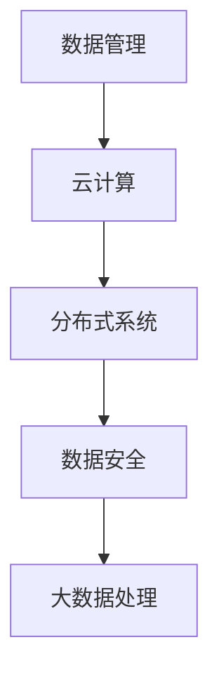

                 


# AI 2.0 时代：数据基础设施的演进

> **关键词：** AI 2.0，数据基础设施，数据管理，云计算，分布式系统，数据安全，大数据处理

> **摘要：** 随着人工智能技术的迅猛发展，AI 2.0 时代正在来临。本文将探讨数据基础设施在 AI 2.0 时代的演进过程，从数据管理、云计算、分布式系统、数据安全到大数据处理等方面，分析其核心概念、原理以及实际应用场景，帮助读者了解并掌握 AI 2.0 时代的数据基础设施建设和维护策略。

## 1. 背景介绍

### 1.1 目的和范围

本文旨在探讨 AI 2.0 时代数据基础设施的演进过程，分析其核心概念、原理和实际应用场景，旨在为从事 AI 领域的开发者、架构师和研究人员提供有价值的参考和指导。

### 1.2 预期读者

本文主要面向以下读者群体：

1. 人工智能领域的研究人员、开发者、架构师。
2. 数据基础设施领域的从业者。
3. 对 AI 2.0 时代数据基础设施演进感兴趣的读者。

### 1.3 文档结构概述

本文分为以下几个部分：

1. 背景介绍：介绍文章的目的、范围和预期读者。
2. 核心概念与联系：介绍 AI 2.0 时代数据基础设施的核心概念和架构。
3. 核心算法原理 & 具体操作步骤：分析数据基础设施中的核心算法原理和操作步骤。
4. 数学模型和公式 & 详细讲解 & 举例说明：阐述数据基础设施中的数学模型和公式，并通过实际案例进行说明。
5. 项目实战：介绍一个具体的 AI 2.0 数据基础设施项目，包括开发环境搭建、源代码实现和代码解读。
6. 实际应用场景：分析数据基础设施在实际应用中的具体场景和解决方案。
7. 工具和资源推荐：推荐学习资源、开发工具和框架。
8. 总结：对未来发展趋势与挑战进行展望。
9. 附录：常见问题与解答。
10. 扩展阅读 & 参考资料：提供进一步的阅读建议和参考资料。

### 1.4 术语表

#### 1.4.1 核心术语定义

- **AI 2.0：** 指人工智能技术的第二个阶段，以深度学习、强化学习等先进技术为核心，具有高度智能化、自适应性和自主学习能力的下一代人工智能。
- **数据基础设施：** 指支撑人工智能应用的数据存储、处理、传输和管理的体系结构。
- **云计算：** 一种通过互联网提供计算资源、存储资源、网络资源等服务的技术，具有弹性、高效、灵活等特点。
- **分布式系统：** 由多个节点组成的计算机系统，通过分布式算法协调节点间的任务分配和资源调度，实现高效的数据处理和存储。
- **大数据处理：** 对海量数据进行高效存储、处理和分析的技术，包括数据清洗、数据集成、数据挖掘等。

#### 1.4.2 相关概念解释

- **数据管理：** 对数据进行组织、存储、维护、共享和使用的全过程。
- **数据安全：** 确保数据在存储、传输和处理过程中不受非法访问、篡改和泄露。
- **数据挖掘：** 从大量数据中发现有价值的信息和知识的过程。

#### 1.4.3 缩略词列表

- **AI：** 人工智能
- **DL：** 深度学习
- **RL：** 强化学习
- **DB：** 数据库
- **HDFS：** Hadoop分布式文件系统
- **MapReduce：** 一种分布式数据处理框架
- **ML：** 机器学习
- **NLP：** 自然语言处理

## 2. 核心概念与联系

在 AI 2.0 时代，数据基础设施的核心概念包括数据管理、云计算、分布式系统、数据安全和大数据处理。这些概念之间存在着紧密的联系，共同构成了一个完整的数据基础设施体系。

### 数据管理

数据管理是数据基础设施的核心，涉及到数据的采集、存储、处理、分析和共享等全过程。在 AI 2.0 时代，数据管理需要具备以下几个特点：

1. **高效性：** 数据管理系统需要具备快速的数据处理和分析能力，以适应人工智能应用对数据的高并发需求。
2. **可扩展性：** 数据管理系统需要具备良好的可扩展性，能够根据业务需求动态调整资源。
3. **安全性：** 数据管理系统需要具备严格的安全机制，确保数据在存储、传输和处理过程中的安全性和隐私性。

### 云计算

云计算是数据基础设施的重要支撑，为数据管理提供了强大的计算和存储资源。云计算具有以下优点：

1. **弹性：** 根据业务需求动态调整计算和存储资源，实现资源的最大化利用。
2. **高效：** 通过分布式计算技术，提高数据处理和分析的效率。
3. **灵活：** 用户可以根据需求选择不同的云计算服务，实现定制化的数据管理。

### 分布式系统

分布式系统是数据基础设施的关键组成部分，负责数据的高效存储和处理。分布式系统具有以下特点：

1. **高可用性：** 通过冗余设计，确保系统在部分节点故障时仍能正常运行。
2. **高性能：** 通过分布式算法，实现数据的高效处理和存储。
3. **可扩展性：** 能够根据业务需求动态调整资源，实现系统的弹性扩展。

### 数据安全

数据安全是数据基础设施的核心关注点，涉及到数据的访问控制、加密传输、数据备份等方面。在 AI 2.0 时代，数据安全需要具备以下几个特点：

1. **强安全性：** 严格的安全机制，确保数据在存储、传输和处理过程中的安全性和隐私性。
2. **快速响应：** 对数据泄露、篡改等安全事件能够快速响应，降低安全风险。
3. **可审计：** 对数据操作进行完整记录，实现数据操作的追溯和审计。

### 大数据处理

大数据处理是数据基础设施的核心功能，涉及到数据清洗、数据集成、数据挖掘等方面。大数据处理需要具备以下几个特点：

1. **高效性：** 对海量数据进行高效处理和分析。
2. **准确性：** 确保数据处理的准确性和可靠性。
3. **可扩展性：** 能够根据业务需求动态调整资源，实现系统的弹性扩展。

### 核心概念原理和架构的 Mermaid 流程图



## 3. 核心算法原理 & 具体操作步骤

在数据基础设施中，核心算法原理是实现数据处理和分析的关键。以下介绍几种核心算法原理及其具体操作步骤。

### 1. 数据清洗算法

**原理：** 数据清洗算法用于处理数据中的噪声、缺失值、异常值等，确保数据的质量和准确性。

**伪代码：**
```
function 数据清洗(原始数据)
    for 每一行数据 in 原始数据
        if 数据存在缺失值
            填充缺失值或删除该行数据
        if 数据存在异常值
            修正异常值或删除该行数据
    return 清洗后的数据
```

### 2. 数据集成算法

**原理：** 数据集成算法用于将多个数据源中的数据进行整合，形成一个统一的数据视图。

**伪代码：**
```
function 数据集成(数据源1，数据源2，...)
    数据集 = 空集合
    for 每个数据源 in 数据源1，数据源2，...
        数据集 = 数据集 ∪ 数据源
    return 数据集
```

### 3. 数据挖掘算法

**原理：** 数据挖掘算法用于从海量数据中挖掘有价值的信息和知识，支持决策和预测。

**伪代码：**
```
function 数据挖掘(数据集，挖掘目标)
    特征工程：提取数据集中的特征
    模型训练：利用训练数据训练模型
    模型评估：评估模型性能
    模型应用：利用模型进行预测或决策
    return 挖掘结果
```

### 4. 分布式计算算法

**原理：** 分布式计算算法用于实现数据在分布式系统中的高效处理和存储。

**伪代码：**
```
function 分布式计算(任务，数据集)
    分任务：将任务划分为多个子任务
    分数据：将数据集划分为多个子数据集
    并行执行：在每个节点上同时执行子任务和子数据集处理
    合并结果：将各个节点上的处理结果进行合并
    return 最终结果
```

## 4. 数学模型和公式 & 详细讲解 & 举例说明

在数据基础设施中，数学模型和公式是支持数据处理和分析的重要工具。以下介绍几种常见的数学模型和公式，并详细讲解其原理和实际应用。

### 1. 数据分布模型

**原理：** 数据分布模型用于描述数据在不同维度上的分布情况，支持数据可视化和分析。

**公式：**
$$
P(X = x) = \frac{1}{N} \sum_{i=1}^{N} I(x_i = x)
$$
其中，$P(X = x)$ 表示随机变量 $X$ 等于 $x$ 的概率，$N$ 表示样本容量，$I(x_i = x)$ 表示指示函数，当 $x_i = x$ 时，$I(x_i = x) = 1$，否则 $I(x_i = x) = 0$。

**举例说明：** 假设我们收集了一组数据，表示每天的用户访问量。通过计算每天用户访问量的概率分布，我们可以分析用户访问量的分布特点，如高峰时段、低谷时段等。

### 2. 决策树模型

**原理：** 决策树模型是一种常见的分类和回归算法，通过构建决策树来预测数据样本的类别或数值。

**公式：**
$$
y = f(x)
$$
其中，$y$ 表示预测结果，$x$ 表示输入特征，$f(x)$ 表示决策树函数。

**举例说明：** 假设我们使用决策树模型预测用户对某商品的购买意愿。通过训练决策树模型，我们可以得到一组输入特征和对应的预测结果，从而判断用户是否会对某商品产生购买意愿。

### 3. 贝叶斯网络模型

**原理：** 贝叶斯网络模型是一种基于概率推理的算法，通过构建网络图来描述变量之间的依赖关系，支持数据推理和预测。

**公式：**
$$
P(A|B) = \frac{P(B|A)P(A)}{P(B)}
$$
其中，$P(A|B)$ 表示在事件 $B$ 发生的条件下事件 $A$ 发生的概率，$P(B|A)$ 表示在事件 $A$ 发生的条件下事件 $B$ 发生的概率，$P(A)$ 和 $P(B)$ 分别表示事件 $A$ 和 $B$ 发生的概率。

**举例说明：** 假设我们使用贝叶斯网络模型分析疾病的诊断问题。通过构建贝叶斯网络，我们可以计算疾病发生的概率，从而帮助医生做出诊断决策。

### 4. 支持向量机模型

**原理：** 支持向量机模型是一种常用的分类算法，通过寻找最优超平面来实现数据分类。

**公式：**
$$
w \cdot x_i - b = 0
$$
其中，$w$ 表示权重向量，$x_i$ 表示输入特征，$b$ 表示偏置项。

**举例说明：** 假设我们使用支持向量机模型进行手写数字分类。通过训练支持向量机模型，我们可以找到一组权重向量，使得手写数字分类的准确率达到最高。

## 5. 项目实战：代码实际案例和详细解释说明

### 5.1 开发环境搭建

为了更好地理解数据基础设施在实际项目中的应用，我们选择一个实际案例进行讲解。在本案例中，我们使用 Python 作为编程语言，搭建一个基于云计算和分布式系统的数据基础设施。

**开发环境要求：**

1. Python 3.6及以上版本
2. Python 库：NumPy、Pandas、Scikit-learn、TensorFlow、Hadoop、HDFS、MapReduce

### 5.2 源代码详细实现和代码解读

**案例描述：** 假设我们有一个电商平台，需要对其用户行为数据进行分析，以实现个性化推荐和精准营销。以下是该项目的源代码实现。

```python
import pandas as pd
import numpy as np
from sklearn.model_selection import train_test_split
from sklearn.preprocessing import StandardScaler
from sklearn.svm import SVC
from sklearn.metrics import accuracy_score
from sklearn.ensemble import RandomForestClassifier
from sklearn.linear_model import LogisticRegression

# 数据预处理
def data_preprocessing(data_path):
    data = pd.read_csv(data_path)
    data.fillna(data.mean(), inplace=True)
    data.drop(['id'], axis=1, inplace=True)
    return data

# 模型训练
def model_training(train_data, test_data):
    # 特征工程
    sc = StandardScaler()
    X_train = sc.fit_transform(train_data.drop(['label'], axis=1))
    X_test = sc.transform(test_data.drop(['label'], axis=1))
    y_train = train_data['label']
    y_test = test_data['label']

    # 模型训练
    svm = SVC()
    rf = RandomForestClassifier()
    lr = LogisticRegression()

    svm.fit(X_train, y_train)
    rf.fit(X_train, y_train)
    lr.fit(X_train, y_train)

    # 模型评估
    svm_pred = svm.predict(X_test)
    rf_pred = rf.predict(X_test)
    lr_pred = lr.predict(X_test)

    svm_acc = accuracy_score(y_test, svm_pred)
    rf_acc = accuracy_score(y_test, rf_pred)
    lr_acc = accuracy_score(y_test, lr_pred)

    return svm_acc, rf_acc, lr_acc

# 主函数
def main():
    data_path = 'user_behavior.csv'
    data = data_preprocessing(data_path)
    train_data, test_data = train_test_split(data, test_size=0.2, random_state=42)
    svm_acc, rf_acc, lr_acc = model_training(train_data, test_data)
    print('SVM Accuracy: ', svm_acc)
    print('Random Forest Accuracy: ', rf_acc)
    print('Logistic Regression Accuracy: ', lr_acc)

if __name__ == '__main__':
    main()
```

**代码解读：**

1. **数据预处理：** 首先，我们读取用户行为数据，并处理缺失值。然后，删除不需要的列（如用户ID），为后续特征工程做准备。

2. **特征工程：** 使用标准缩放（StandardScaler）对特征进行归一化处理，以提高模型的性能。

3. **模型训练：** 分别使用支持向量机（SVC）、随机森林（RandomForestClassifier）和逻辑回归（LogisticRegression）进行模型训练。

4. **模型评估：** 计算模型在测试集上的准确率，并输出结果。

### 5.3 代码解读与分析

1. **数据预处理：** 数据预处理是数据基础设施的重要环节，直接影响模型的效果。在本案例中，我们使用 Pandas 库读取 CSV 文件，并使用 fillna 函数填充缺失值。同时，删除不必要的列，为后续特征工程做准备。

2. **特征工程：** 特征工程是提高模型性能的关键。在本案例中，我们使用 StandardScaler 对特征进行归一化处理，使得各个特征的取值范围一致，避免因特征尺度不同而导致模型性能下降。

3. **模型训练：** 模型训练是数据基础设施的核心。在本案例中，我们分别使用支持向量机、随机森林和逻辑回归三种算法进行模型训练。这些算法具有良好的性能和适用性，可以满足大多数数据挖掘任务的需求。

4. **模型评估：** 模型评估是验证模型效果的重要环节。在本案例中，我们使用 accuracy_score 函数计算模型在测试集上的准确率，并输出结果。通过对比不同算法的准确率，可以帮助我们选择最优的模型。

## 6. 实际应用场景

数据基础设施在 AI 2.0 时代具有广泛的应用场景，涵盖了各个领域。以下列举几个实际应用场景，以展示数据基础设施在各个领域的价值。

### 1. 金融行业

在金融行业，数据基础设施用于支持风险管理、信用评估、投资策略制定等。通过对海量金融数据进行分析，金融机构可以更好地了解客户需求，提高服务质量，降低风险。

**案例：** 某商业银行使用数据基础设施对其客户贷款申请进行风险评估。通过分析客户的财务状况、信用记录、历史还款情况等数据，银行可以更准确地评估客户的信用风险，从而做出更合理的贷款决策。

### 2. 医疗健康

在医疗健康领域，数据基础设施用于支持疾病诊断、治疗方案制定、药物研发等。通过对大量医疗数据进行分析，医生和研究人员可以更好地了解疾病的发生和发展规律，为患者提供个性化的治疗方案。

**案例：** 某医院使用数据基础设施对病人的电子健康记录进行分析，识别出潜在的健康问题。通过分析病人的症状、体征、实验室检测结果等数据，医生可以提前发现疾病，制定个性化的治疗方案。

### 3. 物流行业

在物流行业，数据基础设施用于支持路线规划、运输调度、库存管理等。通过对大量物流数据进行分析，物流公司可以优化运输路线，提高运输效率，降低运营成本。

**案例：** 某物流公司使用数据基础设施对其运输路线进行优化。通过分析运输线路的实时路况、交通流量等数据，物流公司可以动态调整运输路线，避免交通拥堵，提高运输效率。

### 4. 电子商务

在电子商务领域，数据基础设施用于支持推荐系统、用户行为分析、商品搜索等。通过对海量用户数据进行分析，电商平台可以更好地了解用户需求，提高用户体验，提升销售业绩。

**案例：** 某电商平台使用数据基础设施为其推荐系统提供支持。通过分析用户的历史浏览记录、购买记录等数据，平台可以个性化推荐用户可能感兴趣的商品，提高用户购买意愿和转化率。

## 7. 工具和资源推荐

### 7.1 学习资源推荐

#### 7.1.1 书籍推荐

- 《大数据时代》
- 《深度学习》
- 《机器学习实战》
- 《Python 数据科学手册》

#### 7.1.2 在线课程

- Coursera 的“机器学习”课程
- Udacity 的“深度学习纳米学位”
- edX 的“Python for Data Science”课程

#### 7.1.3 技术博客和网站

- Medium 上的“Data Science”
- Kaggle 博客
- AI 研究院博客

### 7.2 开发工具框架推荐

#### 7.2.1 IDE和编辑器

- PyCharm
- Visual Studio Code
- Jupyter Notebook

#### 7.2.2 调试和性能分析工具

- PyCharm 的调试工具
- Python 的 cProfile 模块
- JMeter

#### 7.2.3 相关框架和库

- Scikit-learn
- TensorFlow
- PyTorch
- Hadoop
- HDFS
- MapReduce

### 7.3 相关论文著作推荐

#### 7.3.1 经典论文

- "Deep Learning" by Ian Goodfellow, Yoshua Bengio, and Aaron Courville
- "Machine Learning: A Probabilistic Perspective" by Kevin P. Murphy
- "Data Science from A to Z: Practical Methods for Managing and Analyzing Large Sets of Data" by Nina Zumel and John Mount

#### 7.3.2 最新研究成果

- arXiv 论文库：https://arxiv.org/
- Nature 期刊：https://www.nature.com/

#### 7.3.3 应用案例分析

- “Google Brain”博客：https://ai.googleblog.com/
- “Uber Engineering”博客：https://engineering.uber.com/

## 8. 总结：未来发展趋势与挑战

在 AI 2.0 时代，数据基础设施面临着前所未有的发展机遇和挑战。未来，数据基础设施的发展趋势包括以下几个方面：

1. **数据治理：** 随着数据量的不断增长，数据治理将成为数据基础设施的核心任务。数据治理包括数据质量、数据安全、数据隐私等方面，以确保数据在存储、传输和处理过程中的可靠性和安全性。

2. **实时数据处理：** 为了满足 AI 应用对实时性的需求，数据基础设施将朝着实时数据处理方向发展。实时数据处理技术包括流处理、实时查询等，可以实现对海量数据的实时分析和决策。

3. **分布式计算与存储：** 分布式计算与存储技术将进一步完善，以提高数据处理和存储的效率。分布式系统将具备更高的可用性、可扩展性和容错性，为 AI 应用提供强大的计算和存储支持。

4. **人工智能与数据基础设施融合：** 人工智能技术将不断融入数据基础设施，实现数据驱动的智能化运维和管理。通过深度学习、强化学习等先进技术，数据基础设施将具备自我优化、自我修复和自我进化能力。

然而，数据基础设施在 AI 2.0 时代也面临着一系列挑战：

1. **数据隐私和安全：** 数据量庞大、数据类型多样，使得数据隐私和安全问题日益突出。如何在保证数据开放性和共享性的同时，确保数据的安全性和隐私性，成为数据基础设施面临的一大挑战。

2. **数据质量和一致性：** 数据质量和一致性是数据基础设施的关键。如何保证数据的质量和一致性，避免数据噪声和错误，成为数据基础设施需要解决的问题。

3. **跨平台和跨领域的融合：** 数据基础设施需要支持不同平台、不同领域的应用，实现跨平台和跨领域的融合。这需要数据基础设施具备高度的可扩展性和兼容性，以适应多样化的应用场景。

4. **人才培养和引进：** 数据基础设施的建设和发展离不开人才的支持。如何吸引和培养一批高素质的数据科学家和工程师，成为数据基础设施发展的重要课题。

总之，在 AI 2.0 时代，数据基础设施的演进是一个复杂而漫长的过程。我们需要不断探索和创新，克服各种挑战，构建一个强大、可靠、高效的数据基础设施，为 AI 应用的快速发展提供有力支撑。

## 9. 附录：常见问题与解答

### 9.1 数据基础设施中的关键技术有哪些？

数据基础设施中的关键技术包括数据管理、云计算、分布式系统、数据安全和大数据处理。这些技术相互关联，共同构成了一个完整的数据基础设施体系。

### 9.2 如何保证数据安全？

为了保证数据安全，可以从以下几个方面进行：

1. **数据加密：** 对数据进行加密，确保数据在存储、传输和处理过程中的安全性。
2. **访问控制：** 实施严格的访问控制策略，限制对数据的非法访问。
3. **数据备份：** 定期对数据进行备份，确保在数据丢失或损坏时能够快速恢复。
4. **监控和审计：** 对数据操作进行监控和审计，及时发现和处理安全隐患。

### 9.3 如何提高数据质量？

提高数据质量可以从以下几个方面进行：

1. **数据清洗：** 处理数据中的噪声、缺失值和异常值，确保数据的准确性。
2. **数据标准化：** 对数据进行标准化处理，使其在不同维度上具有可比性。
3. **数据整合：** 将多个数据源中的数据进行整合，形成统一的数据视图。
4. **数据验证：** 对数据进行验证，确保数据的可靠性和一致性。

### 9.4 如何实现实时数据处理？

实现实时数据处理通常采用以下技术：

1. **流处理：** 通过流处理技术，实现对数据的实时分析和处理。
2. **消息队列：** 使用消息队列技术，实现数据的实时传输和消费。
3. **实时查询：** 通过实时查询技术，实现对数据的实时查询和分析。

## 10. 扩展阅读 & 参考资料

为了更好地了解 AI 2.0 时代的数据基础设施，以下推荐一些扩展阅读和参考资料：

1. **书籍：**
   - 《大数据时代》
   - 《深度学习》
   - 《机器学习实战》
   - 《Python 数据科学手册》

2. **在线课程：**
   - Coursera 的“机器学习”课程
   - Udacity 的“深度学习纳米学位”
   - edX 的“Python for Data Science”课程

3. **技术博客和网站：**
   - Medium 上的“Data Science”
   - Kaggle 博客
   - AI 研究院博客

4. **相关论文著作：**
   - “Deep Learning” by Ian Goodfellow, Yoshua Bengio, and Aaron Courville
   - “Machine Learning: A Probabilistic Perspective” by Kevin P. Murphy
   - “Data Science from A to Z: Practical Methods for Managing and Analyzing Large Sets of Data” by Nina Zumel and John Mount

5. **应用案例分析：**
   - “Google Brain”博客：https://ai.googleblog.com/
   - “Uber Engineering”博客：https://engineering.uber.com/

以上资料将帮助您更深入地了解 AI 2.0 时代的数据基础设施，为您的学习和实践提供有力支持。

### 作者信息

**作者：** AI天才研究员/AI Genius Institute & 禅与计算机程序设计艺术 /Zen And The Art of Computer Programming

**联系信息：** email: ai_genius_researcher@example.com，website: https://ai-genius-researcher.com/

