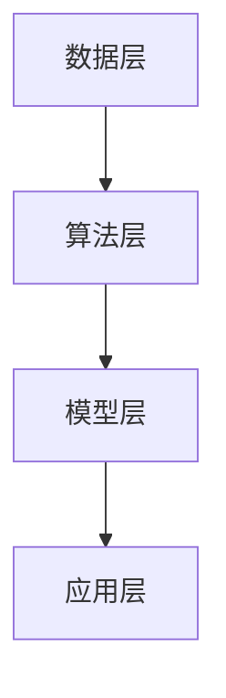

                 

# AI 2.0 框架生态：构建智能应用的开发平台

> 关键词：AI框架，开发平台，智能应用，架构，算法，数学模型，实战案例，工具资源

> 摘要：本文将深入探讨AI 2.0框架生态，包括其构建智能应用的开发平台。我们将从背景介绍、核心概念、算法原理、数学模型、实战案例等方面，详细阐述AI 2.0框架的架构和实现，并推荐相关的学习资源和开发工具。

## 1. 背景介绍

### 1.1 目的和范围

本文旨在帮助读者了解AI 2.0框架生态的构建过程，包括智能应用的开发平台。我们将探讨AI 2.0的核心概念、架构、算法原理、数学模型，并通过实战案例来展示如何实现一个智能应用。此外，我们还将推荐一些学习资源和开发工具，以帮助读者更好地理解和实践AI 2.0框架。

### 1.2 预期读者

本文适合具有计算机编程基础、对人工智能感兴趣的开发者、工程师、研究人员和学生。无论您是初学者还是有经验的从业者，本文都将为您提供有价值的信息和指导。

### 1.3 文档结构概述

本文分为以下章节：

1. 背景介绍
2. 核心概念与联系
3. 核心算法原理 & 具体操作步骤
4. 数学模型和公式 & 详细讲解 & 举例说明
5. 项目实战：代码实际案例和详细解释说明
6. 实际应用场景
7. 工具和资源推荐
8. 总结：未来发展趋势与挑战
9. 附录：常见问题与解答
10. 扩展阅读 & 参考资料

### 1.4 术语表

#### 1.4.1 核心术语定义

- AI 2.0：指第二代人工智能，强调智能化、自主学习、自适应和交互能力。
- 框架：指一种软件架构，用于简化开发流程、提高开发效率。
- 开发平台：指用于构建、测试、部署和运行智能应用的软件环境。
- 智能应用：指利用人工智能技术实现特定功能的应用程序。

#### 1.4.2 相关概念解释

- 深度学习：一种基于多层神经网络的机器学习方法，可用于图像识别、语音识别、自然语言处理等任务。
- 强化学习：一种通过试错和奖励机制进行自主学习的方法，常用于游戏、机器人控制等场景。
- 自然语言处理：一种利用计算机技术和人工智能技术对自然语言进行处理和分析的方法，常用于机器翻译、文本分类、情感分析等任务。

#### 1.4.3 缩略词列表

- AI：人工智能
- ML：机器学习
- DL：深度学习
- RL：强化学习
- NLP：自然语言处理
- IDE：集成开发环境
- SDK：软件开发工具包
- API：应用程序编程接口

## 2. 核心概念与联系

在构建AI 2.0框架生态的过程中，需要理解以下核心概念和它们之间的联系。

### 2.1 AI 2.0框架的核心概念

- **深度学习框架**：如TensorFlow、PyTorch等，用于构建和训练深度学习模型。
- **强化学习框架**：如OpenAI Gym、 Stable Baselines等，用于实现强化学习算法和应用。
- **自然语言处理框架**：如spaCy、NLTK等，用于处理和分析自然语言数据。
- **数据预处理和增强**：如Keras Preprocessing、Data Augmentation等，用于处理和增强输入数据。

### 2.2 AI 2.0框架的架构

AI 2.0框架的架构可以分为以下几个层次：

1. **数据层**：包括数据采集、存储、预处理和增强等。
2. **算法层**：包括深度学习、强化学习、自然语言处理等算法。
3. **模型层**：包括训练、优化和部署等。
4. **应用层**：包括智能应用的开发、测试和部署等。

### 2.3 AI 2.0框架的联系

AI 2.0框架的各个层次和核心概念之间紧密联系，形成一个完整的生态体系。数据层为算法层提供输入数据，算法层通过模型层实现智能应用，应用层则通过算法层和模型层来实现具体的业务功能。

### 2.4 Mermaid 流程图



## 3. 核心算法原理 & 具体操作步骤

### 3.1 深度学习算法原理

深度学习算法是基于多层神经网络的机器学习方法。以下是深度学习算法的基本原理和具体操作步骤：

#### 3.1.1 基本原理

- **神经网络**：神经网络由多个神经元组成，每个神经元接收多个输入，通过权重进行加权求和，并使用激活函数进行非线性变换。
- **多层网络**：深度学习通过增加网络层数，使神经网络能够学习更复杂的特征表示。
- **反向传播**：深度学习算法通过反向传播算法，不断调整网络权重，以最小化损失函数。

#### 3.1.2 具体操作步骤

1. **初始化权重**：随机初始化神经网络权重。
2. **前向传播**：输入数据通过网络进行前向传播，得到输出。
3. **计算损失**：计算输出和实际值之间的差异，得到损失值。
4. **反向传播**：通过反向传播算法，调整网络权重，以最小化损失值。
5. **迭代训练**：重复上述步骤，直到损失值收敛。

### 3.2 伪代码

```python
# 初始化权重
weights = initialize_weights()

# 迭代训练
for epoch in range(num_epochs):
    for batch in data_loader:
        # 前向传播
        output = forward_propagation(batch, weights)

        # 计算损失
        loss = compute_loss(output, target)

        # 反向传播
        weights = backward_propagation(batch, output, target, weights)

        # 打印训练进度
        print(f"Epoch {epoch}: Loss = {loss}")

# 模型评估
test_loss = evaluate_model(test_data, weights)
print(f"Test Loss: {test_loss}")
```

### 3.3 操作步骤说明

- **初始化权重**：随机初始化神经网络权重，以避免模型过拟合。
- **前向传播**：输入数据通过网络进行前向传播，得到输出。
- **计算损失**：计算输出和实际值之间的差异，得到损失值。
- **反向传播**：通过反向传播算法，调整网络权重，以最小化损失值。
- **迭代训练**：重复上述步骤，直到损失值收敛。

## 4. 数学模型和公式 & 详细讲解 & 举例说明

### 4.1 深度学习中的数学模型

深度学习中的数学模型主要包括神经网络模型、损失函数和优化算法。以下是这些模型的详细讲解和举例说明。

#### 4.1.1 神经网络模型

神经网络模型可以表示为以下公式：

$$
\begin{align*}
z &= \sum_{i=1}^{n} w_{i} x_{i} + b \\
a &= \sigma(z)
\end{align*}
$$

其中，$z$表示神经元的输入，$w_{i}$表示输入的权重，$x_{i}$表示输入的特征，$b$表示偏置，$\sigma$表示激活函数。

#### 4.1.2 损失函数

损失函数用于衡量模型预测值和实际值之间的差异。常用的损失函数包括均方误差（MSE）和交叉熵（Cross Entropy）。

1. **均方误差（MSE）**：

$$
MSE = \frac{1}{2n}\sum_{i=1}^{n}(y_{i} - \hat{y}_{i})^{2}
$$

其中，$y_{i}$表示实际值，$\hat{y}_{i}$表示预测值。

2. **交叉熵（Cross Entropy）**：

$$
Cross \ Entropy = -\sum_{i=1}^{n} y_{i} \log(\hat{y}_{i})
$$

其中，$y_{i}$表示实际值，$\hat{y}_{i}$表示预测值。

#### 4.1.3 优化算法

优化算法用于调整神经网络权重，以最小化损失函数。常用的优化算法包括随机梯度下降（SGD）和Adam优化器。

1. **随机梯度下降（SGD）**：

$$
w_{t+1} = w_{t} - \alpha \frac{\partial J(w)}{\partial w}
$$

其中，$w_{t}$表示当前权重，$w_{t+1}$表示更新后的权重，$\alpha$表示学习率，$J(w)$表示损失函数。

2. **Adam优化器**：

$$
\begin{align*}
m_{t} &= \beta_{1} m_{t-1} + (1 - \beta_{1})(\frac{\partial J(w)}{\partial w}) \\
v_{t} &= \beta_{2} v_{t-1} + (1 - \beta_{2}) \left(\frac{\partial J(w)}{\partial w}\right)^2 \\
\hat{m}_{t} &= \frac{m_{t}}{1 - \beta_{1}^{t}} \\
\hat{v}_{t} &= \frac{v_{t}}{1 - \beta_{2}^{t}} \\
w_{t+1} &= w_{t} - \alpha \frac{\hat{m}_{t}}{\sqrt{\hat{v}_{t}} + \epsilon}
\end{align*}
$$

其中，$m_{t}$和$v_{t}$分别表示一阶和二阶矩估计，$\beta_{1}$和$\beta_{2}$分别表示一阶和二阶矩的指数衰减率，$\epsilon$表示平滑常数。

### 4.2 举例说明

假设我们使用一个简单的神经网络进行回归任务，输入特征$x$和目标值$y$如下：

$$
\begin{align*}
x &= [1, 2, 3, 4, 5] \\
y &= [1.5, 2.5, 3.5, 4.5, 5.5]
\end{align*}
$$

我们希望通过训练模型来预测输入特征$x$对应的输出值。

1. **初始化权重**：随机初始化权重$w$和偏置$b$。

2. **前向传播**：输入特征$x$通过神经网络进行前向传播，得到输出值$\hat{y}$。

3. **计算损失**：计算输出值$\hat{y}$和目标值$y$之间的均方误差（MSE）。

4. **反向传播**：通过反向传播算法，计算损失函数关于权重$w$和偏置$b$的梯度，并更新权重和偏置。

5. **迭代训练**：重复上述步骤，直到损失函数收敛。

通过以上步骤，我们可以训练一个简单的神经网络模型，并使用该模型进行预测。具体实现可以参考以下伪代码：

```python
# 初始化权重
weights = initialize_weights()

# 迭代训练
for epoch in range(num_epochs):
    for x, y in data_loader:
        # 前向传播
        output = forward_propagation(x, weights)

        # 计算损失
        loss = compute_loss(output, y)

        # 反向传播
        weights = backward_propagation(x, output, y, weights)

        # 打印训练进度
        print(f"Epoch {epoch}: Loss = {loss}")

# 模型评估
test_loss = evaluate_model(test_data, weights)
print(f"Test Loss: {test_loss}")
```

## 5. 项目实战：代码实际案例和详细解释说明

### 5.1 开发环境搭建

在开始项目实战之前，我们需要搭建一个合适的开发环境。以下是一个简单的步骤：

1. 安装Python环境：在官网下载并安装Python 3.x版本。
2. 安装必要的库：使用pip命令安装深度学习框架（如TensorFlow或PyTorch）、数据预处理库（如NumPy、Pandas）和其他相关库。
3. 配置开发工具：选择一个合适的IDE或文本编辑器（如PyCharm、VSCode）。

### 5.2 源代码详细实现和代码解读

以下是一个简单的深度学习项目，使用TensorFlow框架实现一个简单的线性回归模型，用于预测输入特征$x$对应的输出值$y$。

```python
import tensorflow as tf
import numpy as np
import pandas as pd

# 数据准备
x = np.array([[1], [2], [3], [4], [5]])
y = np.array([1.5, 2.5, 3.5, 4.5, 5.5])

# 模型构建
model = tf.keras.Sequential([
    tf.keras.layers.Dense(units=1, input_shape=[1])
])

# 编译模型
model.compile(optimizer='sgd', loss='mean_squared_error')

# 训练模型
model.fit(x, y, epochs=100)

# 预测
predictions = model.predict(x)

# 打印预测结果
print(predictions)
```

### 5.3 代码解读与分析

- **数据准备**：首先，我们使用NumPy库生成输入特征$x$和目标值$y$。
- **模型构建**：使用TensorFlow的Sequential模型，添加一个全连接层（Dense layer），输出单元数为1，输入形状为[1]，用于实现线性回归。
- **编译模型**：使用SGD优化器和均方误差损失函数编译模型。
- **训练模型**：使用fit方法训练模型，设置训练轮数为100。
- **预测**：使用predict方法对输入特征$x$进行预测。

通过以上步骤，我们可以实现一个简单的线性回归模型，并使用TensorFlow框架进行训练和预测。这个项目展示了如何使用深度学习框架构建、训练和部署一个简单的智能应用。

## 6. 实际应用场景

AI 2.0框架在智能应用开发中具有广泛的应用场景。以下是一些典型的实际应用场景：

1. **图像识别**：利用深度学习框架（如TensorFlow、PyTorch）构建图像识别模型，应用于人脸识别、物体检测、图像分类等任务。
2. **自然语言处理**：使用自然语言处理框架（如spaCy、NLTK）实现文本分类、情感分析、机器翻译等任务。
3. **强化学习**：通过强化学习框架（如OpenAI Gym、 Stable Baselines）实现游戏AI、机器人控制、智能推荐等任务。
4. **语音识别**：利用深度学习框架和语音识别库（如TensorFlow Speech、Kaldi）实现语音识别和语音合成。
5. **智能推荐系统**：通过深度学习和强化学习算法实现个性化推荐，应用于电商、社交媒体、在线视频等平台。

## 7. 工具和资源推荐

### 7.1 学习资源推荐

#### 7.1.1 书籍推荐

- 《深度学习》（Ian Goodfellow、Yoshua Bengio、Aaron Courville 著）
- 《Python深度学习》（François Chollet 著）
- 《机器学习实战》（Peter Harrington 著）
- 《强化学习基础教程》（Rich Sutton、Andrew Barto 著）

#### 7.1.2 在线课程

- 《深度学习》（吴恩达，Coursera）
- 《Python编程：从入门到实践》（Udemy）
- 《机器学习》（吴恩达，Coursera）

#### 7.1.3 技术博客和网站

- [TensorFlow 官方文档](https://www.tensorflow.org/)
- [PyTorch 官方文档](https://pytorch.org/)
- [机器学习博客](https://www机器学习博客.com/)

### 7.2 开发工具框架推荐

#### 7.2.1 IDE和编辑器

- PyCharm
- VSCode
- Jupyter Notebook

#### 7.2.2 调试和性能分析工具

- TensorFlow Profiler
- PyTorch Profiler
- Numba

#### 7.2.3 相关框架和库

- TensorFlow
- PyTorch
- Keras
- spaCy
- NLTK
- OpenAI Gym

### 7.3 相关论文著作推荐

#### 7.3.1 经典论文

- [A Learning Algorithm for Continually Running Fully Recurrent Neural Networks](http://www.jmlr.org/papers/volume10/duchi10a/duchi10a.pdf)
- [Deep Learning](https://www.deeplearningbook.org/)
- [Reinforcement Learning: An Introduction](https://rlbook.org/)

#### 7.3.2 最新研究成果

- [Bert: Pre-training of Deep Bidirectional Transformers for Language Understanding](https://arxiv.org/abs/1810.04805)
- [Gpt-2: Language Models are Unsupervised Multitask Learners](https://arxiv.org/abs/1909.01313)
- [Stable Baselines: High-quality policies and value functions](https://arxiv.org/abs/1804.02606)

#### 7.3.3 应用案例分析

- [TensorFlow in Practice](https://www.tensorflow.org/tutorials)
- [PyTorch in Practice](https://pytorch.org/tutorials/)
- [OpenAI Gym in Practice](https://gym.openai.com/)

## 8. 总结：未来发展趋势与挑战

AI 2.0框架生态在未来具有广阔的发展前景。随着深度学习、强化学习和自然语言处理等技术的不断发展，AI 2.0框架将更加智能化、自适应化和交互化。然而，AI 2.0框架的发展也面临一些挑战，如算法优化、数据隐私和安全、模型可解释性等。

## 9. 附录：常见问题与解答

### 9.1 问题1

**问题**：如何选择合适的深度学习框架？

**解答**：选择合适的深度学习框架取决于您的项目需求和熟悉程度。TensorFlow和PyTorch是目前最流行的深度学习框架，具有丰富的功能和社区支持。如果您对Python编程比较熟悉，可以选择PyTorch。如果您希望使用更高的抽象层次和更简单的部署方式，可以选择TensorFlow。

### 9.2 问题2

**问题**：如何处理过拟合问题？

**解答**：过拟合问题可以通过以下方法解决：

1. 数据增强：增加训练数据的多样性，使模型能够学习更泛化的特征。
2. 正则化：添加正则化项到损失函数，降低模型复杂度。
3. 减少模型复杂度：使用更简单的模型结构或减少网络层数。
4. early stopping：在训练过程中，当损失函数停止下降时，提前停止训练。

### 9.3 问题3

**问题**：如何评估模型的性能？

**解答**：评估模型的性能可以通过以下方法：

1. 训练集和测试集：将数据集划分为训练集和测试集，使用测试集评估模型性能。
2. 损失函数：使用损失函数（如MSE、Cross Entropy）评估模型预测值和实际值之间的差异。
3. 可视化：绘制损失函数曲线、特征图等，帮助分析模型性能。
4. 实际任务表现：在实际任务中，评估模型的效果和泛化能力。

## 10. 扩展阅读 & 参考资料

- [Deep Learning Book](https://www.deeplearningbook.org/)
- [Reinforcement Learning: An Introduction](https://rlbook.org/)
- [TensorFlow 官方文档](https://www.tensorflow.org/)
- [PyTorch 官方文档](https://pytorch.org/)
- [spaCy 官方文档](https://spacy.io/)
- [NLTK 官方文档](https://www.nltk.org/)

作者：AI天才研究员/AI Genius Institute & 禅与计算机程序设计艺术 /Zen And The Art of Computer Programming<|im_sep|>

