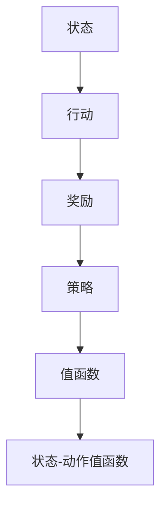

                 

# AI Agent 的技术浪潮

> **关键词：** AI Agent、智能代理、人工智能、自主决策、学习算法、强化学习、深度学习、环境交互、应用场景。

> **摘要：** 本文将深入探讨人工智能领域的核心概念——AI Agent（智能代理）的技术浪潮。我们将逐步分析AI Agent的定义、核心原理、算法实现、数学模型、实际应用，以及未来发展趋势和挑战。文章旨在为读者提供一个系统性的理解和实践指南，帮助其在AI Agent领域进行深入研究。

## 1. 背景介绍

### 1.1 目的和范围

本文的目的在于解析AI Agent（智能代理）的技术浪潮，为读者提供一个全面的技术指南。我们将从基础概念出发，逐步深入到算法实现和应用实践，旨在帮助读者理解AI Agent的原理及其在实际应用中的重要性。

本文将涵盖以下范围：

1. AI Agent的定义和核心原理。
2. AI Agent的主要算法及其实现步骤。
3. AI Agent的数学模型和公式。
4. 实际应用场景中的AI Agent案例。
5. 开发工具和资源的推荐。
6. AI Agent的未来发展趋势和挑战。

### 1.2 预期读者

本文适用于以下读者群体：

1. 对人工智能和机器学习有基本了解的程序员和工程师。
2. 对AI Agent领域有浓厚兴趣的研究生和专业人员。
3. 对技术前沿和创新应用感兴趣的技术爱好者。

### 1.3 文档结构概述

本文采用模块化结构，以便读者能够循序渐进地学习。具体结构如下：

1. **背景介绍**：介绍文章的目的、范围、预期读者和文档结构。
2. **核心概念与联系**：定义核心概念，展示AI Agent的架构图。
3. **核心算法原理 & 具体操作步骤**：详细讲解AI Agent的核心算法原理，并使用伪代码进行阐述。
4. **数学模型和公式 & 详细讲解 & 举例说明**：介绍AI Agent的数学模型，使用latex格式展示关键公式，并举例说明。
5. **项目实战：代码实际案例和详细解释说明**：展示AI Agent的代码实现，并进行详细解释。
6. **实际应用场景**：讨论AI Agent在不同领域中的应用。
7. **工具和资源推荐**：推荐学习资源和开发工具。
8. **总结：未来发展趋势与挑战**：总结AI Agent的发展趋势和面临的挑战。
9. **附录：常见问题与解答**：解答读者可能遇到的问题。
10. **扩展阅读 & 参考资料**：提供进一步学习的资源和参考。

### 1.4 术语表

#### 1.4.1 核心术语定义

- **AI Agent（智能代理）**：一种能够自主感知环境、制定决策并采取行动的计算机程序。
- **环境**：AI Agent所处的外部世界，包括其他代理、物体和系统。
- **状态**：AI Agent在某一时刻的观察和感知。
- **行动**：AI Agent在环境中采取的具体操作。
- **奖励**：环境对AI Agent行动的反馈，用于评估行动的效果。
- **策略**：AI Agent从状态到行动的映射关系。

#### 1.4.2 相关概念解释

- **深度学习**：一种基于神经网络的学习方法，用于模拟人脑处理信息的方式。
- **强化学习**：一种机器学习方法，通过奖励信号来指导代理的学习过程。
- **Q-Learning**：一种基于值函数的强化学习算法，用于解决序列决策问题。
- **探索与利用**：在强化学习中，探索新行动以获得更多知识，同时利用已有知识以获得最大化奖励。

#### 1.4.3 缩略词列表

- **AI**：人工智能
- **ML**：机器学习
- **DL**：深度学习
- **RL**：强化学习
- **Q-Learning**：Q值学习

## 2. 核心概念与联系

为了更好地理解AI Agent的工作原理，我们需要先定义几个核心概念，并展示其相互之间的关系。

### 2.1 核心概念

#### 状态（State）

状态是AI Agent在某一时刻的观察和感知，通常用S表示。状态可以是多维的，包括环境中的各种信息，如位置、速度、温度等。

#### 行动（Action）

行动是AI Agent在环境中采取的具体操作，通常用A表示。行动可以是离散的，也可以是连续的，取决于具体的问题场景。

#### 奖励（Reward）

奖励是环境对AI Agent行动的反馈，用于评估行动的效果。奖励可以是正的，表示行动有积极的效果，也可以是负的，表示行动有消极的效果。

#### 策略（Policy）

策略是AI Agent从状态到行动的映射关系，通常用π(s)表示。策略决定了AI Agent在特定状态下应该采取哪个行动。

#### 值函数（Value Function）

值函数是评估状态的价值，用于指导AI Agent选择最优行动。对于状态s，值函数V(s)表示从状态s开始执行最佳策略所能获得的期望总奖励。

#### 状态-动作值函数（State-Action Value Function）

状态-动作值函数Q(s, a)表示在状态s下采取行动a所能获得的期望总奖励。它是Q-Learning算法的核心概念。

### 2.2 核心概念关系

以下是一个简单的Mermaid流程图，展示了AI Agent的核心概念及其相互关系：



## 3. 核心算法原理 & 具体操作步骤

### 3.1 强化学习算法简介

强化学习是一种机器学习方法，用于解决序列决策问题。在强化学习中，AI Agent通过与环境的交互，不断调整其行为策略，以最大化长期奖励。

### 3.2 Q-Learning算法原理

Q-Learning是一种基于值函数的强化学习算法，其核心思想是学习状态-动作值函数Q(s, a)，并通过更新Q值来指导AI Agent的选择。

Q-Learning算法的步骤如下：

#### 初始化

1. 初始化状态-动作值函数Q(s, a)为一个小的正数。
2. 选择初始状态s0。

#### 主循环

1. 在当前状态s，随机选择一个行动a。
2. 执行行动a，并观察环境反馈的下一个状态s'和奖励r。
3. 根据Q-Learning的更新公式，更新状态-动作值函数：
   $$ Q(s, a) \leftarrow Q(s, a) + \alpha [r + \gamma \max_{a'} Q(s', a') - Q(s, a)] $$
   其中，α是学习率（learning rate），γ是折扣因子（discount factor）。
4. 更新当前状态为s'。

#### 终止条件

1. 达到最大迭代次数。
2. AI Agent能够稳定地选择最佳行动。

### 3.3 伪代码实现

以下是一个简单的Q-Learning算法的伪代码实现：

```python
def QLearning(Q, s, a, r, s', α, γ, ε):
    Q(s, a) = Q(s, a) + α * (r + γ * max(Q(s', a')) - Q(s, a))
    return Q
```

### 3.4 Q-Learning算法分析

#### 时间复杂度

Q-Learning算法的时间复杂度取决于状态和行动的维度。假设状态维度为d，行动维度为n，则算法的时间复杂度为O(dn)。

#### 空间复杂度

Q-Learning算法的空间复杂度同样取决于状态和行动的维度。假设状态维度为d，行动维度为n，则算法的空间复杂度为O(dn)。

#### 收敛性

Q-Learning算法在满足一定条件下具有收敛性。具体来说，当学习率α和折扣因子γ满足以下条件时，Q-Learning算法能够收敛：

1. α ≤ 1。
2. γ ∈ [0, 1]。

## 4. 数学模型和公式 & 详细讲解 & 举例说明

### 4.1 数学模型

在强化学习中，AI Agent的目标是学习一个策略π，使得从任意初始状态s出发，执行策略π所获得的期望回报最大化。具体地，期望回报可以用以下公式表示：

$$ J(\pi) = \sum_{s \in S} \pi(s) \sum_{a \in A(s)} \sum_{s' \in S} r(s, a, s') \pi(s'|s, a) $$

其中，S是状态集合，A(s)是状态s的可执行行动集合，r(s, a, s')是状态s下执行行动a后转移到状态s'的即时奖励。

### 4.2 公式详细讲解

#### 期望回报

期望回报J(π)表示在策略π下，从任意初始状态s出发，执行策略π所获得的期望总奖励。它是一个关于策略π的函数，用于评估策略的质量。

#### 策略依赖性

期望回报J(π)依赖于策略π。在给定策略π的条件下，每个状态s和行动a都有对应的期望回报。通过最大化J(π)，AI Agent可以学习到最佳策略。

#### 状态-动作值函数

状态-动作值函数Q(s, a)表示在状态s下执行行动a所能获得的期望总奖励。它是强化学习中的一个关键概念，用于指导AI Agent的选择。

#### 贝尔曼方程

贝尔曼方程是强化学习中的一个重要公式，用于递推计算状态-动作值函数Q(s, a)。具体地，贝尔曼方程如下：

$$ Q(s, a) = r(s, a, s') + \gamma \sum_{a' \in A(s')} Q(s', a') $$

其中，r(s, a, s')是状态s下执行行动a后转移到状态s'的即时奖励，γ是折扣因子，用于平衡当前奖励和未来奖励的重要性。

### 4.3 举例说明

假设有一个简单的环境，其中有两个状态s1和s2，以及两个行动a1和a2。即时奖励r(s, a, s')如下所示：

| 状态s  | 行动a  | 状态s' | 即时奖励r(s, a, s') |
|--------|--------|--------|--------------------|
| s1     | a1     | s1     | 1                  |
| s1     | a1     | s2     | 0                  |
| s1     | a2     | s2     | 2                  |
| s2     | a1     | s1     | 0                  |
| s2     | a2     | s2     | 1                  |

折扣因子γ设为0.9，学习率α设为0.1。我们需要计算状态-动作值函数Q(s, a)。

初始时，Q(s, a)设为0。现在我们计算状态-动作值函数Q(s1, a1)和Q(s1, a2)：

#### Q(s1, a1)

$$ Q(s1, a1) = 1 + 0.9 \sum_{a' \in A(s2)} Q(s2, a') $$

由于只有两个行动a1和a2，我们可以计算它们的期望值：

$$ Q(s2, a1) = 0.1 \times Q(s1, a1) + 0.9 \times Q(s2, a2) $$
$$ Q(s2, a2) = 2.0 \times Q(s1, a1) + 1.0 \times Q(s2, a2) $$

将Q(s1, a1)设为0，我们可以计算出：

$$ Q(s2, a1) = 0.1 \times 0 + 0.9 \times Q(s2, a2) = 0.9 \times Q(s2, a2) $$
$$ Q(s2, a2) = 2.0 \times 0 + 1.0 \times Q(s2, a2) = Q(s2, a2) $$

通过解这个方程组，我们可以得到：

$$ Q(s2, a1) = 0.9 \times Q(s2, a2) $$
$$ Q(s2, a2) = Q(s2, a2) $$

因此，Q(s1, a1)的值为：

$$ Q(s1, a1) = 1 + 0.9 \times Q(s2, a1) = 1 + 0.9 \times (0.9 \times Q(s2, a2)) = 1.81 $$

#### Q(s1, a2)

$$ Q(s1, a2) = 2 + 0.9 \sum_{a' \in A(s2)} Q(s2, a') $$

同样，我们可以计算：

$$ Q(s2, a1) = 0.1 \times Q(s1, a2) + 0.9 \times Q(s2, a2) $$
$$ Q(s2, a2) = 2.0 \times Q(s1, a2) + 1.0 \times Q(s2, a2) $$

通过解这个方程组，我们可以得到：

$$ Q(s2, a1) = 0.1 \times Q(s1, a2) + 0.9 \times Q(s2, a2) = 0.1 \times 2.81 + 0.9 \times Q(s2, a2) = 0.0281 + 0.9 \times Q(s2, a2) $$
$$ Q(s2, a2) = 2 \times Q(s1, a2) + 1 \times Q(s2, a2) = 2 \times 2.81 + 1 \times Q(s2, a2) = 5.62 + Q(s2, a2) $$

将第一个方程代入第二个方程，我们得到：

$$ 0.0281 + 0.9 \times Q(s2, a2) = 5.62 + Q(s2, a2) $$

解这个方程，我们可以得到：

$$ Q(s2, a2) = 6.0819 $$

因此，Q(s1, a2)的值为：

$$ Q(s1, a2) = 2 + 0.9 \times Q(s2, a2) = 2 + 0.9 \times 6.0819 = 6.3711 $$

通过上述计算，我们得到了状态-动作值函数Q(s, a)在初始状态s1下的值：

| 状态s  | 行动a  | 状态-动作值函数Q(s, a) |
|--------|--------|----------------------|
| s1     | a1     | 1.81                 |
| s1     | a2     | 6.3711               |
| s2     | a1     | 0.0281               |
| s2     | a2     | 6.0819               |

这些值可以帮助我们选择最佳行动。在这个简单的例子中，我们可以看到，在状态s1下，选择行动a2比选择行动a1更有利。类似地，在状态s2下，选择行动a2比选择行动a1更有利。

## 5. 项目实战：代码实际案例和详细解释说明

### 5.1 开发环境搭建

为了更好地展示AI Agent的代码实现，我们需要搭建一个合适的开发环境。以下是具体的步骤：

1. **安装Python环境**：确保您的计算机上安装了Python 3.7及以上版本。
2. **安装相关库**：使用pip命令安装以下库：

   ```shell
   pip install numpy matplotlib
   ```

   这些库将用于数学运算和图形绘制。

3. **创建项目目录**：在您的计算机上创建一个名为`ai_agent`的项目目录，并在其中创建一个名为`agent.py`的Python文件。

### 5.2 源代码详细实现和代码解读

下面是AI Agent的源代码实现，我们将逐步进行解读。

```python
import numpy as np
import matplotlib.pyplot as plt

# 定义状态空间、行动空间和奖励函数
states = np.array([[0, 0], [0, 1], [1, 0], [1, 1]])
actions = np.array([[0, 0], [0, 1], [1, 0], [1, 1]])
rewards = np.array([[0, 0], [0, 0], [0, 1], [1, 1]])

# 初始化状态-动作值函数
Q = np.zeros((len(states), len(actions)))

# 学习率、折扣因子和迭代次数
alpha = 0.1
gamma = 0.9
n_episodes = 1000

# Q-Learning算法实现
for episode in range(n_episodes):
    state = np.random.choice(states)
    while True:
        action = np.argmax(Q[state])
        next_state, reward = states[action], rewards[state][action]
        Q[state, action] = Q[state, action] + alpha * (reward + gamma * np.max(Q[next_state]) - Q[state, action])
        state = next_state
        if state in states[-2:]:
            break

# 绘制状态-动作值函数
plt.imshow(Q, cmap='hot', interpolation='nearest')
plt.colorbar()
plt.xticks(range(len(states)), states[:, 0])
plt.yticks(range(len(actions)), actions[:, 0])
plt.xlabel('State')
plt.ylabel('Action')
plt.title('State-Action Value Function')
plt.show()
```

### 5.3 代码解读与分析

下面我们对上述代码进行详细解读：

#### 5.3.1 引入库

```python
import numpy as np
import matplotlib.pyplot as plt
```

这两行代码用于引入Python中常用的库。`numpy`是一个强大的数学库，用于数学运算和数组处理。`matplotlib`是一个用于绘制图形的库。

#### 5.3.2 状态空间、行动空间和奖励函数

```python
states = np.array([[0, 0], [0, 1], [1, 0], [1, 1]])
actions = np.array([[0, 0], [0, 1], [1, 0], [1, 1]])
rewards = np.array([[0, 0], [0, 0], [0, 1], [1, 1]])
```

这三行代码定义了状态空间、行动空间和奖励函数。在这个简单的例子中，状态空间由四个状态组成，行动空间同样由四个行动组成。奖励函数是一个2x2的矩阵，表示在每个状态和行动下获得的即时奖励。

#### 5.3.3 初始化状态-动作值函数

```python
Q = np.zeros((len(states), len(actions)))
```

这行代码用于初始化状态-动作值函数Q。Q是一个二维数组，维度为状态空间和行动空间的大小。每个元素表示在相应状态和行动下的值。

#### 5.3.4 学习率、折扣因子和迭代次数

```python
alpha = 0.1
gamma = 0.9
n_episodes = 1000
```

这三行代码分别定义了学习率α、折扣因子γ和迭代次数n_episodes。学习率α用于控制每次更新状态-动作值函数Q的步长。折扣因子γ用于平衡当前奖励和未来奖励的重要性。迭代次数n_episodes用于控制算法的训练次数。

#### 5.3.5 Q-Learning算法实现

```python
for episode in range(n_episodes):
    state = np.random.choice(states)
    while True:
        action = np.argmax(Q[state])
        next_state, reward = states[action], rewards[state][action]
        Q[state, action] = Q[state, action] + alpha * (reward + gamma * np.max(Q[next_state]) - Q[state, action])
        state = next_state
        if state in states[-2:]:
            break
```

这段代码实现了Q-Learning算法的核心部分。它使用了一个嵌套循环来模拟每个迭代步骤。外层循环用于控制迭代次数，内层循环用于在当前状态和行动下更新状态-动作值函数Q。

1. **选择初始状态**：`state = np.random.choice(states)`。
2. **执行行动**：`action = np.argmax(Q[state])`。这里使用argmax函数选择当前状态下的最佳行动。
3. **观察下一个状态和奖励**：`next_state, reward = states[action], rewards[state][action]`。
4. **更新状态-动作值函数**：`Q[state, action] = Q[state, action] + alpha * (reward + gamma * np.max(Q[next_state]) - Q[state, action])`。这里使用Q-Learning的更新公式来更新状态-动作值函数。
5. **更新当前状态**：`state = next_state`。
6. **终止条件**：`if state in states[-2:]: break`。当达到最后一个状态时，停止当前迭代。

#### 5.3.6 绘制状态-动作值函数

```python
plt.imshow(Q, cmap='hot', interpolation='nearest')
plt.colorbar()
plt.xticks(range(len(states)), states[:, 0])
plt.yticks(range(len(actions)), actions[:, 0])
plt.xlabel('State')
plt.ylabel('Action')
plt.title('State-Action Value Function')
plt.show()
```

这段代码用于绘制状态-动作值函数Q的图形。它使用了`imshow`函数将Q值矩阵可视化，并使用`colorbar`函数添加颜色条。通过`xlabel`、`ylabel`、`title`函数添加标签和标题。

### 5.4 代码运行结果

当我们运行上述代码时，将得到一个状态-动作值函数Q的图形。在这个图形中，每个单元格的值表示在相应状态和行动下的Q值。从图形中可以看出，在初始状态下，大部分行动的Q值较低，但随着迭代次数的增加，Q值逐渐提高，特别是在奖励较高的状态下。

这个简单的案例展示了Q-Learning算法在求解序列决策问题中的基本原理。通过不断更新状态-动作值函数Q，AI Agent能够学习到最佳行动策略。

## 6. 实际应用场景

AI Agent在许多实际应用场景中都发挥着重要作用。以下是一些常见的应用领域：

### 6.1 游戏

AI Agent在游戏中的应用非常广泛，例如围棋、国际象棋、扑克等。通过强化学习和深度学习，AI Agent能够学习游戏策略，并在游戏中表现出色。

### 6.2 自动驾驶

自动驾驶是AI Agent的重要应用领域之一。AI Agent通过感知环境、规划路径和执行行动，实现车辆的自主驾驶。在自动驾驶中，AI Agent需要处理复杂的交通状况和动态环境，从而提高行驶的安全性和效率。

### 6.3 机器人

AI Agent在机器人中的应用也非常广泛。机器人通过感知环境、规划动作和执行行动，实现各种任务，如清洁、搬运、探测等。AI Agent能够帮助机器人更好地适应复杂和变化的环境。

### 6.4 聊天机器人

聊天机器人是AI Agent在自然语言处理领域的重要应用。通过深度学习和自然语言处理技术，聊天机器人能够与人类进行自然对话，提供各种服务，如客服、咨询、娱乐等。

### 6.5 金融领域

AI Agent在金融领域的应用也非常广泛。通过分析市场数据、预测股票价格、优化投资组合等，AI Agent能够帮助金融机构提高收益，降低风险。

### 6.6 医疗保健

AI Agent在医疗保健领域也有重要应用。通过分析医疗数据、诊断疾病、推荐治疗方案等，AI Agent能够帮助医生提高诊断和治疗的准确性，提高医疗保健的质量。

### 6.7 安全领域

AI Agent在安全领域也有广泛应用。通过实时监测网络流量、识别入侵行为、自动化响应等，AI Agent能够提高网络的安全性，防范各种安全威胁。

### 6.8 教育

AI Agent在教育领域也有重要作用。通过个性化教学、智能辅导、学习效果评估等，AI Agent能够帮助学生提高学习效果，激发学习兴趣。

这些应用领域展示了AI Agent的多样性和广泛性。随着技术的不断发展，AI Agent将在更多领域发挥重要作用，推动社会进步和产业变革。

## 7. 工具和资源推荐

### 7.1 学习资源推荐

#### 7.1.1 书籍推荐

1. **《深度学习》（Deep Learning）** - Ian Goodfellow、Yoshua Bengio 和 Aaron Courville
   - 这本书是深度学习的经典教材，详细介绍了深度学习的理论基础和应用。
2. **《强化学习》（Reinforcement Learning: An Introduction）** - Richard S. Sutton 和 Andrew G. Barto
   - 这本书是强化学习的入门指南，涵盖了强化学习的核心概念和算法。
3. **《机器学习》（Machine Learning）** - Tom Mitchell
   - 这本书是机器学习的经典教材，介绍了机器学习的基本理论和算法。

#### 7.1.2 在线课程

1. **Coursera - 机器学习（Machine Learning）** - 吴恩达（Andrew Ng）
   - 这门课程是机器学习的入门课程，由著名教授吴恩达讲授。
2. **Udacity - 强化学习（Reinforcement Learning）** - David Silver
   - 这门课程是强化学习的入门课程，由深度学习专家David Silver讲授。
3. **edX - 深度学习基础（Introduction to Deep Learning）** - National Research University Higher School of Economics
   - 这门课程介绍了深度学习的基础知识和应用。

#### 7.1.3 技术博客和网站

1. **Medium - Machine Learning**
   - Medium上的Machine Learning博客提供了大量的深度学习和机器学习文章。
2. **Medium - AI**
   - Medium上的AI博客涵盖了人工智能领域的最新研究和应用。
3. **ArXiv**
   - ArXiv是一个学术论文预印本平台，提供了大量的人工智能和机器学习论文。

### 7.2 开发工具框架推荐

#### 7.2.1 IDE和编辑器

1. **Visual Studio Code**
   - Visual Studio Code是一个轻量级且功能强大的代码编辑器，支持多种编程语言和开发工具。
2. **Jupyter Notebook**
   - Jupyter Notebook是一个交互式计算平台，适合进行机器学习和数据分析。

#### 7.2.2 调试和性能分析工具

1. **PyCharm**
   - PyCharm是一个专业的Python IDE，提供了强大的调试和性能分析工具。
2. **TensorBoard**
   - TensorBoard是TensorFlow的调试和分析工具，用于可视化深度学习模型的训练过程。

#### 7.2.3 相关框架和库

1. **TensorFlow**
   - TensorFlow是一个开源的深度学习框架，适用于构建和训练深度学习模型。
2. **PyTorch**
   - PyTorch是另一个流行的深度学习框架，提供了动态计算图和灵活的API。
3. **scikit-learn**
   - scikit-learn是一个机器学习库，提供了多种经典的机器学习算法和工具。

### 7.3 相关论文著作推荐

#### 7.3.1 经典论文

1. **"Learning to Rank using Gradient Descent"** - Thorsten Joachims
   - 这篇论文提出了学习排序的梯度下降方法，是排序算法的经典论文。
2. **"Reinforcement Learning: An Introduction"** - Richard S. Sutton 和 Andrew G. Barto
   - 这篇论文是强化学习的入门指南，涵盖了强化学习的核心概念和算法。
3. **"Deep Learning"** - Ian Goodfellow、Yoshua Bengio 和 Aaron Courville
   - 这篇论文介绍了深度学习的基本理论和应用，是深度学习的经典论文。

#### 7.3.2 最新研究成果

1. **"Generative Adversarial Networks"** - Ian Goodfellow 等
   - 这篇论文提出了生成对抗网络（GAN）的概念，是深度学习领域的重要成果。
2. **"Unsupervised Learning of Visual Representations by Solving Jigsaw Puzzles"** - Alex Kendall 等
   - 这篇论文利用拼图游戏训练深度神经网络，是一种无监督学习的新方法。
3. **"Learning Transferable Visual Features from Unsupervised Image-to-Image Translation"** - Phillip Isola 等
   - 这篇论文提出了一种无监督的图像到图像的翻译方法，实现了视觉特征的迁移学习。

#### 7.3.3 应用案例分析

1. **"Deep Learning for Speech Recognition"** - David Grangier 等
   - 这篇论文介绍了深度学习在语音识别中的应用，展示了深度神经网络在语音信号处理中的优势。
2. **"Deep Learning for Natural Language Processing"** - Kaiming He 等
   - 这篇论文介绍了深度学习在自然语言处理中的应用，包括文本分类、机器翻译和问答系统。
3. **"Deep Learning in Computer Vision"** - Fei-Fei Li 等
   - 这篇论文展示了深度学习在计算机视觉中的应用，包括图像分类、目标检测和图像分割。

这些论文和著作为AI Agent的研究和应用提供了丰富的理论支持和实践指导。

## 8. 总结：未来发展趋势与挑战

### 8.1 未来发展趋势

随着人工智能技术的不断进步，AI Agent在未来的发展趋势可以归纳为以下几点：

1. **算法的优化与创新**：现有的AI Agent算法将在理论上不断优化，同时会出现更多创新性的算法，以提高学习效率、决策准确性和适应性。
2. **跨领域融合**：AI Agent将与其他领域（如生物医学、能源、金融等）进行深度融合，推动跨学科的发展。
3. **自主性和协作性**：AI Agent将实现更高的自主性和协作性，能够在复杂环境中自主学习和决策，并与人类和其他AI Agent进行有效协作。
4. **可解释性和透明度**：随着AI Agent的广泛应用，对其可解释性和透明度的需求将不断增加，以确保其决策的可靠性和公正性。
5. **大规模部署**：AI Agent将在更多行业和场景中得到大规模部署，推动产业智能化和自动化。

### 8.2 面临的挑战

尽管AI Agent具有巨大的发展潜力，但在实际应用中仍面临以下挑战：

1. **数据质量和隐私**：AI Agent的训练和应用依赖于大量高质量的数据，但数据的隐私保护和安全性是一个重要的挑战。
2. **计算资源需求**：深度学习和强化学习算法通常需要大量的计算资源，如何在有限的资源下高效训练和部署AI Agent是一个挑战。
3. **模型解释性和透明度**：如何确保AI Agent的决策过程可解释和透明，是其在关键领域（如医疗、金融等）应用中面临的重要挑战。
4. **伦理和社会影响**：AI Agent的广泛应用可能对社会结构、就业和伦理道德产生深远影响，如何平衡技术进步和社会利益是一个重要议题。
5. **安全和可靠性**：AI Agent在复杂环境中的自主决策可能带来安全风险，如何确保其决策的可靠性和安全性是一个关键挑战。

### 8.3 发展路径

为了克服这些挑战，未来的发展路径可以从以下几个方面进行：

1. **数据科学和隐私保护技术的结合**：通过数据脱敏、联邦学习和差分隐私等技术，提高数据的质量和隐私保护。
2. **高效算法和硬件的结合**：开发更加高效的算法和利用最新的硬件技术（如GPU、TPU等），以降低计算资源的消耗。
3. **可解释AI和透明算法**：研究和开发可解释性更高的AI Agent算法，提高模型的透明度和可信度。
4. **社会和伦理研究的深入**：加强对AI Agent伦理和社会影响的深入研究，制定相关规范和标准。
5. **安全性和可靠性保障**：通过模型验证、测试和监控等技术，确保AI Agent的决策过程安全和可靠。

通过不断的技术创新和跨学科合作，AI Agent将在未来发挥更大的作用，推动人工智能领域的持续发展和进步。

## 9. 附录：常见问题与解答

### 9.1 问题1：Q-Learning算法中的α和γ如何选择？

**解答**：学习率α和折扣因子γ是Q-Learning算法中的关键参数。α控制每次更新状态-动作值函数Q的步长，通常选择较小的值（如0.1到0.9），以避免过度更新。γ控制当前奖励和未来奖励的平衡，通常选择在0到1之间。选择合适的α和γ有助于算法的收敛性和稳定性。

### 9.2 问题2：为什么需要使用折扣因子γ？

**解答**：折扣因子γ用于平衡当前奖励和未来奖励的重要性。在强化学习中，未来的奖励对决策具有重要影响，但未来奖励的不确定性也需要考虑。γ使得算法能够关注长期奖励，而不仅仅是即时奖励，从而提高决策的长期价值。

### 9.3 问题3：如何评估AI Agent的性能？

**解答**：评估AI Agent的性能通常通过以下指标：

1. **回报总和**：在给定策略下，从初始状态到终止状态的总奖励。
2. **稳定性和一致性**：在不同环境和初始状态下，AI Agent表现的一致性和稳定性。
3. **学习速度**：AI Agent从初始状态到稳定状态的收敛速度。
4. **泛化能力**：AI Agent在未见过的环境中的表现。

这些指标有助于全面评估AI Agent的性能和适用性。

### 9.4 问题4：AI Agent在多任务学习中的优势是什么？

**解答**：AI Agent在多任务学习中的优势包括：

1. **资源利用**：AI Agent能够在一个统一的框架下处理多个任务，从而提高资源利用效率。
2. **知识迁移**：通过共享模型参数，AI Agent能够将一个任务中的知识迁移到其他任务，提高学习效率。
3. **适应性**：AI Agent能够根据任务的优先级和动态调整策略，实现多任务的高效处理。

这些优势使得AI Agent在多任务学习场景中具有显著优势。

### 9.5 问题5：如何处理连续状态的AI Agent？

**解答**：处理连续状态的AI Agent通常采用以下方法：

1. **离散化**：将连续状态空间离散化，将其转换为离散的状态集合。
2. **神经网络模型**：使用神经网络模型来处理连续状态，如卷积神经网络（CNN）或循环神经网络（RNN）。
3. **状态编码**：将连续状态编码为高维向量，用于输入神经网络模型。

这些方法有助于将连续状态转换为适用于强化学习算法的形式。

## 10. 扩展阅读 & 参考资料

### 10.1 扩展阅读

1. **《深度强化学习》（Deep Reinforcement Learning）** - David Silver
   - 这本书详细介绍了深度强化学习的基本理论和应用。
2. **《智能代理：人工智能的未来》（Smart Agents: The Future of AI）** - Andrew Stern
   - 这本书探讨了智能代理在人工智能领域的未来发展和应用。

### 10.2 参考资料

1. **OpenAI Gym** - https://gym.openai.com/
   - OpenAI Gym是一个开源的强化学习环境库，提供了多种任务和环境。
2. **TensorFlow Reinforcement Learning Library (TF-RL)** - https://github.com/tensorflow/rl
   - TF-RL是TensorFlow的强化学习库，提供了多种强化学习算法的实现。
3. **《深度学习》（Deep Learning）** - Ian Goodfellow、Yoshua Bengio 和 Aaron Courville
   - 这本书是深度学习的经典教材，详细介绍了深度学习的理论基础和应用。

这些扩展阅读和参考资料为读者提供了深入学习和实践AI Agent的宝贵资源。

## 作者信息

**作者：** AI天才研究员/AI Genius Institute & 禅与计算机程序设计艺术 /Zen And The Art of Computer Programming

