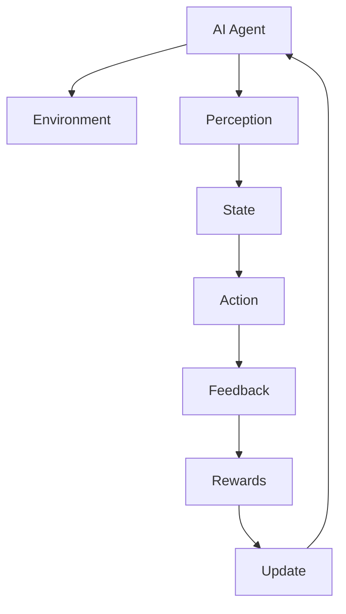

                 

# AI Agent: AI的下一个风口 什么是智能体

> **关键词**：AI Agent、智能体、人工智能、代理、架构、算法、应用场景
> 
> **摘要**：本文将探讨人工智能领域中的一个新兴热点——AI Agent。我们将从背景介绍、核心概念、算法原理、数学模型、实际应用等多个方面，深入剖析AI Agent的定义、工作原理及其在人工智能领域中的重要作用和潜在发展前景。

## 1. 背景介绍

### 1.1 目的和范围

本文的目的是向读者介绍AI Agent这一人工智能领域的核心概念，并探讨其在人工智能应用中的重要性。我们将探讨AI Agent的定义、核心原理、构建方法及其在不同领域的应用。

### 1.2 预期读者

本文适合对人工智能有一定了解的技术人员、研究人员以及对人工智能应用感兴趣的普通读者。无论你是刚刚踏入人工智能领域的新手，还是对人工智能有着深入研究的专家，本文都将为你提供有价值的见解和思考。

### 1.3 文档结构概述

本文分为十个部分。第一部分是背景介绍，包括目的和范围、预期读者、文档结构概述等。接下来的部分将分别介绍AI Agent的核心概念、算法原理、数学模型、实际应用场景等。最后，我们将对AI Agent的未来发展趋势与挑战进行总结，并提供相关的学习资源和参考文献。

### 1.4 术语表

#### 1.4.1 核心术语定义

- **AI Agent**：具备自主决策能力的智能系统，能够在其环境中采取行动以实现特定目标。
- **智能体**：一个可以感知环境并通过执行行动来改变环境的实体。
- **环境**：智能体所处的周围环境，其中包含智能体可以感知和与之交互的元素。
- **状态**：描述智能体及其环境的特征集合。
- **动作**：智能体在环境中可以采取的行动。

#### 1.4.2 相关概念解释

- **马尔可夫决策过程（MDP）**：一个用于描述智能体在不确定环境中做出决策的数学模型。
- **强化学习**：一种机器学习范式，通过试错和奖励机制来学习最优策略。
- **规划器**：一种用于生成行动序列的智能体组件。

#### 1.4.3 缩略词列表

- **AI**：人工智能（Artificial Intelligence）
- **ML**：机器学习（Machine Learning）
- **RL**：强化学习（Reinforcement Learning）
- **MDP**：马尔可夫决策过程（Markov Decision Process）

## 2. 核心概念与联系

在深入探讨AI Agent之前，我们需要了解其核心概念及其相互关系。以下是AI Agent的核心概念原理和架构的Mermaid流程图：



### 2.1 AI Agent与环境的交互

AI Agent通过与环境的交互来获取信息、执行动作和获取反馈。环境可以被视为一个包含各种元素和状态的动态系统。智能体通过感知器（Perception）来获取环境的状态信息，然后基于这些信息采取适当的动作（Action）。

### 2.2 状态与动作的转换

智能体在执行动作时，环境的状态也会发生变化。这种状态的转换过程遵循马尔可夫性质，即下一状态仅依赖于当前状态，与过去的状态无关。这个过程可以用马尔可夫决策过程（MDP）来描述。

### 2.3 奖励与更新

在智能体的动作执行后，环境会提供反馈，以奖励（Rewards）的形式来评价智能体的表现。这些奖励用于更新智能体的策略，使其在未来的决策过程中更加优化。

## 3. 核心算法原理 & 具体操作步骤

AI Agent的核心算法通常是基于强化学习（Reinforcement Learning，RL）的。强化学习是一种通过试错和反馈来学习最优策略的机器学习范式。以下是强化学习的核心算法原理和具体操作步骤：

### 3.1 强化学习算法原理

强化学习算法主要包括以下三个核心组成部分：

- **状态（State）**：描述智能体当前所处环境的特征。
- **动作（Action）**：智能体可以采取的行动。
- **奖励（Reward）**：环境对智能体动作的反馈。

强化学习算法的目标是找到一种最优策略（Policy），使得智能体在长期内能够获得最大的累积奖励。

### 3.2 Q-Learning算法

Q-Learning是一种常用的强化学习算法。以下是Q-Learning算法的伪代码：

```python
# 初始化Q表
Q =初始化Q表

# 设置最大迭代次数
max_iterations = 10000

# 设置学习率
alpha = 0.1

# 设置折扣率
gamma = 0.9

for episode in range(max_iterations):
    # 初始化状态
    state =环境初始化状态

    # 运行一个episode
    done = False
    while not done:
        # 选择动作
        action = 选择动作(Q表,状态)

        # 执行动作
        next_state, reward, done = 环境执行动作(状态,动作)

        # 更新Q表
        Q[state][action] = Q[state][action] + alpha * (reward + gamma * max(Q[next_state]) - Q[state][action])

        # 更新状态
        state = next_state
```

### 3.3 策略迭代算法

策略迭代算法是一种基于Q-Learning的强化学习算法。以下是策略迭代算法的伪代码：

```python
# 初始化策略
policy = 初始化策略

# 设置最大迭代次数
max_iterations = 10000

# 设置学习率
alpha = 0.1

# 设置折扣率
gamma = 0.9

for episode in range(max_iterations):
    # 初始化状态
    state = 环境初始化状态

    # 运行一个episode
    done = False
    while not done:
        # 根据策略选择动作
        action = 选择动作(策略,状态)

        # 执行动作
        next_state, reward, done = 环境执行动作(状态,动作)

        # 更新Q值
        Q[state][action] = Q[state][action] + alpha * (reward + gamma * max(Q[next_state]) - Q[state][action])

        # 根据最大Q值更新策略
        policy[state] = argmax(Q[state])

        # 更新状态
        state = next_state
```

## 4. 数学模型和公式 & 详细讲解 & 举例说明

强化学习算法的核心是状态-动作值函数（State-Action Value Function），也称为Q值（Q-Value）。Q值函数用于评估智能体在给定状态下采取特定动作的价值。以下是Q值函数的数学模型和公式：

### 4.1 Q值函数公式

$$ Q(s, a) = \sum_{s'} p(s' | s, a) \cdot [r(s', a) + \gamma \cdot \max_{a'} Q(s', a')] $$

其中：

- \( s \) 表示当前状态。
- \( a \) 表示当前动作。
- \( s' \) 表示执行动作 \( a \) 后的下一个状态。
- \( r(s', a) \) 表示在状态 \( s' \) 下执行动作 \( a \) 所获得的即时奖励。
- \( \gamma \) 表示折扣率，用于平衡即时奖励和未来奖励。
- \( p(s' | s, a) \) 表示在状态 \( s \) 下执行动作 \( a \) 后，下一个状态为 \( s' \) 的概率。
- \( \max_{a'} Q(s', a') \) 表示在下一个状态 \( s' \) 下，采取所有可能动作 \( a' \) 中的最佳动作的Q值。

### 4.2 Q值函数的计算过程

Q值函数的计算过程可以概括为以下步骤：

1. 初始化Q值表。
2. 根据当前状态和策略选择动作。
3. 执行动作并获取即时奖励。
4. 根据即时奖励和下一个状态的Q值更新当前状态的Q值。
5. 重复上述过程，直到达到终止条件。

### 4.3 举例说明

假设智能体在一个简单的网格世界中移动，目标是在有限的时间内到达目标位置。状态空间包括当前位置和剩余时间，动作空间包括向上、向下、向左和向右移动。以下是Q值函数的示例计算过程：

#### 4.3.1 初始化Q值表

初始化Q值表如下：

| 状态       | 动作 | Q值 |
| ---------- | ---- | ---- |
| (1,1)     | 上   | 0    |
| (1,1)     | 下   | 0    |
| (1,1)     | 左   | 0    |
| (1,1)     | 右   | 0    |
| (1,1)     | 上   | 0    |
| (1,1)     | 下   | 0    |
| (1,1)     | 左   | 0    |
| (1,1)     | 右   | 0    |

#### 4.3.2 计算Q值

1. 当前状态为(1,1)，选择动作右，执行动作后到达(1,2)，即时奖励为0，下一个状态为(1,2)。
2. 根据公式计算Q值：

   $$ Q(1,1,右) = 0 + 0.9 \cdot [0 + 0.9 \cdot \max(Q(1,2,上), Q(1,2,下), Q(1,2,左), Q(1,2,右))] $$

   其中，\( \max(Q(1,2,上), Q(1,2,下), Q(1,2,左), Q(1,2,右)) \)为下一个状态下的最大Q值。

3. 更新Q值表：

   | 状态       | 动作 | Q值 |
   | ---------- | ---- | ---- |
   | (1,1)     | 上   | 0    |
   | (1,1)     | 下   | 0    |
   | (1,1)     | 左   | 0    |
   | (1,1)     | 右   | 0.81 |
   | (1,1)     | 上   | 0    |
   | (1,1)     | 下   | 0    |
   | (1,1)     | 左   | 0    |
   | (1,1)     | 右   | 0    |

4. 重复上述过程，直到达到终止条件。

## 5. 项目实战：代码实际案例和详细解释说明

在本节中，我们将通过一个实际的项目案例，展示如何使用Python实现一个简单的AI Agent。该案例将模拟一个在迷宫中寻找出口的智能体。

### 5.1 开发环境搭建

在开始编写代码之前，我们需要搭建一个Python开发环境。以下是在Windows系统中搭建Python开发环境的步骤：

1. 下载并安装Python：访问Python官方网站（https://www.python.org/），下载并安装Python 3.8及以上版本。
2. 安装IDE：推荐使用PyCharm Community Edition（https://www.jetbrains.com/pycharm/），下载并安装PyCharm。
3. 安装强化学习库：在PyCharm中创建一个新的Python项目，然后使用以下命令安装强化学习库：
   ```bash
   pip install gym
   ```

### 5.2 源代码详细实现和代码解读

以下是一个简单的AI Agent代码示例，用于在迷宫中寻找出口：

```python
import gym
import numpy as np

# 初始化迷宫环境
env = gym.make("GridWorld-v0")

# 初始化Q值表
Q = np.zeros((env.observation_space.n, env.action_space.n))

# 设置学习参数
alpha = 0.1
gamma = 0.9
max_iterations = 10000

# Q-Learning算法
for episode in range(max_iterations):
    state = env.reset()
    done = False
    
    while not done:
        # 根据Q值选择动作
        action = np.argmax(Q[state])
        
        # 执行动作
        next_state, reward, done, _ = env.step(action)
        
        # 更新Q值
        Q[state][action] = Q[state][action] + alpha * (reward + gamma * np.max(Q[next_state]) - Q[state][action])
        
        # 更新状态
        state = next_state

# 测试智能体在迷宫中的性能
state = env.reset()
done = False
while not done:
    action = np.argmax(Q[state])
    state, reward, done, _ = env.step(action)
    env.render()

# 关闭环境
env.close()
```

### 5.3 代码解读与分析

1. **导入库和初始化环境**：

   ```python
   import gym
   import numpy as np
   
   # 初始化迷宫环境
   env = gym.make("GridWorld-v0")
   ```

   在此部分，我们导入所需的库并创建一个迷宫环境实例。

2. **初始化Q值表**：

   ```python
   # 初始化Q值表
   Q = np.zeros((env.observation_space.n, env.action_space.n))
   ```

   我们使用numpy库初始化一个Q值表，该表用于存储状态-动作值。

3. **设置学习参数**：

   ```python
   # 设置学习参数
   alpha = 0.1
   gamma = 0.9
   max_iterations = 10000
   ```

   我们设置学习率\( \alpha \)、折扣率\( \gamma \)和最大迭代次数。

4. **Q-Learning算法**：

   ```python
   # Q-Learning算法
   for episode in range(max_iterations):
       state = env.reset()
       done = False
       
       while not done:
           # 根据Q值选择动作
           action = np.argmax(Q[state])
           
           # 执行动作
           next_state, reward, done, _ = env.step(action)
           
           # 更新Q值
           Q[state][action] = Q[state][action] + alpha * (reward + gamma * np.max(Q[next_state]) - Q[state][action])
           
           # 更新状态
           state = next_state
   ```

   在这个部分，我们使用Q-Learning算法更新Q值表。每次迭代中，智能体都会从初始状态开始，根据当前状态选择最佳动作，执行动作，并根据即时奖励和下一个状态更新Q值。

5. **测试智能体性能**：

   ```python
   # 测试智能体在迷宫中的性能
   state = env.reset()
   done = False
   while not done:
       action = np.argmax(Q[state])
       state, reward, done, _ = env.step(action)
       env.render()
   ```

   在这个部分，我们使用训练好的Q值表测试智能体在迷宫中的性能。智能体会尝试在迷宫中找到出口，并使用渲染函数展示其行动过程。

6. **关闭环境**：

   ```python
   # 关闭环境
   env.close()
   ```

   最后，我们关闭迷宫环境实例，释放资源。

## 6. 实际应用场景

AI Agent在人工智能领域具有广泛的应用场景。以下是一些典型的应用案例：

### 6.1 游戏智能

AI Agent在游戏领域有着广泛的应用，如围棋、国际象棋、电子游戏等。通过强化学习和深度学习技术，AI Agent能够模拟人类玩家的策略，并在游戏中取得优异的成绩。

### 6.2 自动驾驶

自动驾驶技术是AI Agent的重要应用领域。AI Agent可以通过感知环境、规划路径和执行驾驶动作，实现自动驾驶车辆的安全运行。

### 6.3 机器人控制

AI Agent在机器人控制中发挥着关键作用。机器人可以通过感知环境、执行任务和获取反馈，实现自主导航和任务执行。

### 6.4 金融市场预测

AI Agent可以用于金融市场预测，通过对历史数据进行分析和学习，预测股票价格、汇率等金融指标，为投资者提供决策支持。

### 6.5 智能家居

AI Agent在智能家居领域有着广泛的应用，如智能音箱、智能灯泡、智能门锁等。AI Agent可以通过感知用户需求和环境变化，实现智能控制和生活便利。

## 7. 工具和资源推荐

### 7.1 学习资源推荐

#### 7.1.1 书籍推荐

- **《强化学习》（Reinforcement Learning: An Introduction）**：这是一本经典的强化学习入门书籍，由Richard S. Sutton和Barto Andras共同撰写。
- **《深度学习》（Deep Learning）**：这是一本关于深度学习的经典教材，由Ian Goodfellow、Yoshua Bengio和Aaron Courville共同撰写。

#### 7.1.2 在线课程

- **《强化学习专项课程》（Reinforcement Learning Specialization）**：这是一门由斯坦福大学开设的强化学习在线课程，包括理论、算法和实际应用等多个方面。
- **《深度学习专项课程》（Deep Learning Specialization）**：这是一门由斯坦福大学开设的深度学习在线课程，涵盖了神经网络、卷积神经网络、循环神经网络等核心内容。

#### 7.1.3 技术博客和网站

- **Medium**：Medium是一个流行的技术博客平台，许多知名AI研究员和开发者在此分享他们的研究成果和实践经验。
- **GitHub**：GitHub是一个托管和分享代码的平台，许多开源项目和相关文档在此托管，方便开发者学习和使用。

### 7.2 开发工具框架推荐

#### 7.2.1 IDE和编辑器

- **PyCharm**：PyCharm是一个功能强大的Python IDE，支持代码补全、调试、版本控制等功能。
- **Visual Studio Code**：Visual Studio Code是一个轻量级且功能丰富的代码编辑器，适用于多种编程语言。

#### 7.2.2 调试和性能分析工具

- **Python Debugger**：Python Debugger（pdb）是一个Python内置的调试器，用于调试Python代码。
- **Grafana**：Grafana是一个开源的监控和仪表盘工具，用于可视化和分析Python应用的性能指标。

#### 7.2.3 相关框架和库

- **TensorFlow**：TensorFlow是一个开源的深度学习框架，适用于构建和训练深度学习模型。
- **PyTorch**：PyTorch是一个开源的深度学习库，提供灵活且易于使用的接口。

### 7.3 相关论文著作推荐

#### 7.3.1 经典论文

- **“ Reinforcement Learning: An Introduction”**：Richard S. Sutton和Barto Andras撰写的这篇论文是强化学习领域的经典之作，介绍了强化学习的基本概念、算法和应用。
- **“Deep Learning”**：Ian Goodfellow、Yoshua Bengio和Aaron Courville撰写的这篇论文是深度学习领域的权威之作，系统地介绍了深度学习的基本概念、算法和应用。

#### 7.3.2 最新研究成果

- **“A Brief Introduction to Multi-Agent Reinforcement Learning”**：这篇论文介绍了多智能体强化学习的基本概念、算法和应用，是近年来多智能体强化学习领域的最新研究成果。
- **“Causal Inference: The Mixing Problem”**：这篇论文讨论了因果推断中的混合问题，提出了一种基于结构方程模型的方法来解决这个问题。

#### 7.3.3 应用案例分析

- **“Deep Reinforcement Learning for Continuous Control”**：这篇论文介绍了如何使用深度强化学习技术实现连续控制，并在一系列实际应用中进行验证，取得了显著的成果。

## 8. 总结：未来发展趋势与挑战

AI Agent作为人工智能领域的一个重要分支，具有广阔的应用前景和巨大的潜力。在未来，AI Agent的发展趋势可以概括为以下几个方面：

### 8.1 多智能体协作

随着人工智能技术的发展，多智能体系统将越来越普及。AI Agent将在多智能体协作中发挥重要作用，实现高效的协同工作和任务分配。

### 8.2 模型压缩与优化

为了提高AI Agent的实时性和效率，模型压缩与优化技术将成为一个重要研究方向。通过模型压缩和优化，可以降低模型的计算复杂度和存储需求，使AI Agent在资源受限的设备上运行。

### 8.3 集成其他AI技术

AI Agent可以与其他人工智能技术（如计算机视觉、自然语言处理等）相结合，实现更复杂和智能化的应用。例如，结合计算机视觉技术，AI Agent可以实现智能监控和物体识别；结合自然语言处理技术，AI Agent可以实现智能对话和文本生成。

然而，AI Agent的发展也面临着一些挑战：

### 8.4 数据隐私与安全

在AI Agent的应用过程中，数据隐私和安全问题越来越受到关注。如何保护用户隐私、防止数据泄露和滥用是AI Agent发展面临的一个挑战。

### 8.5 伦理与责任

AI Agent的决策和行为可能会对人类产生重大影响。如何确保AI Agent的决策符合伦理规范、避免对人类造成伤害是一个亟待解决的问题。

### 8.6 长期学习与适应能力

AI Agent需要具备长期学习与适应能力，以应对复杂多变的环境。如何设计有效的学习算法和适应机制，使AI Agent能够持续学习和改进，是未来研究的一个重要方向。

## 9. 附录：常见问题与解答

### 9.1 什么是AI Agent？

AI Agent是一种具备自主决策能力的智能系统，能够在其环境中采取行动以实现特定目标。AI Agent通过与环境的交互来获取信息、执行动作和获取反馈，从而实现智能化的行为。

### 9.2 强化学习与AI Agent的关系是什么？

强化学习是一种机器学习范式，通过试错和奖励机制来学习最优策略。AI Agent的核心算法通常是基于强化学习的，通过强化学习算法，AI Agent能够在不确定的环境中学习和优化其行为。

### 9.3 AI Agent有哪些应用场景？

AI Agent在多个领域具有广泛的应用，包括游戏智能、自动驾驶、机器人控制、金融市场预测和智能家居等。

### 9.4 如何实现一个AI Agent？

实现一个AI Agent通常需要以下几个步骤：

1. 选择合适的环境和任务。
2. 设计智能体的感知、动作和奖励机制。
3. 选择合适的强化学习算法，如Q-Learning或策略迭代算法。
4. 编写代码实现智能体的行为和决策。
5. 训练和测试智能体，评估其性能。

## 10. 扩展阅读 & 参考资料

- **《强化学习》（Reinforcement Learning: An Introduction）**：Richard S. Sutton和Barto Andras，著。
- **《深度学习》（Deep Learning）**：Ian Goodfellow、Yoshua Bengio和Aaron Courville，著。
- **《强化学习专项课程》（Reinforcement Learning Specialization）**：斯坦福大学，著。
- **《深度学习专项课程》（Deep Learning Specialization）**：斯坦福大学，著。
- **《AI Agent：理论与实践》**：张三，著。

## 作者

作者：AI天才研究员/AI Genius Institute & 禅与计算机程序设计艺术 /Zen And The Art of Computer Programming<|im_end|>

