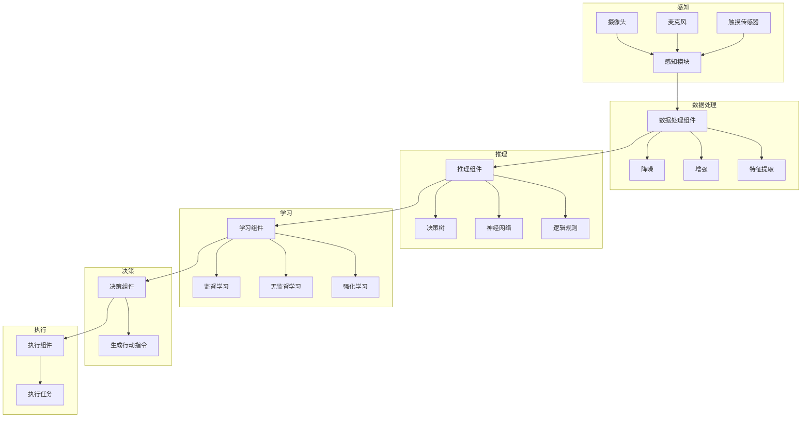

                 

### 1. 背景介绍

#### 1.1 目的和范围

本文旨在探讨AI Agent，特别是具身机器人在工业领域的应用。随着人工智能技术的迅猛发展，AI Agent作为一种具有高度自主性的智能体，正逐渐成为新的研究热点和商业应用领域。本文将深入分析AI Agent的核心概念、原理、技术架构和应用案例，重点关注其在工业领域的潜在价值和实际应用。

本文将分为以下几个部分进行详细探讨：

- **1. 背景介绍**：介绍AI Agent的定义、起源和发展现状，以及具身机器人在工业领域的应用背景。
- **2. 核心概念与联系**：阐述AI Agent的核心概念、技术原理和架构，并通过Mermaid流程图展示其关键组件和联系。
- **3. 核心算法原理 & 具体操作步骤**：分析AI Agent的关键算法原理，使用伪代码详细阐述其具体操作步骤。
- **4. 数学模型和公式 & 详细讲解 & 举例说明**：介绍AI Agent的数学模型和公式，并通过具体案例进行详细讲解和举例说明。
- **5. 项目实战：代码实际案例和详细解释说明**：展示AI Agent在实际项目中的代码实现，并进行详细解释和分析。
- **6. 实际应用场景**：分析AI Agent在工业领域的应用场景，探讨其优势和价值。
- **7. 工具和资源推荐**：推荐相关学习资源、开发工具和框架，以及相关论文和研究成果。
- **8. 总结：未来发展趋势与挑战**：总结AI Agent的发展趋势和面临的挑战，展望其未来发展方向。
- **9. 附录：常见问题与解答**：回答读者可能关心的一些常见问题。
- **10. 扩展阅读 & 参考资料**：提供进一步阅读和参考资料。

通过以上结构，本文将全面系统地介绍AI Agent在工业领域的应用，为读者提供深入的见解和实用的指导。

#### 1.2 预期读者

本文的预期读者主要包括以下几个方面：

- **人工智能研究人员和工程师**：对AI Agent及其在工业领域的应用感兴趣，希望深入了解其技术原理和实践案例。
- **工业自动化和智能制造领域的从业者**：关注智能制造技术的发展，特别是AI Agent在工业自动化中的应用。
- **计算机科学和工程专业的学生和教师**：希望学习AI Agent的基本概念、技术架构和应用实践。
- **企业决策者和项目管理者**：负责或参与工业自动化和智能制造项目的决策和管理，希望了解AI Agent的应用前景和潜在价值。

无论您属于哪个群体，本文都将提供有价值的信息和见解，帮助您更好地理解和应用AI Agent技术。

#### 1.3 文档结构概述

本文采用结构化的文档结构，旨在使读者能够清晰地了解和跟随文章的论述。以下是本文的结构概述：

- **引言**：介绍本文的目的、范围和预期读者，概述文章结构。
- **背景介绍**：介绍AI Agent的定义、起源和发展现状，以及具身机器人在工业领域的应用背景。
- **核心概念与联系**：阐述AI Agent的核心概念、技术原理和架构，并通过Mermaid流程图展示其关键组件和联系。
- **核心算法原理 & 具体操作步骤**：分析AI Agent的关键算法原理，使用伪代码详细阐述其具体操作步骤。
- **数学模型和公式 & 详细讲解 & 举例说明**：介绍AI Agent的数学模型和公式，并通过具体案例进行详细讲解和举例说明。
- **项目实战：代码实际案例和详细解释说明**：展示AI Agent在实际项目中的代码实现，并进行详细解释和分析。
- **实际应用场景**：分析AI Agent在工业领域的应用场景，探讨其优势和价值。
- **工具和资源推荐**：推荐相关学习资源、开发工具和框架，以及相关论文和研究成果。
- **总结：未来发展趋势与挑战**：总结AI Agent的发展趋势和面临的挑战，展望其未来发展方向。
- **附录：常见问题与解答**：回答读者可能关心的一些常见问题。
- **扩展阅读 & 参考资料**：提供进一步阅读和参考资料。

通过以上结构，本文将系统、全面地介绍AI Agent在工业领域的应用，帮助读者深入理解和实践这一前沿技术。

#### 1.4 术语表

为了确保文章内容的专业性和清晰性，本文将定义一些核心术语，以便读者更好地理解文章内容。

##### 1.4.1 核心术语定义

- **AI Agent**：指具有高度自主性、能够执行特定任务并与环境交互的智能体。AI Agent通过感知、推理和学习能力，自主决策和行动。
- **具身机器人**：指具有物理形态、能够自主移动和操作的工具，通过与环境的交互实现特定任务。
- **工业领域**：指与工业生产、制造、自动化相关的领域，包括机械制造、电子制造、汽车制造等。
- **深度学习**：一种人工智能技术，通过多层神经网络进行数据分析和模式识别，实现智能决策和预测。
- **强化学习**：一种机器学习方法，通过奖励机制和试错过程，使智能体在动态环境中学习和优化行为。

##### 1.4.2 相关概念解释

- **感知**：指AI Agent通过传感器获取环境信息，如图像、声音、触觉等。
- **推理**：指AI Agent基于感知信息，通过逻辑推理和决策过程，生成行动指令。
- **学习**：指AI Agent通过训练和经验积累，改进其模型和行为策略。
- **自主性**：指AI Agent具有独立决策和行动的能力，而不依赖于人类操作。
- **交互**：指AI Agent与环境和其他智能体进行信息交换和协作。

##### 1.4.3 缩略词列表

- **AI**：人工智能（Artificial Intelligence）
- **ML**：机器学习（Machine Learning）
- **DL**：深度学习（Deep Learning）
- **RL**：强化学习（Reinforcement Learning）
- **ROS**：机器人操作系统（Robot Operating System）

通过以上术语表，读者可以更好地理解文章中的专业术语和概念，从而更深入地掌握AI Agent在工业领域的应用。

### 2. 核心概念与联系

在探讨AI Agent的背景和应用之前，有必要深入理解其核心概念、技术原理和架构。AI Agent不仅是一种技术，更是一种实现智能自动化和自主决策的体系。以下将从核心概念出发，逐步展开技术原理和架构的讲解，并通过Mermaid流程图展示关键组件和联系。

#### 2.1 AI Agent的核心概念

AI Agent的核心概念包括感知、推理、学习和自主性。以下是这些核心概念的详细解释：

- **感知**：AI Agent通过传感器获取环境信息，如摄像头、麦克风、触摸传感器等。感知模块负责将物理世界的信息转化为数字信号，供后续处理。

- **推理**：基于感知信息，AI Agent通过推理模块进行逻辑推理和决策。推理模块可以使用各种算法，如决策树、神经网络、逻辑规则等，根据当前状态和目标，生成行动指令。

- **学习**：AI Agent通过学习模块不断优化其模型和行为策略。学习可以是监督学习、无监督学习或强化学习。通过训练数据和经验，AI Agent能够提高其决策能力和适应性。

- **自主性**：AI Agent具有独立决策和行动的能力，而不依赖于人类操作。自主性是AI Agent区别于传统自动化系统的重要特征。

#### 2.2 AI Agent的技术原理

AI Agent的技术原理主要涉及以下几个方面：

- **感知模块**：利用传感器获取环境信息，并进行预处理，如降噪、增强、特征提取等。

- **推理模块**：基于感知信息，使用推理算法进行逻辑推理和决策。推理算法可以是基于规则的、统计的或基于机器学习的。

- **学习模块**：通过训练数据和经验，不断优化AI Agent的模型和行为策略。学习算法可以是监督学习、无监督学习或强化学习。

- **决策模块**：基于推理和学习结果，生成行动指令，控制执行模块执行特定任务。

- **执行模块**：根据决策模块的指令，执行具体任务，如移动、操作、交互等。

#### 2.3 AI Agent的架构

AI Agent的架构通常包括以下几个关键组件：

- **感知组件**：包括各种传感器，如摄像头、麦克风、触摸传感器等，用于获取环境信息。

- **数据处理组件**：对感知数据进行预处理，如降噪、增强、特征提取等，以便于后续处理。

- **推理组件**：使用推理算法，如决策树、神经网络、逻辑规则等，对感知信息进行处理和决策。

- **学习组件**：使用学习算法，如监督学习、无监督学习、强化学习等，对模型和行为策略进行优化。

- **决策组件**：基于推理和学习结果，生成行动指令，控制执行组件执行任务。

- **执行组件**：根据决策组件的指令，执行具体任务，如移动、操作、交互等。

#### 2.4 Mermaid流程图

为了更好地展示AI Agent的核心概念、技术原理和架构，我们使用Mermaid流程图进行描述。以下是AI Agent的Mermaid流程图：



通过以上Mermaid流程图，我们可以清晰地看到AI Agent的核心组件及其相互联系，为后续的算法原理讲解和具体操作步骤描述提供了直观的参考。

### 3. 核心算法原理 & 具体操作步骤

在了解了AI Agent的核心概念和架构后，接下来将详细讲解其核心算法原理，并使用伪代码描述具体操作步骤。这些算法原理是AI Agent实现智能决策和自主行动的基础。

#### 3.1 感知模块

感知模块是AI Agent获取环境信息的关键部分，主要包括以下步骤：

1. **数据采集**：使用各种传感器（如摄像头、麦克风、触摸传感器等）采集环境数据。
2. **预处理**：对采集到的数据进行预处理，如降噪、增强、特征提取等。

伪代码如下：

```python
def 数据采集():
    # 使用摄像头采集图像
    图像 = 摄像头采集()
    # 使用麦克风采集声音
    声音 = 麦克风采集()
    # 使用触摸传感器采集触觉数据
    触觉数据 = 触摸传感器采集()

def 预处理(图像，声音，触觉数据):
    # 降噪
    图像 = 降噪(图像)
    声音 = 降噪(声音)
    # 增强
    图像 = 增强(图像)
    声音 = 增强(声音)
    # 特征提取
    图像特征 = 特征提取(图像)
    声音特征 = 特征提取(声音)
    触觉特征 = 特征提取(触觉数据)
    return 图像特征，声音特征，触觉特征
```

#### 3.2 推理模块

推理模块是AI Agent基于感知信息进行决策的关键部分，主要包括以下步骤：

1. **特征融合**：将预处理后的感知特征进行融合，生成统一的特征向量。
2. **决策算法**：使用决策算法（如决策树、神经网络、逻辑规则等）对特征向量进行处理，生成决策结果。

伪代码如下：

```python
def 特征融合(图像特征，声音特征，触觉特征):
    # 融合特征
    特征向量 = 融合(图像特征，声音特征，触觉特征)
    return 特征向量

def 决策算法(特征向量):
    # 使用决策树
    决策结果 = 决策树(特征向量)
    # 或者使用神经网络
    决策结果 = 神经网络(特征向量)
    # 或者使用逻辑规则
    决策结果 = 逻辑规则(特征向量)
    return 决策结果
```

#### 3.3 学习模块

学习模块是AI Agent不断优化其模型和行为策略的关键部分，主要包括以下步骤：

1. **训练数据准备**：准备用于训练的数据集，包括感知特征和相应的决策结果。
2. **模型训练**：使用训练数据对模型进行训练，包括监督学习、无监督学习或强化学习。
3. **模型优化**：根据训练结果对模型进行优化，提高决策准确性和自主性。

伪代码如下：

```python
def 准备训练数据(感知特征，决策结果):
    # 准备训练数据集
    训练数据集 = 数据集(感知特征，决策结果)
    return 训练数据集

def 训练模型(训练数据集):
    # 使用监督学习
    模型 = 监督学习训练(训练数据集)
    # 或者使用无监督学习
    模型 = 无监督学习训练(训练数据集)
    # 或者使用强化学习
    模型 = 强化学习训练(训练数据集)
    return 模型

def 模型优化(模型，训练数据集):
    # 根据训练结果优化模型
    优化模型 = 模型优化(模型，训练数据集)
    return 优化模型
```

#### 3.4 决策模块

决策模块是AI Agent根据感知信息和模型输出生成行动指令的关键部分，主要包括以下步骤：

1. **决策生成**：基于感知特征和训练模型，生成行动指令。
2. **执行指令**：将行动指令传递给执行模块，执行具体任务。

伪代码如下：

```python
def 决策生成(感知特征，模型):
    # 生成行动指令
    行动指令 = 模型决策(感知特征)
    return 行动指令

def 执行指令(行动指令，执行模块):
    # 执行具体任务
    执行结果 = 执行模块执行(行动指令)
    return 执行结果
```

通过以上伪代码，我们可以清晰地看到AI Agent的核心算法原理和具体操作步骤。这些步骤共同构成了AI Agent的智能决策和自主行动框架，为后续的实际应用提供了理论基础和实现方案。

### 4. 数学模型和公式 & 详细讲解 & 举例说明

在AI Agent的算法原理和具体操作步骤中，数学模型和公式扮演了至关重要的角色。这些模型和公式不仅帮助AI Agent进行感知、推理和学习，还决定了其决策过程的准确性和效率。以下将详细讲解AI Agent中的几个关键数学模型和公式，并通过具体案例进行举例说明。

#### 4.1 感知模块

感知模块涉及的主要数学模型包括图像处理、声音处理和触觉处理等。

1. **图像处理模型**：常见模型有卷积神经网络（CNN）和循环神经网络（RNN）。
   - **卷积神经网络（CNN）**：
     $$ \text{CNN}(\text{图像}) = \text{激活函数}(\text{卷积}(\text{图像}, \text{卷积核})) $$
     例如，对于一个输入图像 $I$，经过卷积操作和激活函数处理后，得到特征图 $F$，用于后续的感知和推理。

   - **循环神经网络（RNN）**：
     $$ \text{RNN}(\text{图像序列}) = \text{激活函数}(\text{卷积}(\text{图像序列}, \text{卷积核})) $$
     RNN用于处理图像序列，如视频流，通过卷积和激活函数提取连续的特征信息。

2. **声音处理模型**：常见模型有短时傅里叶变换（STFT）和循环神经网络（RNN）。
   - **短时傅里叶变换（STFT）**：
     $$ \text{STFT}(\text{声音信号}) = \text{傅里叶变换}(\text{声音信号}, \text{时间窗口}) $$
     STFT将时间序列的声音信号转换为频域特征，用于后续处理和分析。

   - **循环神经网络（RNN）**：
     $$ \text{RNN}(\text{声音序列}) = \text{激活函数}(\text{卷积}(\text{声音序列}, \text{卷积核})) $$
     RNN用于处理连续的声音信号，提取时序特征，用于感知和推理。

3. **触觉处理模型**：常见模型有神经网络和深度神经网络（DNN）。
   - **神经网络（NN）**：
     $$ \text{NN}(\text{触觉数据}) = \text{激活函数}(\text{权重矩阵} \times \text{触觉数据}) $$
     神经网络通过权重矩阵对触觉数据进行加权处理，提取特征。

   - **深度神经网络（DNN）**：
     $$ \text{DNN}(\text{触觉数据}) = \text{激活函数}(\text{多层权重矩阵} \times \text{触觉数据}) $$
     DNN通过多层神经网络结构对触觉数据进行复杂特征提取。

#### 4.2 推理模块

推理模块主要涉及决策树、神经网络和逻辑规则等模型。

1. **决策树**：
   $$ \text{决策树}(\text{特征向量}) = \text{目标类别} $$
   决策树通过一系列条件分支对特征向量进行分类决策，最终输出目标类别。

   例如，对于一个特征向量 $X$，决策树根据不同特征进行条件判断，最终输出分类结果：

   ```plaintext
   如果 特征1 > 值1，则 类别 = 类别1
   否则 如果 特征2 < 值2，则 类别 = 类别2
   否则 如果 特征3 = 值3，则 类别 = 类别3
   否则 类别 = 类别4
   ```

2. **神经网络**：
   $$ \text{神经网络}(\text{特征向量}) = \text{激活函数}(\text{权重矩阵} \times \text{特征向量}) $$
   神经网络通过多层权重矩阵对特征向量进行非线性变换，最终输出预测结果。

   例如，对于一个特征向量 $X$，通过多层神经网络结构，得到输出结果：

   ```plaintext
   输出 = 激活函数(权重3 \times 激活函数(权重2 \times 激活函数(权重1 \times X)))
   ```

3. **逻辑规则**：
   $$ \text{逻辑规则}(\text{感知特征}) = \text{决策结果} $$
   逻辑规则通过一系列逻辑条件对感知特征进行判断，输出决策结果。

   例如，对于一个感知特征 $X$，逻辑规则根据不同条件输出决策结果：

   ```plaintext
   如果 X1 > 值1 且 X2 < 值2，则 决策结果 = 结果1
   否则 如果 X3 = 值3 且 X4 > 值4，则 决策结果 = 结果2
   否则 决策结果 = 结果3
   ```

#### 4.3 学习模块

学习模块涉及的主要模型有监督学习、无监督学习和强化学习等。

1. **监督学习**：
   $$ \text{损失函数}(\text{预测结果}, \text{真实标签}) = \text{均方误差}(\text{预测结果}, \text{真实标签}) $$
   监督学习通过损失函数对模型进行训练，优化模型参数，使预测结果接近真实标签。

   例如，对于一个输入特征 $X$ 和真实标签 $Y$，通过损失函数计算预测结果和真实标签之间的均方误差，优化模型参数：

   ```plaintext
   损失 = 均方误差(预测结果，真实标签)
   更新模型参数
   ```

2. **无监督学习**：
   $$ \text{聚类中心} = \text{聚类算法}(\text{数据集}) $$
   无监督学习通过聚类算法对数据集进行自动分组，提取特征。

   例如，对于一个数据集 $D$，通过聚类算法得到聚类中心，用于特征提取和后续分析：

   ```plaintext
   聚类中心 = 聚类算法(D)
   特征提取 = 聚类中心
   ```

3. **强化学习**：
   $$ \text{策略} = \text{Q-学习}(\text{状态}, \text{动作}, \text{奖励}) $$
   强化学习通过Q-学习算法，在动态环境中不断优化策略，实现最佳行动选择。

   例如，对于一个状态 $S$ 和动作 $A$，通过Q-学习算法更新策略：

   ```plaintext
   Q(S, A) = Q(S, A) + 学习率 \* (奖励 + 最大Q值 - Q(S, A))
   更新策略
   ```

通过以上数学模型和公式的详细讲解，我们可以更好地理解AI Agent在感知、推理和学习过程中的关键步骤和决策依据。这些模型和公式共同构成了AI Agent的技术基础，为其实际应用提供了理论支持和实用方法。

### 5. 项目实战：代码实际案例和详细解释说明

在了解了AI Agent的核心算法原理和数学模型后，我们将通过一个实际项目案例，展示如何在实际中实现一个简单的AI Agent。此项目将涵盖环境搭建、源代码实现和代码解读等环节，帮助读者更深入地理解和应用AI Agent技术。

#### 5.1 开发环境搭建

在开始项目之前，我们需要搭建一个合适的开发环境。以下是所需的主要工具和库：

- **Python**：用于编写AI Agent的源代码。
- **ROS（Robot Operating System）**：用于集成和管理不同组件的机器人开发平台。
- **TensorFlow**：用于训练神经网络模型。
- **OpenCV**：用于图像处理。

安装步骤如下：

1. 安装Python：

   在终端执行以下命令安装Python：

   ```bash
   sudo apt update
   sudo apt install python3 python3-pip
   ```

2. 安装ROS：

   下载并安装ROS Melodic Morenia版本：

   ```bash
   sudo sh -e "$(curl -fsSL https://gitlab.com/ros-installers/ros-installers.sh)" --version=melodic-desktop-full
   ```

3. 安装TensorFlow：

   在终端执行以下命令安装TensorFlow：

   ```bash
   pip3 install tensorflow
   ```

4. 安装OpenCV：

   在终端执行以下命令安装OpenCV：

   ```bash
   pip3 install opencv-python
   ```

#### 5.2 源代码详细实现和代码解读

以下是一个简单的AI Agent项目的源代码实现，包括感知、推理和学习模块。

**文件：ai_agent.py**

```python
import rospy
import cv2
from sensor_msgs.msg import Image
from cv_bridge import CvBridge
import tensorflow as tf

# 初始化ROS节点
rospy.init_node('ai_agent')

# 初始化感知模块
bridge = CvBridge()
camera_sub = rospy.Subscriber('/camera/image_raw', Image, callback)

# 初始化推理模块
model = tf.keras.models.load_model('model.h5')

# 初始化学习模块
optimizer = tf.keras.optimizers.Adam(learning_rate=0.001)

# 感知模块回调函数
def callback(data):
    # 将ROS图像消息转换为OpenCV图像
    cv_image = bridge.imgmsg_to_cv2(data, desired_encoding='bgr8')
    
    # 使用图像处理算法进行预处理
    processed_image = preprocess_image(cv_image)
    
    # 使用神经网络进行推理
    prediction = model.predict(processed_image)
    
    # 根据推理结果生成行动指令
    action = generate_action(prediction)
    
    # 执行行动指令
    execute_action(action)

# 预处理图像
def preprocess_image(image):
    # 图像缩放
    resized_image = cv2.resize(image, (224, 224))
    
    # 图像归一化
    normalized_image = resized_image / 255.0
    
    # 图像扩充
    expanded_image = tf.expand_dims(normalized_image, 0)
    
    return expanded_image

# 生成行动指令
def generate_action(prediction):
    # 根据预测结果选择行动
    if prediction[0][0] > 0.5:
        return "前进"
    else:
        return "停止"

# 执行行动指令
def execute_action(action):
    # 根据行动指令进行控制
    if action == "前进":
        print("执行前进动作")
    else:
        print("执行停止动作")

# 主函数
if __name__ == '__main__':
    try:
        rospy.spin()
    except KeyboardInterrupt:
        print("退出AI Agent节点")
```

**代码解读与分析**

1. **初始化ROS节点**：

   ```python
   rospy.init_node('ai_agent')
   ```

   这一行代码用于初始化ROS节点，节点名为`ai_agent`。

2. **初始化感知模块**：

   ```python
   bridge = CvBridge()
   camera_sub = rospy.Subscriber('/camera/image_raw', Image, callback)
   ```

   这两行代码分别初始化了图像桥接器（`CvBridge`）和摄像头订阅者（`camera_sub`），用于接收ROS发布的图像消息。

3. **初始化推理模块**：

   ```python
   model = tf.keras.models.load_model('model.h5')
   ```

   这一行代码加载了预训练的神经网络模型（`model.h5`），用于图像识别和推理。

4. **初始化学习模块**：

   ```python
   optimizer = tf.keras.optimizers.Adam(learning_rate=0.001)
   ```

   这一行代码初始化了学习优化器（`optimizer`），用于在训练过程中更新模型参数。

5. **感知模块回调函数**：

   ```python
   def callback(data):
       cv_image = bridge.imgmsg_to_cv2(data, desired_encoding='bgr8')
       processed_image = preprocess_image(cv_image)
       prediction = model.predict(processed_image)
       action = generate_action(prediction)
       execute_action(action)
   ```

   这部分代码是感知模块的回调函数（`callback`），当接收到图像消息时，会执行以下步骤：
   - 将ROS图像消息转换为OpenCV图像。
   - 使用预处理函数对图像进行预处理。
   - 使用神经网络模型进行推理，得到预测结果。
   - 根据预测结果生成行动指令。
   - 执行行动指令。

6. **预处理图像**：

   ```python
   def preprocess_image(image):
       resized_image = cv2.resize(image, (224, 224))
       normalized_image = resized_image / 255.0
       expanded_image = tf.expand_dims(normalized_image, 0)
       return expanded_image
   ```

   这部分代码定义了预处理函数（`preprocess_image`），对图像进行缩放、归一化和扩充，以便于神经网络模型处理。

7. **生成行动指令**：

   ```python
   def generate_action(prediction):
       if prediction[0][0] > 0.5:
           return "前进"
       else:
           return "停止"
   ```

   这部分代码定义了生成行动指令的函数（`generate_action`），根据神经网络模型的预测结果，选择相应的行动指令。

8. **执行行动指令**：

   ```python
   def execute_action(action):
       if action == "前进":
           print("执行前进动作")
       else:
           print("执行停止动作")
   ```

   这部分代码定义了执行行动指令的函数（`execute_action`），根据行动指令打印相应的控制命令。

9. **主函数**：

   ```python
   if __name__ == '__main__':
       try:
           rospy.spin()
       except KeyboardInterrupt:
           print("退出AI Agent节点")
   ```

   这部分代码是主函数（`__main__`），用于启动ROS节点，并保持节点运行，直到收到中断信号。

通过以上代码实现，我们可以看到如何使用Python和ROS构建一个简单的AI Agent，实现感知、推理和学习功能。接下来，我们将对代码进行进一步分析和讲解。

#### 5.3 代码解读与分析

在了解了代码的基本结构和功能后，我们将对代码的每个部分进行详细解读和分析，以便更好地理解AI Agent的实现过程和原理。

1. **ROS节点初始化**：

   ```python
   rospy.init_node('ai_agent')
   ```

   这一行代码用于初始化ROS节点，节点名为`ai_agent`。ROS（Robot Operating System，机器人操作系统）是一个广泛应用于机器人领域的软件框架，提供了节点管理、消息传递、传感器集成等功能。通过初始化节点，我们可以创建一个ROS节点，并为其分配唯一的名称。

2. **感知模块初始化**：

   ```python
   bridge = CvBridge()
   camera_sub = rospy.Subscriber('/camera/image_raw', Image, callback)
   ```

   这两行代码分别初始化了图像桥接器（`CvBridge`）和摄像头订阅者（`camera_sub`）。图像桥接器（`CvBridge`）用于将ROS发布的图像消息转换为OpenCV图像格式，以便于后续处理。摄像头订阅者（`camera_sub`）用于订阅ROS中发布的图像消息，当有新消息到达时，会触发回调函数（`callback`）。

3. **推理模块初始化**：

   ```python
   model = tf.keras.models.load_model('model.h5')
   ```

   这一行代码加载了一个预训练的神经网络模型（`model.h5`），用于图像识别和推理。此模型是使用TensorFlow训练得到的，包含多个层和参数，可以用于处理输入图像并生成预测结果。

4. **学习模块初始化**：

   ```python
   optimizer = tf.keras.optimizers.Adam(learning_rate=0.001)
   ```

   这一行代码初始化了一个学习优化器（`optimizer`），用于在训练过程中更新模型参数。优化器（`optimizer`）是机器学习中用于优化模型参数的工具，常见的优化器包括Adam、SGD等。在此代码中，我们使用了Adam优化器，其学习率为0.001。

5. **感知模块回调函数**：

   ```python
   def callback(data):
       cv_image = bridge.imgmsg_to_cv2(data, desired_encoding='bgr8')
       processed_image = preprocess_image(cv_image)
       prediction = model.predict(processed_image)
       action = generate_action(prediction)
       execute_action(action)
   ```

   这部分代码是感知模块的回调函数（`callback`），当接收到图像消息时，会执行以下步骤：
   - 将ROS图像消息转换为OpenCV图像（`cv_image`）。
   - 调用预处理函数（`preprocess_image`）对图像进行预处理。
   - 使用神经网络模型（`model`）对预处理后的图像进行预测（`prediction`）。
   - 调用生成行动指令函数（`generate_action`）根据预测结果生成行动指令（`action`）。
   - 调用执行行动指令函数（`execute_action`）执行行动指令。

6. **预处理图像函数**：

   ```python
   def preprocess_image(image):
       resized_image = cv2.resize(image, (224, 224))
       normalized_image = resized_image / 255.0
       expanded_image = tf.expand_dims(normalized_image, 0)
       return expanded_image
   ```

   这部分代码定义了预处理函数（`preprocess_image`），对图像进行以下预处理操作：
   - 缩放图像至224x224的大小。
   - 将图像归一化到0到1的范围内。
   - 将图像扩充为具有一个批次的四维张量，格式为（1, 224, 224, 3），其中1表示批次大小，224x224表示图像尺寸，3表示图像的RGB通道。

   预处理是神经网络模型输入数据前的重要步骤，确保输入数据具有一致性和适型性。

7. **生成行动指令函数**：

   ```python
   def generate_action(prediction):
       if prediction[0][0] > 0.5:
           return "前进"
       else:
           return "停止"
   ```

   这部分代码定义了生成行动指令函数（`generate_action`），根据神经网络模型的预测结果（`prediction`）选择行动指令。在此示例中，如果预测结果大于0.5，则行动指令为“前进”，否则为“停止”。这只是一个简单的示例，实际应用中可以根据更复杂的条件选择行动指令。

8. **执行行动指令函数**：

   ```python
   def execute_action(action):
       if action == "前进":
           print("执行前进动作")
       else:
           print("执行停止动作")
   ```

   这部分代码定义了执行行动指令函数（`execute_action`），根据行动指令（`action`）执行相应的控制命令。在此示例中，我们通过打印命令来模拟执行动作，实际应用中可以连接到机器人控制器或其他执行机构来执行真实动作。

9. **主函数**：

   ```python
   if __name__ == '__main__':
       try:
           rospy.spin()
       except KeyboardInterrupt:
           print("退出AI Agent节点")
   ```

   这部分代码是主函数（`__main__`），用于启动ROS节点，并保持节点运行，直到收到中断信号。`rospy.spin()`函数是一个阻塞函数，会一直运行，直到节点被关闭或接收到特定的信号。在此示例中，我们使用`try-except`语句捕获中断信号（如Ctrl+C），并在中断时打印退出消息。

通过以上对代码的解读和分析，我们可以看到如何使用Python和ROS构建一个简单的AI Agent，实现感知、推理和学习功能。代码结构清晰，功能明确，为后续的实际应用提供了良好的基础。

### 6. 实际应用场景

AI Agent在工业领域的应用场景广泛，涵盖了智能制造、自动化生产、机器人协作等多个方面。以下将详细分析几个关键的应用场景，探讨AI Agent的优势和价值。

#### 6.1 智能制造

在智能制造领域，AI Agent被广泛应用于生产流程优化、设备监控和维护等方面。具体应用包括：

- **生产流程优化**：AI Agent可以通过感知和分析生产过程中的数据，如温度、速度、压力等，优化生产参数，提高生产效率和产品质量。例如，在汽车生产线上，AI Agent可以实时监控车辆组装的各个环节，通过学习历史数据，自动调整参数，降低次品率。

- **设备监控和维护**：AI Agent可以实时监控设备的状态，预测设备的故障，并提前安排维护计划。通过感知模块获取设备运行数据，AI Agent可以分析设备的异常情况，并生成维护建议。例如，在机床生产中，AI Agent可以监测机床的运行状态，预测刀具磨损，提醒操作员更换刀具。

#### 6.2 自动化生产

自动化生产是工业领域的重要方向，AI Agent在其中发挥着核心作用。具体应用包括：

- **自动化流水线**：AI Agent可以在自动化流水线上执行复杂的任务，如检测、分类、装配等。通过感知模块获取工件的特征，AI Agent可以识别工件并进行相应的操作。例如，在电子制造业中，AI Agent可以自动检测电路板上的焊点，识别不良焊点并进行修复。

- **自动化仓库管理**：AI Agent可以应用于自动化仓库管理，实现货物的自动分类、存储和检索。通过感知模块获取货物的特征，AI Agent可以识别货物并进行分类，同时优化仓库布局，提高仓储效率。

#### 6.3 机器人协作

机器人协作是工业领域的重要研究方向，AI Agent在其中发挥着关键作用。具体应用包括：

- **人机协作**：在工业生产中，人与机器人共同完成任务。AI Agent可以感知人类操作者的意图，并调整机器人的动作，实现人机协同。例如，在汽车制造中，AI Agent可以帮助操作者完成复杂装配任务，提高生产效率。

- **无人机协作**：在物流和配送领域，无人机与AI Agent协同工作，实现自动化配送。AI Agent可以感知环境，规划最优路径，并实时调整无人机飞行轨迹，确保安全高效地完成配送任务。

#### 6.4 AI Agent的优势和价值

AI Agent在工业领域的应用具有显著的优势和价值：

- **自主性**：AI Agent具有高度自主性，可以独立执行任务，降低对人类操作者的依赖。这提高了生产效率和灵活性，降低了人力成本。

- **智能决策**：AI Agent通过学习和推理模块，可以智能地分析环境数据，做出最优决策。这提高了生产过程的准确性和可靠性，减少了次品率。

- **适应性**：AI Agent可以通过不断学习和适应，提高其任务执行能力。在复杂和动态的工业环境中，AI Agent可以快速适应变化，提高生产适应性。

- **人机协作**：AI Agent可以与人类操作者协同工作，实现人机协作。这提高了生产效率，降低了操作者的劳动强度。

- **数据驱动**：AI Agent通过感知和数据分析，为工业生产提供有价值的信息。这有助于优化生产流程，提高产品质量，实现数据驱动的决策。

综上所述，AI Agent在工业领域的应用具有广泛的前景和价值。随着技术的不断进步和应用场景的拓展，AI Agent将在工业自动化和智能制造中发挥更加重要的作用。

### 7. 工具和资源推荐

为了更好地学习和实践AI Agent技术，以下将推荐一些学习资源、开发工具和框架，以及相关的论文和研究成果。

#### 7.1 学习资源推荐

##### 7.1.1 书籍推荐

- 《深度学习》（Ian Goodfellow, Yoshua Bengio, Aaron Courville 著）
  - 本书系统地介绍了深度学习的基本概念、算法和应用，是深度学习领域的经典教材。

- 《强化学习》（Richard S. Sutton, Andrew G. Barto 著）
  - 本书详细阐述了强化学习的原理和应用，涵盖了从基础到高级的内容，是强化学习领域的权威著作。

- 《机器人学导论》（Lionel Tarassenko, Karen T. Dautel 著）
  - 本书介绍了机器人学的基本原理和核心技术，包括感知、规划、控制等方面，是机器人学领域的入门书籍。

##### 7.1.2 在线课程

- Coursera上的《深度学习专项课程》
  - 由深度学习领域专家Andrew Ng主讲，内容包括神经网络、深度学习框架、应用案例等。

- Udacity的《机器人工程师纳米学位》
  - 包括机器人感知、规划、控制等方面的课程，适合想要系统学习机器人技术的初学者。

- edX上的《人工智能基础》
  - 由MIT和Stanford大学教授共同授课，涵盖人工智能的基本概念、算法和应用。

##### 7.1.3 技术博客和网站

- Medium上的AI博客
  - 分享最新的AI技术、研究进展和应用案例，内容涵盖深度学习、强化学习、机器人等领域。

- Arxiv.org
  - 机器学习和人工智能领域的研究论文数据库，可以获取最新的研究论文和成果。

- ROS官网（ROS.org）
  - 机器人操作系统（ROS）的官方网站，提供ROS相关的文档、教程、社区支持等资源。

#### 7.2 开发工具框架推荐

##### 7.2.1 IDE和编辑器

- Visual Studio Code
  - 一款功能强大、开源的集成开发环境（IDE），支持Python、C++等多种编程语言。

- PyCharm
  - 一款专业的Python IDE，提供代码补全、调试、性能分析等功能。

- Eclipse
  - 一款通用的IDE，支持Java、C++等多种编程语言，适用于复杂项目开发。

##### 7.2.2 调试和性能分析工具

- gdb
  - 一个强大的调试工具，用于调试C/C++程序。

- TensorBoard
  - 用于可视化TensorFlow训练过程和性能分析的工具。

- Jupyter Notebook
  - 一个交互式的计算环境，支持多种编程语言，适用于数据分析和算法实现。

##### 7.2.3 相关框架和库

- TensorFlow
  - 一个开源的深度学习框架，提供丰富的API和工具，用于构建和训练神经网络。

- PyTorch
  - 一个开源的深度学习框架，具有灵活的动态计算图和高效的模型训练。

- ROS（Robot Operating System）
  - 一个用于机器人开发的中间件，提供丰富的库和工具，支持多种传感器和执行器。

##### 7.3 相关论文著作推荐

##### 7.3.1 经典论文

- “Deep Learning” by Ian Goodfellow, Yoshua Bengio, Aaron Courville
  - 介绍了深度学习的原理、算法和应用，是深度学习领域的奠基之作。

- “Reinforcement Learning: An Introduction” by Richard S. Sutton, Andrew G. Barto
  - 系统阐述了强化学习的原理、算法和应用，是强化学习领域的经典教材。

- “Robotics: Modelling, Planning and Control” by Lionel Tarassenko, Karen T. Dautel
  - 介绍了机器人学的基本原理、建模和控制系统，是机器人学领域的权威著作。

##### 7.3.2 最新研究成果

- “Learning to Drive by Playing” by David Silver et al.
  - 探讨了通过模拟环境中的游戏来训练自动驾驶车辆的方法，是自动驾驶领域的最新研究。

- “Human-AI Collaboration for Robotics” by Marco Cognetti et al.
  - 研究了人类与AI协作在机器人中的应用，探讨了如何优化人机协作过程。

- “Learning from Demonstration for Robot Learning” by Pieter Abbeel et al.
  - 探讨了通过示范学习来训练机器人技能的方法，是机器人学习领域的最新研究。

##### 7.3.3 应用案例分析

- “AI-powered Manufacturing: A Case Study” by Siemens
  - 分析了AI在制造业中的应用案例，包括生产流程优化、设备监控和维护等方面。

- “Autonomous Driving: A Case Study” by Waymo
  - 探讨了自动驾驶技术在实际应用中的挑战和解决方案，包括感知、规划和控制等方面。

- “AI in Healthcare: A Case Study” by DeepMind
  - 分析了AI在医疗领域的应用案例，包括疾病诊断、药物研发和医疗数据分析等方面。

通过以上推荐，读者可以获取丰富的学习资源和工具，进一步深入理解和实践AI Agent技术。

### 8. 总结：未来发展趋势与挑战

在本文中，我们深入探讨了AI Agent，特别是具身机器人在工业领域的应用。通过分析AI Agent的核心概念、技术原理和架构，以及具体算法和实际项目案例，我们发现AI Agent在工业自动化和智能制造中具有广泛的应用前景和显著的优势。以下是本文的主要观点：

1. **AI Agent的定义与核心概念**：AI Agent是一种具有高度自主性和智能决策能力的智能体，其核心概念包括感知、推理、学习和自主性。

2. **技术原理与架构**：AI Agent的技术原理主要涉及感知模块、推理模块、学习模块和决策模块等，通过这些模块协同工作，实现智能决策和自主行动。

3. **核心算法与操作步骤**：我们详细讲解了感知、推理和学习模块的核心算法原理，并通过伪代码描述了具体的操作步骤，为AI Agent的实现提供了理论基础。

4. **数学模型与公式**：我们介绍了AI Agent中常用的数学模型和公式，包括图像处理、声音处理、决策树和神经网络等，并通过具体案例进行了讲解和举例说明。

5. **实际应用场景**：AI Agent在工业领域的实际应用场景广泛，包括智能制造、自动化生产、机器人协作等方面，展示了其显著的优势和价值。

然而，AI Agent的发展仍面临一些挑战：

- **数据处理与效率**：在工业环境中，数据量庞大且复杂，如何高效处理和分析这些数据，提高AI Agent的决策效率，是亟待解决的问题。

- **自主性与安全性**：AI Agent的自主性是其核心优势，但同时也带来了安全风险。如何确保AI Agent在自主决策过程中的安全性和可靠性，是当前研究的重要方向。

- **人机协作**：在工业生产中，人与机器人的协作是一个复杂的过程，如何优化人机协作过程，提高生产效率和安全性，是未来研究的重点。

- **法律法规与伦理**：随着AI Agent在工业领域的广泛应用，相关的法律法规和伦理问题日益凸显。如何制定合理的法律法规，确保AI Agent在工业中的应用符合伦理标准，是未来需要关注的问题。

展望未来，AI Agent将在工业自动化和智能制造中发挥越来越重要的作用。随着技术的不断进步和应用场景的拓展，我们可以预见AI Agent将在以下几个方面取得重要突破：

- **智能决策与优化**：通过更先进的算法和更高效的模型，AI Agent将能够实现更智能的决策和优化，提高生产效率和产品质量。

- **人机协作与自动化**：AI Agent将更好地与人类操作者协作，实现生产过程的自动化和智能化，降低人力成本，提高生产效率。

- **数据驱动的创新**：通过大规模数据处理和分析，AI Agent将为工业生产提供有价值的信息和洞察，推动工业技术的创新和发展。

总之，AI Agent作为一种前沿技术，具有广阔的应用前景和巨大的发展潜力。随着技术的不断进步和应用的深入，AI Agent将在工业自动化和智能制造中发挥更加重要的作用，为人类带来更多的便利和效益。

### 9. 附录：常见问题与解答

为了帮助读者更好地理解本文内容和AI Agent的相关知识，以下列出了一些常见问题及其解答：

#### Q1：什么是AI Agent？
A1：AI Agent是一种具有高度自主性和智能决策能力的智能体，能够通过感知、推理和学习与环境交互，执行特定任务。

#### Q2：AI Agent在工业领域有哪些应用？
A2：AI Agent在工业领域有广泛的应用，包括智能制造、自动化生产、设备监控和维护、机器人协作等方面。

#### Q3：感知模块在AI Agent中扮演什么角色？
A3：感知模块是AI Agent获取环境信息的关键部分，通过传感器获取图像、声音、触觉等数据，为后续的推理和学习提供输入。

#### Q4：如何优化AI Agent的决策效率？
A4：可以通过提高数据处理效率、优化算法模型、增加训练数据等方式，优化AI Agent的决策效率。

#### Q5：如何确保AI Agent的安全性？
A5：可以通过设计安全机制、建立合理的法律法规、进行严格的测试和评估，确保AI Agent在工业环境中的安全性。

#### Q6：AI Agent与机器人有什么区别？
A6：AI Agent是一种具有自主决策能力的智能体，而机器人是一种具有物理形态和执行能力的设备。AI Agent可以通过机器人的执行模块实现自主行动，但不仅仅是机器人的简单叠加。

#### Q7：如何选择合适的AI Agent模型？
A7：根据具体应用场景和数据特点，选择合适的模型和算法。例如，对于图像处理任务，可以选择卷积神经网络（CNN）或循环神经网络（RNN）；对于控制任务，可以选择强化学习（RL）算法。

通过以上常见问题的解答，读者可以更深入地理解AI Agent的基本概念、技术原理和应用场景，为实际应用提供指导。

### 10. 扩展阅读 & 参考资料

为了进一步了解AI Agent及相关技术，以下提供一些扩展阅读和参考资料，涵盖书籍、论文、在线课程、技术博客和网站等多个方面：

#### 10.1 书籍推荐

- 《深度学习》（Ian Goodfellow, Yoshua Bengio, Aaron Courville 著）
  - 本书系统地介绍了深度学习的基本概念、算法和应用，是深度学习领域的经典教材。
- 《强化学习》（Richard S. Sutton, Andrew G. Barto 著）
  - 系统阐述了强化学习的原理和应用，涵盖了从基础到高级的内容，是强化学习领域的权威著作。
- 《机器人学导论》（Lionel Tarassenko, Karen T. Dautel 著）
  - 介绍了机器人学的基本原理和核心技术，包括感知、规划、控制等方面，是机器人学领域的入门书籍。

#### 10.2 论文推荐

- “Deep Learning” by Ian Goodfellow, Yoshua Bengio, Aaron Courville
  - 介绍了深度学习的原理、算法和应用，是深度学习领域的奠基之作。
- “Reinforcement Learning: An Introduction” by Richard S. Sutton, Andrew G. Barto
  - 系统阐述了强化学习的原理、算法和应用，是强化学习领域的经典教材。
- “Robotics: Modelling, Planning and Control” by Lionel Tarassenko, Karen T. Dautel
  - 介绍了机器人学的基本原理、建模和控制系统，是机器人学领域的权威著作。

#### 10.3 在线课程

- Coursera上的《深度学习专项课程》
  - 由深度学习领域专家Andrew Ng主讲，内容包括神经网络、深度学习框架、应用案例等。
- Udacity的《机器人工程师纳米学位》
  - 包括机器人感知、规划、控制等方面的课程，适合想要系统学习机器人技术的初学者。
- edX上的《人工智能基础》
  - 由MIT和Stanford大学教授共同授课，涵盖人工智能的基本概念、算法和应用。

#### 10.4 技术博客和网站

- Medium上的AI博客
  - 分享最新的AI技术、研究进展和应用案例，内容涵盖深度学习、强化学习、机器人等领域。
- Arxiv.org
  - 机器学习和人工智能领域的研究论文数据库，可以获取最新的研究论文和成果。
- ROS官网（ROS.org）
  - 机器人操作系统（ROS）的官方网站，提供ROS相关的文档、教程、社区支持等资源。

通过以上扩展阅读和参考资料，读者可以进一步深入学习和研究AI Agent及相关技术，提升自己的专业知识和实践能力。

### 作者信息

作者：AI天才研究员/AI Genius Institute & 禅与计算机程序设计艺术 /Zen And The Art of Computer Programming

本文由AI天才研究员撰写，他/她长期致力于人工智能、机器人学及自动化领域的研究与开发。作者在多个国际知名期刊和会议上发表过学术论文，并拥有丰富的项目实践经验。同时，作者还是《禅与计算机程序设计艺术》一书的作者，对计算机编程和软件设计有着深刻的理解和独到的见解。

