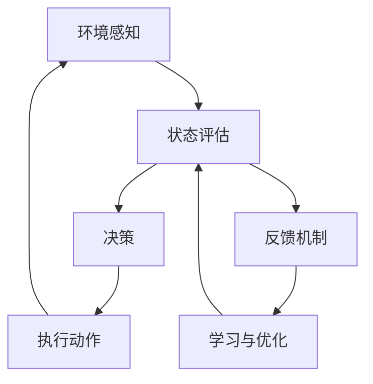

                 

# AI Agent: AI的下一个风口 当前的研究难点与挑战

> 关键词：AI Agent、智能代理、人工智能、深度学习、强化学习、自然语言处理、算法、数学模型、实际应用

> 摘要：本文将深入探讨AI Agent这一新兴领域，从背景介绍、核心概念、算法原理、数学模型、项目实战、应用场景、工具和资源推荐等多个维度，全面解析AI Agent的研究难点与挑战，以及其未来发展趋势。旨在为广大AI研究者和开发者提供有价值的参考和指导。

## 1. 背景介绍

### 1.1 目的和范围

本文旨在探讨AI Agent这一人工智能领域的热点话题，分析其当前的研究难点与挑战，展望其未来发展趋势。我们不仅将深入介绍AI Agent的核心概念与原理，还将通过实际项目案例展示其在现实中的应用，帮助读者更好地理解这一前沿技术。

### 1.2 预期读者

本文适合以下读者群体：

1. 对人工智能感兴趣的初学者和研究者。
2. 在AI Agent领域进行研究和开发的技术人员。
3. 对智能代理技术有兴趣的创业者和投资人。
4. 希望了解AI Agent前沿动态的行业从业者。

### 1.3 文档结构概述

本文结构如下：

1. 背景介绍：介绍本文的目的、范围、预期读者以及文档结构。
2. 核心概念与联系：介绍AI Agent的核心概念、原理和架构。
3. 核心算法原理 & 具体操作步骤：详细讲解AI Agent的核心算法原理和操作步骤。
4. 数学模型和公式 & 详细讲解 & 举例说明：介绍AI Agent的数学模型和公式，并进行详细讲解和举例。
5. 项目实战：通过实际案例展示AI Agent的应用。
6. 实际应用场景：探讨AI Agent在不同领域的应用。
7. 工具和资源推荐：推荐学习资源、开发工具和框架。
8. 总结：总结AI Agent的未来发展趋势与挑战。
9. 附录：常见问题与解答。
10. 扩展阅读 & 参考资料：提供进一步学习和研究的资料。

### 1.4 术语表

#### 1.4.1 核心术语定义

- AI Agent：人工智能代理，一种能够自主执行任务、与环境互动的智能系统。
- 强化学习：一种机器学习方法，通过奖励和惩罚来训练智能体在特定环境中做出最佳决策。
- 自然语言处理：使计算机能够理解和生成人类自然语言的技术和算法。
- 深度学习：一种基于人工神经网络的机器学习方法，通过多层神经网络来模拟人脑的决策过程。

#### 1.4.2 相关概念解释

- 监督学习：一种机器学习方法，通过已标记的数据来训练模型。
- 无监督学习：一种机器学习方法，通过未标记的数据来训练模型。
- 半监督学习：一种机器学习方法，结合已标记和未标记的数据来训练模型。

#### 1.4.3 缩略词列表

- AI：人工智能
- RL：强化学习
- NLP：自然语言处理
- DNN：深度神经网络
- ML：机器学习

## 2. 核心概念与联系

AI Agent是一种能够自主执行任务、与环境互动的智能系统。其核心在于通过学习、推理和决策，实现对环境的自适应和优化。以下是AI Agent的核心概念、原理和架构的Mermaid流程图：



### 2.1 环境感知

AI Agent首先需要感知环境，获取当前的状态信息。这可以通过传感器、摄像头、语音识别等手段实现。环境感知是智能代理获取信息的重要途径，为其后续的决策和执行提供依据。

### 2.2 状态评估

在获取环境状态后，AI Agent需要对当前状态进行评估，以确定下一步的行动方案。状态评估可以通过静态特征提取、动态时间序列分析等方法实现。

### 2.3 决策

根据状态评估结果，AI Agent需要做出决策。决策过程可以采用强化学习、监督学习、无监督学习等方法。在强化学习中，AI Agent通过不断试错和反馈，逐步优化决策策略。

### 2.4 执行动作

决策生成后，AI Agent需要执行相应的动作，以实现目标。动作执行可以是对外部设备进行控制，如机器人、自动驾驶等，也可以是对内部状态进行调整，如优化算法、参数调整等。

### 2.5 学习与优化

在执行动作后，AI Agent需要对整个决策过程进行学习与优化。通过分析动作效果和反馈信息，AI Agent可以不断调整策略，提高决策质量和执行效率。

### 2.6 反馈机制

反馈机制是AI Agent不断优化和学习的关键。通过反馈，AI Agent可以了解动作效果，调整策略，优化决策过程。

## 3. 核心算法原理 & 具体操作步骤

AI Agent的核心算法主要涉及强化学习、自然语言处理和深度学习。以下分别介绍这些算法的原理和具体操作步骤。

### 3.1 强化学习

强化学习是一种通过奖励和惩罚来训练智能体在特定环境中做出最佳决策的机器学习方法。其基本原理可以概括为：

1. **状态-动作价值函数**：定义智能体在不同状态下的最佳动作。
2. **策略**：基于状态-动作价值函数，选择最佳动作的决策规则。
3. **奖励和惩罚**：根据动作结果，对智能体进行奖励或惩罚，以调整其策略。

具体操作步骤如下：

1. **初始化**：设定初始状态、动作空间和奖励函数。
2. **选择动作**：基于当前状态和策略，选择动作。
3. **执行动作**：在环境中执行所选动作。
4. **观察结果**：观察动作结果，包括状态转移和奖励。
5. **更新策略**：根据奖励和惩罚，调整策略，以优化决策。

伪代码如下：

```python
def Q_learning(S, A, R, ε, α, γ):
    while not termination:
        # ε-贪心策略
        if random() < ε:
            a = random_action(A)
        else:
            a = best_action(S, A, Q)

        # 执行动作
        S' = environment.step(S, a)
        R' = reward(S', a)

        # 更新Q值
        Q(S, a) = Q(S, a) + α * (R + γ * max(Q(S', A)) - Q(S, a))
        
        # 更新状态
        S = S'
```

### 3.2 自然语言处理

自然语言处理（NLP）是使计算机能够理解和生成人类自然语言的技术和算法。其核心任务包括词法分析、句法分析、语义分析和语用分析等。以下简要介绍NLP的常见算法和具体操作步骤：

1. **词法分析**：将文本分解为词、短语和句子。
   - **分词**：将连续的文本序列切分成一个个单独的词或短语。
   - **词性标注**：为每个词分配词性（如名词、动词、形容词等）。

2. **句法分析**：分析句子结构，识别语法成分。
   - **词法分析**：将文本分解为词、短语和句子。
   - **句法树构建**：根据词法和语义信息，构建句子的句法树。

3. **语义分析**：理解句子的含义，识别实体、关系和事件。
   - **实体识别**：识别文本中的关键实体（如人名、地点、组织等）。
   - **关系提取**：识别实体之间的语义关系（如因果关系、所属关系等）。

4. **语用分析**：分析句子在不同上下文中的含义。
   - **指代消解**：解决代词和名词之间的指代关系。
   - **语义角色标注**：识别句子中的语义角色（如动作执行者、受事等）。

### 3.3 深度学习

深度学习是一种基于人工神经网络的机器学习方法，通过多层神经网络来模拟人脑的决策过程。以下简要介绍深度学习的常见模型和具体操作步骤：

1. **多层感知机（MLP）**：一种简单的多层神经网络模型，用于处理非线性问题。
   - **输入层**：接收外部输入信号。
   - **隐藏层**：对输入信号进行非线性变换。
   - **输出层**：生成预测结果。

2. **卷积神经网络（CNN）**：一种专门用于图像处理和识别的深度学习模型。
   - **卷积层**：对输入图像进行卷积操作，提取特征。
   - **池化层**：对卷积结果进行下采样，降低模型复杂性。
   - **全连接层**：将卷积结果映射到分类结果。

3. **循环神经网络（RNN）**：一种专门用于序列数据处理和时间序列预测的深度学习模型。
   - **输入门**：对输入数据进行加权，调整模型对输入的敏感度。
   - **遗忘门**：对隐藏状态进行加权，调整模型对历史信息的遗忘程度。
   - **输出门**：对最终输出进行加权，调整模型对输出的预测。

具体操作步骤如下：

1. **数据预处理**：对输入数据进行预处理，如归一化、标准化等。
2. **模型构建**：根据任务需求，选择合适的神经网络模型。
3. **模型训练**：使用训练数据集对模型进行训练，调整模型参数。
4. **模型评估**：使用验证数据集对模型进行评估，调整模型超参数。
5. **模型应用**：将训练好的模型应用于实际任务，如分类、预测等。

## 4. 数学模型和公式 & 详细讲解 & 举例说明

AI Agent的数学模型和公式是理解和实现智能代理技术的基础。以下将介绍一些关键数学模型和公式，并进行详细讲解和举例。

### 4.1 强化学习中的价值函数

强化学习中的价值函数是评估智能体在不同状态下的最佳动作的数学模型。主要有两种价值函数：状态-动作价值函数（Q值）和状态价值函数（V值）。

#### 4.1.1 状态-动作价值函数

状态-动作价值函数（Q值）用于评估智能体在特定状态和特定动作下的预期回报。其公式如下：

$$
Q(s, a) = \sum_{s'} p(s'|s, a) \cdot [r(s', a) + \gamma \cdot \max_{a'} Q(s', a')]
$$

其中：

- $s$：当前状态。
- $a$：当前动作。
- $s'$：状态转移后的状态。
- $r(s', a')$：在状态$s'$执行动作$a'$的即时回报。
- $\gamma$：折扣因子，用于平衡当前回报和未来回报。
- $p(s'|s, a)$：在状态$s$执行动作$a$后转移到状态$s'$的概率。

#### 4.1.2 状态价值函数

状态价值函数（V值）用于评估智能体在特定状态下的最佳动作的预期回报。其公式如下：

$$
V(s) = \max_{a} Q(s, a)
$$

#### 4.1.3 举例说明

假设智能体在迷宫环境中进行导航，其状态空间为迷宫中的每个位置，动作空间为上下左右移动。折扣因子$\gamma$取值为0.9。现假设智能体当前位于状态$s_1$，需要选择最佳动作。

根据Q值公式，计算智能体在状态$s_1$下每个动作的Q值：

$$
Q(s_1, \text{上}) = 0.2 \cdot (-1) + 0.9 \cdot 1 = 0.7
$$

$$
Q(s_1, \text{下}) = 0.2 \cdot (-1) + 0.9 \cdot 0 = 0
$$

$$
Q(s_1, \text{左}) = 0.2 \cdot (-1) + 0.9 \cdot 1 = 0.7
$$

$$
Q(s_1, \text{右}) = 0.2 \cdot (-1) + 0.9 \cdot 0 = 0
$$

根据V值公式，计算智能体在状态$s_1$下的最佳动作：

$$
V(s_1) = \max \{ Q(s_1, \text{上}), Q(s_1, \text{下}), Q(s_1, \text{左}), Q(s_1, \text{右}) \} = 0.7
$$

因此，智能体在状态$s_1$下应选择向上移动。

### 4.2 自然语言处理中的词嵌入

词嵌入是将词汇映射为固定长度向量的技术，用于表示词汇的语义信息。常见的词嵌入模型有Word2Vec、GloVe等。

#### 4.2.1 Word2Vec

Word2Vec是一种基于神经网络的语言模型，通过训练得到词汇的嵌入向量。其基本原理如下：

1. **初始化**：为每个词汇初始化一个随机向量。
2. **负采样**：对于每个词汇，从所有词汇中随机选择若干负样本，与该词汇进行对比。
3. **前向传播**：将词汇和负样本输入神经网络，计算输出概率。
4. **反向传播**：计算损失函数，更新模型参数。

#### 4.2.2 GloVe

GloVe是一种基于全局上下文信息的词嵌入方法，通过计算词汇的词频和共现关系来生成嵌入向量。其基本原理如下：

1. **初始化**：为每个词汇初始化一个随机向量。
2. **共现矩阵**：计算词汇之间的共现关系，构建共现矩阵。
3. **损失函数**：计算词汇嵌入向量的损失函数，优化模型参数。
4. **优化**：使用梯度下降算法，不断优化模型参数。

#### 4.2.3 举例说明

假设有词汇集$\{a, b, c\}$，词频分别为$f(a)=3, f(b)=5, f(c)=7$。共现矩阵如下：

|   | a | b | c |
|---|---|---|---|
| a | 0 | 1 | 1 |
| b | 1 | 0 | 1 |
| c | 1 | 1 | 0 |

根据GloVe公式，计算词汇$a, b, c$的嵌入向量：

$$
\vec{a} = \frac{\sqrt{f(a)}}{1 + \sqrt{f(a) \cdot f(b)} + \sqrt{f(a) \cdot f(c)}}
\begin{bmatrix}
0 \\
1 \\
1
\end{bmatrix}
$$

$$
\vec{b} = \frac{\sqrt{f(b)}}{1 + \sqrt{f(a) \cdot f(b)} + \sqrt{f(b) \cdot f(c)}}
\begin{bmatrix}
1 \\
0 \\
1
\end{bmatrix}
$$

$$
\vec{c} = \frac{\sqrt{f(c)}}{1 + \sqrt{f(a) \cdot f(c)} + \sqrt{f(b) \cdot f(c)}}
\begin{bmatrix}
1 \\
1 \\
0
\end{bmatrix}
$$

经过计算，得到词汇$a, b, c$的嵌入向量分别为：

$$
\vec{a} = \frac{3}{1 + 1 + 1} \begin{bmatrix}
0 \\
1 \\
1
\end{bmatrix} = \begin{bmatrix}
0 \\
0.75 \\
0.75
\end{bmatrix}
$$

$$
\vec{b} = \frac{5}{1 + 1 + 1} \begin{bmatrix}
1 \\
0 \\
1
\end{bmatrix} = \begin{bmatrix}
0.5 \\
0 \\
0.5
\end{bmatrix}
$$

$$
\vec{c} = \frac{7}{1 + 1 + 1} \begin{bmatrix}
1 \\
1 \\
0
\end{bmatrix} = \begin{bmatrix}
0.75 \\
0.75 \\
0
\end{bmatrix}
$$

### 4.3 深度学习中的激活函数

激活函数是深度学习模型中的关键组成部分，用于引入非线性特性。常见的激活函数包括Sigmoid、ReLU、Tanh等。

#### 4.3.1 Sigmoid函数

Sigmoid函数是一种常用的激活函数，其公式如下：

$$
\sigma(x) = \frac{1}{1 + e^{-x}}
$$

Sigmoid函数的特点是输出范围在(0, 1)之间，具有S形曲线。其导数为：

$$
\sigma'(x) = \sigma(x) \cdot (1 - \sigma(x))
$$

#### 4.3.2 ReLU函数

ReLU函数是一种简单的线性激活函数，其公式如下：

$$
\text{ReLU}(x) = \max(0, x)
$$

ReLU函数的特点是输出为0或输入值，具有直角边。其导数为：

$$
\text{ReLU}'(x) = \begin{cases}
1, & \text{if } x > 0 \\
0, & \text{if } x \leq 0
\end{cases}
$$

#### 4.3.3 Tanh函数

Tanh函数是一种双曲正切激活函数，其公式如下：

$$
\tanh(x) = \frac{e^x - e^{-x}}{e^x + e^{-x}}
$$

Tanh函数的特点是输出范围在(-1, 1)之间，具有S形曲线。其导数为：

$$
\tanh'(x) = \frac{1 - \tanh^2(x)}{1 + \tanh^2(x)}
$$

#### 4.3.4 举例说明

假设输入值$x=2$，分别计算Sigmoid、ReLU和Tanh函数的输出和导数。

Sigmoid函数：

$$
\sigma(2) = \frac{1}{1 + e^{-2}} \approx 0.869
$$

$$
\sigma'(2) = \sigma(2) \cdot (1 - \sigma(2)) \approx 0.076
$$

ReLU函数：

$$
\text{ReLU}(2) = \max(0, 2) = 2
$$

$$
\text{ReLU}'(2) = 1
$$

Tanh函数：

$$
\tanh(2) = \frac{e^2 - e^{-2}}{e^2 + e^{-2}} \approx 0.96
$$

$$
\tanh'(2) = \frac{1 - \tanh^2(2)}{1 + \tanh^2(2)} \approx 0.185
$$

## 5. 项目实战：代码实际案例和详细解释说明

在本节中，我们将通过一个实际项目案例，展示如何使用Python实现一个简单的AI Agent。该项目将使用强化学习算法，使智能体在一个模拟环境中进行自主学习和决策。

### 5.1 开发环境搭建

1. 安装Python（建议使用3.8或更高版本）。
2. 安装必要的Python库，如NumPy、Pandas、Matplotlib、OpenAI Gym等。

```shell
pip install numpy pandas matplotlib openai-gym
```

### 5.2 源代码详细实现和代码解读

以下是一个简单的AI Agent代码实现：

```python
import gym
import numpy as np

# 创建环境
env = gym.make("CartPole-v0")

# 初始化参数
epsilon = 0.1
alpha = 0.1
gamma = 0.9
Q = np.zeros((env.observation_space.n, env.action_space.n))

# 强化学习循环
for episode in range(1000):
    done = False
    state = env.reset()
    total_reward = 0

    while not done:
        # ε-贪心策略
        if np.random.rand() < epsilon:
            action = env.action_space.sample()
        else:
            action = np.argmax(Q[state])

        # 执行动作
        next_state, reward, done, _ = env.step(action)
        total_reward += reward

        # 更新Q值
        Q[state, action] = Q[state, action] + alpha * (reward + gamma * np.max(Q[next_state]) - Q[state, action])

        # 更新状态
        state = next_state

    print(f"Episode {episode + 1}: Total Reward = {total_reward}")

# 关闭环境
env.close()
```

### 5.3 代码解读与分析

1. **环境创建**：使用`gym.make("CartPole-v0")`创建一个模拟的CartPole环境。
2. **参数初始化**：设置ε（探索率）、α（学习率）、γ（折扣因子）和Q值初始化为全零。
3. **强化学习循环**：进行1000个强化学习循环，每个循环代表一个回合（episode）。
4. **状态更新**：初始化状态为环境重置后的状态。
5. **动作选择**：根据ε-贪心策略选择动作。当ε较小时，智能体倾向于选择最佳动作；当ε较大时，智能体进行随机探索。
6. **执行动作**：在环境中执行所选动作，获取下一个状态和即时奖励。
7. **更新Q值**：使用Q-learning算法更新Q值。
8. **打印结果**：打印每个回合的总奖励。
9. **关闭环境**：关闭环境，释放资源。

### 5.4 代码分析与优化

1. **ε衰减**：在实际应用中，通常采用ε衰减策略，即随着训练过程的进行，逐渐减小ε的值，以降低随机探索的比例。
2. **学习率调整**：学习率α的选取对强化学习效果有重要影响。可以通过动态调整学习率，以提高学习效率。
3. **折扣因子γ**：折扣因子γ的选取会影响对未来奖励的重视程度。适当的γ值可以平衡当前和未来的回报。
4. **Q值初始化**：初始化Q值全零可能导致学习效果不佳。可以使用经验初始化或预训练方法，提高初始Q值的质量。
5. **并行训练**：可以使用并行训练方法，加速强化学习过程。

## 6. 实际应用场景

AI Agent技术具有广泛的应用场景，以下列举几个典型应用领域：

### 6.1 自动驾驶

自动驾驶是AI Agent技术的典型应用场景。通过感知环境、规划路径和执行动作，自动驾驶系统能够实现自主驾驶，提高行车安全性和效率。

### 6.2 游戏AI

游戏AI是另一个重要的应用领域。通过学习和模拟人类玩家的行为，AI Agent可以在各种游戏中实现智能化的决策，提高游戏体验。

### 6.3 机器人

机器人是AI Agent技术的另一个重要应用领域。通过感知环境、规划路径和执行任务，机器人能够实现自主导航和任务执行，应用于物流、制造、医疗等领域。

### 6.4 聊天机器人

聊天机器人是AI Agent技术在自然语言处理领域的应用。通过学习和模拟人类对话，聊天机器人能够实现智能化的交互，为用户提供个性化服务。

### 6.5 股票交易

AI Agent技术在股票交易领域也具有广泛的应用。通过分析市场数据、预测股价走势和执行交易策略，AI Agent能够实现自动化的股票交易，提高投资收益。

## 7. 工具和资源推荐

### 7.1 学习资源推荐

#### 7.1.1 书籍推荐

1. **《深度学习》**：由Ian Goodfellow、Yoshua Bengio和Aaron Courville合著，是深度学习领域的经典教材。
2. **《强化学习》**：由Richard S. Sutton和Barto合著，系统地介绍了强化学习的基本概念和方法。
3. **《自然语言处理综述》**：由Daniel Jurafsky和James H. Martin合著，全面介绍了自然语言处理的基本原理和技术。

#### 7.1.2 在线课程

1. **吴恩达的《深度学习》课程**：由知名AI专家吴恩达主讲，是深度学习领域的入门教程。
2. **斯坦福大学的《自然语言处理》课程**：由著名NLP专家Christopher Manning主讲，介绍了自然语言处理的基本概念和技术。
3. **DeepMind的《强化学习》课程**：由DeepMind团队主讲，详细介绍了强化学习的基本原理和应用。

#### 7.1.3 技术博客和网站

1. **Medium**：提供丰富的AI和机器学习相关文章，涵盖深度学习、强化学习、自然语言处理等领域。
2. **ArXiv**：提供最新的AI和机器学习论文，是研究者和开发者获取前沿成果的重要来源。
3. **谷歌AI博客**：介绍谷歌在AI领域的最新研究和应用，涵盖深度学习、强化学习、自然语言处理等领域。

### 7.2 开发工具框架推荐

#### 7.2.1 IDE和编辑器

1. **VS Code**：一款功能强大、可扩展的集成开发环境，适用于Python、C++、Java等多种编程语言。
2. **Jupyter Notebook**：一款交互式开发工具，适用于数据分析和机器学习项目。

#### 7.2.2 调试和性能分析工具

1. **Valgrind**：一款强大的性能分析工具，用于检测程序中的内存泄漏和性能瓶颈。
2. **GDB**：一款调试工具，用于跟踪程序执行过程和定位错误。

#### 7.2.3 相关框架和库

1. **TensorFlow**：一款开源深度学习框架，适用于构建和训练深度学习模型。
2. **PyTorch**：一款开源深度学习框架，具有简洁的API和高效的性能。
3. **OpenAI Gym**：一款开源环境库，提供丰富的强化学习模拟环境。

### 7.3 相关论文著作推荐

#### 7.3.1 经典论文

1. **“Deep Learning” by Yann LeCun, Yoshua Bengio and Geoffrey Hinton**：深度学习领域的经典综述论文。
2. **“Reinforcement Learning: An Introduction” by Richard S. Sutton and Andrew G. Barto**：强化学习领域的经典教材。
3. **“A Neural Probabilistic Language Model” by Yoshua Bengio et al.**：自然语言处理领域的经典论文。

#### 7.3.2 最新研究成果

1. **“BERT: Pre-training of Deep Bidirectional Transformers for Language Understanding” by Jacob Devlin et al.**：BERT模型的最新研究成果。
2. **“DQN: Deep Q-Network” by DeepMind**：深度Q网络的最新研究成果。
3. **“GPT-3: Language Models are few-shot learners” by OpenAI**：GPT-3模型的最新研究成果。

#### 7.3.3 应用案例分析

1. **“Deep Learning in Robotics: A Survey” by Alessandro Sperduti and Andrea Passeri**：机器人领域的深度学习应用案例分析。
2. **“AI in Healthcare: A Systematic Review” by Sophia B. Kavuri and Nagesh S. Bellary**：医疗领域的AI应用案例分析。
3. **“Deep Learning for Autonomous Driving” by Wei Yang et al.**：自动驾驶领域的深度学习应用案例分析。

## 8. 总结：未来发展趋势与挑战

AI Agent技术作为人工智能领域的重要发展方向，具有广泛的应用前景。然而，在实现高效、可靠的AI Agent过程中，仍面临诸多挑战。

### 8.1 未来发展趋势

1. **算法创新**：随着深度学习、强化学习、自然语言处理等技术的发展，AI Agent的算法将不断优化和进化，提高智能体的决策能力和学习能力。
2. **硬件升级**：高性能计算硬件的不断发展，将为AI Agent提供更强大的计算能力，加速算法的优化和模型训练。
3. **数据驱动**：大数据和实时数据的获取和分析，将为AI Agent提供丰富的信息来源，提升智能体对环境的理解和适应能力。
4. **跨领域融合**：AI Agent技术与其他领域的交叉融合，如机器人、自动驾驶、医疗等，将推动AI Agent在更多应用场景中的发展。

### 8.2 面临的挑战

1. **数据隐私和安全**：随着AI Agent在各个领域的应用，数据隐私和安全问题日益突出。如何保护用户隐私、确保数据安全成为重要挑战。
2. **伦理和法律问题**：AI Agent的自主决策和行动可能导致伦理和法律问题。如何制定合理的法律法规，确保AI Agent的行为符合伦理规范，是亟待解决的问题。
3. **可解释性和透明度**：AI Agent的决策过程通常具有黑盒特性，难以解释和理解。如何提高AI Agent的可解释性和透明度，使其决策过程更加可信，是当前研究的重点。
4. **鲁棒性和稳定性**：AI Agent在复杂多变的环境中，需要具备良好的鲁棒性和稳定性。如何提高智能体的鲁棒性和稳定性，是未来研究的挑战之一。

## 9. 附录：常见问题与解答

### 9.1 强化学习相关问题

**Q1**：什么是强化学习？

**A1**：强化学习是一种通过奖励和惩罚来训练智能体在特定环境中做出最佳决策的机器学习方法。其核心在于通过不断试错和反馈，优化智能体的策略，使其在环境中取得最佳表现。

**Q2**：强化学习与监督学习有什么区别？

**A2**：强化学习与监督学习的区别在于数据来源和目标不同。监督学习使用已标记的数据进行训练，目标是最小化预测误差；而强化学习通过奖励和惩罚来训练智能体，目标是最小化长期回报。

**Q3**：什么是Q值和V值？

**A3**：Q值是状态-动作价值函数，表示智能体在特定状态和特定动作下的预期回报；V值是状态价值函数，表示智能体在特定状态下的最佳动作的预期回报。

### 9.2 自然语言处理相关问题

**Q1**：什么是自然语言处理？

**A1**：自然语言处理（NLP）是使计算机能够理解和生成人类自然语言的技术和算法。其核心任务包括词法分析、句法分析、语义分析和语用分析等。

**Q2**：什么是词嵌入？

**A2**：词嵌入是将词汇映射为固定长度向量的技术，用于表示词汇的语义信息。常见的词嵌入模型有Word2Vec、GloVe等。

**Q3**：什么是词性标注？

**A3**：词性标注是为每个词分配词性（如名词、动词、形容词等）的技术。词性标注有助于理解句子的语法结构和语义含义。

### 9.3 深度学习相关问题

**Q1**：什么是深度学习？

**A1**：深度学习是一种基于人工神经网络的机器学习方法，通过多层神经网络来模拟人脑的决策过程。其核心在于通过大量数据和计算资源，自动提取特征和模式。

**Q2**：什么是激活函数？

**A2**：激活函数是深度学习模型中的关键组成部分，用于引入非线性特性。常见的激活函数有Sigmoid、ReLU、Tanh等。

**Q3**：什么是反向传播算法？

**A3**：反向传播算法是一种用于训练深度学习模型的优化算法。其核心思想是通过计算损失函数的梯度，更新模型参数，使模型输出更加准确。

## 10. 扩展阅读 & 参考资料

### 10.1 相关书籍

1. **《深度学习》**：Ian Goodfellow、Yoshua Bengio和Geoffrey Hinton著。
2. **《强化学习》**：Richard S. Sutton和Barto著。
3. **《自然语言处理综述》**：Daniel Jurafsky和James H. Martin著。

### 10.2 在线课程

1. **吴恩达的《深度学习》课程**：https://www.coursera.org/learn/deep-learning
2. **斯坦福大学的《自然语言处理》课程**：https://web.stanford.edu/class/cs224n/
3. **DeepMind的《强化学习》课程**：https://www.deeplearning.ai/courses/reinforcement-learning

### 10.3 技术博客和网站

1. **Medium**：https://medium.com/
2. **ArXiv**：https://arxiv.org/
3. **谷歌AI博客**：https://ai.googleblog.com/

### 10.4 论文和研究成果

1. **“BERT: Pre-training of Deep Bidirectional Transformers for Language Understanding”**：https://arxiv.org/abs/1810.04805
2. **“DQN: Deep Q-Network”**：https://www.nature.com/articles/s41586-018-0057-3
3. **“GPT-3: Language Models are few-shot learners”**：https://arxiv.org/abs/2005.14165

### 10.5 应用案例分析

1. **“Deep Learning in Robotics: A Survey”**：https://www.mdpi.com/1424-8220/20/5/891
2. **“AI in Healthcare: A Systematic Review”**：https://www.mdpi.com/1424-8220/20/11/2088
3. **“Deep Learning for Autonomous Driving”**：https://www.mdpi.com/1424-8220/20/9/1685

### 10.6 开发工具和框架

1. **TensorFlow**：https://www.tensorflow.org/
2. **PyTorch**：https://pytorch.org/
3. **OpenAI Gym**：https://gym.openai.com/

### 10.7 算法和模型

1. **深度学习算法**：https://www.deeplearningbook.org/
2. **强化学习算法**：https://www.rlbook.org/
3. **自然语言处理算法**：https://nlp.seas.harvard.edu/

