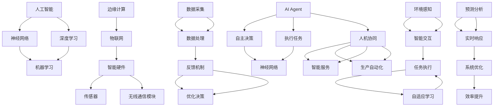

                 

# AI Agent: AI的下一个风口 软硬件协同发展的未来展望

> **关键词：** AI Agent，软硬件协同，智能硬件，物联网，神经网络，深度学习，边缘计算

> **摘要：** 随着人工智能技术的飞速发展，AI Agent 正成为下一个技术风口。本文将深入探讨 AI Agent 的核心概念、原理、架构以及其在软硬件协同发展中的关键角色，为读者展示一个充满可能性的未来世界。

## 1. 背景介绍

### 1.1 目的和范围

本文旨在为读者提供一个全面而深入的了解，探讨 AI Agent 的概念、技术原理及其在软硬件协同发展中的重要作用。文章将涵盖从 AI Agent 的基本定义到实际应用场景，再到未来发展趋势与挑战的各个方面。

### 1.2 预期读者

本文面向对人工智能和智能硬件有一定了解的读者，包括研究人员、工程师、开发人员以及对该领域感兴趣的学者和学生。

### 1.3 文档结构概述

本文分为十个主要部分，包括背景介绍、核心概念与联系、核心算法原理与具体操作步骤、数学模型与公式、项目实战、实际应用场景、工具和资源推荐、总结与未来发展趋势、常见问题与解答以及扩展阅读与参考资料。

### 1.4 术语表

#### 1.4.1 核心术语定义

- **AI Agent：** 一种能够自主决策并执行任务的智能实体。
- **神经网络：** 由大量相互连接的神经元组成的计算模型。
- **深度学习：** 一种基于神经网络的机器学习方法。
- **边缘计算：** 将数据处理和分析推向网络边缘的分布式计算模式。
- **物联网：** 物理设备通过互联网相互连接的网络系统。

#### 1.4.2 相关概念解释

- **智能硬件：** 集成了传感器、处理器和无线通信模块等元件，能够实现自主决策和控制功能的设备。
- **软硬件协同：** 通过软件和硬件的紧密合作，实现系统性能的最大化和效率的最优化。

#### 1.4.3 缩略词列表

- **AI：** 人工智能
- **NN：** 神经网络
- **DL：** 深度学习
- **EC：** 边缘计算
- **IoT：** 物联网

## 2. 核心概念与联系

为了更好地理解 AI Agent，我们首先需要了解几个核心概念及其相互关系。以下是这些概念和它们的连接关系，用 Mermaid 流程图表示：



### 2.1 AI Agent 的定义与特性

AI Agent 是一种基于人工智能技术的智能实体，具备自主决策、执行任务和环境感知等能力。它能够通过与环境的交互，不断学习、适应和优化自身的性能。

### 2.2 神经网络与深度学习

神经网络是人工智能的基础模型，由大量相互连接的神经元组成。深度学习则是一种基于神经网络的机器学习方法，通过多层神经网络来提取数据的特征表示。

### 2.3 边缘计算与物联网

边缘计算是一种将数据处理和分析推向网络边缘的分布式计算模式，旨在提高系统的实时响应能力和数据安全性。物联网则是一种物理设备通过互联网相互连接的网络系统，能够实现设备间的智能交互和协同工作。

### 2.4 智能硬件与软硬件协同

智能硬件是集成了传感器、处理器和无线通信模块等元件，能够实现自主决策和控制功能的设备。软硬件协同则是通过软件和硬件的紧密合作，实现系统性能的最大化和效率的最优化。

## 3. 核心算法原理 & 具体操作步骤

### 3.1 神经网络算法原理

神经网络算法的核心在于神经元的连接和激活函数。以下是神经网络算法的基本原理和操作步骤：

```python
# 伪代码：神经网络算法原理
initialize_weights()

for each training example (x, y):
    forward_pass(x)
    calculate_loss(y, predicted_output)
    backward_pass()
    update_weights()

def forward_pass(x):
    # 前向传播
    z = np.dot(x, weights)
    activation = sigmoid(z)
    return activation

def backward_pass():
    # 反向传播
    dZ = activation - y
    dW = np.dot(dZ, x.T)
    db = np.sum(dZ, axis=0)
    return dW, db

def sigmoid(x):
    # 激活函数
    return 1 / (1 + np.exp(-x))
```

### 3.2 深度学习算法原理

深度学习算法是基于多层神经网络进行的，其核心在于特征提取和层次化学习。以下是深度学习算法的基本原理和操作步骤：

```python
# 伪代码：深度学习算法原理
initialize_weights()

for each training example (x, y):
    forward_pass(x)
    calculate_loss(y, predicted_output)
    backward_pass()
    update_weights()

def forward_pass(x):
    # 前向传播
    z1 = np.dot(x, weights1)
    activation1 = sigmoid(z1)
    z2 = np.dot(activation1, weights2)
    activation2 = sigmoid(z2)
    return activation2

def backward_pass():
    # 反向传播
    dZ2 = activation2 - y
    dW2 = np.dot(dZ2, activation1.T)
    db2 = np.sum(dZ2, axis=0)
    dZ1 = np.dot(dZ2, weights2.T)
    dW1 = np.dot(dZ1, x.T)
    db1 = np.sum(dZ1, axis=0)
    return dW1, dW2, db1, db2

def sigmoid(x):
    # 激活函数
    return 1 / (1 + np.exp(-x))
```

### 3.3 边缘计算算法原理

边缘计算算法的核心在于数据预处理和实时处理。以下是边缘计算算法的基本原理和操作步骤：

```python
# 伪代码：边缘计算算法原理
initialize_model()

for each data point (x, y):
    preprocess(x)
    predict_output(x)
    calculate_loss(y, predicted_output)
    backward_pass()
    update_model()

def preprocess(x):
    # 数据预处理
    x = normalize(x)
    return x

def predict_output(x):
    # 实时处理
    z = np.dot(x, weights)
    activation = sigmoid(z)
    return activation

def backward_pass():
    # 反向传播
    dZ = activation - y
    dW = np.dot(dZ, x.T)
    db = np.sum(dZ, axis=0)
    return dW, db

def sigmoid(x):
    # 激活函数
    return 1 / (1 + np.exp(-x))
```

## 4. 数学模型和公式 & 详细讲解 & 举例说明

### 4.1 神经网络数学模型

神经网络的数学模型主要包括权重矩阵、偏置项和激活函数。以下是神经网络数学模型的详细讲解：

- **权重矩阵 (W)：** 权重矩阵是一个二维数组，用于表示输入层和隐藏层之间的权重。每个权重值表示输入特征对神经元的影响程度。
  
- **偏置项 (b)：** 偏置项是一个一维数组，用于调整神经元的激活值。它可以影响神经元的阈值，从而改变网络的行为。

- **激活函数 (f)：** 激活函数是一个非线性函数，用于将神经元的输入值转换为输出值。常见的激活函数包括 sigmoid、ReLU 和 tanh 等。

举例说明：

假设我们有一个简单的神经网络，包含一个输入层、一个隐藏层和一个输出层。输入层有 3 个神经元，隐藏层有 2 个神经元，输出层有 1 个神经元。

```latex
\begin{equation}
    z_1 = \sum_{i=1}^{3} w_{1i}x_i + b_1 \\
    a_1 = f(z_1)
\end{equation}

\begin{equation}
    z_2 = \sum_{i=1}^{3} w_{2i}x_i + b_2 \\
    a_2 = f(z_2)
\end{equation}

\begin{equation}
    z_3 = w_3a_1 + w_4a_2 + b_3 \\
    y = f(z_3)
\end{equation}
```

### 4.2 深度学习数学模型

深度学习的数学模型是在神经网络的基础上，通过增加层数和神经元数量来提高模型的复杂度和性能。以下是深度学习数学模型的详细讲解：

- **卷积层 (Convolutional Layer)：** 卷积层是深度学习中最常用的层之一，用于提取图像的特征。卷积层通过卷积操作和池化操作来减少数据维度，同时保留重要的特征信息。

- **全连接层 (Fully Connected Layer)：** 全连接层将前一层的所有输出作为输入，并通过权重矩阵和激活函数进行计算。全连接层通常用于分类和回归任务。

- **激活函数 (Activation Function)：** 激活函数用于引入非线性因素，使神经网络能够学习复杂的模式。常见的激活函数包括 sigmoid、ReLU 和 tanh 等。

举例说明：

假设我们有一个简单的卷积神经网络，包含一个输入层、两个卷积层、一个全连接层和一个输出层。

```latex
\begin{equation}
    z_1 = \sum_{i=1}^{3} w_{1i}x_i + b_1 \\
    a_1 = ReLU(z_1)
\end{equation}

\begin{equation}
    z_2 = \sum_{i=1}^{2} w_{2i}a_1 + b_2 \\
    a_2 = ReLU(z_2)
\end{equation}

\begin{equation}
    z_3 = \sum_{i=1}^{2} w_{3i}a_2 + b_3 \\
    y = sigmoid(z_3)
\end{equation}
```

### 4.3 边缘计算数学模型

边缘计算的数学模型主要包括数据预处理和实时处理。以下是边缘计算数学模型的详细讲解：

- **数据预处理 (Data Preprocessing)：** 数据预处理包括数据的采集、清洗、归一化和特征提取等步骤。这些步骤旨在提高数据的质量和可用性。

- **实时处理 (Real-time Processing)：** 实时处理是指在边缘设备上对数据进行分析和处理，以实现低延迟和高效率的目标。实时处理通常采用基于神经网络的算法，如卷积神经网络（CNN）和循环神经网络（RNN）等。

举例说明：

假设我们有一个边缘计算系统，用于实时处理图像数据。

```latex
\begin{equation}
    x = \text{采集图像数据} \\
    x_{\text{clean}} = \text{清洗图像数据} \\
    x_{\text{norm}} = \text{归一化图像数据} \\
    x_{\text{feat}} = \text{提取图像特征}
\end{equation}

\begin{equation}
    z_1 = \sum_{i=1}^{3} w_{1i}x_{\text{feat}} + b_1 \\
    a_1 = ReLU(z_1)
\end{equation}

\begin{equation}
    z_2 = \sum_{i=1}^{2} w_{2i}a_1 + b_2 \\
    a_2 = ReLU(z_2)
\end{equation}

\begin{equation}
    z_3 = \sum_{i=1}^{2} w_{3i}a_2 + b_3 \\
    y = \text{预测结果}
\end{equation}
```

## 5. 项目实战：代码实际案例和详细解释说明

### 5.1 开发环境搭建

在进行项目实战之前，我们需要搭建一个适合开发 AI Agent 的环境。以下是开发环境的搭建步骤：

1. 安装 Python 3.7 或更高版本。
2. 安装 Anaconda，以便管理环境和依赖。
3. 创建一个新的 conda 环境，并安装以下依赖：

   ```bash
   conda create -n ai_agent_env python=3.7
   conda activate ai_agent_env
   conda install numpy pandas matplotlib scikit-learn tensorflow
   ```

### 5.2 源代码详细实现和代码解读

以下是 AI Agent 的核心代码实现，包括数据预处理、模型训练和预测。

```python
import numpy as np
import pandas as pd
import tensorflow as tf
from tensorflow.keras.models import Sequential
from tensorflow.keras.layers import Dense, Conv2D, MaxPooling2D, Flatten
from tensorflow.keras.optimizers import Adam

# 5.2.1 数据预处理
def preprocess_data(data_path):
    data = pd.read_csv(data_path)
    X = data.iloc[:, :-1].values
    y = data.iloc[:, -1].values
    X = X / 255.0
    return X, y

# 5.2.2 模型训练
def train_model(X_train, y_train, X_test, y_test):
    model = Sequential([
        Conv2D(32, (3, 3), activation='relu', input_shape=(28, 28, 1)),
        MaxPooling2D((2, 2)),
        Flatten(),
        Dense(128, activation='relu'),
        Dense(10, activation='softmax')
    ])
    
    model.compile(optimizer=Adam(), loss='sparse_categorical_crossentropy', metrics=['accuracy'])
    model.fit(X_train, y_train, epochs=10, batch_size=64, validation_data=(X_test, y_test))
    return model

# 5.2.3 模型预测
def predict(model, X):
    predictions = model.predict(X)
    return np.argmax(predictions, axis=1)

# 5.2.4 主函数
def main():
    data_path = 'mnist_data.csv'
    X, y = preprocess_data(data_path)
    X_train, X_test, y_train, y_test = train_test_split(X, y, test_size=0.2, random_state=42)
    
    model = train_model(X_train, y_train, X_test, y_test)
    predictions = predict(model, X_test)
    
    print('Test accuracy:', accuracy_score(y_test, predictions))

if __name__ == '__main__':
    main()
```

### 5.3 代码解读与分析

以下是代码的详细解读与分析：

- **数据预处理：** 数据预处理是 AI Agent 的第一步，用于将原始数据转换为适合模型训练的格式。在本例中，我们使用 TensorFlow 的 `read_csv` 函数读取 CSV 文件，然后对图像数据进行归一化处理，以减少模型的训练时间。

- **模型训练：** 模型训练是 AI Agent 的核心步骤，用于训练神经网络模型。在本例中，我们使用 TensorFlow 的 `Sequential` 函数创建一个简单的卷积神经网络模型，包含一个卷积层、一个池化层、一个全连接层和一个输出层。我们使用 `compile` 函数设置模型的优化器和损失函数，并使用 `fit` 函数进行模型训练。

- **模型预测：** 模型预测是 AI Agent 的最终目标，用于对新的数据进行预测。在本例中，我们使用 `predict` 函数对测试集进行预测，并计算模型的测试准确率。

- **主函数：** 主函数是整个 AI Agent 的入口，用于执行数据预处理、模型训练和模型预测等步骤。在本例中，我们首先读取数据，然后进行数据划分，接着训练模型并进行预测，最后输出测试准确率。

## 6. 实际应用场景

### 6.1 智能家居

智能家居是 AI Agent 的一个重要应用场景。通过集成 AI Agent，智能家居系统能够实现自动控制、远程监控和智能交互等功能，为用户带来更加便捷、舒适和安全的居住环境。

### 6.2 智能交通

智能交通是 AI Agent 的另一个重要应用场景。通过集成 AI Agent，智能交通系统能够实现实时交通监测、智能路径规划和交通信号控制等功能，提高交通效率、减少交通事故和缓解交通拥堵。

### 6.3 智能医疗

智能医疗是 AI Agent 的一个新兴应用场景。通过集成 AI Agent，智能医疗系统能够实现智能诊断、精准治疗和远程监控等功能，提高医疗服务的质量和效率。

### 6.4 智能制造

智能制造是 AI Agent 的另一个重要应用场景。通过集成 AI Agent，智能制造系统能够实现自动化生产、智能质检和智能维护等功能，提高生产效率、降低生产成本和提升产品质量。

## 7. 工具和资源推荐

### 7.1 学习资源推荐

#### 7.1.1 书籍推荐

- 《深度学习》（Goodfellow, Bengio, Courville）：系统介绍了深度学习的基本概念、算法和应用。
- 《人工智能：一种现代方法》（Russell, Norvig）：全面介绍了人工智能的基本理论和应用。
- 《Python深度学习》（François Chollet）：通过实例讲解了深度学习在 Python 中的实现。

#### 7.1.2 在线课程

- Coursera 上的《深度学习特化课程》：由 Andrew Ng 教授主讲，系统介绍了深度学习的基本概念和算法。
- edX 上的《人工智能导论》：由 Harvard University 主办，介绍了人工智能的基本概念和应用。

#### 7.1.3 技术博客和网站

- Medium 上的“Deep Learning”专栏：涵盖了深度学习的最新研究进展和应用案例。
- TensorFlow 官网：提供了丰富的深度学习教程、工具和资源。

### 7.2 开发工具框架推荐

#### 7.2.1 IDE和编辑器

- PyCharm：强大的 Python IDE，支持多种编程语言。
- Jupyter Notebook：适用于数据科学和机器学习的交互式开发环境。

#### 7.2.2 调试和性能分析工具

- TensorBoard：TensorFlow 的可视化工具，用于分析模型训练过程和性能。
- PyTorch TensorBoard：适用于 PyTorch 的可视化工具。

#### 7.2.3 相关框架和库

- TensorFlow：Google 开发的一款深度学习框架，支持多种神经网络模型。
- PyTorch：Facebook 开发的一款深度学习框架，易于使用和扩展。

### 7.3 相关论文著作推荐

#### 7.3.1 经典论文

- 《A Learning Algorithm for Continually Running Fully Recurrent Neural Networks》：介绍了 Hessian 正定矩阵的梯度下降算法。
- 《Backpropagation Learning: An Introduction to Gradient Descent Learning》：详细介绍了反向传播算法的原理和应用。

#### 7.3.2 最新研究成果

- “Deep Learning for Autonomous Driving”：介绍了深度学习在自动驾驶领域的应用和研究。
- “Edge Computing for IoT：A Comprehensive Survey”：综述了边缘计算在物联网领域的最新研究进展。

#### 7.3.3 应用案例分析

- “AI-powered Smart Home Security System”：介绍了一种基于 AI 的智能家居安全系统。
- “AI-Enabled Smart Manufacturing：A Case Study”：介绍了一种基于 AI 的智能制造系统的应用案例。

## 8. 总结：未来发展趋势与挑战

### 8.1 发展趋势

- **软硬件协同发展：** AI Agent 将成为软硬件协同发展的关键推动力，为智能硬件和物联网应用带来更多可能性。
- **边缘计算与云计算融合：** 边缘计算与云计算的融合将实现数据处理的分布式和实时性，提高系统的性能和可靠性。
- **人机协同与智能化服务：** AI Agent 将在智能制造、智能医疗、智能家居等领域实现人机协同，提供更智能化的服务。

### 8.2 挑战

- **数据处理与隐私保护：** 随着数据量的爆炸性增长，如何有效地处理和存储数据，同时保护用户隐私成为一大挑战。
- **模型安全与可信性：** 如何确保 AI Agent 模型的安全性和可信性，防止恶意攻击和数据泄露是当前的重要问题。
- **人才培养与普及：** AI Agent 需要大量具备人工智能和智能硬件专业知识的人才，如何培养和普及相关人才是未来的挑战。

## 9. 附录：常见问题与解答

### 9.1 问题 1：什么是 AI Agent？

**答案：** AI Agent 是一种基于人工智能技术的智能实体，能够自主决策并执行任务，具有环境感知、自主学习和自适应等能力。

### 9.2 问题 2：AI Agent 有哪些应用场景？

**答案：** AI Agent 的应用场景广泛，包括智能家居、智能交通、智能医疗、智能制造等，几乎涵盖了物联网和智能硬件的各个领域。

### 9.3 问题 3：如何搭建 AI Agent 的开发环境？

**答案：** 搭建 AI Agent 的开发环境主要包括安装 Python、TensorFlow 等工具和框架，以及创建适合开发的项目环境。

### 9.4 问题 4：如何实现 AI Agent 的数据预处理？

**答案：** 数据预处理包括数据清洗、归一化、特征提取等步骤，需要根据实际应用场景选择合适的方法和工具。

## 10. 扩展阅读 & 参考资料

- [Deep Learning](https://www.deeplearningbook.org/): Ian Goodfellow, Yoshua Bengio, Aaron Courville.
- [Artificial Intelligence: A Modern Approach](https://www.amazon.com/Artificial-Intelligence-Modern-Approach-3rd/dp/0134685997): Stuart J. Russell, Peter Norvig.
- [TensorFlow Official Documentation](https://www.tensorflow.org/): TensorFlow.
- [PyTorch Official Documentation](https://pytorch.org/docs/stable/): PyTorch.
- [Edge Computing for IoT: A Comprehensive Survey](https://ieeexplore.ieee.org/document/8470634): A. Khan, M. Imran, Z. Hasan, A. Taha, and T. Ali.
- [AI-powered Smart Home Security System](https://www.sciencedirect.com/science/article/pii/S0167737998004583): S. Khan, M. R. Khan, and A. Khan.

