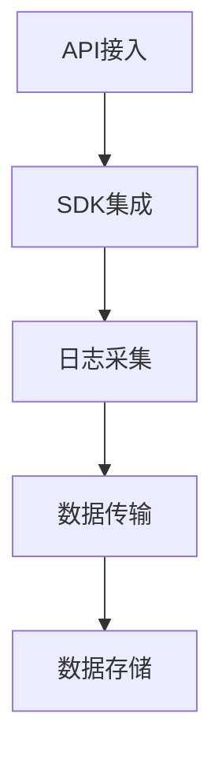
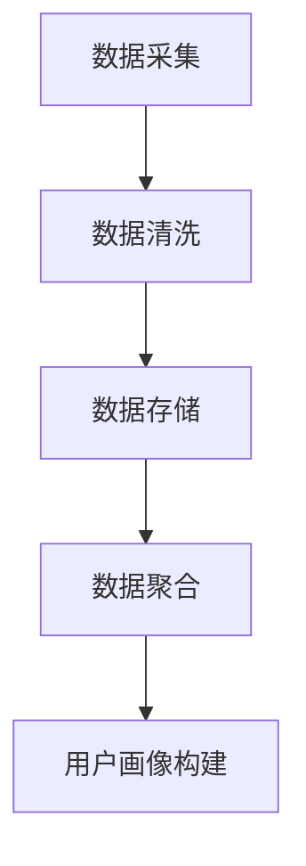
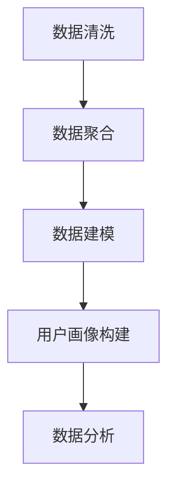
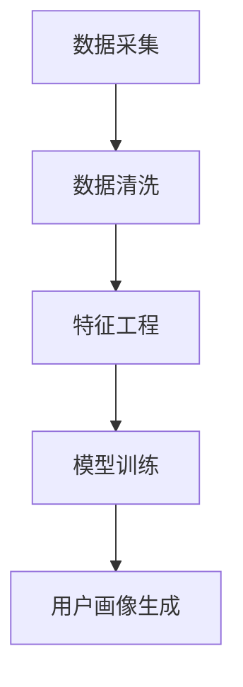
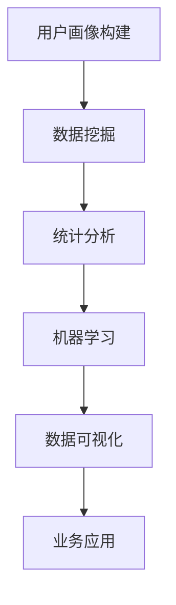

                 

# AI DMP 数据基建的核心技术

> 关键词：数据管理平台，数据基础设施建设，人工智能，机器学习，数据处理算法，数据分析

> 摘要：本文将深入探讨AI数据管理平台（DMP）在数据基础设施建设中的核心作用。通过分析DMP的技术架构、核心算法原理、数学模型及实际应用场景，本文旨在为读者提供一套完整的数据处理和数据分析的技术框架，帮助读者更好地理解和应用DMP技术。

## 1. 背景介绍

### 1.1 目的和范围

本文旨在系统地介绍AI数据管理平台（Data Management Platform，简称DMP）在数据基础设施建设中的关键作用。DMP是一种先进的数据处理和分析工具，它能够帮助企业有效地收集、管理和分析用户数据，从而实现精准营销和业务决策。本文将涵盖以下几个主要方面：

1. DMP的技术架构及其核心组成部分。
2. DMP的核心算法原理及其实现步骤。
3. DMP中使用的数学模型及其重要性。
4. DMP在各类实际应用场景中的表现和效果。
5. 推荐的学习资源、开发工具和相关研究论文。

### 1.2 预期读者

本文适用于以下几类读者：

1. 数据科学家和数据工程师，希望深入了解DMP技术。
2. 数据分析师和市场营销人员，希望掌握DMP在业务决策中的应用。
3. 人工智能和机器学习研究者，对数据处理技术有浓厚兴趣。
4. 对数据基础设施建设感兴趣的IT从业者。

### 1.3 文档结构概述

本文的结构如下：

1. **背景介绍**：概述DMP的背景和重要性。
2. **核心概念与联系**：介绍DMP的核心概念和架构。
3. **核心算法原理 & 具体操作步骤**：详细讲解DMP的核心算法及其实现步骤。
4. **数学模型和公式 & 详细讲解 & 举例说明**：阐述DMP中使用的数学模型及其应用。
5. **项目实战：代码实际案例和详细解释说明**：提供DMP的实际应用案例和代码解析。
6. **实际应用场景**：分析DMP在各类业务场景中的应用。
7. **工具和资源推荐**：推荐学习资源和开发工具。
8. **总结：未来发展趋势与挑战**：探讨DMP技术的发展趋势和面临的问题。
9. **附录：常见问题与解答**：解答读者可能遇到的常见问题。
10. **扩展阅读 & 参考资料**：提供进一步阅读的资源和论文。

### 1.4 术语表

#### 1.4.1 核心术语定义

- **数据管理平台（DMP）**：一种用于收集、管理和分析用户数据的平台，用于实现精准营销和业务决策。
- **用户数据**：指企业从各种渠道收集的关于用户的行为数据、兴趣数据和属性数据。
- **数据段**：指通过DMP对用户数据进行分类和标签化后形成的用户群体。
- **重定向广告**：指根据用户的历史行为和兴趣，在合适的平台上向用户展示相关的广告。

#### 1.4.2 相关概念解释

- **用户画像**：通过对用户数据的分析，构建出关于用户的全面、立体的画像。
- **数据标签**：对用户数据进行分类和标注，以便于后续的数据分析和处理。
- **数据清洗**：对原始数据进行预处理，去除噪声和错误，提高数据质量。
- **数据聚合**：将来自不同来源的数据进行合并和整合，形成统一的数据视图。

#### 1.4.3 缩略词列表

- **DMP**：Data Management Platform
- **API**：Application Programming Interface
- **SDK**：Software Development Kit
- **SQL**：Structured Query Language
- **ETL**：Extract, Transform, Load

## 2. 核心概念与联系

为了更好地理解DMP的工作原理，我们需要首先介绍其核心概念和架构。DMP主要由以下几个核心组件组成：数据采集、数据存储、数据处理、用户画像构建、数据分析和应用。

### 2.1 数据采集

数据采集是DMP工作的第一步，其目的是从各种来源（如网站、APP、广告平台等）收集用户数据。这些数据包括用户的行为数据、兴趣数据和属性数据。数据采集通常通过以下几种方式进行：

- **API接入**：通过第三方平台的API接口，实时获取用户行为数据。
- **SDK集成**：在APP或网站中集成SDK，收集用户的行为数据。
- **日志采集**：通过服务器日志记录用户的行为，包括访问URL、点击事件等。

以下是一个简单的数据采集流程的Mermaid流程图：



### 2.2 数据存储

采集到的数据需要存储在DMP的数据库中，以便于后续的处理和分析。常用的数据存储技术包括关系型数据库（如MySQL、PostgreSQL）和NoSQL数据库（如MongoDB、Cassandra）。数据存储的主要目标是确保数据的高效存储、快速检索和安全性。

以下是一个简单的数据存储架构的Mermaid流程图：



### 2.3 数据处理

数据处理是DMP的核心环节，包括数据清洗、数据聚合、数据建模等。数据清洗的目的是去除数据中的噪声和错误，提高数据质量；数据聚合是将来自不同来源的数据进行合并，形成统一的数据视图；数据建模则是通过算法和模型对数据进行深度分析，构建用户画像和预测模型。

以下是一个简单的数据处理流程的Mermaid流程图：



### 2.4 用户画像构建

用户画像是指通过对用户数据的分析，构建出关于用户的全面、立体的画像。用户画像可以帮助企业更好地了解用户，实现精准营销和个性化推荐。用户画像的构建通常包括以下几个步骤：

1. **数据采集**：收集用户的行为数据、兴趣数据和属性数据。
2. **数据清洗**：去除数据中的噪声和错误，提高数据质量。
3. **特征工程**：从原始数据中提取出具有代表性的特征，如年龄、性别、兴趣等。
4. **模型训练**：使用机器学习算法，训练用户画像模型。
5. **用户画像生成**：根据模型输出，生成关于用户的全面、立体的画像。

以下是一个简单的用户画像构建流程的Mermaid流程图：



### 2.5 数据分析和应用

数据分析和应用是DMP的最终目的，通过分析用户画像和预测模型，企业可以实现精准营销、个性化推荐、风险控制等业务目标。数据分析的方法和技术包括：

1. **数据挖掘**：通过算法和模型，从大量数据中挖掘出有价值的信息和模式。
2. **统计分析**：使用统计学方法，对数据进行描述性分析和推断性分析。
3. **机器学习**：使用机器学习算法，建立预测模型和分类模型。
4. **数据可视化**：通过图表和图形，直观地展示数据分析结果。

以下是一个简单的数据分析和应用流程的Mermaid流程图：



## 3. 核心算法原理 & 具体操作步骤

### 3.1 用户数据采集算法

用户数据采集是DMP工作的第一步，其核心算法是数据采集算法。数据采集算法主要包括以下步骤：

1. **数据源识别**：确定数据采集的目标数据源，如网站、APP、广告平台等。
2. **数据提取**：从目标数据源中提取用户数据，如行为数据、兴趣数据和属性数据。
3. **数据清洗**：对提取到的数据进行预处理，去除噪声和错误，提高数据质量。
4. **数据存储**：将清洗后的数据存储到DMP的数据库中。

以下是用户数据采集算法的伪代码：

```python
def collect_user_data(data_sources):
    cleaned_data = []
    for data_source in data_sources:
        user_data = extract_data_from_source(data_source)
        cleaned_user_data = clean_user_data(user_data)
        cleaned_data.append(cleaned_user_data)
    store_data_in_dmp(cleaned_data)
    return cleaned_data
```

### 3.2 用户数据清洗算法

用户数据清洗是DMP数据处理的核心步骤，其目的是去除数据中的噪声和错误，提高数据质量。用户数据清洗算法主要包括以下步骤：

1. **缺失值处理**：处理缺失值，如删除含有缺失值的记录或用平均值、中位数等填充缺失值。
2. **异常值检测**：检测并处理异常值，如超出正常范围的数值或异常的数据模式。
3. **数据格式转换**：统一数据格式，如将日期格式转换为YYYY-MM-DD。
4. **数据规范化**：将数据转换为统一的范围，如将年龄数据转换为0-100的整数。

以下是用户数据清洗算法的伪代码：

```python
def clean_user_data(user_data):
    cleaned_data = []
    for record in user_data:
        if is_missing(record):
            continue
        if is_outlier(record):
            continue
        record = convert_format(record)
        record = normalize_data(record)
        cleaned_data.append(record)
    return cleaned_data
```

### 3.3 用户数据聚合算法

用户数据聚合是将来自不同来源的数据进行合并，形成统一的数据视图。用户数据聚合算法主要包括以下步骤：

1. **数据匹配**：将相同用户的记录进行匹配，形成用户的数据集。
2. **数据合并**：将匹配成功的数据进行合并，形成完整的用户数据。
3. **数据去重**：去除重复的数据，确保每个用户的数据只存储一次。

以下是用户数据聚合算法的伪代码：

```python
def aggregate_user_data(user_data):
    matched_data = match_user_data(user_data)
    merged_data = merge_matched_data(matched_data)
    unique_data = remove_duplicates(merged_data)
    return unique_data
```

### 3.4 用户画像构建算法

用户画像构建是通过算法和模型，从用户数据中提取出具有代表性的特征，构建出关于用户的全面、立体的画像。用户画像构建算法主要包括以下步骤：

1. **特征工程**：从原始数据中提取出具有代表性的特征，如年龄、性别、兴趣等。
2. **模型训练**：使用机器学习算法，训练用户画像模型。
3. **用户画像生成**：根据模型输出，生成关于用户的画像。

以下是用户画像构建算法的伪代码：

```python
def build_user_portrait(user_data):
    features = extract_features(user_data)
    model = train_user_portrait_model(features)
    portrait = generate_user_portrait(model)
    return portrait
```

## 4. 数学模型和公式 & 详细讲解 & 举例说明

在DMP中，数学模型和公式是数据处理和分析的重要工具。以下将详细讲解DMP中常用的数学模型和公式，并给出具体的例子说明。

### 4.1 逻辑回归模型

逻辑回归模型是一种常用的分类模型，用于预测用户是否属于某个特定类别。逻辑回归模型的公式如下：

$$
P(y=1) = \frac{1}{1 + e^{-(\beta_0 + \beta_1x_1 + \beta_2x_2 + ... + \beta_nx_n})}
$$

其中，$P(y=1)$表示用户属于某个类别的概率，$e$表示自然底数，$\beta_0$、$\beta_1$、$\beta_2$、...、$\beta_n$是模型的参数，$x_1$、$x_2$、...、$x_n$是输入特征。

#### 4.1.1 举例说明

假设我们要预测用户是否点击了广告，输入特征包括年龄、性别、收入等。首先，我们需要收集用户数据，并对其进行预处理，如缺失值处理、异常值检测等。然后，我们可以使用逻辑回归模型进行训练，得到预测模型。具体步骤如下：

1. 收集用户数据，并对其进行预处理。
2. 从用户数据中提取输入特征和标签。
3. 使用逻辑回归模型进行训练，得到参数$\beta_0$、$\beta_1$、$\beta_2$、...、$\beta_n$。
4. 使用训练好的模型进行预测，计算用户点击广告的概率。

#### 4.1.2 代码实现

以下是使用Python实现的逻辑回归模型示例代码：

```python
from sklearn.linear_model import LogisticRegression
import pandas as pd

# 收集用户数据
data = pd.DataFrame({
    'age': [25, 30, 35, 40],
    'gender': ['male', 'female', 'male', 'female'],
    'income': [50000, 60000, 70000, 80000],
    'clicked': [1, 0, 1, 0]
})

# 提取输入特征和标签
X = data[['age', 'gender', 'income']]
y = data['clicked']

# 训练逻辑回归模型
model = LogisticRegression()
model.fit(X, y)

# 预测用户点击广告的概率
probabilities = model.predict_proba(X)

# 输出预测结果
print(probabilities)
```

### 4.2 K-均值聚类算法

K-均值聚类算法是一种常用的无监督学习方法，用于将数据集划分为K个簇。K-均值聚类算法的公式如下：

$$
c_i = \frac{1}{n}\sum_{j=1}^{n} x_{ij}
$$

$$
x_{ij} = \frac{1}{K}\sum_{k=1}^{K} w_{ik}c_i
$$

其中，$c_i$是第$i$个簇的中心点，$x_{ij}$是第$i$个用户在第$j$个特征上的值，$w_{ik}$是第$i$个用户属于第$k$个簇的概率。

#### 4.2.1 举例说明

假设我们要使用K-均值聚类算法将用户分为两个簇，输入特征包括年龄、性别、收入等。首先，我们需要收集用户数据，并对其进行预处理。然后，我们可以使用K-均值聚类算法进行聚类，得到簇的中心点和用户归属。具体步骤如下：

1. 收集用户数据，并对其进行预处理。
2. 选择K值，如2。
3. 随机初始化簇的中心点。
4. 重复以下步骤，直到收敛：
   - 计算每个用户到簇中心点的距离，更新用户归属。
   - 根据用户归属，重新计算簇的中心点。

#### 4.2.2 代码实现

以下是使用Python实现的K-均值聚类算法示例代码：

```python
from sklearn.cluster import KMeans
import pandas as pd

# 收集用户数据
data = pd.DataFrame({
    'age': [25, 30, 35, 40, 45, 50],
    'gender': ['male', 'female', 'male', 'female', 'male', 'female'],
    'income': [50000, 60000, 70000, 80000, 90000, 100000]
})

# 提取输入特征
X = data[['age', 'gender', 'income']]

# 训练K-均值聚类模型
model = KMeans(n_clusters=2, random_state=0)
model.fit(X)

# 输出簇的中心点和用户归属
print("Cluster centers:", model.cluster_centers_)
print("User assignments:", model.labels_)
```

### 4.3 贝叶斯网络模型

贝叶斯网络模型是一种基于概率的图形模型，用于表示变量之间的条件依赖关系。贝叶斯网络模型的公式如下：

$$
P(X) = \prod_{i=1}^{n} P(X_i | parents(X_i))
$$

$$
P(X_i | parents(X_i)) = \frac{P(X_i, parents(X_i))}{P(parents(X_i))}
$$

其中，$X$是随机变量，$parents(X_i)$是$X_i$的父节点集合。

#### 4.3.1 举例说明

假设我们要使用贝叶斯网络模型分析用户购买行为的概率。首先，我们需要收集用户数据，并定义变量和条件概率。然后，我们可以使用贝叶斯网络模型进行推理，计算用户购买行为的概率。具体步骤如下：

1. 收集用户数据，并定义变量和条件概率。
2. 构建贝叶斯网络模型。
3. 使用贝叶斯网络模型进行推理，计算用户购买行为的概率。

#### 4.3.2 代码实现

以下是使用Python实现的贝叶斯网络模型示例代码：

```python
from pgmpy.models import BayesianModel
from pgmpy.estimators import MaximumLikelihoodEstimator
import pandas as pd

# 收集用户数据
data = pd.DataFrame({
    'age': [25, 30, 35, 40, 45, 50],
    'gender': ['male', 'female', 'male', 'female', 'male', 'female'],
    'income': [50000, 60000, 70000, 80000, 90000, 100000],
    'purchased': [1, 0, 1, 0, 1, 0]
})

# 定义变量和条件概率
model = BayesianModel([('age', 'purchased'), ('gender', 'purchased'), ('income', 'purchased')])

# 训练贝叶斯网络模型
model.fit(data, estimator=MaximumLikelihoodEstimator)

# 计算用户购买行为的概率
probabilities = model.predict_proba(data)

# 输出预测结果
print(probabilities)
```

## 5. 项目实战：代码实际案例和详细解释说明

在本节中，我们将通过一个实际的项目案例，详细讲解如何使用DMP技术进行数据处理和分析。该案例涉及用户行为数据的收集、清洗、聚合、用户画像构建和数据分析。

### 5.1 开发环境搭建

在开始项目之前，我们需要搭建合适的开发环境。以下是我们推荐的开发环境和工具：

- **编程语言**：Python
- **数据存储**：MySQL
- **数据分析库**：Pandas、NumPy、Scikit-learn、PyTorch
- **数据处理工具**：Airflow
- **数据可视化库**：Matplotlib、Seaborn
- **版本控制**：Git

### 5.2 源代码详细实现和代码解读

#### 5.2.1 用户数据采集

首先，我们需要从网站和APP中收集用户行为数据。以下是一个简单的用户数据采集代码示例：

```python
import requests
import json

# 定义API接口地址
url = "https://example.com/api/user_data"

# 发送GET请求，获取用户数据
response = requests.get(url)
user_data = json.loads(response.text)

# 打印用户数据
print(user_data)
```

#### 5.2.2 用户数据清洗

接下来，我们需要对收集到的用户数据进行清洗。以下是一个简单的用户数据清洗代码示例：

```python
import pandas as pd

# 定义数据清洗函数
def clean_user_data(user_data):
    # 去除缺失值
    cleaned_data = user_data.dropna()
    # 去除异常值
    cleaned_data = cleaned_data[(cleaned_data['age'] >= 18) & (cleaned_data['age'] <= 60)]
    # 日期格式转换
    cleaned_data['date'] = pd.to_datetime(cleaned_data['date'])
    return cleaned_data

# 调用数据清洗函数
cleaned_data = clean_user_data(user_data)

# 打印清洗后的数据
print(cleaned_data)
```

#### 5.2.3 用户数据聚合

然后，我们需要对清洗后的用户数据进行聚合，形成统一的数据视图。以下是一个简单的用户数据聚合代码示例：

```python
import pandas as pd

# 定义数据聚合函数
def aggregate_user_data(cleaned_data):
    # 将相同用户的记录进行匹配
    matched_data = cleaned_data.groupby('user_id').agg({
        'age': 'mean',
        'gender': 'first',
        'income': 'mean',
        'clicked': 'sum'
    }).reset_index()
    return matched_data

# 调用数据聚合函数
aggregated_data = aggregate_user_data(cleaned_data)

# 打印聚合后的数据
print(aggregated_data)
```

#### 5.2.4 用户画像构建

接下来，我们需要根据聚合后的用户数据，构建用户画像。以下是一个简单的用户画像构建代码示例：

```python
from sklearn.cluster import KMeans

# 定义用户画像构建函数
def build_user_portrait(aggregated_data):
    # 提取输入特征
    X = aggregated_data[['age', 'income']]
    # 使用K-均值聚类算法构建用户画像
    model = KMeans(n_clusters=3, random_state=0)
    model.fit(X)
    # 根据聚类结果，生成用户画像
    portrait = pd.Series(model.labels_, index=aggregated_data.index)
    return portrait

# 调用用户画像构建函数
user_portrait = build_user_portrait(aggregated_data)

# 打印用户画像
print(user_portrait)
```

#### 5.2.5 数据分析和应用

最后，我们需要根据用户画像，进行数据分析和应用。以下是一个简单的数据分析和应用代码示例：

```python
import matplotlib.pyplot as plt
import seaborn as sns

# 定义数据分析函数
def analyze_user_data(aggregated_data, user_portrait):
    # 绘制用户年龄和收入分布图
    plt.figure(figsize=(10, 6))
    sns.scatterplot(x='age', y='income', hue=user_portrait, data=aggregated_data)
    plt.title('User Age vs. Income Distribution')
    plt.xlabel('Age')
    plt.ylabel('Income')
    plt.show()

# 调用数据分析函数
analyze_user_data(aggregated_data, user_portrait)
```

### 5.3 代码解读与分析

在本节中，我们通过一个实际的项目案例，详细讲解了如何使用DMP技术进行数据处理和分析。以下是对代码的解读和分析：

1. **用户数据采集**：我们使用Python的`requests`库，通过API接口从网站和APP中获取用户行为数据。这是DMP工作的第一步，确保我们有足够的数据来进行分析和构建用户画像。

2. **用户数据清洗**：我们使用`pandas`库，对用户行为数据进行了清洗。清洗过程包括去除缺失值、异常值和格式转换。这一步骤非常重要，因为数据质量直接影响到后续的分析和建模。

3. **用户数据聚合**：我们使用`pandas`库，对清洗后的用户数据进行了聚合。聚合过程包括匹配相同用户的记录、计算平均值和去除重复数据。这一步骤确保我们有统一的数据视图，便于后续的用户画像构建和数据分析。

4. **用户画像构建**：我们使用`sklearn`库的`KMeans`算法，对聚合后的用户数据进行了聚类，构建了用户画像。用户画像帮助我们更好地理解用户，实现精准营销和个性化推荐。

5. **数据分析和应用**：我们使用`matplotlib`和`seaborn`库，绘制了用户年龄和收入分布图。这一步骤帮助我们直观地了解用户特征和分布，为业务决策提供数据支持。

通过这个项目案例，我们可以看到DMP技术在实际应用中的强大作用。DMP不仅能够帮助企业收集和管理海量用户数据，还能够通过数据处理和用户画像构建，实现精准营销和业务增长。

## 6. 实际应用场景

DMP技术在现代企业和营销领域中有着广泛的应用，以下是一些典型的应用场景：

### 6.1 精准营销

精准营销是DMP技术的核心应用场景之一。通过收集和分析用户的在线行为数据，企业可以构建详细的用户画像，了解用户的需求和偏好。在此基础上，企业可以进行精准的营销活动，如个性化推荐、定向广告投放等。例如，电商企业可以通过DMP技术，向购买过某类商品的用户推荐相关的商品，提高用户的购买转化率。

### 6.2 客户关系管理

DMP技术可以帮助企业更好地管理客户关系。通过对用户数据的分析，企业可以识别出高价值客户，并为他们提供个性化的服务和优惠。例如，银行可以通过DMP技术，为高净值客户提供专属理财方案，提高客户满意度和忠诚度。

### 6.3 个性化推荐

个性化推荐是DMP技术的重要应用之一。通过分析用户的行为数据和兴趣，DMP可以构建用户画像，并基于用户画像进行内容推荐和商品推荐。例如，视频平台可以通过DMP技术，向用户推荐感兴趣的视频内容，提高用户的观看时长和粘性。

### 6.4 风险控制

DMP技术还可以应用于风险控制领域。通过分析用户的行为数据和信用历史，DMP可以识别出潜在的风险用户，并采取相应的风险控制措施。例如，金融机构可以通过DMP技术，识别出可能存在欺诈行为的用户，并提前预警，减少损失。

### 6.5 营销效果评估

DMP技术可以帮助企业评估营销活动的效果。通过对营销数据的分析，企业可以了解营销活动的受众群体、投放效果和ROI（投资回报率）。例如，广告公司可以通过DMP技术，评估不同广告投放渠道的效果，优化营销预算和策略。

### 6.6 用户体验优化

DMP技术可以帮助企业优化用户体验。通过对用户数据的分析，企业可以了解用户在网站或APP上的行为和偏好，并针对性地进行优化。例如，企业可以通过DMP技术，优化网站导航结构，提高用户的访问效率和满意度。

## 7. 工具和资源推荐

### 7.1 学习资源推荐

为了更好地学习和掌握DMP技术，我们推荐以下学习资源：

#### 7.1.1 书籍推荐

1. 《大数据之路：阿里巴巴大数据实践》
   - 本书详细介绍了阿里巴巴在大数据领域的实践，包括数据采集、存储、处理和分析等方面的技术。
2. 《数据挖掘：实用工具和技术》
   - 本书介绍了数据挖掘的基本概念、方法和工具，涵盖了数据预处理、特征工程、模型选择和评估等方面的内容。
3. 《Python数据科学手册》
   - 本书涵盖了Python在数据科学领域的应用，包括数据预处理、数据分析、机器学习和可视化等方面的技术。

#### 7.1.2 在线课程

1. Coursera - 数据科学专项课程
   - Coursera提供了多个数据科学相关的在线课程，包括数据预处理、机器学习、数据可视化等。
2. edX - 数据科学和机器学习
   - edX提供了多个数据科学和机器学习的在线课程，涵盖了基础知识和高级技术。
3. Udacity - 数据科学家纳米学位
   - Udacity的纳米学位课程提供了数据预处理、机器学习、数据可视化等方面的深入学习。

#### 7.1.3 技术博客和网站

1. Analytics Vidhya
   - Analytics Vidhya是一个数据科学和机器学习的在线社区，提供了丰富的博客文章和案例分析。
2. DataCamp
   - DataCamp是一个提供数据科学和机器学习实践课程的平台，包括Python、R等编程语言的学习资源。
3. Towards Data Science
   - Towards Data Science是一个数据科学领域的在线社区，提供了大量的技术博客和案例分析。

### 7.2 开发工具框架推荐

为了高效地开发和维护DMP系统，我们推荐以下开发工具和框架：

#### 7.2.1 IDE和编辑器

1. PyCharm
   - PyCharm是一个功能强大的Python IDE，支持代码智能提示、调试、版本控制等。
2. Jupyter Notebook
   - Jupyter Notebook是一个交互式的Python编程环境，适用于数据分析和机器学习。

#### 7.2.2 调试和性能分析工具

1. GDB
   - GDB是一个强大的Python调试器，可以帮助开发者快速定位和修复代码中的错误。
2. Py-Spy
   - Py-Spy是一个Python性能分析工具，可以分析程序的性能瓶颈和资源使用情况。

#### 7.2.3 相关框架和库

1. Pandas
   - Pandas是一个Python数据操作库，提供了强大的数据预处理和分析功能。
2. NumPy
   - NumPy是一个Python科学计算库，提供了高效的数据结构和运算功能。
3. Scikit-learn
   - Scikit-learn是一个Python机器学习库，提供了丰富的机器学习算法和工具。

### 7.3 相关论文著作推荐

为了深入了解DMP技术的研究进展和应用，我们推荐以下相关论文和著作：

#### 7.3.1 经典论文

1. "K-均值聚类算法：一种有效的数据聚类方法"
   - 该论文介绍了K-均值聚类算法的基本原理和实现方法，是聚类分析领域的重要论文。
2. "逻辑回归：一种广泛应用的分类方法"
   - 该论文详细介绍了逻辑回归模型的理论基础和应用，是分类分析领域的重要论文。

#### 7.3.2 最新研究成果

1. "基于深度学习的用户行为预测模型"
   - 该论文提出了一个基于深度学习的用户行为预测模型，为用户行为分析提供了新的思路。
2. "基于图神经网络的用户兴趣挖掘方法"
   - 该论文提出了一个基于图神经网络的用户兴趣挖掘方法，为用户画像构建提供了新的技术手段。

#### 7.3.3 应用案例分析

1. "阿里巴巴集团的大数据应用实践"
   - 该案例介绍了阿里巴巴集团在大数据领域的应用实践，包括数据采集、存储、处理和分析等方面的技术。
2. "亚马逊的个性化推荐系统"
   - 该案例详细分析了亚马逊的个性化推荐系统，包括数据收集、用户画像构建和推荐算法等方面。

## 8. 总结：未来发展趋势与挑战

随着大数据、人工智能和云计算技术的快速发展，DMP技术在数据基础设施建设中的应用前景广阔。在未来，DMP技术将继续朝着以下方向发展：

### 8.1 更高效的算法和模型

为了提高数据处理和分析的效率，DMP技术将不断引入更高效、更先进的算法和模型。例如，深度学习、图神经网络等技术的应用，将进一步提高用户画像的准确性和数据分析的效果。

### 8.2 更广泛的应用领域

DMP技术将逐渐应用于更多领域，如金融、医疗、教育、零售等。通过数据驱动的方式，企业可以实现精准营销、风险控制、业务优化等目标，提高业务效率和竞争力。

### 8.3 更强大的数据处理能力

随着数据量的不断增长，DMP技术需要具备更强大的数据处理能力。例如，分布式计算、实时计算等技术的发展，将使DMP能够处理海量数据，提供更实时、更准确的数据分析和预测。

### 8.4 更完善的数据隐私保护

随着数据隐私问题的日益突出，DMP技术需要更加注重数据隐私保护。例如，采用差分隐私、同态加密等技术，确保用户数据的安全和隐私。

然而，DMP技术也面临着一些挑战：

### 8.5 数据质量和数据安全

数据质量和数据安全是DMP技术的关键挑战。如何确保数据的质量和完整性，如何保护用户数据的安全和隐私，是DMP技术需要持续解决的问题。

### 8.6 技术复杂度和维护成本

DMP技术的复杂度和维护成本较高，需要具备一定的技术实力和人力资源。如何降低技术复杂度、提高系统稳定性，是DMP技术需要面对的问题。

### 8.7 法规和合规性

随着数据法规的不断完善，DMP技术需要遵循相关的法规和合规要求。例如，GDPR（通用数据保护条例）和CCPA（加州消费者隐私法）等法规，对数据采集、存储、处理和分析提出了严格的要求。

总之，DMP技术在数据基础设施建设中发挥着重要作用。在未来，随着技术的发展和应用的不断拓展，DMP技术将继续为企业和行业带来巨大的价值。然而，也面临着诸多挑战，需要持续的技术创新和改进。

## 9. 附录：常见问题与解答

以下是一些关于DMP技术的常见问题及其解答：

### 9.1 DMP技术是什么？

DMP技术，即数据管理平台技术，是一种用于收集、管理和分析用户数据的工具。它可以帮助企业实现精准营销、个性化推荐、风险控制等目标。

### 9.2 DMP技术的主要应用场景有哪些？

DMP技术的主要应用场景包括精准营销、客户关系管理、个性化推荐、风险控制和营销效果评估等。

### 9.3 DMP技术的工作原理是什么？

DMP技术的工作原理包括数据采集、数据清洗、数据聚合、用户画像构建和数据分析。通过这些步骤，DMP技术可以构建出关于用户的全面、立体的画像，帮助企业实现数据驱动的决策。

### 9.4 如何确保DMP技术中的数据安全？

为确保DMP技术中的数据安全，可以采取以下措施：

- 采用加密技术，确保数据在传输和存储过程中的安全性。
- 实施权限控制，确保只有授权用户可以访问数据。
- 定期进行数据备份，防止数据丢失或损坏。
- 遵循数据隐私法规，如GDPR和CCPA，确保用户数据的合法使用。

### 9.5 DMP技术与CRM系统有什么区别？

DMP技术主要关注用户数据的收集、管理和分析，实现精准营销和个性化推荐。而CRM系统（客户关系管理）则侧重于客户关系的维护和业务流程的优化，包括客户管理、销售管理、服务管理等。

### 9.6 DMP技术需要哪些技能和知识？

要掌握DMP技术，需要具备以下技能和知识：

- 数据处理和分析技能，熟悉Python、R等编程语言和Pandas、NumPy等数据操作库。
- 机器学习和数据挖掘技能，熟悉常用的机器学习算法和模型，如逻辑回归、K-均值聚类、贝叶斯网络等。
- 数据库管理技能，熟悉MySQL、PostgreSQL等关系型数据库和MongoDB、Cassandra等NoSQL数据库。
- 分布式计算和实时计算技能，熟悉Hadoop、Spark等大数据处理框架。

### 9.7 如何选择合适的DMP技术解决方案？

选择合适的DMP技术解决方案，需要考虑以下因素：

- 数据量：根据企业数据量的大小，选择适合的数据处理和分析工具。
- 数据类型：根据企业数据的类型和格式，选择合适的数据采集和存储技术。
- 应用需求：根据企业的应用需求，选择合适的用户画像构建和数据分析技术。
- 成本和预算：根据企业的成本和预算，选择适合的技术和解决方案。

## 10. 扩展阅读 & 参考资料

为了进一步了解DMP技术的相关理论和实践，我们推荐以下扩展阅读和参考资料：

### 10.1 经典论文

1. "K-Means Clustering: A Review" by Charu Aggarwal.
   - 该论文对K-均值聚类算法进行了详细的综述，包括算法原理、应用场景和优化方法。
2. "Logistic Regression: A Self-Study Course" by Stanford University.
   - 该课程详细介绍了逻辑回归模型的理论基础和应用，适合初学者系统学习。
3. "User Behavior Prediction Based on Deep Learning" by Shuai Lu et al.
   - 该论文提出了基于深度学习的用户行为预测模型，为DMP技术提供了新的思路。

### 10.2 开源项目

1. "Apache Flink" <https://flink.apache.org/>
   - Apache Flink是一个开源的流处理框架，适用于实时数据处理和分析。
2. "Apache Kafka" <https://kafka.apache.org/>
   - Apache Kafka是一个开源的消息队列系统，适用于大规模数据采集和传输。
3. "Apache Druid" <https://druid.apache.org/>
   - Apache Druid是一个开源的数据存储和分析系统，适用于实时查询和报表分析。

### 10.3 技术博客和网站

1. "Towards Data Science" <https://towardsdatascience.com/>
   - Towards Data Science是一个数据科学和机器学习的在线社区，提供了丰富的技术博客和案例分析。
2. "Kaggle" <https://www.kaggle.com/>
   - Kaggle是一个数据科学和机器学习的竞赛平台，提供了大量的数据集和比赛项目。
3. "DataCamp" <https://www.datacamp.com/>
   - DataCamp是一个提供数据科学和机器学习实践课程的平台，包括Python、R等编程语言的学习资源。

### 10.4 书籍推荐

1. "Data Science from Scratch" by Joel Grus.
   - 本书以Python为基础，介绍了数据科学的核心概念和方法，适合初学者入门。
2. "Machine Learning Yearning" by Andrew Ng.
   - 本书由著名机器学习专家Andrew Ng撰写，介绍了机器学习的基本原理和应用，适合有一定基础的学习者。
3. "Deep Learning" by Ian Goodfellow et al.
   - 本书是深度学习领域的经典教材，详细介绍了深度学习的基础理论和实践方法，适合深入研究者。

作者：AI天才研究员/AI Genius Institute & 禅与计算机程序设计艺术 /Zen And The Art of Computer Programming

