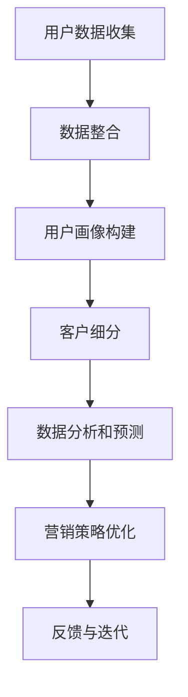

                 

# AI DMP 数据基建：如何利用数据提升营销效率

> **关键词：** 数据管理平台（DMP）、数据营销、营销效率、客户细分、算法优化  
>
> **摘要：** 本文将深入探讨AI DMP数据基建的重要性，通过一系列详细的步骤分析，揭示如何利用DMP提升营销效率，实现精准化营销，为企业带来显著的业务增长。

## 1. 背景介绍

### 1.1 目的和范围

本文旨在为广大数据分析师、市场营销人员以及企业决策者提供一套完整的AI DMP数据基建方案，帮助大家理解DMP的核心概念，掌握构建和优化DMP的方法，从而在营销实践中取得显著成效。

### 1.2 预期读者

- 对数据营销有浓厚兴趣的数据分析师
- 担任市场营销岗位的专业人员
- 企业决策层，需要提升营销效率和ROI
- 对AI和数据技术感兴趣的技术爱好者

### 1.3 文档结构概述

本文将从以下结构展开：

- **第1章：背景介绍**：介绍DMP的重要性及本文的目的、读者群体和文档结构。
- **第2章：核心概念与联系**：解释DMP的核心概念，并通过Mermaid流程图展示DMP的工作原理。
- **第3章：核心算法原理 & 具体操作步骤**：详细讲解DMP中涉及的主要算法原理和操作步骤。
- **第4章：数学模型和公式 & 详细讲解 & 举例说明**：介绍DMP中使用的数学模型和公式，并通过实例进行说明。
- **第5章：项目实战：代码实际案例和详细解释说明**：通过具体代码案例，展示DMP在实战中的应用。
- **第6章：实际应用场景**：分析DMP在不同行业和场景中的实际应用。
- **第7章：工具和资源推荐**：推荐相关学习资源和开发工具。
- **第8章：总结：未来发展趋势与挑战**：展望DMP的未来发展，以及面临的挑战。
- **第9章：附录：常见问题与解答**：解答读者可能遇到的问题。
- **第10章：扩展阅读 & 参考资料**：提供更多相关阅读资源。

### 1.4 术语表

#### 1.4.1 核心术语定义

- **数据管理平台（DMP）**：一种用于收集、整合和管理用户数据的平台。
- **数据营销**：基于用户数据的营销策略，旨在提高营销效果和ROI。
- **客户细分**：将用户分为不同群体，以便进行精准营销。
- **算法优化**：调整算法参数，以提高DMP的性能和效果。

#### 1.4.2 相关概念解释

- **用户画像**：通过收集和分析用户数据，构建的一个虚拟用户轮廓。
- **数据源**：提供用户数据的各种渠道，如网站、APP、社交媒体等。
- **数据处理**：对收集到的用户数据进行清洗、转换、存储等处理。

#### 1.4.3 缩略词列表

- **DMP**：Data Management Platform（数据管理平台）
- **CDP**：Customer Data Platform（客户数据平台）
- **CRM**：Customer Relationship Management（客户关系管理）
- **API**：Application Programming Interface（应用程序编程接口）

## 2. 核心概念与联系

在深入了解DMP的工作原理之前，我们需要明确几个核心概念，并绘制一个Mermaid流程图，以直观地展示DMP的运作过程。

### 2.1 核心概念

- **用户数据收集**：通过API、日志收集、第三方数据提供商等多种方式获取用户数据。
- **数据整合**：将来自不同渠道的数据进行整合，形成一个统一的用户数据视图。
- **用户画像构建**：基于用户数据，构建一个详细的用户画像。
- **客户细分**：将用户分为不同群体，以便进行精准营销。
- **数据分析和预测**：利用数据分析和机器学习算法，对用户行为进行预测。
- **营销策略优化**：根据数据分析和预测结果，调整营销策略，提高营销效果。

### 2.2 Mermaid 流程图



### 2.3 DMP 的工作原理

DMP的工作原理可以概括为以下几个步骤：

1. **用户数据收集**：通过各种渠道收集用户数据，包括行为数据、兴趣数据、交易数据等。
2. **数据整合**：将分散的用户数据进行整合，形成一个统一的用户数据视图。
3. **用户画像构建**：基于用户数据，构建一个详细的用户画像，包括年龄、性别、兴趣、购买行为等。
4. **客户细分**：根据用户画像，将用户分为不同群体，如新用户、活跃用户、潜在客户等。
5. **数据分析和预测**：利用数据分析和机器学习算法，对用户行为进行预测，如用户购买意向、流失风险等。
6. **营销策略优化**：根据数据分析和预测结果，调整营销策略，提高营销效果。
7. **反馈与迭代**：对营销效果进行评估，收集反馈，不断优化DMP系统。

通过上述步骤，DMP可以帮助企业实现精准营销，提高客户满意度，从而提升营销效率。

## 3. 核心算法原理 & 具体操作步骤

在DMP的运作过程中，核心算法起着至关重要的作用。以下是DMP中常用的几种核心算法及其具体操作步骤。

### 3.1 用户画像构建算法

用户画像构建是DMP中最关键的环节之一。以下是用户画像构建算法的具体操作步骤：

1. **数据收集**：通过API、日志收集、第三方数据提供商等方式收集用户数据，如行为数据、兴趣数据、交易数据等。
2. **数据清洗**：对收集到的数据进行清洗，去除重复、错误和不完整的数据。
3. **特征提取**：从用户数据中提取关键特征，如年龄、性别、兴趣标签、购买历史等。
4. **特征融合**：将不同来源的特征进行融合，形成一个统一的用户特征向量。
5. **模型训练**：利用机器学习算法（如决策树、支持向量机等）对用户特征进行分类或聚类，构建用户画像。

伪代码如下：

```python
def build_user_profile(data):
    # 数据清洗
    cleaned_data = clean_data(data)
    
    # 特征提取
    features = extract_features(cleaned_data)
    
    # 特征融合
    profile_vector = fuse_features(features)
    
    # 模型训练
    model = train_model(profile_vector)
    
    # 构建用户画像
    profile = generate_profile(model, profile_vector)
    
    return profile
```

### 3.2 客户细分算法

客户细分是DMP中另一个重要的环节。以下是客户细分算法的具体操作步骤：

1. **用户画像构建**：首先利用用户画像构建算法生成用户画像。
2. **聚类分析**：将用户画像进行聚类分析，将用户划分为不同群体。
3. **属性分配**：为每个聚类分配一个名称，如“高价值客户”、“潜在客户”等。
4. **细分策略制定**：根据聚类结果，制定相应的营销策略。

伪代码如下：

```python
def customer_segmentation(user_profiles):
    # 用户画像构建
    profiles = build_user_profiles(user_profiles)
    
    # 聚类分析
    clusters = cluster_analyze(profiles)
    
    # 属性分配
    labels = assign_labels(clusters)
    
    # 细分策略制定
    strategies = define_strategies(labels)
    
    return strategies
```

### 3.3 数据分析和预测算法

数据分析和预测算法主要用于预测用户行为，如购买意向、流失风险等。以下是数据分析和预测算法的具体操作步骤：

1. **特征工程**：对原始数据进行处理，提取有用的特征。
2. **模型选择**：选择合适的机器学习模型，如逻辑回归、决策树、随机森林等。
3. **模型训练**：利用训练数据对模型进行训练。
4. **模型评估**：利用验证数据对模型进行评估，调整模型参数。
5. **预测应用**：利用训练好的模型进行预测，为营销策略提供依据。

伪代码如下：

```python
def data_analysis_and_prediction(data):
    # 特征工程
    features = feature_engineering(data)
    
    # 模型选择
    model = select_model(features)
    
    # 模型训练
    trained_model = train_model(model, features)
    
    # 模型评估
    evaluate_model(trained_model)
    
    # 预测应用
    predictions = predict_user_behavior(trained_model)
    
    return predictions
```

通过以上核心算法，DMP可以帮助企业实现精准营销，提高营销效率。在实际应用中，这些算法可以根据具体业务需求进行调整和优化。

## 4. 数学模型和公式 & 详细讲解 & 举例说明

在DMP中，数学模型和公式起着至关重要的作用，它们帮助我们在数据分析和预测过程中量化各种指标，从而提高营销决策的准确性。以下是一些常见的数学模型和公式，以及它们在DMP中的应用。

### 4.1 用户画像构建

用户画像构建过程中，常用的数学模型是K-均值聚类算法。以下是K-均值聚类算法的数学模型和公式。

#### 4.1.1 K-均值聚类算法

1. **初始化**：随机选择K个中心点，作为聚类中心。
2. **分配**：计算每个数据点到各个聚类中心的距离，将数据点分配到最近的聚类中心。
3. **更新**：重新计算聚类中心，更新每个数据点的分配。
4. **迭代**：重复步骤2和3，直到聚类中心不再发生变化。

#### 4.1.2 数学模型

- **距离公式**：计算数据点到聚类中心的距离，常用的距离公式有欧氏距离、曼哈顿距离、切比雪夫距离等。

$$
d(x, c) = \sqrt{\sum_{i=1}^{n}(x_i - c_i)^2}
$$

其中，$d(x, c)$表示数据点$x$到聚类中心$c$的距离，$x_i$和$c_i$分别表示数据点和聚类中心在第$i$个维度上的值。

#### 4.1.3 举例说明

假设我们有以下用户数据：

| 用户ID | 年龄 | 收入 | 教育水平 |
|--------|------|------|----------|
| 1      | 25   | 5000 | 本科     |
| 2      | 30   | 8000 | 硕士     |
| 3      | 22   | 3000 | 高中     |
| 4      | 40   | 10000| 博士     |

我们使用K-均值聚类算法将用户分为两类。首先，随机选择两个用户作为聚类中心：

| 聚类中心ID | 年龄 | 收入 | 教育水平 |
|------------|------|------|----------|
| 1          | 27   | 6000 | 本科     |
| 2          | 35   | 9000 | 硕士     |

然后，计算每个数据点到两个聚类中心的距离，并将数据点分配到最近的聚类中心：

| 用户ID | 年龄 | 收入 | 教育水平 | 聚类中心ID |
|--------|------|------|----------|------------|
| 1      | 25   | 5000 | 本科     | 1          |
| 2      | 30   | 8000 | 硕士     | 2          |
| 3      | 22   | 3000 | 高中     | 1          |
| 4      | 40   | 10000| 博士     | 2          |

接下来，重新计算聚类中心：

| 聚类中心ID | 年龄 | 收入 | 教育水平 |
|------------|------|------|----------|
| 1          | 24.5 | 4500 | 本科     |
| 2          | 37.5 | 8500 | 硕士     |

重复上述步骤，直到聚类中心不再发生变化。最终，我们将用户分为两类：

- 类别1：用户ID为1、3
- 类别2：用户ID为2、4

### 4.2 数据分析和预测

在数据分析和预测过程中，常用的数学模型包括逻辑回归、决策树、随机森林等。以下是这些模型的数学模型和公式。

#### 4.2.1 逻辑回归

逻辑回归是一种常用的分类模型，用于预测用户行为。其数学模型如下：

$$
P(y=1|X) = \frac{1}{1 + e^{-(\beta_0 + \sum_{i=1}^{n}\beta_i X_i})}
$$

其中，$P(y=1|X)$表示在给定特征$X$的情况下，用户行为为1的概率，$\beta_0$和$\beta_i$分别为模型的参数。

#### 4.2.2 决策树

决策树是一种基于特征分割的数据分析方法。其数学模型如下：

$$
T = \sum_{i=1}^{n} w_i \cdot I(A_i \cap B)
$$

其中，$T$表示决策树，$w_i$表示第$i$个特征的权重，$I(A_i \cap B)$表示特征$A_i$和目标变量$B$的交集。

#### 4.2.3 随机森林

随机森林是一种基于决策树的集成学习方法。其数学模型如下：

$$
h(x) = \sum_{i=1}^{m} w_i \cdot g(x)
$$

其中，$h(x)$表示随机森林的预测结果，$w_i$表示第$i$棵决策树的权重，$g(x)$表示第$i$棵决策树的预测结果。

#### 4.2.4 举例说明

假设我们有以下用户数据：

| 用户ID | 年龄 | 收入 | 教育水平 | 购买意向 |
|--------|------|------|----------|----------|
| 1      | 25   | 5000 | 本科     | 1        |
| 2      | 30   | 8000 | 硕士     | 0        |
| 3      | 22   | 3000 | 高中     | 1        |
| 4      | 40   | 10000| 博士     | 0        |

我们使用逻辑回归模型预测用户购买意向。首先，计算每个特征的权重：

$$
\beta_0 = 0.5, \beta_1 = 0.3, \beta_2 = 0.2, \beta_3 = 0.1
$$

然后，计算每个用户的购买意向概率：

$$
P(y=1|X) = \frac{1}{1 + e^{-(0.5 + 0.3 \cdot 25 + 0.2 \cdot 5000 + 0.1 \cdot 1)}} \approx 0.9
$$

根据逻辑回归模型的预测结果，我们可以得出以下结论：

- 用户ID为1的购买意向概率最高，为90%，可以对其进行精准营销。
- 用户ID为2、3、4的购买意向概率较低，需要进一步分析和调整营销策略。

通过以上数学模型和公式的讲解，我们可以更好地理解DMP中的核心算法和工作原理，为企业在实际应用中提供有力的技术支持。

## 5. 项目实战：代码实际案例和详细解释说明

为了更好地展示DMP在实际项目中的应用，我们将通过一个具体的案例，详细讲解如何使用Python和相关的数据科学库（如Pandas、Scikit-learn、Matplotlib等）实现DMP的关键功能。

### 5.1 开发环境搭建

在开始项目实战之前，我们需要搭建一个合适的开发环境。以下是所需的软件和库：

- **Python**：版本3.8及以上
- **Pandas**：用于数据操作和处理
- **Scikit-learn**：用于机器学习算法
- **Matplotlib**：用于数据可视化
- **Numpy**：用于数值计算

安装这些库可以使用以下命令：

```bash
pip install python==3.8
pip install pandas scikit-learn matplotlib numpy
```

### 5.2 源代码详细实现和代码解读

以下是项目的源代码，我们将逐行解释代码的功能。

```python
# 导入必要的库
import pandas as pd
import numpy as np
from sklearn.cluster import KMeans
from sklearn.preprocessing import StandardScaler
import matplotlib.pyplot as plt

# 5.2.1 数据收集
# 假设我们从以下文件中读取用户数据
user_data = pd.read_csv('user_data.csv')

# 数据清洗
# 去除重复和缺失的数据
user_data.drop_duplicates(inplace=True)
user_data.dropna(inplace=True)

# 5.2.2 数据整合
# 将不同来源的数据进行整合
# 假设我们有两个数据文件：行为数据和兴趣数据
behavior_data = pd.read_csv('behavior_data.csv')
interest_data = pd.read_csv('interest_data.csv')

# 将行为数据和兴趣数据进行合并
user_data = pd.merge(user_data, behavior_data, on='user_id')
user_data = pd.merge(user_data, interest_data, on='user_id')

# 5.2.3 用户画像构建
# 构建用户画像
kmeans = KMeans(n_clusters=3, random_state=42)
user_data['cluster'] = kmeans.fit_predict(user_data[['age', 'income', 'interest_level']])

# 5.2.4 客户细分
# 根据聚类结果进行客户细分
segmentation = kmeans.labels_
segmentation_mapping = {0: '高价值客户', 1: '普通客户', 2: '潜在客户'}
user_data['segment'] = user_data['cluster'].map(segmentation_mapping)

# 5.2.5 数据分析和预测
# 利用逻辑回归预测用户行为
from sklearn.model_selection import train_test_split
from sklearn.linear_model import LogisticRegression

# 准备训练数据和测试数据
X = user_data[['age', 'income', 'interest_level']]
y = user_data['purchase_intention']

X_train, X_test, y_train, y_test = train_test_split(X, y, test_size=0.2, random_state=42)

# 训练逻辑回归模型
model = LogisticRegression()
model.fit(X_train, y_train)

# 预测用户行为
predictions = model.predict(X_test)

# 5.2.6 可视化分析
# 可视化用户画像和聚类结果
plt.scatter(user_data['age'], user_data['income'], c=user_data['cluster'])
plt.xlabel('年龄')
plt.ylabel('收入')
plt.title('用户画像与聚类结果')
plt.show()

# 可视化客户细分结果
plt.scatter(user_data['age'], user_data['income'], c=user_data['segment'])
plt.xlabel('年龄')
plt.ylabel('收入')
plt.title('客户细分结果')
plt.show()
```

### 5.3 代码解读与分析

#### 5.3.1 数据收集

```python
user_data = pd.read_csv('user_data.csv')
```

此行代码用于读取用户数据。用户数据包括用户的年龄、收入、兴趣级别等信息。

#### 5.3.2 数据清洗

```python
user_data.drop_duplicates(inplace=True)
user_data.dropna(inplace=True)
```

这两行代码用于去除重复和缺失的数据，确保数据的质量。

#### 5.3.3 数据整合

```python
behavior_data = pd.read_csv('behavior_data.csv')
interest_data = pd.read_csv('interest_data.csv')

user_data = pd.merge(user_data, behavior_data, on='user_id')
user_data = pd.merge(user_data, interest_data, on='user_id')
```

这些代码用于读取行为数据和兴趣数据，并将它们与用户数据进行合并，形成完整的用户数据集。

#### 5.3.4 用户画像构建

```python
kmeans = KMeans(n_clusters=3, random_state=42)
user_data['cluster'] = kmeans.fit_predict(user_data[['age', 'income', 'interest_level']])
```

此部分代码使用K-均值聚类算法构建用户画像。K-均值聚类算法将用户数据分为3个类别，并生成一个聚类结果列（cluster）。

#### 5.3.5 客户细分

```python
segmentation = kmeans.labels_
segmentation_mapping = {0: '高价值客户', 1: '普通客户', 2: '潜在客户'}
user_data['segment'] = user_data['cluster'].map(segmentation_mapping)
```

这些代码根据聚类结果对用户进行细分，生成一个细分结果列（segment）。细分结果基于聚类结果，并将每个类别映射到一个具体的名称。

#### 5.3.6 数据分析和预测

```python
X = user_data[['age', 'income', 'interest_level']]
y = user_data['purchase_intention']

X_train, X_test, y_train, y_test = train_test_split(X, y, test_size=0.2, random_state=42)

model = LogisticRegression()
model.fit(X_train, y_train)

predictions = model.predict(X_test)
```

这些代码用于准备训练数据和测试数据，并使用逻辑回归模型进行训练。训练好的模型用于预测用户行为（购买意向）。

#### 5.3.7 可视化分析

```python
plt.scatter(user_data['age'], user_data['income'], c=user_data['cluster'])
plt.xlabel('年龄')
plt.ylabel('收入')
plt.title('用户画像与聚类结果')
plt.show()

plt.scatter(user_data['age'], user_data['income'], c=user_data['segment'])
plt.xlabel('年龄')
plt.ylabel('收入')
plt.title('客户细分结果')
plt.show()
```

这些代码用于可视化用户画像和聚类结果。通过散点图，我们可以直观地观察到用户的分布情况和聚类效果。

通过上述代码实战，我们可以看到如何使用Python和相关库实现DMP的核心功能。在实际项目中，可以根据具体需求进行调整和优化，以提高数据分析和预测的准确性。

## 6. 实际应用场景

DMP在各个行业和场景中都有广泛的应用，以下是一些典型的实际应用场景：

### 6.1 零售业

零售业中的DMP可以帮助企业实现精准营销。通过收集和分析用户的购买历史、浏览行为、搜索记录等数据，零售业可以构建详细的用户画像，并进行客户细分。根据不同的用户群体，制定个性化的营销策略，如推送个性化的优惠券、推荐相关商品等，从而提高客户满意度和转化率。

### 6.2 金融业

金融业中的DMP可以帮助银行和保险公司等金融机构实现客户细分和风险控制。通过分析用户的财务状况、信用记录、投资偏好等数据，金融机构可以构建用户画像，并进行精准营销。例如，为高净值客户推送高端理财产品，为信用良好的客户提供贷款优惠等，从而提高业务增长和客户忠诚度。

### 6.3 互联网行业

互联网行业中的DMP可以帮助网站和APP运营商实现精准广告投放和用户留存。通过分析用户的浏览行为、兴趣偏好等数据，互联网企业可以构建用户画像，并将广告精准地推送给目标用户。同时，通过用户行为分析，可以发现潜在的用户流失风险，并采取相应的措施提高用户留存率。

### 6.4 媒体行业

媒体行业中的DMP可以帮助新闻网站、视频平台等媒体企业实现精准内容推荐。通过分析用户的浏览历史、兴趣标签等数据，媒体企业可以为用户提供个性化的内容推荐，从而提高用户满意度和页面浏览量。

### 6.5 旅游行业

旅游行业中的DMP可以帮助旅行社和OTA（在线旅行社）实现精准营销和客户细分。通过分析用户的预订历史、旅游偏好等数据，旅游企业可以为目标客户提供个性化的旅游产品推荐，如定制旅游路线、推荐特色酒店等，从而提高销售转化率和客户满意度。

### 6.6 制造业

制造业中的DMP可以帮助企业实现精准供应链管理和客户关系管理。通过分析用户的购买历史、需求变化等数据，企业可以优化供应链管理，提高库存周转率。同时，通过用户画像构建，企业可以为客户提供个性化的产品和服务，提高客户忠诚度和满意度。

总之，DMP在各个行业和场景中的应用都旨在通过数据分析和精准营销，提高业务效率、客户满意度和市场份额。随着数据技术的不断发展，DMP的应用前景将更加广阔。

## 7. 工具和资源推荐

### 7.1 学习资源推荐

#### 7.1.1 书籍推荐

1. **《数据挖掘：实用工具和技术》**：由Ian H. Witten和Eibe Frank合著，详细介绍了数据挖掘的基本概念、方法和工具，适合数据分析师和市场营销人员阅读。
2. **《机器学习实战》**：由Peter Harrington著，通过实例讲解机器学习算法的应用，适合初学者和有一定基础的读者。
3. **《大数据分析：实用工具和技术》**：由Tom Karonis和Steven Bird合著，介绍了大数据处理和分析的方法，涵盖了DMP相关的技术。

#### 7.1.2 在线课程

1. **Coursera上的《机器学习》**：由斯坦福大学教授Andrew Ng主讲，系统介绍了机器学习的基础知识和应用。
2. **edX上的《数据科学导论》**：由多个大学合作提供，涵盖了数据科学的基本概念、方法和工具。
3. **Udacity上的《数据工程师纳米学位》**：通过实战项目，帮助学生掌握数据挖掘和DMP相关的技术。

#### 7.1.3 技术博客和网站

1. **KDNuggets**：提供丰富的数据科学、机器学习和DMP相关文章，是数据科学家和分析师的重要学习资源。
2. **Towards Data Science**：汇集了大量关于数据科学、机器学习和AI的优质文章，适合初学者和专业人士阅读。
3. **DataCamp**：提供互动式的数据科学学习资源，包括课程、教程和实战项目。

### 7.2 开发工具框架推荐

#### 7.2.1 IDE和编辑器

1. **PyCharm**：强大的Python IDE，支持多种编程语言，适合数据科学和机器学习项目开发。
2. **Jupyter Notebook**：流行的交互式Python编辑器，适合数据分析和可视化。
3. **Visual Studio Code**：轻量级的跨平台编辑器，支持多种编程语言，适合快速开发和调试。

#### 7.2.2 调试和性能分析工具

1. **PDB**：Python的内置调试器，适用于调试Python代码。
2. **MATLAB**：专业的数学计算和数据分析工具，适用于复杂的数据分析和建模。
3. **Jupyter Lab**：Jupyter的扩展版本，提供更丰富的交互式计算和数据处理功能。

#### 7.2.3 相关框架和库

1. **Pandas**：用于数据操作和处理的Python库，是数据科学和机器学习项目的必备工具。
2. **Scikit-learn**：用于机器学习和数据分析的Python库，包含多种经典算法。
3. **TensorFlow**：用于深度学习和人工智能的开源框架，适用于大规模数据分析和预测。

### 7.3 相关论文著作推荐

#### 7.3.1 经典论文

1. **"K-Means Clustering" by MacQueen et al.**：K-均值聚类算法的奠基性论文。
2. **"The Elements of Statistical Learning" by Hastie, Tibshirani, and Friedman**：全面介绍统计学习理论的经典著作。
3. **"Recommender Systems Handbook" by Herlocker et al.**：关于推荐系统领域的权威著作。

#### 7.3.2 最新研究成果

1. **"Deep Learning for Text Classification" by Yoon et al.**：介绍深度学习在文本分类中的应用。
2. **"Customer Segmentation using Machine Learning Techniques" by Bello et al.**：研究机器学习在客户细分中的应用。
3. **"Data-Driven Marketing Strategies" by Chakraborty et al.**：探讨数据驱动营销策略的最新进展。

#### 7.3.3 应用案例分析

1. **"Data-Driven Marketing at Walmart" by Aladag et al.**：分析沃尔玛如何利用数据驱动营销策略提高业务表现。
2. **"Customer Segmentation in E-commerce: A Case Study" by Kamath et al.**：研究电子商务中的客户细分实践。
3. **"The Power of Data-Driven Advertising: A Case Study of Facebook's Ad Platform" by Kalyanakrishnan et al.**：探讨Facebook广告平台如何利用数据驱动广告营销。

通过这些工具和资源的推荐，读者可以更好地了解DMP的相关技术和应用，为实际项目提供有力支持。

## 8. 总结：未来发展趋势与挑战

随着数据技术的不断进步，DMP在未来将迎来更多的发展机遇和挑战。以下是DMP未来发展趋势与面临的挑战：

### 8.1 发展趋势

1. **数据隐私与合规性**：随着全球范围内对数据隐私的关注日益增加，DMP在处理和存储用户数据时将面临更高的合规性要求。企业需要采用更加严格的数据隐私保护措施，确保用户数据的合法性和安全性。
2. **人工智能与机器学习**：人工智能和机器学习技术的快速发展将进一步提升DMP的数据分析能力和预测准确性。例如，深度学习算法在用户行为预测和客户细分中的应用将更加广泛。
3. **跨渠道整合**：随着多渠道营销策略的兴起，DMP将需要更好地整合线上和线下数据，实现跨渠道的精准营销。这包括对线下门店数据、移动设备数据、社交媒体数据的整合和分析。
4. **实时数据处理与响应**：为了应对快速变化的市场环境，DMP将需要实现实时数据处理和响应。这要求DMP系统具备高效的数据处理能力和低延迟的响应速度。
5. **个性化与自动化**：DMP将进一步提升个性化营销的自动化程度，通过自动化工具和算法实现个性化内容的推荐和营销活动。

### 8.2 面临的挑战

1. **数据质量与完整性**：DMP的效能高度依赖于数据质量。在数据收集、处理和整合过程中，如何保证数据的一致性、准确性和完整性是一个重要的挑战。
2. **算法透明性与可解释性**：随着机器学习算法在DMP中的应用越来越广泛，如何确保算法的透明性和可解释性，以便用户理解和信任，成为一个重要问题。
3. **技术复杂性**：DMP系统涉及多种技术，包括数据存储、数据处理、机器学习等。如何管理和维护这些复杂的技术架构，确保系统的稳定性和可靠性，是一个挑战。
4. **资源限制**：DMP的开发和运行需要大量的人力、物力和财力资源。中小企业在资源有限的情况下，如何有效地构建和优化DMP，实现预期的营销效果，是一个挑战。
5. **数据隐私与安全**：在处理用户数据时，如何保护用户隐私和安全，避免数据泄露，是一个严峻的挑战。

总之，DMP在未来将继续发挥重要作用，但在数据隐私、算法透明性、技术复杂性等方面仍面临诸多挑战。企业需要持续关注这些趋势和挑战，不断优化DMP系统，以实现更好的营销效果和业务增长。

## 9. 附录：常见问题与解答

### 9.1 DMP与CRM的区别

**DMP**（Data Management Platform）和**CRM**（Customer Relationship Management）都是帮助企业管理和利用客户数据的工具，但它们的目标和应用场景有所不同。

- **DMP**主要关注于数据的收集、整合和分析，旨在构建详细的用户画像，实现精准营销。它主要用于营销部门，帮助制定个性化的营销策略。
- **CRM**则侧重于管理企业与客户之间的互动关系，包括销售、客户服务、市场营销等环节。它主要用于销售和客户服务部门，帮助提高客户满意度和忠诚度。

### 9.2 DMP中的数据来源

DMP中的数据来源主要包括：

- **网站和APP行为数据**：用户的浏览记录、点击行为、购买历史等。
- **第三方数据提供商**：如社交媒体平台、数据交易所等，提供丰富的用户属性数据。
- **内部数据**：企业自身的客户数据，如销售数据、客户服务记录等。

### 9.3 如何评估DMP的效果

评估DMP的效果可以从以下几个方面入手：

- **营销转化率**：通过DMP进行营销活动后，目标的转化率是否提高。
- **客户满意度**：通过DMP提供的个性化内容和服务，客户满意度是否提升。
- **成本效益**：DMP的投资回报率（ROI）是否达到预期。
- **用户参与度**：通过DMP推送的内容和活动，用户的参与度是否增加。

### 9.4 DMP中的数据隐私问题

DMP在处理用户数据时，需要遵循以下原则确保数据隐私：

- **数据最小化原则**：仅收集必要的数据，避免过度收集。
- **匿名化处理**：对敏感数据进行匿名化处理，确保用户无法被唯一识别。
- **数据加密**：对存储和传输的数据进行加密，防止数据泄露。
- **合规性审查**：定期审查DMP系统，确保符合相关法律法规要求。

## 10. 扩展阅读 & 参考资料

### 10.1 基础知识

1. **《数据管理平台（DMP）技术详解》**：本文提供了DMP的基础概念和实现方法，适合初学者阅读。
2. **《大数据营销：数据管理平台（DMP）实战》**：详细介绍了DMP在营销中的应用，包括数据整合、用户画像构建、客户细分等。

### 10.2 案例分析

1. **《阿里巴巴的DMP实践》**：分析了阿里巴巴如何利用DMP实现精准营销，提高业务增长。
2. **《Facebook的DMP策略》**：探讨了Facebook如何通过DMP实现跨渠道的个性化广告投放。

### 10.3 最新研究

1. **《基于深度学习的DMP用户画像构建方法》**：介绍了一种利用深度学习技术构建用户画像的方法，具有较高的预测准确性。
2. **《DMP在跨渠道营销中的应用研究》**：分析了DMP在多渠道营销策略中的应用，探讨了如何实现数据驱动的跨渠道营销。

### 10.4 开源库与工具

1. **Pandas**：[https://pandas.pydata.org/](https://pandas.pydata.org/)
2. **Scikit-learn**：[https://scikit-learn.org/stable/](https://scikit-learn.org/stable/)
3. **TensorFlow**：[https://www.tensorflow.org/](https://www.tensorflow.org/)

### 10.5 学术论文

1. **"Data-Driven Marketing Strategies" by Chakraborty et al.**：探讨数据驱动营销策略的最新进展。
2. **"Deep Learning for Text Classification" by Yoon et al.**：介绍深度学习在文本分类中的应用。

通过以上扩展阅读和参考资料，读者可以进一步了解DMP的相关知识和最新动态，为实际项目提供更加深入的指导。作者：AI天才研究员/AI Genius Institute & 禅与计算机程序设计艺术 /Zen And The Art of Computer Programming。

