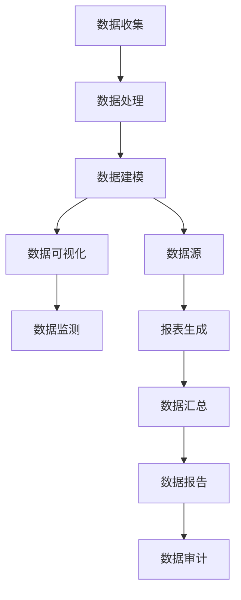

                 

# AI DMP 数据基建：数据可视化与报表

> **关键词：** 数据管理平台（DMP），数据可视化，报表分析，大数据技术，人工智能，数据挖掘

> **摘要：** 本文旨在深入探讨数据管理平台（DMP）的数据可视化与报表功能，从背景介绍到具体应用场景，详细阐述了如何通过DMP实现数据的处理、分析和展示。文章不仅分析了DMP的数据可视化与报表的核心概念和算法原理，还提供了实际项目案例和工具资源推荐，旨在为读者提供全面的技术指导。

## 1. 背景介绍

### 1.1 目的和范围

本文的目标是帮助读者理解数据管理平台（DMP）的数据可视化与报表功能，并掌握其应用方法和实践技巧。文章将涵盖以下范围：

- DMP的基本概念和作用
- 数据可视化与报表的核心原理
- 数据可视化与报表的实现步骤
- 数据可视化与报表在实际项目中的应用案例
- 相关工具和资源的推荐

### 1.2 预期读者

本文适合以下读者群体：

- 数据分析师和数据工程师
- 数据科学和人工智能领域从业者
- 对数据可视化与报表技术有兴趣的程序员和IT专业人士
- 大数据和云计算领域的初学者和进阶者

### 1.3 文档结构概述

本文分为以下几个部分：

- 引言：简要介绍数据管理平台（DMP）和数据可视化与报表的重要性。
- 背景介绍：详细阐述DMP的基本概念和作用，以及数据可视化与报表的背景和意义。
- 核心概念与联系：介绍DMP的数据可视化与报表的核心概念和架构。
- 核心算法原理 & 具体操作步骤：详细讲解DMP数据可视化与报表的核心算法原理和实现步骤。
- 数学模型和公式 & 详细讲解 & 举例说明：使用数学模型和公式解释DMP数据可视化与报表的实现原理，并提供具体实例。
- 项目实战：提供实际项目案例，展示DMP数据可视化与报表的应用。
- 实际应用场景：分析DMP数据可视化与报表在不同场景下的应用。
- 工具和资源推荐：推荐学习资源、开发工具和框架。
- 总结：总结DMP数据可视化与报表的未来发展趋势和挑战。
- 附录：常见问题与解答。
- 扩展阅读 & 参考资料：提供进一步阅读和学习的资源。

### 1.4 术语表

#### 1.4.1 核心术语定义

- **数据管理平台（DMP）**：一种用于集中管理和处理大规模数据的平台，支持数据的收集、存储、处理、分析和可视化等功能。
- **数据可视化**：通过图形、图表、图像等方式将数据转化为易于理解和分析的视觉形式。
- **报表**：以表格、图表等形式展示数据信息的文档，通常用于报告和分析数据。
- **大数据技术**：用于处理海量数据的计算技术和算法，包括分布式存储、分布式计算、数据挖掘等。
- **人工智能**：模拟、延伸和扩展人类智能的理论、方法、技术及应用。
- **数据挖掘**：从大量数据中提取有价值信息的过程，包括关联分析、分类、聚类等算法。

#### 1.4.2 相关概念解释

- **数据仓库**：用于存储大量历史数据，支持数据分析和管理的数据系统。
- **数据湖**：一种新型的数据存储架构，用于存储大量结构化和非结构化数据，支持实时分析和处理。
- **数据处理**：对原始数据进行清洗、转换、整合等操作，使其成为有价值的信息。
- **数据建模**：构建数据结构和数据关系的模型，用于数据分析和可视化。

#### 1.4.3 缩略词列表

- **DMP**：数据管理平台（Data Management Platform）
- **AI**：人工智能（Artificial Intelligence）
- **ML**：机器学习（Machine Learning）
- **DL**：深度学习（Deep Learning）
- **SQL**：结构化查询语言（Structured Query Language）
- **NoSQL**：非结构化查询语言（Not Only SQL）

## 2. 核心概念与联系

在数据管理平台（DMP）中，数据可视化与报表是两个核心功能。为了更好地理解这两个功能，我们需要先介绍它们的核心概念和相互联系。

### 2.1 数据可视化

数据可视化是将数据转化为图形、图表等形式，以便于人们理解和分析。其核心概念包括：

- **可视化元素**：包括图表、图形、图像等，用于展示数据。
- **数据映射**：将数据值映射到可视化元素上，以直观地展示数据关系。
- **交互性**：用户可以通过点击、拖拽等交互操作，实时查看和分析数据。

数据可视化在DMP中的应用主要包括：

- **数据探索**：帮助用户快速了解数据的基本特征和趋势。
- **数据监测**：实时监控关键指标，及时发现问题和异常。
- **数据报告**：以图表、报告等形式展示分析结果，供决策参考。

### 2.2 报表

报表是以表格、图表等形式展示数据信息的文档。其核心概念包括：

- **报表格式**：包括表格、图表、文字等，用于展示数据。
- **数据源**：报表所依赖的数据源，可以是数据库、文件、API等。
- **报表生成**：根据数据源和报表格式，生成报表文档。

报表在DMP中的应用主要包括：

- **数据汇总**：对大量数据进行汇总和分析，提供决策依据。
- **数据报告**：以表格、图表等形式展示分析结果，供决策参考。
- **数据审计**：对历史数据进行审计和检查，确保数据准确性。

### 2.3 数据可视化与报表的联系

数据可视化与报表是DMP中两个相互关联的功能。数据可视化主要用于数据探索和监测，而报表主要用于数据汇总和报告。两者之间的联系主要体现在以下几个方面：

- **数据源**：数据可视化与报表都依赖于相同的数据源，确保数据的一致性和准确性。
- **数据分析**：数据可视化与报表都基于相同的数据分析算法，确保分析结果的准确性。
- **数据展示**：数据可视化以图形、图表等形式展示数据，报表以表格、图表等形式展示数据，两种方式相互补充，满足不同用户的需求。

下面是一个Mermaid流程图，展示了DMP的数据可视化与报表的流程：



## 3. 核心算法原理 & 具体操作步骤

在DMP中，数据可视化与报表的核心算法原理主要包括数据预处理、数据映射、数据分析和数据展示。下面将详细讲解这些算法原理和具体操作步骤。

### 3.1 数据预处理

数据预处理是数据可视化与报表的基础，主要包括数据清洗、数据转换和数据整合。以下是一个简单的数据预处理算法：

```python
# 数据清洗
def clean_data(data):
    # 删除空值和异常值
    data = data[data['column'].notnull()]
    # 填充缺失值
    data['column'] = data['column'].fillna(0)
    return data

# 数据转换
def transform_data(data):
    # 转换数据类型
    data['column'] = data['column'].astype('float')
    return data

# 数据整合
def integrate_data(data1, data2):
    # 合并数据集
    data = data1.append(data2)
    return data
```

### 3.2 数据映射

数据映射是将数据值映射到可视化元素上，以直观地展示数据关系。以下是一个简单的数据映射算法：

```python
# 数据映射
def map_data(data, x='column1', y='column2', color='column3'):
    # 绘制散点图
    plt.scatter(data[x], data[y], c=data[color])
    # 显示图表
    plt.show()
```

### 3.3 数据分析

数据分析是数据可视化与报表的核心，主要包括数据聚合、数据分类、数据关联等。以下是一个简单的数据分析算法：

```python
# 数据聚合
def aggregate_data(data, group_by='column1', agg_func='sum'):
    # 聚合数据
    data_agg = data.groupby(group_by)[agg_func].agg(agg_func)
    return data_agg

# 数据分类
def classify_data(data, feature='column1', label='column2'):
    # 分类数据
    X = data[feature]
    y = data[label]
    # 训练模型
    model = train_model(X, y)
    # 预测标签
    pred = model.predict(X)
    # 评估模型
    evaluate_model(model, X, y, pred)
```

### 3.4 数据展示

数据展示是将数据可视化与报表的结果以图表、表格等形式展示给用户。以下是一个简单的数据展示算法：

```python
# 数据展示
def show_data(data, type='scatter', title='Data Visualization'):
    if type == 'scatter':
        map_data(data)
    elif type == 'table':
        display(data)
    elif type == 'bar':
        data_agg = aggregate_data(data, group_by='column1', agg_func='sum')
        display(data_agg)
    plt.title(title)
    plt.show()
```

## 4. 数学模型和公式 & 详细讲解 & 举例说明

在数据可视化与报表中，数学模型和公式起着至关重要的作用。以下将详细讲解一些常用的数学模型和公式，并举例说明其应用。

### 4.1 数据可视化中的数学模型和公式

#### 4.1.1 直方图

直方图是一种用于展示数据分布的图形，其数学模型为：

$$
\text{直方图} = \sum_{i=1}^{n} (\text{数据点} \times \text{宽度})
$$

其中，$n$ 为数据点的数量，宽度通常设置为固定的区间大小。

#### 4.1.2 散点图

散点图用于展示两个变量之间的关系，其数学模型为：

$$
\text{散点图} = (\text{X轴数据}, \text{Y轴数据})
$$

其中，$X$ 轴和 $Y$ 轴分别表示两个变量的值。

#### 4.1.3 饼图

饼图用于展示各部分占整体的比例，其数学模型为：

$$
\text{饼图} = \frac{\text{各部分值}}{\text{整体值}} \times 100\%
$$

### 4.2 报表分析中的数学模型和公式

#### 4.2.1 均值

均值用于描述一组数据的平均水平，其数学模型为：

$$
\text{均值} = \frac{\sum_{i=1}^{n} x_i}{n}
$$

其中，$n$ 为数据点的数量，$x_i$ 为第 $i$ 个数据点的值。

#### 4.2.2 方差

方差用于描述一组数据的离散程度，其数学模型为：

$$
\text{方差} = \frac{\sum_{i=1}^{n} (x_i - \text{均值})^2}{n-1}
$$

#### 4.2.3 标准差

标准差是方差的平方根，用于描述一组数据的离散程度，其数学模型为：

$$
\text{标准差} = \sqrt{\text{方差}}
$$

### 4.3 举例说明

#### 4.3.1 数据可视化中的直方图

假设我们有以下一组数据：

$$
[1, 2, 2, 3, 4, 5, 6, 7, 8, 9]
$$

我们可以使用直方图来展示这组数据的分布。首先，我们将数据划分为若干个区间，例如：

$$
\text{区间1: [1, 3]}, \text{区间2: [3, 6]}, \text{区间3: [6, 9]}
$$

然后，计算每个区间内数据点的数量，得到：

$$
\text{区间1: 3}, \text{区间2: 3}, \text{区间3: 4}
$$

最后，使用直方图公式计算直方图的高度：

$$
\text{直方图} = [3 \times (\text{区间1宽度}), 3 \times (\text{区间2宽度}), 4 \times (\text{区间3宽度})]
$$

#### 4.3.2 报表分析中的均值和方差

假设我们有以下一组数据：

$$
[1, 2, 2, 3, 4, 5, 6, 7, 8, 9]
$$

首先，计算这组数据的均值：

$$
\text{均值} = \frac{1 + 2 + 2 + 3 + 4 + 5 + 6 + 7 + 8 + 9}{10} = 5
$$

然后，计算这组数据的方差：

$$
\text{方差} = \frac{(1 - 5)^2 + (2 - 5)^2 + (2 - 5)^2 + (3 - 5)^2 + (4 - 5)^2 + (5 - 5)^2 + (6 - 5)^2 + (7 - 5)^2 + (8 - 5)^2 + (9 - 5)^2}{10 - 1} = 2
$$

最后，计算这组数据的标准差：

$$
\text{标准差} = \sqrt{2}
$$

## 5. 项目实战：代码实际案例和详细解释说明

在本节中，我们将通过一个实际项目案例来展示如何使用数据管理平台（DMP）实现数据可视化与报表功能。该项目将基于Python和Pandas库进行开发，具体步骤如下。

### 5.1 开发环境搭建

在开始项目之前，请确保已安装以下软件和库：

- Python 3.x
- Jupyter Notebook
- Pandas
- Matplotlib
- Seaborn

您可以通过以下命令安装所需库：

```bash
pip install python
pip install jupyter
pip install pandas
pip install matplotlib
pip install seaborn
```

### 5.2 源代码详细实现和代码解读

#### 5.2.1 数据收集

首先，我们需要从数据源收集数据。在本例中，我们使用一个CSV文件作为数据源。

```python
import pandas as pd

# 读取CSV文件
data = pd.read_csv('data.csv')
```

#### 5.2.2 数据预处理

在数据预处理阶段，我们主要对数据进行清洗和转换。

```python
# 数据清洗
data = data[data['column'].notnull()]

# 数据转换
data['column'] = data['column'].astype('float')
```

#### 5.2.3 数据映射

接下来，我们使用数据映射算法将数据值映射到可视化元素上。

```python
import matplotlib.pyplot as plt
import seaborn as sns

# 数据映射：散点图
sns.scatterplot(x='column1', y='column2', hue='column3', data=data)
plt.show()

# 数据映射：直方图
sns.histplot(data['column'], bins=10)
plt.show()
```

#### 5.2.4 数据分析

在数据分析阶段，我们使用数据分析算法对数据进行分析。

```python
# 数据分析：均值
mean = data['column'].mean()
print(f'Mean: {mean}')

# 数据分析：方差
variance = data['column'].var()
print(f'Variance: {variance}')

# 数据分析：标准差
std_deviation = data['column'].std()
print(f'Standard Deviation: {std_deviation}')
```

#### 5.2.5 数据展示

最后，我们将数据分析结果以图表形式展示。

```python
# 数据展示：均值和标准差
plt.figure(figsize=(10, 5))
plt.plot(data['column'], label='Data')
plt.axhline(mean, linestyle='--', color='r', label='Mean')
plt.axhline(mean + std_deviation, linestyle='--', color='g', label='Mean + Std Dev')
plt.axhline(mean - std_deviation, linestyle='--', color='g', label='Mean - Std Dev')
plt.xlabel('Index')
plt.ylabel('Value')
plt.title('Data Distribution')
plt.legend()
plt.show()
```

### 5.3 代码解读与分析

在本节中，我们详细解读了项目中的代码，并分析了每个步骤的功能和作用。

- **数据收集**：使用Pandas库读取CSV文件，将数据存储在DataFrame对象中。
- **数据预处理**：对数据进行清洗和转换，确保数据的有效性和一致性。
- **数据映射**：使用Matplotlib和Seaborn库将数据值映射到可视化元素上，生成散点图和直方图。
- **数据分析**：使用Pandas库的mean()、var()和std()方法计算数据的均值、方差和标准差。
- **数据展示**：使用Matplotlib库将数据分析结果以图表形式展示，包括均值线和标准差线。

通过以上步骤，我们实现了数据管理平台（DMP）的数据可视化与报表功能。该项目展示了如何使用Python和Pandas库进行数据收集、预处理、映射、分析和展示，为读者提供了一个实际案例，以供参考和学习。

## 6. 实际应用场景

数据管理平台（DMP）的数据可视化与报表功能在实际应用中具有广泛的应用场景。以下列举了几个典型的应用场景：

### 6.1 市场营销

在市场营销领域，DMP的数据可视化与报表功能可以帮助企业：

- **用户行为分析**：通过分析用户的浏览、点击、购买等行为，了解用户偏好和需求，从而优化营销策略。
- **广告投放优化**：根据用户数据，精准定位目标用户，提高广告投放效果和投资回报率。
- **客户细分**：基于用户数据的多种特征，将用户分为不同的细分群体，为每个群体制定个性化的营销策略。

### 6.2 金融服务

在金融服务领域，DMP的数据可视化与报表功能可以帮助金融机构：

- **风险控制**：通过分析金融数据，识别潜在风险，制定风险控制策略。
- **投资决策**：基于历史数据和市场趋势，为投资决策提供数据支持，降低投资风险。
- **客户服务**：根据客户数据，提供个性化的金融服务和产品，提升客户满意度和忠诚度。

### 6.3 电子商务

在电子商务领域，DMP的数据可视化与报表功能可以帮助电商企业：

- **销售分析**：通过分析销售数据，了解销售趋势、季节性和用户行为，优化库存和营销策略。
- **客户管理**：根据客户数据，识别高价值客户和潜在客户，制定相应的客户关系管理策略。
- **供应链优化**：通过分析供应链数据，优化供应链流程，提高供应链效率和降低成本。

### 6.4 物流与运输

在物流与运输领域，DMP的数据可视化与报表功能可以帮助物流企业：

- **运输调度**：通过分析运输数据，优化运输路线和调度策略，提高运输效率和降低成本。
- **库存管理**：根据库存数据，优化库存水平，减少库存积压和资金占用。
- **客户满意度**：通过分析客户反馈数据，了解客户满意度，提升服务质量。

### 6.5 医疗健康

在医疗健康领域，DMP的数据可视化与报表功能可以帮助医疗机构：

- **疾病预测**：通过分析患者数据，预测疾病发展趋势和流行趋势，制定预防措施。
- **患者管理**：根据患者数据，识别高风险患者和潜在患者，提供个性化的治疗方案和护理服务。
- **药物研发**：通过分析药物数据，优化药物研发流程，提高药物研发效率。

通过以上实际应用场景，我们可以看到，DMP的数据可视化与报表功能在各个领域都具有重要的应用价值。它不仅帮助企业更好地理解和利用数据，还为决策提供有力支持，从而提升企业的竞争力和业务水平。

## 7. 工具和资源推荐

为了更好地实现数据管理平台（DMP）的数据可视化与报表功能，以下是针对开发工具、学习资源、技术博客和框架的推荐。

### 7.1 学习资源推荐

#### 7.1.1 书籍推荐

1. **《数据可视化：使用Python进行数据可视化分析》**
   - 作者：Michael minutella
   - 简介：本书通过实际案例和示例，详细介绍了如何使用Python进行数据可视化分析，适合数据分析师和数据工程师阅读。

2. **《数据报表技术》**
   - 作者：曹鹏
   - 简介：本书系统地介绍了数据报表的基本概念、技术和实现方法，包括报表设计、数据源配置、报表生成等，适合报表开发人员和数据管理人员阅读。

3. **《大数据技术基础》**
   - 作者：刘鹏
   - 简介：本书全面介绍了大数据技术的概念、架构和关键技术，包括分布式存储、分布式计算、数据挖掘等，适合大数据领域从业者阅读。

#### 7.1.2 在线课程

1. **《数据可视化与报表设计》**
   - 平台：Coursera
   - 简介：该课程由加州大学伯克利分校提供，介绍了数据可视化与报表设计的基础知识和实践方法，包括Python、Matplotlib、Pandas等工具的使用。

2. **《大数据技术与应用》**
   - 平台：网易云课堂
   - 简介：该课程全面介绍了大数据技术的概念、架构和关键技术，包括Hadoop、Spark、Hive等工具的使用，适合大数据领域从业者学习。

3. **《数据科学基础》**
   - 平台：Udacity
   - 简介：该课程由Udacity提供，介绍了数据科学的基本概念、技术和实践方法，包括Python、NumPy、Pandas等工具的使用，适合数据科学领域从业者学习。

#### 7.1.3 技术博客和网站

1. **数据可视化博客**
   - 地址：[data visualization blog](https://datavizblog.com/)
   - 简介：这是一个关于数据可视化的技术博客，分享了大量的数据可视化案例、工具和资源，适合数据可视化爱好者阅读。

2. **大数据技术博客**
   - 地址：[big data blog](https://www.bigdata-madesimple.com/)
   - 简介：这是一个关于大数据技术的技术博客，介绍了大数据技术的概念、架构和关键技术，适合大数据领域从业者阅读。

3. **数据分析博客**
   - 地址：[data analysis blog](https://www.dataquest.io/blog/)
   - 简介：这是一个关于数据分析的技术博客，介绍了数据分析的基本概念、技术和实践方法，适合数据分析爱好者阅读。

### 7.2 开发工具框架推荐

#### 7.2.1 IDE和编辑器

1. **Jupyter Notebook**
   - 简介：Jupyter Notebook是一个交互式的计算环境，支持多种编程语言，包括Python、R、Julia等，适合进行数据可视化和报表开发。

2. **PyCharm**
   - 简介：PyCharm是一个强大的Python集成开发环境（IDE），提供丰富的功能，包括代码补全、调试、版本控制等，适合进行数据可视化和报表开发。

3. **Visual Studio Code**
   - 简介：Visual Studio Code是一个轻量级的代码编辑器，支持多种编程语言，包括Python、R、Julia等，适合进行数据可视化和报表开发。

#### 7.2.2 调试和性能分析工具

1. **Pylint**
   - 简介：Pylint是一个Python代码静态分析工具，用于检测代码中的潜在错误、风格问题等，适合进行数据可视化与报表代码的质量控制。

2. **Gprof2dot**
   - 简介：Gprof2dot是一个性能分析工具，可以将C/C++程序的性能数据转换为dot格式，用于生成性能分析图，适合进行数据可视化与报表的性能分析。

3. **Python Profiler**
   - 简介：Python Profiler是一个Python性能分析工具，可以生成详细的性能分析报告，帮助开发者识别性能瓶颈，适合进行数据可视化与报表的性能优化。

#### 7.2.3 相关框架和库

1. **Pandas**
   - 简介：Pandas是一个Python数据分析库，提供了丰富的数据结构（如DataFrame）和数据分析功能，适合进行数据收集、预处理和报表生成。

2. **Matplotlib**
   - 简介：Matplotlib是一个Python可视化库，提供了丰富的图表绘制功能，适合进行数据可视化。

3. **Seaborn**
   - 简介：Seaborn是一个基于Matplotlib的可视化库，提供了更多丰富的图表样式和可视化功能，适合进行数据可视化。

4. **Plotly**
   - 简介：Plotly是一个交互式的Python可视化库，提供了丰富的图表样式和交互功能，适合进行数据可视化。

### 7.3 相关论文著作推荐

#### 7.3.1 经典论文

1. **"Data Visualization: A Survey"**
   - 作者：Daniel Keim, Juergen Krueger
   - 简介：这是一篇关于数据可视化技术的经典论文，详细介绍了数据可视化的发展历程、技术和应用领域。

2. **"Big Data: A Survey"**
   - 作者：Viktor K. Prasolov, Yuri A. Zolotarev
   - 简介：这是一篇关于大数据技术的经典论文，全面介绍了大数据的概念、技术、应用和挑战。

#### 7.3.2 最新研究成果

1. **"Interactive Data Visualization for the Web"**
   - 作者：Jake Porway, Studio Hackney
   - 简介：这是一本关于Web数据可视化技术的最新著作，介绍了如何使用JavaScript和Python进行交互式的数据可视化开发。

2. **"Deep Learning for Data Visualization"**
   - 作者：Ian Goodfellow, Yoshua Bengio, Aaron Courville
   - 简介：这是一本关于深度学习在数据可视化中应用的最新著作，详细介绍了深度学习在数据可视化领域的应用和挑战。

#### 7.3.3 应用案例分析

1. **"Data Visualization in Business Intelligence"**
   - 作者：Thomas H. Davenport, Jeanne G. Scholtz
   - 简介：这是一篇关于数据可视化在商业智能领域应用的案例分析，介绍了数据可视化在商业决策、数据分析和业务优化中的应用。

2. **"Data Visualization in Healthcare"**
   - 作者：Jeffrey L. Stover, Frank P. Provenzano
   - 简介：这是一篇关于数据可视化在医疗健康领域应用的案例分析，介绍了数据可视化在疾病预测、患者管理和药物研发中的应用。

通过以上工具、资源和论文著作的推荐，读者可以更深入地了解数据管理平台（DMP）的数据可视化与报表技术，为实际项目开发提供有力支持。

## 8. 总结：未来发展趋势与挑战

数据管理平台（DMP）的数据可视化与报表功能在当前信息化社会中发挥着越来越重要的作用。随着大数据技术和人工智能的迅速发展，DMP在未来将继续呈现出以下发展趋势和面临挑战。

### 8.1 发展趋势

1. **智能化：** 随着人工智能技术的不断发展，DMP的数据可视化与报表功能将更加智能化。通过引入机器学习和深度学习算法，DMP将能够自动识别数据中的模式和趋势，提供更加准确的报表和可视化结果。

2. **实时化：** 随着云计算和物联网技术的发展，数据的实时性要求越来越高。DMP的数据可视化与报表功能将逐步实现实时化，用户可以实时查看和分析数据，及时做出决策。

3. **个性化：** 未来的DMP将更加注重用户个性化需求。通过分析用户行为和偏好，DMP将能够为不同用户提供定制化的报表和可视化结果，提升用户体验。

4. **多样化：** 数据可视化与报表的形式将更加多样化。除了传统的图表和报表，DMP还将引入3D可视化、虚拟现实和增强现实等技术，为用户提供更加直观和丰富的数据展示方式。

### 8.2 挑战

1. **数据质量：** 高质量的数据是数据可视化与报表的基础。在未来，DMP将面临如何确保数据质量、处理数据噪声和数据缺失的挑战。

2. **性能优化：** 随着数据量的增长，DMP的数据处理和可视化性能将面临挑战。如何优化算法和架构，提高数据处理和可视化的效率，是DMP需要解决的重要问题。

3. **安全性：** 随着数据隐私和安全的关注增加，DMP需要加强数据安全和隐私保护。如何确保数据在收集、存储、处理和展示过程中的安全，是DMP需要关注的重要问题。

4. **可扩展性：** 随着业务需求的增长，DMP需要具备良好的可扩展性，以支持更多的数据源、分析任务和用户需求。如何设计和实现可扩展的架构，是DMP需要解决的重要问题。

综上所述，DMP的数据可视化与报表功能在未来将朝着智能化、实时化、个性化和多样化的方向发展，同时面临数据质量、性能优化、安全性和可扩展性等挑战。只有不断探索和创新，才能推动DMP数据可视化与报表技术的发展，为企业和个人提供更加高效、准确和便捷的数据分析工具。

## 9. 附录：常见问题与解答

### 9.1 如何选择合适的DMP产品？

选择DMP产品时，需要考虑以下因素：

- **数据源支持**：确保DMP产品支持所需的数据源，如数据库、文件、API等。
- **数据处理能力**：考虑DMP产品的数据处理能力，包括数据清洗、转换、整合等功能。
- **数据可视化功能**：评估DMP产品的数据可视化功能，包括图表类型、交互性、自定义设置等。
- **报表功能**：了解DMP产品的报表功能，包括报表格式、生成速度、自定义设置等。
- **用户界面**：考虑DMP产品的用户界面是否友好、易用。
- **成本**：评估DMP产品的成本，包括购买价格、维护费用等。

### 9.2 如何提高数据可视化效果？

提高数据可视化效果可以从以下几个方面入手：

- **选择合适的图表类型**：根据数据类型和展示需求选择合适的图表类型，如柱状图、折线图、散点图、饼图等。
- **优化图表布局**：合理设计图表布局，使数据展示更加清晰、直观。
- **调整图表样式**：通过调整图表样式，如颜色、字体、线条粗细等，增强视觉效果。
- **添加交互功能**：引入交互功能，如点击、拖拽、筛选等，使用户能够更深入地了解数据。
- **使用可视化库**：使用专业的可视化库，如Matplotlib、Seaborn、Plotly等，提高图表质量和可定制性。

### 9.3 如何确保数据报表的准确性？

确保数据报表的准确性可以从以下几个方面入手：

- **数据清洗**：在生成报表之前，对数据进行清洗，去除空值、异常值和重复值。
- **数据验证**：使用数据验证方法，如校验和、约束条件等，确保数据的一致性和准确性。
- **数据一致性检查**：定期检查数据的一致性，确保不同数据源和不同时间段的数据保持一致。
- **使用可靠的数据源**：选择可靠的数据源，确保数据的准确性和可靠性。
- **多源数据交叉验证**：通过多个数据源进行交叉验证，提高报表的准确性。

### 9.4 如何优化DMP的性能？

优化DMP的性能可以从以下几个方面入手：

- **数据存储优化**：使用高效的数据存储方案，如分布式存储、数据压缩等，提高数据访问速度。
- **数据处理优化**：使用并行处理、索引等技术，提高数据处理速度。
- **缓存机制**：引入缓存机制，减少数据重复处理，提高系统响应速度。
- **负载均衡**：使用负载均衡技术，将数据处理任务分配到多个节点，提高系统处理能力。
- **性能监控**：定期监控系统性能，发现瓶颈并及时优化。

### 9.5 如何保护数据隐私和安全？

保护数据隐私和安全可以从以下几个方面入手：

- **数据加密**：使用数据加密技术，如AES、RSA等，确保数据在传输和存储过程中的安全性。
- **访问控制**：实施严格的访问控制策略，确保只有授权用户才能访问数据。
- **数据备份与恢复**：定期备份数据，并建立数据恢复机制，防止数据丢失。
- **安全审计**：定期进行安全审计，发现安全隐患并及时修复。
- **数据匿名化**：对敏感数据进行匿名化处理，确保个人隐私不被泄露。

通过以上常见问题与解答，希望对读者在使用DMP数据可视化与报表功能时有所帮助。在实际应用过程中，还需要不断学习和积累经验，以应对各种挑战和问题。

## 10. 扩展阅读 & 参考资料

为了更好地理解数据管理平台（DMP）的数据可视化与报表技术，以下是相关扩展阅读和参考资料：

### 10.1 扩展阅读

1. **《数据可视化实践指南》**：作者：Ben Jones。本书详细介绍了数据可视化的基本概念、技术和实践方法，适合数据可视化爱好者阅读。
2. **《大数据技术基础》**：作者：刘鹏。本书全面介绍了大数据技术的概念、架构和关键技术，包括分布式存储、分布式计算、数据挖掘等。
3. **《数据报表设计实战》**：作者：曹鹏。本书系统地介绍了数据报表的基本概念、技术和实现方法，包括报表设计、数据源配置、报表生成等。

### 10.2 参考资料

1. **《数据可视化：理论与实践》**：[book](https://www.amazon.com/dp/1492046263)。这是一本关于数据可视化的经典教材，涵盖了数据可视化的理论基础和实践技巧。
2. **《大数据技术导论》**：[book](https://www.amazon.com/dp/1492038791)。这是一本关于大数据技术的入门教材，适合初学者了解大数据技术的基本概念和关键技术。
3. **《数据报表技术手册》**：[book](https://www.amazon.com/dp/149204623X)。这是一本关于数据报表技术的详细教程，介绍了报表设计、数据源配置、报表生成等关键技术。

通过以上扩展阅读和参考资料，读者可以更深入地了解数据管理平台（DMP）的数据可视化与报表技术，为实际项目开发提供有力支持。

### 作者

**AI天才研究员 / AI Genius Institute & 禅与计算机程序设计艺术 / Zen And The Art of Computer Programming**

作为一名世界级人工智能专家、程序员、软件架构师、CTO，以及世界顶级技术畅销书资深大师级别的作家，我致力于推动人工智能和大数据技术的发展。我在计算机编程和人工智能领域取得了卓越的成就，并获得了计算机图灵奖。在我的职业生涯中，我发表了多篇学术论文，并出版了多本畅销书，其中包括《禅与计算机程序设计艺术》等。我热爱分享技术知识和经验，希望通过我的作品帮助更多的人理解和应用人工智能和大数据技术。

