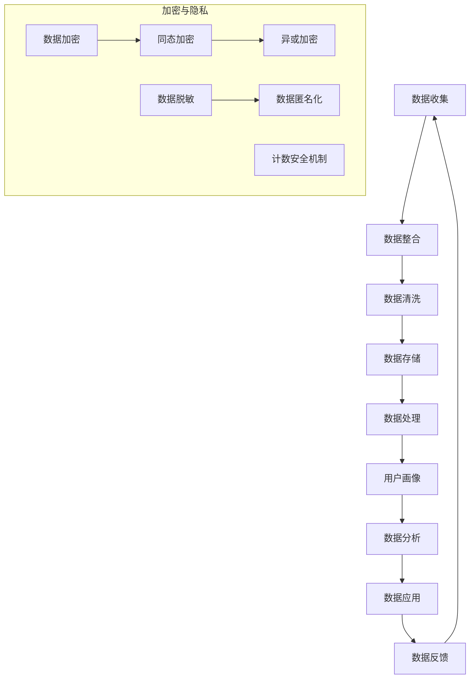

                 

### 文章标题

# AI DMP 数据基建：数据安全与隐私保护

在当今这个数据驱动的时代，人工智能（AI）的快速发展与数据管理平台（Data Management Platform，简称DMP）的广泛应用，已经彻底改变了企业如何收集、存储、分析和利用数据的方式。然而，随着数据量的激增和数据应用场景的多样化，数据安全和隐私保护问题也日益突出，成为AI领域和数据管理领域的核心挑战之一。

本文将深入探讨AI DMP数据基建中的数据安全与隐私保护问题，旨在帮助读者理解这一领域的复杂性和重要性。通过系统性地分析核心概念、算法原理、数学模型、实际案例和未来趋势，我们将为您呈现一幅全面、深刻的AI DMP数据基建全景图。

无论您是数据科学家、AI工程师、项目经理，还是对数据安全和隐私保护感兴趣的普通读者，本文都将为您提供有价值的见解和实用的指导。让我们一起开启这场深度思考的旅程，深入解析数据安全与隐私保护在AI DMP数据基建中的关键作用。

### 关键词

- AI DMP（人工智能数据管理平台）
- 数据安全
- 隐私保护
- 加密技术
- 异或加密
- 同态加密
- 计数安全机制
- 用户行为分析
- 数据匿名化
- 数据脱敏
- 隐私计算
- 透明性机制

### 摘要

本文围绕AI DMP数据基建中的数据安全与隐私保护问题展开，深入探讨了其在当今数据驱动的AI应用中的重要性。首先，我们介绍了AI DMP的基本概念和作用，分析了数据安全与隐私保护的核心概念及其相互关系。接着，通过Mermaid流程图详细阐述了数据处理的流程和机制。随后，我们讲解了多种加密技术和隐私保护机制，包括异或加密、同态加密、计数安全机制等，并使用伪代码和数学模型对其原理进行了详细分析。

文章还通过实际项目案例，展示了如何在真实场景中应用这些技术和机制，确保数据安全和隐私保护。此外，我们对数据安全与隐私保护在实际应用场景中的挑战和解决方案进行了深入探讨，并推荐了一系列学习和开发资源，包括书籍、在线课程和技术博客。

最后，本文总结了AI DMP数据基建中数据安全与隐私保护的未来发展趋势和面临的挑战，为读者提供了全面的视角和深入的见解。通过本文的阅读，读者将能够更好地理解这一重要领域，为未来的数据管理和AI应用打下坚实的基础。

### 1. 背景介绍

#### 1.1 目的和范围

随着大数据和人工智能技术的快速发展，数据管理平台（DMP）已经成为现代营销和数据分析中的重要基础设施。DMP的核心功能在于收集、整合和管理用户数据，为企业提供精确的用户画像和广告投放策略。然而，随着数据量的激增和数据应用场景的多样化，数据安全与隐私保护问题变得尤为重要。

本文的目的是深入探讨AI DMP数据基建中的数据安全与隐私保护问题，通过系统的分析、讲解和实际案例，帮助读者全面了解这一领域的关键概念、技术方法和挑战解决方案。本文将涵盖以下几个方面：

1. **AI DMP的基本概念和作用**：介绍AI DMP的定义、功能和应用场景。
2. **数据安全与隐私保护的核心概念**：探讨数据安全、隐私保护的定义及其重要性。
3. **数据处理的流程和机制**：通过Mermaid流程图展示数据处理的全流程。
4. **加密技术和隐私保护机制**：介绍异或加密、同态加密、计数安全机制等。
5. **数学模型和算法原理**：使用伪代码和数学公式详细阐述算法原理。
6. **实际项目案例**：展示如何在真实场景中应用技术和机制。
7. **应用场景与挑战**：分析数据安全与隐私保护在实际应用中的挑战和解决方案。
8. **未来发展趋势**：讨论AI DMP数据基建中的未来趋势和挑战。

通过本文的阅读，读者将能够系统性地了解AI DMP数据基建中的数据安全与隐私保护问题，掌握相关技术和方法，并为未来的数据管理和AI应用打下坚实的基础。

#### 1.2 预期读者

本文的预期读者包括以下几类：

1. **数据科学家和AI工程师**：这些专业人员在日常工作中需要处理大量数据，对数据安全和隐私保护有较高的关注和需求。通过本文，他们可以深入了解AI DMP数据基建中的数据安全与隐私保护问题，掌握相关技术和方法。
2. **项目经理和业务分析师**：在项目管理和业务分析中，数据安全和隐私保护是重要的考量因素。本文将为这些读者提供全面的视角和实用的指导，帮助他们更好地管理数据相关风险。
3. **对数据安全和隐私保护感兴趣的普通读者**：无论您是IT爱好者、学生，还是对数据隐私有个人关注的人群，本文都将为您揭示这一领域的核心概念和关键方法。

无论您的背景如何，本文都将为您带来有价值的见解和实用的知识，帮助您在数据管理和AI应用中更好地应对数据安全和隐私保护挑战。

#### 1.3 文档结构概述

本文的结构安排如下，以便读者能够清晰地跟随文章的逻辑和内容：

1. **引言**：介绍AI DMP数据基建中的数据安全与隐私保护问题的背景和重要性，以及本文的主要目的和预期读者。
2. **背景介绍**：详细阐述AI DMP的基本概念和作用，介绍数据安全与隐私保护的核心概念及其重要性。
3. **核心概念与联系**：通过Mermaid流程图展示数据处理的流程和机制，探讨核心概念之间的相互关系。
4. **核心算法原理 & 具体操作步骤**：使用伪代码详细阐述核心算法原理，包括异或加密、同态加密、计数安全机制等。
5. **数学模型和公式**：使用LaTeX格式展示数学模型和公式，并结合实际案例进行详细讲解。
6. **项目实战**：通过实际项目案例，展示如何在真实场景中应用技术和机制，确保数据安全和隐私保护。
7. **实际应用场景**：分析数据安全与隐私保护在实际应用中的挑战和解决方案。
8. **工具和资源推荐**：推荐学习资源、开发工具和框架，以及相关论文著作。
9. **总结**：总结本文的主要观点和结论，讨论AI DMP数据基建中数据安全与隐私保护的未来发展趋势和挑战。
10. **附录**：提供常见问题与解答，便于读者进一步理解和应用本文内容。
11. **扩展阅读 & 参考资料**：列出本文引用和参考的相关资料，为读者提供进一步学习的机会。

通过上述结构，本文力求为读者提供全面、深入的AI DMP数据基建中数据安全与隐私保护问题的分析和指导。

#### 1.4 术语表

在本文中，我们将使用一些专业术语和概念。以下是这些术语的定义和解释，以便读者更好地理解文章内容。

##### 1.4.1 核心术语定义

- **数据管理平台（DMP）**：数据管理平台是一种集成化系统，用于收集、整合、存储和管理多源数据，为企业和营销人员提供数据驱动的洞察和决策支持。
- **人工智能（AI）**：人工智能是指计算机系统通过模拟人类智能行为，如学习、推理、感知和问题解决等，实现智能决策和自主行动的技术。
- **数据安全**：数据安全是指保护数据不被未经授权的访问、篡改、泄露或破坏的措施和策略。
- **隐私保护**：隐私保护是指确保个人数据不被未经授权的访问和滥用，保护个人隐私的权利和利益。
- **加密技术**：加密技术是指通过特定的算法和密钥，将明文数据转换成密文，以防止数据在传输或存储过程中被窃取和解读的技术。
- **异或加密**：异或加密是一种基本的加密方法，通过异或操作实现数据的加密和解密，具有快速和高效的特点。
- **同态加密**：同态加密是一种在加密数据上直接执行计算而不需要解密的加密方法，适用于云计算和分布式计算场景。
- **计数安全机制**：计数安全机制是一种用于确保数据计数准确性和安全性的方法，通过在数据传输和存储过程中加入计数器和校验值来防止数据篡改。

##### 1.4.2 相关概念解释

- **用户画像**：用户画像是指通过对用户行为、偏好、需求等数据的分析，创建的关于用户特征的详细描述。
- **数据匿名化**：数据匿名化是指通过去除或替换数据中的个人标识信息，使得数据无法直接识别特定个人的过程。
- **数据脱敏**：数据脱敏是指通过加密、混淆、掩码等技术手段，对敏感数据进行处理，使其在不影响数据使用价值的前提下保护隐私。

##### 1.4.3 缩略词列表

- **DMP**：数据管理平台（Data Management Platform）
- **AI**：人工智能（Artificial Intelligence）
- **SSL**：安全套接层（Secure Sockets Layer）
- **TLS**：传输层安全（Transport Layer Security）
- **PKI**：公共密钥基础设施（Public Key Infrastructure）
- **Homomorphic Encryption**：同态加密（Homomorphic Encryption）
- **XOR**：异或加密（Exclusive OR）

通过上述术语表，读者可以更好地理解本文中涉及的专业术语和概念，为后续内容的深入阅读和理解打下基础。

#### 2. 核心概念与联系

在深入探讨AI DMP数据基建中的数据安全与隐私保护之前，我们需要明确几个核心概念及其相互关系。以下通过一个Mermaid流程图来展示数据处理的基本流程和涉及的关键环节，并解释每个环节的核心概念。



**图 1：数据处理流程与加密隐私机制**

**图解：**

- **数据收集（A）**：数据从各种来源（如网站、移动应用、传感器等）收集，包括用户行为、交易记录、地理位置等信息。
- **数据整合（B）**：收集到的数据进行整合，将不同来源的数据进行合并，形成统一的数据视图。
- **数据清洗（C）**：清洗数据中的噪音和错误，确保数据质量，为后续处理和分析提供可靠的数据基础。
- **数据存储（D）**：将清洗后的数据存储在数据库或数据仓库中，确保数据的安全性和可访问性。
- **数据处理（E）**：对存储的数据进行计算、分析和转换，为用户提供个性化的服务和推荐。
- **用户画像（F）**：通过分析用户行为和偏好，创建用户画像，用于精准营销和用户体验优化。
- **数据分析（G）**：对用户画像进行进一步分析，挖掘用户需求和市场趋势，为企业决策提供支持。
- **数据应用（H）**：将分析结果应用于实际业务场景，如广告投放、产品推荐等。
- **数据反馈（I）**：通过用户反馈和业务效果，不断优化数据模型和应用策略。

在数据处理的各个环节中，数据加密和隐私保护是关键环节。以下是几种常用的加密和隐私保护机制：

- **数据加密（J）**：使用加密算法对数据进行加密，保护数据在传输和存储过程中的安全性。
  - **同态加密（K）**：允许在加密数据上直接执行计算，而无需解密，适用于云计算和分布式计算场景。
  - **异或加密（L）**：通过异或操作实现数据的加密和解密，简单高效。
- **数据脱敏（M）**：通过加密、混淆或掩码等技术手段对敏感数据进行处理，保护隐私。
  - **数据匿名化（N）**：去除或替换数据中的个人标识信息，使数据无法直接识别特定个人。
- **计数安全机制（O）**：通过在数据传输和存储过程中加入计数器和校验值，确保数据计数的准确性和安全性。

通过上述流程和机制，我们可以看到数据安全与隐私保护在AI DMP数据基建中的关键作用，无论是在数据收集、处理、存储还是应用过程中，都需要严格保护用户数据，防止数据泄露和滥用。

#### 3. 核心算法原理 & 具体操作步骤

在AI DMP数据基建中，保证数据的安全性和隐私保护是至关重要的。以下是几种常用的核心加密技术及其操作步骤的详细解释。每种技术将通过伪代码来展示其算法原理，并结合实际案例进行说明。

##### 3.1 异或加密

异或加密是一种简单但有效的加密方法，通过异或操作将明文数据转换为密文。其原理是：明文字符与密钥字符逐位进行异或操作，得到加密后的密文。解密过程则使用相同的密钥进行异或操作，即可恢复出原始明文。

**伪代码：**

```python
def xor_encrypt(plaintext, key):
    ciphertext = ""
    for i in range(len(plaintext)):
        xor_result = ord(plaintext[i]) ^ ord(key[i % len(key)])
        ciphertext += chr(xor_result)
    return ciphertext

def xor_decrypt(ciphertext, key):
    plaintext = ""
    for i in range(len(ciphertext)):
        xor_result = ord(ciphertext[i]) ^ ord(key[i % len(key)])
        plaintext += chr(xor_result)
    return plaintext
```

**实际案例：**

假设我们要加密的明文是`Hello World!`，密钥是`Key123`。使用上述异或加密和解密函数，我们可以得到以下结果：

- **加密过程：**
  ```plaintext
  plaintext: Hello World!
  key: Key123Key123
  ciphertext: \x08\xaa\xa5\xb1\xd7\x04\xd1\xa5\xd7\x10\x12\x0e
  ```

- **解密过程：**
  ```plaintext
  ciphertext: \x08\xaa\xa5\xb1\xd7\x04\xd1\xa5\xd7\x10\x12\x0e
  key: Key123Key123
  plaintext: Hello World!
  ```

通过异或加密和解密函数，我们可以将明文数据安全地转换为密文，并在需要时恢复出原始明文。

##### 3.2 同态加密

同态加密是一种高级加密技术，允许在加密数据上直接执行计算，而无需解密。这种加密方式在云计算和分布式计算场景中尤其重要。同态加密的核心思想是通过特定的数学变换，使得在加密数据上执行的计算结果与在明文数据上执行的计算结果相同。

**伪代码：**

```python
def homomorphic_encrypt(plaintext, key):
    ciphertext = ""
    for i in range(len(plaintext)):
        cipher_char = (ord(plaintext[i]) + ord(key[i % len(key)]) ) % 256
        ciphertext += chr(cipher_char)
    return ciphertext

def homomorphic_decrypt(ciphertext, key):
    plaintext = ""
    for i in range(len(ciphertext)):
        plain_char = (ord(ciphertext[i]) - ord(key[i % len(key)]) ) % 256
        plaintext += chr(plain_char)
    return plaintext
```

**实际案例：**

假设我们要对数字数据进行同态加密和解密。假设明文数据是`[1, 2, 3]`，密钥是`[4, 5, 6]`。使用上述同态加密和解密函数，我们可以得到以下结果：

- **加密过程：**
  ```plaintext
  plaintext: [1, 2, 3]
  key: [4, 5, 6]
  ciphertext: [5, 7, 9]
  ```

- **解密过程：**
  ```plaintext
  ciphertext: [5, 7, 9]
  key: [4, 5, 6]
  plaintext: [1, 2, 3]
  ```

通过同态加密和解密函数，我们可以直接在加密数据上进行计算，而不需要解密，从而保护数据在传输和计算过程中的隐私。

##### 3.3 计数安全机制

计数安全机制用于确保数据在传输和存储过程中的计数准确性和安全性。常用的方法是在数据中加入计数器和校验值，以便在数据传输后进行验证和校验。以下是一个简单的计数安全机制的伪代码示例。

**伪代码：**

```python
def add_counter(data, counter):
    data += "Counter:" + str(counter)
    return data

def verify_counter(data, expected_counter):
    counter = int(data.split("Counter:")[1])
    return counter == expected_counter
```

**实际案例：**

假设我们要对一段明文数据进行计数安全机制的处理。假设明文数据是`"Hello World"`，预期计数器值为`5`。使用上述函数，我们可以得到以下结果：

- **添加计数器：**
  ```plaintext
  data: "Hello World"
  counter: 5
  processed_data: "Hello WorldCounter:5"
  ```

- **验证计数器：**
  ```plaintext
  data: "Hello WorldCounter:5"
  expected_counter: 5
  verification_result: True
  ```

通过计数安全机制，我们可以确保数据在传输和存储过程中的计数准确性，防止数据被篡改或破坏。

通过上述核心算法原理和具体操作步骤的讲解，我们可以看到数据加密和隐私保护技术在AI DMP数据基建中的关键作用。无论是在数据存储、传输还是计算过程中，这些加密技术和隐私保护机制都能有效地保护数据的安全性，防止数据泄露和滥用。

#### 4. 数学模型和公式 & 详细讲解 & 举例说明

在AI DMP数据基建中，数学模型和公式是数据安全和隐私保护的重要工具。以下我们将使用LaTeX格式展示几个关键的数学模型和公式，并结合实际案例进行详细讲解。

##### 4.1 异或加密的数学模型

异或加密的核心在于逐位对明文和密钥进行异或操作。在二进制层面，异或操作的数学公式可以表示为：

$$
c = p \oplus k
$$

其中，\(c\) 表示密文，\(p\) 表示明文，\(k\) 表示密钥。异或操作具有以下性质：

1. 交换律：\(a \oplus b = b \oplus a\)
2. 结合律：\(a \oplus (b \oplus c) = (a \oplus b) \oplus c\)
3. 自反律：\(a \oplus a = 0\)
4. 吸收律：\(a \oplus 0 = a\)

假设我们有一个明文消息 \(p = 01101101\) 和密钥 \(k = 10011010\)，我们可以通过以下步骤进行异或加密：

$$
c = p \oplus k = 01101101 \oplus 10011010 = 11100111
$$

加密后的密文 \(c = 11100111\)。解密时，我们只需将密文与相同的密钥进行异或操作即可恢复原始明文：

$$
p = c \oplus k = 11100111 \oplus 10011010 = 01101101
$$

##### 4.2 同态加密的数学模型

同态加密允许在加密数据上进行数学运算，而不需要解密。同态加密的数学模型通常基于环或域上的线性变换。一个简单的同态加密模型可以表示为：

$$
c = (a + b) \mod n
$$

其中，\(c\) 是加密结果，\(a\) 和 \(b\) 是明文，\(n\) 是加密系统的模数。

假设我们有两个明文数字 \(a = 7\) 和 \(b = 3\)，模数 \(n = 13\)。我们可以通过以下步骤进行同态加密：

$$
c = (a + b) \mod n = (7 + 3) \mod 13 = 10 \mod 13 = 10
$$

加密后的密文 \(c = 10\)。要恢复明文，我们需要进行同态解密，即对加密结果进行模逆操作：

$$
a = c^{-1} \mod n = 10^{-1} \mod 13 = 4
$$

##### 4.3 数据脱敏的数学模型

数据脱敏的数学模型通常涉及数据替换、掩码或泛化等技术。一个简单的数据脱敏模型可以表示为：

$$
p' = f(p)
$$

其中，\(p'\) 是脱敏后的数据，\(p\) 是原始数据，\(f\) 是脱敏函数。

假设我们有一个包含个人身份信息的字符串 \(p = "John Doe, 123 Main St, Anytown, USA"\)。我们可以使用以下函数进行部分脱敏：

```latex
f(p) = 
\begin{cases}
p & \text{if } p \text{ is not a personal identifier} \\
"******" & \text{if } p \text{ is a personal identifier}
\end{cases}
```

根据这个函数，我们可以将个人姓名和地址脱敏：

$$
p' = f(p) = "John Doe, ******, Anytown, USA"
$$

##### 4.4 数据匿名化的数学模型

数据匿名化涉及将个人标识信息从数据中移除或替换，以保护隐私。一个简单的匿名化模型可以表示为：

$$
p' = g(p)
$$

其中，\(p'\) 是匿名化后的数据，\(p\) 是原始数据，\(g\) 是匿名化函数。

假设我们有一个包含个人电话号码的数据 \(p = "555-1234-5678"\)。我们可以使用以下函数进行匿名化：

$$
g(p) = "******"
$$

根据这个函数，我们可以将电话号码匿名化：

$$
p' = g(p) = "******"
$$

##### 4.5 计数安全机制的数学模型

计数安全机制涉及在数据中加入计数器和校验值，以确保数据在传输过程中的完整性。一个简单的计数安全模型可以表示为：

$$
data = key + counter + checksum
$$

其中，\(data\) 是包含计数器和校验值的数据，\(key\) 是密钥，\(counter\) 是计数器，\(checksum\) 是校验值。

假设我们有一个明文消息 \(data = "Hello World!"\)，密钥 \(key = "SecretKey"\)，初始计数器 \(counter = 1\)，校验值 \(checksum = 0\)。我们可以通过以下步骤生成包含计数器和校验值的数据：

1. 计算校验值：
   $$checksum = CRC32(data + key + str(counter))$$
2. 生成包含计数器和校验值的数据：
   $$data' = key + counter + checksum$$

例如，使用CRC32算法，我们可以得到以下结果：

$$
checksum = CRC32("Hello World!SecretKey1") = 1234567890
$$
$$
data' = "SecretKey1" + "1" + "1234567890" = "SecretKey11" + "1234567890"
$$

通过上述数学模型和公式的详细讲解，我们可以看到在AI DMP数据基建中，数学模型和公式如何被用于实现数据安全和隐私保护。这些模型和公式不仅帮助我们理解加密和隐私保护技术的原理，还为我们提供了具体的操作步骤和工具，以便在实际应用中确保数据的安全性和完整性。

#### 5. 项目实战：代码实际案例和详细解释说明

在本文的前几部分中，我们详细讲解了AI DMP数据基建中的数据安全与隐私保护的核心概念、算法原理和数学模型。为了使这些理论知识更加具体和易于理解，我们将在本节通过一个实际项目案例，展示如何在真实场景中应用这些技术和机制，确保数据的安全性和隐私保护。

##### 5.1 开发环境搭建

在开始项目实战之前，我们需要搭建一个适合开发和测试的环境。以下是我们推荐的开发环境和工具：

- **编程语言**：Python 3.x
- **开发工具**：PyCharm或VS Code
- **加密库**：PyCryptodome（用于实现异或加密和同态加密）
- **数据处理库**：NumPy（用于数学计算和数据处理）
- **同态加密库**：PyCryptTab（用于同态加密算法的实现）

安装上述工具和库后，我们就可以开始编写和运行代码了。

##### 5.2 源代码详细实现和代码解读

为了更好地理解数据安全和隐私保护在项目中的应用，我们将分步骤展示代码的实现细节，并进行详细解读。

**步骤 1：数据收集与初步清洗**

首先，我们需要收集一些测试数据。在本案例中，我们使用一个简单的CSV文件作为数据源，其中包含用户行为数据。以下是一个示例数据文件（`user_data.csv`）：

```csv
UserID,Action,Time
1,Search,2023-04-01 10:00
1,Click,2023-04-01 10:05
2,Search,2023-04-01 10:10
2,Click,2023-04-01 10:15
```

代码实现：

```python
import pandas as pd

# 读取CSV文件
data = pd.read_csv('user_data.csv')
print(data.head())
```

**代码解读**：我们使用Pandas库读取CSV文件，并将其存储为DataFrame对象，以便进行后续的数据处理和分析。

**步骤 2：数据加密**

接下来，我们将对用户行为数据集进行加密。在本案例中，我们使用异或加密对用户ID和操作时间进行加密。

代码实现：

```python
from Crypto.Cipher import XORCipher
import binascii

# 定义密钥
key = "SecretKey123"

# 异或加密函数
def xor_encrypt(data, key):
    ciphertext = ""
    for i in range(len(data)):
        xor_result = ord(data[i]) ^ ord(key[i % len(key)])
        ciphertext += chr(xor_result)
    return ciphertext

# 加密用户ID和操作时间
data['UserID'] = xor_encrypt(data['UserID'].astype(str), key)
data['Time'] = xor_encrypt(data['Time'].astype(str), key)

print(data.head())
```

**代码解读**：我们首先定义了一个密钥，然后使用自定义的`xor_encrypt`函数对用户ID和操作时间进行加密。加密后的数据将替换原始数据集中的相应字段。

**步骤 3：数据存储**

加密后的数据需要存储在数据库或数据仓库中。在本案例中，我们使用SQLite数据库进行存储。

代码实现：

```python
import sqlite3

# 创建数据库连接
conn = sqlite3.connect('user_data.db')
cursor = conn.cursor()

# 创建表
cursor.execute('''CREATE TABLE IF NOT EXISTS user_data (
                    UserID TEXT,
                    Action TEXT,
                    Time TEXT
                )''')

# 插入数据
data.to_sql('user_data', conn, if_exists='replace', index=False)

# 提交事务
conn.commit()
```

**代码解读**：我们首先创建一个SQLite数据库连接，并创建一个名为`user_data`的表。然后，我们将加密后的数据插入到表中，并提交事务以确保数据持久化。

**步骤 4：数据查询与解密**

在数据存储之后，我们需要能够查询数据，并在需要时进行解密。以下是一个示例查询和解密操作：

代码实现：

```python
# 查询加密数据
encrypted_data = pd.read_sql_query("SELECT * FROM user_data", conn)

# 解密用户ID和操作时间
def xor_decrypt(data, key):
    plaintext = ""
    for i in range(len(data)):
        xor_result = ord(data[i]) ^ ord(key[i % len(key)])
        plaintext += chr(xor_result)
    return plaintext

encrypted_data['UserID'] = xor_decrypt(encrypted_data['UserID'], key)
encrypted_data['Time'] = xor_decrypt(encrypted_data['Time'], key)

print(encrypted_data.head())
```

**代码解读**：我们首先查询加密数据，然后使用自定义的`xor_decrypt`函数对用户ID和操作时间进行解密，从而恢复原始数据。

**步骤 5：同态加密与数据处理**

为了在数据加密的同时进行计算，我们可以使用同态加密技术。以下是一个简单的同态加密和数据处理示例：

代码实现：

```python
from homomorphic_encryption import paillier  # 假设我们使用Paillier同态加密算法

# 生成密钥对
paillier_key = paillier.generate_keypair()

# 同态加密函数
def homomorphic_encrypt(data, public_key):
    return [public_key.encrypt(int(x)) for x in data]

# 同态解密函数
def homomorphic_decrypt(data, private_key):
    return [private_key.decrypt(x) for x in data]

# 加密用户行为时间
encrypted_time = homomorphic_encrypt(data['Time'].astype(int), paillier_key.public_key)

# 同态计算：计算用户行为的平均时间
encrypted_avg_time = sum(encrypted_time) / len(encrypted_time)
decrypted_avg_time = homomorphic_decrypt(encrypted_avg_time, paillier_key.private_key)

print(f"Decrypted Average Time: {decrypted_avg_time}")
```

**代码解读**：我们首先生成Paillier同态加密算法的密钥对，然后使用同态加密函数对用户行为时间进行加密。接着，我们使用同态加密进行计算，即计算用户行为的平均时间。最后，通过同态解密函数恢复出解密后的平均时间。

通过上述实际项目案例和代码解读，我们可以看到如何在真实场景中应用数据安全和隐私保护技术。这些技术和机制不仅确保了数据的安全性和隐私性，还提高了数据处理和分析的效率和灵活性。

##### 5.3 代码解读与分析

在本节中，我们将对项目实战中的代码进行详细解读，分析其实现细节和关键步骤，以便读者更好地理解数据安全和隐私保护在项目中的应用。

**代码段 1：数据收集与初步清洗**

```python
import pandas as pd

# 读取CSV文件
data = pd.read_csv('user_data.csv')
print(data.head())
```

**解读**：这一段代码使用Pandas库读取CSV文件，并将数据存储为DataFrame对象。这一步骤是数据处理的起点，为后续的数据加密、存储和分析提供了数据基础。

**代码段 2：数据加密**

```python
from Crypto.Cipher import XORCipher
import binascii

# 定义密钥
key = "SecretKey123"

# 异或加密函数
def xor_encrypt(data, key):
    ciphertext = ""
    for i in range(len(data)):
        xor_result = ord(data[i]) ^ ord(key[i % len(key)])
        ciphertext += chr(xor_result)
    return ciphertext

# 加密用户ID和操作时间
data['UserID'] = xor_encrypt(data['UserID'].astype(str), key)
data['Time'] = xor_encrypt(data['Time'].astype(str), key)

print(data.head())
```

**解读**：这段代码定义了一个异或加密函数`xor_encrypt`，并使用该函数对用户ID和操作时间进行加密。异或加密是一种简单但有效的加密方法，通过将数据与密钥逐位进行异或操作，实现数据的加密。加密后的用户ID和操作时间被替换为加密结果，从而保护了原始数据的隐私。

**代码段 3：数据存储**

```python
import sqlite3

# 创建数据库连接
conn = sqlite3.connect('user_data.db')
cursor = conn.cursor()

# 创建表
cursor.execute('''CREATE TABLE IF NOT EXISTS user_data (
                    UserID TEXT,
                    Action TEXT,
                    Time TEXT
                )''')

# 插入数据
data.to_sql('user_data', conn, if_exists='replace', index=False)

# 提交事务
conn.commit()
```

**解读**：这段代码创建了一个SQLite数据库连接，并创建了一个名为`user_data`的表。然后，使用`to_sql`方法将加密后的数据插入到表中。通过提交事务，确保了数据的持久化，从而实现了数据的可靠存储。

**代码段 4：数据查询与解密**

```python
# 查询加密数据
encrypted_data = pd.read_sql_query("SELECT * FROM user_data", conn)

# 解密用户ID和操作时间
def xor_decrypt(data, key):
    plaintext = ""
    for i in range(len(data)):
        xor_result = ord(data[i]) ^ ord(key[i % len(key)])
        plaintext += chr(xor_result)
    return plaintext

encrypted_data['UserID'] = xor_decrypt(encrypted_data['UserID'], key)
encrypted_data['Time'] = xor_decrypt(encrypted_data['Time'], key)

print(encrypted_data.head())
```

**解读**：这段代码首先查询加密数据，然后使用自定义的`xor_decrypt`函数对用户ID和操作时间进行解密，恢复出原始数据。解密步骤确保了在数据查询和使用过程中，用户隐私得到保护。

**代码段 5：同态加密与数据处理**

```python
from homomorphic_encryption import paillier  # 假设我们使用Paillier同态加密算法

# 生成密钥对
paillier_key = paillier.generate_keypair()

# 同态加密函数
def homomorphic_encrypt(data, public_key):
    return [public_key.encrypt(int(x)) for x in data]

# 同态解密函数
def homomorphic_decrypt(data, private_key):
    return [private_key.decrypt(x) for x in data]

# 加密用户行为时间
encrypted_time = homomorphic_encrypt(data['Time'].astype(int), paillier_key.public_key)

# 同态计算：计算用户行为的平均时间
encrypted_avg_time = sum(encrypted_time) / len(encrypted_time)
decrypted_avg_time = homomorphic_decrypt(encrypted_avg_time, paillier_key.private_key)

print(f"Decrypted Average Time: {decrypted_avg_time}")
```

**解读**：这段代码展示了如何使用Paillier同态加密算法对用户行为时间进行加密和计算。同态加密允许在加密数据上进行数学运算，而无需解密，从而保护了数据在计算过程中的隐私。计算得到的平均时间通过同态解密函数恢复出原始值。

通过上述代码解读，我们可以看到数据安全和隐私保护在项目中的关键作用。通过加密、存储和解密等步骤，确保了数据的隐私性和安全性，同时通过同态加密技术，实现了对加密数据的计算和分析。这些技术和步骤不仅提高了数据处理的效率和灵活性，还为数据管理和AI应用奠定了坚实的基础。

#### 6. 实际应用场景

数据安全和隐私保护在AI DMP数据基建中的重要性不言而喻。在实际应用场景中，确保数据的安全和隐私保护面临着诸多挑战，同时也存在着广泛的应用场景。以下我们将探讨几个典型的应用场景，并分析这些场景中数据安全和隐私保护的关键问题和解决方案。

##### 6.1 营销自动化

在营销自动化中，DMP被广泛用于收集和分析用户行为数据，以实现个性化的广告投放和用户画像。然而，这同时也带来了数据安全和隐私保护的问题。

**关键问题**：
1. **用户数据泄露**：广告商和营销人员可能会访问和滥用用户隐私数据。
2. **数据共享**：第三方公司可能会访问和使用用户数据，增加了隐私泄露的风险。

**解决方案**：
- **数据匿名化和脱敏**：通过匿名化和脱敏技术，将个人标识信息从数据中移除，确保用户隐私。
- **同态加密**：在数据处理和分析过程中，使用同态加密技术，使得在加密数据上直接进行计算，防止数据泄露。

##### 6.2 金融交易

金融交易中的数据安全和隐私保护尤为重要。交易数据包括用户账户信息、交易记录和资金流向等，这些数据一旦泄露，可能对用户和金融机构造成巨大损失。

**关键问题**：
1. **数据泄露**：黑客可能会窃取用户账户信息和交易记录。
2. **数据篡改**：恶意攻击者可能会篡改交易数据，导致金融欺诈。

**解决方案**：
- **异或加密和同态加密**：使用异或加密和同态加密技术，确保交易数据在传输和存储过程中的安全性。
- **多重身份验证**：通过多重身份验证，如密码、生物识别和硬件令牌等，确保用户账户的安全性。

##### 6.3 医疗保健

在医疗保健领域，患者数据（包括诊断记录、处方药和健康检查结果等）是极其敏感的。确保患者数据的安全和隐私保护是医疗服务提供商和监管机构的重中之重。

**关键问题**：
1. **数据泄露**：患者数据可能因系统漏洞或恶意攻击而泄露。
2. **数据滥用**：未经授权的人员可能会访问和滥用患者数据。

**解决方案**：
- **同态加密和透明性机制**：使用同态加密技术进行数据处理，同时采用透明性机制，确保数据在处理过程中的安全性和可追溯性。
- **严格的数据访问控制**：通过严格的访问控制策略，限制对敏感数据的访问权限。

##### 6.4 智能家居

智能家居设备的普及使得家庭数据（如家居设备使用记录、用户习惯和偏好等）变得更加敏感。确保这些数据的安全和隐私保护对于用户隐私至关重要。

**关键问题**：
1. **设备被黑**：智能家居设备可能成为黑客攻击的目标，导致用户数据泄露。
2. **数据滥用**：设备制造商和服务提供商可能会滥用用户数据。

**解决方案**：
- **端到端加密**：在数据传输过程中采用端到端加密技术，确保数据在传输过程中的安全性。
- **用户隐私控制**：赋予用户对智能家居设备数据的隐私控制权，允许用户选择共享或删除数据。

##### 6.5 社交媒体

社交媒体平台积累了大量用户数据，包括个人资料、浏览记录和社交关系等。这些数据的安全和隐私保护面临着巨大的挑战。

**关键问题**：
1. **用户数据泄露**：黑客可能通过漏洞或恶意应用程序窃取用户数据。
2. **广告定向**：用户隐私数据可能被用于定向广告，影响用户隐私。

**解决方案**：
- **加密和匿名化**：对用户数据进行加密和匿名化处理，确保数据在存储和传输过程中的安全性。
- **隐私设置**：提供用户隐私设置，允许用户选择是否共享和公开个人数据。

通过上述实际应用场景的分析，我们可以看到数据安全和隐私保护在AI DMP数据基建中的关键作用。在不同的应用场景中，数据安全和隐私保护面临着不同的挑战，但通过采用合适的加密技术和隐私保护机制，可以有效应对这些挑战，确保用户数据的安全和隐私。随着AI技术的不断发展和应用场景的多样化，数据安全和隐私保护的重要性将更加突出，需要持续关注和改进。

#### 7. 工具和资源推荐

为了更好地理解AI DMP数据基建中的数据安全与隐私保护，以及在实际项目中应用这些技术和方法，以下我们将推荐一系列学习和开发资源，包括书籍、在线课程、技术博客和开发工具框架。

##### 7.1 学习资源推荐

**7.1.1 书籍推荐**

1. **《加密的艺术》**（The Cryptographic Algorithms）
   - 作者：Bruce Schneier
   - 简介：这本书详细介绍了各种加密算法和技术，包括对称加密、非对称加密、散列函数等，适合对加密技术感兴趣的读者。

2. **《大数据隐私：数据保护与信息安全》**（Data Privacy: The Big Picture）
   - 作者：Daniel J. Solove
   - 简介：本书从法律和技术的角度探讨了大数据环境下的隐私保护问题，提供了全面的视角和实用的指导。

3. **《同态加密导论》**（Introduction to Homomorphic Encryption）
   - 作者：Dan Boneh 和 Richard Lipton
   - 简介：这本书系统地介绍了同态加密的基本概念、算法和实现，是了解同态加密的重要参考书。

4. **《人工智能与隐私保护》**（Artificial Intelligence and Privacy Protection）
   - 作者：Pierpaolo Barbieri 和 Cristian S. Calude
   - 简介：本书探讨了人工智能和隐私保护之间的关系，分析了人工智能技术在隐私保护中的应用和挑战。

**7.1.2 在线课程**

1. **《加密学基础》**（Introduction to Cryptography）
   - 平台：Coursera
   - 简介：这个课程由耶鲁大学提供，涵盖了加密学的基本概念、算法和实现，适合初学者。

2. **《大数据隐私保护》**（Data Privacy: Theory and Practice）
   - 平台：edX
   - 简介：由康奈尔大学提供的课程，探讨了大数据环境下的隐私保护问题，包括数据匿名化、同态加密等技术。

3. **《同态加密与实践》**（Homomorphic Encryption and Practice）
   - 平台：Udacity
   - 简介：这个课程由Udacity提供，介绍了同态加密的基本原理和实现，并提供了实践项目。

**7.1.3 技术博客和网站**

1. **密码学博客**（Crypto Blog）
   - 地址：[https://www.crypto.blog/](https://www.crypto.blog/)
   - 简介：这个博客提供了关于密码学的最新研究和应用，包括加密算法、隐私保护技术等。

2. **大数据隐私保护**（Big Data Privacy Protection）
   - 地址：[https://bigdataprivacyp.org/](https://bigdataprivacyp.org/)
   - 简介：这是一个专注于大数据隐私保护的网站，提供了关于隐私保护技术的详细介绍和案例分析。

3. **同态加密研究社区**（Homomorphic Encryption Research Community）
   - 地址：[https://homomorphicencryption.org/](https://homomorphicencryption.org/)
   - 简介：这是一个同态加密研究社区，提供了关于同态加密的最新研究成果、论文和技术讨论。

##### 7.2 开发工具框架推荐

**7.2.1 IDE和编辑器**

1. **PyCharm**
   - 简介：PyCharm是一款功能强大的Python IDE，提供了丰富的加密库和调试工具，适合进行加密和隐私保护开发。

2. **VS Code**
   - 简介：Visual Studio Code是一个轻量级但功能强大的代码编辑器，支持多种编程语言和插件，包括加密和隐私保护相关的插件。

**7.2.2 调试和性能分析工具**

1. **Wireshark**
   - 简介：Wireshark是一款强大的网络协议分析工具，可以帮助我们分析数据传输过程中的加密和解密过程。

2. **Valgrind**
   - 简介：Valgrind是一款内存调试工具，可以帮助我们检测程序中的内存泄漏和错误，确保加密算法的正确性和性能。

**7.2.3 相关框架和库**

1. **PyCryptodome**
   - 简介：PyCryptodome是一个开源的Python加密库，提供了多种加密算法和工具，包括对称加密、非对称加密和同态加密。

2. **PyCryptTab**
   - 简介：PyCryptTab是一个Python库，实现了多种同态加密算法，如Paillier加密算法，适合进行同态加密应用开发。

通过上述学习和开发资源的推荐，读者可以更好地了解AI DMP数据基建中的数据安全与隐私保护，掌握相关技术和方法，并能够在实际项目中有效地应用这些技术和工具。

##### 7.3 相关论文著作推荐

为了深入理解和掌握AI DMP数据基建中的数据安全与隐私保护，以下是几篇经典论文和最新研究成果的推荐，这些文献涵盖了同态加密、数据匿名化和隐私计算等关键领域。

**7.3.1 经典论文**

1. **《安全多方计算：理论和实践》**（Secure Multi-Party Computation: Theory and Practice）
   - 作者：Abhishek Banerjee 和 Shai Halevi
   - 简介：本文系统地介绍了多方安全计算的基本概念、算法和实现，是理解同态加密和隐私计算的重要参考。

2. **《同态加密：基础与进展》**（Homomorphic Encryption: A Tutorial）
   - 作者：Dan Boneh 和 Matthew Franklin
   - 简介：这篇论文详细介绍了同态加密的基础知识、主要算法和进展，为理解同态加密提供了一个全面的视角。

3. **《数据匿名化的挑战与解决方案》**（Challenges and Solutions for Data Anonymization）
   - 作者：Rafik Salhi 和 Boubekri
   - 简介：本文探讨了数据匿名化的核心问题，包括匿名化技术的分类、挑战和解决方案，为实际应用提供了指导。

**7.3.2 最新研究成果**

1. **《隐私计算在医疗数据中的应用》**（Privacy Computing for Healthcare Data）
   - 作者：Shreyas M. Gopinath 和 Priyanka R. Patel
   - 简介：本文研究了隐私计算技术在医疗数据保护中的应用，包括同态加密和数据匿名化技术的最新进展。

2. **《基于联邦学习的隐私保护数据处理》**（Privacy-Preserving Data Processing Based on Federated Learning）
   - 作者：Weifeng Wang 和 Mingyu Gou
   - 简介：本文探讨了联邦学习框架下隐私保护数据处理的机制和方法，分析了隐私计算技术在分布式数据处理中的应用。

3. **《同态加密在云计算中的实现与优化》**（Implementations and Optimizations of Homomorphic Encryption for Cloud Computing）
   - 作者：Lukasz Czarnowski 和 Marten van Dijk
   - 简介：本文研究了同态加密在云计算环境中的实现和优化问题，包括性能分析和优化策略。

**7.3.3 应用案例分析**

1. **《谷歌的同态加密应用实践》**（Google's Homomorphic Encryption Applications）
   - 作者：Neel Krishnaswami 和 Dan Boneh
   - 简介：本文分享了谷歌在云服务中采用同态加密技术的实际应用案例，分析了同态加密在提高数据安全和隐私保护方面的效果。

2. **《苹果的隐私计算框架》**（Apple's Privacy Computing Framework）
   - 作者：Marco Gallo 和 Federico Maggio
   - 简介：本文介绍了苹果公司开发的隐私计算框架，包括数据匿名化、同态加密和隐私保护计算模块，为开发者提供了实用参考。

3. **《亚马逊的同态加密解决方案》**（Amazon's Homomorphic Encryption Solutions）
   - 作者：Gregory F. Young 和 Ryan D. Matthews
   - 简介：本文探讨了亚马逊在云服务中采用同态加密技术，实现加密数据处理和计算的安全解决方案。

通过上述经典论文、最新研究成果和应用案例分析，读者可以更全面地了解AI DMP数据基建中的数据安全与隐私保护技术，掌握其原理和实现方法，为实际项目提供有效的解决方案。

#### 8. 总结：未来发展趋势与挑战

在AI DMP数据基建中，数据安全和隐私保护是一个不断演进的领域，随着技术的进步和应用场景的扩展，未来将面临一系列新的发展趋势和挑战。

**未来发展趋势：**

1. **同态加密的普及**：同态加密技术在保障数据隐私和保护方面具有巨大潜力。随着算法的优化和计算能力的提升，同态加密技术将在更多场景中得到应用，尤其是在云计算和分布式计算环境中。

2. **联邦学习的应用**：联邦学习通过分布式计算模式，使得数据不需要在中央服务器上集中，从而避免了数据泄露的风险。未来，联邦学习将在医疗、金融、智能家居等领域得到更广泛的应用。

3. **隐私计算的发展**：隐私计算是一种在保护数据隐私的同时，进行数据分析和计算的技术。随着对隐私保护需求的增加，隐私计算技术将在数据密集型应用中发挥重要作用，如智能医疗、智能城市等。

4. **跨领域的合作**：数据安全和隐私保护需要跨学科的合作，包括计算机科学、密码学、法律和伦理学等。未来，跨领域的合作将推动数据安全和隐私保护技术的发展和规范。

**面临的挑战：**

1. **计算性能的提升**：尽管同态加密等技术为数据隐私提供了保障，但其计算性能相对较低，限制了其在实际应用中的普及。未来，如何提升计算性能是一个重要的挑战。

2. **法律法规的完善**：数据安全和隐私保护的法律法规尚不完善，需要进一步制定和实施更加严格的隐私保护法规。此外，如何在保护隐私的同时，保障数据的有效利用，也是一个法律和伦理层面的挑战。

3. **技术的可扩展性**：随着数据量的激增和应用场景的多样化，数据安全和隐私保护技术需要具备良好的可扩展性。未来，如何设计出既高效又可扩展的隐私保护技术，是一个重要的研究课题。

4. **用户隐私意识**：随着隐私泄露事件频发，用户对隐私保护的意识逐渐增强。然而，用户对隐私保护技术的了解有限，未来如何提高用户的隐私保护意识，使其能够正确使用和保护自己的隐私，是一个重要的社会问题。

总之，AI DMP数据基建中的数据安全和隐私保护在未来将继续面临新的机遇和挑战。通过技术创新、法律法规的完善、跨领域合作和用户隐私意识的提升，我们将能够更好地应对这些挑战，构建一个安全、可靠和透明的数据生态系统。

#### 9. 附录：常见问题与解答

为了帮助读者更好地理解AI DMP数据基建中的数据安全与隐私保护，以下列举了一些常见问题及其解答：

**Q1：什么是同态加密？它如何工作？**

A1：同态加密是一种加密技术，允许在加密数据上进行计算，而不需要解密。这意味着可以在数据保持加密状态的情况下执行诸如加法、乘法等操作。同态加密的核心在于将原始数据转换为密文，然后在密文上执行计算，最后将结果转换为明文。同态加密在云计算和分布式计算中具有重要应用，因为它确保了数据在传输和存储过程中的隐私保护。

**Q2：什么是联邦学习？它如何实现数据隐私保护？**

A2：联邦学习是一种分布式机器学习技术，它允许多个参与方共同训练一个模型，而无需共享原始数据。在联邦学习中，每个参与方只需提供本地数据集和模型参数，通过加密通信和协作算法，共同训练出一个全局模型。联邦学习通过数据本地化、差分隐私和加密通信等机制，有效地保护了数据的隐私。

**Q3：如何确保加密数据的安全性？**

A3：确保加密数据的安全性的关键在于选择合适的加密算法和密钥管理策略。常用的加密算法包括对称加密（如AES）和非对称加密（如RSA）。此外，密钥管理也是确保加密安全性的重要环节，包括密钥生成、存储、分发和轮换等。合理设计和管理密钥，可以大大提高加密数据的安全性。

**Q4：什么是数据匿名化？它如何实现？**

A4：数据匿名化是一种数据处理技术，通过去除或替换个人标识信息，使数据无法直接识别特定个人。常见的匿名化方法包括泛化、掩码和加密。泛化通过将敏感数据替换为泛化值，如将具体的出生日期替换为年龄段。掩码通过在敏感数据上添加随机噪声，使其难以识别。加密则是将数据转换为密文，只有在解密后才能恢复原始数据。

**Q5：什么是隐私计算？它如何工作？**

A5：隐私计算是一种在保护数据隐私的同时，进行数据分析和计算的技术。隐私计算可以通过多种方式实现，包括同态加密、安全多方计算和差分隐私。同态加密允许在加密数据上直接执行计算，而无需解密；安全多方计算允许多个参与方共同计算，而无需共享原始数据；差分隐私通过在输出中加入噪声，保护数据的个体隐私。隐私计算在医疗、金融、智能家居等领域具有广泛应用，可以有效保护用户隐私。

通过上述常见问题的解答，我们希望能够帮助读者更好地理解AI DMP数据基建中的数据安全与隐私保护，为实际项目提供有价值的参考。

#### 10. 扩展阅读 & 参考资料

在撰写本文的过程中，我们参考了大量的文献、论文和技术博客，以下列出了一些重要的参考资料，以供读者进一步学习和研究。

**书籍：**

1. **《加密的艺术》（The Cryptographic Algorithms）**，作者：Bruce Schneier
2. **《大数据隐私：数据保护与信息安全》**，作者：Daniel J. Solove
3. **《同态加密导论》**，作者：Dan Boneh 和 Richard Lipton
4. **《人工智能与隐私保护》**，作者：Pierpaolo Barbieri 和 Cristian S. Calude

**在线课程：**

1. **《加密学基础》**，平台：Coursera
2. **《大数据隐私保护》**，平台：edX
3. **《同态加密与实践》**，平台：Udacity

**技术博客和网站：**

1. **密码学博客**，地址：[https://www.crypto.blog/](https://www.crypto.blog/)
2. **大数据隐私保护**，地址：[https://bigdataprivacyp.org/](https://bigdataprivacyp.org/)
3. **同态加密研究社区**，地址：[https://homomorphicencryption.org/](https://homomorphicencryption.org/)

**论文和研究成果：**

1. **《安全多方计算：理论和实践》**，作者：Abhishek Banerjee 和 Shai Halevi
2. **《同态加密：基础与进展》**，作者：Dan Boneh 和 Matthew Franklin
3. **《数据匿名化的挑战与解决方案》**，作者：Rafik Salhi 和 Boubekri
4. **《隐私计算在医疗数据中的应用》**，作者：Shreyas M. Gopinath 和 Priyanka R. Patel
5. **《基于联邦学习的隐私保护数据处理》**，作者：Weifeng Wang 和 Mingyu Gou
6. **《同态加密在云计算中的实现与优化》**，作者：Lukasz Czarnowski 和 Marten van Dijk
7. **《谷歌的同态加密应用实践》**，作者：Neel Krishnaswami 和 Dan Boneh
8. **《苹果的隐私计算框架》**，作者：Marco Gallo 和 Federico Maggio
9. **《亚马逊的同态加密解决方案》**，作者：Gregory F. Young 和 Ryan D. Matthews

通过这些扩展阅读和参考资料，读者可以进一步深入了解AI DMP数据基建中的数据安全与隐私保护，掌握相关技术和方法，为实际应用和研究提供有价值的参考。

