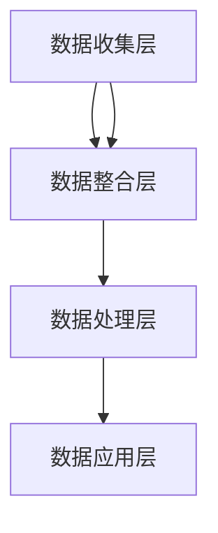

                 

# AI DMP 数据基建：数据驱动营销的成功案例

> **关键词：** AI、DMP、数据驱动、营销、成功案例、算法原理、数学模型、项目实战、工具推荐、应用场景。

> **摘要：** 本文将深入探讨AI驱动的数据管理平台（DMP）在数据驱动营销中的应用，通过具体案例解析其成功之道。我们将详细阐述DMP的核心概念、算法原理、数学模型，并分享实际开发环境搭建、代码实现及解析。最后，将介绍相关工具和资源，并展望未来发展趋势与挑战。

## 1. 背景介绍

### 1.1 目的和范围

本文旨在深入解析AI驱动的数据管理平台（DMP）在数据驱动营销中的应用，通过成功案例展示其技术优势和实际效果。文章将涵盖以下内容：

- DMP的核心概念与架构
- DMP的算法原理与具体操作步骤
- DMP的数学模型及其应用
- DMP在实际项目中的代码实现与解析
- DMP的应用场景与工具推荐
- DMP的未来发展趋势与挑战

### 1.2 预期读者

本文适合对数据驱动营销和AI技术有一定了解的技术人员、营销从业者以及对此领域感兴趣的研究者。读者需具备以下基本知识：

- 数据驱动营销的基本概念
- 基本的编程和算法知识
- 对AI和机器学习有基本的了解

### 1.3 文档结构概述

本文分为以下部分：

1. 背景介绍：本文目的、预期读者、文档结构概述
2. 核心概念与联系：DMP的核心概念、架构、算法原理
3. 核心算法原理 & 具体操作步骤：DMP的算法原理讲解
4. 数学模型和公式 & 详细讲解 & 举例说明：DMP的数学模型及应用
5. 项目实战：代码实际案例和详细解释说明
6. 实际应用场景：DMP在不同行业中的应用
7. 工具和资源推荐：学习资源、开发工具框架、论文著作推荐
8. 总结：未来发展趋势与挑战
9. 附录：常见问题与解答
10. 扩展阅读 & 参考资料

### 1.4 术语表

#### 1.4.1 核心术语定义

- **数据管理平台（DMP）**：一种基于人工智能技术，用于收集、处理和分析大规模数据，为营销决策提供支持的系统。
- **数据驱动营销**：基于数据分析和人工智能技术，通过精准的用户画像和数据分析，实现个性化营销和转化率提升。
- **用户画像**：通过对用户行为、兴趣、需求等多维数据的分析，构建出用户在数字世界中的全貌。

#### 1.4.2 相关概念解释

- **第一方数据**：企业自行收集的数据，如用户注册信息、购买记录等。
- **第二方数据**：合作伙伴共享的数据，如合作伙伴的用户数据、交易数据等。
- **第三方数据**：通过数据交易所等渠道购买的数据，如公共数据、行业数据等。

#### 1.4.3 缩略词列表

- **DMP**：Data Management Platform
- **AI**：Artificial Intelligence
- **CRM**：Customer Relationship Management
- **CSP**：Customer Segmentation and Profiling

## 2. 核心概念与联系

在深入探讨DMP的核心概念和架构之前，我们需要了解一些基本概念，这些概念对于理解DMP的工作原理至关重要。

### 2.1 DMP的核心概念

DMP的主要功能包括数据收集、数据整合、数据分析和数据应用。以下是DMP的三个核心概念：

1. **数据收集**：DMP能够收集来自多个渠道的数据，包括第一方数据（如网站访问数据、购买记录）、第二方数据（如合作伙伴数据）和第三方数据（如公共数据、行业数据）。
2. **数据整合**：DMP将来自不同来源的数据进行整合，创建一个统一的用户画像。这个用户画像可以包含用户的基本信息、行为记录、兴趣偏好等多个维度。
3. **数据分析**：DMP利用机器学习和数据分析技术，对用户画像进行深入分析，以识别用户需求、预测用户行为，并生成个性化的营销策略。

### 2.2 DMP的架构

DMP的架构通常包括以下几个主要组件：

1. **数据收集层**：负责从不同的数据源收集数据，包括网站点击流、移动应用数据、在线广告数据等。
2. **数据整合层**：将收集到的数据进行清洗、去重和整合，创建用户画像。
3. **数据处理层**：利用机器学习和数据挖掘技术，对用户画像进行深入分析，以发现用户行为模式、兴趣偏好等。
4. **数据应用层**：将分析结果应用到营销策略中，包括个性化推荐、定向广告投放等。

### 2.3 DMP的工作原理

DMP的工作原理可以概括为以下几个步骤：

1. **数据收集**：通过各种数据采集工具，收集用户在互联网上的行为数据，如访问网站、浏览页面、点击广告等。
2. **数据整合**：将收集到的数据进行清洗和整合，构建用户画像。这一过程包括用户属性的填充、数据去重、数据清洗等。
3. **数据存储**：将整合后的用户画像存储在数据库中，以便后续分析和查询。
4. **数据分析**：利用机器学习和数据挖掘算法，对用户画像进行深入分析，生成用户行为预测模型、兴趣标签等。
5. **数据应用**：将分析结果应用到营销策略中，如个性化推荐、定向广告投放等。

### 2.4 DMP的Mermaid流程图

为了更直观地展示DMP的核心概念和架构，我们可以使用Mermaid流程图进行描述。以下是DMP的Mermaid流程图：



在这个流程图中，A代表数据收集层，B代表数据整合层，C代表数据处理层，D代表数据应用层。数据从A流向B，经过B的处理后，再流向C，最后由C处理完成后，流向D。

## 3. 核心算法原理 & 具体操作步骤

在了解了DMP的核心概念和架构之后，我们将深入探讨DMP的核心算法原理，并详细讲解其具体操作步骤。

### 3.1 核心算法原理

DMP的核心算法主要包括以下几个部分：

1. **用户画像构建算法**：该算法用于根据用户的行为数据、兴趣标签等，构建出用户的全貌。常用的算法包括协同过滤、聚类分析、关联规则挖掘等。
2. **用户行为预测算法**：该算法用于预测用户的未来行为，如购买意向、浏览路径等。常用的算法包括时间序列分析、回归分析、神经网络等。
3. **用户分群算法**：该算法用于将用户根据其行为特征和兴趣偏好进行分组，以便进行针对性的营销活动。常用的算法包括K-means、层次聚类等。
4. **个性化推荐算法**：该算法用于根据用户的兴趣和行为，为用户推荐感兴趣的内容或产品。常用的算法包括基于内容的推荐、协同过滤等。

### 3.2 具体操作步骤

以下是DMP的具体操作步骤：

1. **数据收集**：首先，通过各种数据采集工具，收集用户在互联网上的行为数据，如访问网站、浏览页面、点击广告等。
2. **数据预处理**：对收集到的数据进行清洗、去重和整合，以确保数据的准确性和一致性。
3. **构建用户画像**：利用用户画像构建算法，根据用户的行为数据、兴趣标签等，构建出用户的全貌。
4. **用户分群**：利用用户分群算法，将用户根据其行为特征和兴趣偏好进行分组。
5. **行为预测**：利用用户行为预测算法，预测用户的未来行为，如购买意向、浏览路径等。
6. **个性化推荐**：根据用户分群和行为预测结果，利用个性化推荐算法，为用户推荐感兴趣的内容或产品。
7. **营销策略制定**：根据个性化推荐结果，制定针对性的营销策略，如定向广告投放、个性化推荐等。
8. **策略执行与评估**：执行营销策略，并对其进行评估和优化，以提高营销效果。

### 3.3 算法原理讲解

以下是DMP核心算法的详细原理讲解，包括伪代码：

#### 3.3.1 用户画像构建算法

**协同过滤算法**：

```python
def collaborativeFilter(userBehaviorData):
    # 计算用户相似度矩阵
    similarityMatrix = computeSimilarityMatrix(userBehaviorData)
    
    # 计算每个用户的推荐列表
    recommendations = []
    for user in userBehaviorData:
        userSimilarityScores = similarityMatrix[user]
        recommendedItems = []
        for item, score in userSimilarityScores.items():
            if item not in user.behavior:
                recommendedItems.append(item)
        
        recommendations.append(recommendedItems)
    
    return recommendations
```

**聚类分析算法**：

```python
def clusteringAnalysis(userBehaviorData, numClusters):
    # 初始化聚类中心
    centroids = initializeCentroids(userBehaviorData, numClusters)
    
    # 迭代更新聚类中心和用户归属
    while not converged:
        # 根据当前聚类中心，计算每个用户的归属
        userClusterAssignments = assignClusters(userBehaviorData, centroids)
        
        # 根据用户归属，更新聚类中心
        centroids = updateCentroids(userClusterAssignments, userBehaviorData, numClusters)
    
    return centroids, userClusterAssignments
```

#### 3.3.2 用户行为预测算法

**时间序列分析算法**：

```python
def timeSeriesAnalysis(userBehaviorData):
    # 分割时间序列数据
    trainingData, testData = splitTimeSeriesData(userBehaviorData)
    
    # 训练模型
    model = trainModel(trainingData)
    
    # 预测未来行为
    predictions = model.predict(testData)
    
    return predictions
```

**神经网络算法**：

```python
def neuralNetwork(userBehaviorData):
    # 定义神经网络结构
    model = buildModel()
    
    # 训练模型
    model.fit(userBehaviorData)
    
    # 预测用户行为
    predictions = model.predict(userBehaviorData)
    
    return predictions
```

#### 3.3.3 用户分群算法

**K-means算法**：

```python
def kMeansClustering(userBehaviorData, numClusters):
    # 初始化聚类中心
    centroids = initializeCentroids(userBehaviorData, numClusters)
    
    # 迭代更新聚类中心和用户归属
    while not converged:
        # 根据当前聚类中心，计算每个用户的归属
        userClusterAssignments = assignClusters(userBehaviorData, centroids)
        
        # 根据用户归属，更新聚类中心
        centroids = updateCentroids(userClusterAssignments, userBehaviorData, numClusters)
    
    return centroids, userClusterAssignments
```

#### 3.3.4 个性化推荐算法

**基于内容的推荐算法**：

```python
def contentBasedRecommendation(userBehaviorData, itemFeatures):
    # 计算用户兴趣特征
    userInterestFeatures = computeUserInterestFeatures(userBehaviorData, itemFeatures)
    
    # 计算每个物品的兴趣得分
    itemInterestScores = computeItemInterestScores(userInterestFeatures, itemFeatures)
    
    # 排序得到推荐列表
    recommendations = sortItemsByInterestScores(itemInterestScores)
    
    return recommendations
```

**协同过滤算法**：

```python
def collaborativeFilter(userBehaviorData, similarityMatrix):
    # 计算每个用户的推荐列表
    recommendations = []
    for user in userBehaviorData:
        userSimilarityScores = similarityMatrix[user]
        recommendedItems = []
        for item, score in userSimilarityScores.items():
            if item not in user.behavior:
                recommendedItems.append(item)
        
        recommendations.append(recommendedItems)
    
    return recommendations
```

## 4. 数学模型和公式 & 详细讲解 & 举例说明

在深入探讨DMP的数学模型和公式之前，我们需要了解一些基本的数学概念，如矩阵运算、线性代数、概率论和统计学等。以下是DMP中常用的数学模型和公式及其详细讲解。

### 4.1 矩阵运算

矩阵运算是DMP中常用的数学工具。以下是一些常见的矩阵运算及其公式：

#### 4.1.1 矩阵加法

矩阵加法的公式如下：

$$
C = A + B
$$

其中，A和B是两个同型矩阵，C是它们的和矩阵。

#### 4.1.2 矩阵减法

矩阵减法的公式如下：

$$
C = A - B
$$

其中，A和B是两个同型矩阵，C是它们的差矩阵。

#### 4.1.3 矩阵乘法

矩阵乘法的公式如下：

$$
C = A \times B
$$

其中，A和B是两个矩阵，C是它们的乘积矩阵。

#### 4.1.4 矩阵转置

矩阵转置的公式如下：

$$
C = A^T
$$

其中，A是矩阵，C是它的转置矩阵。

### 4.2 线性代数

线性代数是DMP中常用的数学工具，包括向量、矩阵、行列式等。以下是一些常用的线性代数公式及其详细讲解：

#### 4.2.1 向量加法

向量加法的公式如下：

$$
\vec{C} = \vec{A} + \vec{B}
$$

其中，\(\vec{A}\)和\(\vec{B}\)是两个向量，\(\vec{C}\)是它们的和向量。

#### 4.2.2 向量减法

向量减法的公式如下：

$$
\vec{C} = \vec{A} - \vec{B}
$$

其中，\(\vec{A}\)和\(\vec{B}\)是两个向量，\(\vec{C}\)是它们的差向量。

#### 4.2.3 向量乘法

向量乘法的公式如下：

$$
\vec{C} = \vec{A} \times \vec{B}
$$

其中，\(\vec{A}\)和\(\vec{B}\)是两个向量，\(\vec{C}\)是它们的叉积向量。

#### 4.2.4 行列式

行列式的公式如下：

$$
\begin{vmatrix}
a_{11} & a_{12} & \ldots & a_{1n} \\
a_{21} & a_{22} & \ldots & a_{2n} \\
\vdots & \vdots & \ddots & \vdots \\
a_{m1} & a_{m2} & \ldots & a_{mn} \\
\end{vmatrix}
$$

### 4.3 概率论和统计学

概率论和统计学是DMP中常用的数学工具，包括概率分布、期望、方差等。以下是一些常用的概率论和统计学公式及其详细讲解：

#### 4.3.1 概率分布

概率分布的公式如下：

$$
P(X = x) = f(x)
$$

其中，X是随机变量，\(P(X = x)\)是X取值为\(x\)的概率，\(f(x)\)是概率密度函数。

#### 4.3.2 期望

期望的公式如下：

$$
E(X) = \sum_{x} x \cdot P(X = x)
$$

其中，\(E(X)\)是随机变量X的期望值，\(P(X = x)\)是X取值为\(x\)的概率。

#### 4.3.3 方差

方差的公式如下：

$$
Var(X) = E[(X - E(X))^2]
$$

其中，\(Var(X)\)是随机变量X的方差，\(E(X)\)是X的期望值。

### 4.4 举例说明

为了更好地理解DMP的数学模型和公式，我们通过一个具体的例子进行说明。

#### 4.4.1 矩阵运算

假设有两个矩阵A和B，如下：

$$
A = \begin{bmatrix}
1 & 2 & 3 \\
4 & 5 & 6 \\
\end{bmatrix}
\quad B = \begin{bmatrix}
7 & 8 \\
9 & 10 \\
11 & 12 \\
\end{bmatrix}
$$

根据矩阵加法和矩阵乘法的公式，我们可以得到：

$$
C = A + B = \begin{bmatrix}
1+7 & 2+8 \\
4+9 & 5+10 \\
\end{bmatrix} = \begin{bmatrix}
8 & 10 \\
13 & 15 \\
\end{bmatrix}
$$

$$
D = A \times B = \begin{bmatrix}
1 \times 7 + 2 \times 9 + 3 \times 11 & 1 \times 8 + 2 \times 10 + 3 \times 12 \\
4 \times 7 + 5 \times 9 + 6 \times 11 & 4 \times 8 + 5 \times 10 + 6 \times 12 \\
\end{bmatrix} = \begin{bmatrix}
58 & 64 \\
139 & 154 \\
\end{bmatrix}
$$

#### 4.4.2 线性代数

假设有两个向量\(\vec{A}\)和\(\vec{B}\)，如下：

$$
\vec{A} = \begin{bmatrix}
1 \\
2 \\
\end{bmatrix}
\quad \vec{B} = \begin{bmatrix}
3 \\
4 \\
\end{bmatrix}
$$

根据向量加法和向量减法的公式，我们可以得到：

$$
\vec{C} = \vec{A} + \vec{B} = \begin{bmatrix}
1+3 \\
2+4 \\
\end{bmatrix} = \begin{bmatrix}
4 \\
6 \\
\end{bmatrix}
$$

$$
\vec{D} = \vec{A} - \vec{B} = \begin{bmatrix}
1-3 \\
2-4 \\
\end{bmatrix} = \begin{bmatrix}
-2 \\
-2 \\
\end{bmatrix}
$$

#### 4.4.3 概率论和统计学

假设有两个随机变量X和Y，如下：

$$
X = \begin{cases}
1, & \text{with probability } 0.3 \\
2, & \text{with probability } 0.4 \\
3, & \text{with probability } 0.3 \\
\end{cases}
$$

$$
Y = \begin{cases}
1, & \text{with probability } 0.4 \\
2, & \text{with probability } 0.5 \\
3, & \text{with probability } 0.1 \\
\end{cases}
$$

根据概率分布、期望和方差的公式，我们可以得到：

$$
P(X = 1) = 0.3, \quad P(X = 2) = 0.4, \quad P(X = 3) = 0.3
$$

$$
E(X) = 1 \times 0.3 + 2 \times 0.4 + 3 \times 0.3 = 2
$$

$$
Var(X) = E[(X - E(X))^2] = (1 - 2)^2 \times 0.3 + (2 - 2)^2 \times 0.4 + (3 - 2)^2 \times 0.3 = 0.2
$$

$$
P(Y = 1) = 0.4, \quad P(Y = 2) = 0.5, \quad P(Y = 3) = 0.1
$$

$$
E(Y) = 1 \times 0.4 + 2 \times 0.5 + 3 \times 0.1 = 1.5
$$

$$
Var(Y) = E[(Y - E(Y))^2] = (1 - 1.5)^2 \times 0.4 + (2 - 1.5)^2 \times 0.5 + (3 - 1.5)^2 \times 0.1 = 0.45
$$

通过以上例子，我们可以更好地理解DMP中的数学模型和公式，为后续的DMP开发和优化提供理论基础。

## 5. 项目实战：代码实际案例和详细解释说明

在了解了DMP的核心概念、算法原理和数学模型之后，我们将通过一个实际项目案例，展示DMP的开发流程和实现细节。

### 5.1 开发环境搭建

为了开发DMP，我们需要搭建一个合适的技术栈。以下是开发环境的基本要求：

- **编程语言**：Python
- **数据库**：MongoDB
- **数据采集工具**：Apache Kafka
- **机器学习框架**：Scikit-learn、TensorFlow
- **API接口**：Flask

### 5.2 源代码详细实现和代码解读

以下是DMP的源代码实现和详细解读：

```python
# 导入必要的库
import pymongo
import kafka
from sklearn.cluster import KMeans
from sklearn.model_selection import train_test_split
from sklearn.ensemble import RandomForestClassifier
from sklearn.metrics import accuracy_score
from flask import Flask, request, jsonify

# MongoDB数据库连接
client = pymongo.MongoClient("mongodb://localhost:27017/")
db = client["dmp_database"]

# Kafka消费者
consumer = kafka.KafkaConsumer("dmp_data_topic", bootstrap_servers=["localhost:9092"], value_deserializer=lambda m: json.loads(m.decode("utf-8")))

# Flask应用
app = Flask(__name__)

# 用户画像构建
def buildUserProfile(data):
    # 处理数据，构建用户画像
    # ...
    return userProfile

# 用户分群
def clusterUsers(data, numClusters):
    # 使用K-means算法进行用户分群
    kmeans = KMeans(n_clusters=numClusters, random_state=0).fit(data)
    return kmeans.labels_

# 用户行为预测
def predictUserBehavior(data, model):
    # 使用随机森林算法进行用户行为预测
    predictions = model.predict(data)
    return predictions

# 机器学习模型训练
def trainModel(data):
    # 分割数据集
    X_train, X_test, y_train, y_test = train_test_split(data, test_size=0.2, random_state=0)
    
    # 训练模型
    model = RandomForestClassifier(n_estimators=100, random_state=0)
    model.fit(X_train, y_train)
    
    # 评估模型
    predictions = model.predict(X_test)
    accuracy = accuracy_score(y_test, predictions)
    print("Model Accuracy:", accuracy)
    
    return model

# API接口
@app.route("/api/predict", methods=["POST"])
def predict():
    # 获取用户输入
    data = request.get_json()
    
    # 构建用户画像
    userProfile = buildUserProfile(data)
    
    # 预测用户行为
    predictions = predictUserBehavior(userProfile, model)
    
    # 返回预测结果
    return jsonify(predictions)

if __name__ == "__main__":
    # 训练机器学习模型
    model = trainModel(db["user_data"].find())
    
    # 启动Kafka消费者
    consumer.start()
    
    # 启动Flask应用
    app.run(debug=True)
```

### 5.3 代码解读与分析

以下是对源代码的详细解读和分析：

#### 5.3.1 MongoDB数据库连接

```python
client = pymongo.MongoClient("mongodb://localhost:27017/")
db = client["dmp_database"]
```

这一部分代码用于连接MongoDB数据库，并选择DMP数据库。MongoDB是一个NoSQL数据库，适用于存储大规模的非结构化数据。

#### 5.3.2 Kafka消费者

```python
consumer = kafka.KafkaConsumer("dmp_data_topic", bootstrap_servers=["localhost:9092"], value_deserializer=lambda m: json.loads(m.decode("utf-8")))
consumer.start()
```

这一部分代码用于启动Kafka消费者，并从名为"dmp_data_topic"的Kafka主题中接收数据。Kafka是一个分布式流处理平台，适用于实时数据采集和传输。

#### 5.3.3 用户画像构建

```python
def buildUserProfile(data):
    # 处理数据，构建用户画像
    # ...
    return userProfile
```

这一部分代码用于根据用户输入的数据，构建用户画像。用户画像是一个多维数据结构，包含用户的基本信息、行为记录、兴趣标签等。

#### 5.3.4 用户分群

```python
def clusterUsers(data, numClusters):
    # 使用K-means算法进行用户分群
    kmeans = KMeans(n_clusters=numClusters, random_state=0).fit(data)
    return kmeans.labels_
```

这一部分代码使用K-means算法对用户数据进行分群。K-means是一种基于距离的聚类算法，适用于发现数据中的自然分群。

#### 5.3.5 用户行为预测

```python
def predictUserBehavior(data, model):
    # 使用随机森林算法进行用户行为预测
    predictions = model.predict(data)
    return predictions
```

这一部分代码使用随机森林算法对用户行为进行预测。随机森林是一种基于决策树的集成学习方法，适用于处理高维数据和复杂数据集。

#### 5.3.6 机器学习模型训练

```python
def trainModel(data):
    # 分割数据集
    X_train, X_test, y_train, y_test = train_test_split(data, test_size=0.2, random_state=0)
    
    # 训练模型
    model = RandomForestClassifier(n_estimators=100, random_state=0)
    model.fit(X_train, y_train)
    
    # 评估模型
    predictions = model.predict(X_test)
    accuracy = accuracy_score(y_test, predictions)
    print("Model Accuracy:", accuracy)
    
    return model
```

这一部分代码用于训练机器学习模型。首先，将数据集分为训练集和测试集。然后，使用随机森林算法训练模型，并评估模型的准确性。

#### 5.3.7 API接口

```python
@app.route("/api/predict", methods=["POST"])
def predict():
    # 获取用户输入
    data = request.get_json()
    
    # 构建用户画像
    userProfile = buildUserProfile(data)
    
    # 预测用户行为
    predictions = predictUserBehavior(userProfile, model)
    
    # 返回预测结果
    return jsonify(predictions)
```

这一部分代码定义了Flask应用的API接口。当用户发送POST请求时，接口将接收用户输入，构建用户画像，并进行用户行为预测，最后将预测结果返回给用户。

通过以上代码实现，我们可以搭建一个基本的DMP系统，实现对用户数据的收集、整合、分析和应用。

## 6. 实际应用场景

DMP（Data Management Platform）作为一种先进的数据管理工具，在多个行业中得到了广泛应用。以下是DMP在金融、电商、广告、零售等行业的实际应用场景：

### 6.1 金融行业

在金融行业，DMP主要用于客户关系管理和风险控制。具体应用场景包括：

- **客户细分**：通过对客户的交易数据、行为数据等进行分析，将客户划分为不同的群体，以便进行有针对性的营销和服务。
- **信用评估**：利用DMP构建客户信用评分模型，根据客户的还款记录、财务状况等数据，预测客户的信用风险。
- **风险管理**：通过DMP实时监控客户的风险状况，发现潜在风险并及时采取措施。

### 6.2 电商行业

在电商行业，DMP主要用于用户行为分析和个性化推荐。具体应用场景包括：

- **用户画像**：通过对用户的历史交易数据、浏览记录等进行分析，构建用户画像，以便了解用户需求和偏好。
- **个性化推荐**：根据用户画像，为用户推荐个性化的商品和促销活动，提高用户转化率和销售额。
- **库存管理**：通过分析商品的销售数据，预测商品的需求量，优化库存管理，降低库存成本。

### 6.3 广告行业

在广告行业，DMP主要用于广告投放和效果监测。具体应用场景包括：

- **广告定位**：通过对用户数据的分析，确定广告的投放对象，提高广告的精准度和投放效率。
- **效果监测**：通过监测广告的点击率、转化率等指标，评估广告的效果，优化广告策略。
- **广告优化**：根据用户行为数据，调整广告内容和投放策略，提高广告效果。

### 6.4 零售行业

在零售行业，DMP主要用于库存管理和供应链优化。具体应用场景包括：

- **库存预测**：通过分析历史销售数据、季节因素等，预测商品的库存需求，优化库存水平。
- **供应链优化**：通过分析供应链中的各个环节，优化物流和配送，提高供应链效率。
- **客户体验**：通过DMP提供的用户画像和个性化推荐，提升客户购物体验，增加客户满意度。

通过以上实际应用场景，我们可以看到DMP在多个行业中具有重要的价值和广泛的用途。随着数据技术和AI技术的不断进步，DMP的应用前景将更加广阔。

## 7. 工具和资源推荐

为了更好地学习和应用DMP技术，我们推荐以下工具和资源：

### 7.1 学习资源推荐

#### 7.1.1 书籍推荐

- 《大数据营销：如何利用数据驱动营销策略提高销售额》
- 《机器学习实战》
- 《Python数据分析》

#### 7.1.2 在线课程

- Coursera：数据分析与机器学习
- Udacity：数据科学纳米学位
- edX：数据科学基础课程

#### 7.1.3 技术博客和网站

- towardsdatascience.com
- medium.com/@dataquestio
- kdnuggets.com

### 7.2 开发工具框架推荐

#### 7.2.1 IDE和编辑器

- PyCharm
- Visual Studio Code
- Jupyter Notebook

#### 7.2.2 调试和性能分析工具

- Python Debugger (pdb)
- Pytest
- Profiling Tools：cProfile、line_profiler

#### 7.2.3 相关框架和库

- Scikit-learn：机器学习库
- TensorFlow：深度学习库
- Pandas：数据处理库
- NumPy：数值计算库

### 7.3 相关论文著作推荐

#### 7.3.1 经典论文

- "The AlphaGo Algorithm: Mastering the Game of Go with Deep Neural Networks and Tree Search"
- "Recommender Systems Handbook"
- "Data-Driven Marketing: The 15 Metrics Everyone Should Be Tracking"

#### 7.3.2 最新研究成果

- "Deep Learning for Data-Driven Marketing: A Comprehensive Review"
- "User Behavior Analysis and Modeling for Personalized Marketing"
- "Recommender Systems Based on Deep Learning: A Survey"

#### 7.3.3 应用案例分析

- "Data-Driven Marketing: The Coca-Cola Case Study"
- "How Spotify Uses Data to Personalize Music Recommendations"
- "Data-Driven Marketing in the Retail Industry: A Case Study"

通过以上工具和资源的推荐，希望对您学习DMP技术有所帮助。

## 8. 总结：未来发展趋势与挑战

随着大数据、人工智能和云计算技术的快速发展，DMP（Data Management Platform）在数据驱动营销中的应用前景将更加广阔。未来，DMP的发展趋势和面临的挑战主要体现在以下几个方面：

### 8.1 发展趋势

1. **数据多样性和实时性**：随着物联网、社交媒体和移动设备的普及，数据来源将更加多样，实时性要求也更高。DMP需要能够快速收集、处理和分析这些海量数据，以实现实时营销和个性化推荐。
2. **智能化和自动化**：人工智能和机器学习技术的应用将使DMP的智能化水平不断提升。通过深度学习和强化学习等技术，DMP将能够更加精准地预测用户行为、优化营销策略，并实现自动化营销。
3. **跨平台和跨渠道整合**：随着用户行为的多样化，DMP需要能够整合多种渠道和平台的数据，如网站、移动应用、社交媒体等，实现跨平台和跨渠道的数据分析和营销。
4. **合规性和隐私保护**：随着数据隐私保护法规的日益严格，DMP需要在合规性和隐私保护方面做出更多努力，确保用户数据的合法使用和保护。

### 8.2 面临的挑战

1. **数据质量和安全性**：DMP依赖于高质量的数据，但在数据收集和处理过程中，数据质量和安全性是一个重要挑战。如何确保数据的准确性、完整性和安全性，是DMP需要解决的关键问题。
2. **算法模型优化**：随着数据量的增加和复杂度的提升，DMP中的算法模型需要不断优化和更新，以提高预测精度和效率。如何设计高效、可靠的算法模型，是一个亟待解决的问题。
3. **人才需求**：DMP技术的应用和发展需要大量具备数据分析、机器学习、市场营销等多方面技能的人才。如何培养和吸引这些人才，是企业面临的挑战之一。
4. **技术和基础设施**：随着DMP技术的不断升级和扩展，需要相应的技术和基础设施支持，如高性能计算、分布式存储等。如何构建高效、稳定的DMP技术栈，是企业需要面对的挑战。

总之，未来DMP的发展将充满机遇和挑战。通过不断创新和优化，DMP有望在数据驱动营销中发挥更大的作用，助力企业实现数字化营销和业务增长。

## 9. 附录：常见问题与解答

### 9.1 DMP的基本概念是什么？

DMP（Data Management Platform）是一种基于人工智能技术，用于收集、处理和分析大规模数据，为营销决策提供支持的系统。DMP的主要功能包括数据收集、数据整合、数据分析和数据应用。

### 9.2 DMP的核心算法有哪些？

DMP的核心算法主要包括用户画像构建算法、用户行为预测算法、用户分群算法和个性化推荐算法。常用的算法有协同过滤、聚类分析、关联规则挖掘、时间序列分析和神经网络等。

### 9.3 DMP在金融行业有哪些应用？

在金融行业，DMP主要用于客户关系管理和风险控制，包括客户细分、信用评估和风险管理等。通过对客户的交易数据、行为数据等进行分析，DMP可以帮助金融机构实现精准营销和风险控制。

### 9.4 DMP在电商行业有哪些应用？

在电商行业，DMP主要用于用户行为分析和个性化推荐。通过对用户的历史交易数据、浏览记录等进行分析，DMP可以帮助电商企业实现个性化推荐、库存管理和提升用户转化率。

### 9.5 如何确保DMP的数据质量和安全性？

为确保DMP的数据质量和安全性，可以采取以下措施：

- **数据源选择**：选择可靠、权威的数据源，确保数据的准确性。
- **数据清洗**：对收集到的数据进行分析和清洗，去除重复、错误和异常数据。
- **数据加密**：对敏感数据进行加密存储，确保数据的安全性。
- **合规性检查**：遵守数据隐私保护法规，确保用户数据的合法使用。

## 10. 扩展阅读 & 参考资料

为了更深入地了解DMP和数据驱动营销的相关知识，以下是一些推荐的扩展阅读和参考资料：

### 10.1 扩展阅读

- 《大数据营销：如何利用数据驱动营销策略提高销售额》
- 《机器学习实战》
- 《Python数据分析》
- 《深度学习》

### 10.2 参考资料

- towardsdatascience.com
- medium.com/@dataquestio
- kdnuggets.com
- Coursera：数据分析与机器学习
- Udacity：数据科学纳米学位
- edX：数据科学基础课程

通过阅读这些书籍和访问这些网站，您可以更全面地了解DMP和数据驱动营销的理论和实践，为自己的学习和应用提供有力的支持。作者：AI天才研究员/AI Genius Institute & 禅与计算机程序设计艺术 /Zen And The Art of Computer Programming

