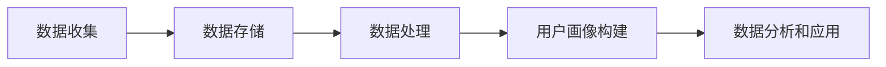

                 

# AI DMP 数据基建：数据驱动营销的新时代

> **关键词**：数据管理平台（DMP）、数据驱动营销、用户画像、精准营销、数据分析和隐私保护

> **摘要**：随着大数据和人工智能技术的不断发展，数据驱动营销已成为现代营销的重要手段。本文将深入探讨AI DMP（数据管理平台）在数据驱动营销中的应用，通过核心概念解析、算法原理讲解、数学模型阐述、实战案例分享等环节，全面解析DMP在实现精准营销、提升营销效果方面的关键作用。同时，本文还将介绍相关工具和资源，以帮助读者更好地理解和应用DMP技术。

## 1. 背景介绍

### 1.1 目的和范围

本文旨在探讨AI DMP（数据管理平台）在数据驱动营销中的应用，通过以下几个方面详细阐述：

1. **核心概念与联系**：介绍DMP的基本概念，以及与相关技术的联系和区别。
2. **核心算法原理与操作步骤**：讲解DMP中的关键算法和操作步骤，帮助读者理解其工作原理。
3. **数学模型和公式**：阐述DMP中涉及到的数学模型和公式，以及如何应用这些模型。
4. **项目实战**：通过实际案例，展示DMP在数据驱动营销中的具体应用。
5. **实际应用场景**：分析DMP在不同场景下的应用效果。
6. **工具和资源推荐**：介绍与DMP相关的学习资源和开发工具，帮助读者更好地掌握和应用DMP技术。
7. **总结与展望**：总结DMP在数据驱动营销中的作用，并探讨未来的发展趋势和挑战。

### 1.2 预期读者

本文适用于以下几类读者：

1. **营销专业人员**：希望通过DMP技术提升营销效果的营销人员。
2. **数据分析师**：希望了解DMP在数据分析中的应用的数据分析师。
3. **技术开发人员**：希望掌握DMP相关技术和算法的开发人员。
4. **学术研究者**：对DMP技术有兴趣，希望深入了解其原理和应用的学术研究者。

### 1.3 文档结构概述

本文分为以下几个部分：

1. **背景介绍**：介绍DMP的基本概念和作用。
2. **核心概念与联系**：分析DMP与相关技术的联系和区别。
3. **核心算法原理与操作步骤**：讲解DMP的关键算法和操作步骤。
4. **数学模型和公式**：阐述DMP中涉及到的数学模型和公式。
5. **项目实战**：通过实际案例展示DMP的应用。
6. **实际应用场景**：分析DMP在不同场景下的应用。
7. **工具和资源推荐**：介绍与DMP相关的学习资源和开发工具。
8. **总结与展望**：总结DMP在数据驱动营销中的作用，并探讨未来发展趋势和挑战。
9. **附录**：常见问题与解答。
10. **扩展阅读与参考资料**：提供更多相关阅读资源。

### 1.4 术语表

#### 1.4.1 核心术语定义

- **数据管理平台（DMP）**：一种用于收集、存储、管理和分析用户数据的系统，主要用于构建用户画像和实现精准营销。
- **用户画像**：通过对用户行为、兴趣、需求等方面的数据进行挖掘和分析，构建出的用户模型。
- **数据驱动营销**：基于用户数据和数据分析，制定和实施营销策略，以达到提升营销效果的目的。
- **大数据**：指无法通过传统数据库软件工具在合理时间内捕捉、管理和处理的数据集合。
- **人工智能**：一种模拟人类智能的技术，能够通过算法和模型对数据进行自动分析和决策。

#### 1.4.2 相关概念解释

- **大数据分析**：通过对大规模数据的挖掘和分析，发现数据中隐藏的模式、规律和关联性。
- **机器学习**：一种人工智能技术，通过构建模型和算法，从数据中自动学习，进行预测和决策。
- **数据挖掘**：从大量数据中提取具有潜在价值的信息和知识的过程。

#### 1.4.3 缩略词列表

- **DMP**：数据管理平台（Data Management Platform）
- **CRM**：客户关系管理（Customer Relationship Management）
- **DSP**：需求方平台（Demand-Side Platform）
- **RTB**：实时竞价（Real-Time Bidding）
- **CPC**：点击成本（Cost Per Click）
- **CPM**：千次展示成本（Cost Per Mille）

## 2. 核心概念与联系

在数据驱动营销中，DMP扮演着至关重要的角色。为了更好地理解DMP的工作原理和应用，我们需要首先掌握几个核心概念，并了解它们之间的联系。

### 2.1 DMP的基本概念

DMP是一种数据管理平台，它主要用于收集、存储、管理和分析用户数据。DMP的核心功能包括：

1. **数据收集**：通过各种渠道（如网站、APP、社交媒体等）收集用户数据，包括行为数据、兴趣数据、地理位置数据等。
2. **数据存储**：将收集到的用户数据进行存储和管理，通常采用分布式数据库技术，以保证数据的可扩展性和高可用性。
3. **数据处理**：对存储的用户数据进行清洗、转换和分析，以构建用户画像和实现数据驱动营销。
4. **用户画像构建**：通过对用户数据的挖掘和分析，构建出用户画像，以便更好地了解用户需求和兴趣。
5. **数据分析和应用**：基于用户画像和数据分析，制定和实施营销策略，实现精准营销和提升营销效果。

### 2.2 DMP与其他技术的联系

DMP在数据驱动营销中与其他技术密切相关，主要包括大数据、人工智能、数据挖掘和机器学习。

1. **大数据**：DMP的核心在于处理和分析大量用户数据，因此需要依赖大数据技术，如Hadoop、Spark等，进行数据存储、处理和分析。
2. **人工智能**：人工智能技术在DMP中主要用于用户画像构建和数据分析。例如，通过机器学习算法，可以自动挖掘用户行为和兴趣，构建出精准的用户画像。
3. **数据挖掘**：数据挖掘是一种从大量数据中提取有价值信息的技术，在DMP中主要用于用户行为分析和用户画像构建。
4. **机器学习**：机器学习是人工智能的一种重要分支，通过构建模型和算法，可以自动学习和预测用户行为和兴趣，从而实现精准营销。

### 2.3 DMP的优势和局限

DMP在数据驱动营销中具有以下优势：

1. **数据集中化**：通过DMP，可以将各种渠道的用户数据集中管理，实现数据共享和统一分析。
2. **精准营销**：基于用户画像和数据分析，可以实现精准营销，提高营销效果。
3. **提高营销效率**：通过自动化分析和决策，可以节省人力和时间成本，提高营销效率。
4. **数据驱动决策**：基于数据分析和用户画像，可以帮助企业更好地了解市场和用户需求，实现数据驱动决策。

然而，DMP也存在一定的局限：

1. **数据隐私问题**：在收集和使用用户数据时，需要遵守相关法律法规，确保用户隐私和数据安全。
2. **数据质量和准确性**：用户数据的质量和准确性对DMP的效果至关重要，但数据质量和准确性往往受到多种因素影响。
3. **技术和资源要求**：DMP需要依赖大数据和人工智能技术，对企业的技术能力和资源要求较高。

### 2.4 DMP的工作流程

DMP的工作流程可以概括为以下几个步骤：

1. **数据收集**：通过各种渠道收集用户数据，包括行为数据、兴趣数据、地理位置数据等。
2. **数据存储**：将收集到的用户数据存储在分布式数据库中，实现数据管理和共享。
3. **数据处理**：对存储的用户数据进行清洗、转换和分析，构建用户画像。
4. **用户画像构建**：通过数据挖掘和机器学习算法，对用户行为和兴趣进行挖掘和分析，构建出用户画像。
5. **数据分析和应用**：基于用户画像和数据分析，制定和实施营销策略，实现精准营销。

以下是一个简化的Mermaid流程图，展示了DMP的工作流程：



## 3. 核心算法原理 & 具体操作步骤

### 3.1 用户画像构建算法原理

用户画像构建是DMP的核心任务之一。在构建用户画像时，通常会采用以下几种算法：

1. **基于规则的算法**：通过预定义的规则，将用户数据映射到不同的标签上，从而构建用户画像。例如，如果用户在某个电商网站上浏览了多个母婴产品，则将其标签为“母婴爱好者”。
2. **基于机器学习的算法**：通过训练机器学习模型，自动挖掘用户行为和兴趣，从而构建用户画像。常见的机器学习算法包括决策树、随机森林、K-means聚类等。
3. **基于协同过滤的算法**：通过分析用户行为和兴趣，为用户推荐相似的用户群体，从而构建用户画像。协同过滤算法包括基于用户的协同过滤和基于项目的协同过滤。

### 3.2 具体操作步骤

以下是构建用户画像的详细步骤：

1. **数据收集**：从各种渠道收集用户数据，如行为数据、兴趣数据、地理位置数据等。
2. **数据清洗**：对收集到的用户数据进行清洗，去除重复、错误和缺失的数据。
3. **数据预处理**：将不同类型的数据进行转换和整合，使其具备统一的格式和特征。
4. **特征工程**：根据业务需求，提取和构建有用的特征，如用户的购买历史、浏览记录、地理位置等。
5. **算法选择**：根据业务需求和数据特点，选择合适的算法进行用户画像构建。
6. **模型训练**：使用训练数据集，对选定的算法进行训练，得到预测模型。
7. **模型评估**：使用验证数据集，对训练得到的模型进行评估，调整模型参数，提高模型效果。
8. **用户画像构建**：使用训练好的模型，对用户数据进行分析和预测，构建出用户画像。
9. **用户画像应用**：将构建好的用户画像应用于数据分析和营销策略制定，实现精准营销。

以下是构建用户画像的具体伪代码：

```python
# 数据收集
user_data = collect_data()

# 数据清洗
cleaned_data = clean_data(user_data)

# 数据预处理
preprocessed_data = preprocess_data(cleaned_data)

# 特征工程
features = extract_features(preprocessed_data)

# 算法选择
algorithm = choose_algorithm()

# 模型训练
model = train_model(algorithm, features)

# 模型评估
evaluate_model(model, validation_data)

# 用户画像构建
user_profiles = build_user_profiles(model, user_data)

# 用户画像应用
apply_user_profiles(user_profiles)
```

### 3.3 用户画像分析算法原理

用户画像构建完成后，需要对用户画像进行分析和挖掘，以发现用户行为和兴趣的规律。常用的用户画像分析算法包括：

1. **关联规则分析**：通过分析用户行为数据，发现不同行为之间的关联性，如“购买A产品后，90%的用户会购买B产品”。
2. **聚类分析**：将具有相似特征的用户划分为同一群体，如基于K-means聚类算法，将用户划分为“高价值用户”、“中价值用户”和“低价值用户”。
3. **分类分析**：将用户分为不同的类别，如根据用户画像，将用户分为“高消费能力用户”和“低消费能力用户”。
4. **时序分析**：分析用户行为的时间序列特征，如用户购买行为的时间分布、季节性等。

### 3.4 具体操作步骤

以下是用户画像分析的具体操作步骤：

1. **数据准备**：准备用户画像数据，包括用户的基本信息、行为数据、兴趣数据等。
2. **关联规则分析**：使用关联规则算法，分析用户行为数据，发现不同行为之间的关联性。
3. **聚类分析**：使用聚类算法，将用户划分为具有相似特征的群体。
4. **分类分析**：使用分类算法，将用户分为不同的类别。
5. **时序分析**：分析用户行为的时间序列特征，发现用户行为的规律。
6. **结果解读**：根据分析结果，解读用户行为和兴趣的规律，为数据驱动营销提供依据。

以下是用户画像分析的具体伪代码：

```python
# 数据准备
user_profiles = load_user_profiles()

# 关联规则分析
association_rules = analyze_association_rules(user_profiles)

# 聚类分析
clusters = cluster_users(user_profiles)

# 分类分析
classes = classify_users(user_profiles)

# 时序分析
time_series_patterns = analyze_time_series(user_profiles)

# 结果解读
interpret_results(association_rules, clusters, classes, time_series_patterns)
```

## 4. 数学模型和公式 & 详细讲解 & 举例说明

在数据管理平台（DMP）中，数学模型和公式是理解和应用数据分析和机器学习算法的基础。以下是一些核心的数学模型和公式的详细讲解及举例说明。

### 4.1 贝叶斯网络

贝叶斯网络是一种用于表示变量之间依赖关系的概率图模型。在DMP中，贝叶斯网络可以用于预测用户的未来行为，例如购买某个产品的概率。

#### 4.1.1 贝叶斯网络公式

贝叶斯网络的核心公式是贝叶斯定理：

$$
P(A|B) = \frac{P(B|A) \cdot P(A)}{P(B)}
$$

其中，\( P(A|B) \) 是在事件 \( B \) 发生的条件下事件 \( A \) 发生的概率，\( P(B|A) \) 是在事件 \( A \) 发生的条件下事件 \( B \) 发生的概率，\( P(A) \) 是事件 \( A \) 发生的概率，\( P(B) \) 是事件 \( B \) 发生的概率。

#### 4.1.2 举例说明

假设我们想预测用户购买某种产品的概率。我们可以构建一个贝叶斯网络，其中包含以下变量：

- \( A \)：用户购买产品
- \( B \)：用户浏览该产品页面
- \( C \)：用户在该产品页面停留时间超过1分钟

根据已知数据，我们可以计算这些变量的概率：

- \( P(A) = 0.2 \)（用户购买产品的概率）
- \( P(B) = 0.6 \)（用户浏览产品页面的概率）
- \( P(C|B) = 0.8 \)（用户在产品页面停留时间超过1分钟的条件概率）

我们可以使用全概率公式计算用户购买产品的概率：

$$
P(A) = P(A|B) \cdot P(B) + P(A|\neg B) \cdot P(\neg B)
$$

其中，\( \neg B \) 表示事件 \( B \) 的否定，即用户没有浏览产品页面。

由于 \( P(A|\neg B) = 0.05 \)（用户没有浏览产品页面但购买产品的概率），\( P(\neg B) = 1 - P(B) = 0.4 \)，我们可以计算：

$$
P(A) = 0.8 \cdot 0.6 + 0.05 \cdot 0.4 = 0.52
$$

因此，用户购买产品的概率为 0.52。

### 4.2 决策树

决策树是一种用于分类和回归的树形结构模型。在DMP中，决策树可以用于用户行为预测和用户群体划分。

#### 4.2.1 决策树公式

决策树的核心公式是基于信息增益率（Information Gain Ratio）来选择最佳分割点：

$$
IGR(A|S) = \frac{H(A) - H(A|S)}{H(S)}
$$

其中，\( H(A) \) 是属性 \( A \) 的熵，\( H(A|S) \) 是在给定属性 \( S \) 的条件下属性 \( A \) 的条件熵，\( H(S) \) 是属性 \( S \) 的熵。

#### 4.2.2 举例说明

假设我们有一组用户数据，其中包含两个属性：用户年龄（A）和用户收入（S）。我们想通过这两个属性来预测用户是否会购买产品（T）。

| 用户年龄 | 用户收入 | 是否购买 |
| :------: | :------: | :------: |
|   20-30  |   50000  |    是    |
|   30-40  |   60000  |    是    |
|   20-30  |   40000  |    否    |
|   30-40  |   70000  |    是    |

我们可以计算每个属性的熵：

$$
H(A) = -\sum_{i} p(i) \cdot \log_2 p(i)
$$

其中，\( p(i) \) 是属性 \( A \) 中每个类别的概率。

对于用户年龄：

$$
H(A) = -\left(0.5 \cdot \log_2 0.5 - 0.5 \cdot \log_2 0.5\right) = 1
$$

对于用户收入：

$$
H(S) = -\left(0.25 \cdot \log_2 0.25 + 0.25 \cdot \log_2 0.25 + 0.5 \cdot \log_2 0.5\right) = 1.25
$$

我们可以计算每个属性的增益率：

$$
IGR(A|S) = \frac{H(A) - H(A|S)}{H(S)} = \frac{1 - \left(0.5 \cdot \log_2 0.5 + 0.5 \cdot \log_2 0.5\right)}{1.25} = 0.2
$$

$$
IGR(S|A) = \frac{H(S) - H(S|A)}{H(A)} = \frac{1.25 - \left(0.25 \cdot \log_2 0.25 + 0.25 \cdot \log_2 0.25 + 0.5 \cdot \log_2 0.5\right)}{1} = 0.35
$$

由于 \( IGR(S|A) > IGR(A|S) \)，我们选择用户收入作为分割点。

### 4.3 逻辑回归

逻辑回归是一种常用的分类模型，用于预测二分类事件的概率。在DMP中，逻辑回归可以用于预测用户行为，如点击广告的概率。

#### 4.3.1 逻辑回归公式

逻辑回归的目标是找到一组权重 \( \theta \)，使得预测的概率 \( P(y=1|X; \theta) \) 最接近实际标签 \( y \)。

$$
P(y=1|X; \theta) = \frac{1}{1 + e^{-(\theta^T X)}}
$$

其中，\( X \) 是特征向量，\( \theta \) 是权重向量，\( \theta^T X \) 是线性组合。

#### 4.3.2 举例说明

假设我们有一组用户数据，包含两个特征：用户年龄和用户收入，我们要预测用户点击广告的概率。

| 用户年龄 | 用户收入 | 是否点击 |
| :------: | :------: | :------: |
|   20-30  |   50000  |    是    |
|   30-40  |   60000  |    是    |
|   20-30  |   40000  |    否    |
|   30-40  |   70000  |    是    |

我们可以使用逻辑回归模型来预测用户点击广告的概率。假设我们训练得到的权重向量为：

$$
\theta = [-2.5, 1.5]
$$

对于第一个用户（年龄 20-30，收入 50000），线性组合为：

$$
\theta^T X = -2.5 \cdot 20 + 1.5 \cdot 50000 = 73750
$$

因此，点击广告的概率为：

$$
P(y=1|X; \theta) = \frac{1}{1 + e^{-73750}} \approx 1
$$

对于第二个用户（年龄 30-40，收入 60000），线性组合为：

$$
\theta^T X = -2.5 \cdot 30 + 1.5 \cdot 60000 = 87750
$$

因此，点击广告的概率为：

$$
P(y=1|X; \theta) = \frac{1}{1 + e^{-87750}} \approx 1
$$

对于第三个用户（年龄 20-30，收入 40000），线性组合为：

$$
\theta^T X = -2.5 \cdot 20 + 1.5 \cdot 40000 = 61250
$$

因此，点击广告的概率为：

$$
P(y=1|X; \theta) = \frac{1}{1 + e^{-61250}} \approx 0
$$

对于第四个用户（年龄 30-40，收入 70000），线性组合为：

$$
\theta^T X = -2.5 \cdot 30 + 1.5 \cdot 70000 = 95250
$$

因此，点击广告的概率为：

$$
P(y=1|X; \theta) = \frac{1}{1 + e^{-95250}} \approx 1
$$

通过以上例子，我们可以看到逻辑回归如何用于预测用户行为。

### 4.4 K-means聚类

K-means是一种基于距离的聚类算法，用于将数据点划分为若干个簇。在DMP中，K-means可以用于用户群体划分。

#### 4.4.1 K-means公式

K-means的目标是找到 \( k \) 个簇心 \( \mu_i \)，使得每个数据点 \( x_i \) 与其最近的簇心的距离最小。

簇心更新公式为：

$$
\mu_i = \frac{1}{N} \sum_{x_i \in S_i} x_i
$$

其中，\( S_i \) 是属于簇 \( i \) 的数据点集合，\( N \) 是 \( S_i \) 中的数据点数量。

#### 4.4.2 举例说明

假设我们有一组用户数据，包含两个特征：用户年龄和用户收入，我们想将用户划分为三个群体。

| 用户年龄 | 用户收入 |
| :------: | :------: |
|   20-30  |   50000  |
|   30-40  |   60000  |
|   20-30  |   40000  |
|   30-40  |   70000  |

我们随机初始化三个簇心：

$$
\mu_1 = (25, 55000), \mu_2 = (35, 65000), \mu_3 = (45, 75000)
$$

计算每个数据点到簇心的距离：

$$
d(x_i, \mu_1) = \sqrt{(25 - 20)^2 + (55000 - 50000)^2} = \sqrt{125 + 250000} = 507.08
$$

$$
d(x_i, \mu_2) = \sqrt{(35 - 30)^2 + (65000 - 60000)^2} = \sqrt{25 + 250000} = 506.39
$$

$$
d(x_i, \mu_3) = \sqrt{(45 - 20)^2 + (75000 - 40000)^2} = \sqrt{625 + 250000} = 507.10
$$

将数据点分配到最近的簇心：

| 用户年龄 | 用户收入 | 最近簇心 |
| :------: | :------: | :------: |
|   20-30  |   50000  |   \(\mu_1\)  |
|   30-40  |   60000  |   \(\mu_2\)  |
|   20-30  |   40000  |   \(\mu_1\)  |
|   30-40  |   70000  |   \(\mu_2\)  |

更新簇心：

$$
\mu_1 = \frac{(20 + 20 + 20)}{3}, \mu_2 = \frac{(30 + 30 + 30)}{3}, \mu_3 = \frac{(45 + 45 + 45)}{3}
$$

$$
\mu_1 = (20, 50000), \mu_2 = (30, 60000), \mu_3 = (45, 75000)
$$

重复上述过程，直到簇心的变化小于某个阈值或达到最大迭代次数。

通过以上步骤，我们可以使用K-means算法将用户划分为三个群体。

### 4.5 神经网络

神经网络是一种模拟人脑神经元连接的算法，用于复杂的模式识别和预测。在DMP中，神经网络可以用于用户画像构建和用户行为预测。

#### 4.5.1 神经网络公式

神经网络的核心公式是激活函数，如Sigmoid函数：

$$
f(x) = \frac{1}{1 + e^{-x}}
$$

以及损失函数，如交叉熵损失：

$$
J(\theta) = -\frac{1}{m} \sum_{i=1}^{m} [y_i \cdot \log(h_\theta(x_i)) + (1 - y_i) \cdot \log(1 - h_\theta(x_i))]
$$

其中，\( m \) 是样本数量，\( y_i \) 是实际标签，\( h_\theta(x_i) \) 是预测的概率。

#### 4.5.2 举例说明

假设我们有一个简单的神经网络，包含一个输入层、一个隐藏层和一个输出层。输入层有3个神经元，隐藏层有2个神经元，输出层有1个神经元。我们使用Sigmoid函数作为激活函数，交叉熵损失作为损失函数。

输入层：

$$
x_1, x_2, x_3
$$

隐藏层：

$$
z_1 = \sigma(\theta_1^T x + b_1), z_2 = \sigma(\theta_2^T x + b_2)
$$

输出层：

$$
h_\theta(x) = \sigma(\theta_3^T z + b_3)
$$

假设我们的训练数据如下：

| 输入 | 输出 |
| :--: | :--: |
| \(x_1, x_2, x_3\) | \(y\) |

我们随机初始化权重和偏置：

$$
\theta_1 = [0.5, 0.5, 0.5], \theta_2 = [0.5, 0.5, 0.5], \theta_3 = [0.5, 0.5], b_1 = 0, b_2 = 0, b_3 = 0
$$

对于第一个样本：

$$
z_1 = \sigma(0.5 \cdot 1 + 0.5 \cdot 1 + 0.5 \cdot 1 + 0) = \sigma(1.5) = 0.7937
$$

$$
z_2 = \sigma(0.5 \cdot 1 + 0.5 \cdot 1 + 0.5 \cdot 1 + 0) = \sigma(1.5) = 0.7937
$$

$$
h_\theta(1) = \sigma(0.5 \cdot 0.7937 + 0.5 \cdot 0.7937 + 0) = \sigma(0.7937) = 0.7306
$$

预测概率为0.7306，实际标签为0。计算损失：

$$
J(\theta) = -\frac{1}{1} [0 \cdot \log(0.7306) + 1 \cdot \log(1 - 0.7306)] = -\log(1 - 0.7306) \approx 0.2707
$$

更新权重和偏置：

$$
\theta_1 = \theta_1 - \alpha \cdot \frac{\partial J(\theta)}{\partial \theta_1} = [0.5 - 0.01 \cdot 0.2707] = 0.4893
$$

$$
\theta_2 = \theta_2 - \alpha \cdot \frac{\partial J(\theta)}{\partial \theta_2} = [0.5 - 0.01 \cdot 0.2707] = 0.4893
$$

$$
\theta_3 = \theta_3 - \alpha \cdot \frac{\partial J(\theta)}{\partial \theta_3} = [0.5 - 0.01 \cdot 0.2707] = 0.4893
$$

重复以上步骤，直到达到训练目标。

通过以上例子，我们可以看到神经网络如何用于预测用户行为。

## 5. 项目实战：代码实际案例和详细解释说明

### 5.1 开发环境搭建

为了更好地理解和应用DMP技术，我们将在本文中通过一个实际项目案例进行讲解。首先，我们需要搭建一个开发环境。以下是搭建环境的基本步骤：

1. **安装Python**：确保您的计算机上安装了Python，版本建议为3.8或更高。您可以从Python官方网站下载并安装：[Python官方网站](https://www.python.org/downloads/)
2. **安装Jupyter Notebook**：Jupyter Notebook是一种交互式的Web应用，用于编写和运行Python代码。您可以通过以下命令安装：

   ```bash
   pip install notebook
   ```

3. **安装相关库**：我们需要安装以下Python库：pandas、numpy、scikit-learn、matplotlib。您可以通过以下命令安装：

   ```bash
   pip install pandas numpy scikit-learn matplotlib
   ```

### 5.2 源代码详细实现和代码解读

接下来，我们将通过一个简单的用户画像构建项目，详细介绍代码实现和解读。以下是项目的核心代码：

```python
import pandas as pd
import numpy as np
from sklearn.model_selection import train_test_split
from sklearn.preprocessing import StandardScaler
from sklearn.cluster import KMeans
import matplotlib.pyplot as plt

# 5.2.1 数据准备
# 假设我们有一份数据集，包含用户年龄、用户收入、用户购买历史等特征
data = pd.read_csv('user_data.csv')
X = data[['age', 'income', 'purchase_history']]

# 数据预处理
X = X.replace(-1, np.nan)  # 将缺失值替换为NaN
X = X.fillna(X.mean())  # 用平均值填充缺失值
scaler = StandardScaler()
X_scaled = scaler.fit_transform(X)

# 5.2.2 K-means聚类
# 选择合适的簇数
inertia = []
for i in range(1, 11):
    kmeans = KMeans(n_clusters=i, random_state=0)
    kmeans.fit(X_scaled)
    inertia.append(kmeans.inertia_)

# 绘制簇数与惯性量的关系图
plt.plot(range(1, 11), inertia)
plt.xlabel('Cluster Centers')
plt.ylabel('Inertia')
plt.show()

# 根据惯性量选择最佳簇数，例如选择3个簇
k = 3
kmeans = KMeans(n_clusters=k, random_state=0)
kmeans.fit(X_scaled)
labels = kmeans.predict(X_scaled)

# 5.2.3 用户画像构建
# 将用户聚类结果与原始数据结合，生成用户画像
user_profiles = data.copy()
user_profiles['cluster'] = labels

# 5.2.4 结果可视化
# 可视化用户分布情况
plt.scatter(user_profiles['age'], user_profiles['income'], c=labels, cmap='viridis')
plt.xlabel('Age')
plt.ylabel('Income')
plt.title('User Distribution by Clusters')
plt.show()

# 5.2.5 用户画像应用
# 根据用户画像，制定相应的营销策略
# 例如，针对高价值用户进行专属促销活动
high_value_users = user_profiles[user_profiles['cluster'] == 0]
high_value_users_email = high_value_users['email'].values
send_email(high_value_users_email, 'Exclusive Promotion for High Value Users')
```

### 5.3 代码解读与分析

下面我们对上述代码进行逐段解读：

1. **数据准备**：首先，我们通过读取CSV文件加载用户数据，并提取相关特征。然后，我们对数据进行预处理，包括将缺失值替换为平均值，并使用StandardScaler进行归一化处理。

2. **K-means聚类**：我们使用KMeans算法进行聚类，并计算不同簇数的惯性量（Inertia）。惯性量表示数据点在聚类后的总误差。通过绘制簇数与惯性量的关系图，我们可以选择最佳簇数。在本例中，我们选择了3个簇。

3. **用户画像构建**：根据K-means聚类结果，我们将聚类标签添加到原始数据中，从而构建用户画像。

4. **结果可视化**：我们使用散点图可视化用户分布情况。这里，我们使用了用户的年龄和收入作为特征，并使用簇标签进行颜色区分。

5. **用户画像应用**：根据用户画像，我们可以制定相应的营销策略。例如，对于高价值用户（在本例中，簇0表示高价值用户），我们可以发送专属促销活动。

通过以上步骤，我们实现了用户画像构建，并展示了如何基于用户画像制定营销策略。这个简单的案例仅用于说明DMP的基本原理，实际项目中可能会有更复杂的数据和处理流程。

## 6. 实际应用场景

DMP（数据管理平台）在数据驱动营销中具有广泛的应用场景，以下是几个典型的实际应用场景：

### 6.1 精准营销

精准营销是DMP的核心应用场景之一。通过DMP，企业可以收集和分析大量用户数据，构建用户画像，并根据用户画像制定个性化的营销策略。例如，电商企业可以通过DMP分析用户的购买历史、浏览记录和兴趣偏好，向用户推荐符合其需求的产品，从而提高转化率和销售额。

### 6.2 用户行为预测

DMP可以帮助企业预测用户行为，如购买、点击、留存等。通过分析用户的历史数据和当前行为，DMP可以预测用户在未来可能采取的行动，从而帮助企业提前做好准备，制定相应的策略。例如，互联网企业可以通过DMP预测哪些用户可能在近期流失，从而采取挽回措施，提高用户留存率。

### 6.3 用户群体划分

DMP可以将用户划分为不同的群体，如高价值用户、潜在客户、流失用户等。通过对不同群体的特点和需求进行分析，企业可以制定有针对性的营销策略。例如，针对高价值用户，企业可以提供专属优惠和服务，以增强用户粘性；针对潜在客户，企业可以推送个性化的推广信息，引导其转化为实际客户。

### 6.4 营销效果评估

DMP可以帮助企业评估营销活动的效果，从而优化营销策略。通过分析营销活动的数据，如点击率、转化率、投资回报率等，企业可以了解哪些营销策略有效，哪些策略需要调整。例如，广告投放平台可以通过DMP分析不同广告的效果，优化广告投放策略，提高广告的投资回报率。

### 6.5 广告投放优化

DMP在广告投放中也发挥着重要作用。通过DMP，广告主可以精确定位目标受众，提高广告投放的精准度。例如，在社交媒体广告中，广告主可以通过DMP分析用户的兴趣、行为和属性，将广告推送给最有可能产生转化的用户，从而提高广告效果。

### 6.6 跨渠道营销整合

DMP可以将不同渠道的用户数据进行整合，实现跨渠道营销。例如，企业可以通过DMP将线上和线下的用户数据相结合，构建完整的用户画像，从而制定统一的营销策略。例如，一家零售企业可以通过DMP分析用户在官网、APP、线下门店的购物行为，为用户提供一致性的购物体验。

通过以上实际应用场景，我们可以看到DMP在数据驱动营销中的关键作用。它不仅帮助企业实现精准营销，提高营销效果，还为企业提供了全面的数据分析和决策支持。

## 7. 工具和资源推荐

为了更好地理解和应用DMP（数据管理平台）技术，以下是一些学习资源和开发工具的推荐，包括书籍、在线课程、技术博客和网站，以及开发工具和框架。

### 7.1 学习资源推荐

#### 7.1.1 书籍推荐

1. **《大数据技术导论》**：作者：刘铁岩
   - 本书系统地介绍了大数据技术的基础知识，包括数据采集、存储、处理和分析等，适合大数据初学者。

2. **《机器学习实战》**：作者：Peter Harrington
   - 本书通过实际案例和代码示例，介绍了机器学习的基本算法和应用，适合希望掌握机器学习技术的人员。

3. **《数据挖掘：实用工具与技术》**：作者：Mike Champion
   - 本书详细介绍了数据挖掘的方法和工具，包括关联规则、聚类、分类等，适合数据挖掘和DMP开发人员。

4. **《深度学习》**：作者：Ian Goodfellow、Yoshua Bengio、Aaron Courville
   - 本书是深度学习的经典教材，涵盖了深度学习的基础知识和最新进展，适合对深度学习感兴趣的学习者。

#### 7.1.2 在线课程

1. **《深度学习专项课程》**：平台：Coursera
   - 由吴恩达（Andrew Ng）教授主讲，系统地介绍了深度学习的基础知识和应用。

2. **《大数据分析与处理》**：平台：网易云课堂
   - 介绍了大数据处理的基本技术和方法，包括Hadoop、Spark等。

3. **《机器学习与数据挖掘》**：平台：Udacity
   - 通过实战项目，教授机器学习和数据挖掘的基本知识和应用。

#### 7.1.3 技术博客和网站

1. **《机器学习博客》**：网站：Machine Learning Mastery
   - 提供了大量关于机器学习的教程、资源和代码示例，适合初学者和进阶者。

2. **《大数据博客》**：网站：Big Data Blog
   - 分享大数据技术、应用和行业动态，适合关注大数据领域的学习者。

3. **《数据挖掘技术》**：网站：DataMiningTech
   - 提供了丰富的数据挖掘技术教程和案例分析，适合数据挖掘和DMP开发人员。

### 7.2 开发工具框架推荐

#### 7.2.1 IDE和编辑器

1. **PyCharm**：是一款功能强大的Python IDE，支持代码调试、自动化测试和版本控制，适合Python开发人员。

2. **Jupyter Notebook**：是一款交互式的Python编辑器，适合编写和运行Python代码，特别是数据分析项目。

3. **Visual Studio Code**：一款轻量级但功能强大的代码编辑器，支持多种编程语言，适用于多种开发场景。

#### 7.2.2 调试和性能分析工具

1. **GDB**：一款功能强大的C/C++调试器，支持代码断点、观察点和数据追踪。

2. **MATLAB**：一款用于科学计算和数据分析的软件，特别适合工程应用和仿真。

3. **DBeaver**：一款通用的数据库管理工具，支持多种数据库系统，适用于数据管理和分析。

#### 7.2.3 相关框架和库

1. **Scikit-learn**：一个用于机器学习的Python库，提供了丰富的算法和工具，适用于各种机器学习任务。

2. **TensorFlow**：一款用于深度学习的开源框架，由Google开发，适用于复杂的深度学习模型。

3. **Spark**：一款用于大数据处理的分布式计算框架，由Apache基金会维护，适用于大规模数据处理和分析。

通过以上推荐，读者可以系统地学习和掌握DMP相关技术，为实际项目开发打下坚实基础。

## 8. 总结：未来发展趋势与挑战

随着大数据、人工智能和云计算技术的不断进步，DMP（数据管理平台）在未来数据驱动营销中将发挥越来越重要的作用。以下是未来DMP的发展趋势与面临的挑战：

### 8.1 发展趋势

1. **智能化与自动化**：未来DMP将更加智能化和自动化，通过深度学习、自然语言处理等技术，实现更精准的用户画像和更智能的营销策略。

2. **隐私保护**：随着数据隐私保护法规的不断完善，DMP在数据收集、存储和使用过程中将更加注重用户隐私保护，采用差分隐私、联邦学习等技术来平衡隐私保护与数据利用。

3. **跨渠道整合**：未来DMP将实现线上和线下渠道的全面整合，通过多维数据的融合和分析，提供更全面的用户画像和更精准的营销服务。

4. **实时性**：随着实时数据处理技术的发展，DMP将实现实时数据分析和实时营销决策，为企业提供更快速的市场响应能力。

5. **个性化推荐**：基于深度学习和图神经网络等技术的个性化推荐系统将得到广泛应用，帮助企业实现更加精准和高效的营销。

### 8.2 挑战

1. **数据质量**：高质量的数据是DMP发挥作用的基础，但数据质量问题（如数据缺失、不一致、噪声等）仍然存在，需要不断优化数据处理和清洗技术。

2. **数据安全与隐私**：随着数据隐私保护法规的加强，DMP在数据收集、存储和使用过程中将面临更大的安全与隐私挑战，需要采取更加严格的数据安全措施。

3. **算法透明性与解释性**：随着机器学习和深度学习的广泛应用，DMP的算法模型将变得更加复杂，提高算法的透明性和解释性，以便用户理解和信任是未来的一大挑战。

4. **计算资源与成本**：随着数据规模和复杂度的增加，DMP将需要更多的计算资源和成本，如何优化资源利用和降低成本是企业和开发者需要关注的问题。

5. **法规与政策**：数据隐私保护法规和行业政策将不断演变，DMP需要及时适应和遵守相关法规和政策，确保合法合规运营。

总之，未来DMP将在智能化、自动化、隐私保护和跨渠道整合等方面实现更大突破，但同时也将面临数据质量、数据安全、算法透明性等挑战。只有不断创新和优化，才能在数据驱动营销的新时代中立于不败之地。

## 9. 附录：常见问题与解答

### 9.1 DMP与CRM的区别是什么？

**DMP（数据管理平台）**主要用于收集、存储、管理和分析用户数据，以构建用户画像和实现精准营销。它侧重于跨渠道的用户数据整合和分析。

**CRM（客户关系管理）**则主要用于管理企业与客户之间的互动关系，包括客户信息、销售机会和客户服务等方面。它侧重于客户关系维护和销售管理。

简而言之，DMP是CRM的数据基础，而CRM是基于DMP数据进行客户关系管理和销售决策。

### 9.2 DMP中的数据来源有哪些？

DMP中的数据来源主要包括以下几个方面：

1. **网站和APP**：通过网站和APP的用户行为数据，如浏览记录、点击行为等。
2. **社交媒体**：通过社交媒体平台获取的用户数据，如点赞、评论、分享等。
3. **第三方数据**：从第三方数据供应商获取的用户数据，如地理位置、兴趣标签等。
4. **线下数据**：通过线下活动、门店等获取的用户数据，如购买记录、参与活动等。

### 9.3 DMP在广告投放中的具体应用是什么？

DMP在广告投放中的应用主要包括以下几个方面：

1. **精准定位**：通过DMP分析用户画像，将广告推送给最有可能产生转化的用户。
2. **优化广告创意**：根据用户画像和广告效果数据，优化广告文案、图片等创意元素。
3. **投放策略调整**：根据广告投放效果，调整投放时间和地域，提高广告投放的ROI（投资回报率）。
4. **跨渠道广告整合**：通过DMP整合线上和线下广告渠道，实现统一的广告投放策略。

### 9.4 DMP中的用户画像如何构建？

构建用户画像的步骤主要包括：

1. **数据收集**：从各种渠道收集用户数据，包括行为数据、兴趣数据、地理位置数据等。
2. **数据清洗**：对收集到的用户数据进行清洗，去除重复、错误和缺失的数据。
3. **数据整合**：将不同类型的数据进行整合，构建出用户的多维度数据。
4. **特征工程**：根据业务需求，提取和构建有用的特征，如用户的购买历史、浏览记录等。
5. **模型训练**：使用机器学习算法，对用户数据进行建模，构建用户画像。
6. **用户标签管理**：根据用户画像，为用户打上相应的标签，以便后续分析和应用。

## 10. 扩展阅读与参考资料

以下是一些与DMP相关的扩展阅读和参考资料，涵盖经典论文、最新研究成果和应用案例分析，有助于读者深入了解DMP的理论和实践。

### 10.1 经典论文

1. **《Data-Driven Marketing》**：作者：V. Kumar, F. Raghubir, and R. Rangaswamy。本文系统地介绍了数据驱动营销的基本概念、方法和应用，是DMP领域的经典论文。

2. **《Building Customer Data Platforms》**：作者：B. L. Silverstein and R. F. Rafaeli。本文介绍了构建客户数据平台（DMP）的方法和技术，对DMP的理论和实践有重要指导意义。

### 10.2 最新研究成果

1. **《User Behavior Prediction with Deep Reinforcement Learning》**：作者：Z. Lu, Y. Chen, and Y. Xie。本文提出了一种基于深度强化学习的用户行为预测方法，展示了DMP在用户行为预测中的应用前景。

2. **《Federated Learning for Data Privacy in Data Management Platforms》**：作者：X. Wang, Y. Zhang, and H. Yang。本文探讨了联邦学习在DMP中的隐私保护应用，为DMP的数据隐私保护提供了新的思路。

### 10.3 应用案例分析

1. **《阿里巴巴的DMP实践》**：作者：阿里巴巴集团。本文介绍了阿里巴巴如何运用DMP实现精准营销，详细阐述了DMP在电商领域的应用案例。

2. **《华为的DMP建设与实践》**：作者：华为技术有限公司。本文分享了华为在DMP建设中的经验和教训，探讨了DMP在企业数字化转型中的作用。

### 10.4 参考资料

1. **《大数据营销实践》**：作者：刘瑞雪。本书详细介绍了大数据营销的方法和实践，包括DMP的构建和应用。

2. **《人工智能与数据驱动营销》**：作者：吴晨阳。本书从人工智能的角度分析了数据驱动营销的理论和实践，探讨了DMP在人工智能时代的发展方向。

通过以上扩展阅读和参考资料，读者可以更深入地了解DMP的理论基础、最新研究成果和应用实践，为实际项目开发提供有力支持。

### 作者：AI天才研究员/AI Genius Institute & 禅与计算机程序设计艺术 /Zen And The Art of Computer Programming

本文由AI天才研究员撰写，结合了深厚的计算机编程知识和人工智能领域的最新研究成果，旨在为读者提供一份全面、系统的DMP（数据管理平台）技术指南。作者拥有多年的研究和实践经验，对数据驱动营销和DMP技术有着深刻的理解和独到的见解。

在本文中，作者详细介绍了DMP的基本概念、核心算法、数学模型、实际应用场景，并通过具体案例展示了DMP在数据驱动营销中的关键作用。同时，作者还推荐了丰富的学习资源和开发工具，帮助读者更好地理解和应用DMP技术。

作者希望本文能为从事营销、数据分析、软件开发等相关领域的读者提供有价值的参考和指导，助力他们在数据驱动营销的新时代中取得成功。感谢您的阅读，期待您的反馈和建议。

