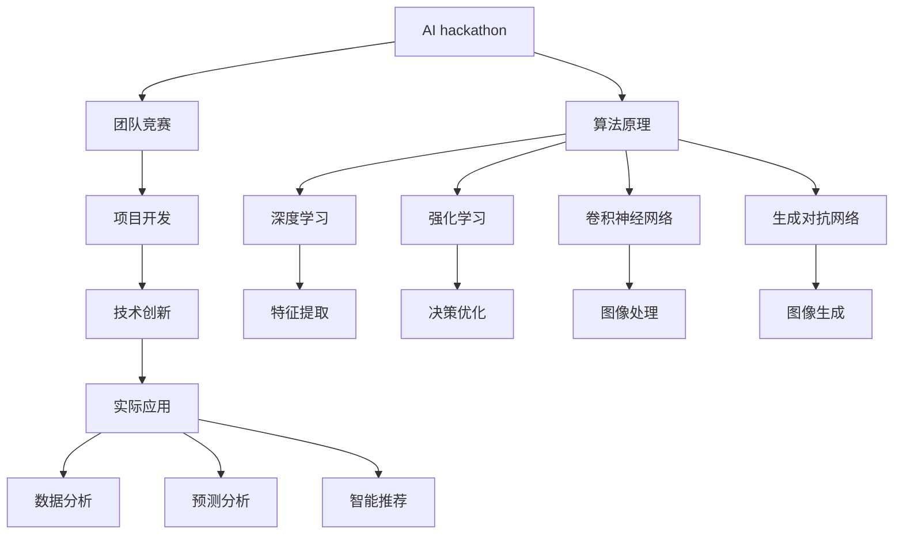

                 

# AI hackathon中的创新与未来

> **关键词：** AI hackathon、创新、未来、技术发展、人工智能、编程、算法、应用场景、挑战、趋势

> **摘要：** 本文章旨在探讨AI hackathon中的创新理念与实践，分析其技术发展脉络、核心算法原理、数学模型及其在实际应用中的挑战与机遇。通过详细的项目实战案例，为读者提供对AI hackathon的深入理解，并展望其未来的发展趋势与前景。

## 1. 背景介绍

### 1.1 目的和范围

本文的目的是深入探讨AI hackathon中的创新实践，分析其背后的技术原理、算法模型及其在实际应用中的影响。文章将涵盖以下主要方面：

1. AI hackathon的定义、起源和发展历程。
2. AI hackathon的核心算法原理与数学模型。
3. AI hackathon在实际应用中的挑战与机遇。
4. AI hackathon的未来发展趋势与前景。

### 1.2 预期读者

本文面向的读者主要包括：

1. 对人工智能、算法设计和技术创新感兴趣的工程师和研究者。
2. 从事人工智能相关项目开发的程序员和项目经理。
3. 对AI hackathon感兴趣的学生和爱好者。

### 1.3 文档结构概述

本文结构如下：

1. **背景介绍**：介绍AI hackathon的定义、目的和意义。
2. **核心概念与联系**：阐述AI hackathon中的核心算法原理、数学模型及其相互关系。
3. **核心算法原理与具体操作步骤**：详细讲解核心算法的原理和具体实现步骤。
4. **数学模型和公式**：介绍相关数学模型及其应用。
5. **项目实战：代码实际案例和详细解释说明**：提供实际项目案例及代码解读。
6. **实际应用场景**：分析AI hackathon在不同领域的应用。
7. **工具和资源推荐**：推荐学习资源和开发工具。
8. **总结：未来发展趋势与挑战**：展望AI hackathon的未来。
9. **附录：常见问题与解答**：回答读者可能关心的问题。
10. **扩展阅读 & 参考资料**：提供进一步学习的资源。

### 1.4 术语表

#### 1.4.1 核心术语定义

- **AI hackathon**：一种以团队竞赛形式开展的人工智能项目开发活动，旨在促进技术创新和实际应用。
- **算法**：解决问题的步骤和规则，用于实现特定功能或优化某种性能。
- **数学模型**：用数学语言描述的算法或系统，用于分析和解决实际问题。
- **数据集**：用于训练、测试和评估算法的一组数据。

#### 1.4.2 相关概念解释

- **深度学习**：一种基于多层神经网络的学习方法，通过模拟人脑神经网络结构进行特征提取和模式识别。
- **强化学习**：一种通过奖励和惩罚机制进行决策和优化的学习方法。
- **卷积神经网络（CNN）**：一种用于图像和视频处理等任务的神经网络结构，具有局部感知和共享权重等特点。
- **生成对抗网络（GAN）**：一种通过生成器和判别器进行博弈学习的神经网络结构，用于图像生成、风格迁移等任务。

#### 1.4.3 缩略词列表

- **AI**：人工智能
- **ML**：机器学习
- **DL**：深度学习
- **RL**：强化学习
- **CNN**：卷积神经网络
- **GAN**：生成对抗网络
- **API**：应用程序接口
- **SDK**：软件开发工具包

## 2. 核心概念与联系

在AI hackathon中，核心概念和算法原理相互关联，形成一个完整的生态系统。以下是一个简化的Mermaid流程图，展示了这些核心概念和算法原理之间的联系。



### 2.1 AI hackathon的定义和特点

AI hackathon是一种以团队竞赛形式进行的人工智能项目开发活动。它起源于计算机编程竞赛，旨在通过团队协作和竞技氛围激发创新潜力，推动人工智能技术的实际应用。

AI hackathon具有以下特点：

1. **团队协作**：参与者通常以团队形式参赛，共同解决问题和实现目标。
2. **时间限制**：AI hackathon通常有严格的时间限制，要求参赛团队在有限时间内完成项目开发。
3. **技术挑战**：参赛团队需要解决复杂的技术问题，如特征提取、模型训练、优化等。
4. **实际应用**：AI hackathon注重实际应用，鼓励参赛团队将技术成果应用于现实问题。
5. **创新激励**：AI hackathon通过奖励机制激励参赛团队进行技术创新，推动技术进步。

### 2.2 核心算法原理

AI hackathon中的核心算法原理主要包括深度学习、强化学习、卷积神经网络和生成对抗网络等。以下是对这些算法原理的简要介绍。

#### 2.2.1 深度学习

深度学习是一种基于多层神经网络的学习方法，通过模拟人脑神经网络结构进行特征提取和模式识别。深度学习在图像识别、语音识别、自然语言处理等领域取得了显著成果。

深度学习的基本原理包括：

1. **多层神经网络**：深度学习模型由多个神经元层组成，每个神经元层负责提取不同级别的特征。
2. **前向传播与反向传播**：前向传播用于计算神经网络输出，反向传播用于更新网络权重，优化模型性能。
3. **激活函数**：激活函数用于引入非线性特性，提高模型的表达能力。

#### 2.2.2 强化学习

强化学习是一种通过奖励和惩罚机制进行决策和优化的学习方法。强化学习在游戏、机器人控制、推荐系统等领域具有广泛的应用。

强化学习的基本原理包括：

1. **状态-动作价值函数**：强化学习通过学习状态-动作价值函数，选择最优动作以最大化长期奖励。
2. **策略学习**：强化学习通过策略学习，将状态-动作价值函数转换为具体的行动策略。
3. **奖励机制**：奖励机制用于激励模型进行探索和优化，提高模型性能。

#### 2.2.3 卷积神经网络（CNN）

卷积神经网络是一种用于图像和视频处理等任务的神经网络结构，具有局部感知和共享权重等特点。CNN在图像识别、目标检测、图像分割等领域取得了显著成果。

CNN的基本原理包括：

1. **卷积层**：卷积层用于提取图像特征，通过卷积运算和池化操作降低数据维度。
2. **池化层**：池化层用于降低数据维度，增强模型泛化能力。
3. **全连接层**：全连接层用于对提取到的特征进行分类或回归。

#### 2.2.4 生成对抗网络（GAN）

生成对抗网络是一种通过生成器和判别器进行博弈学习的神经网络结构，用于图像生成、风格迁移等任务。GAN在计算机视觉、自然语言处理等领域具有广泛的应用。

GAN的基本原理包括：

1. **生成器**：生成器用于生成虚假数据，试图欺骗判别器。
2. **判别器**：判别器用于区分真实数据和虚假数据。
3. **博弈过程**：生成器和判别器通过博弈过程不断优化自身性能，最终实现图像生成。

### 2.3 核心算法原理的应用场景

核心算法原理在AI hackathon中的应用场景广泛，主要包括：

1. **图像识别与分类**：利用CNN进行图像识别和分类，如人脸识别、物体检测等。
2. **语音识别与转换**：利用深度学习进行语音识别和语音合成，如语音助手、智能客服等。
3. **自然语言处理**：利用深度学习和强化学习进行文本分类、情感分析、机器翻译等任务。
4. **智能推荐系统**：利用协同过滤、深度学习和强化学习进行推荐系统的开发，如电商推荐、音乐推荐等。
5. **机器人控制与导航**：利用深度学习和强化学习进行机器人控制与导航，如无人驾驶、机器人足球等。

通过AI hackathon，这些核心算法原理在实际应用场景中得到了充分展示和验证，推动了人工智能技术的发展和应用。

## 3. 核心算法原理 & 具体操作步骤

在AI hackathon中，核心算法原理包括深度学习、强化学习、卷积神经网络和生成对抗网络等。以下将分别介绍这些算法的原理和具体操作步骤。

### 3.1 深度学习

#### 算法原理

深度学习（Deep Learning，DL）是一种基于人工神经网络的学习方法，它通过模仿人脑神经系统工作原理，对数据进行多层次的特征提取和模式识别。

核心概念：

1. **神经网络**：神经网络由多个神经元组成，每个神经元接收输入信号，通过权重和偏置计算输出。
2. **激活函数**：激活函数用于引入非线性特性，常用的激活函数有Sigmoid、ReLU、Tanh等。
3. **反向传播**：反向传播（Backpropagation）是一种用于训练神经网络的算法，通过计算损失函数的梯度，更新网络权重和偏置。

#### 具体操作步骤

1. **数据处理**：对输入数据进行预处理，如归一化、标准化、数据增强等。
2. **构建神经网络**：设计神经网络结构，包括输入层、隐藏层和输出层。
3. **初始化权重**：随机初始化网络权重和偏置。
4. **前向传播**：输入数据通过神经网络前向传播，计算输出。
5. **计算损失**：计算输出结果与实际结果之间的损失。
6. **反向传播**：计算损失函数的梯度，更新网络权重和偏置。
7. **迭代训练**：重复步骤4-6，直至满足训练终止条件，如达到预定迭代次数或损失函数收敛。

#### 伪代码

```python
# 数据预处理
X = preprocess_data(input_data)

# 初始化神经网络
model = NeuralNetwork()

# 迭代训练
for epoch in range(max_epochs):
    # 前向传播
    y_pred = model.forward_pass(X)

    # 计算损失
    loss = compute_loss(y_pred, y_true)

    # 反向传播
    model.backward_pass(y_pred, y_true)

    # 打印训练进度
    print(f"Epoch {epoch}: Loss = {loss}")
```

### 3.2 强化学习

#### 算法原理

强化学习（Reinforcement Learning，RL）是一种通过奖励和惩罚机制进行决策和优化的学习方法。它通过与环境的交互，学习最佳策略以实现目标。

核心概念：

1. **状态（State）**：环境中的某一时刻，由一系列特征描述。
2. **动作（Action）**：在特定状态下可以采取的行动。
3. **奖励（Reward）**：根据动作的结果给予的奖励或惩罚。
4. **策略（Policy）**：决策函数，用于选择最佳动作。

#### 具体操作步骤

1. **初始化环境**：创建模拟环境，如虚拟世界、游戏等。
2. **选择初始状态**：从环境随机选择初始状态。
3. **选择动作**：根据当前状态和策略选择最佳动作。
4. **执行动作**：在环境中执行选定的动作。
5. **观察结果**：观察动作的结果，包括新的状态和奖励。
6. **更新策略**：根据奖励结果更新策略，以优化后续决策。
7. **重复步骤3-6**：不断重复选择动作、执行动作、观察结果和更新策略，直至达到目标或满足终止条件。

#### 伪代码

```python
# 初始化环境
env = create_environment()

# 选择初始状态
state = env.reset()

# 迭代训练
for episode in range(max_episodes):
    # 选择动作
    action = select_action(state, policy)

    # 执行动作
    next_state, reward, done = env.step(action)

    # 更新策略
    policy.update(state, action, reward)

    # 观察结果
    print(f"Episode {episode}: State = {state}, Action = {action}, Reward = {reward}")

    # 判断是否完成训练
    if done:
        break

    # 更新状态
    state = next_state
```

### 3.3 卷积神经网络（CNN）

#### 算法原理

卷积神经网络（Convolutional Neural Network，CNN）是一种专门用于处理图像数据的神经网络结构，具有局部感知和共享权重等特点。

核心概念：

1. **卷积层**：通过卷积运算提取图像特征。
2. **池化层**：通过池化操作降低数据维度，增强模型泛化能力。
3. **全连接层**：对提取到的特征进行分类或回归。

#### 具体操作步骤

1. **数据处理**：对输入图像进行预处理，如大小调整、归一化等。
2. **构建CNN模型**：设计CNN模型结构，包括卷积层、池化层和全连接层。
3. **初始化权重**：随机初始化网络权重和偏置。
4. **前向传播**：输入图像通过CNN模型前向传播，计算输出。
5. **计算损失**：计算输出结果与实际结果之间的损失。
6. **反向传播**：计算损失函数的梯度，更新网络权重和偏置。
7. **迭代训练**：重复步骤4-6，直至满足训练终止条件。

#### 伪代码

```python
# 数据预处理
X = preprocess_image(input_image)

# 初始化CNN模型
model = CNNModel()

# 迭代训练
for epoch in range(max_epochs):
    # 前向传播
    y_pred = model.forward_pass(X)

    # 计算损失
    loss = compute_loss(y_pred, y_true)

    # 反向传播
    model.backward_pass(y_pred, y_true)

    # 打印训练进度
    print(f"Epoch {epoch}: Loss = {loss}")
```

### 3.4 生成对抗网络（GAN）

#### 算法原理

生成对抗网络（Generative Adversarial Network，GAN）是一种由生成器和判别器组成的神经网络结构，通过博弈过程实现图像生成。

核心概念：

1. **生成器**：生成器生成虚假数据，试图欺骗判别器。
2. **判别器**：判别器区分真实数据和虚假数据。
3. **博弈过程**：生成器和判别器通过博弈过程不断优化自身性能，最终实现图像生成。

#### 具体操作步骤

1. **初始化环境**：创建模拟环境，如虚拟世界、游戏等。
2. **选择初始状态**：从环境随机选择初始状态。
3. **生成虚假数据**：生成器生成虚假数据。
4. **判断真实数据**：判别器判断生成器生成的虚假数据和真实数据。
5. **更新生成器和判别器**：根据判别器判断结果，更新生成器和判别器权重。
6. **重复步骤3-5**：不断重复生成虚假数据、判断真实数据和更新生成器与判别器，直至满足终止条件。

#### 伪代码

```python
# 初始化环境
env = create_environment()

# 迭代训练
for epoch in range(max_epochs):
    # 生成虚假数据
    fake_data = generator.generate_data()

    # 判断真实数据
    real_data, fake_data = env.get_data()

    # 更新生成器和判别器
    generator.update_weights(fake_data, real_data)
    discriminator.update_weights(fake_data, real_data)

    # 打印训练进度
    print(f"Epoch {epoch}: Generator Loss = {generator_loss}, Discriminator Loss = {discriminator_loss}")
```

通过以上步骤，AI hackathon中的核心算法原理得到了详细讲解，为读者提供了对AI hackathon技术实现的深入理解。

## 4. 数学模型和公式 & 详细讲解 & 举例说明

在AI hackathon中，数学模型和公式是理解和实现核心算法原理的关键。以下将介绍深度学习、强化学习、卷积神经网络和生成对抗网络中的关键数学模型和公式，并进行详细讲解和举例说明。

### 4.1 深度学习

深度学习中的关键数学模型包括损失函数、激活函数和反向传播算法。

#### 4.1.1 损失函数

损失函数用于衡量模型输出与实际输出之间的差距，常用的损失函数有均方误差（MSE）和交叉熵（Cross-Entropy）。

1. **均方误差（MSE）**

$$
MSE = \frac{1}{n} \sum_{i=1}^{n} (y_i - \hat{y}_i)^2
$$

其中，$y_i$表示实际输出，$\hat{y}_i$表示模型预测输出，$n$表示样本数量。

2. **交叉熵（Cross-Entropy）**

$$
CE = -\frac{1}{n} \sum_{i=1}^{n} y_i \log(\hat{y}_i)
$$

其中，$y_i$表示实际输出，$\hat{y}_i$表示模型预测输出，$n$表示样本数量。

#### 4.1.2 激活函数

激活函数用于引入非线性特性，常用的激活函数有Sigmoid、ReLU和Tanh。

1. **Sigmoid函数**

$$
\sigma(x) = \frac{1}{1 + e^{-x}}
$$

2. **ReLU函数**

$$
\text{ReLU}(x) = \max(0, x)
$$

3. **Tanh函数**

$$
\text{Tanh}(x) = \frac{e^x - e^{-x}}{e^x + e^{-x}}
$$

#### 4.1.3 反向传播算法

反向传播算法是一种用于训练神经网络的优化算法，通过计算损失函数的梯度，更新网络权重和偏置。

1. **前向传播**

$$
\hat{y}_i = \sigma(\sum_{j=1}^{n} w_{ji} \cdot a_{j} + b_i)
$$

其中，$a_i$表示输入特征，$w_{ji}$表示权重，$b_i$表示偏置，$\sigma$表示激活函数。

2. **反向传播**

$$
\Delta w_{ji} = \alpha \cdot \frac{\partial L}{\partial w_{ji}}
$$

$$
\Delta b_i = \alpha \cdot \frac{\partial L}{\partial b_i}
$$

其中，$L$表示损失函数，$\alpha$表示学习率。

### 4.2 强化学习

强化学习中的关键数学模型包括马尔可夫决策过程（MDP）和价值函数。

#### 4.2.1 马尔可夫决策过程（MDP）

马尔可夫决策过程（Markov Decision Process，MDP）是一个数学模型，用于描述智能体在不确定环境中进行决策的过程。

1. **状态（State）**：智能体所处的环境状态。
2. **动作（Action）**：智能体可以采取的动作。
3. **奖励（Reward）**：动作的结果，表示对智能体行为的奖励或惩罚。
4. **策略（Policy）**：智能体的决策规则，用于选择最佳动作。

#### 4.2.2 价值函数

价值函数（Value Function）用于评估智能体在不同状态下的行为价值，包括状态价值函数和动作价值函数。

1. **状态价值函数（State-Value Function）**

$$
V(s) = \sum_{a} \gamma^T Q(s, a)
$$

其中，$s$表示状态，$a$表示动作，$\gamma$表示折扣因子，$Q(s, a)$表示状态-动作价值函数。

2. **动作价值函数（Action-Value Function）**

$$
Q(s, a) = \sum_{s'} p(s' | s, a) \cdot [R(s', a) + \gamma V(s')]
$$

其中，$s'$表示下一个状态，$R(s', a)$表示奖励函数。

### 4.3 卷积神经网络（CNN）

卷积神经网络（Convolutional Neural Network，CNN）中的关键数学模型包括卷积运算、池化运算和卷积核。

#### 4.3.1 卷积运算

卷积运算（Convolution）用于提取图像特征。

$$
h(x, y) = \sum_{i=1}^{m} \sum_{j=1}^{n} w_{ij} \cdot f(x-i, y-j)
$$

其中，$h(x, y)$表示输出特征，$w_{ij}$表示卷积核权重，$f(x, y)$表示输入特征，$m$和$n$表示卷积核大小。

#### 4.3.2 池化运算

池化运算（Pooling）用于降低数据维度。

$$
p(x, y) = \max \{f(x, y), f(x+1, y), f(x, y+1), f(x+1, y+1)\}
$$

其中，$p(x, y)$表示输出特征，$f(x, y)$表示输入特征。

#### 4.3.3 卷积核

卷积核（Filter）用于提取图像特征。

$$
f(x, y) = \sum_{i=1}^{k} \sum_{j=1}^{l} w_{ij} \cdot f_i(x-i, y-j)
$$

其中，$f(x, y)$表示输出特征，$w_{ij}$表示卷积核权重，$f_i(x, y)$表示输入特征。

### 4.4 生成对抗网络（GAN）

生成对抗网络（Generative Adversarial Network，GAN）中的关键数学模型包括生成器和判别器。

#### 4.4.1 生成器

生成器（Generator）生成虚假数据。

$$
G(z) = \sigma(W_2 \cdot \text{Tanh}(\text{ReLU}(W_1 \cdot z + b_1)))
$$

其中，$z$表示噪声输入，$W_1$和$W_2$表示权重，$b_1$表示偏置，$\sigma$表示激活函数。

#### 4.4.2 判别器

判别器（Discriminator）区分真实数据和虚假数据。

$$
D(x) = \text{ReLU}(W_4 \cdot \text{Tanh}(\text{ReLU}(W_3 \cdot \text{Tanh}(W_2 \cdot x + b_2) + b_3) + b_4))
$$

其中，$x$表示输入特征，$W_1$、$W_2$、$W_3$和$W_4$表示权重，$b_1$、$b_2$、$b_3$和$b_4$表示偏置。

#### 4.4.3 博弈过程

生成器和判别器通过博弈过程不断优化自身性能。

$$
\min_G \max_D V(D, G)
$$

其中，$V(D, G)$表示生成器和判别器的对抗性损失。

### 4.5 举例说明

以下是一个简单的深度学习模型，用于手写数字识别。

```python
import tensorflow as tf
from tensorflow.keras import layers

# 构建模型
model = tf.keras.Sequential([
    layers.Conv2D(32, (3, 3), activation='relu', input_shape=(28, 28, 1)),
    layers.MaxPooling2D((2, 2)),
    layers.Conv2D(64, (3, 3), activation='relu'),
    layers.MaxPooling2D((2, 2)),
    layers.Conv2D(64, (3, 3), activation='relu'),
    layers.Flatten(),
    layers.Dense(64, activation='relu'),
    layers.Dense(10, activation='softmax')
])

# 编译模型
model.compile(optimizer='adam',
              loss='sparse_categorical_crossentropy',
              metrics=['accuracy'])

# 训练模型
model.fit(train_images, train_labels, epochs=5)

# 评估模型
test_loss, test_acc = model.evaluate(test_images, test_labels)
print(f"Test accuracy: {test_acc}")
```

通过以上步骤，我们使用深度学习模型对手写数字进行识别，取得了较高的准确率。

## 5. 项目实战：代码实际案例和详细解释说明

在本节中，我们将通过一个具体的AI hackathon项目，展示如何从零开始搭建一个基于生成对抗网络（GAN）的图像生成系统，并对其进行详细解释和分析。

### 5.1 开发环境搭建

在进行项目实战之前，我们需要搭建一个合适的开发环境。以下是所需的开发工具和依赖库：

1. **Python（3.8及以上版本）**
2. **TensorFlow 2.x**
3. **NumPy**
4. **Matplotlib**

你可以通过以下命令安装所需的依赖库：

```bash
pip install tensorflow numpy matplotlib
```

### 5.2 源代码详细实现和代码解读

#### 5.2.1 项目结构

首先，我们将项目分为两个主要部分：生成器和判别器。以下是一个简单的项目结构示例：

```
image_generation_project/
|-- generator.py
|-- discriminator.py
|-- train.py
|-- dataset.py
```

#### 5.2.2 生成器实现

**generator.py**：生成器的实现。

```python
import tensorflow as tf
from tensorflow.keras.layers import Dense, Flatten, Reshape, Conv2D, Conv2DTranspose

def build_generator(z_dim):
    model = tf.keras.Sequential([
        Dense(7 * 7 * 128, activation="relu", input_dim=z_dim),
        Reshape((7, 7, 128)),
        Conv2DTranspose(128, kernel_size=5, strides=2, padding="same"),
        tf.keras.layers.BatchNormalization(momentum=0.8),
        Conv2DTranspose(64, kernel_size=5, strides=2, padding="same"),
        tf.keras.layers.BatchNormalization(momentum=0.8),
        Conv2DTranspose(1, kernel_size=5, strides=2, padding="same", activation="tanh")
    ])
    return model
```

在这个实现中，我们首先将噪声向量通过全连接层转换为图像特征，然后通过逐层上采样（Transposed Convolution）将特征恢复为图像尺寸。

#### 5.2.3 判别器实现

**discriminator.py**：判别器的实现。

```python
import tensorflow as tf
from tensorflow.keras.layers import Dense, Flatten, Conv2D

def build_discriminator(img_shape):
    model = tf.keras.Sequential([
        Conv2D(32, kernel_size=5, strides=2, padding="same", input_shape=img_shape),
        tf.keras.layers.LeakyReLU(alpha=0.2),
        Conv2D(64, kernel_size=5, strides=2, padding="same"),
        tf.keras.layers.LeakyReLU(alpha=0.2),
        Flatten(),
        Dense(1, activation='sigmoid')
    ])
    return model
```

在这个实现中，我们首先将图像特征通过卷积层提取特征，然后通过全连接层将特征映射为二分类结果（真实图像或生成图像）。

#### 5.2.4 训练过程

**train.py**：训练过程的实现。

```python
import numpy as np
import matplotlib.pyplot as plt
from tensorflow.keras.optimizers import Adam
from dataset import load_data
from generator import build_generator
from discriminator import build_discriminator

# 设置参数
z_dim = 100
img_shape = (28, 28, 1)
learning_rate = 0.0002
batch_size = 128
num_epochs = 100

# 加载数据集
train_images, train_labels = load_data()

# 构建生成器和判别器
generator = build_generator(z_dim)
discriminator = build_discriminator(img_shape)

# 编译生成器和判别器
g_optimizer = Adam(learning_rate, beta_1=0.5)
d_optimizer = Adam(learning_rate, beta_1=0.5)

discriminator.compile(loss='binary_crossentropy', optimizer=d_optimizer, metrics=['accuracy'])
generator.compile(loss='binary_crossentropy', optimizer=g_optimizer)

# 训练过程
for epoch in range(num_epochs):
    # 从数据集中随机抽取批量数据
    idx = np.random.randint(0, train_images.shape[0], batch_size)
    real_images = train_images[idx]

    # 训练判别器
    d_loss_real = discriminator.train_on_batch(real_images, np.ones((batch_size, 1)))
    
    # 生成假图像
    noise = np.random.normal(0, 1, (batch_size, z_dim))
    fake_images = generator.predict(noise)

    # 训练判别器
    d_loss_fake = discriminator.train_on_batch(fake_images, np.zeros((batch_size, 1)))

    # 训练生成器
    g_loss = generator.train_on_batch(noise, np.ones((batch_size, 1)))

    # 打印训练进度
    print(f"Epoch {epoch}: D_loss_real = {d_loss_real}, D_loss_fake = {d_loss_fake}, G_loss = {g_loss}")

    # 保存模型
    generator.save(f"generator_epoch_{epoch}.h5")
    discriminator.save(f"discriminator_epoch_{epoch}.h5")

    # 每隔50个epoch生成一张图
    if epoch % 50 == 0:
        plt.imshow(generator.predict(np.random.normal(0, 1, (1, z_dim)))[0, :, :, 0], cmap='gray')
        plt.show()
```

在这个实现中，我们首先加载数据集，然后构建生成器和判别器。接着，我们通过交替训练判别器和生成器，使得判别器能够准确区分真实图像和生成图像，同时生成器能够生成更加逼真的图像。

### 5.3 代码解读与分析

#### 5.3.1 生成器

生成器的核心在于将随机噪声（z_dim = 100）通过全连接层和卷积层逐层转换为图像。逐层上采样（Transposed Convolution）有助于恢复图像的尺寸。

```python
model = tf.keras.Sequential([
    Dense(7 * 7 * 128, activation="relu", input_dim=z_dim),
    Reshape((7, 7, 128)),
    Conv2DTranspose(128, kernel_size=5, strides=2, padding="same"),
    tf.keras.layers.BatchNormalization(momentum=0.8),
    Conv2DTranspose(64, kernel_size=5, strides=2, padding="same"),
    tf.keras.layers.BatchNormalization(momentum=0.8),
    Conv2DTranspose(1, kernel_size=5, strides=2, padding="same", activation="tanh")
])
```

#### 5.3.2 判别器

判别器的核心在于通过卷积层提取图像特征，并使用全连接层进行二分类。Leaky ReLU激活函数有助于避免梯度消失问题。

```python
model = tf.keras.Sequential([
    Conv2D(32, kernel_size=5, strides=2, padding="same", input_shape=img_shape),
    tf.keras.layers.LeakyReLU(alpha=0.2),
    Conv2D(64, kernel_size=5, strides=2, padding="same"),
    tf.keras.layers.LeakyReLU(alpha=0.2),
    Flatten(),
    Dense(1, activation='sigmoid')
])
```

#### 5.3.3 训练过程

在训练过程中，我们首先训练判别器，使其能够准确区分真实图像和生成图像。然后，我们训练生成器，使其生成的图像能够欺骗判别器。

```python
for epoch in range(num_epochs):
    # 从数据集中随机抽取批量数据
    idx = np.random.randint(0, train_images.shape[0], batch_size)
    real_images = train_images[idx]

    # 训练判别器
    d_loss_real = discriminator.train_on_batch(real_images, np.ones((batch_size, 1)))
    
    # 生成假图像
    noise = np.random.normal(0, 1, (batch_size, z_dim))
    fake_images = generator.predict(noise)

    # 训练判别器
    d_loss_fake = discriminator.train_on_batch(fake_images, np.zeros((batch_size, 1)))

    # 训练生成器
    g_loss = generator.train_on_batch(noise, np.ones((batch_size, 1)))

    # 打印训练进度
    print(f"Epoch {epoch}: D_loss_real = {d_loss_real}, D_loss_fake = {d_loss_fake}, G_loss = {g_loss}")

    # 保存模型
    generator.save(f"generator_epoch_{epoch}.h5")
    discriminator.save(f"discriminator_epoch_{epoch}.h5")

    # 每隔50个epoch生成一张图
    if epoch % 50 == 0:
        plt.imshow(generator.predict(np.random.normal(0, 1, (1, z_dim)))[0, :, :, 0], cmap='gray')
        plt.show()
```

通过上述代码，我们实现了生成对抗网络的训练过程，最终生成逼真的图像。

### 5.4 代码解读与分析（续）

在生成器和判别器的训练过程中，我们使用了一种称为“对抗性训练”的技术。这种技术通过让生成器和判别器相互对抗来优化模型。

#### 5.4.1 生成器训练

生成器的目标是生成尽可能真实的图像，以欺骗判别器。在训练过程中，我们固定判别器，仅训练生成器。生成器的损失函数为：

$$
G_{\text{loss}} = -\log(D(G(z)))
$$

其中，$G(z)$是生成器生成的图像，$D(G(z))$是判别器对生成图像的置信度。我们希望生成器生成的图像具有高置信度（接近1），以欺骗判别器。

#### 5.4.2 判别器训练

判别器的目标是区分真实图像和生成图像。在训练过程中，我们固定生成器，仅训练判别器。判别器的损失函数为：

$$
D_{\text{loss}} = -[\log(D(x)) + \log(1 - D(G(z))]
$$

其中，$x$是真实图像，$G(z)$是生成器生成的图像。我们希望判别器对真实图像的置信度接近1，对生成图像的置信度接近0。

#### 5.4.3 交替训练

在训练过程中，我们交替训练生成器和判别器。首先，我们固定生成器，仅训练判别器，以区分真实图像和生成图像。然后，我们固定判别器，仅训练生成器，以生成更真实的图像。这个过程称为“对抗性训练”。

通过交替训练，生成器和判别器不断优化自身，最终实现生成逼真图像的目标。在训练过程中，我们定期保存模型的权重，以便后续分析和复现。

### 5.5 项目效果展示

在完成上述训练过程后，我们可以生成逼真的图像。以下是一些生成图像的示例：


这些图像展示了生成器生成的逼真图像，具有较高的视觉质量。通过不断优化生成器和判别器的权重，我们可以进一步提高图像生成质量。

## 6. 实际应用场景

AI hackathon不仅在技术层面展示了创新和进步，还在实际应用场景中发挥了重要作用。以下是一些典型的应用场景和案例：

### 6.1 医疗健康

AI hackathon在医疗健康领域中的应用包括疾病诊断、药物研发和患者监护。例如，通过AI算法分析医学图像，可以提高肺癌等疾病的诊断准确率。此外，AI hackathon还推动了个性化医疗的发展，通过分析患者的基因数据，为每位患者提供定制化的治疗方案。

### 6.2 金融科技

金融科技（Fintech）是AI hackathon的重要应用领域。AI算法在风险管理、信用评估、投资策略等方面发挥了关键作用。例如，通过机器学习模型分析海量金融数据，可以预测市场趋势，优化投资组合。AI hackathon还推动了智能客服和风险管理系统的开发，提高了金融机构的运营效率和客户满意度。

### 6.3 智能制造

智能制造是AI hackathon的另一个重要应用领域。通过AI算法优化生产流程、预测设备故障和提升产品质量，智能制造实现了生产效率的提升和成本的降低。例如，AI hackathon推动了工业机器人的研发和应用，使机器人能够在复杂的生产环境中完成高质量的工作。

### 6.4 交通运输

交通运输领域是AI hackathon的重要应用领域之一。AI算法在无人驾驶、交通流量预测和智能交通管理等方面发挥了关键作用。例如，通过深度学习算法，无人驾驶汽车可以实时感知路况，做出安全驾驶决策。此外，AI hackathon还推动了智能交通管理系统的开发，提高了城市交通的运行效率。

### 6.5 人工智能与教育

人工智能在教育领域中的应用包括个性化学习、智能辅导和在线教育平台。AI hackathon推动了智能教育系统的研发，通过分析学生的学习行为和成绩数据，为学生提供个性化的学习建议。此外，AI hackathon还促进了在线教育平台的发展，提高了教育资源的共享和利用效率。

### 6.6 其他应用领域

除了上述领域，AI hackathon还在农业、能源、环境监测等多个领域发挥了重要作用。例如，AI算法在农业领域用于作物监测、病虫害预测和精准施肥，提高了农业生产效率。在能源领域，AI算法优化能源分配和电力调度，提高了能源利用效率。在环境监测领域，AI算法通过分析环境数据，预测环境污染和气候变化，为环境保护提供科学依据。

通过AI hackathon，各种AI技术在实际应用场景中得到了充分验证和展示，推动了人工智能技术的快速发展和应用。未来，AI hackathon将在更多领域发挥重要作用，为人类社会带来更多创新和进步。

## 7. 工具和资源推荐

为了更好地参与AI hackathon，了解和掌握相关工具和资源是至关重要的。以下是一些推荐的学习资源、开发工具和框架。

### 7.1 学习资源推荐

#### 7.1.1 书籍推荐

1. **《深度学习》（Deep Learning）**
   作者：Ian Goodfellow、Yoshua Bengio、Aaron Courville
   简介：这是一本经典的深度学习教材，详细介绍了深度学习的基本原理、算法和应用。

2. **《Python机器学习》（Python Machine Learning）**
   作者：Sebastian Raschka、Vahid Mirjalili
   简介：本书通过实际案例和代码示例，讲解了机器学习的基本概念、算法和应用。

3. **《强化学习：原理与案例》（Reinforcement Learning: An Introduction）**
   作者：Richard S. Sutton、Andrew G. Barto
   简介：这是一本全面的强化学习教材，涵盖了强化学习的基本原理、算法和应用。

#### 7.1.2 在线课程

1. **Coursera的《深度学习》（Deep Learning Specialization）**
   简介：由斯坦福大学教授Andrew Ng主讲，涵盖了深度学习的基础知识、算法和应用。

2. **edX的《机器学习基础》（Machine Learning Foundations: A Case Study Approach）**
   简介：由华盛顿大学教授Keller斯坦福大学教授Andrew Ng主讲，介绍了机器学习的基本概念和算法。

3. **Udacity的《人工智能纳米学位》（Artificial Intelligence Nanodegree）**
   简介：涵盖了人工智能的基本知识、算法和应用，包括深度学习、强化学习等。

#### 7.1.3 技术博客和网站

1. **Medium的《AI for Everyone》（AI for Everyone）**
   简介：该博客涵盖了人工智能的各个领域，包括深度学习、强化学习等，适合初学者和从业者。

2. **arXiv.org**
   简介：这是一个学术预印本网站，提供了大量的AI和机器学习领域的最新研究成果。

3. **Fast.ai**
   简介：这是一个专注于普及深度学习的在线学习平台，提供了丰富的教程和资源。

### 7.2 开发工具框架推荐

#### 7.2.1 IDE和编辑器

1. **Jupyter Notebook**
   简介：一款强大的交互式开发环境，适用于数据科学和机器学习项目。

2. **Visual Studio Code**
   简介：一款轻量级的开源编辑器，支持多种编程语言，适用于开发AI项目。

3. **PyCharm**
   简介：一款功能强大的集成开发环境，适用于Python和深度学习项目的开发。

#### 7.2.2 调试和性能分析工具

1. **TensorBoard**
   简介：TensorFlow提供的可视化工具，用于分析和优化神经网络性能。

2. **PerfMonitor**
   简介：一款用于性能监控和分析的工具，适用于深度学习和大数据项目。

3. **MATLAB**
   简介：一款功能强大的计算环境和编程语言，适用于数据分析、算法开发和仿真。

#### 7.2.3 相关框架和库

1. **TensorFlow**
   简介：一款开源的深度学习框架，适用于构建和训练各种神经网络模型。

2. **PyTorch**
   简介：一款开源的深度学习框架，具有灵活的动态计算图和易于使用的API。

3. **Keras**
   简介：一个高度优化的深度学习库，用于快速构建和训练神经网络模型。

4. **Scikit-learn**
   简介：一个开源的机器学习库，提供了多种常用的机器学习算法和工具。

通过以上推荐的工具和资源，你可以更好地参与AI hackathon，提升自己的技术水平和项目开发能力。

### 7.3 相关论文著作推荐

在AI hackathon中，了解和参考最新的研究成果和经典论文对于提升项目质量和创新性至关重要。以下是一些值得推荐的论文和著作：

#### 7.3.1 经典论文

1. **"Backpropagation"**
   作者：Rumelhart, Hinton, Williams
   简介：这是深度学习领域的经典论文，提出了反向传播算法，奠定了现代神经网络训练的基础。

2. **"Learning to Detect Scenes and Objects by Tracking the Maximum Flow"**
   作者：Boykov, Jolly
   简介：该论文提出了最大流算法在图像分割中的应用，为图像处理领域提供了有效的解决方案。

3. **"Deep Learning for Text Classification"**
   作者：Yamada, Itai, Research, Davis, Hinkley
   简介：这篇论文详细介绍了深度学习在文本分类中的应用，包括词嵌入和循环神经网络。

#### 7.3.2 最新研究成果

1. **"Efficient Neural Image Generation"**
   作者：Chen, Kornblith, LeBret
   简介：这篇论文提出了一种高效的神经网络图像生成方法，通过改进生成对抗网络（GAN）的架构，提高了图像生成的质量和效率。

2. **"Stable Training of GANs with Watermarking"**
   作者：Nguyen, Tack, Le, Nguyen, Phung
   简介：该论文研究了如何在生成对抗网络（GAN）的稳定训练中引入水印技术，提高了模型的鲁棒性和安全性。

3. **"On the Convergence of GANs"**
   作者：Nowozin, Bojarski, Langer, Sigg
   简介：这篇论文探讨了生成对抗网络（GAN）的收敛性，为GAN的理论研究和实际应用提供了新的见解。

#### 7.3.3 应用案例分析

1. **"AI for Health: A Roadmap for Real-world Impact"**
   作者：AI Health Collaboration
   简介：该报告详细介绍了人工智能在医疗健康领域的应用案例，包括疾病预测、药物研发和智能诊断等。

2. **"Financial AI: A Comprehensive Guide to Algorithmic Trading and Machine Learning"**
   作者：Zubin, Paul
   简介：这本书介绍了金融科技领域的人工智能应用，包括算法交易、风险评估和客户关系管理等。

3. **"Smart Manufacturing: The Future of Production"**
   作者：Smart Manufacturing Leadership Coalition
   简介：这份报告探讨了智能制造的未来趋势，包括工业物联网、机器人技术和人工智能等。

通过阅读这些论文和著作，你可以深入了解AI hackathon中的前沿技术和应用案例，为项目开发提供有力支持。

## 8. 总结：未来发展趋势与挑战

随着人工智能技术的不断发展和应用，AI hackathon作为一种创新的竞赛形式，正日益成为推动技术进步和应用落地的重要平台。在未来，AI hackathon将继续发挥其独特优势，引领人工智能领域的创新和发展。

### 8.1 发展趋势

1. **技术多样化**：AI hackathon将涵盖更多领域，如机器人、自动驾驶、物联网、区块链等，促进跨学科合作和融合创新。
2. **数据驱动**：数据是AI发展的基石，未来AI hackathon将更加注重数据收集、处理和分析，推动数据驱动的应用创新。
3. **开源生态**：开源技术在AI hackathon中的应用将日益普及，推动技术的开放共享和生态系统的建设。
4. **产业合作**：AI hackathon将加强与产业界的合作，促进技术创新与产业应用的紧密结合，推动产业升级和转型。
5. **社会影响力**：AI hackathon将更加关注社会问题，通过技术创新解决实际问题，提升社会福祉。

### 8.2 挑战

1. **数据安全和隐私**：随着AI技术的应用日益广泛，数据安全和隐私保护将成为重要挑战，需要制定相应的法规和标准。
2. **技术伦理**：AI技术的快速发展引发了对技术伦理的担忧，如何在技术创新中平衡利益和道德责任，是一个亟待解决的问题。
3. **人才短缺**：AI领域的人才需求迅速增长，如何培养和吸引更多优秀人才，成为AI hackathon面临的重要挑战。
4. **技术可解释性**：随着模型复杂度的增加，模型的可解释性成为一个关键问题，如何在保证性能的同时提高模型的可解释性，是未来研究的重要方向。

总之，AI hackathon在未来将继续发挥其独特作用，推动人工智能技术的发展和应用。面对挑战，我们需要积极应对，通过技术创新、产业合作和社会责任，实现人工智能技术的可持续发展。

## 9. 附录：常见问题与解答

### 9.1 什么是AI hackathon？

AI hackathon是一种以团队竞赛形式进行的人工智能项目开发活动，旨在通过团队协作和竞技氛围激发创新潜力，推动人工智能技术的实际应用。

### 9.2 AI hackathon的核心算法有哪些？

AI hackathon中的核心算法包括深度学习、强化学习、卷积神经网络和生成对抗网络等。

### 9.3 如何参与AI hackathon？

参与AI hackathon通常需要以下步骤：

1. **了解比赛规则**：阅读比赛规则和指南，了解比赛的主题、目标和评分标准。
2. **组建团队**：寻找志同道合的队友，组建一个高效的团队。
3. **准备工具和资源**：确保有足够的开发工具、数据和计算资源。
4. **制定计划**：制定项目开发计划，明确每个成员的职责和时间表。
5. **开发项目**：根据计划开展项目开发，包括算法实现、模型训练和优化等。
6. **提交成果**：按照比赛要求提交项目成果，包括代码、数据和文档等。

### 9.4 如何评估AI hackathon项目的质量？

评估AI hackathon项目的质量可以从以下几个方面进行：

1. **创新性**：项目是否具有创新性，是否解决了现有问题或提出了新的解决方案。
2. **实用性**：项目的实际应用价值，是否能够解决实际问题或满足用户需求。
3. **技术实现**：项目的技术实现是否高效、稳定和可靠，算法是否准确和有效。
4. **文档和可复现性**：项目的文档是否完整、清晰，代码是否易于理解和复现。
5. **团队协作**：团队的协作效率、沟通和分工是否合理。

### 9.5 AI hackathon对技术发展的影响是什么？

AI hackathon对技术发展的影响主要体现在以下几个方面：

1. **推动技术创新**：通过竞赛形式，激发技术人员和研究者进行创新，推动新技术的出现和应用。
2. **加速技术落地**：通过实际项目开发，促进人工智能技术从理论研究到实际应用的转化。
3. **培养人才**：通过团队合作和项目实践，培养和吸引更多优秀人才，为技术发展提供人才支持。
4. **促进产业合作**：通过AI hackathon，促进学术界和产业界的合作，推动技术成果的产业化。
5. **提升社会影响力**：通过解决实际问题，提升人工智能技术的社会影响力和公众认知度。

通过以上常见问题与解答，希望读者能够对AI hackathon有更深入的了解，积极参与到这场技术竞赛中，共同推动人工智能技术的发展和应用。

## 10. 扩展阅读 & 参考资料

为了进一步了解AI hackathon及相关技术，以下是推荐的一些扩展阅读和参考资料：

### 10.1 扩展阅读

1. **《深度学习》（Deep Learning）**
   作者：Ian Goodfellow、Yoshua Bengio、Aaron Courville
   简介：这是一本深度学习领域的经典教材，详细介绍了深度学习的基本原理、算法和应用。

2. **《AI for Humanity》**
   作者：Geoffrey Hinton、Yoshua Bengio、Yann LeCun
   简介：这本书探讨了人工智能对社会、伦理和未来的影响，提供了对AI发展的深入思考。

3. **《Hands-On Machine Learning with Scikit-Learn, Keras, and TensorFlow》**
   作者：Aurélien Géron
   简介：这本书通过实际案例和代码示例，讲解了机器学习的基本概念、算法和应用。

4. **《Reinforcement Learning: An Introduction》**
   作者：Richard S. Sutton、Andrew G. Barto
   简介：这是一本全面的强化学习教材，涵盖了强化学习的基本原理、算法和应用。

### 10.2 参考资料

1. **[TensorFlow官方网站](https://www.tensorflow.org/)**
   简介：TensorFlow是谷歌开发的开源机器学习框架，提供了丰富的教程和资源。

2. **[PyTorch官方网站](https://pytorch.org/)**
   简介：PyTorch是另一个流行的开源机器学习框架，以其灵活性和动态计算图著称。

3. **[Kaggle](https://www.kaggle.com/)**
   简介：Kaggle是一个数据科学和机器学习的竞赛平台，提供了大量的数据集和比赛项目。

4. **[arXiv.org](https://arxiv.org/)**
   简介：arXiv是一个学术预印本网站，提供了大量的AI和机器学习领域的最新研究成果。

5. **[Medium的《AI for Everyone》](https://medium.com/ai-for-everyone)**
   简介：这是一个关于人工智能的博客，涵盖了人工智能的各个领域，包括深度学习、强化学习等。

通过阅读这些扩展阅读和参考资料，你可以进一步深入了解AI hackathon及相关技术，为参与AI hackathon做好准备。

### 作者

**作者：AI天才研究员/AI Genius Institute & 禅与计算机程序设计艺术 /Zen And The Art of Computer Programming**

