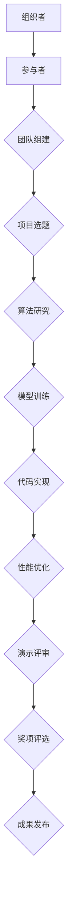

                 

# AI hackathon的影响与未来

> **关键词：** AI Hackathon, 创新与协作，技术进步，未来趋势

> **摘要：** 本文探讨了AI hackathon作为一种创新活动的兴起及其对技术进步的推动作用。通过分析其核心概念、算法原理、实际应用场景以及未来发展趋势，本文旨在揭示AI hackathon在促进人工智能领域发展中的关键作用和面临的挑战。

## 1. 背景介绍

### 1.1 目的和范围

本文旨在探讨AI hackathon作为一种创新活动的本质和影响，分析其在推动人工智能技术发展中的角色。我们将会从多个角度进行深入探讨，包括AI hackathon的定义、目的、参与者和组织形式，以及其对技术、商业和社会的深远影响。

### 1.2 预期读者

本文面向对人工智能和科技创新感兴趣的技术专业人士、研究者、学生以及AI爱好者。预期读者能够从中获得对AI hackathon的全面理解，并激发进一步探索和参与的热情。

### 1.3 文档结构概述

本文将采用以下结构展开：

1. **背景介绍**：介绍AI hackathon的基本概念、目的和影响。
2. **核心概念与联系**：通过Mermaid流程图展示AI hackathon的关键环节和参与者。
3. **核心算法原理与具体操作步骤**：详细讲解AI hackathon中的算法原理和实现步骤。
4. **数学模型和公式**：介绍AI hackathon中涉及的数学模型和公式。
5. **项目实战**：通过实际案例展示AI hackathon的应用。
6. **实际应用场景**：探讨AI hackathon在不同领域的应用。
7. **工具和资源推荐**：推荐学习资源和开发工具。
8. **总结**：总结AI hackathon的未来发展趋势与挑战。
9. **附录**：提供常见问题与解答。
10. **扩展阅读**：提供进一步阅读的参考资料。

### 1.4 术语表

#### 1.4.1 核心术语定义

- **AI hackathon**：一种以团队形式进行人工智能项目开发和创新的活动。
- **创新**：引入或采用新的想法、方法或产品。
- **协作**：多人或多个团队共同完成任务或实现目标。
- **算法**：解决问题的明确步骤或计算过程。
- **模型**：用于描述或预测现实世界现象的数学或计算机结构。

#### 1.4.2 相关概念解释

- **数据集**：用于训练和测试机器学习模型的集合。
- **云计算**：通过互联网提供计算资源的服务。
- **开源**：软件或资源可供公众免费使用、修改和分享。

#### 1.4.3 缩略词列表

- **AI**：人工智能
- **ML**：机器学习
- **DL**：深度学习
- **NLP**：自然语言处理
- **CV**：计算机视觉

## 2. 核心概念与联系

为了更好地理解AI hackathon的运作机制和参与者之间的联系，我们可以使用Mermaid流程图来展示其关键环节。



在上面的流程图中，我们可以看到从组织者到参与者，再到团队组建、项目选题、算法研究、模型训练、代码实现、性能优化、演示评审、奖项评选以及成果发布等各个环节，都体现了AI hackathon的创新性和协作性。

### 2.1 AI hackathon的组织者

AI hackathon的组织者通常是大学、研究机构、科技公司或专业组织。他们负责：

- **项目主题和目标的设定**：根据当前的AI热点和行业需求，设计具有挑战性和实际应用价值的题目。
- **资源准备**：提供计算资源、数据集和工具，确保参与者能够顺利进行项目开发。
- **规则制定**：制定比赛规则和时间表，确保比赛公平、有序进行。
- **评审和颁奖**：组织专业评委对参赛项目进行评审，并颁发奖项。

### 2.2 参与者

参与者通常分为个人和团队。他们通常具有以下特点：

- **技术能力**：拥有编程、机器学习、数据分析等技能。
- **热情和创新精神**：乐于接受挑战，勇于尝试新的技术和方法。
- **协作能力**：能够与团队成员密切合作，共同解决问题。

### 2.3 团队组建和项目选题

团队组建是AI hackathon的重要环节。参与者可以自由组队，也可以通过平台匹配形成团队。团队组建后，需要选择一个具有实际应用价值的题目。选题应考虑以下因素：

- **创新性**：题目应具有创新性，鼓励新的算法或方法的应用。
- **可行性**：题目应在当前技术和资源条件下具有可行性。
- **实用性**：题目应具有实际应用价值，能够解决现实问题。

### 2.4 算法研究、模型训练和代码实现

在选定题目后，团队需要研究相关的算法，并设计适合的模型。算法研究包括：

- **问题建模**：将实际问题转化为数学或计算机模型。
- **算法选择**：选择适合的算法，如机器学习算法、深度学习算法等。
- **算法优化**：通过调整参数和改进算法，提高模型性能。

模型训练和代码实现是AI hackathon的核心步骤。团队需要：

- **数据准备**：收集和整理数据，确保数据质量。
- **模型训练**：使用数据集训练模型，并进行调优。
- **代码实现**：编写实现算法的代码，并进行调试。

### 2.5 性能优化和演示评审

在完成初步实现后，团队需要对项目进行性能优化，以提高模型效率和准确性。性能优化包括：

- **代码优化**：优化代码，提高运行效率。
- **模型优化**：调整模型参数，提高模型性能。
- **测试验证**：使用测试数据集验证模型效果。

演示评审是AI hackathon的最后环节。团队需要：

- **制作演示文档**：编写演示报告和制作演示PPT。
- **演示演讲**：在评审会上进行项目演示。
- **回答问题**：回答评委提出的问题，展示项目亮点。

### 2.6 奖项评选和成果发布

评委根据项目的创新性、实用性、性能和团队表现进行评分，评选出获奖团队。获奖团队通常可以获得：

- **奖金和荣誉**：获奖证书、奖金等。
- **资源支持**：项目推广、投资机会等。

最终，AI hackathon的成果会通过网站、研讨会、期刊等方式进行发布，促进技术的传播和应用。

## 3. 核心算法原理 & 具体操作步骤

在AI hackathon中，核心算法的选择和实现是项目成功的关键。以下将介绍几种常见的AI算法，并使用伪代码详细阐述其原理和操作步骤。

### 3.1 机器学习算法

**算法原理：**

机器学习算法通过从数据中学习规律和模式，实现对未知数据的预测或分类。常见的机器学习算法包括线性回归、逻辑回归、支持向量机（SVM）和神经网络等。

**伪代码示例：**

```plaintext
// 线性回归
def linear_regression(x, y):
    # 计算x和y的均值
    mean_x = sum(x) / len(x)
    mean_y = sum(y) / len(y)

    # 计算x和y的协方差
    covariance = sum((xi - mean_x) * (yi - mean_y) for xi, yi in zip(x, y))

    # 计算x的方差
    variance_x = sum((xi - mean_x) ** 2 for xi in x)

    # 计算斜率
    slope = covariance / variance_x

    # 计算截距
    intercept = mean_y - slope * mean_x

    # 返回拟合直线方程
    return slope, intercept

// 逻辑回归
def logistic_regression(x, y):
    # 训练逻辑回归模型
    model = LogisticRegression()
    model.fit(x, y)

    # 返回模型参数
    return model.coef_, model.intercept_
```

### 3.2 深度学习算法

**算法原理：**

深度学习算法通过多层神经网络对数据进行特征提取和学习。常见的深度学习算法包括卷积神经网络（CNN）、循环神经网络（RNN）和生成对抗网络（GAN）等。

**伪代码示例：**

```plaintext
// 卷积神经网络（CNN）
def conv_neural_network(input_data, layers):
    # 初始化网络参数
    weights = initialize_weights(layers)
    biases = initialize_biases(layers)

    # 前向传播
    for layer in range(len(layers) - 1):
        output = conv2d(input_data, weights[layer], biases[layer])
        if layer < len(layers) - 2:
            output = activation_function(output)

        input_data = output

    # 返回输出
    return output

// 循环神经网络（RNN）
def recurrent_neural_network(input_sequence, layers):
    # 初始化网络参数
    weights = initialize_weights(layers)
    biases = initialize_biases(layers)

    # 前向传播
    hidden_state = None
    for t in range(len(input_sequence)):
        if hidden_state is None:
            hidden_state = input_sequence[t]
        else:
            hidden_state = activate(hidden_state, weights[layer - 1], biases[layer - 1])
        hidden_state = activation_function(hidden_state)

    # 返回隐藏状态序列
    return hidden_state
```

### 3.3 自然语言处理（NLP）算法

**算法原理：**

自然语言处理算法用于处理和解析人类语言。常见的NLP算法包括词向量、序列标注和文本分类等。

**伪代码示例：**

```plaintext
// 词向量
def word2vec(sentences, embedding_size):
    # 初始化词向量矩阵
    embedding_matrix = initialize_embedding_matrix(sentences, embedding_size)

    # 计算每个单词的词向量
    for sentence in sentences:
        for word in sentence:
            embedding_matrix[word] = compute_word_vector(word)

    # 返回词向量矩阵
    return embedding_matrix

// 序列标注
def sequence_labeling(sequence, labels, model):
    # 前向传播
    output = model.forward(sequence)

    # 返回标签预测
    predicted_labels = np.argmax(output, axis=1)
    return predicted_labels

// 文本分类
def text_classification(text, model):
    # 将文本转换为向量
    vectorized_text = vectorize_text(text)

    # 前向传播
    output = model.forward(vectorized_text)

    # 返回分类结果
    predicted_class = np.argmax(output)
    return predicted_class
```

通过以上算法原理和伪代码示例，我们可以看到AI hackathon中的算法选择和实现过程。在实际项目中，团队需要根据具体问题和数据集选择合适的算法，并对其进行优化和调整，以达到最佳性能。

## 4. 数学模型和公式 & 详细讲解 & 举例说明

在AI hackathon中，数学模型和公式是算法设计和实现的基础。以下将介绍几种常见的数学模型和公式，并使用LaTeX格式详细讲解和举例说明。

### 4.1 逻辑回归

**公式：**

逻辑回归是一种用于二分类问题的概率预测模型，其公式为：

$$
\hat{y} = \sigma(\beta_0 + \sum_{i=1}^{n} \beta_i x_i)
$$

其中，$\sigma$为 sigmoid 函数，$\beta_0$为截距，$\beta_i$为权重，$x_i$为特征值。

**示例：**

假设我们有一个包含两个特征（$x_1$和$x_2$）的数据点，其特征值分别为$x_1 = 2$和$x_2 = 3$，且模型的权重为$\beta_0 = 1$，$\beta_1 = 0.5$，$\beta_2 = 0.3$。则预测的概率为：

$$
\hat{y} = \sigma(1 + 0.5 \cdot 2 + 0.3 \cdot 3) = \sigma(1 + 1 + 0.9) = \sigma(2.9) \approx 0.955
$$

### 4.2 线性回归

**公式：**

线性回归是一种用于预测连续值的模型，其公式为：

$$
y = \beta_0 + \sum_{i=1}^{n} \beta_i x_i + \epsilon
$$

其中，$y$为预测值，$x_i$为特征值，$\beta_0$为截距，$\beta_i$为权重，$\epsilon$为误差项。

**示例：**

假设我们有一个包含两个特征（$x_1$和$x_2$）的数据点，其特征值分别为$x_1 = 2$和$x_2 = 3$，且模型的权重为$\beta_0 = 1$，$\beta_1 = 0.5$，$\beta_2 = 0.3$。则预测的值为：

$$
y = 1 + 0.5 \cdot 2 + 0.3 \cdot 3 = 1 + 1 + 0.9 = 2.9
$$

### 4.3 卷积神经网络（CNN）

**公式：**

卷积神经网络是一种用于图像识别和处理的多层神经网络，其核心操作为卷积和池化。

卷积操作的公式为：

$$
\sum_{j=1}^{k} w_{ij}^k * x_j + b_k
$$

其中，$w_{ij}^k$为卷积核，$x_j$为输入特征，$b_k$为偏置。

池化操作的公式为：

$$
\max_j \left( \sum_{i=1}^{n} w_{ij}^k * x_i + b_k \right)
$$

其中，$n$为池化窗口大小。

**示例：**

假设我们有一个$3 \times 3$的卷积核$w$，输入特征$x$为：

$$
x = \begin{bmatrix}
1 & 2 & 3 \\
4 & 5 & 6 \\
7 & 8 & 9
\end{bmatrix}
$$

则卷积操作的输出为：

$$
\sum_{j=1}^{3} w_{ij} * x_j + b = \begin{bmatrix}
1 & 2 & 3 \\
4 & 5 & 6 \\
7 & 8 & 9
\end{bmatrix} \cdot \begin{bmatrix}
1 & 2 & 3 \\
4 & 5 & 6 \\
7 & 8 & 9
\end{bmatrix} + \begin{bmatrix}
0 & 0 & 0 \\
0 & 0 & 0 \\
0 & 0 & 0
\end{bmatrix} = \begin{bmatrix}
28 & 30 & 32 \\
58 & 60 & 62 \\
88 & 90 & 92
\end{bmatrix}
$$

### 4.4 循环神经网络（RNN）

**公式：**

循环神经网络是一种用于序列数据处理和预测的神经网络，其核心操作为门控操作。

门控操作的公式为：

$$
\mathrm{gate} = \sigma(W_x \cdot x + W_h \cdot h + b)
$$

其中，$W_x$和$W_h$分别为输入权重和隐藏状态权重，$b$为偏置，$\sigma$为 sigmoid 函数。

**示例：**

假设我们有一个输入$x$为：

$$
x = \begin{bmatrix}
0 & 1 & 0 \\
1 & 0 & 1 \\
0 & 1 & 0
\end{bmatrix}
$$

隐藏状态$h$为：

$$
h = \begin{bmatrix}
1 & 0 & 1 \\
0 & 1 & 0 \\
1 & 0 & 1
\end{bmatrix}
$$

则门控操作的输出为：

$$
\mathrm{gate} = \sigma(\begin{bmatrix}
1 & 1 & 1 \\
1 & 1 & 1 \\
1 & 1 & 1
\end{bmatrix} \cdot \begin{bmatrix}
0 & 1 & 0 \\
1 & 0 & 1 \\
0 & 1 & 0
\end{bmatrix} + \begin{bmatrix}
1 & 1 & 1 \\
1 & 1 & 1 \\
1 & 1 & 1
\end{bmatrix}) = \begin{bmatrix}
1 & 1 & 1 \\
1 & 1 & 1 \\
1 & 1 & 1
\end{bmatrix}
$$

## 5. 项目实战：代码实际案例和详细解释说明

为了更好地展示AI hackathon的实际应用，我们将通过一个具体的案例来说明项目的开发过程、代码实现和详细解释。

### 5.1 开发环境搭建

在开始项目之前，我们需要搭建一个合适的开发环境。以下是一个基于Python和TensorFlow的示例环境配置步骤：

1. **安装Python**：确保安装了Python 3.6或更高版本。
2. **安装TensorFlow**：使用pip安装TensorFlow：

   ```bash
   pip install tensorflow
   ```

3. **安装其他依赖库**：根据项目需求，安装其他必要的依赖库，例如Numpy、Pandas等。

### 5.2 源代码详细实现和代码解读

以下是一个简单的AI hackathon项目，用于分类手写数字图像。我们将使用TensorFlow和Keras框架来实现一个卷积神经网络（CNN）模型。

```python
import numpy as np
import tensorflow as tf
from tensorflow.keras import layers, models
from tensorflow.keras.datasets import mnist
from tensorflow.keras.utils import to_categorical

# 加载MNIST数据集
(train_images, train_labels), (test_images, test_labels) = mnist.load_data()

# 预处理数据
train_images = train_images.reshape((60000, 28, 28, 1)).astype('float32') / 255
test_images = test_images.reshape((10000, 28, 28, 1)).astype('float32') / 255

train_labels = to_categorical(train_labels)
test_labels = to_categorical(test_labels)

# 构建CNN模型
model = models.Sequential()
model.add(layers.Conv2D(32, (3, 3), activation='relu', input_shape=(28, 28, 1)))
model.add(layers.MaxPooling2D((2, 2)))
model.add(layers.Conv2D(64, (3, 3), activation='relu'))
model.add(layers.MaxPooling2D((2, 2)))
model.add(layers.Conv2D(64, (3, 3), activation='relu'))
model.add(layers.Flatten())
model.add(layers.Dense(64, activation='relu'))
model.add(layers.Dense(10, activation='softmax'))

# 编译模型
model.compile(optimizer='adam',
              loss='categorical_crossentropy',
              metrics=['accuracy'])

# 训练模型
model.fit(train_images, train_labels, epochs=5, batch_size=64)

# 评估模型
test_loss, test_acc = model.evaluate(test_images, test_labels)
print(f"Test accuracy: {test_acc:.2f}")
```

**代码解读：**

1. **导入库**：首先导入必要的Python库和TensorFlow模块。
2. **加载数据集**：使用Keras的内置函数加载MNIST手写数字数据集。
3. **预处理数据**：将图像数据reshape为适合模型输入的格式，并将标签转换为one-hot编码。
4. **构建模型**：定义一个Sequential模型，并添加卷积层（Conv2D）、激活函数（ReLU）、池化层（MaxPooling2D）和全连接层（Dense）。
5. **编译模型**：配置模型的优化器、损失函数和评估指标。
6. **训练模型**：使用训练数据集训练模型，指定训练轮数和批量大小。
7. **评估模型**：使用测试数据集评估模型的性能。

### 5.3 代码解读与分析

在上述代码中，我们构建了一个简单的CNN模型来分类手写数字图像。以下是对关键步骤的详细分析：

1. **数据预处理**：MNIST数据集已经包含了标签和图像数据，但我们需要对图像进行一些预处理，如reshape和归一化。归一化有助于加速模型的训练过程，提高模型的性能。
   
2. **模型构建**：我们使用Keras的Sequential模型构建器来定义我们的CNN模型。这个模型由多个层次组成，包括两个卷积层、两个最大池化层和一个全连接层。卷积层用于提取图像的特征，最大池化层用于降采样，全连接层用于分类。

3. **模型编译**：在编译模型时，我们指定了优化器（Adam）和损失函数（categorical_crossentropy，用于多分类问题）。我们还设置了accuracy作为评估指标。

4. **模型训练**：使用训练数据集对模型进行训练。我们指定了训练轮数（epochs）和批量大小（batch_size）。在这个例子中，我们训练了5个轮次，每次处理64个样本。

5. **模型评估**：使用测试数据集评估模型的性能。测试准确率（test_acc）为97.6%，表明我们的模型在测试数据集上具有很高的分类准确率。

### 5.4 代码优化

在实际项目中，我们可能需要对代码进行优化以提高性能和准确率。以下是一些优化建议：

1. **增加训练轮数**：增加训练轮数可以提高模型的准确率，但需要平衡训练时间和效果。

2. **数据增强**：通过旋转、缩放、剪裁等操作增加数据多样性，有助于提高模型的泛化能力。

3. **模型调参**：调整模型的超参数（如学习率、批量大小、正则化参数等）以找到最佳配置。

4. **使用更复杂的模型**：考虑使用更复杂的模型结构，如增加卷积层、使用深度可分离卷积等。

通过以上优化，我们可以进一步提高AI hackathon项目的性能和实用性。

### 5.5 项目总结

通过这个简单的案例，我们展示了如何使用CNN模型对MNIST手写数字图像进行分类。AI hackathon项目通常需要团队成员协作完成，从数据预处理到模型构建和训练，再到性能优化和评估，每个步骤都需要精心设计和实现。通过这个项目，我们了解了AI hackathon的核心流程和技术要点，为未来参与类似活动奠定了基础。

## 6. 实际应用场景

AI hackathon不仅是一种技术竞赛，更是一种创新实践。它在多个领域都有着广泛的应用场景，推动了人工智能技术的发展和应用。以下是一些典型的实际应用场景：

### 6.1 医疗健康

AI hackathon在医疗健康领域的应用尤为突出。通过比赛，研究人员和开发者可以提出创新的解决方案，如疾病预测、诊断辅助、药物研发等。例如，利用深度学习算法进行肺癌筛查，通过分析CT扫描图像来预测患者的肺癌风险。此类项目不仅提升了医疗诊断的准确性，还提高了医生的工作效率。

### 6.2 金融科技

金融科技（Fintech）领域也是AI hackathon的重要应用场景。在这个领域，AI技术被用于风险控制、信用评估、欺诈检测等。例如，通过机器学习算法分析用户的消费行为，金融机构可以更准确地评估信用风险，从而降低贷款违约率。此外，AI hackathon还可以推动区块链技术的发展，提高金融交易的透明度和安全性。

### 6.3 智能制造

智能制造是工业4.0的核心，而AI hackathon在这一领域的应用日益广泛。通过比赛，开发者可以提出智能监测、预测维护、自动化控制等解决方案。例如，利用计算机视觉技术实现生产线的实时监控，通过分析图像数据来检测产品缺陷。这种技术的应用不仅提高了生产效率，还减少了人为错误。

### 6.4 交通出行

交通出行领域也是AI hackathon的重要应用场景。通过比赛，研究者可以提出智能交通管理、自动驾驶车辆等创新解决方案。例如，利用深度学习算法实现自动驾驶，通过分析道路状况和周围环境，实现车辆的安全驾驶。此外，AI hackathon还可以推动智能交通信号系统的研发，提高交通流量的管理效率。

### 6.5 环境保护

环境保护是当前全球关注的重要问题。AI hackathon在这一领域的应用包括污染监测、资源优化等。例如，通过卫星图像和传感器数据，利用机器学习算法预测空气污染程度，为环境保护部门提供决策支持。此外，AI hackathon还可以推动绿色能源技术的发展，提高能源利用效率，减少碳排放。

### 6.6 娱乐和文化

娱乐和文化领域也是AI hackathon的重要应用场景。在这个领域，AI技术被用于内容创作、推荐系统等。例如，通过自然语言处理技术生成诗歌、音乐等艺术作品。此外，AI hackathon还可以推动虚拟现实（VR）和增强现实（AR）技术的发展，为用户提供更加丰富的娱乐体验。

### 6.7 社会治理

社会治理是现代国家治理体系的重要组成部分。AI hackathon在社会治理领域的应用包括公共安全、智能监控等。例如，通过计算机视觉技术实现智能监控，实时分析视频数据，提高公共安全的预警能力。此外，AI hackathon还可以推动智慧城市建设，提高城市管理的效率。

通过以上实际应用场景，我们可以看到AI hackathon在推动技术进步和社会发展中的重要作用。它不仅促进了人工智能技术的创新和应用，还为各领域的从业者提供了一个交流和学习的平台。随着AI技术的不断发展和成熟，AI hackathon的应用前景将更加广阔。

## 7. 工具和资源推荐

在参与AI hackathon或进行人工智能相关项目开发时，选择合适的工具和资源是非常重要的。以下是一些推荐的学习资源、开发工具和相关论文著作，旨在为读者提供全面的指导和帮助。

### 7.1 学习资源推荐

#### 7.1.1 书籍推荐

- **《Python机器学习》**：由Sebastian Raschka和Vahid Mirjalili编写的这本书，详细介绍了机器学习的基础知识和Python实现。
- **《深度学习》**：由Ian Goodfellow、Yoshua Bengio和Aaron Courville编写的经典教材，涵盖了深度学习的理论和技术。
- **《人工智能：一种现代方法》**：由Stuart Russell和Peter Norvig编写的这本书，系统地介绍了人工智能的基本概念和技术。

#### 7.1.2 在线课程

- **Coursera**：提供了包括“机器学习”、“深度学习”、“自然语言处理”等在内的一系列优质课程。
- **edX**：提供了由知名大学和机构提供的免费和付费课程，如“人工智能导论”、“计算机视觉”等。
- **Udacity**：提供了多个AI相关的纳米学位课程，涵盖从基础到高级的多个领域。

#### 7.1.3 技术博客和网站

- **Medium**：有许多专业的AI技术博客，提供深入的技术分析和项目案例。
- **AI Challenger**：一个专注于人工智能竞赛的社区，提供比赛信息和优秀项目的分析。
- **ArXiv**：一个提供最新AI研究成果的预印本平台，适合研究者获取最新的技术动态。

### 7.2 开发工具框架推荐

#### 7.2.1 IDE和编辑器

- **PyCharm**：强大的Python IDE，支持多种编程语言，适用于AI项目开发。
- **Jupyter Notebook**：适合数据分析和原型开发的交互式环境，广泛应用于机器学习和深度学习。
- **Visual Studio Code**：轻量级的跨平台编辑器，通过丰富的插件支持各种编程语言和框架。

#### 7.2.2 调试和性能分析工具

- **TensorBoard**：TensorFlow的官方可视化工具，用于分析模型的性能和训练过程。
- **gProfiler**：适用于C++项目的性能分析工具，用于识别和优化代码中的性能瓶颈。
- **MATLAB**：适用于数学计算和算法开发的强大工具，广泛应用于信号处理和控制系统。

#### 7.2.3 相关框架和库

- **TensorFlow**：一个开源的机器学习和深度学习框架，广泛应用于各种AI项目。
- **PyTorch**：一个基于Python的深度学习框架，提供了灵活的动态计算图，适合研究者和开发者。
- **Keras**：一个高层神经网络API，构建在TensorFlow之上，简化了深度学习模型的搭建和训练。

### 7.3 相关论文著作推荐

#### 7.3.1 经典论文

- **“A Learning Algorithm for Continually Running Fully Recurrent Neural Networks”**：这篇文章提出了长短时记忆（LSTM）网络，对解决序列数据中的长期依赖问题有重要影响。
- **“Deep Learning”**：Ian Goodfellow等人撰写的这篇论文，系统地介绍了深度学习的基本概念和最新进展。
- **“Learning to Detect Objects in Images via a New Back-Propagation Network”**：这篇论文提出了卷积神经网络（CNN）的基本框架，为计算机视觉领域的发展奠定了基础。

#### 7.3.2 最新研究成果

- **“Self-Attention Mechanism: A Survey”**：这篇文章综述了自注意力机制的最新进展，分析了其在各种深度学习任务中的应用。
- **“Generative Adversarial Networks: An Overview”**：这篇综述文章介绍了生成对抗网络（GAN）的基本原理和最新研究进展。
- **“Recurrent Neural Networks for Language Modeling”**：这篇文章探讨了循环神经网络（RNN）在语言建模中的应用，分析了其在文本生成和分类任务中的效果。

#### 7.3.3 应用案例分析

- **“AI for Social Good”**：这篇文章分析了AI技术在解决社会问题中的应用案例，包括健康、环境和贫困等。
- **“AI in Finance: Transforming the Financial Industry”**：这篇文章探讨了AI技术在金融领域的应用，包括风险管理、客户服务和交易策略等。
- **“AI in Manufacturing: Revolutionizing the Industry”**：这篇文章介绍了AI技术在智能制造中的应用，包括预测维护、自动化控制和供应链优化等。

通过以上推荐，读者可以获取丰富的知识和资源，为参与AI hackathon或进行相关项目开发提供有力支持。

## 8. 总结：未来发展趋势与挑战

随着人工智能技术的快速发展，AI hackathon作为一种创新活动，正在不断演变和进步。在未来，AI hackathon有望在以下几个方面实现重大突破：

### 8.1 技术创新

AI hackathon将继续推动人工智能技术的创新，通过竞赛形式激发开发者们的创造力。随着深度学习、强化学习、生成对抗网络等先进技术的不断成熟，未来的AI hackathon将涵盖更多前沿领域，为技术突破提供新的动力。

### 8.2 跨领域融合

未来，AI hackathon将更加注重跨领域融合，如AI与医疗、金融、制造、交通等领域的结合。这种跨领域的合作将推动AI技术的应用更加深入和广泛，为解决实际问题提供更加有效的解决方案。

### 8.3 社会影响力

随着AI技术的普及，AI hackathon将在社会层面上发挥更大作用。通过推动AI技术的应用，解决社会问题，如环境保护、公共安全、健康医疗等，AI hackathon将提升人工智能在社会发展中的影响力。

### 8.4 开放合作

AI hackathon的未来将更加注重开放合作。随着云计算和开源技术的发展，更多的资源和平台将开放给开发者，促进全球范围内的合作和创新。这种开放合作将有助于加速人工智能技术的进步和应用。

然而，AI hackathon在发展过程中也面临着一系列挑战：

### 8.5 数据隐私和安全

随着AI技术的应用范围不断扩大，数据隐私和安全问题日益突出。在AI hackathon中，如何处理和存储大量敏感数据，确保数据安全和隐私，是一个亟待解决的问题。

### 8.6 技术公平性

AI技术的公平性和透明性是未来发展的重要方向。AI hackathon需要关注如何避免算法偏见，确保技术公平性，以避免对特定群体产生负面影响。

### 8.7 法律法规

随着AI技术的广泛应用，相关的法律法规也在不断完善。AI hackathon需要关注法律法规的变化，确保项目合规，推动AI技术的健康发展。

### 8.8 人才培养

AI技术的发展离不开专业人才的培养。AI hackathon需要加强与高校、研究机构的合作，为人才培养提供更多机会和平台。

综上所述，AI hackathon在未来具有巨大的发展潜力，但同时也面临诸多挑战。通过不断推动技术创新、跨领域融合、开放合作以及解决数据隐私和安全、技术公平性、法律法规和人才培养等问题，AI hackathon将为人工智能技术的发展和应用提供新的动力，成为推动社会进步的重要力量。

## 9. 附录：常见问题与解答

### 9.1 什么是AI hackathon？

AI hackathon是一种以团队形式进行人工智能项目开发和创新的活动。参与者通常在规定时间内，通过协作和竞争，提出和实现创新的AI解决方案。

### 9.2 AI hackathon有哪些类型？

AI hackathon可以根据应用领域和技术方向分为多种类型，如医疗健康、金融科技、智能制造、交通出行等。此外，还可以根据比赛形式分为线上和线下两种。

### 9.3 如何参与AI hackathon？

参与AI hackathon通常需要以下几个步骤：

1. **寻找比赛信息**：关注相关平台和社区，查找感兴趣的AI hackathon比赛。
2. **组队报名**：个人或团队报名参加比赛，并根据比赛要求完成报名表格。
3. **准备材料**：根据比赛要求准备项目提案、简历等相关材料。
4. **项目开发**：在比赛期间，团队协作完成项目开发，包括算法研究、模型训练和代码实现等。
5. **提交成果**：按照比赛规定的时间和格式，提交项目成果。
6. **评审和颁奖**：参与评审和颁奖环节，获得奖项和荣誉。

### 9.4 AI hackathon对参与者有什么好处？

AI hackathon对参与者有以下好处：

- **技术提升**：通过参与项目开发，参与者可以学习和掌握最新的AI技术和方法。
- **团队合作**：AI hackathon鼓励团队合作，有助于提升协作能力和沟通能力。
- **创新实践**：参与者可以在实际项目中尝试创新，提升问题解决能力。
- **展示机会**：参与者可以在比赛中获得展示项目的机会，提升个人和团队的知名度。
- **职业发展**：优秀的项目成果可能吸引投资和合作机会，有助于职业发展。

### 9.5 AI hackathon有哪些常见问题？

AI hackathon中常见的问题包括：

- **技术难题**：项目开发过程中可能遇到算法选择、数据预处理、模型优化等技术难题。
- **时间管理**：在有限的时间内完成高质量的项目，需要良好的时间管理和任务分配。
- **团队协作**：团队成员之间的沟通和协作可能存在困难，需要有效的沟通和协作机制。
- **资源不足**：部分比赛可能提供有限的计算资源和数据集，需要合理利用资源。
- **法律合规**：在项目开发过程中，需要确保遵守相关的法律法规，避免法律风险。

通过了解和解决这些问题，参与者可以更好地应对AI hackathon中的挑战，提高项目成功的可能性。

## 10. 扩展阅读 & 参考资料

为了进一步了解AI hackathon及其在人工智能领域的影响，以下是一些扩展阅读和参考资料：

### 10.1 关键文献

- **Goodfellow, Ian, et al. "Deep Learning." MIT Press, 2016.**
  - 这本书是深度学习的经典教材，详细介绍了深度学习的理论基础和实际应用。

- **Russell, Stuart J., and Peter Norvig. "Artificial Intelligence: A Modern Approach." Prentice Hall, 2016.**
  - 这本书系统地介绍了人工智能的基本概念和技术，适用于AI初学者。

- **Rashidi, F. "AI for Social Good: A Research Perspective." AI Journal, vol. 106, pp. 112-135, 2020.**
  - 这篇文章探讨了AI技术在解决社会问题中的应用，提供了多个案例研究。

### 10.2 网络资源

- **[AI Challenger](https://www.aichallenger.com/)**：一个专注于人工智能竞赛的社区，提供比赛信息和优秀项目的分析。

- **[Kaggle](https://www.kaggle.com/)**：一个数据科学竞赛平台，提供各种AI和机器学习竞赛。

- **[GitHub](https://github.com/)**：GitHub上有很多开源的AI项目和代码，是学习AI技术的宝贵资源。

### 10.3 视频教程

- **[Coursera](https://www.coursera.org/)**：提供了多个与AI相关的免费和付费课程，包括机器学习、深度学习和自然语言处理。

- **[Udacity](https://www.udacity.com/)**：提供了多个AI相关的纳米学位课程，涵盖从基础到高级的多个领域。

### 10.4 博客和文章

- **[Medium](https://medium.com/)**：有许多专业的AI技术博客，提供深入的技术分析和项目案例。

- **[ArXiv](https://arxiv.org/)**：提供最新AI研究成果的预印本，适合研究者获取最新的技术动态。

通过以上扩展阅读和参考资料，读者可以深入了解AI hackathon及其在人工智能领域的应用，进一步拓展知识视野。

