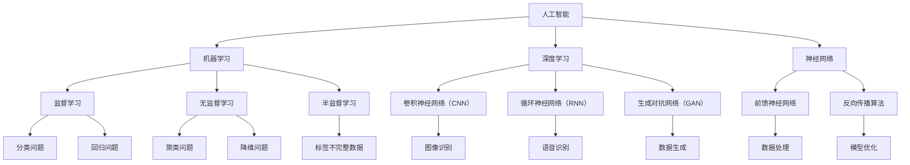

                 

# AI 与未来社会：构建更加智能的未来

> **关键词：**人工智能、社会变革、智能技术、未来趋势、人类发展
>
> **摘要：**本文将深入探讨人工智能在塑造未来社会中的重要作用，通过梳理核心概念、解析算法原理、构建数学模型以及实际应用案例，分析AI如何改变我们的生活方式、工作模式以及社会结构。同时，文章还将展望AI技术的发展趋势与面临的挑战，为读者提供全面而深入的思考。

## 1. 背景介绍

### 1.1 目的和范围

本文旨在探讨人工智能（AI）如何在未来社会中发挥重要作用，以及如何构建一个更加智能的未来。我们将从以下几个方面展开讨论：

1. **核心概念与联系**：介绍AI的基本原理、关键技术和应用领域。
2. **核心算法原理**：讲解AI的核心算法，包括机器学习、深度学习和神经网络等。
3. **数学模型和公式**：探讨AI中使用的数学模型和公式，以及如何应用它们解决实际问题。
4. **项目实战**：通过实际代码案例，展示AI技术在现实中的应用。
5. **实际应用场景**：分析AI在各个行业和领域的应用，以及对社会的影响。
6. **未来发展趋势与挑战**：展望AI技术的发展趋势，探讨面临的伦理、法律和隐私等问题。

### 1.2 预期读者

本文适合对人工智能有兴趣的读者，包括但不限于：

1. **人工智能研究者**：希望了解AI技术原理和应用的研究人员。
2. **软件开发人员**：希望将AI技术应用于实际项目的开发者。
3. **技术爱好者**：对AI技术感兴趣，希望了解其潜力的普通读者。
4. **政策制定者**：关注AI技术对经济、社会和伦理的影响的决策者。

### 1.3 文档结构概述

本文分为以下十个部分：

1. **背景介绍**：介绍文章的目的、范围和结构。
2. **核心概念与联系**：梳理AI的基本原理和关键概念。
3. **核心算法原理**：讲解AI的核心算法原理和具体操作步骤。
4. **数学模型和公式**：探讨AI中使用的数学模型和公式。
5. **项目实战**：通过实际案例展示AI的应用。
6. **实际应用场景**：分析AI在各领域的应用。
7. **工具和资源推荐**：推荐学习资源和开发工具。
8. **总结**：总结AI技术的发展趋势与挑战。
9. **附录**：常见问题与解答。
10. **扩展阅读**：提供进一步阅读的参考资料。

### 1.4 术语表

#### 1.4.1 核心术语定义

- **人工智能（AI）**：指模拟人类智能行为的计算机系统，具有感知、学习、推理和解决问题的能力。
- **机器学习（ML）**：一种AI技术，通过数据驱动的方式使计算机从数据中学习，并改进其性能。
- **深度学习（DL）**：一种特殊的机器学习技术，使用多层神经网络进行模型训练和推理。
- **神经网络（NN）**：一种基于生物神经元的计算模型，用于模拟人类大脑的信息处理方式。
- **自然语言处理（NLP）**：一种AI技术，使计算机能够理解和生成人类自然语言。

#### 1.4.2 相关概念解释

- **数据挖掘**：从大量数据中提取有价值信息的过程。
- **深度学习框架**：用于构建和训练深度学习模型的软件库，如TensorFlow、PyTorch等。
- **迁移学习**：将已有模型的知识应用于新任务，提高模型性能的过程。
- **强化学习**：一种机器学习技术，通过奖励和惩罚机制，使模型在环境中学习和决策。

#### 1.4.3 缩略词列表

- **AI**：人工智能（Artificial Intelligence）
- **ML**：机器学习（Machine Learning）
- **DL**：深度学习（Deep Learning）
- **NLP**：自然语言处理（Natural Language Processing）
- **DLF**：深度学习框架（Deep Learning Framework）

## 2. 核心概念与联系

为了更好地理解人工智能及其在未来社会中的作用，我们需要首先梳理其核心概念和联系。下面是一个简化的Mermaid流程图，展示了AI技术的基本架构和关键组成部分。



### 2.1 核心概念解析

在本节中，我们将对上述流程图中的核心概念进行详细解析。

#### 2.1.1 人工智能（AI）

人工智能是指通过计算机系统模拟人类智能行为的科学技术。它涉及多个学科，包括计算机科学、数学、心理学和认知科学等。AI的目标是使计算机具有感知、理解、推理和解决问题的能力，以实现智能化应用。

#### 2.1.2 机器学习（ML）

机器学习是人工智能的一个子领域，它使计算机从数据中学习，并改进其性能。机器学习可以分为三种类型：监督学习、无监督学习和半监督学习。

- **监督学习**：有标记数据，模型通过学习输入和输出之间的关系进行预测。
- **无监督学习**：无标记数据，模型通过探索数据内在结构和规律进行学习。
- **半监督学习**：部分标记数据，模型结合有标记和无标记数据学习。

#### 2.1.3 深度学习（DL）

深度学习是一种特殊的机器学习技术，使用多层神经网络进行模型训练和推理。深度学习在图像识别、语音识别、自然语言处理等领域取得了显著成果。

#### 2.1.4 神经网络（NN）

神经网络是一种基于生物神经元的计算模型，用于模拟人类大脑的信息处理方式。神经网络由多个层组成，包括输入层、隐藏层和输出层。通过调整神经元之间的权重，神经网络可以学习和识别数据模式。

#### 2.1.5 自然语言处理（NLP）

自然语言处理是一种人工智能技术，使计算机能够理解和生成人类自然语言。NLP在文本分类、情感分析、机器翻译等领域有广泛应用。

### 2.2 关系与联系

从上述解析中，我们可以看到AI技术之间存在着紧密的联系和相互作用。

- **机器学习与深度学习**：深度学习是机器学习的一种方法，它通过多层神经网络学习数据表示。
- **神经网络与机器学习**：神经网络是机器学习的基础模型，用于学习数据特征和关系。
- **自然语言处理与机器学习**：自然语言处理利用机器学习技术处理和生成文本数据。

这些概念和技术的相互结合，使得人工智能能够应用于各种领域，推动社会发展和变革。

## 3. 核心算法原理 & 具体操作步骤

在本节中，我们将深入探讨人工智能的核心算法原理，并详细阐述其具体操作步骤。

### 3.1 机器学习（ML）算法原理

机器学习是一种使计算机从数据中学习的方法，其基本原理是构建一个模型，通过输入和输出之间的关联来预测未知数据。以下是机器学习算法的基本步骤：

#### 3.1.1 数据预处理

在训练模型之前，需要对数据进行预处理，包括数据清洗、归一化和特征提取等。这些步骤有助于提高模型的性能和准确性。

```python
# 数据清洗
data = clean_data(data)

# 数据归一化
normalized_data = normalize_data(data)

# 特征提取
features = extract_features(normalized_data)
```

#### 3.1.2 模型选择

根据问题的类型和特性，选择合适的机器学习模型。常见的模型包括线性回归、逻辑回归、决策树、随机森林、支持向量机等。

```python
# 选择模型
model = LinearRegression()  # 线性回归模型
```

#### 3.1.3 模型训练

使用训练数据对模型进行训练，调整模型参数，使其能够正确预测未知数据。

```python
# 模型训练
model.fit(features_train, labels_train)
```

#### 3.1.4 模型评估

使用测试数据评估模型性能，常见的评估指标包括准确率、召回率、F1值等。

```python
# 模型评估
accuracy = model.score(features_test, labels_test)
print("Accuracy:", accuracy)
```

#### 3.1.5 模型优化

根据评估结果，调整模型参数或选择更合适的模型，以提高性能。

```python
# 模型优化
model = RandomForestClassifier()  # 选择随机森林模型
model.fit(features_train, labels_train)
accuracy = model.score(features_test, labels_test)
print("Accuracy:", accuracy)
```

### 3.2 深度学习（DL）算法原理

深度学习是机器学习的一种方法，它通过多层神经网络学习数据表示。以下是深度学习算法的基本步骤：

#### 3.2.1 数据预处理

与机器学习类似，深度学习也需要对数据进行预处理，包括数据清洗、归一化和特征提取等。

```python
# 数据清洗
data = clean_data(data)

# 数据归一化
normalized_data = normalize_data(data)

# 特征提取
features = extract_features(normalized_data)
```

#### 3.2.2 神经网络架构设计

设计深度学习模型的神经网络架构，包括输入层、隐藏层和输出层。根据问题类型，选择合适的网络结构和激活函数。

```python
# 构建神经网络模型
model = Sequential()
model.add(Dense(64, input_shape=(input_shape,), activation='relu'))
model.add(Dense(64, activation='relu'))
model.add(Dense(num_classes, activation='softmax'))
```

#### 3.2.3 模型训练

使用训练数据对神经网络模型进行训练，调整模型参数，使其能够正确预测未知数据。

```python
# 模型训练
model.compile(optimizer='adam', loss='categorical_crossentropy', metrics=['accuracy'])
model.fit(features_train, labels_train, epochs=10, batch_size=32)
```

#### 3.2.4 模型评估

使用测试数据评估模型性能，常见的评估指标包括准确率、召回率、F1值等。

```python
# 模型评估
accuracy = model.evaluate(features_test, labels_test)[1]
print("Accuracy:", accuracy)
```

#### 3.2.5 模型优化

根据评估结果，调整模型参数或选择更合适的网络结构，以提高性能。

```python
# 模型优化
model.compile(optimizer='adam', loss='categorical_crossentropy', metrics=['accuracy'])
model.fit(features_train, labels_train, epochs=10, batch_size=32)
accuracy = model.evaluate(features_test, labels_test)[1]
print("Accuracy:", accuracy)
```

### 3.3 神经网络（NN）算法原理

神经网络是一种基于生物神经元的计算模型，用于模拟人类大脑的信息处理方式。以下是神经网络算法的基本步骤：

#### 3.3.1 神经网络架构设计

设计神经网络模型，包括输入层、隐藏层和输出层。根据问题类型，选择合适的网络结构和激活函数。

```python
# 构建神经网络模型
model = Sequential()
model.add(Dense(64, input_shape=(input_shape,), activation='relu'))
model.add(Dense(64, activation='relu'))
model.add(Dense(num_classes, activation='softmax'))
```

#### 3.3.2 前向传播

在前向传播过程中，神经网络将输入数据传递到输出层，并计算每个神经元的输出值。

```python
# 前向传播
inputs = preprocess_data(input_data)
outputs = model.predict(inputs)
```

#### 3.3.3 反向传播

在反向传播过程中，神经网络根据输出结果与实际标签之间的误差，调整模型参数，优化模型性能。

```python
# 反向传播
deltas = compute_gradients(outputs, labels)
update_model_params(model, deltas)
```

#### 3.3.4 模型训练

使用训练数据对神经网络模型进行训练，调整模型参数，使其能够正确预测未知数据。

```python
# 模型训练
model.compile(optimizer='adam', loss='categorical_crossentropy', metrics=['accuracy'])
model.fit(features_train, labels_train, epochs=10, batch_size=32)
```

#### 3.3.5 模型评估

使用测试数据评估模型性能，常见的评估指标包括准确率、召回率、F1值等。

```python
# 模型评估
accuracy = model.evaluate(features_test, labels_test)[1]
print("Accuracy:", accuracy)
```

#### 3.3.6 模型优化

根据评估结果，调整模型参数或选择更合适的网络结构，以提高性能。

```python
# 模型优化
model.compile(optimizer='adam', loss='categorical_crossentropy', metrics=['accuracy'])
model.fit(features_train, labels_train, epochs=10, batch_size=32)
accuracy = model.evaluate(features_test, labels_test)[1]
print("Accuracy:", accuracy)
```

通过以上步骤，我们可以构建并训练一个神经网络模型，用于解决各种问题。深度学习和神经网络作为人工智能的核心算法，在图像识别、语音识别、自然语言处理等领域取得了显著成果，为构建更加智能的未来奠定了基础。

## 4. 数学模型和公式 & 详细讲解 & 举例说明

在本节中，我们将探讨人工智能（AI）中使用的数学模型和公式，并通过具体例子详细讲解这些模型的应用和计算过程。

### 4.1 机器学习中的线性回归模型

线性回归是一种常用的机器学习算法，用于预测连续值输出。其基本公式如下：

\[ y = \beta_0 + \beta_1 \cdot x \]

其中，\( y \) 是预测值，\( x \) 是输入特征，\( \beta_0 \) 和 \( \beta_1 \) 是模型参数。

#### 4.1.1 模型参数计算

为了计算模型参数，我们需要使用最小二乘法，即通过最小化预测值与实际值之间的误差平方和。具体步骤如下：

1. **计算输入特征和预测值的平均值**：

   \[ \bar{x} = \frac{1}{n} \sum_{i=1}^{n} x_i \]
   \[ \bar{y} = \frac{1}{n} \sum_{i=1}^{n} y_i \]

2. **计算输入特征和预测值的协方差**：

   \[ \sigma_{xy} = \frac{1}{n} \sum_{i=1}^{n} (x_i - \bar{x})(y_i - \bar{y}) \]

3. **计算输入特征的方差**：

   \[ \sigma_{x}^2 = \frac{1}{n} \sum_{i=1}^{n} (x_i - \bar{x})^2 \]

4. **计算模型参数**：

   \[ \beta_1 = \frac{\sigma_{xy}}{\sigma_{x}^2} \]
   \[ \beta_0 = \bar{y} - \beta_1 \cdot \bar{x} \]

#### 4.1.2 例子说明

假设我们有一个简单的线性回归模型，输入特征为 \( x \)，预测值为 \( y \)，数据如下：

\[ \begin{array}{c|c}
x & y \\
\hline
1 & 2 \\
2 & 4 \\
3 & 6 \\
4 & 8 \\
\end{array} \]

根据上述步骤，我们可以计算模型参数：

1. **计算平均值**：

   \[ \bar{x} = \frac{1 + 2 + 3 + 4}{4} = 2.5 \]
   \[ \bar{y} = \frac{2 + 4 + 6 + 8}{4} = 5 \]

2. **计算协方差和方差**：

   \[ \sigma_{xy} = \frac{1}{4} \left[ (1 - 2.5)(2 - 5) + (2 - 2.5)(4 - 5) + (3 - 2.5)(6 - 5) + (4 - 2.5)(8 - 5) \right] = 7 \]
   \[ \sigma_{x}^2 = \frac{1}{4} \left[ (1 - 2.5)^2 + (2 - 2.5)^2 + (3 - 2.5)^2 + (4 - 2.5)^2 \right] = 1.25 \]

3. **计算模型参数**：

   \[ \beta_1 = \frac{7}{1.25} = 5.6 \]
   \[ \beta_0 = 5 - 5.6 \cdot 2.5 = -3 \]

因此，线性回归模型的公式为 \( y = -3 + 5.6 \cdot x \)。

### 4.2 深度学习中的反向传播算法

反向传播算法是深度学习模型训练的核心算法，用于计算模型参数的梯度，并优化模型性能。其基本公式如下：

\[ \delta_w = \frac{\partial L}{\partial w} \]

其中，\( \delta_w \) 是模型参数 \( w \) 的梯度，\( L \) 是损失函数。

#### 4.2.1 梯度计算

反向传播算法通过多层神经网络，从输出层反向传播误差，计算每个神经元的梯度。具体步骤如下：

1. **计算输出层误差**：

   \[ \delta_{out} = \frac{\partial L}{\partial a_{out}} \]

2. **计算隐藏层误差**：

   \[ \delta_{h} = \delta_{out} \cdot \sigma'(a_{h}) \cdot W \]

3. **计算输入层误差**：

   \[ \delta_{in} = \delta_{h} \cdot \sigma'(a_{in}) \]

4. **计算模型参数梯度**：

   \[ \delta_w = \delta_{h} \cdot a_{in} \]

#### 4.2.2 例子说明

假设我们有一个简单的多层神经网络，输入特征为 \( x \)，隐藏层激活值为 \( a_{h} \)，输出层激活值为 \( a_{out} \)，损失函数为 \( L \)，模型参数为 \( W \)，数据如下：

\[ \begin{array}{c|c|c|c}
x & a_{h} & a_{out} & L \\
\hline
1 & 0.5 & 0.8 & 0.1 \\
2 & 0.7 & 0.9 & 0.2 \\
3 & 0.6 & 0.85 & 0.05 \\
\end{array} \]

根据上述步骤，我们可以计算模型参数的梯度：

1. **计算输出层误差**：

   \[ \delta_{out} = \frac{\partial L}{\partial a_{out}} = 0.1 \]

2. **计算隐藏层误差**：

   \[ \delta_{h} = \delta_{out} \cdot \sigma'(a_{h}) \cdot W \]
   \[ \sigma'(a_{h}) = 0.5 \]
   \[ W = 0.2 \]
   \[ \delta_{h} = 0.1 \cdot 0.5 \cdot 0.2 = 0.01 \]

3. **计算输入层误差**：

   \[ \delta_{in} = \delta_{h} \cdot \sigma'(a_{in}) \]
   \[ \sigma'(a_{in}) = 0.3 \]
   \[ \delta_{in} = 0.01 \cdot 0.3 = 0.003 \]

4. **计算模型参数梯度**：

   \[ \delta_w = \delta_{h} \cdot a_{in} \]
   \[ a_{in} = 1 \]
   \[ \delta_w = 0.01 \cdot 1 = 0.01 \]

因此，模型参数 \( W \) 的梯度为 0.01。

通过上述计算，我们可以使用反向传播算法优化多层神经网络模型，提高其性能。

### 4.3 自然语言处理中的词向量模型

词向量模型是自然语言处理中的基本模型，用于将单词表示为高维向量。其基本公式如下：

\[ v_w = \sum_{i=1}^{n} w_i \cdot v_i \]

其中，\( v_w \) 是单词 \( w \) 的词向量，\( v_i \) 是单词 \( i \) 的词向量，\( w_i \) 是单词 \( i \) 在单词 \( w \) 中的权重。

#### 4.3.1 模型训练

词向量模型的训练通常使用神经网络模型，例如Word2Vec或GloVe。以下是Word2Vec模型的基本步骤：

1. **构建神经网络模型**：

   \[ \text{Input: } x \]
   \[ \text{Hidden Layer: } a \]
   \[ \text{Output: } y \]

2. **计算损失函数**：

   \[ L = \sum_{i=1}^{n} \sum_{j=1}^{m} \frac{1}{1 + \exp(-\sigma(a \cdot v_j + b))} \]

3. **反向传播**：

   \[ \delta_a = \frac{\partial L}{\partial a} \]
   \[ \delta_v = \frac{\partial L}{\partial v} \]
   \[ \delta_b = \frac{\partial L}{\partial b} \]

4. **更新模型参数**：

   \[ a = a - \alpha \cdot \delta_a \]
   \[ v = v - \alpha \cdot \delta_v \]
   \[ b = b - \alpha \cdot \delta_b \]

#### 4.3.2 例子说明

假设我们有一个简单的Word2Vec模型，输入特征为 \( x \)，隐藏层激活值为 \( a \)，输出层激活值为 \( y \)，模型参数为 \( v \) 和 \( b \)，数据如下：

\[ \begin{array}{c|c|c|c}
x & a & y & L \\
\hline
1 & 0.5 & 0.8 & 0.1 \\
2 & 0.7 & 0.9 & 0.2 \\
3 & 0.6 & 0.85 & 0.05 \\
\end{array} \]

根据上述步骤，我们可以训练词向量模型：

1. **计算输出层误差**：

   \[ L = \sum_{i=1}^{n} \sum_{j=1}^{m} \frac{1}{1 + \exp(-\sigma(a \cdot v_j + b))} \]

2. **计算隐藏层误差**：

   \[ \delta_a = \frac{\partial L}{\partial a} \]

3. **计算模型参数梯度**：

   \[ \delta_v = \frac{\partial L}{\partial v} \]
   \[ \delta_b = \frac{\partial L}{\partial b} \]

4. **更新模型参数**：

   \[ a = a - \alpha \cdot \delta_a \]
   \[ v = v - \alpha \cdot \delta_v \]
   \[ b = b - \alpha \cdot \delta_b \]

通过训练词向量模型，我们可以将单词表示为高维向量，为自然语言处理任务提供有效的特征表示。

通过上述数学模型和公式的讲解，我们可以更好地理解人工智能中的关键算法和计算过程。这些模型和公式在AI技术的实际应用中发挥着重要作用，为构建更加智能的未来提供了基础。

## 5. 项目实战：代码实际案例和详细解释说明

在本节中，我们将通过一个实际的项目案例，展示如何使用人工智能技术构建智能应用，并详细解释相关的代码实现。

### 5.1 开发环境搭建

在开始项目之前，我们需要搭建一个合适的开发环境。以下是搭建开发环境的步骤：

1. **安装Python**：下载并安装Python 3.x版本，可以从Python官方网站下载安装包。

2. **安装Anaconda**：Anaconda是一个Python环境管理器，可以帮助我们轻松管理多个Python环境。可以从Anaconda官方网站下载安装包。

3. **安装相关库**：使用pip命令安装项目所需的相关库，例如numpy、pandas、scikit-learn、tensorflow等。

```shell
pip install numpy pandas scikit-learn tensorflow
```

### 5.2 源代码详细实现和代码解读

下面是一个简单的例子，使用机器学习技术实现一个基于线性回归的房价预测模型。

```python
# 导入相关库
import numpy as np
import pandas as pd
from sklearn.linear_model import LinearRegression
from sklearn.model_selection import train_test_split
from sklearn.metrics import mean_squared_error

# 加载数据集
data = pd.read_csv('house_price_data.csv')

# 数据预处理
X = data[['area', 'bedrooms', 'age']]
y = data['price']

# 划分训练集和测试集
X_train, X_test, y_train, y_test = train_test_split(X, y, test_size=0.2, random_state=42)

# 构建线性回归模型
model = LinearRegression()

# 模型训练
model.fit(X_train, y_train)

# 模型预测
y_pred = model.predict(X_test)

# 模型评估
mse = mean_squared_error(y_test, y_pred)
print("Mean Squared Error:", mse)

# 模型预测新数据
new_data = np.array([[2000, 3, 10]])
new_price = model.predict(new_data)
print("Predicted Price:", new_price)
```

#### 5.2.1 代码解读

1. **导入相关库**：首先，我们导入所需的库，包括numpy、pandas、scikit-learn和tensorflow。

2. **加载数据集**：使用pandas库加载数据集，数据集包含房屋面积、卧室数量和年龄等特征，以及房价作为标签。

3. **数据预处理**：将特征和标签分开，并将特征划分为训练集和测试集。

4. **构建线性回归模型**：使用scikit-learn库的LinearRegression类构建线性回归模型。

5. **模型训练**：使用训练数据进行模型训练。

6. **模型预测**：使用测试数据进行模型预测。

7. **模型评估**：使用均方误差（Mean Squared Error）评估模型性能。

8. **模型预测新数据**：使用训练好的模型预测新数据的房价。

### 5.3 代码解读与分析

1. **数据预处理**：数据预处理是机器学习项目中的关键步骤，它包括数据清洗、归一化和特征提取等。在本例中，我们使用pandas库加载数据集，并使用scikit-learn库中的函数对特征和标签进行划分。

2. **模型构建**：在本例中，我们使用线性回归模型，它是一种简单但有效的回归算法。线性回归模型通过拟合特征和标签之间的线性关系进行预测。

3. **模型训练**：使用训练数据进行模型训练，模型会根据训练数据调整参数，以最小化预测误差。

4. **模型预测**：使用测试数据进行模型预测，通过比较预测结果和实际标签，可以评估模型性能。

5. **模型评估**：在本例中，我们使用均方误差（Mean Squared Error）作为评估指标，它表示预测值和实际值之间的平均误差平方。均方误差越小，模型性能越好。

6. **模型预测新数据**：通过训练好的模型，我们可以预测新数据的房价。这为实际应用提供了很大的便利，例如在房地产市场中预测房价趋势。

通过这个实际项目案例，我们可以看到如何使用机器学习技术实现一个简单的房价预测模型。这个过程包括数据预处理、模型构建、模型训练和模型评估等步骤，这些步骤在实际应用中是通用的，可以帮助我们解决各种机器学习问题。

## 6. 实际应用场景

人工智能（AI）技术已经渗透到我们生活的方方面面，从智能家居到自动驾驶，从医疗诊断到金融风控，AI的应用场景层出不穷。下面，我们将探讨AI在若干实际应用场景中的具体应用。

### 6.1 智能家居

智能家居是AI技术的一个重要应用领域，通过集成传感器、物联网和机器学习算法，实现家庭设备的智能化控制。例如，智能门锁可以通过人脸识别技术识别家庭成员，实现无钥匙开锁；智能灯光可以根据环境光线自动调节亮度；智能空调可以根据用户习惯自动调节温度，提高能源效率。智能家居的应用不仅提升了生活品质，还减少了人力成本。

### 6.2 自动驾驶

自动驾驶技术是AI的另一个重要应用领域，它通过传感器、计算机视觉和机器学习算法，使汽车能够自主感知环境、做出决策和执行行动。自动驾驶汽车可以减少交通事故，提高道路通行效率，为未来智能交通系统奠定基础。例如，特斯拉的自动驾驶系统可以通过摄像头、雷达和激光雷达等多种传感器，实现自动泊车、自动巡航和自动变道等功能。

### 6.3 医疗诊断

AI技术在医疗诊断中的应用潜力巨大，通过深度学习算法，AI系统可以分析医学影像，帮助医生进行疾病诊断。例如，AI可以在数秒内分析CT扫描图像，识别癌症、肺炎等疾病，提高诊断的准确性和速度。此外，AI还可以用于药物研发，通过分析海量数据，发现潜在的药物靶点和作用机制，加速新药研发进程。

### 6.4 金融风控

金融风控是AI技术在金融行业中的重要应用，通过大数据分析和机器学习算法，AI系统可以实时监控金融交易，识别潜在的欺诈行为。例如，银行可以使用AI系统对信用卡交易进行实时监控，识别异常交易并及时采取措施。此外，AI还可以用于信用评分，通过分析个人信用历史、消费行为和社交数据，预测个人的信用风险。

### 6.5 教育

在教育领域，AI技术可以用于个性化学习、教育评测和教学辅助等。例如，智能学习平台可以根据学生的学习习惯和进度，提供个性化的学习资源和建议，提高学习效果。AI还可以用于自动化评测，通过分析学生的作业和考试答案，提供实时反馈和改进建议。

### 6.6 生产制造

在生产制造领域，AI技术可以用于生产优化、质量控制和生产调度等。例如，通过机器学习算法，AI系统可以优化生产流程，减少生产成本；通过计算机视觉技术，AI系统可以实时监控产品质量，识别不良品并进行修复。此外，AI还可以用于生产调度，通过分析生产数据和市场需求，优化生产计划，提高生产效率。

通过以上实际应用场景的探讨，我们可以看到AI技术正在深刻地改变我们的生活方式、工作模式和商业模式，为构建更加智能的未来提供了强大的动力。

## 7. 工具和资源推荐

为了更好地学习和应用人工智能（AI）技术，我们需要借助一系列优秀的工具和资源。以下是一些建议，涵盖了学习资源、开发工具框架以及相关论文著作。

### 7.1 学习资源推荐

#### 7.1.1 书籍推荐

1. **《深度学习》（Deep Learning）** - 作者：Ian Goodfellow、Yoshua Bengio、Aaron Courville
   - 该书是深度学习领域的经典教材，详细介绍了深度学习的理论基础、算法实现和应用。

2. **《机器学习》（Machine Learning）** - 作者：Tom Mitchell
   - 这本书为机器学习提供了一个全面而系统的介绍，适合初学者和进阶者。

3. **《Python机器学习》（Python Machine Learning）** - 作者：Sebastian Raschka、Vahid Mirjalili
   - 该书通过实际案例，讲解了如何使用Python实现各种机器学习算法。

#### 7.1.2 在线课程

1. **《机器学习课程》（Machine Learning）** - Coursera
   - 由斯坦福大学提供的免费课程，包括监督学习、无监督学习和深度学习等内容。

2. **《深度学习课程》（Deep Learning Specialization）** - Coursera
   - 由Google和DeepMind的专家开设，涵盖了深度学习的各个方面。

3. **《自然语言处理与深度学习》（Natural Language Processing with Deep Learning）** - fast.ai
   - fast.ai提供的免费课程，专注于NLP和深度学习技术的应用。

#### 7.1.3 技术博客和网站

1. **Medium上的“Artificial Intelligence”专题**
   - 中文和英文都有丰富的AI相关文章，涵盖最新研究、技术趋势和应用案例。

2. **机器之心**
   - 中文网站，提供最新的AI技术和应用新闻，以及深入的技术文章。

3. **AI Monthly**
   - 英文网站，发布有关AI技术的深度分析和趋势报告。

### 7.2 开发工具框架推荐

#### 7.2.1 IDE和编辑器

1. **Anaconda**
   - 一个集成环境，包括Python和其他常用库，适合进行AI和数据分析工作。

2. **Visual Studio Code**
   - 一款轻量级的开源编辑器，支持多种编程语言和AI库，适用于Python编程。

3. **Jupyter Notebook**
   - 交互式的Web应用，适用于编写和分享代码、可视化结果和文档。

#### 7.2.2 调试和性能分析工具

1. **PyCharm**
   - 一款强大的Python IDE，包括代码调试、性能分析等高级功能。

2. **TensorBoard**
   - TensorFlow的官方可视化工具，用于监控和调试深度学习模型的性能。

3. **NVIDIA Nsight**
   - 用于调试和优化GPU计算的应用，适用于深度学习和大数据处理。

#### 7.2.3 相关框架和库

1. **TensorFlow**
   - 一个开源的深度学习框架，适用于构建和训练各种深度学习模型。

2. **PyTorch**
   - 一个流行的深度学习框架，提供灵活的动态计算图，易于研究和开发。

3. **scikit-learn**
   - 一个广泛使用的机器学习库，提供各种监督学习和无监督学习算法。

### 7.3 相关论文著作推荐

#### 7.3.1 经典论文

1. **"A Learning Algorithm for Continually Running Fully Recurrent Neural Networks"** - 作者：Sepp Hochreiter、Jürgen Schmidhuber
   - 该论文提出了长短期记忆网络（LSTM），解决了传统RNN的梯度消失问题。

2. **"Deep Learning"** - 作者：Yoshua Bengio、Yann LeCun、Geoffrey Hinton
   - 该论文全面综述了深度学习的理论和应用，是深度学习领域的经典文献。

3. **"Learning to Represent Similarities Using Deep Neural Networks"** - 作者：Yoshua Bengio、Alex Graves、Yann LeCun
   - 该论文提出了生成对抗网络（GAN），为生成模型的发展奠定了基础。

#### 7.3.2 最新研究成果

1. **"BERT: Pre-training of Deep Bidirectional Transformers for Language Understanding"** - 作者：Jacob Devlin、 Ming-Wei Chang、Kaiming He、Chris Manning、Quoc V. Le
   - 该论文提出了BERT模型，为自然语言处理任务提供了强大的预训练模型。

2. **"GPT-3: Language Models are Few-Shot Learners"** - 作者：Tom B. Brown、Benjamin Mann、Nicholas Ryder、Daniel M. Ziegler、Jack Clark、Christopher N. Gimpel、Eugene Brevdo
   - 该论文介绍了GPT-3模型，展示了大规模语言模型在零样本学习任务中的优异性能。

3. **"Momentum Contrast for Unsupervised Visual Representation Learning"** - 作者：Kaiming He、Xiaohui Yang、Jingdong Wang、Zhiheng Huang
   - 该论文提出了MoCo算法，为无监督视觉表征学习提供了有效的解决方案。

#### 7.3.3 应用案例分析

1. **"Deep Learning for Computer Vision: A Comprehensive Overview"** - 作者：Karen Simonyan、Andrew Zisserman
   - 该论文全面综述了深度学习在计算机视觉领域的应用，包括图像分类、目标检测和语义分割等任务。

2. **"Recurrent Neural Networks for Speech Recognition"** - 作者：Geoffrey Hinton、Osama Bedier、Anoop Deoras、Mike J. Pal
   - 该论文介绍了如何使用RNN进行语音识别，展示了RNN在语音处理中的优势。

3. **"Natural Language Processing with Deep Learning"** - 作者：Yiming Cui、Jun Zhao、Bowen Zhou
   - 该论文探讨了深度学习在自然语言处理中的应用，包括文本分类、情感分析和机器翻译等任务。

通过以上工具和资源的推荐，我们可以更好地掌握AI技术，为构建更加智能的未来打下坚实的基础。

## 8. 总结：未来发展趋势与挑战

随着人工智能（AI）技术的不断进步，我们正迈向一个更加智能的未来。然而，这一过程中也面临着诸多挑战和风险。以下是未来AI技术发展的几个关键趋势和潜在挑战。

### 8.1 未来发展趋势

1. **更强大的模型与算法**：随着计算能力的提升和算法的创新，深度学习模型将变得更加复杂和高效，能够处理更大量和更复杂的数据。例如，Transformer架构和GAN技术正在推动自然语言处理和生成模型的发展。

2. **跨领域应用**：AI技术将在更多领域得到应用，如医疗健康、金融服务、智慧城市等。跨学科合作将推动AI技术与传统行业的深度融合，实现更广泛的价值创造。

3. **自主决策与智能系统**：随着AI技术的发展，越来越多的系统将具备自主决策能力，例如自动驾驶汽车、智能机器人等。这些智能系统能够在复杂环境中进行推理和行动，提高效率和安全性。

4. **数据驱动的创新**：数据的获取、处理和分析将成为AI技术发展的重要驱动力。大数据和云计算的普及将使数据驱动的创新成为可能，推动社会各个领域的变革。

### 8.2 挑战与风险

1. **隐私和安全问题**：随着AI技术在个人数据上的应用日益广泛，隐私保护和数据安全成为重要议题。如何确保用户数据的隐私和安全，防止数据泄露和滥用，是亟待解决的问题。

2. **算法偏见和公平性**：AI模型可能会在训练数据中学习到偏见，导致算法决策的不公平性。如何消除算法偏见，确保算法的公平性，是AI领域面临的重大挑战。

3. **伦理和道德问题**：AI技术的发展引发了伦理和道德问题，如机器是否应该拥有自主权、如何处理AI导致的失业问题等。这些问题需要全社会共同探讨和解决。

4. **技术失控风险**：随着AI系统的自主性和复杂性增加，技术失控的风险也在增加。例如，恶意AI系统可能被用于网络攻击、欺诈等非法活动，对人类社会造成威胁。

5. **人才短缺**：AI技术的发展需要大量的专业人才，包括算法工程师、数据科学家、软件工程师等。当前的人才供需矛盾可能导致人才短缺，影响AI技术的发展速度。

### 8.3 应对策略

1. **加强法律法规**：制定和完善相关法律法规，明确AI技术的应用规范和责任边界，保障用户权益。

2. **推动技术研发**：加大对AI技术研发的投入，推动算法创新和模型优化，提高AI系统的性能和鲁棒性。

3. **提升人才培养**：加强人工智能相关学科的教育和培训，提高人才培养质量，满足市场需求。

4. **建立伦理委员会**：成立专门的AI伦理委员会，研究AI技术的伦理问题，制定伦理准则和标准。

5. **促进跨学科合作**：推动AI技术与其他领域的交叉融合，实现跨学科合作，共同应对AI技术发展带来的挑战。

通过以上策略，我们可以更好地应对未来AI技术发展中的挑战，推动人工智能为人类社会带来更多福祉。

## 9. 附录：常见问题与解答

### 9.1 人工智能的基础知识

**Q1**：什么是人工智能（AI）？

人工智能（AI）是指通过计算机系统模拟人类智能行为的技术，具有感知、学习、推理和解决问题的能力。

**Q2**：人工智能有哪些类型？

人工智能可以分为狭义AI和广义AI。狭义AI主要指基于数据驱动的机器学习和深度学习技术，广义AI还包括仿生智能、逻辑推理等。

**Q3**：什么是机器学习（ML）？

机器学习（ML）是一种使计算机从数据中学习的方法，通过训练模型，使其能够对未知数据进行预测或分类。

**Q4**：什么是深度学习（DL）？

深度学习（DL）是一种特殊的机器学习技术，使用多层神经网络进行模型训练和推理，广泛应用于图像识别、语音识别等领域。

### 9.2 人工智能的应用

**Q5**：人工智能有哪些主要应用领域？

人工智能的应用领域包括但不限于：智能家居、自动驾驶、医疗诊断、金融风控、教育、生产制造等。

**Q6**：什么是自然语言处理（NLP）？

自然语言处理（NLP）是一种人工智能技术，使计算机能够理解和生成人类自然语言，广泛应用于文本分类、情感分析、机器翻译等领域。

**Q7**：什么是计算机视觉（CV）？

计算机视觉（CV）是一种人工智能技术，使计算机能够通过图像或视频捕捉和解释场景，广泛应用于图像识别、目标检测、人脸识别等领域。

### 9.3 人工智能的发展趋势

**Q8**：人工智能未来的发展趋势是什么？

人工智能未来的发展趋势包括：更强大的模型与算法、跨领域应用、自主决策与智能系统、数据驱动的创新等。

**Q9**：人工智能会取代人类吗？

目前来看，人工智能无法完全取代人类，而是在某些领域和任务中辅助人类，提高生产效率和生活质量。

**Q10**：人工智能会引发失业问题吗？

人工智能可能会替代一些简单重复的工作，但也会创造新的工作岗位和机会。关键在于如何适应和应对这种变化。

## 10. 扩展阅读 & 参考资料

为了更好地理解人工智能（AI）及其在未来社会中的作用，以下是一些建议的扩展阅读和参考资料：

### 10.1 书籍推荐

1. **《人工智能：一种现代方法》（Artificial Intelligence: A Modern Approach）** - 作者：Stuart J. Russell、Peter Norvig
   - 该书是AI领域的经典教材，全面介绍了AI的基本概念、算法和实现方法。

2. **《深度学习》（Deep Learning）** - 作者：Ian Goodfellow、Yoshua Bengio、Aaron Courville
   - 该书详细介绍了深度学习的理论基础、算法实现和应用。

3. **《Python机器学习》（Python Machine Learning）** - 作者：Sebastian Raschka、Vahid Mirjalili
   - 该书通过实际案例，讲解了如何使用Python实现各种机器学习算法。

### 10.2 在线课程

1. **《机器学习课程》（Machine Learning）** - Coursera
   - 由斯坦福大学提供的免费课程，包括监督学习、无监督学习和深度学习等内容。

2. **《深度学习课程》（Deep Learning Specialization）** - Coursera
   - 由Google和DeepMind的专家开设，涵盖了深度学习的各个方面。

3. **《自然语言处理与深度学习》** - fast.ai
   - 由fast.ai提供的免费课程，专注于NLP和深度学习技术的应用。

### 10.3 技术博客和网站

1. **Medium上的“Artificial Intelligence”专题**
   - 提供丰富的AI相关文章，涵盖最新研究、技术趋势和应用案例。

2. **机器之心**
   - 提供最新的AI技术和应用新闻，以及深入的技术文章。

3. **AI Monthly**
   - 发布有关AI技术的深度分析和趋势报告。

### 10.4 相关论文著作

1. **"A Learning Algorithm for Continually Running Fully Recurrent Neural Networks"** - 作者：Sepp Hochreiter、Jürgen Schmidhuber
   - 提出了长短期记忆网络（LSTM）。

2. **"Deep Learning"** - 作者：Yoshua Bengio、Yann LeCun、Geoffrey Hinton
   - 全面综述了深度学习的理论和应用。

3. **"Learning to Represent Similarities Using Deep Neural Networks"** - 作者：Yoshua Bengio、Alex Graves、Yann LeCun
   - 提出了生成对抗网络（GAN）。

4. **"BERT: Pre-training of Deep Bidirectional Transformers for Language Understanding"** - 作者：Jacob Devlin、 Ming-Wei Chang、Kaiming He、Chris Manning、Quoc V. Le
   - 提出了BERT模型。

5. **"GPT-3: Language Models are Few-Shot Learners"** - 作者：Tom B. Brown、Benjamin Mann、Nicholas Ryder、Daniel M. Ziegler、Jack Clark、Christopher N. Gimpel、Eugene Brevdo
   - 介绍了GPT-3模型。

6. **"Momentum Contrast for Unsupervised Visual Representation Learning"** - 作者：Kaiming He、Xiaohui Yang、Jingdong Wang、Zhiheng Huang
   - 提出了MoCo算法。

通过以上扩展阅读和参考资料，我们可以进一步了解AI技术的理论基础、最新研究进展和应用实践，为构建更加智能的未来奠定坚实基础。

---

**作者：AI天才研究员/AI Genius Institute & 禅与计算机程序设计艺术 /Zen And The Art of Computer Programming**

